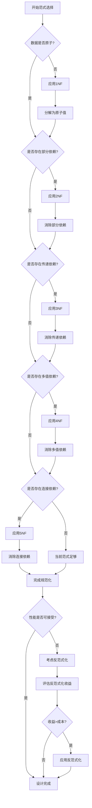
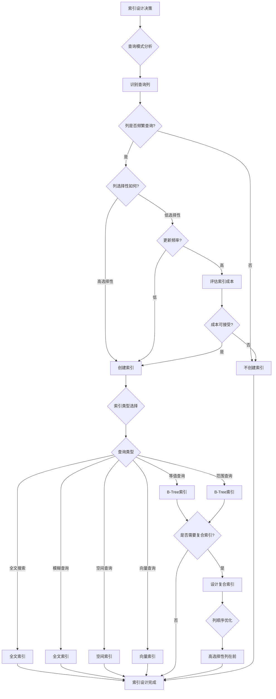
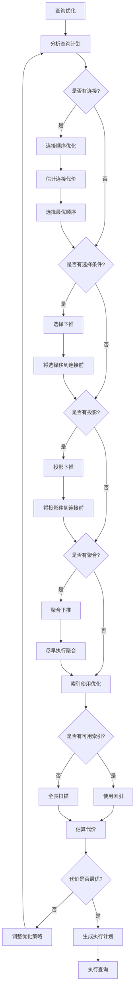
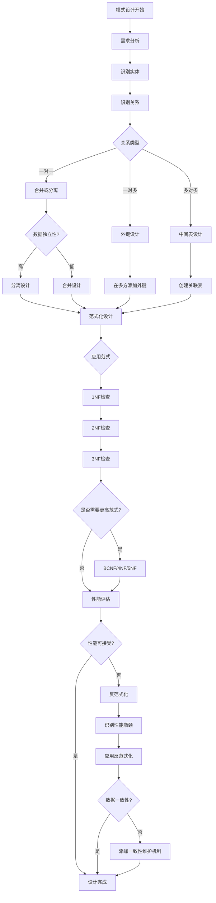
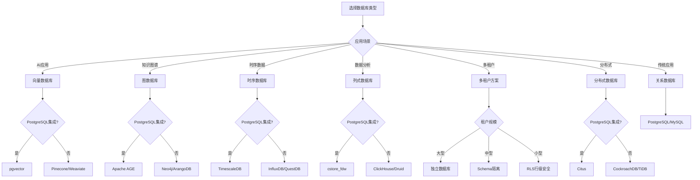
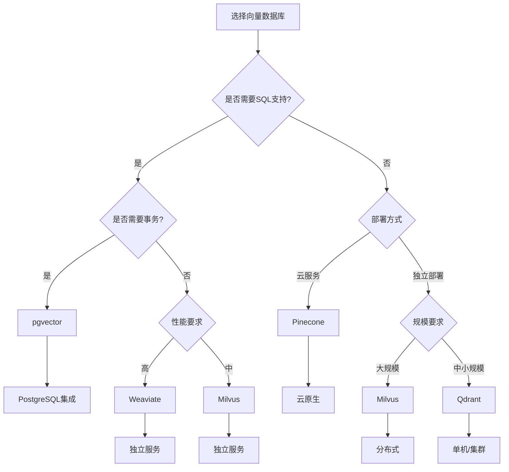
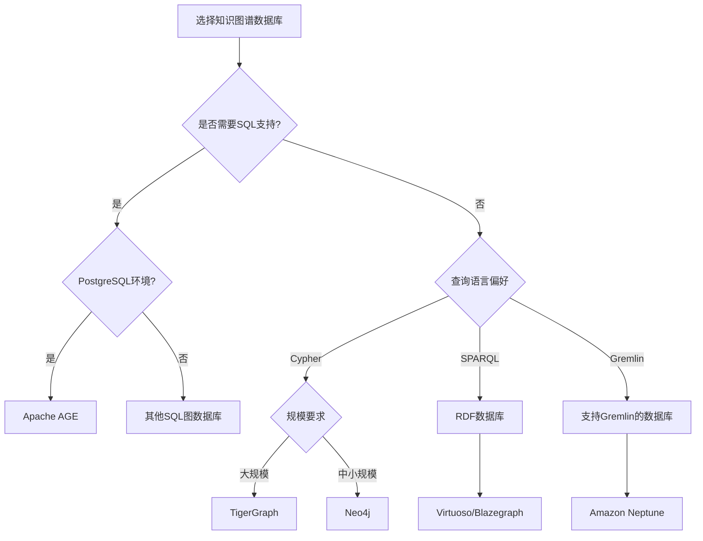
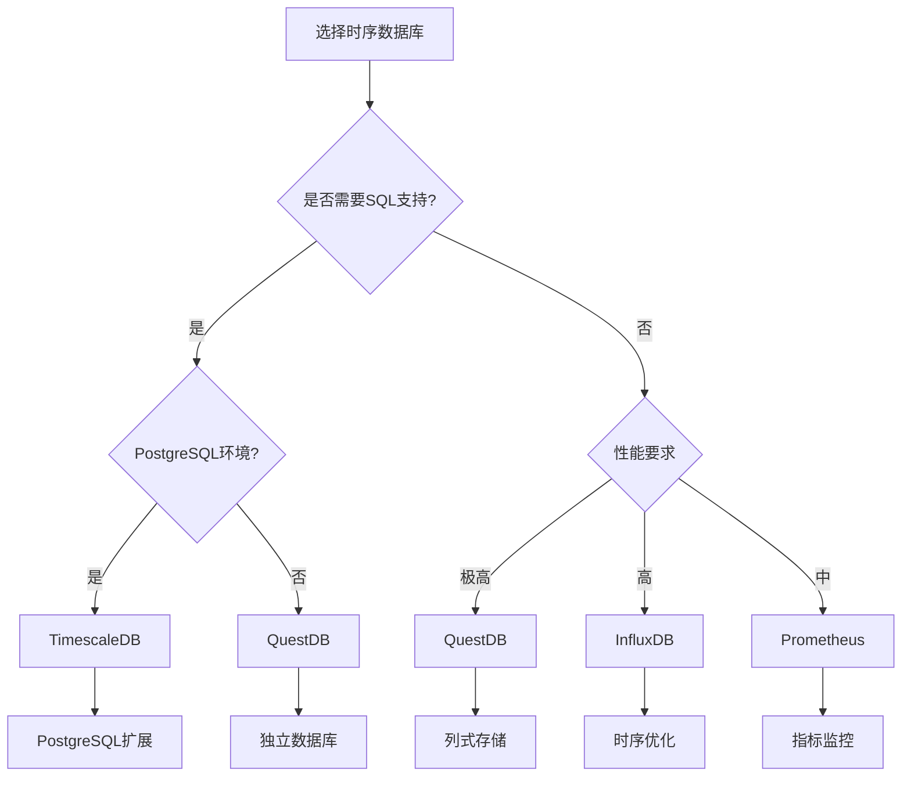
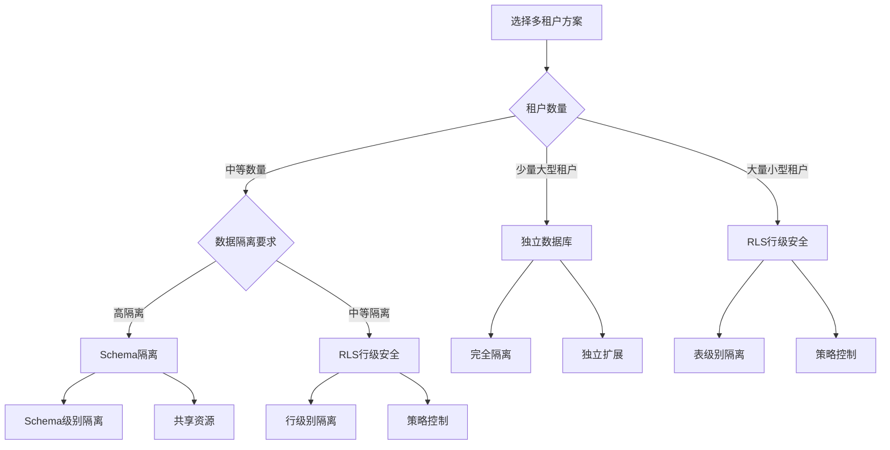

# 论证决策树库：数据库设计论证的决策树集合

> **创建日期**：2025-01-15
> **最后更新**：2025-01-15
> **版本**：v1.0
> **状态**：实施中

---

## 📋 目录

- [论证决策树库：数据库设计论证的决策树集合](#论证决策树库数据库设计论证的决策树集合)
  - [📋 目录](#-目录)
  - [1. 概述](#1-概述)
  - [2. 范式选择决策树](#2-范式选择决策树)
    - [2.1. 范式选择完整决策树](#21-范式选择完整决策树)
    - [2.2. 范式选择论证矩阵](#22-范式选择论证矩阵)
  - [3. 索引设计决策树](#3-索引设计决策树)
    - [3.1. 索引设计完整决策树](#31-索引设计完整决策树)
    - [3.2. 索引设计论证矩阵](#32-索引设计论证矩阵)
  - [4. 查询优化决策树](#4-查询优化决策树)
    - [4.1. 查询优化完整决策树](#41-查询优化完整决策树)
    - [4.2. 查询优化策略矩阵](#42-查询优化策略矩阵)
  - [5. 模式设计决策树](#5-模式设计决策树)
    - [5.1. 模式设计完整决策树](#51-模式设计完整决策树)
    - [5.2. 模式设计权衡矩阵](#52-模式设计权衡矩阵)
  - [6. PostgreSQL扩展选择决策树](#6-postgresql扩展选择决策树)
    - [6.1. 数据库类型选择决策树](#61-数据库类型选择决策树)
    - [6.2. 向量数据库选择决策树](#62-向量数据库选择决策树)
    - [6.3. 知识图谱数据库选择决策树](#63-知识图谱数据库选择决策树)
    - [6.4. 时序数据库选择决策树](#64-时序数据库选择决策树)
    - [6.5. 多租户方案选择决策树](#65-多租户方案选择决策树)
    - [6.6. PostgreSQL扩展选择论证矩阵](#66-postgresql扩展选择论证矩阵)
  - [7. 参考资料](#7-参考资料)

---

## 1. 概述

本文档提供数据库设计过程中各种决策的决策树，帮助系统化地进行设计决策和论证。

---

## 2. 范式选择决策树

### 2.1. 范式选择完整决策树

### 2.2. 范式选择论证矩阵

| 范式 | 消除问题 | 优点 | 缺点 | 适用场景 | 选择理由 |
|------|---------|------|------|---------|---------|
| **1NF** | 非原子值 | 数据原子性 | 可能冗余 | 所有场景 | 基础要求 |
| **2NF** | 部分依赖 | 减少冗余 | 增加表数 | 有复合主键 | 消除部分依赖 |
| **3NF** | 传递依赖 | 进一步减少冗余 | 可能影响性能 | 一般应用 | 平衡冗余和性能 |
| **BCNF** | 所有依赖 | 最强规范化 | 可能丢失依赖 | 严格要求 | 最强一致性 |
| **4NF** | 多值依赖 | 消除多值冗余 | 复杂度高 | 特殊场景 | 处理多值属性 |
| **5NF** | 连接依赖 | 完全规范化 | 过度分解 | 理论研究 | 理论完备性 |

---

## 3. 索引设计决策树

### 3.1. 索引设计完整决策树

### 3.2. 索引设计论证矩阵

| 索引类型 | 查询类型 | 写入性能 | 空间开销 | 维护成本 | 选择标准 |
|---------|---------|---------|---------|---------|---------|
| **B-Tree** | 等值、范围 | ⭐⭐⭐⭐ | ⭐⭐⭐ | ⭐⭐⭐ | 通用场景 |
| **Hash** | 等值查询 | ⭐⭐⭐⭐⭐ | ⭐⭐⭐⭐ | ⭐⭐⭐⭐ | 纯等值查询 |
| **全文索引** | 文本搜索 | ⭐⭐⭐ | ⭐⭐⭐⭐ | ⭐⭐⭐⭐ | 文本内容 |
| **空间索引** | 空间查询 | ⭐⭐⭐ | ⭐⭐⭐⭐ | ⭐⭐⭐⭐ | 地理数据 |
| **向量索引** | 相似度查询 | ⭐⭐⭐ | ⭐⭐⭐⭐⭐ | ⭐⭐⭐⭐ | 向量数据 |

---

## 4. 查询优化决策树

### 4.1. 查询优化完整决策树

### 4.2. 查询优化策略矩阵

| 优化策略 | 适用场景 | 性能提升 | 复杂度 | 风险 |
|---------|---------|---------|--------|------|
| **选择下推** | 有选择条件 | ⭐⭐⭐⭐⭐ | ⭐⭐ | 低 |
| **投影下推** | 有投影操作 | ⭐⭐⭐⭐ | ⭐⭐⭐ | 低 |
| **连接重排序** | 多个连接 | ⭐⭐⭐ | ⭐⭐⭐⭐ | 中 |
| **索引使用** | 有可用索引 | ⭐⭐⭐⭐⭐ | ⭐⭐ | 低 |
| **物化视图** | 重复查询 | ⭐⭐⭐⭐ | ⭐⭐⭐⭐⭐ | 中 |

---

## 5. 模式设计决策树

### 5.1. 模式设计完整决策树

### 5.2. 模式设计权衡矩阵

| 设计选择 | 一致性 | 性能 | 可维护性 | 复杂度 | 推荐场景 |
|---------|--------|------|---------|--------|---------|
| **高范式化** | ⭐⭐⭐⭐⭐ | ⭐⭐ | ⭐⭐⭐⭐ | ⭐⭐⭐ | 事务系统 |
| **适度范式化** | ⭐⭐⭐⭐ | ⭐⭐⭐ | ⭐⭐⭐⭐ | ⭐⭐ | 一般应用 |
| **低范式化** | ⭐⭐⭐ | ⭐⭐⭐⭐⭐ | ⭐⭐⭐ | ⭐⭐⭐ | 分析系统 |
| **混合设计** | ⭐⭐⭐⭐ | ⭐⭐⭐⭐ | ⭐⭐⭐ | ⭐⭐⭐⭐ | 复杂系统 |

---

## 6. PostgreSQL扩展选择决策树

### 6.1. 数据库类型选择决策树

### 6.2. 向量数据库选择决策树

### 6.3. 知识图谱数据库选择决策树

### 6.4. 时序数据库选择决策树

### 6.5. 多租户方案选择决策树

### 6.6. PostgreSQL扩展选择论证矩阵

| 扩展类型 | 扩展名称 | 选择理由 | 适用场景 | 性能 | 易用性 |
|---------|---------|---------|---------|------|--------|
| **向量数据库** | pgvector | SQL集成、事务支持 | AI应用、推荐系统 | ⭐⭐⭐⭐ | ⭐⭐⭐⭐ |
| **知识图谱** | Apache AGE | PostgreSQL集成、Cypher支持 | 知识图谱、社交网络 | ⭐⭐⭐⭐ | ⭐⭐⭐ |
| **时序数据库** | TimescaleDB | SQL兼容、易用性高 | IoT、监控系统 | ⭐⭐⭐⭐⭐ | ⭐⭐⭐⭐⭐ |
| **列式存储** | cstore_fdw | PostgreSQL集成 | 数据分析、数据仓库 | ⭐⭐⭐ | ⭐⭐⭐ |
| **多租户** | RLS | 内置支持、灵活 | SaaS应用 | ⭐⭐⭐⭐ | ⭐⭐⭐⭐ |
| **分布式** | Citus | PostgreSQL兼容、横向扩展 | 微服务、大数据 | ⭐⭐⭐⭐ | ⭐⭐⭐ |

---

## 7. 参考资料

- [核心定理证明](../03-形式化证明/03.01-核心定理证明.md)
- [关系数据库理论](../01-理论模型/01.02-关系数据库理论.md)
- [多维矩阵库](./02.02-多维矩阵库.md)

---

**最后更新**：2025-01-15
**维护者**：Data-Science Team
**状态**：实施中
