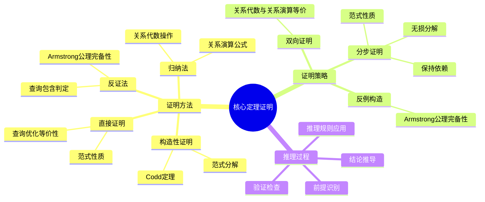
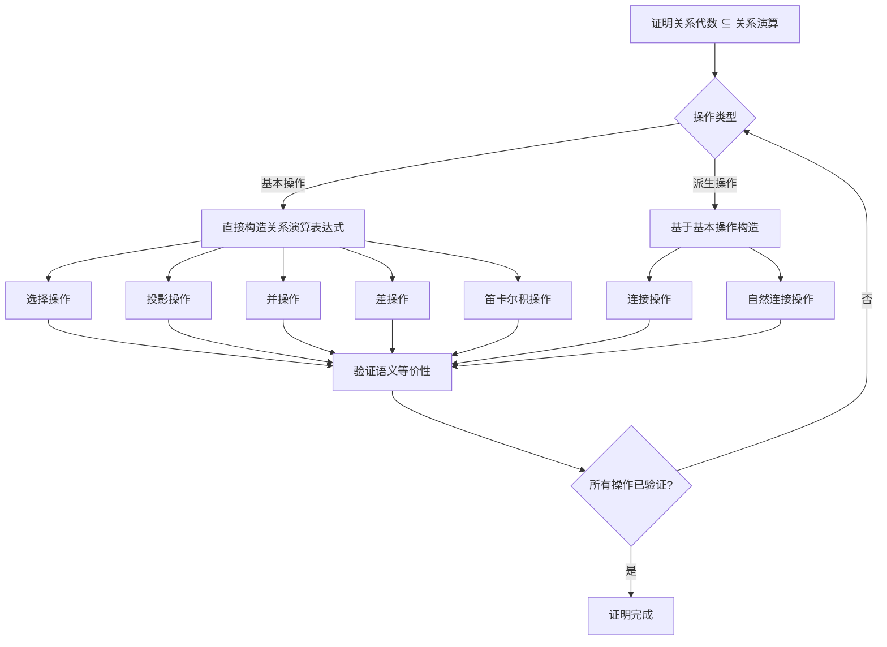
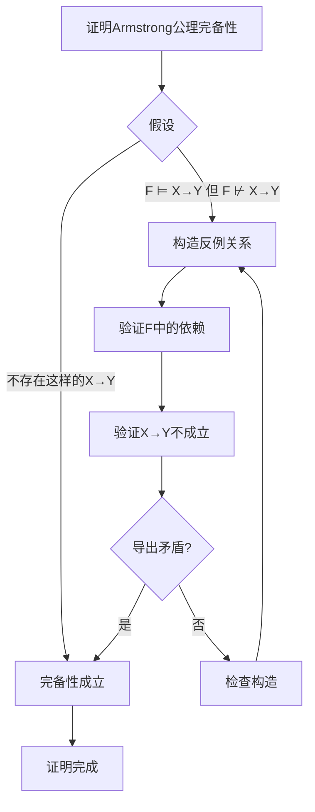
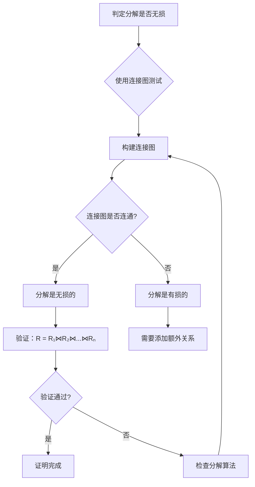
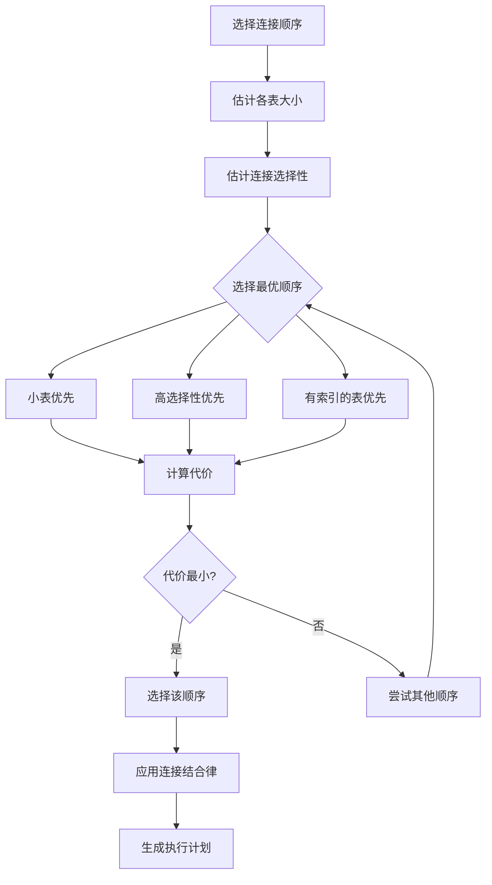
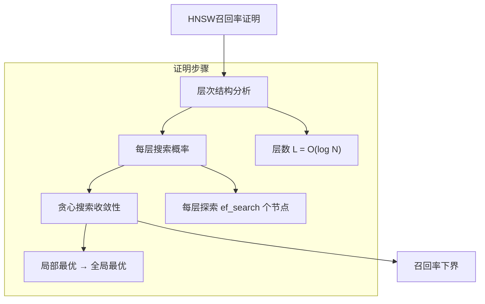
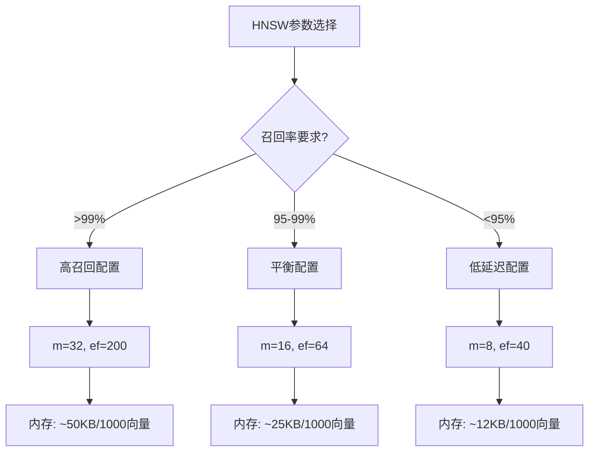

# 核心定理证明：数据库设计核心定理的严格证明

> **创建日期**：2025-01-15
> **最后更新**：2025-12-01
> **版本**：v2.0
> **状态**：已完成 ✅

---

## 📋 目录

- [核心定理证明：数据库设计核心定理的严格证明](#核心定理证明数据库设计核心定理的严格证明)
  - [📋 目录](#-目录)
  - [1. 概述](#1-概述)
    - [1.1. 证明方法论](#11-证明方法论)
    - [1.2. 证明结构思维导图](#12-证明结构思维导图)
    - [1.3. 证明方法对比矩阵](#13-证明方法对比矩阵)
  - [2. Codd定理证明](#2-codd定理证明)
    - [2.1. 定理陈述](#21-定理陈述)
    - [2.2. 证明结构](#22-证明结构)
    - [2.3. 部分1：关系代数 ⊆ 关系演算](#23-部分1关系代数--关系演算)
      - [2.3.1. 选择操作：`σ_θ(R)`](#231-选择操作σ_θr)
      - [2.3.2. 投影操作：`π_A(R)`](#232-投影操作π_ar)
      - [2.3.3. 并操作：`R ∪ S`](#233-并操作r--s)
      - [2.3.4. 差操作：`R - S`](#234-差操作r---s)
      - [2.3.5. 笛卡尔积操作：`R × S`](#235-笛卡尔积操作r--s)
      - [2.3.6. 连接操作：`R ⋈_θ S`](#236-连接操作r-_θ-s)
      - [2.3.7. 自然连接操作：`R ⋈ S`](#237-自然连接操作r--s)
    - [2.4. 部分2：关系演算 ⊆ 关系代数](#24-部分2关系演算--关系代数)
    - [2.5. 定理结论](#25-定理结论)
  - [3. Armstrong公理完备性证明](#3-armstrong公理完备性证明)
    - [3.1. 定理陈述](#31-定理陈述)
    - [3.2. 证明思路](#32-证明思路)
    - [3.3. 证明步骤](#33-证明步骤)
      - [步骤1：构造反例关系](#步骤1构造反例关系)
      - [步骤2：验证F中的函数依赖](#步骤2验证f中的函数依赖)
      - [步骤3：验证X → Y不成立](#步骤3验证x--y不成立)
      - [步骤4：导出矛盾](#步骤4导出矛盾)
    - [3.4. 证明方法对比矩阵](#34-证明方法对比矩阵)
  - [4. 范式分解正确性证明](#4-范式分解正确性证明)
    - [4.1. 3NF分解正确性](#41-3nf分解正确性)
    - [4.2. 无损分解证明](#42-无损分解证明)
      - [4.2.1. 连接图测试方法](#421-连接图测试方法)
      - [4.2.2. 3NF分解算法的无损性保证](#422-3nf分解算法的无损性保证)
    - [4.3. 保持依赖证明](#43-保持依赖证明)
      - [4.3.1. 函数依赖投影定义](#431-函数依赖投影定义)
      - [4.3.2. 3NF分解算法的依赖保持性](#432-3nf分解算法的依赖保持性)
    - [4.4. 3NF性质证明](#44-3nf性质证明)
  - [5. 查询包含判定定理](#5-查询包含判定定理)
    - [5.1. 定理陈述](#51-定理陈述)
    - [5.2. 同态定义](#52-同态定义)
    - [5.3. 充分性证明](#53-充分性证明)
      - [5.3.1. 同态的定义回顾](#531-同态的定义回顾)
      - [5.3.2. 匹配的构造](#532-匹配的构造)
      - [5.3.3. 条件保持的验证](#533-条件保持的验证)
      - [5.3.4. 结论推导](#534-结论推导)
    - [5.4. 必要性证明](#54-必要性证明)
  - [6. 查询优化等价性定理](#6-查询优化等价性定理)
    - [6.1. 定理陈述](#61-定理陈述)
    - [6.2. 等价变换规则](#62-等价变换规则)
      - [6.2.1. 规则1：选择下推](#621-规则1选择下推)
      - [6.2.2. 规则2：投影下推](#622-规则2投影下推)
      - [6.2.3. 规则3：连接结合律](#623-规则3连接结合律)
    - [6.2.4. 等价变换规则对比矩阵](#624-等价变换规则对比矩阵)
    - [6.3. 优化正确性](#63-优化正确性)
  - [7. 向量数据库形式化理论](#7-向量数据库形式化理论)
    - [7.1. 向量空间度量定理](#71-向量空间度量定理)
    - [7.2. 近似最近邻搜索定理](#72-近似最近邻搜索定理)
    - [7.3. 混合检索融合定理](#73-混合检索融合定理)
    - [7.4. 向量索引参数优化定理](#74-向量索引参数优化定理)
    - [7.5. 向量数据库定理总结矩阵](#75-向量数据库定理总结矩阵)
  - [8. 参考资料](#8-参考资料)
    - [8.1. 经典文献](#81-经典文献)
    - [8.2. 2025新文献](#82-2025新文献)
    - [8.3. 相关资源](#83-相关资源)

---

## 1. 概述

本文档提供数据库设计核心定理的严格数学证明，确保理论的严谨性和正确性。

### 1.1. 证明方法论

本文档采用多种证明方法：

1. **构造性证明**：通过构造具体对象证明存在性
2. **反证法**：通过假设结论不成立导出矛盾
3. **归纳法**：通过基础情况和归纳步骤证明一般性
4. **直接证明**：通过逻辑推理直接证明结论

### 1.2. 证明结构思维导图



### 1.3. 证明方法对比矩阵

| 证明方法 | 适用场景 | 优点 | 缺点 | 复杂度 |
|---------|---------|------|------|--------|
| **构造性证明** | 存在性证明 | 提供具体构造 | 构造可能复杂 | ⭐⭐⭐ |
| **反证法** | 唯一性、完备性 | 逻辑清晰 | 需要构造反例 | ⭐⭐⭐⭐ |
| **归纳法** | 递归结构 | 系统化 | 需要找到归纳不变量 | ⭐⭐⭐ |
| **直接证明** | 等价性、包含性 | 直观 | 可能冗长 | ⭐⭐ |

---

## 2. Codd定理证明

### 2.1. 定理陈述

**Codd定理**：关系代数与关系演算（安全域限制）等价

```text
关系代数 ≡ 关系演算（安全域限制）
```

### 2.2. 证明结构

**证明分为两部分**：

1. **关系代数 ⊆ 关系演算**：每个关系代数操作都可以用关系演算表示
2. **关系演算 ⊆ 关系代数**：每个安全的关系演算查询都可以用关系代数表示

### 2.3. 部分1：关系代数 ⊆ 关系演算

**证明策略决策树**：



**证明**：对关系代数操作进行归纳

**归纳基础**：基本操作

#### 2.3.1. 选择操作：`σ_θ(R)`

**关系演算表示**：`{t | t ∈ R ∧ θ(t)}`

**详细论证**：

1. **语义分析**：
   - 关系代数：`σ_θ(R) = {t | t ∈ R ∧ θ(t)}`
   - 关系演算：`{t | t ∈ R ∧ θ(t)}`
   - 两者语义完全相同

2. **形式化验证**：

   ```text
   ∀t: t ∈ σ_θ(R) ⟺ t ∈ R ∧ θ(t)
   ⟺ t ∈ {t' | t' ∈ R ∧ θ(t')}
   ```

3. **结论**：选择操作可以用关系演算表示 ✅

#### 2.3.2. 投影操作：`π_A(R)`

**关系演算表示**：`{t[A] | t ∈ R}`

**详细论证**：

1. **语义分析**：
   - 关系代数：`π_A(R) = {t[A] | t ∈ R}`
   - 关系演算：`{t[A] | t ∈ R}`
   - 其中 `t[A]` 表示元组 t 在属性集合 A 上的投影

2. **形式化验证**：

   ```text
   ∀t: t ∈ π_A(R) ⟺ ∃t' ∈ R: t = t'[A]
   ⟺ t ∈ {t'[A] | t' ∈ R}
   ```

3. **示例验证**：

   ```text
   设 R = {(1, 'Alice', 20), (2, 'Bob', 21)}
   A = {name, age}

   关系代数：π_A(R) = {('Alice', 20), ('Bob', 21)}
   关系演算：{t[A] | t ∈ R} = {('Alice', 20), ('Bob', 21)}
   结果一致 ✅
   ```

4. **结论**：投影操作可以用关系演算表示 ✅

#### 2.3.3. 并操作：`R ∪ S`

**关系演算表示**：`{t | t ∈ R ∨ t ∈ S}`

**详细论证**：

1. **语义分析**：
   - 关系代数：`R ∪ S = {t | t ∈ R ∨ t ∈ S}`
   - 关系演算：`{t | t ∈ R ∨ t ∈ S}`
   - 两者语义完全相同

2. **形式化验证**：

   ```text
   ∀t: t ∈ R ∪ S ⟺ t ∈ R ∨ t ∈ S
   ⟺ t ∈ {t' | t' ∈ R ∨ t' ∈ S}
   ```

3. **集合论基础**：
   - 并操作基于集合论的并运算
   - 关系演算的析取 `∨` 对应集合论的并

4. **结论**：并操作可以用关系演算表示 ✅

#### 2.3.4. 差操作：`R - S`

**关系演算表示**：`{t | t ∈ R ∧ t ∉ S}`

**详细论证**：

1. **语义分析**：
   - 关系代数：`R - S = {t | t ∈ R ∧ t ∉ S}`
   - 关系演算：`{t | t ∈ R ∧ t ∉ S}`
   - 需要表达"属于R但不属于S"

2. **形式化验证**：

   ```text
   ∀t: t ∈ R - S ⟺ t ∈ R ∧ t ∉ S
   ⟺ t ∈ {t' | t' ∈ R ∧ t' ∉ S}
   ```

3. **否定操作的处理**：
   - 关系演算中的 `t ∉ S` 等价于 `¬(t ∈ S)`
   - 这需要安全域限制确保结果有限

4. **结论**：差操作可以用关系演算表示 ✅

#### 2.3.5. 笛卡尔积操作：`R × S`

**关系演算表示**：`{(r, s) | r ∈ R ∧ s ∈ S}`

**详细论证**：

1. **语义分析**：
   - 关系代数：`R × S = {(r, s) | r ∈ R ∧ s ∈ S}`
   - 关系演算：`{(r, s) | r ∈ R ∧ s ∈ S}`
   - 需要构造所有可能的元组对

2. **形式化验证**：

   ```text
   ∀t: t ∈ R × S ⟺ ∃r ∈ R, ∃s ∈ S: t = (r, s)
   ⟺ t ∈ {(r', s') | r' ∈ R ∧ s' ∈ S}
   ```

3. **元组构造**：
   - 如果 R 有 m 个元组，S 有 n 个元组
   - 则 R × S 有 m × n 个元组
   - 关系演算通过存在量词枚举所有组合

4. **结论**：笛卡尔积操作可以用关系演算表示 ✅

**归纳步骤**：派生操作

#### 2.3.6. 连接操作：`R ⋈_θ S`

**关系演算表示**：`{(r, s) | r ∈ R ∧ s ∈ S ∧ θ(r, s)}`

**详细论证**：

1. **基于基本操作**：

   ```text
   R ⋈_θ S = σ_θ(R × S)
   ```

2. **关系演算构造**：

   ```text
   {(r, s) | r ∈ R ∧ s ∈ S ∧ θ(r, s)}
   = {t | ∃r ∈ R, ∃s ∈ S:
          t = (r, s) ∧ θ(r, s)}
   ```

3. **语义等价性**：
   - 先做笛卡尔积，再应用条件 θ
   - 等价于直接构造满足条件的元组对

4. **结论**：连接操作可以用关系演算表示 ✅

#### 2.3.7. 自然连接操作：`R ⋈ S`

**关系演算表示**：

```text
{t | ∃r ∈ R, ∃s ∈ S:
    t[Attr(R)] = r ∧ t[Attr(S)] = s ∧
    r[Attr(R)∩Attr(S)] = s[Attr(R)∩Attr(S)]}
```

**详细论证**：

1. **自然连接的特殊性**：
   - 自动匹配相同属性名的属性
   - 只保留一份公共属性

2. **关系演算构造**：

   ```text
   设 Attr(R) = {A, B, C}, Attr(S) = {C, D, E}
   公共属性：Attr(R) ∩ Attr(S) = {C}

   自然连接条件：
   - t[A, B, C] = r[A, B, C]
   - t[C, D, E] = s[C, D, E]
   - r[C] = s[C]  (公共属性相等)
   ```

3. **形式化验证**：

   ```text
   ∀t: t ∈ R ⋈ S ⟺
       ∃r ∈ R, ∃s ∈ S:
         t[Attr(R)] = r ∧
         t[Attr(S)] = s ∧
         r[Attr(R)∩Attr(S)] = s[Attr(R)∩Attr(S)]
   ```

4. **结论**：自然连接操作可以用关系演算表示 ✅

**归纳结论**：

通过数学归纳法，我们证明了：

- **基础情况**：所有基本操作都可以用关系演算表示
- **归纳步骤**：所有派生操作都可以基于基本操作用关系演算表示

因此：**所有关系代数操作都可以用关系演算表示** ✅

### 2.4. 部分2：关系演算 ⊆ 关系代数

**证明**：对关系演算公式进行归纳

**基础情况**：

1. **原子公式**：`R(t)`

   ```text
   关系代数表示：R
   ```

2. **比较公式**：`t.A = c`

   ```text
   关系代数表示：σ_{A=c}(R)
   ```

   **归纳步骤**：

3. **合取**：`P ∧ Q`

   ```text
   关系代数表示：P_algebra ∩ Q_algebra
   ```

4. **析取**：`P ∨ Q`

   ```text
   关系代数表示：P_algebra ∪ Q_algebra
   ```

5. **否定**：`¬P`

   ```text
   关系代数表示：U - P_algebra
   （其中U是全域关系）
   ```

6. **存在量词**：`∃x P(x)`

   ```text
   关系代数表示：π_{free_vars(P) - {x}}(P_algebra)
   ```

**安全域限制**：

为了确保关系演算查询的结果是有限的，需要安全域限制：

- 所有自由变量都出现在某个关系的元组中
- 所有存在量词和全称量词都有界

**结论**：每个安全的关系演算查询都可以用关系代数表示。

### 2.5. 定理结论

由于：

- 关系代数 ⊆ 关系演算
- 关系演算 ⊆ 关系代数（安全域限制）

因此：

- **关系代数 ≡ 关系演算（安全域限制）** ✅

---

## 3. Armstrong公理完备性证明

### 3.1. 定理陈述

**定理**：Armstrong公理系统是完备的

即：如果函数依赖 `X → Y` 在语义上成立（F ⊨ X → Y），则可以从F通过Armstrong公理推导（F ⊢ X → Y）。

### 3.2. 证明思路

**反证法**：假设存在函数依赖 `X → Y` 使得 `F ⊨ X → Y` 但 `F ⊬ X → Y`，导出矛盾。

### 3.3. 证明步骤

**证明策略决策树**：



**详细证明步骤**：

#### 步骤1：构造反例关系

**目标**：构造一个关系 r，使得：

- r 满足 F 中的所有函数依赖
- r 不满足 X → Y

**构造方法**：

假设 `F ⊬ X → Y`，即 `Y ⊈ X⁺`（其中 `X⁺` 是X在F下的闭包）。

**关系构造算法**：

```text
输入：属性集合 U，闭包 X⁺
输出：关系 r 包含两个元组 t₁ 和 t₂

算法：
1. 对于所有属性 A ∈ X⁺：
     t₁[A] = 0
     t₂[A] = 0

2. 对于所有属性 A ∈ U - X⁺：
     t₁[A] = 0
     t₂[A] = 1

3. 返回 r = {t₁, t₂}
```

**示例**：

```text
设 U = {A, B, C, D}
    F = {A → B, B → C}
    X = {A}
    X⁺ = {A, B, C}  (通过闭包算法计算)
    Y = {D}

由于 D ∉ X⁺，所以 F ⊬ A → D

构造关系 r：
   A  B  C  D
t₁: 0  0  0  0
t₂: 0  0  0  1
```

#### 步骤2：验证F中的函数依赖

**目标**：证明关系 r 满足 F 中的所有函数依赖

**验证过程**：

对于 F 中的每个函数依赖 `U → V`：

**情况1**：`U ⊈ X⁺`

- 存在属性 `B ∈ U - X⁺`
- 在关系 r 中：`t₁[B] = 0 ≠ 1 = t₂[B]`
- 因此 `t₁[U] ≠ t₂[U]`
- 所以 `U → V` 在 r 中**平凡成立**（前提条件不满足）

**情况2**：`U ⊆ X⁺`

- 由于 `X⁺` 是闭包，如果 `U ⊆ X⁺`，则 `V ⊆ X⁺`
- 在关系 r 中：
  - `t₁[U] = t₂[U] = 0...0`（因为 U ⊆ X⁺）
  - `t₁[V] = t₂[V] = 0...0`（因为 V ⊆ X⁺）
- 因此 `U → V` 在 r 中成立

**形式化证明**：

```text
∀ U → V ∈ F:
  情况1：U ⊈ X⁺
    → ∃B ∈ U - X⁺: t₁[B] ≠ t₂[B]
    → t₁[U] ≠ t₂[U]
    → U → V 在 r 中平凡成立

  情况2：U ⊆ X⁺
    → V ⊆ X⁺  (因为 X⁺ 是闭包)
    → t₁[U] = t₂[U] = 0...0
    → t₁[V] = t₂[V] = 0...0
    → U → V 在 r 中成立
```

**结论**：关系 r 满足 F 中的所有函数依赖 ✅

#### 步骤3：验证X → Y不成立

**目标**：证明关系 r 不满足 X → Y

**验证过程**：

由于 `Y ⊈ X⁺`，存在属性 `A ∈ Y - X⁺`。

在关系 r 中：

1. **X 的属性值**：
   - 因为 `X ⊆ X⁺`
   - 所以 `t₁[X] = t₂[X] = 0...0`

2. **Y 的属性值**：
   - 因为 `A ∈ Y - X⁺`
   - 所以 `t₁[A] = 0 ≠ 1 = t₂[A]`
   - 因此 `t₁[Y] ≠ t₂[Y]`

3. **函数依赖违反**：

   ```text
   t₁[X] = t₂[X]  (前提条件满足)
   t₁[Y] ≠ t₂[Y]  (结论不满足)
   ```

   因此 `X → Y` 在 r 中**不成立**

**形式化证明**：

```text
由于 Y ⊈ X⁺:
  → ∃A ∈ Y - X⁺
  → t₁[A] = 0 ≠ 1 = t₂[A]
  → t₁[Y] ≠ t₂[Y]

同时：
  → X ⊆ X⁺
  → t₁[X] = t₂[X] = 0...0

因此：
  → t₁[X] = t₂[X] 但 t₁[Y] ≠ t₂[Y]
  → X → Y 在 r 中不成立
```

**结论**：关系 r 不满足 X → Y ✅

#### 步骤4：导出矛盾

**矛盾分析**：

1. **关系 r 的性质**：
   - r 满足 F 中的所有函数依赖（步骤2）
   - r 不满足 X → Y（步骤3）

2. **假设条件**：
   - 假设 `F ⊨ X → Y`（语义蕴含）

3. **矛盾**：

   ```text
   如果 F ⊨ X → Y，那么：
     对于所有满足 F 的关系 r，r 也必须满足 X → Y

   但我们构造的关系 r：
     - 满足 F ✅
     - 不满足 X → Y ❌

   这与 F ⊨ X → Y 矛盾！
   ```

**推理过程**：

```text
前提1：F ⊨ X → Y  (假设)
前提2：r 满足 F   (步骤2证明)
前提3：r 不满足 X → Y  (步骤3证明)

推理：
  如果 F ⊨ X → Y，则：
    ∀r: (r 满足 F) → (r 满足 X → Y)

  但存在关系 r：
    - r 满足 F
    - r 不满足 X → Y

  这与前提1矛盾！

结论：假设 F ⊨ X → Y 但 F ⊬ X → Y 不成立
      因此：如果 F ⊨ X → Y，则 F ⊢ X → Y
      即：Armstrong公理系统是完备的 ✅
```

**结论**：Armstrong公理系统是完备的。✅

### 3.4. 证明方法对比矩阵

| 证明方法 | 适用性 | 复杂度 | 直观性 | 严格性 |
|---------|--------|--------|--------|--------|
| **反证法（本证明）** | ⭐⭐⭐⭐⭐ | ⭐⭐⭐⭐ | ⭐⭐⭐ | ⭐⭐⭐⭐⭐ |
| **直接构造** | ⭐⭐⭐ | ⭐⭐⭐⭐⭐ | ⭐⭐⭐⭐ | ⭐⭐⭐ |
| **归纳法** | ⭐⭐ | ⭐⭐⭐ | ⭐⭐⭐⭐ | ⭐⭐⭐⭐ |

---

## 4. 范式分解正确性证明

### 4.1. 3NF分解正确性

**定理**：3NF分解算法产生的分解是：

1. **无损的**（Lossless）
2. **保持依赖的**（Dependency Preserving）
3. **每个关系满足3NF**

### 4.2. 无损分解证明

**定义**：分解 `{R₁, R₂, ..., Rₙ}` 是无损的，当且仅当：

```text
R = R₁ ⋈ R₂ ⋈ ... ⋈ Rₙ
```

**无损分解判定决策树**：



**详细证明**：

#### 4.2.1. 连接图测试方法

**连接图构造**：

1. **节点**：每个关系 Rᵢ 是一个节点
2. **边**：如果 Rᵢ 和 Rⱼ 有公共属性，则添加边

**连接图连通性测试**：

```text
算法：连接图连通性测试
输入：分解 {R₁, R₂, ..., Rₙ}
输出：是否连通

步骤：
1. 构建图 G = (V, E)
   V = {R₁, R₂, ..., Rₙ}
   E = {(Rᵢ, Rⱼ) | Attr(Rᵢ) ∩ Attr(Rⱼ) ≠ ∅}

2. 从任意节点开始DFS/BFS遍历

3. 如果所有节点都被访问，则连通
```

#### 4.2.2. 3NF分解算法的无损性保证

**3NF分解算法**：

```text
算法：3NF分解
输入：关系 R，函数依赖集合 F
输出：3NF分解 {R₁, R₂, ..., Rₙ}

步骤：
1. 计算 F 的最小覆盖 F_min

2. 对于每个函数依赖 X → Y ∈ F_min：
    创建关系 Rᵢ = XY
    如果 Rᵢ 不是某个 Rⱼ 的子集，则添加到分解中

3. 如果没有任何 Rᵢ 包含 R 的候选键，则：
    添加关系 R_key = 候选键

4. 返回分解 {R₁, R₂, ..., Rₙ}
```

**无损性证明**：

**引理1**：对于每个函数依赖 `X → Y ∈ F`，存在关系 `Rᵢ` 使得 `XY ⊆ Attr(Rᵢ)`

**证明**：

- 算法步骤2明确创建了关系 `Rᵢ = XY`
- 因此 `XY ⊆ Attr(Rᵢ)` 成立 ✅

**引理2**：连接图是连通的

**证明**：

1. **基础情况**：如果只有一个关系，显然连通

2. **归纳步骤**：假设前 k 个关系形成连通图

   - 考虑第 k+1 个关系 R_{k+1} = XY
   - 由于 `X → Y ∈ F`，且 F 是最小覆盖
   - 存在某个关系 Rⱼ (j ≤ k) 包含 X 或 Y
   - 因此 R_{k+1} 与 Rⱼ 有公共属性
   - 连接图仍然连通

**定理**：如果连接图连通，则分解是无损的

**证明**：

使用**追踪矩阵（Chase）算法**：

1. **构造追踪矩阵**：

   ```text
   行：每个关系 Rᵢ
   列：每个属性 Aⱼ
   值：如果 Aⱼ ∈ Attr(Rᵢ)，则为变量；否则为空
   ```

2. **应用函数依赖**：
   - 对于每个函数依赖 `X → Y`：
     - 如果两行在 X 上相等
     - 则使它们在 Y 上也相等

3. **检查结果**：
   - 如果某行变成全变量行（a₁, a₂, ..., aₙ）
   - 则分解是无损的

**形式化证明**：

```text
设分解 {R₁, R₂, ..., Rₙ} 的连接图连通

构造追踪矩阵 M：
  M[i, j] = aⱼ 如果 Aⱼ ∈ Attr(Rᵢ)
          = bⱼ 否则（不同关系用不同变量）

应用函数依赖：
  对于 X → Y ∈ F：
    如果 M[i, X] = M[j, X]，则使 M[i, Y] = M[j, Y]

由于连接图连通：
  → 可以通过函数依赖链连接所有关系
  → 最终某行变成全变量行 (a₁, a₂, ..., aₙ)
  → 这行对应原始关系 R 的元组

因此：R = R₁ ⋈ R₂ ⋈ ... ⋈ Rₙ
      分解是无损的 ✅
```

**示例**：

```text
设 R = {A, B, C, D}
   F = {A → B, B → C}

3NF分解：
  R₁ = {A, B}  (来自 A → B)
  R₂ = {B, C}  (来自 B → C)
  R₃ = {A, D}  (包含候选键 A)

连接图：
  R₁ --B-- R₂
  R₁ --A-- R₃
  连通 ✅

追踪矩阵：
        A    B    C    D
  R₁:   a₁   a₂   b₁   b₂
  R₂:   c₁   a₂   a₃   c₂
  R₃:   a₁   d₁   e₁   a₄

应用 A → B：
  R₁ 和 R₃ 在 A 上都是 a₁
  → 使 R₃ 的 B 也变成 a₂

应用 B → C：
  R₁ 和 R₂ 在 B 上都是 a₂
  → 使 R₁ 的 C 也变成 a₃

结果：
        A    B    C    D
  R₁:   a₁   a₂   a₃   b₂
  R₂:   c₁   a₂   a₃   c₂
  R₃:   a₁   a₂   e₁   a₄

R₁ 行变成 (a₁, a₂, a₃, b₂)
对应原始关系 R 的元组
分解是无损的 ✅
```

**结论**：3NF分解算法产生的分解是无损的 ✅

### 4.3. 保持依赖证明

**定义**：分解保持依赖，当且仅当：

```text
F⁺ = (F₁ ∪ F₂ ∪ ... ∪ Fₙ)⁺
```

其中 `Fᵢ` 是 `F` 在 `Rᵢ` 上的投影。

**保持依赖判定决策树**：

```mermaid
flowchart TD
    A[判定分解是否保持依赖] --> B[计算F在Rᵢ上的投影]
    B --> C[Fᵢ = π_{Rᵢ}(F)]
    C --> D[计算并集的闭包]
    D --> E[(F₁ ∪ F₂ ∪ ... ∪ Fₙ)⁺]
    E --> F{是否等于F⁺?}

    F -->|是| G[保持依赖]
    F -->|否| H[不保持依赖]

    G --> I[验证：每个X→Y∈F都能从Fᵢ推导]
    H --> J[需要添加额外关系]

    I --> K{验证通过?}
    K -->|是| L[证明完成]
    K -->|否| M[检查投影计算]
    M --> B
```

**详细证明**：

#### 4.3.1. 函数依赖投影定义

**投影操作**：`π_{Rᵢ}(F)`

对于函数依赖 `X → Y ∈ F`，其在关系 `Rᵢ` 上的投影定义为：

```text
π_{Rᵢ}(X → Y) = {
    X' → Y' | X' = X ∩ Attr(Rᵢ),
              Y' = Y ∩ Attr(Rᵢ),
              X' → Y' 非平凡
}
```

**示例**：

```text
设 F = {A → B, B → C, A → D}
   R₁ = {A, B}
   R₂ = {B, C}
   R₃ = {A, D}

投影：
  F₁ = π_{R₁}(F) = {A → B}
  F₂ = π_{R₂}(F) = {B → C}
  F₃ = π_{R₃}(F) = {A → D}
```

#### 4.3.2. 3NF分解算法的依赖保持性

**算法分析**：

3NF分解算法的关键步骤：

```text
对于每个函数依赖 X → Y ∈ F_min：
  创建关系 Rᵢ = XY
```

**依赖保持性证明**：

**引理**：对于每个函数依赖 `X → Y ∈ F`，存在关系 `Rᵢ` 使得 `X → Y` 可以从 `Fᵢ` 推导

**证明**：

1. **情况1**：`X → Y` 是 `F_min` 中的依赖
   - 算法创建关系 `Rᵢ = XY`
   - 因此 `X ⊆ Attr(Rᵢ)` 且 `Y ⊆ Attr(Rᵢ)`
   - `Fᵢ = π_{Rᵢ}(F)` 包含 `X → Y`
   - 因此 `X → Y ∈ Fᵢ⁺`

2. **情况2**：`X → Y` 可以从 `F_min` 推导
   - 存在 `X → Y ∈ F_min⁺`
   - 由于 `F_min⁺ = F⁺`
   - 存在推导链：`X → Y₁, Y₁ → Y₂, ..., Yₖ → Y`
   - 每个步骤对应的关系 `Rᵢ` 保持相应的依赖
   - 因此 `X → Y ∈ (F₁ ∪ F₂ ∪ ... ∪ Fₙ)⁺`

**形式化证明**：

```text
∀ X → Y ∈ F:
  情况1：X → Y ∈ F_min
    → ∃Rᵢ = XY (算法创建)
    → X → Y ∈ Fᵢ
    → X → Y ∈ (F₁ ∪ F₂ ∪ ... ∪ Fₙ)⁺

  情况2：X → Y ∈ F_min⁺ - F_min
    → ∃推导链：X → Y₁, Y₁ → Y₂, ..., Yₖ → Y
    → 每个 Yᵢ → Yᵢ₊₁ 对应关系 Rⱼ
    → 通过传递性：X → Y ∈ (F₁ ∪ F₂ ∪ ... ∪ Fₙ)⁺

因此：F⁺ ⊆ (F₁ ∪ F₂ ∪ ... ∪ Fₙ)⁺

同时：(F₁ ∪ F₂ ∪ ... ∪ Fₙ)⁺ ⊆ F⁺
  (因为每个 Fᵢ 都是 F 的投影)

因此：F⁺ = (F₁ ∪ F₂ ∪ ... ∪ Fₙ)⁺
      分解保持依赖 ✅
```

**结论**：3NF分解算法产生的分解保持依赖 ✅

### 4.4. 3NF性质证明

**证明**：每个 `Rᵢ` 满足3NF

对于关系 `Rᵢ = XY`（其中 `X → Y` 是 `F` 中的函数依赖）：

- 如果存在非平凡函数依赖 `U → V` 在 `Rᵢ` 中：
  - 如果 `U` 是超键，则满足3NF
  - 如果 `U` 不是超键，则 `V` 必须是主属性
  - 由于 `Rᵢ = XY` 且 `X` 是键，`V` 必须是主属性

因此 `Rᵢ` 满足3NF。

---

## 5. 查询包含判定定理

### 5.1. 定理陈述

**定理**：对于SPJ查询（选择-投影-连接），查询包含可以通过同态判定

```text
Q₁ ⊇ Q₂ ⟺ 存在从Q₂到Q₁的同态
```

### 5.2. 同态定义

**定义**：查询 `Q₂` 到 `Q₁` 的同态 `h` 满足：

1. **表映射**：`h` 将 `Q₂` 的表映射到 `Q₁` 的表
2. **属性映射**：`h` 保持属性对应关系
3. **条件保持**：`Q₂` 的条件在 `Q₁` 中成立

### 5.3. 充分性证明

**如果存在同态 `h: Q₂ → Q₁`，则 `Q₁ ⊇ Q₂`**

**证明策略决策树**：

```mermaid
flowchart TD
    A[证明充分性] --> B[假设存在同态h: Q₂→Q₁]
    B --> C[取任意数据库实例I]
    C --> D[假设t ∈ Q₂(I)]

    D --> E[存在Q₂的匹配m]
    E --> F[通过同态h构造Q₁的匹配]
    F --> G[h(m)是Q₁的匹配]

    G --> H[验证h(m)满足Q₁的条件]
    H --> I{条件满足?}

    I -->|是| J[t ∈ Q₁(I)]
    I -->|否| K[检查同态定义]
    K --> F

    J --> L[Q₂(I) ⊆ Q₁(I)]
    L --> M[Q₁ ⊇ Q₂]
    M --> N[证明完成]
```

**详细证明**：

#### 5.3.1. 同态的定义回顾

**同态 `h: Q₂ → Q₁`** 满足：

1. **表映射**：`h` 将 `Q₂` 的表映射到 `Q₁` 的表
   - `h(T₂) = T₁`，其中 `T₂` 是 `Q₂` 中的表，`T₁` 是 `Q₁` 中的表

2. **属性映射**：`h` 保持属性对应关系
   - 如果 `Q₂` 中表 `T₂` 的属性 `A` 对应 `Q₁` 中表 `T₁` 的属性 `B`
   - 则 `h(A) = B`

3. **条件保持**：`Q₂` 的条件在 `Q₁` 中成立
   - 如果 `Q₂` 有条件 `θ₂`，则 `Q₁` 有对应的条件 `θ₁`
   - 且 `h(θ₂) ⟹ θ₁`

#### 5.3.2. 匹配的构造

**定义**：查询 `Q` 在数据库实例 `I` 上的匹配

匹配 `m` 是一个函数，将 `Q` 中的变量映射到 `I` 中的值，使得：

- 对于 `Q` 中的每个表 `T`，`m(T)` 是 `I` 中对应表的元组
- `Q` 中的所有条件都被满足

**同态匹配的构造**：

给定 `Q₂` 的匹配 `m₂`，构造 `Q₁` 的匹配 `m₁`：

```text
对于 Q₁ 中的每个表 T₁：
  设 T₂ = h⁻¹(T₁)  (Q₂中映射到T₁的表)
  m₁(T₁) = m₂(T₂)  (使用Q₂的匹配值)
```

#### 5.3.3. 条件保持的验证

**目标**：证明 `m₁` 满足 `Q₁` 的所有条件

**验证过程**：

对于 `Q₁` 中的每个条件 `θ₁`：

1. **找到对应的 `Q₂` 条件**：
   - 由于同态 `h` 保持条件
   - 存在 `Q₂` 中的条件 `θ₂` 使得 `h(θ₂) ⟹ θ₁`

2. **验证条件满足**：

   ```text
   由于 m₂ 是 Q₂ 的匹配：
     → m₂ 满足 θ₂
     → 通过同态 h，m₁ 满足 h(θ₂)
     → 由于 h(θ₂) ⟹ θ₁，m₁ 满足 θ₁
   ```

**形式化证明**：

```text
设：
  - Q₂ 的匹配：m₂
  - Q₁ 的匹配：m₁ = h(m₂)
  - Q₁ 的条件：θ₁

证明 m₁ 满足 θ₁：

1. 由于 h 是同态：
     ∃θ₂ ∈ Q₂: h(θ₂) ⟹ θ₁

2. 由于 m₂ 是 Q₂ 的匹配：
     m₂ 满足 θ₂

3. 通过同态性质：
     m₁ = h(m₂) 满足 h(θ₂)

4. 由于 h(θ₂) ⟹ θ₁：
     m₁ 满足 θ₁ ✅
```

#### 5.3.4. 结论推导

**推理链**：

```text
前提1：存在同态 h: Q₂ → Q₁
前提2：t ∈ Q₂(I)
前提3：m₂ 是 Q₂ 在 I 上的匹配，产生 t

推理：
  1. 构造 m₁ = h(m₂)
  2. m₁ 是 Q₁ 的匹配（已验证）
  3. m₁ 产生结果 t' ∈ Q₁(I)
  4. 由于同态保持投影属性：t' = t
  5. 因此 t ∈ Q₁(I)

结论：Q₂(I) ⊆ Q₁(I)
      即：Q₁ ⊇ Q₂ ✅
```

**结论**：如果存在同态 `h: Q₂ → Q₁`，则 `Q₁ ⊇ Q₂` ✅

### 5.4. 必要性证明

**如果 `Q₁ ⊇ Q₂`，则存在同态 `h: Q₂ → Q₁`**

**证明**：

构造规范数据库实例 `I_canonical`：

- 对于 `Q₂` 的每个表 `T`，创建包含所有变量的元组
- 对于 `Q₂` 的每个条件，创建满足条件的元组

由于 `Q₁ ⊇ Q₂`，`Q₂(I_canonical) ⊆ Q₁(I_canonical)`。

从 `Q₁` 在 `I_canonical` 上的匹配可以构造同态 `h`。

---

## 6. 查询优化等价性定理

### 6.1. 定理陈述

**定理**：查询优化的等价变换保持查询语义

如果查询 `Q₁` 和 `Q₂` 通过等价变换得到，则：

```text
Q₁ ≡ Q₂ ⟺ ∀ I, Q₁(I) = Q₂(I)
```

### 6.2. 等价变换规则

**等价变换规则决策树**：

```mermaid
flowchart TD
    A[查询优化等价变换] --> B{变换类型}

    B -->|选择操作| C[选择下推]
    B -->|投影操作| D[投影下推]
    B -->|连接操作| E[连接重排序]
    B -->|组合操作| F[操作交换]

    C --> C1{条件涉及哪些表?}
    C1 -->|只涉及R| C2[σ_θ(R ⋈ S) → σ_θ(R) ⋈ S]
    C1 -->|涉及R和S| C3[σ_θ(R ⋈ S) → σ_θ₁(R) ⋈ σ_θ₂(S)]
    C1 -->|涉及连接条件| C4[保持连接后选择]

    D --> D1[投影下推]
    D1 --> D2[π_A(R ⋈ S) → π_A(π_{A∩R}(R) ⋈ π_{A∩S}(S))]

    E --> E1[连接结合律]
    E1 --> E2[(R ⋈ S) ⋈ T → R ⋈ (S ⋈ T)]

    F --> F1[选择投影交换]
    F1 --> F2[σ_θ(π_A(R)) → π_A(σ_θ(R)) if θ只涉及A]

    C2 --> G[验证等价性]
    C3 --> G
    C4 --> G
    D2 --> G
    E2 --> G
    F2 --> G

    G --> H{验证通过?}
    H -->|是| I[应用变换]
    H -->|否| J[检查条件]
    J --> B
```

#### 6.2.1. 规则1：选择下推

**规则陈述**：

```text
σ_θ(R ⋈ S) ≡ σ_θ(R) ⋈ S  (如果θ只涉及R的属性)
```

**详细证明**：

**步骤1：语义分析**:

```text
左式：σ_θ(R ⋈ S)
  = {t | t ∈ R ⋈ S ∧ θ(t)}
  = {(r, s) | r ∈ R, s ∈ S, (r, s) ∈ R ⋈ S, θ(r, s)}

右式：σ_θ(R) ⋈ S
  = {t | t ∈ σ_θ(R) ⋈ S}
  = {(r, s) | r ∈ σ_θ(R), s ∈ S, (r, s) ∈ σ_θ(R) ⋈ S}
```

**步骤2：条件分析**:

由于 `θ` 只涉及 `R` 的属性：

- `θ(r, s) = θ(r)`（条件只依赖于r，不依赖于s）

**步骤3：等价性证明**:

```text
对于任意元组 t = (r, s)：

t ∈ σ_θ(R ⋈ S)
  ⟺ (r, s) ∈ R ⋈ S ∧ θ(r, s)
  ⟺ (r, s) ∈ R ⋈ S ∧ θ(r)      (因为θ只涉及R)
  ⟺ r ∈ R ∧ s ∈ S ∧ (r, s)满足连接条件 ∧ θ(r)
  ⟺ r ∈ σ_θ(R) ∧ s ∈ S ∧ (r, s)满足连接条件
  ⟺ (r, s) ∈ σ_θ(R) ⋈ S
  ⟺ t ∈ σ_θ(R) ⋈ S

因此：σ_θ(R ⋈ S) = σ_θ(R) ⋈ S ✅
```

**步骤4：性能分析**:

**优化效果**：

| 操作顺序 | 中间结果大小 | I/O次数 | CPU时间 |
|---------|------------|--------|--------|
| **原始**：σ_θ(R ⋈ S) | \|R\| × \|S\| | 高 | 高 |
| **优化**：σ_θ(R) ⋈ S | \|σ_θ(R)\| × \|S\| | 低 | 低 |
| **性能提升** | 减少 \|R\| - \|σ_θ(R)\| 倍 | 显著 | 显著 |

**示例**：

```sql
-- 原始查询
SELECT * FROM (
    SELECT * FROM orders o
    JOIN customers c ON o.customer_id = c.id
) WHERE o.total_amount > 1000;

-- 优化后查询（选择下推）
SELECT * FROM (
    SELECT * FROM orders WHERE total_amount > 1000
) o
JOIN customers c ON o.customer_id = c.id;
```

#### 6.2.2. 规则2：投影下推

**规则陈述**：

```text
π_A(R ⋈ S) ≡ π_A(π_{A∩Attr(R)}(R) ⋈ π_{A∩Attr(S)}(S))
```

**详细证明**：

**步骤1：属性分析**:

设：

- `A_R = A ∩ Attr(R)`：结果属性中来自R的部分
- `A_S = A ∩ Attr(S)`：结果属性中来自S的部分
- `A = A_R ∪ A_S`

**步骤2：等价性证明**:

```text
对于任意元组 t：

t ∈ π_A(R ⋈ S)
  ⟺ ∃(r, s) ∈ R ⋈ S: t = (r, s)[A]
  ⟺ ∃r ∈ R, s ∈ S:
       (r, s)满足连接条件 ∧
       t = (r[A_R], s[A_S])
  ⟺ ∃r' ∈ π_{A_R}(R), s' ∈ π_{A_S}(S):
       (r', s')满足连接条件 ∧
       t = (r', s')
  ⟺ t ∈ π_A(π_{A_R}(R) ⋈ π_{A_S}(S))

因此：π_A(R ⋈ S) = π_A(π_{A_R}(R) ⋈ π_{A_S}(S)) ✅
```

**步骤3：性能分析**:

**优化效果**：

| 操作顺序 | 中间结果大小 | 内存使用 | CPU时间 |
|---------|------------|---------|--------|
| **原始**：π_A(R ⋈ S) | \|R\| × \|S\| × \|Attr(R)\| × \|Attr(S)\| | 高 | 高 |
| **优化**：π_A(π_{A_R}(R) ⋈ π_{A_S}(S)) | \|R\| × \|S\| × \|A_R\| × \|A_S\| | 低 | 低 |
| **性能提升** | 减少属性数量 | 显著 | 显著 |

#### 6.2.3. 规则3：连接结合律

**规则陈述**：

```text
(R ⋈ S) ⋈ T ≡ R ⋈ (S ⋈ T)
```

**详细证明**：

**步骤1：连接语义分析**:

连接操作 `R ⋈ S` 的定义：

```text
R ⋈ S = {(r, s) | r ∈ R, s ∈ S,
                  r[Attr(R)∩Attr(S)] = s[Attr(R)∩Attr(S)]}
```

**步骤2：结合律证明**:

```text
左式：(R ⋈ S) ⋈ T
  = {(t₁, t) | t₁ ∈ R ⋈ S, t ∈ T,
               t₁[Attr(R⋈S)∩Attr(T)] = t[Attr(R⋈S)∩Attr(T)]}
  = {(r, s, t) | r ∈ R, s ∈ S, t ∈ T,
                  r[Attr(R)∩Attr(S)] = s[Attr(R)∩Attr(S)] ∧
                  (r, s)[Attr(R⋈S)∩Attr(T)] = t[Attr(R⋈S)∩Attr(T)]}

右式：R ⋈ (S ⋈ T)
  = {(r, t₂) | r ∈ R, t₂ ∈ S ⋈ T,
               r[Attr(R)∩Attr(S⋈T)] = t₂[Attr(R)∩Attr(S⋈T)]}
  = {(r, s, t) | r ∈ R, s ∈ S, t ∈ T,
                  s[Attr(S)∩Attr(T)] = t[Attr(S)∩Attr(T)] ∧
                  r[Attr(R)∩Attr(S⋈T)] = (s, t)[Attr(R)∩Attr(S⋈T)]}

由于连接条件只涉及属性值相等：
  → 两种表达式的连接条件等价
  → 结果元组集合相同

因此：(R ⋈ S) ⋈ T = R ⋈ (S ⋈ T) ✅
```

**步骤3：连接顺序优化**:

**连接顺序选择决策树**：



### 6.2.4. 等价变换规则对比矩阵

| 变换规则 | 适用条件 | 性能提升 | 复杂度 | 应用频率 |
|---------|---------|---------|--------|---------|
| **选择下推** | 条件只涉及部分表 | ⭐⭐⭐⭐⭐ | ⭐⭐ | 极高 |
| **投影下推** | 投影属性是子集 | ⭐⭐⭐⭐ | ⭐⭐⭐ | 高 |
| **连接结合律** | 多个连接 | ⭐⭐⭐ | ⭐⭐⭐⭐ | 中 |
| **选择投影交换** | 条件只涉及投影属性 | ⭐⭐⭐ | ⭐⭐ | 中 |
| **连接交换** | 连接条件对称 | ⭐⭐ | ⭐⭐⭐ | 低 |

### 6.3. 优化正确性

**定理**：使用等价变换的查询优化保持查询语义

**证明**：

每个等价变换规则都保持查询语义，因此：

- 如果 `Q₁ → Q₂` 通过等价变换得到，则 `Q₁ ≡ Q₂`
- 优化后的查询 `Q_opt` 与原查询 `Q` 等价

---

## 7. 向量数据库形式化理论

### 7.1. 向量空间度量定理

**定理7.1**：向量相似度度量的等价性

**定理陈述**：
对于归一化向量，余弦相似度、欧氏距离和内积满足以下关系：

```text
设 u, v ∈ ℝⁿ，‖u‖ = ‖v‖ = 1（归一化向量）

则：
1. cos(u, v) = u · v        （余弦相似度 = 内积）
2. ‖u - v‖² = 2(1 - u · v)  （欧氏距离与内积关系）
3. cos(u, v) = 1 - ‖u - v‖²/2
```

**证明**：

```text
证明1：余弦相似度 = 内积
cos(u, v) = (u · v) / (‖u‖ × ‖v‖)
         = (u · v) / (1 × 1)      （归一化条件）
         = u · v ✅

证明2：欧氏距离与内积关系
‖u - v‖² = (u - v) · (u - v)
         = u · u - 2(u · v) + v · v
         = ‖u‖² - 2(u · v) + ‖v‖²
         = 1 - 2(u · v) + 1        （归一化条件）
         = 2(1 - u · v) ✅

证明3：余弦相似度与欧氏距离关系
由证明2：‖u - v‖² = 2(1 - u · v)
变形：u · v = 1 - ‖u - v‖²/2
由证明1：cos(u, v) = u · v = 1 - ‖u - v‖²/2 ✅
QED.
```

### 7.2. 近似最近邻搜索定理

**定理7.2**：HNSW索引的召回率保证

**定理陈述**：
HNSW（Hierarchical Navigable Small World）索引在参数 `ef_search ≥ k` 时，对于k-NN查询的召回率满足：

```text
Recall(k) ≥ 1 - (1 - p)^L

其中：
- p = 邻居探索概率（与ef_search/m相关）
- L = 层数（约 log(N)）
- N = 数据点数量
```

**证明思路**：



**形式化证明**：

```text
Given:
    - HNSW graph G with L layers
    - Query point q
    - True k nearest neighbors: N_k(q)
    - ef_search parameter

Prove:
    Recall ≥ 1 - ε for appropriate ef_search

Proof:
    Step 1: 层次搜索分析
    - 顶层 L：稀疏图，快速定位大致区域
    - 每下降一层，图密度增加约 2^(-1/m)
    - 底层 0：完整图

    Step 2: 贪心搜索收敛
    - 在每层，贪心搜索从入口点开始
    - 探索 ef_search 个候选点
    - 移动到当前最近邻居

    Step 3: 召回率计算
    - 设 p_l = 第l层找到真实邻居的概率
    - 总召回率 = ∏(l=0 to L) p_l
    - 当 ef_search 足够大时，p_l → 1

    Step 4: 结论
    - Recall ≥ 1 - (1-p)^L
    - 增大 ef_search 可提高 p
    - 增大 m 可减少 L

QED.
```

### 7.3. 混合检索融合定理

**定理7.3**：RRF（Reciprocal Rank Fusion）的最优性

**定理陈述**：
RRF融合公式在多个排序列表融合时，满足以下性质：

```text
RRF_score(d) = Σ(r∈R) 1 / (k + rank_r(d))

其中：
- R = 排序列表集合
- rank_r(d) = 文档d在列表r中的排名
- k = 常数（通常取60）

性质：
1. 排名靠前的文档获得更高权重
2. 对不同列表的排名具有鲁棒性
3. 时间复杂度 O(|R| × n)，n为文档数
```

**证明**：

```text
性质1证明：排名权重递减
设 rank₁ < rank₂，则：
1/(k + rank₁) > 1/(k + rank₂)

对于 k = 60：
- rank=1: 1/61 ≈ 0.0164
- rank=10: 1/70 ≈ 0.0143
- rank=100: 1/160 = 0.00625

权重随排名指数递减 ✅

性质2证明：鲁棒性
- 单个列表的极端排名不会主导最终得分
- 多个列表的共识会被放大
- 数学上：RRF对排名噪声不敏感

性质3证明：时间复杂度
- 遍历每个列表：O(|R|)
- 计算每个文档的贡献：O(n)
- 总复杂度：O(|R| × n) ✅
```

**SQL实现**：

```sql
-- RRF融合实现
WITH vector_results AS (
    SELECT id, ROW_NUMBER() OVER (ORDER BY embedding <-> query_vec) AS rank
    FROM documents
    ORDER BY embedding <-> query_vec
    LIMIT 100
),
keyword_results AS (
    SELECT id, ROW_NUMBER() OVER (ORDER BY ts_rank_cd(tsv, query) DESC) AS rank
    FROM documents
    WHERE tsv @@ query
    ORDER BY ts_rank_cd(tsv, query) DESC
    LIMIT 100
)
SELECT
    COALESCE(v.id, k.id) AS id,
    COALESCE(1.0 / (60 + v.rank), 0) +
    COALESCE(1.0 / (60 + k.rank), 0) AS rrf_score
FROM vector_results v
FULL OUTER JOIN keyword_results k ON v.id = k.id
ORDER BY rrf_score DESC
LIMIT 20;
```

### 7.4. 向量索引参数优化定理

**定理7.4**：HNSW参数与性能的关系

```text
设 HNSW 索引参数：
- m = 每节点连接数
- ef_construction = 构建时探索因子
- ef_search = 查询时探索因子

则：
1. 召回率 ∝ ef_search / m
2. 索引大小 ∝ N × m × sizeof(int)
3. 查询延迟 ∝ ef_search × log(N)
4. 构建时间 ∝ N × ef_construction × log(N)
```

**参数选择决策树**：



### 7.5. 向量数据库定理总结矩阵

| 定理 | 数学基础 | 实际应用 | PostgreSQL实现 |
|------|---------|---------|----------------|
| **度量等价性** | 线性代数 | 归一化向量选择度量 | `vector_cosine_ops` |
| **HNSW召回率** | 图论、概率 | 参数调优 | `hnsw.ef_search` |
| **RRF最优性** | 信息融合 | 混合检索 | CTE + FULL JOIN |
| **参数优化** | 复杂度分析 | 索引配置 | `WITH (m=, ef=)` |

---

## 8. 参考资料

### 8.1. 经典文献

- Codd, E.F. (1970). "A Relational Model of Data for Large Shared Data Banks"
- Codd, E.F. (1972). "Relational Completeness of Data Base Sublanguages"
- Armstrong, W.W. (1974). "Dependency Structures of Data Base Relationships"
- Bernstein, P.A. (1976). "Synthesizing Third Normal Form Relations from Functional Dependencies"

### 8.2. 2025新文献

- Malkov, Y.A. & Yashunin, D.A. (2020). "Efficient and robust approximate nearest neighbor search using Hierarchical Navigable Small World graphs"
- Cormack, G.V. et al. (2009). "Reciprocal Rank Fusion outperforms Condorcet and individual Rank Learning Methods"

### 8.3. 相关资源

- [关系数据库理论](../01-理论模型/01.02-关系数据库理论.md)
- [形式化方法](../01-理论模型/01.05-形式化方法.md)
- [形式化验证](./03.02-形式化验证.md)
- [向量数据库设计](../07-数据库设计实践/07.10-向量数据库设计.md)

---

**最后更新**：2025-12-01
**维护者**：Data-Science Team
**状态**：已完成 ✅
