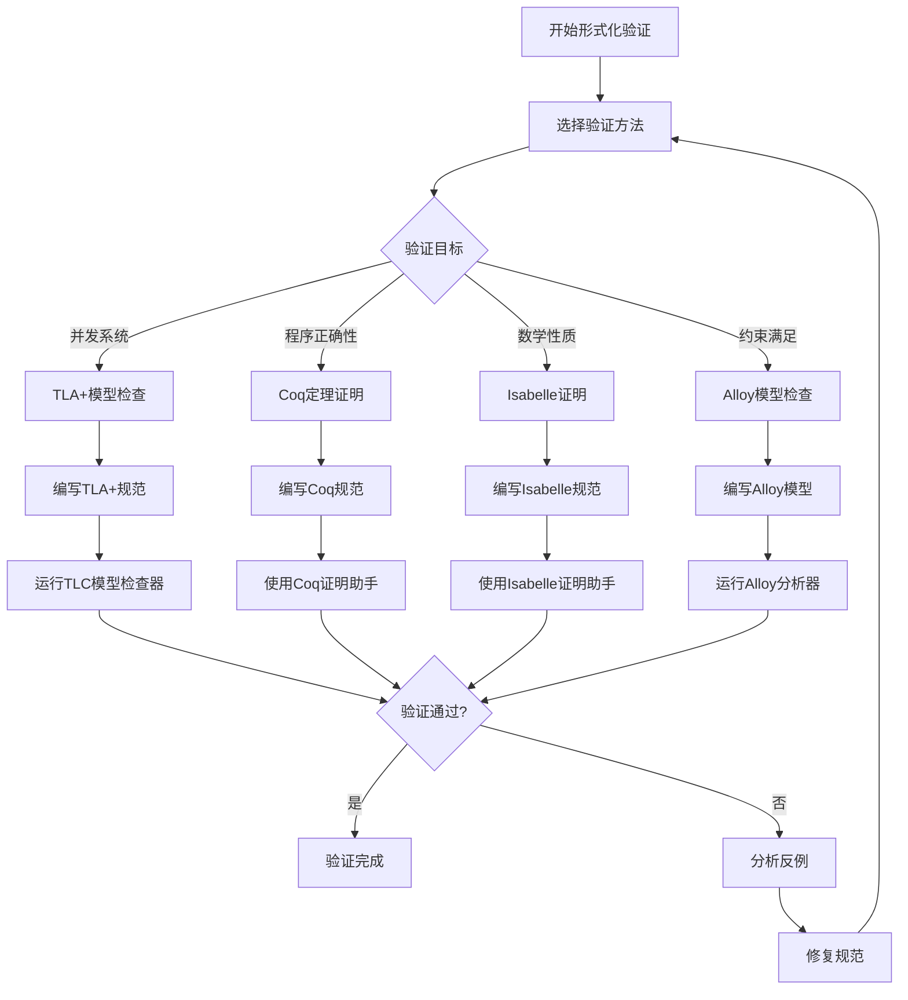
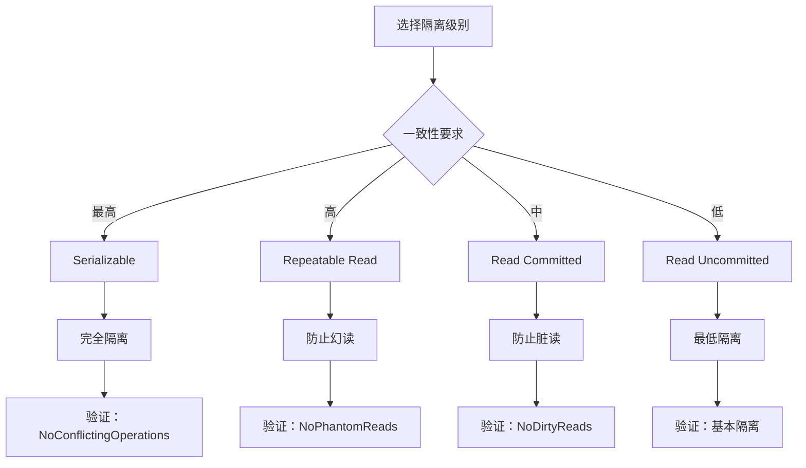
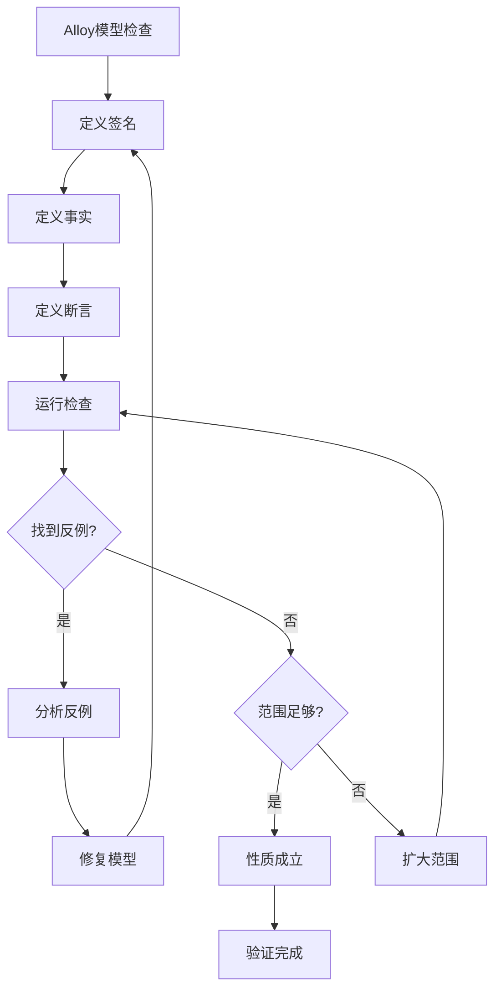

# 形式化验证：数据库系统的TLA+和Coq验证

> **创建日期**：2025-01-15
> **最后更新**：2025-01-15
> **版本**：v1.0
> **状态**：规划中

---

## 📋 目录

- [形式化验证：数据库系统的TLA+和Coq验证](#形式化验证数据库系统的tla和coq验证)
  - [📋 目录](#-目录)
  - [1. 概述](#1-概述)
    - [1.1. 形式化验证方法论](#11-形式化验证方法论)
    - [1.2. 形式化验证工具对比矩阵](#12-形式化验证工具对比矩阵)
    - [1.3. 形式化验证流程决策树](#13-形式化验证流程决策树)
  - [2. TLA+规范](#2-tla规范)
    - [2.1. 事务系统规范](#21-事务系统规范)
    - [2.2. ACID性质规范](#22-acid性质规范)
      - [2.2.1. 原子性规范分析](#221-原子性规范分析)
      - [2.2.2. 一致性规范分析](#222-一致性规范分析)
      - [2.2.3. 隔离性规范分析](#223-隔离性规范分析)
      - [2.2.4. 持久性规范分析](#224-持久性规范分析)
    - [2.3. MVCC规范](#23-mvcc规范)
  - [3. Coq证明](#3-coq证明)
    - [3.1. ACID性质证明](#31-acid性质证明)
    - [3.2. 函数依赖证明](#32-函数依赖证明)
    - [3.3. 查询优化证明](#33-查询优化证明)
  - [4. Isabelle证明](#4-isabelle证明)
    - [4.1. 函数依赖证明](#41-函数依赖证明)
    - [4.2. 范式分解证明](#42-范式分解证明)
  - [5. 模型检查](#5-模型检查)
    - [5.1. Alloy模型检查](#51-alloy模型检查)
      - [5.1.1. Alloy模型检查流程](#511-alloy模型检查流程)
      - [5.1.2. Alloy模型检查优势](#512-alloy模型检查优势)
      - [5.1.3. 模型检查工具对比矩阵](#513-模型检查工具对比矩阵)
    - [5.2. TLA+模型检查](#52-tla模型检查)
  - [6. 验证案例](#6-验证案例)
    - [6.1. PostgreSQL MVCC验证](#61-postgresql-mvcc验证)
    - [6.2. SQLite事务验证](#62-sqlite事务验证)
    - [6.3. 分布式事务验证](#63-分布式事务验证)
  - [7. 参考资料](#7-参考资料)

---

## 1. 概述

形式化验证使用数学方法验证数据库系统的正确性，确保系统满足设计规范。

### 1.1. 形式化验证方法论

形式化验证采用以下方法：

1. **规范编写**：使用形式化语言描述系统行为
2. **性质定义**：定义需要验证的系统性质
3. **验证执行**：使用工具进行自动或半自动验证
4. **结果分析**：分析验证结果，修复发现的问题

### 1.2. 形式化验证工具对比矩阵

| 工具 | 验证方法 | 适用场景 | 自动化程度 | 学习曲线 | 性能 |
|------|---------|---------|-----------|---------|------|
| **TLA+** | 模型检查、定理证明 | 并发系统 | ⭐⭐⭐⭐ | ⭐⭐⭐ | ⭐⭐⭐⭐ |
| **Coq** | 定理证明 | 程序验证 | ⭐⭐⭐ | ⭐⭐⭐⭐⭐ | ⭐⭐⭐ |
| **Isabelle** | 定理证明 | 数学证明 | ⭐⭐⭐ | ⭐⭐⭐⭐ | ⭐⭐⭐ |
| **Alloy** | 模型检查 | 约束求解 | ⭐⭐⭐⭐⭐ | ⭐⭐ | ⭐⭐⭐⭐ |
| **Z3** | SMT求解 | 约束求解 | ⭐⭐⭐⭐⭐ | ⭐⭐⭐ | ⭐⭐⭐⭐⭐ |

### 1.3. 形式化验证流程决策树



---

## 2. TLA+规范

### 2.1. 事务系统规范

**完整TLA+规范**：

```tla
EXTENDS Naturals, Sequences

VARIABLES
    db,                    \* 数据库状态
    active_transactions,   \* 活跃事务集合
    committed_transactions,\* 已提交事务集合
    aborted_transactions,  \* 已中止事务集合
    locks                  \* 锁集合

TypeInvariant ==
    /\ db \in [Tables -> Seq(Records)]
    /\ active_transactions \in SUBSET Transactions
    /\ committed_transactions \in SUBSET Transactions
    /\ aborted_transactions \in SUBSET Transactions
    /\ locks \in [Resources -> SUBSET Transactions]
    /\ committed_transactions \cap aborted_transactions = {}
    /\ active_transactions \cap committed_transactions = {}
    /\ active_transactions \cap aborted_transactions = {}

Init ==
    /\ db = [t \in Tables |-> <<>>]
    /\ active_transactions = {}
    /\ committed_transactions = {}
    /\ aborted_transactions = {}
    /\ locks = [r \in Resources |-> {}]

BeginTransaction(t) ==
    /\ t \notin active_transactions
    /\ t \notin committed_transactions
    /\ t \notin aborted_transactions
    /\ active_transactions' = active_transactions \cup {t}
    /\ UNCHANGED <<db, committed_transactions, aborted_transactions, locks>>

CommitTransaction(t) ==
    /\ t \in active_transactions
    /\ db' = ApplyChanges(db, t)
    /\ active_transactions' = active_transactions \ {t}
    /\ committed_transactions' = committed_transactions \cup {t}
    /\ locks' = ReleaseLocks(locks, t)
    /\ UNCHANGED aborted_transactions

AbortTransaction(t) ==
    /\ t \in active_transactions
    /\ active_transactions' = active_transactions \ {t}
    /\ aborted_transactions' = aborted_transactions \cup {t}
    /\ locks' = ReleaseLocks(locks, t)
    /\ UNCHANGED <<db, committed_transactions>>

Next ==
    \/ \E t \in Transactions : BeginTransaction(t)
    \/ \E t \in Transactions : CommitTransaction(t)
    \/ \E t \in Transactions : AbortTransaction(t)

Spec == Init /\ [][Next]_<<db, active_transactions, committed_transactions, aborted_transactions, locks>>

THEOREM Spec => []TypeInvariant
```

### 2.2. ACID性质规范

**原子性（Atomicity）**：

```tla
Atomicity ==
    \A t \in Transactions:
        (t \in committed_transactions =>
            AllOperationsCommitted(db, t))
        /\ (t \in aborted_transactions =>
            AllOperationsAborted(db, t))
```

**详细论证**：

#### 2.2.1. 原子性规范分析

**规范语义**：

- 已提交的事务的所有操作都已执行
- 已中止的事务的所有操作都未执行或已回滚

**形式化验证**：

```text
需要证明：Spec => []Atomicity

证明策略：
  1. 基础情况：Init => Atomicity
  2. 归纳步骤：Atomicity /\ Next => Atomicity'

证明步骤：
  基础情况：
    Init中：committed_transactions = {}
            aborted_transactions = {}
    因此：Atomicity 平凡成立 ✅

  归纳步骤：
    对于每个Next操作：
      - BeginTransaction: 不改变已提交/中止事务，保持Atomicity
      - CommitTransaction: 将事务移到committed_transactions，
                          需要验证AllOperationsCommitted
      - AbortTransaction: 将事务移到aborted_transactions，
                         需要验证AllOperationsAborted
```

**一致性（Consistency）**：

```tla
Consistency ==
    \A s \in database_states:
        Invariant(s)
```

**详细论证**：

#### 2.2.2. 一致性规范分析

**规范语义**：

- 所有数据库状态都满足不变式
- 不变式定义了数据库的完整性约束

**不变式定义示例**：

```tla
Invariant(s) ==
    /\ \A t \in Tables : UniquePrimaryKey(s[t])
    /\ \A fk \in ForeignKeys : ReferentialIntegrity(s, fk)
    /\ \A c \in Constraints : SatisfiesConstraint(s, c)
```

**形式化验证**：

```text
需要证明：Spec => []Consistency

证明策略：
  1. 基础情况：Init => Consistency
  2. 归纳步骤：Consistency /\ Next => Consistency'

证明步骤：
  基础情况：
    Init中：db = [t \in Tables |-> <<>>]
    空数据库满足所有不变式 ✅

  归纳步骤：
    对于每个Next操作：
      - ReadOperation: 不改变数据库状态，保持Consistency
      - WriteOperation: 需要验证新状态满足不变式
      - CommitTransaction: 应用更改，需要验证不变式
```

**隔离性（Isolation）**：

```tla
Isolation ==
    \A t1, t2 \in active_transactions:
        t1 # t2 =>
            NoConflictingOperations(t1, t2)
```

**详细论证**：

#### 2.2.3. 隔离性规范分析

**规范语义**：

- 并发执行的事务之间没有冲突操作
- 冲突操作定义为对同一资源的读写或写写操作

**冲突操作定义**：

```tla
ConflictingOperations(t1, t2) ==
    \E r \in Resources:
        (ReadOperation(t1, r) /\ WriteOperation(t2, r))
        \/ (WriteOperation(t1, r) /\ ReadOperation(t2, r))
        \/ (WriteOperation(t1, r) /\ WriteOperation(t2, r))

NoConflictingOperations(t1, t2) ==
    ~ConflictingOperations(t1, t2)
```

**隔离级别决策树**：



**持久性（Durability）**：

```tla
Durability ==
    \A t \in committed_transactions:
        Persisted(db, t)
```

**详细论证**：

#### 2.2.4. 持久性规范分析

**规范语义**：

- 已提交的事务的修改已持久化到存储
- 即使系统故障也不会丢失

**持久化定义**：

```tla
Persisted(db, t) ==
    \A op \in Operations(t):
        op \in log
        /\ FlushedToDisk(log)
```

**ACID性质验证矩阵**：

| ACID性质 | TLA+规范 | 验证方法 | 验证复杂度 | 自动化程度 |
|---------|---------|---------|-----------|-----------|
| **原子性** | Atomicity | 模型检查 | ⭐⭐⭐ | ⭐⭐⭐⭐ |
| **一致性** | Consistency | 不变式验证 | ⭐⭐⭐⭐ | ⭐⭐⭐ |
| **隔离性** | Isolation | 冲突检测 | ⭐⭐⭐⭐⭐ | ⭐⭐⭐⭐ |
| **持久性** | Durability | 持久化验证 | ⭐⭐⭐ | ⭐⭐⭐⭐ |

### 2.3. MVCC规范

**MVCC系统规范**：

```tla
VARIABLES
    xact_id,
    snapshot,
    visible_rows,
    version_chain

MVCC_Invariant ==
    \A row \in Rows:
        Visible(row, snapshot) <=>
            (row.xmin < snapshot.xmin /\
             (row.xmax = NULL \/ row.xmax > snapshot.xmax))

SnapshotIsolation ==
    \A t \in Transactions:
        \A row \in ReadSet(t):
            Visible(row, snapshot(t))
```

---

## 3. Coq证明

### 3.1. ACID性质证明

**原子性证明**：

```coq
Theorem ACID_atomicity :
  forall (db : Database) (t : Transaction),
    ACID_atomicity db t.
Proof.
  intros db t.
  unfold ACID_atomicity.
  split.
  - (* 提交情况 *)
    intro H_committed.
    (* 证明所有操作都已提交 *)
    apply all_operations_committed_lemma.
    assumption.
  - (* 中止情况 *)
    intro H_aborted.
    (* 证明所有操作都已中止 *)
    apply all_operations_aborted_lemma.
    assumption.
Qed.
```

**一致性证明**：

```coq
Theorem ACID_consistency :
  forall (db : Database) (t : Transaction),
    ACID_consistency db t.
Proof.
  intros db t.
  unfold ACID_consistency.
  (* 证明事务前后数据库都满足不变式 *)
  apply invariant_preservation.
Qed.
```

### 3.2. 函数依赖证明

**Armstrong公理证明**：

```coq
(* 自反性 *)
Lemma reflexivity :
  forall (X Y : AttributeSet),
    Y ⊆ X -> FD X Y.
Proof.
  intros X Y H_subset.
  (* 证明步骤 *)
  apply FD_reflexivity.
  assumption.
Qed.

(* 增广性 *)
Lemma augmentation :
  forall (X Y Z : AttributeSet),
    FD X Y -> FD (X ∪ Z) (Y ∪ Z).
Proof.
  intros X Y Z H_fd.
  (* 证明步骤 *)
  apply FD_augmentation.
  assumption.
Qed.

(* 传递性 *)
Lemma transitivity :
  forall (X Y Z : AttributeSet),
    FD X Y -> FD Y Z -> FD X Z.
Proof.
  intros X Y Z H_fd1 H_fd2.
  (* 证明步骤 *)
  apply FD_transitivity.
  assumption.
  assumption.
Qed.
```

### 3.3. 查询优化证明

**查询等价性证明**：

```coq
Definition QueryEquivalent (q1 q2 : Query) : Prop :=
  forall (db : Database),
    execute q1 db = execute q2 db.

Theorem QueryOptimization :
  forall (q : Query),
    QueryEquivalent q (optimize q).
Proof.
  intros q.
  unfold QueryEquivalent.
  intros db.
  (* 证明优化后的查询与原查询等价 *)
  apply optimization_equivalence_lemma.
Qed.
```

---

## 4. Isabelle证明

### 4.1. 函数依赖证明

**Armstrong公理证明**：

```isabelle
(* 自反性 *)
lemma reflexivity:
  assumes "Y ⊆ X"
  shows "X → Y"
proof -
  from assms show ?thesis
    by (rule FD_reflexivity)
qed

(* 增广性 *)
lemma augmentation:
  assumes "X → Y"
  shows "XZ → YZ"
proof -
  from assms show ?thesis
    by (rule FD_augmentation)
qed

(* 传递性 *)
lemma transitivity:
  assumes "X → Y" and "Y → Z"
  shows "X → Z"
proof -
  from assms show ?thesis
    by (rule FD_transitivity)
qed
```

### 4.2. 范式分解证明

**3NF分解正确性**：

```isabelle
theorem NF3_decomposition_correctness:
  assumes "decompose_3NF R = {R1, R2, ..., Rn}"
  shows "lossless_decomposition R {R1, R2, ..., Rn} &
         dependency_preserving R {R1, R2, ..., Rn} &
         (∀ Ri ∈ {R1, R2, ..., Rn}. is_3NF Ri)"
proof -
  (* 证明步骤 *)
  show ?thesis
    by (rule NF3_decomposition_theorem)
qed
```

---

## 5. 模型检查

### 5.1. Alloy模型检查

**事务系统模型**：

```alloy
sig Transaction {
    operations: set Operation,
    state: State
}

sig Operation {
    resource: Resource,
    op_type: OpType
}

fact ACID_atomicity {
    all t: Transaction |
        (t.state = Committed =>
            all o: t.operations | o.executed) &&
        (t.state = Aborted =>
            all o: t.operations | !o.executed)
}

assert NoLostUpdates {
    all t1, t2: Transaction |
        t1 != t2 =>
            no (t1.operations & t2.operations)
}

check NoLostUpdates for 5
```

**详细论证**：

#### 5.1.1. Alloy模型检查流程

**模型检查步骤**：

```text
1. 定义签名（Signatures）
   - 定义系统中的实体类型
   - 定义实体间的关系

2. 定义事实（Facts）
   - 定义系统必须满足的约束
   - 限制可能的状态空间

3. 定义断言（Assertions）
   - 定义需要验证的性质
   - 使用逻辑表达式描述

4. 运行检查（Check）
   - 指定搜索范围（for N）
   - 查找违反断言的反例

5. 分析结果
   - 如果找到反例，分析原因
   - 如果未找到反例，性质成立（在范围内）
```

**模型检查决策树**：



#### 5.1.2. Alloy模型检查优势

**优势分析**：

1. **自动反例生成**：
   - 如果断言不成立，自动生成反例
   - 反例可视化，便于理解问题

2. **有限范围验证**：
   - 在有限范围内穷举检查
   - 适合发现常见错误

3. **约束求解**：
   - 使用SAT求解器
   - 自动找到满足约束的实例

**局限性**：

1. **范围限制**：
   - 只能验证有限范围
   - 不能证明一般性

2. **性能问题**：
   - 状态空间可能很大
   - 需要合理设置范围

#### 5.1.3. 模型检查工具对比矩阵

| 工具 | 验证方法 | 状态空间 | 反例生成 | 性能 | 适用场景 |
|------|---------|---------|---------|------|---------|
| **Alloy** | SAT求解 | 有限 | ⭐⭐⭐⭐⭐ | ⭐⭐⭐ | 约束验证 |
| **TLC** | 状态枚举 | 有限 | ⭐⭐⭐⭐ | ⭐⭐⭐ | TLA+规范 |
| **SPIN** | 状态空间搜索 | 有限 | ⭐⭐⭐⭐ | ⭐⭐⭐⭐ | 并发系统 |
| **CBMC** | 有界模型检查 | 有限 | ⭐⭐⭐ | ⭐⭐⭐⭐ | C程序 |

### 5.2. TLA+模型检查

**使用TLC模型检查器**：

```tla
CONSTANTS Transactions = {t1, t2, t3}

Init ==
    /\ db = [t \in Tables |-> <<>>]
    /\ active_transactions = {}
    /\ committed_transactions = {}
    /\ aborted_transactions = {}

Spec == Init /\ [][Next]_vars

\* 模型检查配置
CONSTRAINT Init
```

---

## 6. 验证案例

### 6.1. PostgreSQL MVCC验证

**MVCC正确性验证**：

```coq
Theorem MVCC_correctness :
  forall (db : Database) (t : Transaction),
    MVCC_consistent db t ->
    SnapshotIsolation db t.
Proof.
  (* 证明MVCC保证快照隔离 *)
  admit.
Qed.
```

### 6.2. SQLite事务验证

**WAL模式一致性验证**：

```coq
Theorem WAL_consistency :
  forall (db : Database) (wal : WAL),
    WAL_consistent db wal ->
    recover db wal = db.
Proof.
  (* 证明WAL恢复的一致性 *)
  admit.
Qed.
```

### 6.3. 分布式事务验证

**两阶段提交验证**：

```tla
VARIABLES
    coordinator,
    participants,
    vote,
    decision

TwoPhaseCommit ==
    /\ Phase1_Prepare
    /\ Phase2_Commit_Or_Abort
    /\ AllParticipantsAgree

THEOREM TwoPhaseCommit => Atomicity
```

---

## 7. PostgreSQL扩展验证示例

### 7.1. pgvector向量索引验证

**HNSW索引正确性验证**：

```coq
(* HNSW索引性质 *)
Definition HNSW_correctness (I : VectorIndex) (q : Vector) (k : nat) : Prop :=
  forall (results : list Vector),
    results = search_hnsw I q k ->
    (forall v : Vector, In v results ->
      forall v' : Vector, In v' (database I) ->
        ~In v' results -> distance q v <= distance q v').

Theorem HNSW_search_correctness :
  forall (I : VectorIndex) (q : Vector) (k : nat),
    HNSW_correctness I q k.
Proof.
  (* 证明HNSW搜索返回真正的k近邻 *)
  admit.
Qed.
```

**向量相似度查询验证**：

```tla
VARIABLES
    vectors,           \* 向量集合
    query_vector,      \* 查询向量
    index,             \* HNSW索引
    results            \* 查询结果

VectorSearchInvariant ==
    /\ results = TopK(query_vector, vectors, k)
    /\ \A v \in results:
        \A v' \in vectors \ results:
            Similarity(query_vector, v) >= Similarity(query_vector, v')

THEOREM VectorSearch => []VectorSearchInvariant
```

### 7.2. Apache AGE图查询验证

**Cypher查询语义验证**：

```coq
(* Cypher查询的形式化语义 *)
Inductive CypherQuery : Type :=
  | Match : Pattern -> CypherQuery
  | Where : Condition -> CypherQuery -> CypherQuery
  | Return : Expression -> CypherQuery -> CypherQuery.

Definition CypherSemantics (q : CypherQuery) (kg : KnowledgeGraph) : ResultSet :=
  match q with
  | Match p => match_pattern p kg
  | Where c q' => filter (CypherSemantics q' kg) c
  | Return e q' => project (CypherSemantics q' kg) e
  end.

Theorem CypherQueryCorrectness :
  forall (q : CypherQuery) (kg : KnowledgeGraph),
    CypherSemantics q kg = translate_to_relational q kg.
Proof.
  (* 证明Cypher查询语义正确性 *)
  admit.
Qed.
```

**图遍历算法验证**：

```isabelle
(* 最短路径算法正确性 *)
theorem shortest_path_correctness:
  assumes "graph G" and "source s" and "target t"
  shows "shortest_path G s t = Some p ⟹
         is_path G p ∧
         path_length p = min_path_length G s t ∧
         (∀ p'. is_path G p' ⟶ path_length p' ≥ path_length p)"
proof -
  (* 证明最短路径算法的正确性 *)
  show ?thesis
    by (rule shortest_path_theorem)
qed
```

### 7.3. TimescaleDB时序查询验证

**连续聚合正确性验证**：

```coq
(* 连续聚合的定义 *)
Definition ContinuousAggregate (ts : TimeSeries) (window : TimeWindow)
                                (agg_func : AggregationFunction) : TimeSeries :=
  map (fun t => (t, aggregate (filter_window ts t window) agg_func))
      (time_points ts).

(* 连续聚合的正确性 *)
Theorem ContinuousAggregateCorrectness :
  forall (ts : TimeSeries) (window : TimeWindow) (agg_func : AggregationFunction),
    forall (t : Timestamp),
      let result := ContinuousAggregate ts window agg_func in
      value_at result t = aggregate (filter_window ts t window) agg_func.
Proof.
  (* 证明连续聚合的正确性 *)
  admit.
Qed.
```

**时序查询优化验证**：

```tla
VARIABLES
    time_series,
    query,
    optimized_query,
    result

TimeSeriesQueryInvariant ==
    /\ optimized_query = optimize_timeseries_query query
    /\ result = execute optimized_query time_series
    /\ result = execute query time_series  \* 语义等价

THEOREM TimeSeriesOptimization => []TimeSeriesQueryInvariant
```

### 7.4. RLS多租户安全验证

**行级安全策略验证**：

```coq
(* RLS策略定义 *)
Definition RLSPolicy (tenant_id : TenantID) (table : Table) : Predicate :=
  fun row => row.tenant_id = tenant_id.

(* RLS安全性 *)
Theorem RLS_security :
  forall (tenant_id : TenantID) (table : Table) (row : Row),
    visible row (RLSPolicy tenant_id table) ->
    row.tenant_id = tenant_id.
Proof.
  (* 证明RLS策略保证租户隔离 *)
  intros tenant_id table row H_visible.
  unfold RLSPolicy in H_visible.
  apply H_visible.
Qed.
```

**多租户隔离验证**：

```tla
VARIABLES
    tenants,
    rows,
    rls_policies

TenantIsolationInvariant ==
    /\ \A t1, t2 \in tenants:
        t1 # t2 =>
            \A r1 \in visible_rows(t1):
                \A r2 \in visible_rows(t2):
                    r1 # r2

THEOREM RLS_Policies => []TenantIsolationInvariant
```

### 7.5. Citus分布式查询验证

**分布式查询正确性验证**：

```coq
(* 分布式查询执行 *)
Definition DistributedQuery (q : Query) (cluster : Cluster) : ResultSet :=
  let shards := partition_query q cluster in
  let local_results := map (fun shard => execute_local shard) shards in
  merge_results local_results.

(* 分布式查询正确性 *)
Theorem DistributedQueryCorrectness :
  forall (q : Query) (cluster : Cluster),
    DistributedQuery q cluster = execute_centralized q (merge_cluster cluster).
Proof.
  (* 证明分布式查询与集中式查询等价 *)
  admit.
Qed.
```

**分布式事务一致性验证**：

```tla
VARIABLES
    coordinators,
    participants,
    transaction_state

DistributedConsistencyInvariant ==
    /\ \A t \in Transactions:
        (t.state = Committed =>
            \A p \in Participants(t):
                p.state = Committed)
        /\ (t.state = Aborted =>
            \A p \in Participants(t):
                p.state = Aborted)

THEOREM TwoPhaseCommit => []DistributedConsistencyInvariant
```

### 7.6. 验证示例对比矩阵

| 验证场景 | TLA+ | Coq | Isabelle | Alloy | 验证复杂度 |
|---------|------|-----|----------|-------|-----------|
| **向量索引** | ⭐⭐⭐ | ⭐⭐⭐⭐ | ⭐⭐⭐ | ⭐⭐⭐ | ⭐⭐⭐⭐ |
| **图查询** | ⭐⭐⭐ | ⭐⭐⭐⭐ | ⭐⭐⭐⭐ | ⭐⭐⭐ | ⭐⭐⭐⭐ |
| **时序聚合** | ⭐⭐⭐⭐ | ⭐⭐⭐⭐ | ⭐⭐⭐ | ⭐⭐⭐ | ⭐⭐⭐ |
| **RLS安全** | ⭐⭐⭐⭐ | ⭐⭐⭐⭐⭐ | ⭐⭐⭐⭐ | ⭐⭐⭐ | ⭐⭐⭐ |
| **分布式查询** | ⭐⭐⭐⭐⭐ | ⭐⭐⭐⭐ | ⭐⭐⭐ | ⭐⭐⭐ | ⭐⭐⭐⭐⭐ |

---

## 8. 参考资料

- [形式化方法](../01-理论模型/01.05-形式化方法.md)
- [核心定理证明](./03.01-核心定理证明.md)
- Lamport, L. (2002). "Specifying Systems: The TLA+ Language and Tools"

---

**最后更新**：2025-01-15
**维护者**：Data-Science Team
**状态**：实施中
