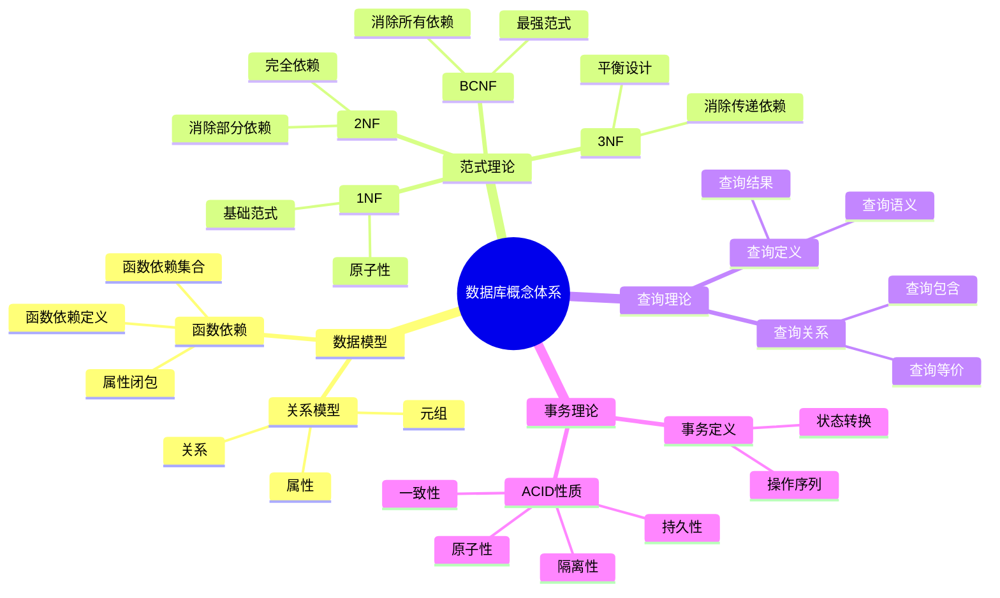
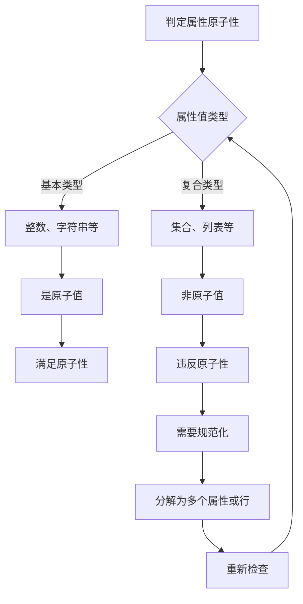
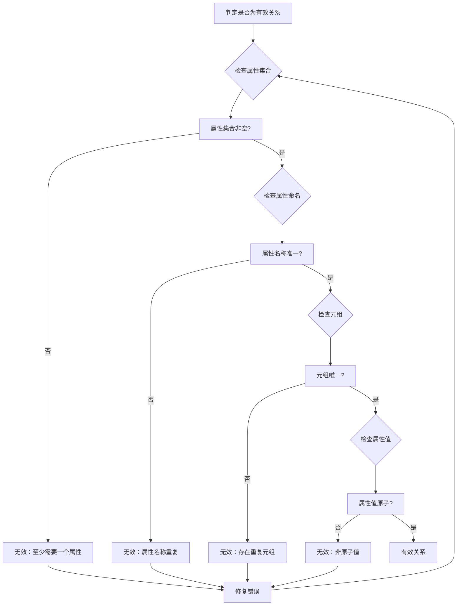
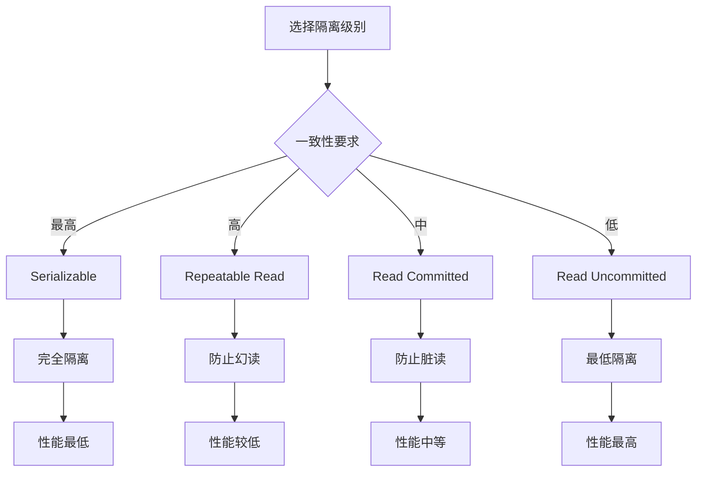
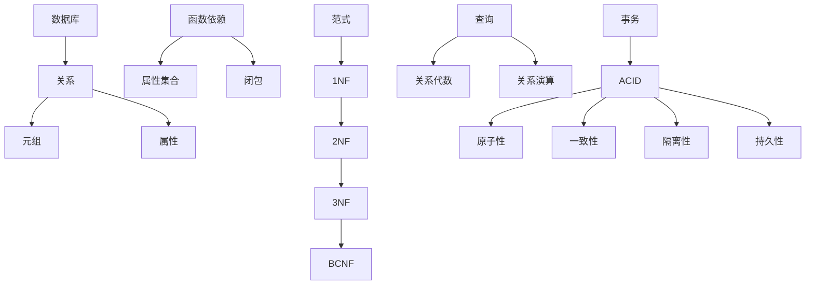
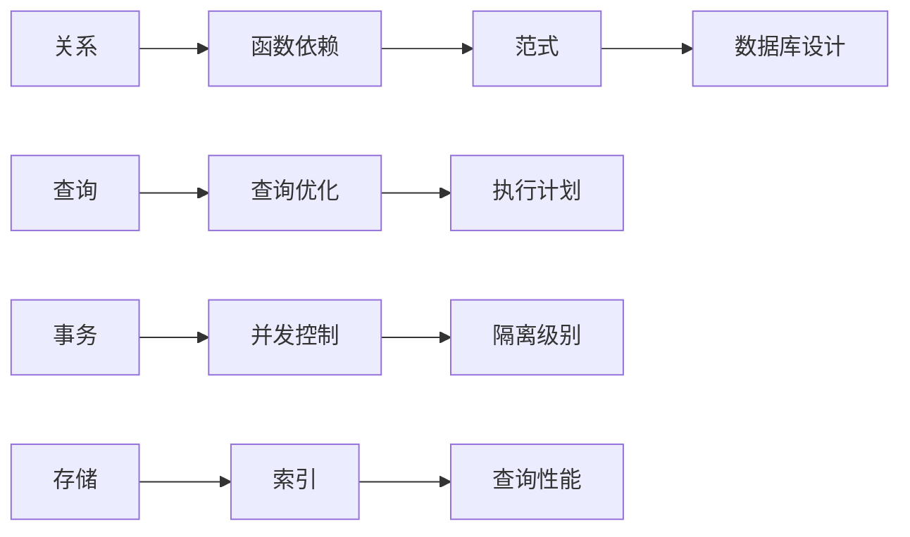

# 概念定义与属性关系：数据库设计核心概念的形式化定义

> **创建日期**：2025-01-15
> **最后更新**：2025-01-15
> **版本**：v1.0
> **状态**：规划中

---

## 📋 目录

- [概念定义与属性关系：数据库设计核心概念的形式化定义](#概念定义与属性关系数据库设计核心概念的形式化定义)
  - [📋 目录](#-目录)
  - [1. 概述](#1-概述)
    - [1.1. 概念定义方法论](#11-概念定义方法论)
    - [1.2. 概念体系思维导图](#12-概念体系思维导图)
    - [1.3. 概念定义方法对比矩阵](#13-概念定义方法对比矩阵)
  - [2. 关系模型概念](#2-关系模型概念)
    - [2.1. 关系（Relation）](#21-关系relation)
      - [2.1.1. 定义分析](#211-定义分析)
      - [2.1.2. 性质详细论证](#212-性质详细论证)
      - [2.1.3. 相关概念详细定义](#213-相关概念详细定义)
      - [2.1.4. 关系判定决策树](#214-关系判定决策树)
      - [2.1.5. 关系概念对比矩阵](#215-关系概念对比矩阵)
    - [2.2. 元组（Tuple）](#22-元组tuple)
    - [2.3. 属性（Attribute）](#23-属性attribute)
  - [3. 函数依赖概念](#3-函数依赖概念)
    - [3.1. 函数依赖（Functional Dependency）](#31-函数依赖functional-dependency)
      - [3.1.1. 定义语义分析](#311-定义语义分析)
      - [3.1.2. 函数依赖判定决策树](#312-函数依赖判定决策树)
      - [3.1.3. 函数依赖性质详细论证](#313-函数依赖性质详细论证)
      - [3.1.4. 函数依赖类型矩阵](#314-函数依赖类型矩阵)
    - [3.2. 函数依赖集合](#32-函数依赖集合)
    - [3.3. 属性闭包](#33-属性闭包)
  - [4. 范式概念](#4-范式概念)
    - [4.1. 第一范式（1NF）](#41-第一范式1nf)
    - [4.2. 第二范式（2NF）](#42-第二范式2nf)
    - [4.3. 第三范式（3NF）](#43-第三范式3nf)
    - [4.4. Boyce-Codd范式（BCNF）](#44-boyce-codd范式bcnf)
  - [5. 查询概念](#5-查询概念)
    - [5.1. 查询（Query）](#51-查询query)
    - [5.2. 查询包含](#52-查询包含)
    - [5.3. 查询等价](#53-查询等价)
  - [6. 事务概念](#6-事务概念)
    - [6.1. 事务（Transaction）](#61-事务transaction)
    - [6.2. ACID性质](#62-acid性质)
      - [6.2.1. 原子性详细分析](#621-原子性详细分析)
      - [6.2.2. 一致性详细分析](#622-一致性详细分析)
      - [6.2.3. 隔离性详细分析](#623-隔离性详细分析)
      - [6.2.4. 持久性详细分析](#624-持久性详细分析)
    - [6.3. 事务状态](#63-事务状态)
  - [7. 概念关系图](#7-概念关系图)
    - [7.1. 概念层次关系](#71-概念层次关系)
    - [7.2. 概念依赖关系](#72-概念依赖关系)
  - [8. 参考资料](#8-参考资料)

---

## 1. 概述

本文档提供数据库设计核心概念的形式化定义，建立概念间的精确关系。

### 1.1. 概念定义方法论

本文档采用以下方法定义概念：

1. **形式化定义**：使用数学符号和逻辑表达式
2. **性质描述**：列出概念的关键性质
3. **关系分析**：分析概念间的关系
4. **判定方法**：提供判定算法和决策树
5. **示例验证**：通过示例验证定义的正确性

### 1.2. 概念体系思维导图



### 1.3. 概念定义方法对比矩阵

| 定义方法 | 精确性 | 可理解性 | 可操作性 | 适用场景 |
|---------|--------|---------|---------|---------|
| **形式化定义** | ⭐⭐⭐⭐⭐ | ⭐⭐ | ⭐⭐⭐⭐ | 理论研究 |
| **自然语言** | ⭐⭐⭐ | ⭐⭐⭐⭐⭐ | ⭐⭐⭐ | 教学说明 |
| **示例说明** | ⭐⭐⭐ | ⭐⭐⭐⭐ | ⭐⭐⭐⭐ | 实践应用 |
| **算法描述** | ⭐⭐⭐⭐ | ⭐⭐⭐ | ⭐⭐⭐⭐⭐ | 实现验证 |

---

## 2. 关系模型概念

### 2.1. 关系（Relation）

**定义**：关系 R 是定义在属性集合 {A₁, A₂, ..., Aₙ} 上的一个子集

```text
R ⊆ dom(A₁) × dom(A₂) × ... × dom(Aₙ)
```

**详细论证**：

#### 2.1.1. 定义分析

**集合论基础**：

关系 R 是笛卡尔积的子集：

- `dom(A₁) × dom(A₂) × ... × dom(Aₙ)` 是所有可能的元组组合
- R 是满足某些条件的元组的子集

**形式化验证**：

```text
设 R = {t₁, t₂, ..., tₘ}

对于每个元组 tᵢ：
  tᵢ = (aᵢ₁, aᵢ₂, ..., aᵢₙ)
  其中 aᵢⱼ ∈ dom(Aⱼ)

因此：tᵢ ∈ dom(A₁) × dom(A₂) × ... × dom(Aₙ)
      R ⊆ dom(A₁) × dom(A₂) × ... × dom(Aₙ) ✅
```

#### 2.1.2. 性质详细论证

**性质1：元组唯一性**:

**定义**：`∀ t₁, t₂ ∈ R, t₁ ≠ t₂`

**论证**：

- 关系是集合，集合中元素唯一
- 如果两个元组在所有属性上值相同，则它们是同一个元组
- 因此关系中没有重复元组

**形式化**：

```text
∀ t₁, t₂ ∈ R:
  t₁ = t₂ ⟺ ∀ Aᵢ ∈ Schema(R), t₁[Aᵢ] = t₂[Aᵢ]

由于关系是集合：
  t₁ ≠ t₂ ⟺ ∃ Aᵢ ∈ Schema(R), t₁[Aᵢ] ≠ t₂[Aᵢ]
```

**性质2：元组无序性**:

**论证**：

- 关系是集合，集合中元素无序
- 元组的顺序不影响关系的语义
- 实际存储中可能有序，但逻辑上无序

**性质3：属性原子性**:

**定义**：`∀ t ∈ R, ∀ Aᵢ, t[Aᵢ]` 是原子的

**论证**：

- 每个属性的值必须是不可再分的原子值
- 不能是集合、列表等复合结构
- 这是第一范式（1NF）的要求

**判定决策树**：



**性质4：属性命名唯一性**:

**定义**：`∀ i ≠ j, Aᵢ ≠ Aⱼ`

**论证**：

- 每个属性必须有唯一的名称
- 属性名称用于标识和引用属性
- 重复名称会导致歧义

#### 2.1.3. 相关概念详细定义

**度（Degree）**：

```text
deg(R) = |Schema(R)| = n
```

- 关系的度是属性的数量
- 也称为关系的"宽度"或"列数"

**基数（Cardinality）**：

```text
|R| = 关系中元组的数量
```

- 关系的基数是元组的数量
- 也称为关系的"大小"或"行数"

**模式（Schema）**：

```text
Schema(R) = {A₁, A₂, ..., Aₙ}
```

- 模式定义了关系的结构
- 包括属性名称和类型信息

#### 2.1.4. 关系判定决策树



#### 2.1.5. 关系概念对比矩阵

| 概念 | 定义 | 类型 | 示例 | 重要性 |
|------|------|------|------|--------|
| **关系** | 属性集合上的子集 | 集合 | Students表 | ⭐⭐⭐⭐⭐ |
| **元组** | 关系的元素 | 有序对 | (1, 'Alice', 20) | ⭐⭐⭐⭐⭐ |
| **属性** | 关系的列 | 列定义 | name, age | ⭐⭐⭐⭐⭐ |
| **度** | 属性数量 | 整数 | 3 | ⭐⭐⭐ |
| **基数** | 元组数量 | 整数 | 100 | ⭐⭐⭐ |
| **模式** | 属性集合 | 集合 | {id, name, age} | ⭐⭐⭐⭐ |

### 2.2. 元组（Tuple）

**定义**：元组 t 是关系 R 中的一个元素

```text
t ∈ R
```

**属性值**：

```text
t[Aᵢ] ∈ dom(Aᵢ)
```

**投影**：

```text
t[A] = (t[Aᵢ₁], t[Aᵢ₂], ..., t[Aᵢₖ])
```

其中 `A = {Aᵢ₁, Aᵢ₂, ..., Aᵢₖ} ⊆ Schema(R)`

### 2.3. 属性（Attribute）

**定义**：属性 A 是关系的列

```text
A ∈ Schema(R)
```

**值域**：

```text
dom(A) = {所有可能的A的值}
```

---

## 3. 函数依赖概念

### 3.1. 函数依赖（Functional Dependency）

**定义**：给定关系 R，属性集合 X, Y ⊆ Attr(R)

```text
X → Y
```

当且仅当：

```text
∀ t₁, t₂ ∈ R, t₁[X] = t₂[X] ⟹ t₁[Y] = t₂[Y]
```

**详细论证**：

#### 3.1.1. 定义语义分析

**函数依赖的直观含义**：

- X 的值唯一确定 Y 的值
- 如果两个元组在 X 上的值相同，则它们在 Y 上的值也必须相同
- Y 函数依赖于 X

**形式化验证**：

```text
对于关系 R 和属性集合 X, Y：

X → Y ⟺
  ∀ t₁, t₂ ∈ R:
    (t₁[X] = t₂[X]) → (t₁[Y] = t₂[Y])

等价于：
  ¬∃ t₁, t₂ ∈ R:
    (t₁[X] = t₂[X]) ∧ (t₁[Y] ≠ t₂[Y])
```

#### 3.1.2. 函数依赖判定决策树

```mermaid
flowchart TD
    A[判定函数依赖 X → Y] --> B[检查关系R]
    B --> C{取任意两个元组}
    C --> D[t₁, t₂ ∈ R]

    D --> E{t₁[X] = t₂[X]?}
    E -->|否| F[不违反依赖]
    E -->|是| G{t₁[Y] = t₂[Y]?}

    F --> H{所有元组对检查完?}
    G -->|是| H
    G -->|否| I[违反依赖]

    H -->|否| C
    H -->|是| J[满足依赖]

    I --> K[X → Y 不成立]
    J --> L[X → Y 成立]
```

#### 3.1.3. 函数依赖性质详细论证

**性质1：自反性**:

**定理**：`Y ⊆ X ⟹ X → Y`

**证明**：

```text
假设：Y ⊆ X
目标：证明 X → Y

对于任意 t₁, t₂ ∈ R：
  如果 t₁[X] = t₂[X]：
    由于 Y ⊆ X：
      t₁[Y] = t₂[Y]  (Y的属性值包含在X中)

  因此：X → Y ✅
```

**性质2：增广性**:

**定理**：`X → Y ⟹ XZ → YZ`

**证明**：

```text
假设：X → Y
目标：证明 XZ → YZ

对于任意 t₁, t₂ ∈ R：
  如果 t₁[XZ] = t₂[XZ]：
    由于 X ⊆ XZ：
      t₁[X] = t₂[X]
    由于 X → Y：
      t₁[Y] = t₂[Y]
    由于 Z ⊆ XZ：
      t₁[Z] = t₂[Z]
    因此：t₁[YZ] = t₂[YZ]

  因此：XZ → YZ ✅
```

**性质3：传递性**:

**定理**：`X → Y ∧ Y → Z ⟹ X → Z`

**证明**：

```text
假设1：X → Y
假设2：Y → Z
目标：证明 X → Z

对于任意 t₁, t₂ ∈ R：
  如果 t₁[X] = t₂[X]：
    由于 X → Y：
      t₁[Y] = t₂[Y]
    由于 Y → Z：
      t₁[Z] = t₂[Z]

  因此：X → Z ✅
```

#### 3.1.4. 函数依赖类型矩阵

| 依赖类型 | 定义 | 示例 | 规范化需求 |
|---------|------|------|-----------|
| **平凡依赖** | Y ⊆ X | {A, B} → {A} | 无需处理 |
| **非平凡依赖** | Y ⊈ X | {A} → {B} | 需要检查 |
| **完全依赖** | 不存在 X' ⊂ X 使得 X' → Y | {A, B} → {C}，且 A ↛ C, B ↛ C | 2NF要求 |
| **部分依赖** | 存在 X' ⊂ X 使得 X' → Y | {A, B} → {C}，且 A → C | 违反2NF |
| **传递依赖** | X → Y, Y → Z, Y ↛ X | {A} → {B}, {B} → {C} | 违反3NF |

### 3.2. 函数依赖集合

**定义**：函数依赖集合 F 是函数依赖的集合

```text
F = {X₁ → Y₁, X₂ → Y₂, ..., Xₙ → Yₙ}
```

**闭包**：

```text
F⁺ = {X → Y | F ⊢ X → Y}
```

**覆盖**：

```text
F ⊇ G ⟺ G⁺ ⊆ F⁺
```

### 3.3. 属性闭包

**定义**：属性集合 X 在 F 下的闭包

```text
X⁺ = {A | F ⊢ X → A}
```

**算法**：

```text
X⁺ := X
repeat
    oldX⁺ := X⁺
    for each Y → Z in F do
        if Y ⊆ X⁺ then
            X⁺ := X⁺ ∪ Z
until X⁺ = oldX⁺
```

---

## 4. 范式概念

### 4.1. 第一范式（1NF）

**定义**：关系 R 满足第一范式，当且仅当：

```text
∀ t ∈ R, ∀ A ∈ Schema(R), t[A] 是原子的
```

**形式化**：

```text
is_1NF(R) ⟺ ∀ t ∈ R, ∀ A ∈ Schema(R),
              atomic(t[A])
```

### 4.2. 第二范式（2NF）

**定义**：关系 R 满足第二范式，当且仅当：

1. R 满足 1NF
2. 每个非主属性完全函数依赖于主键

**形式化**：

```text
is_2NF(R) ⟺ is_1NF(R) ∧
            ∀ A ∈ NonPrime(R), ∀ K ⊆ Key(R),
            K → A ⟹ (不存在 K' ⊂ K 使得 K' → A)
```

### 4.3. 第三范式（3NF）

**定义**：关系 R 满足第三范式，当且仅当：

1. R 满足 2NF
2. 每个非主属性不传递依赖于主键

**形式化**：

```text
is_3NF(R) ⟺ is_2NF(R) ∧
            ∀ X → Y ∈ F⁺ (非平凡),
            (X 是超键) ∨ (Y 是主属性)
```

### 4.4. Boyce-Codd范式（BCNF）

**定义**：关系 R 满足BCNF，当且仅当：

对于每个非平凡函数依赖 X → Y：

```text
X 是超键
```

**形式化**：

```text
is_BCNF(R) ⟺ ∀ X → Y ∈ F⁺ (非平凡),
              X 是超键
```

---

## 5. 查询概念

### 5.1. 查询（Query）

**定义**：查询 Q 是从数据库实例到结果集的函数

```text
Q: DatabaseInstance → ResultSet
```

**查询语义**：

```text
Q(I) = {满足查询条件的元组集合}
```

### 5.2. 查询包含

**定义**：查询 Q₁ 包含查询 Q₂

```text
Q₁ ⊇ Q₂ ⟺ ∀ I, Q₁(I) ⊇ Q₂(I)
```

### 5.3. 查询等价

**定义**：查询 Q₁ 等价于查询 Q₂

```text
Q₁ ≡ Q₂ ⟺ Q₁ ⊇ Q₂ ∧ Q₂ ⊇ Q₁
```

**等价性**：

```text
Q₁ ≡ Q₂ ⟺ ∀ I, Q₁(I) = Q₂(I)
```

---

## 6. 事务概念

### 6.1. 事务（Transaction）

**定义**：事务 T 是操作的序列

```text
T = (op₁, op₂, ..., opₙ)
```

**操作类型**：

```text
OpType = {Read, Write, Commit, Abort}
```

### 6.2. ACID性质

**原子性（Atomicity）**：

```text
Atomicity(T) ⟺
    (committed(T) ⟹ AllOperationsCommitted(T)) ∧
    (aborted(T) ⟹ AllOperationsAborted(T))
```

**详细论证**：

#### 6.2.1. 原子性详细分析

**语义**：

- 事务的所有操作要么全部执行，要么全部不执行
- 不存在部分执行的情况

**形式化验证**：

```text
对于事务 T = (op₁, op₂, ..., opₙ)：

原子性要求：
  committed(T) ⟹
    ∀ opᵢ ∈ T, executed(opᵢ) ∧ committed(opᵢ)

  aborted(T) ⟹
    ∀ opᵢ ∈ T, ¬executed(opᵢ) ∨ rolled_back(opᵢ)
```

**实现机制**：

- 日志记录（Write-Ahead Logging）
- 两阶段提交（Two-Phase Commit）
- 回滚机制（Rollback）

**一致性（Consistency）**：

```text
Consistency(T) ⟺
    Invariant(before(T)) ∧ Invariant(after(T))
```

**详细论证**：

#### 6.2.2. 一致性详细分析

**语义**：

- 事务执行前后数据库都满足完整性约束
- 事务将数据库从一个一致状态转换到另一个一致状态

**形式化验证**：

```text
对于事务 T 和数据库状态 S：

一致性要求：
  Invariant(S_before) ∧
  T(S_before) = S_after ⟹
    Invariant(S_after)
```

**约束类型**：

- 实体完整性约束
- 参照完整性约束
- 用户定义的完整性约束

**隔离性（Isolation）**：

```text
Isolation(T₁, T₂) ⟺
    NoConflictingOperations(T₁, T₂)
```

**详细论证**：

#### 6.2.3. 隔离性详细分析

**语义**：

- 并发执行的事务互不干扰
- 每个事务看到的数据是一致的

**冲突操作定义**：

```text
冲突操作对：
  - Read-Write: T₁读取，T₂写入同一数据项
  - Write-Read: T₁写入，T₂读取同一数据项
  - Write-Write: T₁写入，T₂写入同一数据项
```

**隔离级别决策树**：



**持久性（Durability）**：

```text
Durability(T) ⟺
    committed(T) ⟹ Persisted(T)
```

**详细论证**：

#### 6.2.4. 持久性详细分析

**语义**：

- 已提交的事务的修改永久保存
- 即使系统故障也不会丢失

**实现机制**：

- 持久化存储（磁盘）
- 日志记录（WAL）
- 备份和恢复机制

**ACID性质对比矩阵**：

| ACID性质 | 定义 | 重要性 | 实现复杂度 | 性能影响 |
|---------|------|--------|-----------|---------|
| **原子性** | 全有或全无 | ⭐⭐⭐⭐⭐ | ⭐⭐⭐⭐ | ⭐⭐⭐ |
| **一致性** | 约束满足 | ⭐⭐⭐⭐⭐ | ⭐⭐⭐⭐⭐ | ⭐⭐⭐⭐ |
| **隔离性** | 并发隔离 | ⭐⭐⭐⭐ | ⭐⭐⭐⭐⭐ | ⭐⭐⭐⭐⭐ |
| **持久性** | 永久保存 | ⭐⭐⭐⭐⭐ | ⭐⭐⭐ | ⭐⭐ |

### 6.3. 事务状态

**状态定义**：

```text
TransactionState = {Active, Committed, Aborted}
```

**状态转换**：

```text
Active → Committed (commit)
Active → Aborted (abort)
```

---

## 7. 概念关系图

### 7.1. 概念层次关系



### 7.2. 概念依赖关系



---

## 8. 参考资料

- [关系数据库理论](../01-理论模型/01.02-关系数据库理论.md)
- [核心定理证明](./03.01-核心定理证明.md)
- [形式化验证](./03.02-形式化验证.md)

---

**最后更新**：2025-01-15
**维护者**：Data-Science Team
**状态**：规划中
