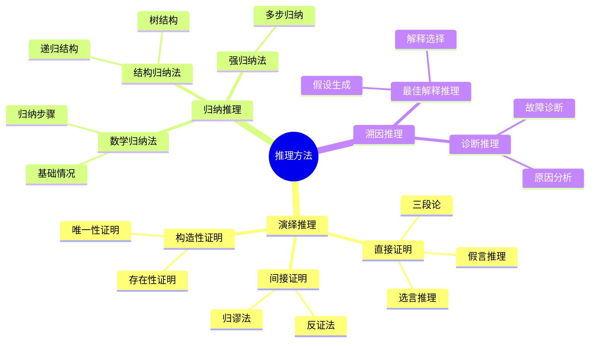
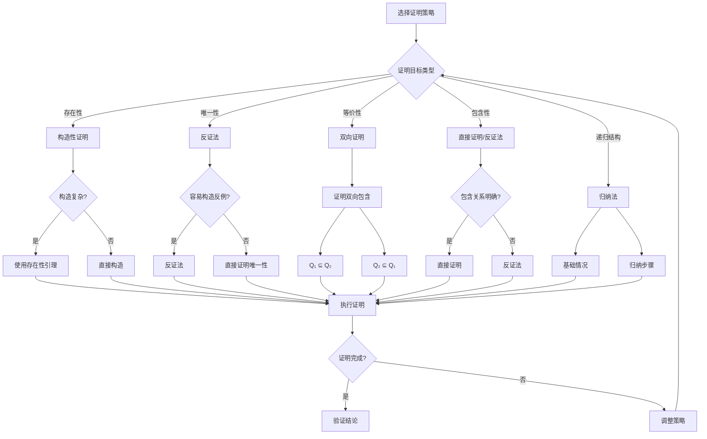
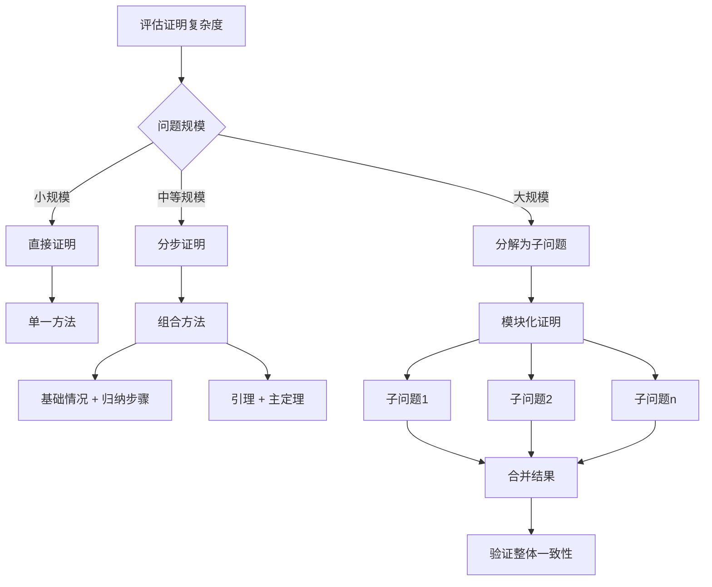
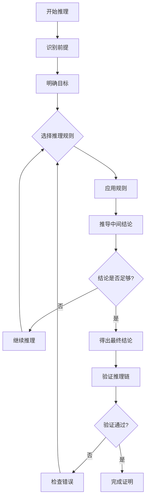
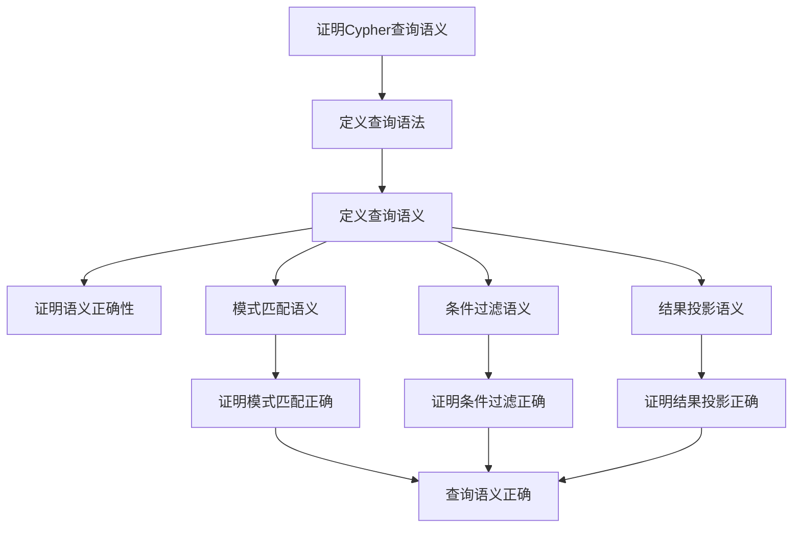
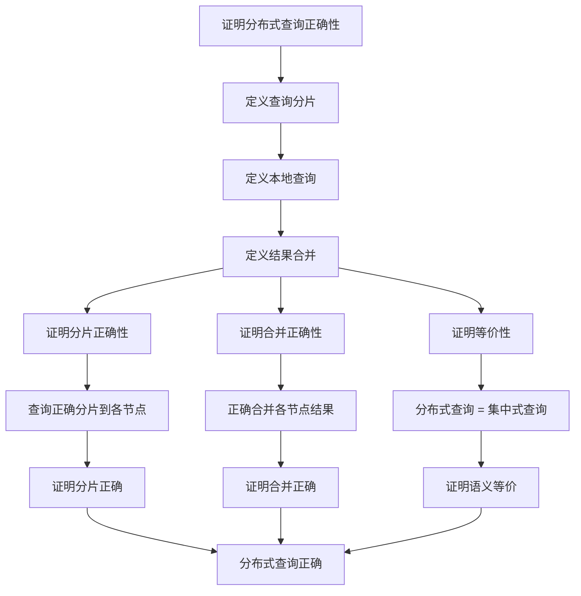
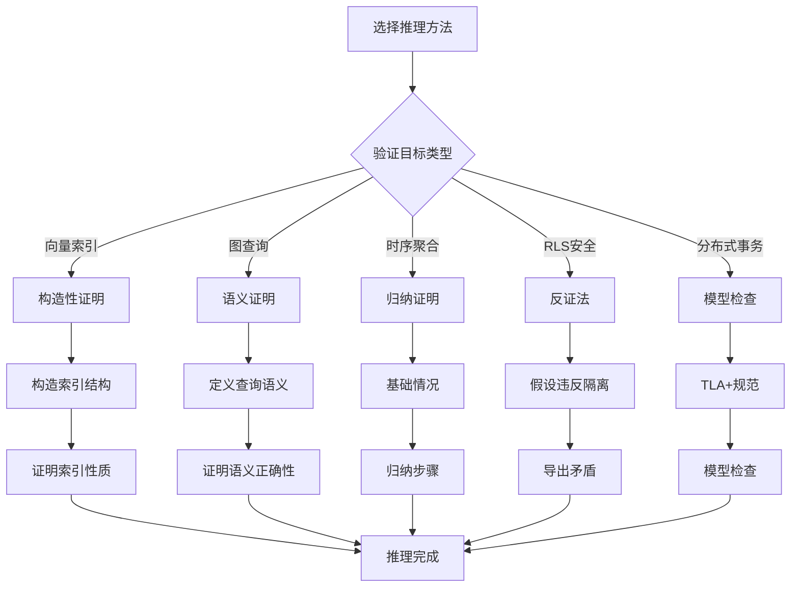

# 推理过程与决策树：数据库设计定理证明的推理框架

> **创建日期**：2025-01-15
> **最后更新**：2025-01-15
> **版本**：v1.0
> **状态**：已完成 ✅

---

## 📋 目录

- [推理过程与决策树：数据库设计定理证明的推理框架](#推理过程与决策树数据库设计定理证明的推理框架)
  - [📋 目录](#-目录)
  - [1. 概述](#1-概述)
  - [2. 推理方法体系](#2-推理方法体系)
    - [2.1. 推理方法分类](#21-推理方法分类)
    - [2.2. 推理方法对比矩阵](#22-推理方法对比矩阵)
  - [3. 证明策略决策树](#3-证明策略决策树)
    - [3.1. 证明策略选择决策树](#31-证明策略选择决策树)
    - [3.2. 证明复杂度决策树](#32-证明复杂度决策树)
  - [4. 推理过程框架](#4-推理过程框架)
    - [4.1. 标准推理过程](#41-标准推理过程)
    - [4.2. 推理过程流程图](#42-推理过程流程图)
    - [4.3. 推理规则应用矩阵](#43-推理规则应用矩阵)
  - [5. 论证结构矩阵](#5-论证结构矩阵)
    - [5.1. 论证结构类型](#51-论证结构类型)
    - [5.2. 论证强度评估矩阵](#52-论证强度评估矩阵)
  - [6. PostgreSQL扩展推理框架](#6-postgresql扩展推理框架)
    - [6.1. 向量数据库推理框架](#61-向量数据库推理框架)
    - [6.2. 知识图谱推理框架](#62-知识图谱推理框架)
    - [6.3. 时序数据库推理框架](#63-时序数据库推理框架)
    - [6.4. 多租户安全推理框架](#64-多租户安全推理框架)
    - [6.5. 分布式数据库推理框架](#65-分布式数据库推理框架)
    - [6.6. 推理方法选择决策树](#66-推理方法选择决策树)
    - [6.7. 推理复杂度评估矩阵](#67-推理复杂度评估矩阵)
  - [7. 参考资料](#7-参考资料)

---

## 1. 概述

本文档提供数据库设计定理证明的推理框架，包括推理方法、决策树、推理过程和论证结构。

---

## 2. 推理方法体系

### 2.1. 推理方法分类



### 2.2. 推理方法对比矩阵

| 推理方法 | 推理方向 | 结论确定性 | 适用场景 | 复杂度 |
|---------|---------|-----------|---------|--------|
| **演绎推理** | 一般→特殊 | 必然真 | 定理证明 | ⭐⭐⭐ |
| **归纳推理** | 特殊→一般 | 或然真 | 模式发现 | ⭐⭐⭐⭐ |
| **溯因推理** | 现象→原因 | 最佳解释 | 问题诊断 | ⭐⭐⭐⭐⭐ |

---

## 3. 证明策略决策树

### 3.1. 证明策略选择决策树



### 3.2. 证明复杂度决策树



---

## 4. 推理过程框架

### 4.1. 标准推理过程

**推理过程步骤**：

```text
1. 前提识别（Premise Identification）
   - 识别已知条件和假设
   - 明确证明目标

2. 推理规则应用（Rule Application）
   - 选择合适的推理规则
   - 应用逻辑推理

3. 中间结论推导（Intermediate Conclusion）
   - 推导中间步骤
   - 验证每一步的正确性

4. 最终结论（Final Conclusion）
   - 得出最终结论
   - 验证结论的正确性

5. 验证检查（Verification）
   - 检查推理链的完整性
   - 验证逻辑一致性
```

### 4.2. 推理过程流程图



### 4.3. 推理规则应用矩阵

| 推理规则 | 前提形式 | 结论形式 | 适用场景 | 示例 |
|---------|---------|---------|---------|------|
| **假言推理** | P → Q, P | Q | 条件推理 | 如果A→B且A，则B |
| **假言三段论** | P → Q, Q → R | P → R | 传递推理 | 如果A→B且B→C，则A→C |
| **选言推理** | P ∨ Q, ¬P | Q | 排除推理 | A或B，非A，则B |
| **合取引入** | P, Q | P ∧ Q | 组合推理 | A且B，则A∧B |
| **析取引入** | P | P ∨ Q | 扩展推理 | A，则A或B |
| **否定引入** | P → ⊥ | ¬P | 反证法 | 如果A导致矛盾，则非A |
| **全称引入** | P(a) for all a | ∀x P(x) | 归纳推理 | 对所有a成立，则全称成立 |
| **存在引入** | P(a) | ∃x P(x) | 存在性证明 | 存在a使得P，则存在x使得P |

---

## 5. 论证结构矩阵

### 5.1. 论证结构类型

| 论证结构 | 结构特点 | 适用场景 | 优势 | 劣势 |
|---------|---------|---------|------|------|
| **线性论证** | 逐步推导 | 简单证明 | 清晰直观 | 可能冗长 |
| **树形论证** | 分支推导 | 复杂证明 | 结构化 | 需要管理分支 |
| **循环论证** | 循环引用 | 相互依赖 | 简洁 | 需要避免循环 |
| **网络论证** | 多路径 | 多角度证明 | 全面 | 复杂度高 |

### 5.2. 论证强度评估矩阵

| 论证类型 | 逻辑强度 | 证据强度 | 结论可靠性 | 示例 |
|---------|---------|---------|-----------|------|
| **演绎论证** | ⭐⭐⭐⭐⭐ | ⭐⭐⭐⭐⭐ | ⭐⭐⭐⭐⭐ | 数学定理 |
| **归纳论证** | ⭐⭐⭐ | ⭐⭐⭐⭐ | ⭐⭐⭐ | 模式识别 |
| **类比论证** | ⭐⭐ | ⭐⭐⭐ | ⭐⭐ | 相似性推理 |
| **因果论证** | ⭐⭐⭐ | ⭐⭐⭐⭐ | ⭐⭐⭐ | 因果关系 |

---

## 6. PostgreSQL扩展推理框架

### 6.1. 向量数据库推理框架

**向量索引正确性推理**：

```mermaid
flowchart TD
    A[证明向量索引正确性] --> B[定义索引性质]

    B --> C[覆盖性证明]
    B --> D[近似性证明]
    B --> E[效率性证明]

    C --> C1[∀v∈D, ∃v'∈I(v)]
    C1 --> C2[证明索引覆盖所有向量]

    D --> D1[I(v) ≈ k-NN(v, k)]
    D1 --> D2[证明索引结果近似k近邻]

    E --> E1[|I(v)| << |D|]
    E1 --> E2[证明索引效率]

    C2 --> F[索引正确性成立]
    D2 --> F
    E2 --> F
```

**向量相似度查询推理**：

```text
推理过程：

前提1：查询向量 q ∈ ℝⁿ
前提2：数据库 D = {v₁, v₂, ..., vₘ}
前提3：相似度函数 SIM(v, w) = cos(θ)

推理步骤：
  1. 定义TOP-k查询：TOP-k(q, k) = {vᵢ | RANK(vᵢ, q) ≤ k}
  2. 定义排名函数：RANK(vᵢ, q) = |{vⱼ | SIM(vⱼ, q) > SIM(vᵢ, q)}|
  3. 证明排名正确性：RANK反映了相似度排序
  4. 证明TOP-k正确性：TOP-k返回真正的k个最相似向量

结论：TOP-k(q, k) 返回查询向量q的k个最相似向量 ✅
```

### 6.2. 知识图谱推理框架

**Cypher查询语义推理**：



**图遍历算法推理**：

```text
推理过程：最短路径算法正确性

前提1：图 G = (V, E)
前提2：源节点 s ∈ V
前提3：目标节点 t ∈ V
前提4：距离函数 d(u, v)

推理步骤：
  1. 定义最短路径：shortest_path(s, t) = argmin_{p} length(p)
  2. 证明算法找到路径：算法返回路径p
  3. 证明路径最短性：∀p', length(p) ≤ length(p')
  4. 证明路径存在性：如果存在路径，算法能找到

结论：最短路径算法返回s到t的最短路径 ✅
```

### 6.3. 时序数据库推理框架

**连续聚合正确性推理**：

```mermaid
flowchart TD
    A[证明连续聚合正确性] --> B[定义聚合函数]

    B --> C[定义时间窗口]
    C --> D[定义聚合操作]

    D --> E[证明窗口正确性]
    D --> F[证明聚合正确性]
    D --> G[证明增量更新正确性]

    E --> E1[W(t, w) = {t' | t-w ≤ t' ≤ t}]
    E1 --> E2[证明窗口定义正确]

    F --> F1[AGG(TS, f, W) = {(t, f(W(t)))}]
    F1 --> F2[证明聚合计算正确]

    G --> G1[增量更新保持一致性]
    G1 --> G2[证明增量更新正确]

    E2 --> H[连续聚合正确]
    F2 --> H
    G2 --> H
```

**时序查询优化推理**：

```text
推理过程：时序查询优化等价性

前提1：原始查询 Q_original
前提2：优化查询 Q_optimized
前提3：时间序列 TS

推理步骤：
  1. 定义查询语义：Q(TS) = {result | condition}
  2. 证明语义等价：Q_original(TS) = Q_optimized(TS)
  3. 证明性能提升：cost(Q_optimized) < cost(Q_original)
  4. 证明正确性：优化不改变结果

结论：时序查询优化保持语义等价且提升性能 ✅
```

### 6.4. 多租户安全推理框架

**RLS策略安全性推理**：

```mermaid
flowchart TD
    A[证明RLS策略安全性] --> B[定义RLS策略]

    B --> C[定义租户隔离]
    C --> D[证明隔离性]

    D --> D1[∀t₁≠t₂, Isolation(t₁, t₂)]
    D1 --> D2[证明不同租户数据不可见]

    D --> E[证明查询隔离]
    E --> E1[查询只能看到自己租户数据]
    E1 --> E2[证明查询隔离正确]

    D --> F[证明更新隔离]
    F --> F1[更新只能影响自己租户]
    F1 --> F2[证明更新隔离正确]

    D2 --> G[RLS安全性成立]
    E2 --> G
    F2 --> G
```

**多租户隔离推理**：

```text
推理过程：多租户数据隔离

前提1：租户 t₁, t₂ ∈ Tenants, t₁ ≠ t₂
前提2：RLS策略 P
前提3：数据库行 row

推理步骤：
  1. 定义可见性：visible(row, t) ⟺ P(t)(row) = true
  2. 证明隔离性：visible(row, t₁) ∧ visible(row, t₂) ⟹ row.tenant_id = t₁ = t₂
  3. 证明查询隔离：query(t) 只能返回 visible(row, t) = true 的行
  4. 证明更新隔离：update(t) 只能更新 visible(row, t) = true 的行

结论：RLS策略保证多租户数据完全隔离 ✅
```

### 6.5. 分布式数据库推理框架

**分布式查询正确性推理**：



**分布式事务一致性推理**：

```text
推理过程：两阶段提交一致性

前提1：协调者 coordinator
前提2：参与者集合 Participants = {p₁, p₂, ..., pₙ}
前提3：事务 T

推理步骤：
  1. 阶段1（准备阶段）：
     - 协调者发送prepare请求
     - 参与者投票（vote ∈ {yes, no}）
     - 证明：所有参与者投票一致

  2. 阶段2（提交阶段）：
     - 如果所有投票=yes：协调者发送commit
     - 如果存在投票=no：协调者发送abort
     - 证明：所有参与者执行相同操作

  3. 一致性证明：
     - 所有参与者要么全部commit，要么全部abort
     - 证明：分布式事务保证一致性

结论：两阶段提交保证分布式事务一致性 ✅
```

### 6.6. 推理方法选择决策树

**PostgreSQL扩展验证推理方法选择**：



### 6.7. 推理复杂度评估矩阵

| 推理场景 | 推理方法 | 复杂度 | 自动化程度 | 证明强度 |
|---------|---------|--------|-----------|---------|
| **向量索引正确性** | 构造性证明 | ⭐⭐⭐⭐ | ⭐⭐⭐ | ⭐⭐⭐⭐⭐ |
| **图查询语义** | 语义证明 | ⭐⭐⭐⭐ | ⭐⭐⭐ | ⭐⭐⭐⭐⭐ |
| **时序聚合** | 归纳证明 | ⭐⭐⭐ | ⭐⭐⭐ | ⭐⭐⭐⭐ |
| **RLS安全性** | 反证法 | ⭐⭐⭐⭐ | ⭐⭐⭐ | ⭐⭐⭐⭐⭐ |
| **分布式事务** | 模型检查 | ⭐⭐⭐⭐⭐ | ⭐⭐⭐⭐ | ⭐⭐⭐⭐ |

---

## 7. 参考资料

- [核心定理证明](./03.01-核心定理证明.md)
- [形式化验证](./03.02-形式化验证.md)
- [概念定义与属性关系](./03.03-概念定义与属性关系.md)

---

**最后更新**：2025-01-15
**维护者**：Data-Science Team
**状态**：已完成 ✅
