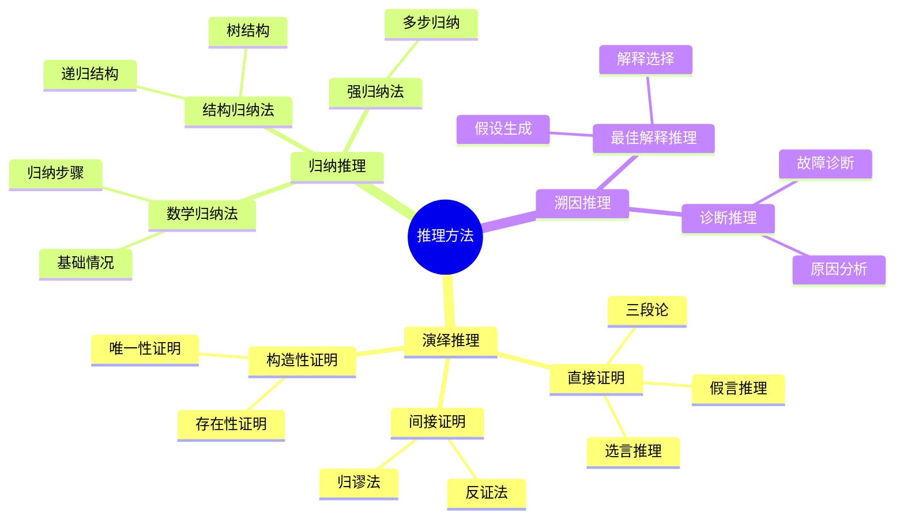
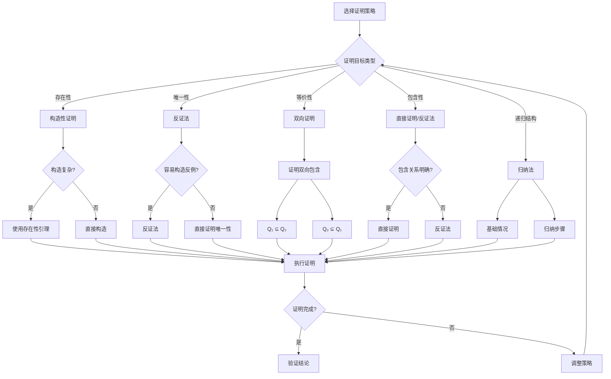
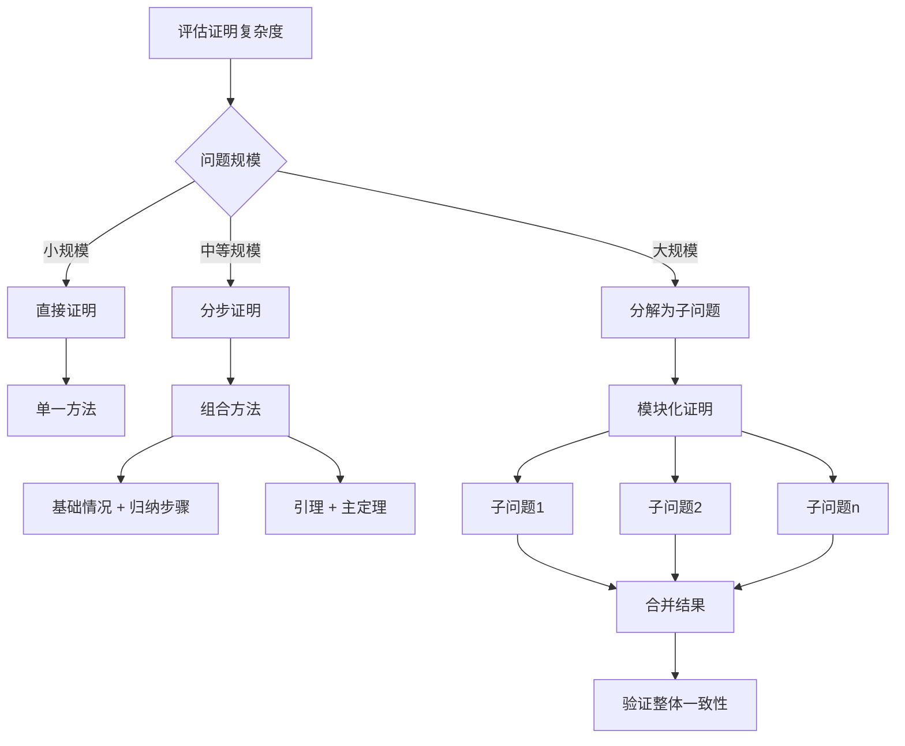
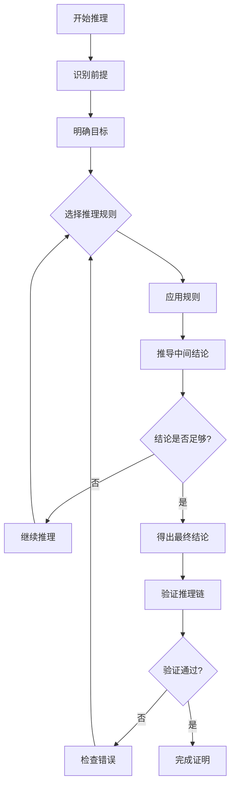

# 推理过程与决策树：数据库设计定理证明的推理框架

> **创建日期**：2025-01-15
> **最后更新**：2025-01-15
> **版本**：v1.0
> **状态**：实施中

---

## 📋 目录

- [推理过程与决策树：数据库设计定理证明的推理框架](#推理过程与决策树数据库设计定理证明的推理框架)
  - [📋 目录](#-目录)
  - [1. 概述](#1-概述)
  - [2. 推理方法体系](#2-推理方法体系)
    - [2.1. 推理方法分类](#21-推理方法分类)
    - [2.2. 推理方法对比矩阵](#22-推理方法对比矩阵)
  - [3. 证明策略决策树](#3-证明策略决策树)
    - [3.1. 证明策略选择决策树](#31-证明策略选择决策树)
    - [3.2. 证明复杂度决策树](#32-证明复杂度决策树)
  - [4. 推理过程框架](#4-推理过程框架)
    - [4.1. 标准推理过程](#41-标准推理过程)
    - [4.2. 推理过程流程图](#42-推理过程流程图)
    - [4.3. 推理规则应用矩阵](#43-推理规则应用矩阵)
  - [5. 论证结构矩阵](#5-论证结构矩阵)
    - [5.1. 论证结构类型](#51-论证结构类型)
    - [5.2. 论证强度评估矩阵](#52-论证强度评估矩阵)
  - [6. 参考资料](#6-参考资料)

---

## 1. 概述

本文档提供数据库设计定理证明的推理框架，包括推理方法、决策树、推理过程和论证结构。

---

## 2. 推理方法体系

### 2.1. 推理方法分类



### 2.2. 推理方法对比矩阵

| 推理方法 | 推理方向 | 结论确定性 | 适用场景 | 复杂度 |
|---------|---------|-----------|---------|--------|
| **演绎推理** | 一般→特殊 | 必然真 | 定理证明 | ⭐⭐⭐ |
| **归纳推理** | 特殊→一般 | 或然真 | 模式发现 | ⭐⭐⭐⭐ |
| **溯因推理** | 现象→原因 | 最佳解释 | 问题诊断 | ⭐⭐⭐⭐⭐ |

---

## 3. 证明策略决策树

### 3.1. 证明策略选择决策树



### 3.2. 证明复杂度决策树



---

## 4. 推理过程框架

### 4.1. 标准推理过程

**推理过程步骤**：

```text
1. 前提识别（Premise Identification）
   - 识别已知条件和假设
   - 明确证明目标

2. 推理规则应用（Rule Application）
   - 选择合适的推理规则
   - 应用逻辑推理

3. 中间结论推导（Intermediate Conclusion）
   - 推导中间步骤
   - 验证每一步的正确性

4. 最终结论（Final Conclusion）
   - 得出最终结论
   - 验证结论的正确性

5. 验证检查（Verification）
   - 检查推理链的完整性
   - 验证逻辑一致性
```

### 4.2. 推理过程流程图



### 4.3. 推理规则应用矩阵

| 推理规则 | 前提形式 | 结论形式 | 适用场景 | 示例 |
|---------|---------|---------|---------|------|
| **假言推理** | P → Q, P | Q | 条件推理 | 如果A→B且A，则B |
| **假言三段论** | P → Q, Q → R | P → R | 传递推理 | 如果A→B且B→C，则A→C |
| **选言推理** | P ∨ Q, ¬P | Q | 排除推理 | A或B，非A，则B |
| **合取引入** | P, Q | P ∧ Q | 组合推理 | A且B，则A∧B |
| **析取引入** | P | P ∨ Q | 扩展推理 | A，则A或B |
| **否定引入** | P → ⊥ | ¬P | 反证法 | 如果A导致矛盾，则非A |
| **全称引入** | P(a) for all a | ∀x P(x) | 归纳推理 | 对所有a成立，则全称成立 |
| **存在引入** | P(a) | ∃x P(x) | 存在性证明 | 存在a使得P，则存在x使得P |

---

## 5. 论证结构矩阵

### 5.1. 论证结构类型

| 论证结构 | 结构特点 | 适用场景 | 优势 | 劣势 |
|---------|---------|---------|------|------|
| **线性论证** | 逐步推导 | 简单证明 | 清晰直观 | 可能冗长 |
| **树形论证** | 分支推导 | 复杂证明 | 结构化 | 需要管理分支 |
| **循环论证** | 循环引用 | 相互依赖 | 简洁 | 需要避免循环 |
| **网络论证** | 多路径 | 多角度证明 | 全面 | 复杂度高 |

### 5.2. 论证强度评估矩阵

| 论证类型 | 逻辑强度 | 证据强度 | 结论可靠性 | 示例 |
|---------|---------|---------|-----------|------|
| **演绎论证** | ⭐⭐⭐⭐⭐ | ⭐⭐⭐⭐⭐ | ⭐⭐⭐⭐⭐ | 数学定理 |
| **归纳论证** | ⭐⭐⭐ | ⭐⭐⭐⭐ | ⭐⭐⭐ | 模式识别 |
| **类比论证** | ⭐⭐ | ⭐⭐⭐ | ⭐⭐ | 相似性推理 |
| **因果论证** | ⭐⭐⭐ | ⭐⭐⭐⭐ | ⭐⭐⭐ | 因果关系 |

---

## 6. 参考资料

- [核心定理证明](./03.01-核心定理证明.md)
- [形式化验证](./03.02-形式化验证.md)
- [概念定义与属性关系](./03.03-概念定义与属性关系.md)

---

**最后更新**：2025-01-15
**维护者**：Data-Science Team
**状态**：实施中
