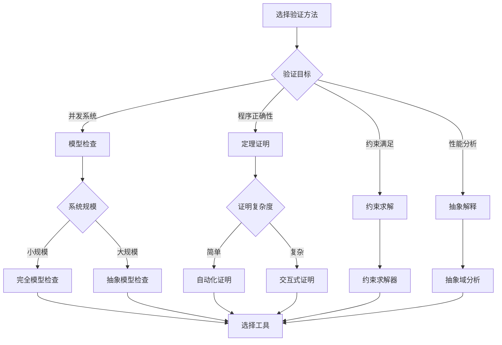
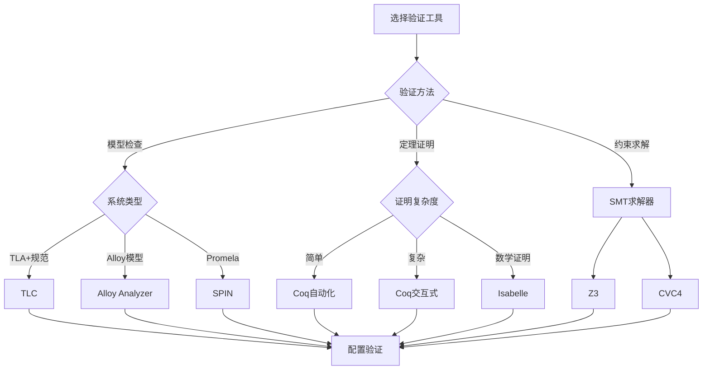
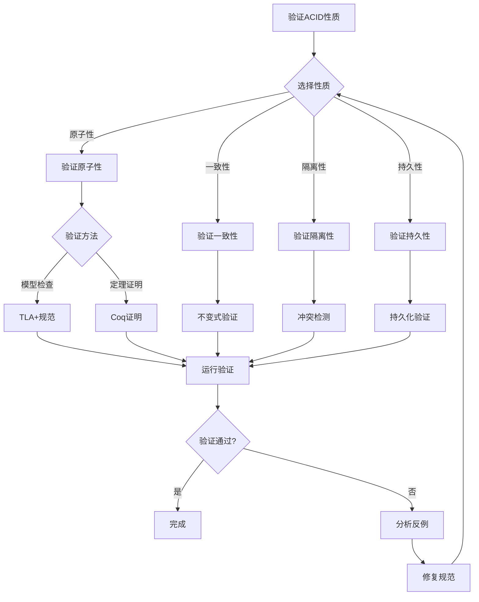
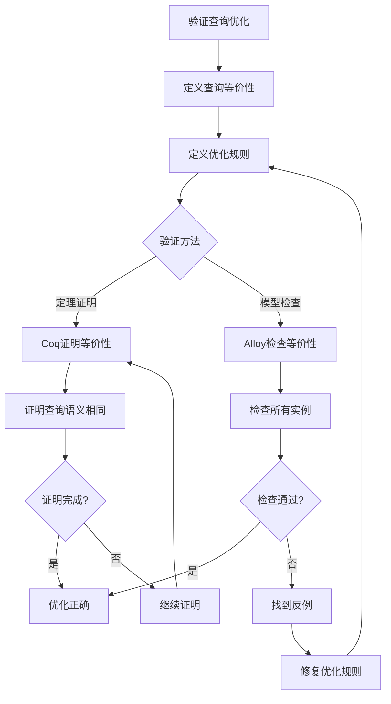

# 形式化验证决策树库：数据库系统形式化验证的决策框架

> **创建日期**：2025-01-15
> **最后更新**：2025-01-15
> **版本**：v1.0
> **状态**：实施中

---

## 📋 目录

- [形式化验证决策树库：数据库系统形式化验证的决策框架](#形式化验证决策树库数据库系统形式化验证的决策框架)
  - [📋 目录](#-目录)
  - [1. 概述](#1-概述)
  - [2. 验证方法选择决策树](#2-验证方法选择决策树)
    - [2.1. 验证方法选择完整决策树](#21-验证方法选择完整决策树)
    - [2.2. 验证方法对比矩阵](#22-验证方法对比矩阵)
  - [3. 工具选择决策树](#3-工具选择决策树)
    - [3.1. 工具选择完整决策树](#31-工具选择完整决策树)
    - [3.2. 工具对比矩阵](#32-工具对比矩阵)
  - [4. 验证策略决策树](#4-验证策略决策树)
    - [4.1. ACID性质验证策略](#41-acid性质验证策略)
    - [4.2. 查询优化验证策略](#42-查询优化验证策略)
  - [5. 验证方法对比矩阵](#5-验证方法对比矩阵)
    - [5.1. 综合对比矩阵](#51-综合对比矩阵)
    - [5.2. 验证场景选择矩阵](#52-验证场景选择矩阵)
  - [6. 参考资料](#6-参考资料)

---

## 1. 概述

本文档提供数据库系统形式化验证的决策树集合，帮助选择合适的验证方法和工具。

---

## 2. 验证方法选择决策树

### 2.1. 验证方法选择完整决策树

### 2.2. 验证方法对比矩阵

| 验证方法 | 适用场景 | 自动化程度 | 证明强度 | 性能 |
|---------|---------|-----------|---------|------|
| **模型检查** | 并发系统 | ⭐⭐⭐⭐ | ⭐⭐⭐ | ⭐⭐⭐ |
| **定理证明** | 程序正确性 | ⭐⭐⭐ | ⭐⭐⭐⭐⭐ | ⭐⭐⭐ |
| **约束求解** | 约束满足 | ⭐⭐⭐⭐⭐ | ⭐⭐⭐ | ⭐⭐⭐⭐ |
| **抽象解释** | 性能分析 | ⭐⭐⭐⭐ | ⭐⭐⭐ | ⭐⭐⭐⭐ |

---

## 3. 工具选择决策树

### 3.1. 工具选择完整决策树

### 3.2. 工具对比矩阵

| 工具 | 验证方法 | 学习曲线 | 自动化 | 性能 | 适用场景 |
|------|---------|---------|--------|------|---------|
| **TLC** | 模型检查 | ⭐⭐⭐ | ⭐⭐⭐⭐ | ⭐⭐⭐ | TLA+规范 |
| **Coq** | 定理证明 | ⭐⭐⭐⭐⭐ | ⭐⭐⭐ | ⭐⭐⭐ | 程序验证 |
| **Isabelle** | 定理证明 | ⭐⭐⭐⭐ | ⭐⭐⭐ | ⭐⭐⭐ | 数学证明 |
| **Alloy** | 模型检查 | ⭐⭐ | ⭐⭐⭐⭐⭐ | ⭐⭐⭐ | 约束验证 |
| **Z3** | SMT求解 | ⭐⭐⭐ | ⭐⭐⭐⭐⭐ | ⭐⭐⭐⭐⭐ | 约束求解 |

---

## 4. 验证策略决策树

### 4.1. ACID性质验证策略

### 4.2. 查询优化验证策略

---

## 5. 验证方法对比矩阵

### 5.1. 综合对比矩阵

| 验证方法 | 工具 | 适用场景 | 自动化 | 证明强度 | 性能 | 学习曲线 |
|---------|------|---------|--------|---------|------|---------|
| **模型检查** | TLC | 并发系统 | ⭐⭐⭐⭐ | ⭐⭐⭐ | ⭐⭐⭐ | ⭐⭐⭐ |
| **模型检查** | Alloy | 约束验证 | ⭐⭐⭐⭐⭐ | ⭐⭐⭐ | ⭐⭐⭐ | ⭐⭐ |
| **定理证明** | Coq | 程序验证 | ⭐⭐⭐ | ⭐⭐⭐⭐⭐ | ⭐⭐⭐ | ⭐⭐⭐⭐⭐ |
| **定理证明** | Isabelle | 数学证明 | ⭐⭐⭐ | ⭐⭐⭐⭐⭐ | ⭐⭐⭐ | ⭐⭐⭐⭐ |
| **约束求解** | Z3 | 约束求解 | ⭐⭐⭐⭐⭐ | ⭐⭐⭐ | ⭐⭐⭐⭐⭐ | ⭐⭐⭐ |

### 5.2. 验证场景选择矩阵

| 验证场景 | 推荐方法 | 推荐工具 | 理由 |
|---------|---------|---------|------|
| **事务原子性** | 模型检查 | TLC | 并发系统，需要检查所有执行路径 |
| **函数依赖** | 定理证明 | Coq/Isabelle | 数学性质，需要严格证明 |
| **查询等价性** | 定理证明 | Coq | 需要证明语义等价 |
| **约束满足** | 约束求解 | Alloy/Z3 | 需要找到满足约束的实例 |
| **性能分析** | 抽象解释 | 抽象域 | 需要分析性能属性 |

---

## 6. 参考资料

- [形式化验证](./03.02-形式化验证.md)
- [形式化方法](../01-理论模型/01.05-形式化方法.md)
- [核心定理证明](./03.01-核心定理证明.md)

---

**最后更新**：2025-01-15
**维护者**：Data-Science Team
**状态**：实施中
