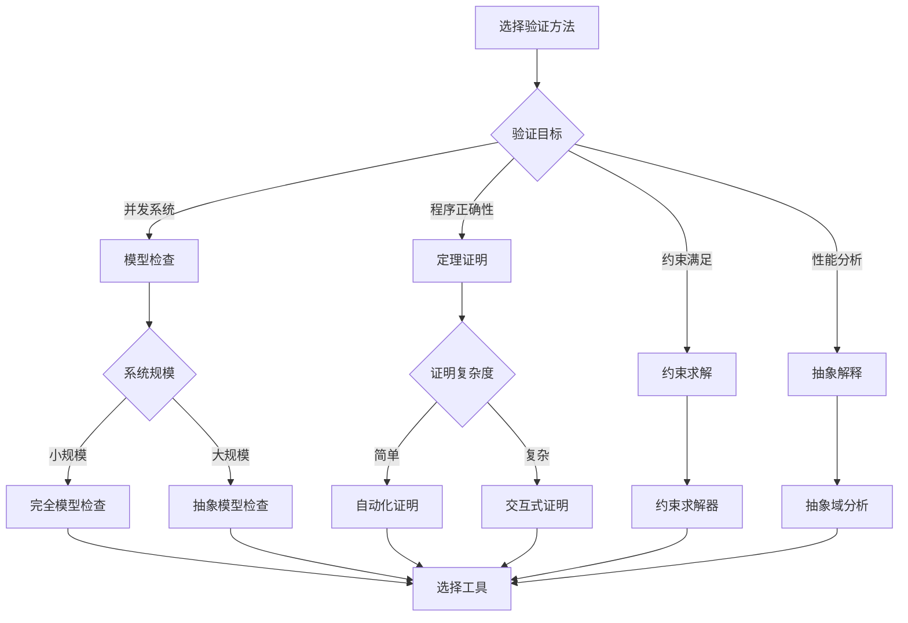
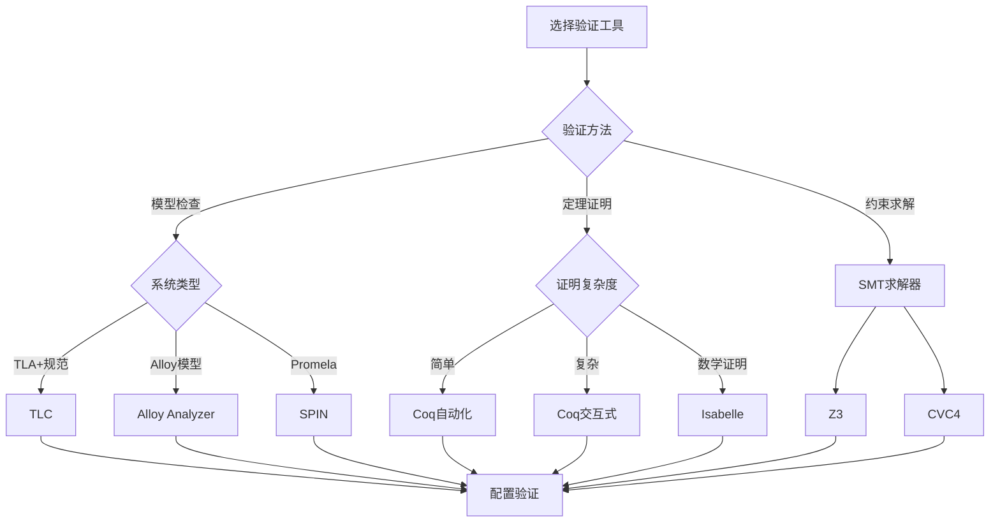
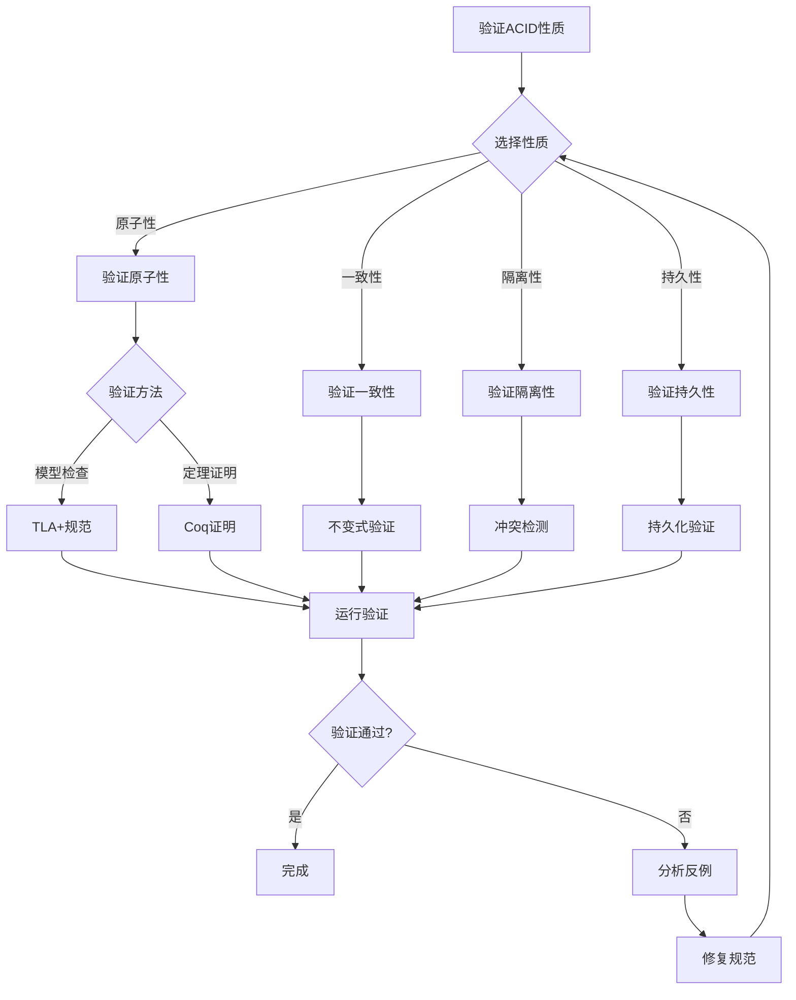
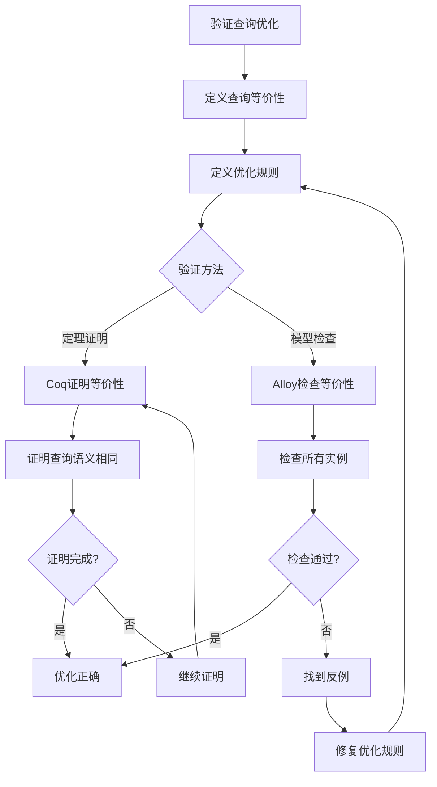
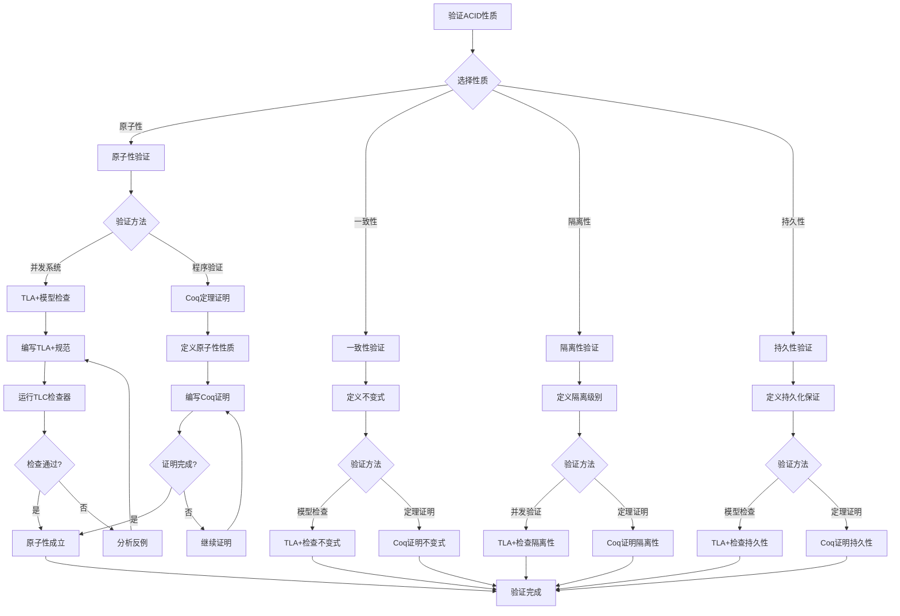
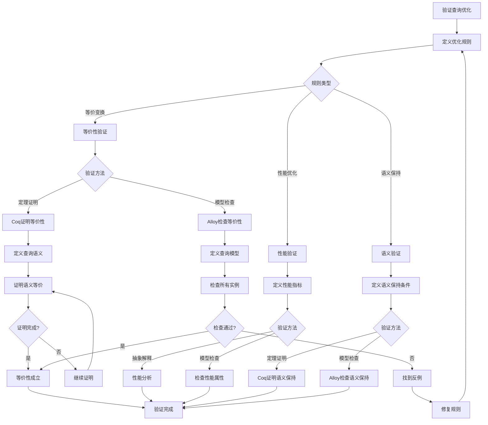
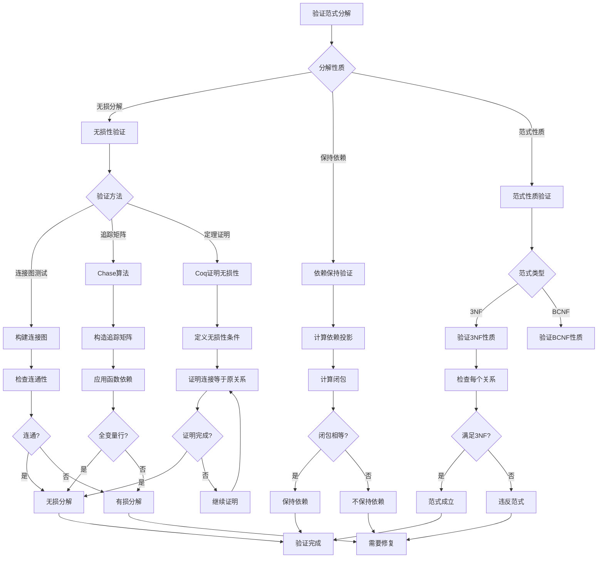
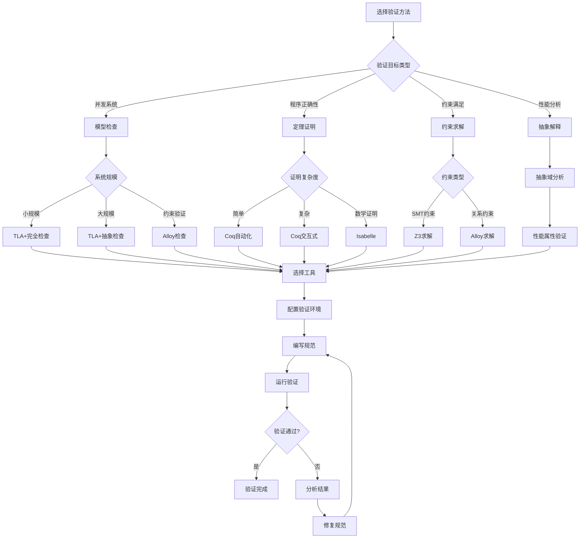
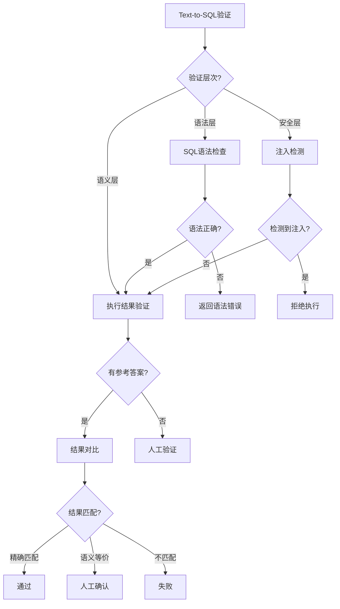

# 形式化验证决策树库：数据库系统形式化验证的决策框架

> **创建日期**：2025-01-15
> **最后更新**：2025-12-01
> **版本**：v2.0
> **状态**：已完成 ✅

---

## 📋 目录

- [形式化验证决策树库：数据库系统形式化验证的决策框架](#形式化验证决策树库数据库系统形式化验证的决策框架)
  - [📋 目录](#-目录)
  - [1. 概述](#1-概述)
  - [2. 验证方法选择决策树](#2-验证方法选择决策树)
    - [2.1. 验证方法选择完整决策树](#21-验证方法选择完整决策树)
    - [2.2. 验证方法对比矩阵](#22-验证方法对比矩阵)
  - [3. 工具选择决策树](#3-工具选择决策树)
    - [3.1. 工具选择完整决策树](#31-工具选择完整决策树)
    - [3.2. 工具对比矩阵](#32-工具对比矩阵)
  - [4. 验证策略决策树](#4-验证策略决策树)
    - [4.1. ACID性质验证策略](#41-acid性质验证策略)
    - [4.2. 查询优化验证策略](#42-查询优化验证策略)
  - [5. 验证方法对比矩阵](#5-验证方法对比矩阵)
    - [5.1. 综合对比矩阵](#51-综合对比矩阵)
    - [5.2. 验证场景选择矩阵](#52-验证场景选择矩阵)
  - [6. 数据库系统验证决策树](#6-数据库系统验证决策树)
    - [6.1. ACID性质验证决策树](#61-acid性质验证决策树)
    - [6.2. 查询优化验证决策树](#62-查询优化验证决策树)
    - [6.3. 范式分解验证决策树](#63-范式分解验证决策树)
    - [6.4. 验证方法选择综合决策树](#64-验证方法选择综合决策树)
    - [6.5. 验证场景选择矩阵](#65-验证场景选择矩阵)
  - [7. AI系统验证决策树](#7-ai系统验证决策树)
    - [7.1. RAG系统验证决策树](#71-rag系统验证决策树)
    - [7.2. Text-to-SQL验证决策树](#72-text-to-sql验证决策树)
    - [7.3. 向量索引验证决策树](#73-向量索引验证决策树)
    - [7.4. AI系统验证场景矩阵](#74-ai系统验证场景矩阵)
  - [8. 参考资料](#8-参考资料)
    - [8.1. 相关文档](#81-相关文档)
    - [8.2. 工具资源](#82-工具资源)

---

## 1. 概述

本文档提供数据库系统形式化验证的决策树集合，帮助选择合适的验证方法和工具。

---

## 2. 验证方法选择决策树

### 2.1. 验证方法选择完整决策树



### 2.2. 验证方法对比矩阵

| 验证方法 | 适用场景 | 自动化程度 | 证明强度 | 性能 |
|---------|---------|-----------|---------|------|
| **模型检查** | 并发系统 | ⭐⭐⭐⭐ | ⭐⭐⭐ | ⭐⭐⭐ |
| **定理证明** | 程序正确性 | ⭐⭐⭐ | ⭐⭐⭐⭐⭐ | ⭐⭐⭐ |
| **约束求解** | 约束满足 | ⭐⭐⭐⭐⭐ | ⭐⭐⭐ | ⭐⭐⭐⭐ |
| **抽象解释** | 性能分析 | ⭐⭐⭐⭐ | ⭐⭐⭐ | ⭐⭐⭐⭐ |

---

## 3. 工具选择决策树

### 3.1. 工具选择完整决策树



### 3.2. 工具对比矩阵

| 工具 | 验证方法 | 学习曲线 | 自动化 | 性能 | 适用场景 |
|------|---------|---------|--------|------|---------|
| **TLC** | 模型检查 | ⭐⭐⭐ | ⭐⭐⭐⭐ | ⭐⭐⭐ | TLA+规范 |
| **Coq** | 定理证明 | ⭐⭐⭐⭐⭐ | ⭐⭐⭐ | ⭐⭐⭐ | 程序验证 |
| **Isabelle** | 定理证明 | ⭐⭐⭐⭐ | ⭐⭐⭐ | ⭐⭐⭐ | 数学证明 |
| **Alloy** | 模型检查 | ⭐⭐ | ⭐⭐⭐⭐⭐ | ⭐⭐⭐ | 约束验证 |
| **Z3** | SMT求解 | ⭐⭐⭐ | ⭐⭐⭐⭐⭐ | ⭐⭐⭐⭐⭐ | 约束求解 |

---

## 4. 验证策略决策树

### 4.1. ACID性质验证策略



### 4.2. 查询优化验证策略



---

## 5. 验证方法对比矩阵

### 5.1. 综合对比矩阵

| 验证方法 | 工具 | 适用场景 | 自动化 | 证明强度 | 性能 | 学习曲线 |
|---------|------|---------|--------|---------|------|---------|
| **模型检查** | TLC | 并发系统 | ⭐⭐⭐⭐ | ⭐⭐⭐ | ⭐⭐⭐ | ⭐⭐⭐ |
| **模型检查** | Alloy | 约束验证 | ⭐⭐⭐⭐⭐ | ⭐⭐⭐ | ⭐⭐⭐ | ⭐⭐ |
| **定理证明** | Coq | 程序验证 | ⭐⭐⭐ | ⭐⭐⭐⭐⭐ | ⭐⭐⭐ | ⭐⭐⭐⭐⭐ |
| **定理证明** | Isabelle | 数学证明 | ⭐⭐⭐ | ⭐⭐⭐⭐⭐ | ⭐⭐⭐ | ⭐⭐⭐⭐ |
| **约束求解** | Z3 | 约束求解 | ⭐⭐⭐⭐⭐ | ⭐⭐⭐ | ⭐⭐⭐⭐⭐ | ⭐⭐⭐ |

### 5.2. 验证场景选择矩阵

| 验证场景 | 推荐方法 | 推荐工具 | 理由 |
|---------|---------|---------|------|
| **事务原子性** | 模型检查 | TLC | 并发系统，需要检查所有执行路径 |
| **函数依赖** | 定理证明 | Coq/Isabelle | 数学性质，需要严格证明 |
| **查询等价性** | 定理证明 | Coq | 需要证明语义等价 |
| **约束满足** | 约束求解 | Alloy/Z3 | 需要找到满足约束的实例 |
| **性能分析** | 抽象解释 | 抽象域 | 需要分析性能属性 |

---

## 6. 数据库系统验证决策树

### 6.1. ACID性质验证决策树



### 6.2. 查询优化验证决策树



### 6.3. 范式分解验证决策树



### 6.4. 验证方法选择综合决策树



### 6.5. 验证场景选择矩阵

| 验证场景 | 推荐方法 | 推荐工具 | 选择理由 | 验证强度 |
|---------|---------|---------|---------|---------|
| **事务原子性** | 模型检查 | TLA+/TLC | 并发系统，需要检查所有执行路径 | ⭐⭐⭐⭐ |
| **ACID一致性** | 定理证明 | Coq | 需要严格证明不变式 | ⭐⭐⭐⭐⭐ |
| **隔离级别** | 模型检查 | TLA+/TLC | 需要检查并发执行 | ⭐⭐⭐⭐ |
| **函数依赖** | 定理证明 | Coq/Isabelle | 数学性质，需要严格证明 | ⭐⭐⭐⭐⭐ |
| **查询等价性** | 定理证明 | Coq | 需要证明语义等价 | ⭐⭐⭐⭐⭐ |
| **范式分解** | 定理证明 | Coq | 需要证明分解性质 | ⭐⭐⭐⭐⭐ |
| **查询优化** | 约束求解 | Alloy/Z3 | 需要验证优化规则 | ⭐⭐⭐ |
| **性能分析** | 抽象解释 | 抽象域 | 需要分析性能属性 | ⭐⭐⭐ |

---

## 7. AI系统验证决策树

### 7.1. RAG系统验证决策树

```mermaid
flowchart TD
    A[RAG系统验证] --> B{验证目标?}

    B -->|检索质量| C[召回率验证]
    B -->|生成质量| D[输出验证]
    B -->|端到端| E[系统验证]

    C --> C1{测试方法?}
    C1 -->|标注数据| C2[Recall@K测试]
    C1 -->|人工评估| C3[相关性评分]

    D --> D1{验证标准?}
    D1 -->|事实性| D2[知识库对比]
    D1 -->|相关性| D3[上下文匹配]
    D1 -->|安全性| D4[过滤检查]

    E --> E1[集成测试]
    E1 --> E2[端到端评估]

    C2 --> F[验证报告]
    C3 --> F
    D2 --> F
    D3 --> F
    D4 --> F
    E2 --> F
```

**RAG验证SQL实现**：

```sql
-- 召回率验证函数
CREATE OR REPLACE FUNCTION verify_rag_recall(
    test_queries JSONB,  -- [{"query": "...", "expected_ids": [...]}]
    k INT DEFAULT 10
) RETURNS TABLE (
    query_text TEXT,
    recall_at_k FLOAT,
    retrieved_ids UUID[],
    expected_ids UUID[]
) AS $$
DECLARE
    test_case JSONB;
    query_embedding vector(1536);
    retrieved UUID[];
    expected UUID[];
    hit_count INT;
BEGIN
    FOR test_case IN SELECT * FROM jsonb_array_elements(test_queries)
    LOOP
        -- 生成查询向量（假设有embed函数）
        query_embedding := embed(test_case->>'query');

        -- 检索top-k
        SELECT ARRAY_AGG(id ORDER BY embedding <-> query_embedding)
        INTO retrieved
        FROM documents
        ORDER BY embedding <-> query_embedding
        LIMIT k;

        -- 期望结果
        expected := ARRAY(SELECT jsonb_array_elements_text(test_case->'expected_ids')::UUID);

        -- 计算召回率
        SELECT COUNT(*) INTO hit_count
        FROM UNNEST(retrieved) r
        WHERE r = ANY(expected);

        RETURN QUERY SELECT
            test_case->>'query',
            hit_count::FLOAT / ARRAY_LENGTH(expected, 1),
            retrieved,
            expected;
    END LOOP;
END;
$$ LANGUAGE plpgsql;
```

### 7.2. Text-to-SQL验证决策树



**Text-to-SQL验证实现**：

```python
from dataclasses import dataclass
from typing import Optional
import sqlparse

@dataclass
class SQLValidationResult:
    is_valid: bool
    syntax_ok: bool
    semantic_ok: bool
    security_ok: bool
    error_message: Optional[str] = None

class TextToSQLValidator:
    """Text-to-SQL验证器"""

    DANGEROUS_KEYWORDS = ['DROP', 'DELETE', 'TRUNCATE', 'ALTER', 'GRANT']

    def validate(self, generated_sql: str, expected_result=None) -> SQLValidationResult:
        # 1. 语法验证
        syntax_ok, syntax_error = self._check_syntax(generated_sql)
        if not syntax_ok:
            return SQLValidationResult(
                is_valid=False,
                syntax_ok=False,
                semantic_ok=False,
                security_ok=False,
                error_message=syntax_error
            )

        # 2. 安全验证
        security_ok, security_error = self._check_security(generated_sql)
        if not security_ok:
            return SQLValidationResult(
                is_valid=False,
                syntax_ok=True,
                semantic_ok=False,
                security_ok=False,
                error_message=security_error
            )

        # 3. 语义验证（如果有期望结果）
        semantic_ok = True
        if expected_result is not None:
            semantic_ok = self._check_semantic(generated_sql, expected_result)

        return SQLValidationResult(
            is_valid=syntax_ok and security_ok and semantic_ok,
            syntax_ok=syntax_ok,
            semantic_ok=semantic_ok,
            security_ok=security_ok
        )

    def _check_syntax(self, sql: str) -> tuple[bool, Optional[str]]:
        try:
            parsed = sqlparse.parse(sql)
            if not parsed or not parsed[0].tokens:
                return False, "Empty SQL"
            return True, None
        except Exception as e:
            return False, str(e)

    def _check_security(self, sql: str) -> tuple[bool, Optional[str]]:
        sql_upper = sql.upper()
        for keyword in self.DANGEROUS_KEYWORDS:
            if keyword in sql_upper:
                return False, f"Dangerous keyword detected: {keyword}"
        return True, None

    def _check_semantic(self, sql: str, expected) -> bool:
        # 执行并比较结果
        # 实际实现需要数据库连接
        return True
```

### 7.3. 向量索引验证决策树

```mermaid
flowchart TD
    A[向量索引验证] --> B{验证目标?}

    B -->|召回率| C[Recall测试]
    B -->|延迟| D[Latency测试]
    B -->|吞吐量| E[QPS测试]

    C --> C1{数据集?}
    C1 -->|标准基准| C2[SIFT/GIST测试]
    C1 -->|自定义| C3[自定义测试集]

    C2 --> C4[计算Recall@K]
    C3 --> C4

    D --> D1[P50/P95/P99延迟]
    E --> E1[并发QPS测试]

    C4 --> F{达到目标?}
    D1 --> F
    E1 --> F

    F -->|是| G[验证通过]
    F -->|否| H[调整参数]
    H --> A
```

**向量索引基准测试**：

```sql
-- 向量索引性能验证
CREATE OR REPLACE FUNCTION benchmark_vector_index(
    test_vectors vector[],
    ground_truth UUID[][],  -- 每个查询的真实最近邻
    k INT DEFAULT 10
) RETURNS TABLE (
    recall_at_k FLOAT,
    avg_latency_ms FLOAT,
    p95_latency_ms FLOAT,
    qps FLOAT
) AS $$
DECLARE
    total_recall FLOAT := 0;
    latencies FLOAT[] := '{}';
    start_time TIMESTAMP;
    end_time TIMESTAMP;
    query_vec vector;
    truth UUID[];
    retrieved UUID[];
    hit_count INT;
    i INT := 1;
BEGIN
    start_time := clock_timestamp();

    FOREACH query_vec IN ARRAY test_vectors
    LOOP
        -- 执行查询
        SELECT ARRAY_AGG(id ORDER BY embedding <-> query_vec)
        INTO retrieved
        FROM documents
        ORDER BY embedding <-> query_vec
        LIMIT k;

        -- 获取ground truth
        truth := ground_truth[i];

        -- 计算召回
        SELECT COUNT(*) INTO hit_count
        FROM UNNEST(retrieved) r
        WHERE r = ANY(truth);

        total_recall := total_recall + (hit_count::FLOAT / k);

        -- 记录延迟（简化）
        latencies := latencies || EXTRACT(EPOCH FROM (clock_timestamp() - start_time)) * 1000;

        i := i + 1;
    END LOOP;

    end_time := clock_timestamp();

    RETURN QUERY SELECT
        total_recall / ARRAY_LENGTH(test_vectors, 1),
        AVG(lat) FROM UNNEST(latencies) lat,
        PERCENTILE_CONT(0.95) WITHIN GROUP (ORDER BY lat) FROM UNNEST(latencies) lat,
        ARRAY_LENGTH(test_vectors, 1)::FLOAT / EXTRACT(EPOCH FROM (end_time - start_time));
END;
$$ LANGUAGE plpgsql;
```

### 7.4. AI系统验证场景矩阵

| 验证场景 | 验证方法 | 关键指标 | 自动化程度 | 工具 |
|---------|---------|---------|-----------|------|
| **RAG召回** | 标注数据测试 | Recall@K, MRR | ⭐⭐⭐⭐⭐ | pytest + pgvector |
| **RAG生成** | LLM评估 | 相关性、准确性 | ⭐⭐⭐ | LLM-as-judge |
| **Text-to-SQL** | 执行对比 | 准确率、语义等价 | ⭐⭐⭐⭐ | sqlparse + pytest |
| **向量索引** | 基准测试 | 召回率、延迟、QPS | ⭐⭐⭐⭐⭐ | pgbench + 自定义 |
| **安全性** | 注入检测 | 拦截率 | ⭐⭐⭐⭐ | WAF + 规则 |

---

## 8. 参考资料

### 8.1. 相关文档

- [形式化验证](./03.02-形式化验证.md)
- [形式化方法](../01-理论模型/01.05-形式化方法.md)
- [核心定理证明](./03.01-核心定理证明.md)
- [向量数据库设计](../07-数据库设计实践/07.10-向量数据库设计.md)
- [AI驱动数据库优化](../01-理论模型/01.10-AI驱动数据库优化理论.md)

### 8.2. 工具资源

- [TLA+ Tools](https://lamport.azurewebsites.net/tla/tools.html)
- [Coq Proof Assistant](https://coq.inria.fr/)
- [sqlparse](https://github.com/andialbrecht/sqlparse)

---

**最后更新**：2025-12-01
**维护者**：Data-Science Team
**状态**：已完成 ✅
