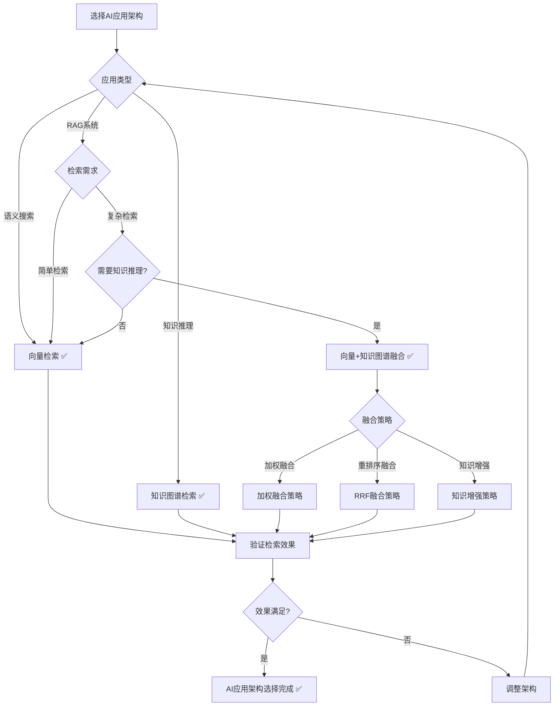
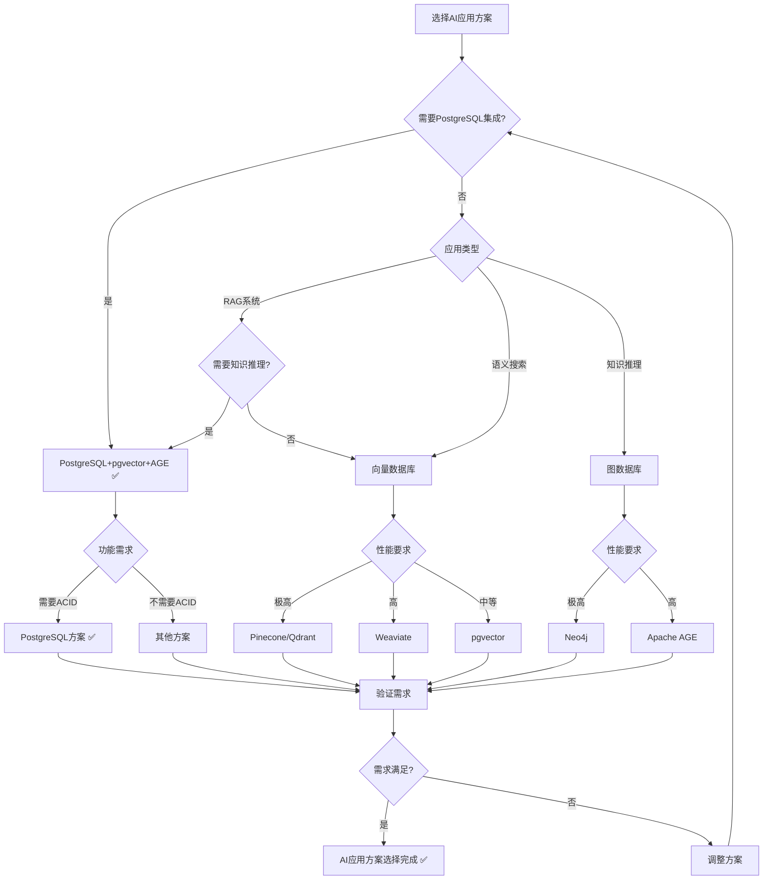

# PostgreSQL扩展：AI应用场景形式化理论分析

> **创建日期**：2025-01-15
> **最后更新**：2025-01-15
> **版本**：v1.0
> **状态**：进行中

---

## 📋 目录

- [PostgreSQL扩展：AI应用场景形式化理论分析](#postgresql扩展ai应用场景形式化理论分析)
  - [📋 目录](#-目录)
  - [1. 概述](#1-概述)
    - [1.1. AI应用场景简介](#11-ai应用场景简介)
    - [1.2. AI应用的重要性](#12-ai应用的重要性)
    - [1.3. PostgreSQL在AI应用中的位置](#13-postgresql在ai应用中的位置)
  - [2. AI应用的形式化定义](#2-ai应用的形式化定义)
    - [2.1. RAG系统的形式化定义](#21-rag系统的形式化定义)
      - [2.1.1. RAG架构的形式化定义](#211-rag架构的形式化定义)
      - [2.1.2. 检索器的形式化定义](#212-检索器的形式化定义)
      - [2.1.3. 生成器的形式化定义](#213-生成器的形式化定义)
    - [2.2. 向量与知识图谱融合的形式化定义](#22-向量与知识图谱融合的形式化定义)
      - [2.2.1. 混合检索的形式化定义](#221-混合检索的形式化定义)
      - [2.2.2. 知识增强的形式化定义](#222-知识增强的形式化定义)
      - [2.2.3. 融合策略的形式化定义](#223-融合策略的形式化定义)
    - [2.3. 语义搜索的形式化定义](#23-语义搜索的形式化定义)
      - [2.3.1. 语义搜索的形式化定义](#231-语义搜索的形式化定义)
      - [2.3.2. 语义索引的形式化定义](#232-语义索引的形式化定义)
      - [2.3.3. 语义查询的形式化定义](#233-语义查询的形式化定义)
  - [3. AI应用架构的形式化理论](#3-ai应用架构的形式化理论)
    - [3.1. RAG架构的形式化定义](#31-rag架构的形式化定义)
      - [3.1.1. 知识库的形式化定义](#311-知识库的形式化定义)
      - [3.1.2. 检索策略的形式化定义](#312-检索策略的形式化定义)
      - [3.1.3. 生成策略的形式化定义](#313-生成策略的形式化定义)
    - [3.2. 向量+知识图谱融合架构的形式化定义](#32-向量知识图谱融合架构的形式化定义)
      - [3.2.1. 混合检索的形式化定义](#321-混合检索的形式化定义)
      - [3.2.2. 知识增强的形式化定义](#322-知识增强的形式化定义)
      - [3.2.3. 融合决策树](#323-融合决策树)
    - [3.3. AI应用架构对比矩阵](#33-ai应用架构对比矩阵)
  - [4. PostgreSQL AI应用方案与其他方案的对比](#4-postgresql-ai应用方案与其他方案的对比)
    - [4.1. 功能对比矩阵](#41-功能对比矩阵)
    - [4.2. 性能对比矩阵](#42-性能对比矩阵)
    - [4.3. PostgreSQL AI应用方案选择决策树](#43-postgresql-ai应用方案选择决策树)
  - [5. 应用场景的形式化分析](#5-应用场景的形式化分析)
    - [5.1. RAG系统的形式化定义](#51-rag系统的形式化定义)
    - [5.2. 知识增强检索的形式化定义](#52-知识增强检索的形式化定义)
    - [5.3. 多模态AI应用的形式化定义](#53-多模态ai应用的形式化定义)
  - [6. 参考资料](#6-参考资料)
    - [6.1. 经典文献](#61-经典文献)
    - [6.2. 相关资源](#62-相关资源)

---

## 1. 概述

### 1.1. AI应用场景简介

PostgreSQL在AI应用中提供：

- **向量数据库**：pgvector支持向量相似度搜索
- **知识图谱**：Apache AGE支持知识推理
- **混合检索**：向量+知识图谱+全文搜索融合
- **RAG系统**：检索增强生成系统支持

### 1.2. AI应用的重要性

AI应用在现代系统中至关重要：

1. **RAG系统**：检索增强生成，提升LLM准确性
2. **语义搜索**：基于向量相似度的语义搜索
3. **知识推理**：基于知识图谱的逻辑推理
4. **推荐系统**：基于向量和图的推荐

### 1.3. PostgreSQL在AI应用中的位置

PostgreSQL通过多模型扩展支持AI应用：

- **向量模型**：pgvector扩展支持
- **图模型**：Apache AGE扩展支持
- **文档模型**：JSONB扩展支持
- **关系模型**：PostgreSQL原生支持

---

## 2. AI应用的形式化定义

### 2.1. RAG系统的形式化定义

#### 2.1.1. RAG架构的形式化定义

**定义2.1.1（RAG系统）**：

检索增强生成（RAG）系统是一个三元组 (KB, Retriever, Generator)，其中：

- **KB**：知识库（Knowledge Base），KB = {d₁, d₂, ..., dₙ}
- **Retriever**：检索器，Retriever: Query → Documents
- **Generator**：生成器，Generator: Documents × Query → Answer

**形式化表示**：

```text
RAG = (KB, Retriever, Generator)
其中：
  KB = {d₁, d₂, ..., dₙ}  （文档集合）
  Retriever: Query → Documents
  Generator: Documents × Query → Answer
```

**RAG的性质**：

**性质2.1.1（RAG的检索性）**：

RAG通过检索相关文档增强生成。

**形式化**：

```text
检索性 ⟺
  Answer = Generator(Retriever(Query), Query)
```

#### 2.1.2. 检索器的形式化定义

**定义2.1.2（检索器）**：

检索器 Retriever 是一个函数，从知识库中检索相关文档：

```text
Retriever(query) = {
    d | d ∈ KB,
    relevance(d, query) > threshold
}
```

**检索策略的形式化定义**：

**定义2.1.3（向量检索）**：

向量检索使用向量相似度：

```text
向量检索(query) = {
    d | d ∈ KB,
    similarity(embedding(d), embedding(query)) > threshold
}
```

**定义2.1.4（知识图谱检索）**：

知识图谱检索使用图查询：

```text
知识图谱检索(query) = {
    d | d ∈ KB,
    path_exists(query_entity, d_entity, KG)
}
```

#### 2.1.3. 生成器的形式化定义

**定义2.1.5（生成器）**：

生成器 Generator 是一个函数，基于检索到的文档生成答案：

```text
Generator(documents, query) = LLM(documents, query)
```

**生成策略的形式化定义**：

**定义2.1.6（生成策略）**：

生成策略包括：

1. **上下文注入**：将检索到的文档作为上下文
2. **提示工程**：设计提示模板
3. **答案生成**：使用LLM生成答案

### 2.2. 向量与知识图谱融合的形式化定义

#### 2.2.1. 混合检索的形式化定义

**定义2.2.1（混合检索）**：

混合检索 HybridRetrieval 结合向量检索和知识图谱检索：

```text
混合检索(query) =
    融合(向量检索(query), 知识图谱检索(query))
```

**融合策略的形式化定义**：

**定义2.2.2（融合策略）**：

融合策略包括：

1. **加权融合**：加权合并两种检索结果
2. **重排序融合**：使用RRF（Reciprocal Rank Fusion）重排序
3. **交集融合**：取两种检索结果的交集

**形式化表示**：

```text
加权融合(v_results, kg_results) =
    α · v_results + (1 - α) · kg_results

RRF融合(v_results, kg_results) =
    RRF(v_results, kg_results)

交集融合(v_results, kg_results) =
    v_results ∩ kg_results
```

#### 2.2.2. 知识增强的形式化定义

**定义2.2.3（知识增强）**：

知识增强 KnowledgeAugmentation 使用知识图谱增强向量检索：

```text
知识增强(query) =
    向量检索(query) ∪
    知识图谱扩展(向量检索(query))
```

**知识扩展的形式化定义**：

**定义2.2.4（知识扩展）**：

知识扩展找到相关实体的邻居：

```text
知识扩展(documents) = {
    neighbor | neighbor ∈ KG,
    ∃d ∈ documents. path_exists(d.entity, neighbor, KG)
}
```

#### 2.2.3. 融合策略的形式化定义

**定义2.2.5（融合策略）**：

融合策略 FusionStrategy 定义如何融合向量和知识图谱结果：

```text
融合策略 = {
    加权融合,
    RRF融合,
    交集融合,
    并集融合
}
```

**融合策略的性质**：

**性质2.2.1（融合策略的互补性）**：

向量检索和知识图谱检索互补，融合后效果更好。

**形式化**：

```text
互补性 ⟺
  准确率(融合检索) > max(准确率(向量检索), 准确率(知识图谱检索))
```

### 2.3. 语义搜索的形式化定义

#### 2.3.1. 语义搜索的形式化定义

**定义2.3.1（语义搜索）**：

语义搜索 SemanticSearch 使用向量相似度进行语义匹配：

```text
语义搜索(query) = {
    doc | doc ∈ Documents,
    semantic_similarity(query, doc) > threshold
}
```

**语义相似度的形式化定义**：

**定义2.3.2（语义相似度）**：

语义相似度使用向量余弦相似度：

```text
语义相似度(query, doc) =
    cos(embedding(query), embedding(doc))
```

#### 2.3.2. 语义索引的形式化定义

**定义2.3.3（语义索引）**：

语义索引 SemanticIndex 为文档建立向量索引：

```text
语义索引(Documents) = {
    (doc, embedding(doc)) | doc ∈ Documents
}
```

#### 2.3.3. 语义查询的形式化定义

**定义2.3.4（语义查询）**：

语义查询 SemanticQuery 使用向量相似度查询：

```text
语义查询(query, k) = {
    doc | doc ∈ Documents,
    rank(语义相似度(query, doc)) ≤ k
}
```

---

## 3. AI应用架构的形式化理论

### 3.1. RAG架构的形式化定义

#### 3.1.1. 知识库的形式化定义

**定义3.1.1（知识库）**：

知识库 KnowledgeBase 是一个三元组 (Documents, Embeddings, Graph)，其中：

- **Documents**：文档集合
- **Embeddings**：文档向量嵌入
- **Graph**：知识图谱

**形式化表示**：

```text
KnowledgeBase = (Documents, Embeddings, Graph)
其中：
  Documents = {d₁, d₂, ..., dₙ}
  Embeddings: Document → Vector
  Graph: KnowledgeGraph
```

#### 3.1.2. 检索策略的形式化定义

**定义3.1.2（检索策略）**：

检索策略 RetrievalStrategy 定义如何检索文档：

```text
检索策略 = {
    向量检索,
    知识图谱检索,
    混合检索
}
```

#### 3.1.3. 生成策略的形式化定义

**定义3.1.3（生成策略）**：

生成策略 GenerationStrategy 定义如何生成答案：

```text
生成策略 = {
    上下文注入,
    提示工程,
    答案生成
}
```

### 3.2. 向量+知识图谱融合架构的形式化定义

#### 3.2.1. 混合检索的形式化定义

**定义3.2.1（混合检索架构）**：

混合检索架构 HybridRetrievalArchitecture 结合向量和知识图谱：

```text
混合检索架构 = (VectorRetriever, GraphRetriever, FusionStrategy)
其中：
  VectorRetriever: Query → VectorResults
  GraphRetriever: Query → GraphResults
  FusionStrategy: (VectorResults, GraphResults) → FinalResults
```

#### 3.2.2. 知识增强的形式化定义

**定义3.2.2（知识增强架构）**：

知识增强架构 KnowledgeAugmentationArchitecture 使用知识图谱增强向量检索：

```text
知识增强架构 = (VectorRetriever, GraphExpander, Augmenter)
其中：
  VectorRetriever: Query → VectorResults
  GraphExpander: Documents → ExpandedDocuments
  Augmenter: (Documents, ExpandedDocuments) → AugmentedDocuments
```

#### 3.2.3. 融合决策树



### 3.3. AI应用架构对比矩阵

| 架构模式 | 检索精度 | 知识推理 | 复杂度 | 适用场景 |
|---------|---------|---------|--------|---------|
| **向量检索** | ⭐⭐⭐⭐ | ⭐ | ⭐⭐⭐⭐⭐ | 语义搜索 |
| **知识图谱检索** | ⭐⭐⭐ | ⭐⭐⭐⭐⭐ | ⭐⭐⭐ | 知识推理 |
| **混合检索** | ⭐⭐⭐⭐⭐ | ⭐⭐⭐⭐ | ⭐⭐⭐ | RAG系统 |
| **知识增强** | ⭐⭐⭐⭐⭐ | ⭐⭐⭐⭐⭐ | ⭐⭐ | 复杂RAG |

---

## 4. PostgreSQL AI应用方案与其他方案的对比

### 4.1. 功能对比矩阵

| 功能 | PostgreSQL+pgvector+AGE | Pinecone+Neo4j | Weaviate | Milvus+Neo4j | Qdrant+Neo4j |
|------|------------------------|----------------|----------|--------------|--------------|
| **向量检索** | ✅ | ✅ | ✅ | ✅ | ✅ |
| **知识图谱检索** | ✅ | ✅ | ❌ | ✅ | ❌ |
| **混合检索** | ✅ | ⚠️ | ✅ | ⚠️ | ⚠️ |
| **SQL集成** | ✅ | ❌ | ❌ | ❌ | ❌ |
| **ACID事务** | ✅ | ❌ | ❌ | ❌ | ❌ |
| **PostgreSQL集成** | ✅ | ❌ | ❌ | ❌ | ❌ |

### 4.2. 性能对比矩阵

| 性能指标 | PostgreSQL+pgvector+AGE | Pinecone+Neo4j | Weaviate | Milvus+Neo4j | Qdrant+Neo4j |
|---------|------------------------|----------------|----------|--------------|--------------|
| **向量检索性能** | ⭐⭐⭐⭐ | ⭐⭐⭐⭐⭐ | ⭐⭐⭐⭐ | ⭐⭐⭐⭐⭐ | ⭐⭐⭐⭐⭐ |
| **图检索性能** | ⭐⭐⭐⭐ | ⭐⭐⭐⭐⭐ | ⭐ | ⭐⭐⭐⭐⭐ | ⭐ |
| **混合检索性能** | ⭐⭐⭐⭐⭐ | ⭐⭐⭐⭐ | ⭐⭐⭐⭐ | ⭐⭐⭐⭐ | ⭐⭐⭐ |
| **PostgreSQL集成** | ⭐⭐⭐⭐⭐ | ⭐ | ⭐ | ⭐ | ⭐ |

### 4.3. PostgreSQL AI应用方案选择决策树



---

## 5. 应用场景的形式化分析

### 5.1. RAG系统的形式化定义

**定义5.1.1（RAG系统架构）**：

RAG系统架构 RAGArchitecture 是一个四元组 (KB, Retriever, Generator, Fusion)，其中：

- **KB**：知识库
- **Retriever**：检索器（向量+知识图谱）
- **Generator**：生成器
- **Fusion**：融合策略

**形式化表示**：

```text
RAGArchitecture = (KB, Retriever, Generator, Fusion)
其中：
  KB = (Documents, Embeddings, Graph)
  Retriever = HybridRetriever(VectorRetriever, GraphRetriever)
  Generator: Documents × Query → Answer
  Fusion: FusionStrategy
```

### 5.2. 知识增强检索的形式化定义

**定义5.2.1（知识增强检索）**：

知识增强检索 KnowledgeAugmentedRetrieval 使用知识图谱增强向量检索：

```text
知识增强检索(query) =
    向量检索(query) ∪
    知识图谱扩展(向量检索(query))
```

**知识增强的性质**：

**性质5.2.1（知识增强的互补性）**：

知识增强结合向量检索和知识图谱检索的优势。

**形式化**：

```text
互补性 ⟺
  召回率(知识增强检索) > 召回率(向量检索)
```

### 5.3. 多模态AI应用的形式化定义

**定义5.3.1（多模态AI应用）**：

多模态AI应用 MultimodalAIApplication 处理多种类型的数据：

```text
多模态AI应用 = {
    文本处理,
    图像处理,
    音频处理,
    视频处理
}
```

**多模态检索的形式化定义**：

**定义5.3.2（多模态检索）**：

多模态检索 MultimodalRetrieval 支持跨模态检索：

```text
多模态检索(query, modality) = {
    doc | doc ∈ Documents,
    modality(doc) = modality,
    similarity(embedding(query), embedding(doc)) > threshold
}
```

---

## 6. 参考资料

### 6.1. 经典文献

- "Retrieval-Augmented Generation for Knowledge-Intensive NLP Tasks" (Lewis et al., 2020)
- "Dense Passage Retrieval for Open-Domain Question Answering" (Karpukhin et al., 2020)
- pgvector官方文档：<https://github.com/pgvector/pgvector>
- Apache AGE官方文档：<https://age.apache.org/>

### 6.2. 相关资源

- [RAG系统设计](https://www.pinecone.io/learn/retrieval-augmented-generation/)
- [向量+知识图谱融合](https://www.pinecone.io/learn/hybrid-search/)
- [语义搜索最佳实践](https://www.pinecone.io/learn/semantic-search/)

---

**最后更新**：2025-01-15
**维护者**：Data-Science Team
**状态**：进行中
