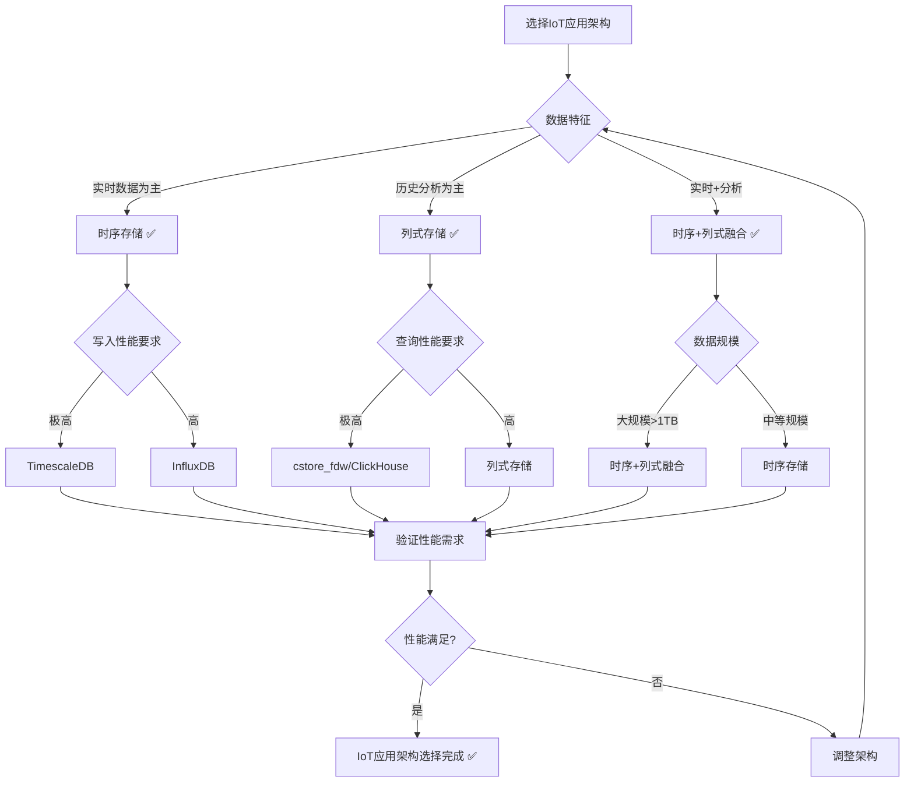
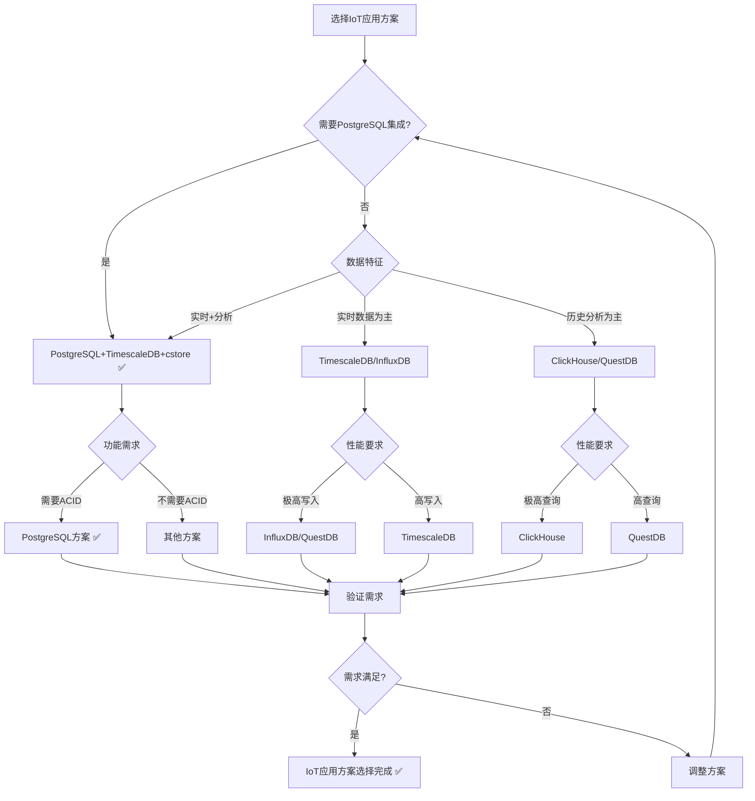

# PostgreSQL扩展：IoT应用场景形式化理论分析

> **创建日期**：2025-01-15
> **最后更新**：2025-01-15
> **版本**：v1.0
> **状态**：进行中

---

## 📋 目录

- [PostgreSQL扩展：IoT应用场景形式化理论分析](#postgresql扩展iot应用场景形式化理论分析)
  - [📋 目录](#-目录)
  - [1. 概述](#1-概述)
    - [1.1. IoT应用简介](#11-iot应用简介)
    - [1.2. IoT应用的重要性](#12-iot应用的重要性)
    - [1.3. PostgreSQL在IoT应用中的位置](#13-postgresql在iot应用中的位置)
  - [2. IoT应用的形式化定义](#2-iot应用的形式化定义)
    - [2.1. IoT数据模型的形式化定义](#21-iot数据模型的形式化定义)
      - [2.1.1. 传感器数据的形式化定义](#211-传感器数据的形式化定义)
      - [2.1.2. 设备数据的形式化定义](#212-设备数据的形式化定义)
      - [2.1.3. IoT数据流的形式化定义](#213-iot数据流的形式化定义)
    - [2.2. 时序+列式融合的形式化定义](#22-时序列式融合的形式化定义)
      - [2.2.1. 时序存储的形式化定义](#221-时序存储的形式化定义)
      - [2.2.2. 列式存储的形式化定义](#222-列式存储的形式化定义)
      - [2.2.3. 融合策略的形式化定义](#223-融合策略的形式化定义)
    - [2.3. IoT查询的形式化定义](#23-iot查询的形式化定义)
      - [2.3.1. 实时查询的形式化定义](#231-实时查询的形式化定义)
      - [2.3.2. 聚合查询的形式化定义](#232-聚合查询的形式化定义)
      - [2.3.3. 分析查询的形式化定义](#233-分析查询的形式化定义)
  - [3. IoT应用架构的形式化理论](#3-iot应用架构的形式化理论)
    - [3.1. 时序+列式融合架构的形式化定义](#31-时序列式融合架构的形式化定义)
      - [3.1.1. 热数据存储的形式化定义](#311-热数据存储的形式化定义)
      - [3.1.2. 冷数据存储的形式化定义](#312-冷数据存储的形式化定义)
      - [3.1.3. 数据分层的形式化定义](#313-数据分层的形式化定义)
    - [3.2. IoT数据压缩的形式化定义](#32-iot数据压缩的形式化定义)
      - [3.2.1. 时序压缩的形式化定义](#321-时序压缩的形式化定义)
      - [3.2.2. 列式压缩的形式化定义](#322-列式压缩的形式化定义)
    - [3.3. IoT应用架构对比矩阵](#33-iot应用架构对比矩阵)
    - [3.4. IoT应用架构选择决策树](#34-iot应用架构选择决策树)
  - [4. PostgreSQL IoT应用方案与其他方案的对比](#4-postgresql-iot应用方案与其他方案的对比)
    - [4.1. 功能对比矩阵](#41-功能对比矩阵)
    - [4.2. 性能对比矩阵](#42-性能对比矩阵)
    - [4.3. PostgreSQL IoT应用方案选择决策树](#43-postgresql-iot应用方案选择决策树)
  - [5. 应用场景的形式化分析](#5-应用场景的形式化分析)
    - [5.1. 传感器监控的形式化定义](#51-传感器监控的形式化定义)
    - [5.2. 设备管理的形式化定义](#52-设备管理的形式化定义)
    - [5.3. 数据分析的形式化定义](#53-数据分析的形式化定义)
  - [6. 参考资料](#6-参考资料)
    - [6.1. 经典文献](#61-经典文献)
    - [6.2. 相关资源](#62-相关资源)

---

## 1. 概述

### 1.1. IoT应用简介

IoT应用是现代物联网系统的核心，提供：

- **时序数据存储**：TimescaleDB存储传感器时序数据
- **列式数据分析**：cstore_fdw支持大规模数据分析
- **实时监控**：实时查询和分析
- **数据压缩**：高效的数据压缩和归档

### 1.2. IoT应用的重要性

IoT应用在现代系统中至关重要：

1. **传感器数据**：大量传感器产生的时序数据
2. **设备监控**：实时监控设备状态和性能
3. **数据分析**：历史数据分析和预测
4. **智能决策**：基于数据的智能决策

### 1.3. PostgreSQL在IoT应用中的位置

PostgreSQL通过多模型扩展支持IoT应用：

- **时序模型**：TimescaleDB扩展支持
- **列式模型**：cstore_fdw扩展支持
- **关系模型**：PostgreSQL原生支持
- **文档模型**：JSONB支持灵活的元数据存储

---

## 2. IoT应用的形式化定义

### 2.1. IoT数据模型的形式化定义

#### 2.1.1. 传感器数据的形式化定义

**定义2.1.1（传感器数据）**：

传感器数据 SensorData 是一个四元组 (sensor_id, timestamp, value, metadata)，其中：

- **sensor_id**：传感器标识符
- **timestamp**：时间戳
- **value**：传感器值
- **metadata**：元数据（可选）

**形式化表示**：

```text
SensorData = (sensor_id, timestamp, value, metadata)
其中：
  sensor_id ∈ SensorID
  timestamp ∈ Time
  value ∈ ValueDomain
  metadata ∈ MetadataSet
```

**传感器数据流的形式化定义**：

**定义2.1.2（传感器数据流）**：

传感器数据流 SensorDataStream 是一个时间序列：

```text
SensorDataStream = {(t₁, v₁), (t₂, v₂), ..., (tₙ, vₙ)}
其中：
  tᵢ ∈ Time  （时间戳）
  vᵢ ∈ ValueDomain  （传感器值）
  t₁ < t₂ < ... < tₙ  （时间有序）
```

#### 2.1.2. 设备数据的形式化定义

**定义2.1.3（设备数据）**：

设备数据 DeviceData 是一个三元组 (device_id, state, properties)，其中：

- **device_id**：设备标识符
- **state**：设备状态
- **properties**：设备属性集合

**形式化表示**：

```text
DeviceData = (device_id, state, properties)
其中：
  device_id ∈ DeviceID
  state ∈ StateSet
  properties ⊆ PropertySet
```

#### 2.1.3. IoT数据流的形式化定义

**定义2.1.4（IoT数据流）**：

IoT数据流 IoTDataStream 是多个传感器数据流的集合：

```text
IoTDataStream = {SensorDataStream₁, SensorDataStream₂, ..., SensorDataStreamₙ}
```

### 2.2. 时序+列式融合的形式化定义

#### 2.2.1. 时序存储的形式化定义

**定义2.2.1（时序存储）**：

时序存储 TimeSeriesStorage 使用TimescaleDB存储时序数据：

```text
时序存储(SensorDataStream) =
    TimescaleDB.Hypertable(SensorDataStream)
```

**时序存储的性质**：

**性质2.2.1（时序存储的时间分区）**：

时序存储按时间自动分区。

**形式化**：

```text
时间分区 ⟺
  ∀Chunkᵢ ∈ Chunks.
    Chunkᵢ = {Point | Point.timestamp ∈ TimeRangeᵢ}
```

#### 2.2.2. 列式存储的形式化定义

**定义2.2.2（列式存储）**：

列式存储 ColumnarStorage 使用cstore_fdw存储分析数据：

```text
列式存储(AnalyticsData) =
    cstore_fdw.ForeignTable(AnalyticsData)
```

**列式存储的性质**：

**性质2.2.2（列式存储的压缩性）**：

列式存储提供高压缩比。

**形式化**：

```text
压缩性 ⟺
  压缩比(列式存储) > 压缩比(行式存储)
```

#### 2.2.3. 融合策略的形式化定义

**定义2.2.3（时序+列式融合）**：

时序+列式融合 TimeSeriesColumnarFusion 结合时序存储和列式存储：

```text
时序+列式融合(IoTData) = {
    热数据: 时序存储(最近数据),
    冷数据: 列式存储(历史数据)
}
```

**融合策略的形式化定义**：

**定义2.2.4（数据分层策略）**：

数据分层策略 DataTieringStrategy 定义数据的分层存储：

```text
数据分层策略(data, age) =
    if age < hot_threshold:
        时序存储(data)
    else:
        列式存储(data)
```

### 2.3. IoT查询的形式化定义

#### 2.3.1. 实时查询的形式化定义

**定义2.3.1（实时查询）**：

实时查询 RealTimeQuery 查询最近的数据：

```text
实时查询(sensor_id, time_window) = {
    data | data ∈ SensorDataStream,
          data.sensor_id = sensor_id,
          data.timestamp ∈ time_window
}
```

#### 2.3.2. 聚合查询的形式化定义

**定义2.3.2（聚合查询）**：

聚合查询 AggregationQuery 对时序数据进行聚合：

```text
聚合查询(sensor_id, time_range, aggregation_function) =
    aggregation_function({
        data | data ∈ SensorDataStream,
              data.sensor_id = sensor_id,
              data.timestamp ∈ time_range
    })
```

#### 2.3.3. 分析查询的形式化定义

**定义2.3.3（分析查询）**：

分析查询 AnalyticsQuery 对历史数据进行分析：

```text
分析查询(analysis_function, time_range) =
    analysis_function(列式存储(历史数据), time_range)
```

---

## 3. IoT应用架构的形式化理论

### 3.1. 时序+列式融合架构的形式化定义

#### 3.1.1. 热数据存储的形式化定义

**定义3.1.1（热数据存储）**：

热数据存储 HotDataStorage 存储最近的数据：

```text
热数据存储 = {
    data | data ∈ IoTData,
          age(data) < hot_threshold
}
```

**热数据存储的性质**：

**性质3.1.1（热数据存储的实时性）**：

热数据存储提供实时查询能力。

**形式化**：

```text
实时性 ⟺
  查询延迟(热数据存储) < 实时阈值
```

#### 3.1.2. 冷数据存储的形式化定义

**定义3.1.2（冷数据存储）**：

冷数据存储 ColdDataStorage 存储历史数据：

```text
冷数据存储 = {
    data | data ∈ IoTData,
          age(data) ≥ hot_threshold
}
```

**冷数据存储的性质**：

**性质3.1.2（冷数据存储的压缩性）**：

冷数据存储提供高压缩比。

**形式化**：

```text
压缩性 ⟺
  压缩比(冷数据存储) > 压缩比(热数据存储)
```

#### 3.1.3. 数据分层的形式化定义

**定义3.1.3（数据分层）**：

数据分层 DataTiering 将数据分为多个层次：

```text
数据分层 = {
    热数据层: 时序存储,
    温数据层: 列式存储(压缩),
    冷数据层: 列式存储(归档)
}
```

### 3.2. IoT数据压缩的形式化定义

#### 3.2.1. 时序压缩的形式化定义

**定义3.2.1（时序压缩）**：

时序压缩 TimeSeriesCompression 压缩时序数据：

```text
时序压缩(SensorDataStream) =
    Compress(SensorDataStream, CompressionAlgorithm)
```

**压缩算法的形式化定义**：

**定义3.2.2（时序压缩算法）**：

时序压缩算法包括：

1. **Delta压缩**：存储差值而非绝对值
2. **RLE压缩**：游程编码
3. **字典压缩**：字典编码

#### 3.2.2. 列式压缩的形式化定义

**定义3.2.3（列式压缩）**：

列式压缩 ColumnarCompression 压缩列式数据：

```text
列式压缩(ColumnData) =
    Compress(ColumnData, ColumnarCompressionAlgorithm)
```

### 3.3. IoT应用架构对比矩阵

| 架构模式 | 写入性能 | 查询性能 | 压缩率 | 复杂度 | 适用场景 |
|---------|---------|---------|--------|--------|---------|
| **时序存储** | ⭐⭐⭐⭐⭐ | ⭐⭐⭐⭐ | ⭐⭐⭐⭐ | ⭐⭐⭐ | 实时数据 |
| **列式存储** | ⭐⭐⭐ | ⭐⭐⭐⭐⭐ | ⭐⭐⭐⭐⭐ | ⭐⭐⭐⭐ | 历史分析 |
| **时序+列式融合** | ⭐⭐⭐⭐ | ⭐⭐⭐⭐⭐ | ⭐⭐⭐⭐⭐ | ⭐⭐ | 完整IoT系统 |

### 3.4. IoT应用架构选择决策树



---

## 4. PostgreSQL IoT应用方案与其他方案的对比

### 4.1. 功能对比矩阵

| 功能 | PostgreSQL+TimescaleDB+cstore | InfluxDB | TimescaleDB | ClickHouse | QuestDB |
|------|------------------------------|----------|-------------|------------|---------|
| **时序存储** | ✅ | ✅ | ✅ | ✅ | ✅ |
| **列式存储** | ✅ | ❌ | ❌ | ✅ | ✅ |
| **SQL支持** | ✅ | ⚠️ | ✅ | ✅ | ✅ |
| **PostgreSQL集成** | ✅ | ❌ | ✅ | ❌ | ❌ |
| **ACID事务** | ✅ | ❌ | ✅ | ❌ | ✅ |
| **数据压缩** | ✅ | ✅ | ✅ | ✅ | ✅ |

### 4.2. 性能对比矩阵

| 性能指标 | PostgreSQL+TimescaleDB+cstore | InfluxDB | TimescaleDB | ClickHouse | QuestDB |
|---------|------------------------------|----------|-------------|------------|---------|
| **写入性能** | ⭐⭐⭐⭐ | ⭐⭐⭐⭐⭐ | ⭐⭐⭐⭐ | ⭐⭐⭐⭐⭐ | ⭐⭐⭐⭐⭐ |
| **查询性能** | ⭐⭐⭐⭐⭐ | ⭐⭐⭐⭐ | ⭐⭐⭐⭐⭐ | ⭐⭐⭐⭐⭐ | ⭐⭐⭐⭐⭐ |
| **压缩率** | ⭐⭐⭐⭐⭐ | ⭐⭐⭐⭐⭐ | ⭐⭐⭐⭐ | ⭐⭐⭐⭐⭐ | ⭐⭐⭐⭐⭐ |
| **PostgreSQL集成** | ⭐⭐⭐⭐⭐ | ⭐ | ⭐⭐⭐⭐⭐ | ⭐ | ⭐ |

### 4.3. PostgreSQL IoT应用方案选择决策树



---

## 5. 应用场景的形式化分析

### 5.1. 传感器监控的形式化定义

**定义5.1.1（传感器监控系统）**：

传感器监控系统 SensorMonitoringSystem 是一个三元组 (Sensors, Storage, Monitor)，其中：

- **Sensors**：传感器集合
- **Storage**：时序存储系统
- **Monitor**：监控函数

**形式化表示**：

```text
SensorMonitoringSystem = (Sensors, Storage, Monitor)
其中：
  Sensors = {Sensor₁, Sensor₂, ..., Sensorₙ}
  Storage: SensorDataStream → TimeSeriesStorage
  Monitor: SensorDataStream → Alerts
```

### 5.2. 设备管理的形式化定义

**定义5.2.1（设备管理系统）**：

设备管理系统 DeviceManagementSystem 管理设备状态：

```text
设备管理(device_id) = {
    状态查询(device_id),
    状态更新(device_id, new_state),
    历史查询(device_id, time_range)
}
```

### 5.3. 数据分析的形式化定义

**定义5.3.1（数据分析系统）**：

数据分析系统 DataAnalyticsSystem 分析IoT数据：

```text
数据分析(analysis_function, time_range) =
    analysis_function(列式存储(历史数据), time_range)
```

---

## 6. 参考资料

### 6.1. 经典文献

- TimescaleDB官方文档：<https://docs.timescale.com/>
- "Time Series Databases" (Jensen et al., 2017)
- "Column-Stores vs. Row-Stores" (Abadi et al., 2008)

### 6.2. 相关资源

- [TimescaleDB IoT应用](https://www.timescale.com/use-cases/iot/)
- [IoT数据架构](https://www.timescale.com/blog/iot-data-architecture/)
- [时序+列式融合](https://www.timescale.com/blog/timescaledb-columnar-storage/)

---

**最后更新**：2025-01-15
**维护者**：Data-Science Team
**状态**：进行中
