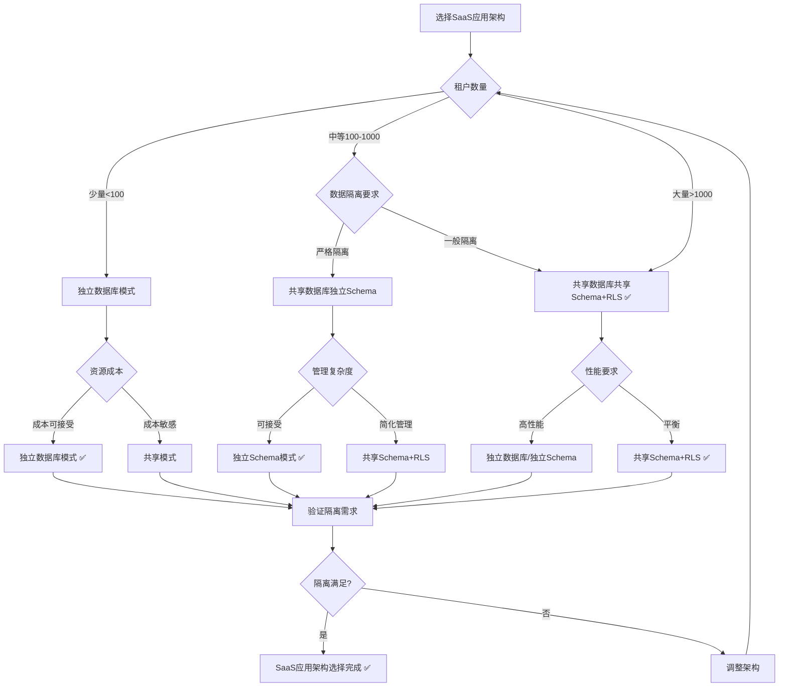
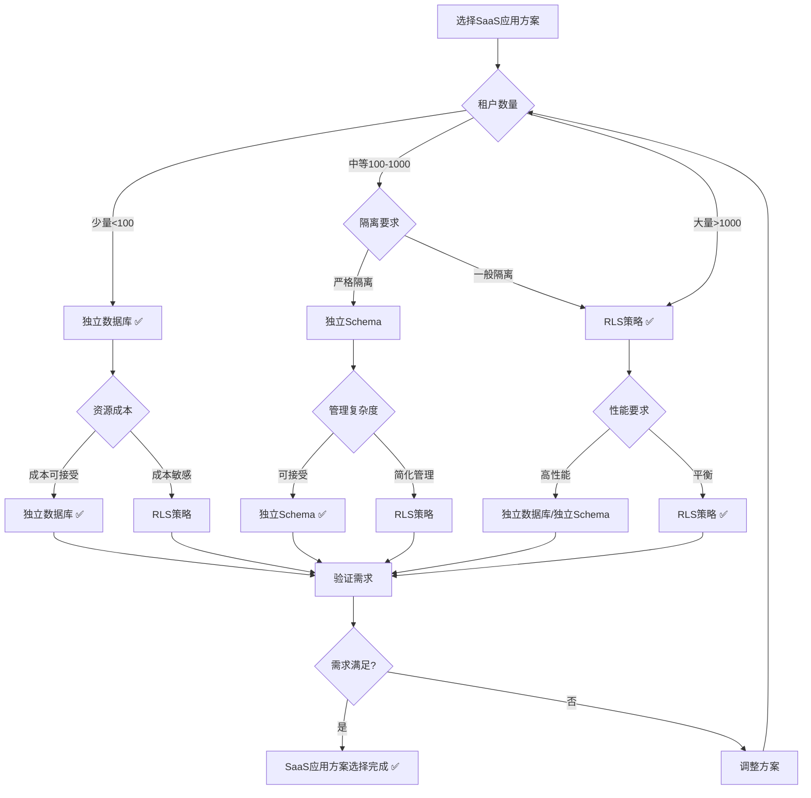

# PostgreSQL扩展：SaaS应用场景形式化理论分析

> **创建日期**：2025-01-15
> **最后更新**：2025-01-15
> **版本**：v1.0
> **状态**：进行中

---

## 📋 目录

- [PostgreSQL扩展：SaaS应用场景形式化理论分析](#postgresql扩展saas应用场景形式化理论分析)
  - [📋 目录](#-目录)
  - [1. 概述](#1-概述)
    - [1.1. SaaS应用简介](#11-saas应用简介)
    - [1.2. SaaS应用的重要性](#12-saas应用的重要性)
    - [1.3. PostgreSQL在SaaS应用中的位置](#13-postgresql在saas应用中的位置)
  - [2. SaaS应用的形式化定义](#2-saas应用的形式化定义)
    - [2.1. 多租户模型的形式化定义](#21-多租户模型的形式化定义)
      - [2.1.1. SaaS系统的形式化定义](#211-saas系统的形式化定义)
      - [2.1.2. 租户的形式化定义](#212-租户的形式化定义)
      - [2.1.3. 租户隔离的形式化定义](#213-租户隔离的形式化定义)
    - [2.2. 多租户数据库的形式化定义](#22-多租户数据库的形式化定义)
      - [2.2.1. RLS策略的形式化定义](#221-rls策略的形式化定义)
      - [2.2.2. 租户数据的形式化定义](#222-租户数据的形式化定义)
      - [2.2.3. 租户查询的形式化定义](#223-租户查询的形式化定义)
    - [2.3. SaaS应用性质的形式化证明](#23-saas应用性质的形式化证明)
      - [2.3.1. 租户隔离的形式化证明](#231-租户隔离的形式化证明)
      - [2.3.2. 数据安全的形式化证明](#232-数据安全的形式化证明)
      - [2.3.3. 性能隔离的形式化证明](#233-性能隔离的形式化证明)
  - [3. SaaS应用架构的形式化理论](#3-saas应用架构的形式化理论)
    - [3.1. 多租户架构的形式化定义](#31-多租户架构的形式化定义)
      - [3.1.1. 共享数据库共享Schema模式](#311-共享数据库共享schema模式)
      - [3.1.2. 共享数据库独立Schema模式](#312-共享数据库独立schema模式)
      - [3.1.3. 独立数据库模式](#313-独立数据库模式)
    - [3.2. SaaS应用架构对比矩阵](#32-saas应用架构对比矩阵)
    - [3.3. SaaS应用架构选择决策树](#33-saas应用架构选择决策树)
  - [4. PostgreSQL SaaS应用方案与其他方案的对比](#4-postgresql-saas应用方案与其他方案的对比)
    - [4.1. 功能对比矩阵](#41-功能对比矩阵)
    - [4.2. 性能对比矩阵](#42-性能对比矩阵)
    - [4.3. PostgreSQL SaaS应用方案选择决策树](#43-postgresql-saas应用方案选择决策树)
  - [5. 应用场景的形式化分析](#5-应用场景的形式化分析)
    - [5.1. 多租户SaaS的形式化定义](#51-多租户saas的形式化定义)
    - [5.2. 租户数据迁移的形式化定义](#52-租户数据迁移的形式化定义)
    - [5.3. 租户扩展的形式化定义](#53-租户扩展的形式化定义)
  - [6. 参考资料](#6-参考资料)

---

## 1. 概述

### 1.1. SaaS应用简介

SaaS（Software as a Service）应用是现代软件交付模式，提供：

- **多租户架构**：多个租户共享同一应用实例
- **数据隔离**：保证租户数据安全隔离
- **资源隔离**：保证租户资源隔离
- **可扩展性**：支持大量租户

### 1.2. SaaS应用的重要性

SaaS应用在现代软件中至关重要：

1. **成本效益**：共享资源降低成本
2. **快速部署**：快速为租户提供服务
3. **统一管理**：统一管理和维护
4. **可扩展性**：支持大规模租户

### 1.3. PostgreSQL在SaaS应用中的位置

PostgreSQL通过RLS支持SaaS应用：

- **行级安全**：RLS提供行级访问控制
- **租户隔离**：自动隔离租户数据
- **ACID事务**：保证数据一致性
- **SQL支持**：标准SQL查询

---

## 2. SaaS应用的形式化定义

### 2.1. 多租户模型的形式化定义

#### 2.1.1. SaaS系统的形式化定义

**定义2.1.1（SaaS系统）**：

SaaS系统 SAASSystem 是一个四元组 (Tenants, Application, Database, Isolation)，其中：

- **Tenants**：租户集合，Tenants = {t₁, t₂, ..., tₙ}
- **Application**：应用实例
- **Database**：数据库实例
- **Isolation**：隔离机制

**形式化表示**：

```text
SAASSystem = (Tenants, Application, Database, Isolation)
其中：
  Tenants = {t₁, t₂, ..., tₙ}
  Application: 共享应用实例
  Database: 共享数据库实例
  Isolation: 租户隔离机制
```

**SaaS系统的性质**：

**性质2.1.1（SaaS系统的多租户性）**：

SaaS系统支持多个租户共享同一应用实例。

**形式化**：

```text
多租户性 ⟺
  |Tenants| > 1 ∧
  所有租户共享Application ∧
  所有租户共享Database
```

#### 2.1.2. 租户的形式化定义

**定义2.1.2（租户）**：

租户 Tenant 是一个三元组 (tenant_id, data, permissions)，其中：

- **tenant_id**：租户标识符
- **data**：租户数据集合
- **permissions**：租户权限集合

**形式化表示**：

```text
Tenant = (tenant_id, data, permissions)
其中：
  tenant_id ∈ TenantID
  data ⊆ Database
  permissions ⊆ PermissionSet
```

#### 2.1.3. 租户隔离的形式化定义

**定义2.1.3（租户隔离）**：

租户隔离 TenantIsolation 要求不同租户的数据相互不可访问：

```text
租户隔离 ⟺
  ∀Tenant₁, Tenant₂, tenant₁ ≠ tenant₂.
    Tenant₁.data ∩ Tenant₂.data = ∅
```

### 2.2. 多租户数据库的形式化定义

#### 2.2.1. RLS策略的形式化定义

**定义2.2.1（RLS策略）**：

RLS策略 RLSPolicy 是一个三元组 (policy_name, policy_type, policy_expression)，其中：

- **policy_name**：策略名称
- **policy_type**：策略类型（SELECT、INSERT、UPDATE、DELETE、ALL）
- **policy_expression**：策略表达式，返回布尔值

**形式化表示**：

```text
RLSPolicy = (policy_name, policy_type, policy_expression)
其中：
  policy_name: String
  policy_type ∈ {SELECT, INSERT, UPDATE, DELETE, ALL}
  policy_expression: Row → Bool
```

**RLS策略的语义**：

**定义2.2.2（RLS策略语义）**：

RLS策略的语义是过滤行：

```text
[[RLSPolicy]]_Table = {
    row | row ∈ Table,
    RLSPolicy.policy_expression(row) = True
}
```

#### 2.2.2. 租户数据的形式化定义

**定义2.2.3（租户数据）**：

租户数据 TenantData 是包含租户ID的数据：

```text
TenantData = {
    row | row ∈ Table,
    row.tenant_id = current_tenant_id()
}
```

#### 2.2.3. 租户查询的形式化定义

**定义2.2.4（租户查询）**：

租户查询 TenantQuery 自动应用RLS策略：

```text
租户查询(query) = {
    row | row ∈ [[query]]_Table,
    RLSPolicy.policy_expression(row) = True
}
```

### 2.3. SaaS应用性质的形式化证明

#### 2.3.1. 租户隔离的形式化证明

**定理2.3.1（RLS租户隔离性）**：

RLS保证租户数据的完全隔离。

**证明**：

**步骤1**：定义隔离性

隔离性要求租户只能访问自己的数据。

**步骤2**：验证RLS策略

RLS策略通过策略表达式过滤行，确保租户只能访问满足条件的行。

**步骤3**：结论

因此RLS保证租户数据的完全隔离 ✅

#### 2.3.2. 数据安全的形式化证明

**定理2.3.2（RLS数据安全性）**：

RLS策略在数据库层面强制执行，无法绕过。

**证明**：

**步骤1**：定义安全性

安全性要求策略在数据库层面强制执行。

**步骤2**：验证RLS实现

RLS在查询执行时自动应用策略，无法绕过。

**步骤3**：结论

因此RLS策略在数据库层面强制执行 ✅

#### 2.3.3. 性能隔离的形式化证明

**性质2.3.1（性能隔离）**：

SaaS系统应该保证租户之间的性能隔离。

**形式化**：

```text
性能隔离 ⟺
  ∀Tenant₁, Tenant₂, tenant₁ ≠ tenant₂.
    性能(Tenant₁) 不受 Tenant₂ 影响
```

---

## 3. SaaS应用架构的形式化理论

### 3.1. 多租户架构的形式化定义

#### 3.1.1. 共享数据库共享Schema模式

**定义3.1.1（共享数据库共享Schema模式）**：

共享数据库共享Schema模式 SharedDatabaseSharedSchema 中，所有租户共享同一个数据库和Schema：

```text
共享模式 = (DB, Schema, RLS_Policies)
其中：
  DB: 单个数据库
  Schema: 单个Schema
  RLS_Policies: {Policy | Policy隔离租户数据}
```

**模式的性质**：

**性质3.1.1（共享模式的经济性）**：

共享模式资源利用率高，成本低。

**形式化**：

```text
经济性 ⟺
  资源利用率 = 高
  成本 = 低
```

#### 3.1.2. 共享数据库独立Schema模式

**定义3.1.2（共享数据库独立Schema模式）**：

共享数据库独立Schema模式 SharedDatabaseIndependentSchema 中，所有租户共享数据库但使用独立Schema：

```text
独立Schema模式 = (DB, Schemas, Schema_Isolation)
其中：
  DB: 单个数据库
  Schemas = {Schema₁, Schema₂, ..., Schemaₙ}
  Schema_Isolation: Schema → Tenant
```

#### 3.1.3. 独立数据库模式

**定义3.1.3（独立数据库模式）**：

独立数据库模式 IndependentDatabase 中，每个租户使用独立数据库：

```text
独立数据库模式 = (Databases, DB_Isolation)
其中：
  Databases = {DB₁, DB₂, ..., DBₙ}
  DB_Isolation: Database → Tenant
```

### 3.2. SaaS应用架构对比矩阵

| 架构模式 | 隔离性 | 资源利用率 | 管理复杂度 | 成本 | 性能 | 适用场景 |
|---------|--------|-----------|-----------|------|------|---------|
| **共享数据库共享Schema+RLS** | ⭐⭐⭐⭐ | ⭐⭐⭐⭐⭐ | ⭐⭐⭐⭐⭐ | ⭐⭐⭐⭐⭐ | ⭐⭐⭐⭐ | 大量租户 |
| **共享数据库独立Schema** | ⭐⭐⭐⭐⭐ | ⭐⭐⭐⭐ | ⭐⭐⭐ | ⭐⭐⭐⭐ | ⭐⭐⭐⭐ | 中等租户 |
| **独立数据库** | ⭐⭐⭐⭐⭐ | ⭐⭐ | ⭐⭐ | ⭐⭐ | ⭐⭐⭐⭐⭐ | 少量租户 |

### 3.3. SaaS应用架构选择决策树



---

## 4. PostgreSQL SaaS应用方案与其他方案的对比

### 4.1. 功能对比矩阵

| 功能 | PostgreSQL+RLS | 应用层隔离 | 独立Schema | 独立数据库 |
|------|---------------|-----------|-----------|-----------|
| **数据库层隔离** | ✅ | ❌ | ✅ | ✅ |
| **策略灵活性** | ⭐⭐⭐⭐⭐ | ⭐⭐⭐ | ⭐⭐⭐⭐ | ⭐⭐⭐⭐⭐ |
| **性能开销** | ⭐⭐⭐⭐ | ⭐⭐⭐⭐⭐ | ⭐⭐⭐⭐ | ⭐⭐⭐⭐⭐ |
| **管理复杂度** | ⭐⭐⭐⭐ | ⭐⭐⭐⭐⭐ | ⭐⭐⭐ | ⭐⭐ |
| **成本** | ⭐⭐⭐⭐⭐ | ⭐⭐⭐⭐⭐ | ⭐⭐⭐⭐ | ⭐⭐ |

### 4.2. 性能对比矩阵

| 性能指标 | PostgreSQL+RLS | 应用层隔离 | 独立Schema | 独立数据库 |
|---------|---------------|-----------|-----------|-----------|
| **查询性能** | ⭐⭐⭐⭐ | ⭐⭐⭐⭐⭐ | ⭐⭐⭐⭐ | ⭐⭐⭐⭐⭐ |
| **隔离性能** | ⭐⭐⭐⭐⭐ | ⭐⭐ | ⭐⭐⭐⭐⭐ | ⭐⭐⭐⭐⭐ |
| **扩展性** | ⭐⭐⭐⭐⭐ | ⭐⭐⭐⭐⭐ | ⭐⭐⭐⭐ | ⭐⭐⭐ |

### 4.3. PostgreSQL SaaS应用方案选择决策树



---

## 5. 应用场景的形式化分析

### 5.1. 多租户SaaS的形式化定义

**定义5.1.1（多租户SaaS系统）**：

多租户SaaS系统 MultiTenantSAAS 是一个四元组 (Tenants, Application, Database, Isolation)，其中：

- **Tenants**：租户集合
- **Application**：共享应用实例
- **Database**：共享数据库实例
- **Isolation**：租户隔离机制（RLS）

**形式化表示**：

```text
MultiTenantSAAS = (Tenants, Application, Database, Isolation)
其中：
  Tenants = {t₁, t₂, ..., tₙ}
  Application: 共享应用实例
  Database: PostgreSQL + RLS
  Isolation: RLSPolicy
```

### 5.2. 租户数据迁移的形式化定义

**定义5.2.1（租户数据迁移）**：

租户数据迁移 TenantDataMigration 是将租户数据从一个位置迁移到另一个位置：

```text
租户数据迁移(Tenant, Source, Target) =
    复制(Tenant.data, Source) → Target
```

**迁移的正确性形式化定义**：

**定义5.2.2（迁移的正确性）**：

迁移的正确性要求迁移后数据完整且一致：

```text
迁移正确性 ⟺
  数据完整性(迁移后) ∧
  数据一致性(迁移后)
```

### 5.3. 租户扩展的形式化定义

**定义5.3.1（租户扩展）**：

租户扩展 TenantScaling 是支持租户数量的增长：

```text
租户扩展(SaaS系统, 新租户) =
    SaaS系统 ∪ {新租户}
```

**扩展的性质**：

**性质5.3.1（扩展的透明性）**：

租户扩展对现有租户透明。

**形式化**：

```text
透明性 ⟺
  ∀现有租户t.
    性能(t) 不受 新租户 影响
```

---

## 6. 参考资料

### 6.1. 经典文献

- PostgreSQL RLS官方文档：<https://www.postgresql.org/docs/current/ddl-rowsecurity.html>
- "Multi-Tenant Data Architecture" (Chong et al., 2006)
- "Row-Level Security in PostgreSQL" (PostgreSQL官方文档)

### 6.2. 相关资源

- [PostgreSQL RLS文档](https://www.postgresql.org/docs/current/ddl-rowsecurity.html)
- [多租户架构设计](https://www.postgresql.org/docs/current/ddl-rowsecurity.html)
- [SaaS数据库设计](https://www.citusdata.com/blog/2016/10/25/designing-your-saas-database-for-multi-tenancy/)

---

**最后更新**：2025-01-15
**维护者**：Data-Science Team
**状态**：进行中
