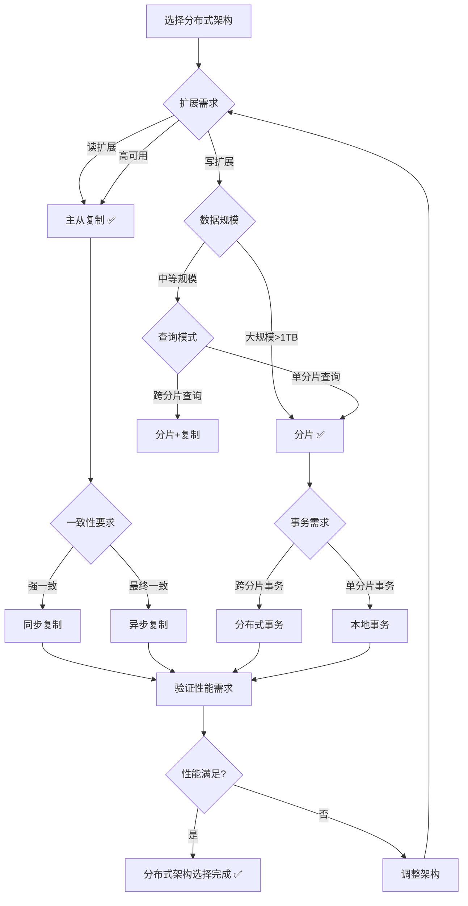
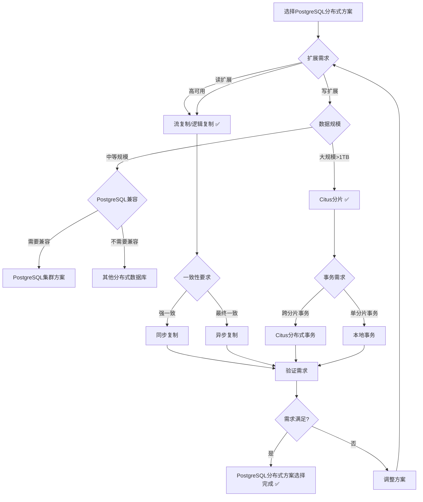

# PostgreSQL扩展：分布式数据库（集群）形式化理论分析

> **创建日期**：2025-01-15
> **最后更新**：2025-01-15
> **版本**：v1.0
> **状态**：进行中

---

## 📋 目录

- [PostgreSQL扩展：分布式数据库（集群）形式化理论分析](#postgresql扩展分布式数据库集群形式化理论分析)
  - [📋 目录](#-目录)
  - [1. 概述](#1-概述)
    - [1.1. PostgreSQL分布式架构简介](#11-postgresql分布式架构简介)
    - [1.2. 分布式数据库的重要性](#12-分布式数据库的重要性)
    - [1.3. PostgreSQL分布式方案在数据库中的位置](#13-postgresql分布式方案在数据库中的位置)
  - [2. 分布式数据库的形式化定义](#2-分布式数据库的形式化定义)
    - [2.1. 分布式数据模型的形式化定义](#21-分布式数据模型的形式化定义)
      - [2.1.1. 分布式系统的形式化定义](#211-分布式系统的形式化定义)
      - [2.1.2. 数据分片的形式化定义](#212-数据分片的形式化定义)
      - [2.1.3. 数据复制的形式化定义](#213-数据复制的形式化定义)
    - [2.2. PostgreSQL分布式架构的形式化规范](#22-postgresql分布式架构的形式化规范)
      - [2.2.1. 主从复制的形式化定义](#221-主从复制的形式化定义)
      - [2.2.2. 分片的形式化定义](#222-分片的形式化定义)
      - [2.2.3. 分布式事务的形式化定义](#223-分布式事务的形式化定义)
    - [2.3. 分布式系统性质的形式化证明](#23-分布式系统性质的形式化证明)
      - [2.3.1. 一致性的形式化证明](#231-一致性的形式化证明)
      - [2.3.2. 可用性的形式化证明](#232-可用性的形式化证明)
      - [2.3.3. 分区容错性的形式化证明](#233-分区容错性的形式化证明)
  - [3. 分布式架构的形式化理论](#3-分布式架构的形式化理论)
    - [3.1. 主从复制架构的形式化定义](#31-主从复制架构的形式化定义)
      - [3.1.1. 流复制的形式化定义](#311-流复制的形式化定义)
      - [3.1.2. 逻辑复制的形式化定义](#312-逻辑复制的形式化定义)
    - [3.2. 分片架构的形式化定义](#32-分片架构的形式化定义)
      - [3.2.1. 水平分片的形式化定义](#321-水平分片的形式化定义)
      - [3.2.2. 垂直分片的形式化定义](#322-垂直分片的形式化定义)
    - [3.3. 分布式架构选择决策树](#33-分布式架构选择决策树)
    - [3.4. 分布式架构对比矩阵](#34-分布式架构对比矩阵)
  - [4. PostgreSQL分布式方案与其他分布式数据库的对比](#4-postgresql分布式方案与其他分布式数据库的对比)
    - [4.1. 功能对比矩阵](#41-功能对比矩阵)
    - [4.2. 性能对比矩阵](#42-性能对比矩阵)
    - [4.3. PostgreSQL分布式方案选择决策树](#43-postgresql分布式方案选择决策树)
  - [5. 应用场景的形式化分析](#5-应用场景的形式化分析)
    - [5.1. 微服务应用的形式化定义](#51-微服务应用的形式化定义)
    - [5.2. 高可用系统的形式化定义](#52-高可用系统的形式化定义)
    - [5.3. 大规模系统的形式化定义](#53-大规模系统的形式化定义)
  - [6. 参考资料](#6-参考资料)
    - [6.1. 经典文献](#61-经典文献)
    - [6.2. 相关资源](#62-相关资源)

---

## 1. 概述

### 1.1. PostgreSQL分布式架构简介

PostgreSQL分布式架构包括：

- **主从复制**：流复制、逻辑复制
- **分片**：水平分片、垂直分片
- **分布式事务**：两阶段提交、Saga模式
- **高可用**：自动故障转移、负载均衡

### 1.2. 分布式数据库的重要性

分布式数据库在现代应用中至关重要：

1. **可扩展性**：支持大规模数据存储和处理
2. **高可用性**：提供高可用性和容错能力
3. **性能优化**：通过分片和复制提升性能
4. **地理分布**：支持地理分布式部署

### 1.3. PostgreSQL分布式方案在数据库中的位置

PostgreSQL分布式方案扩展了PostgreSQL的分布式能力：

- **单机PostgreSQL**：PostgreSQL原生支持
- **主从复制**：流复制、逻辑复制
- **分片**：Citus、pg_shard等扩展
- **分布式事务**：两阶段提交、Saga模式

---

## 2. 分布式数据库的形式化定义

### 2.1. 分布式数据模型的形式化定义

#### 2.1.1. 分布式系统的形式化定义

**定义2.1.1（分布式系统）**：

分布式系统 DistributedSystem 是一个三元组 (Nodes, Network, Protocol)，其中：

- **Nodes**：节点集合，Nodes = {Node₁, Node₂, ..., Nodeₙ}
- **Network**：网络连接
- **Protocol**：通信协议

**形式化表示**：

```text
DistributedSystem = (Nodes, Network, Protocol)
其中：
  Nodes = {Node₁, Node₂, ..., Nodeₙ}
  Network: Node × Node → Connection
  Protocol: Message → Response
```

**分布式系统的性质**：

**性质2.1.1（分布式系统的异步性）**：

分布式系统中的消息传递是异步的。

**形式化**：

```text
异步性 ⟺
  ∀消息m.
    发送时间(m) ≠ 接收时间(m)
```

**性质2.1.2（分布式系统的部分故障）**：

分布式系统中节点可能部分故障。

**形式化**：

```text
部分故障 ⟺
  ∃Nodeᵢ ∈ Nodes.
    Nodeᵢ状态 = 故障
```

#### 2.1.2. 数据分片的形式化定义

**定义2.1.2（数据分片）**：

数据分片 Sharding 是将数据分割到多个节点：

```text
分片(Data, ShardingFunction) = {
    Shard₁, Shard₂, ..., Shardₙ
}
其中：
  Shardᵢ = {row | row ∈ Data, ShardingFunction(row) = Nodeᵢ}
```

**分片的性质**：

**性质2.1.3（分片的完整性）**：

分片覆盖所有数据。

**形式化**：

```text
完整性 ⟺
  ∪_{Shardᵢ ∈ Shards} Shardᵢ = Data
```

**性质2.1.4（分片的不重叠性）**：

不同分片的数据不重叠。

**形式化**：

```text
不重叠 ⟺
  ∀Shardᵢ, Shardⱼ ∈ Shards, i ≠ j.
    Shardᵢ ∩ Shardⱼ = ∅
```

#### 2.1.3. 数据复制的形式化定义

**定义2.1.3（数据复制）**：

数据复制 Replication 是将数据复制到多个节点：

```text
复制(Data, ReplicationFactor) = {
    Replica₁, Replica₂, ..., Replicaₖ
}
其中：
  Replicaᵢ = Data  （数据副本）
  k = ReplicationFactor
```

**复制的性质**：

**性质2.1.5（复制的一致性）**：

所有副本的数据应该一致。

**形式化**：

```text
一致性 ⟺
  ∀Replicaᵢ, Replicaⱼ ∈ Replicas.
    Replicaᵢ = Replicaⱼ
```

### 2.2. PostgreSQL分布式架构的形式化规范

#### 2.2.1. 主从复制的形式化定义

**定义2.2.1（主从复制）**：

主从复制 MasterSlaveReplication 是一个三元组 (Master, Slaves, ReplicationProtocol)，其中：

- **Master**：主节点
- **Slaves**：从节点集合
- **ReplicationProtocol**：复制协议

**形式化表示**：

```text
MasterSlaveReplication = (Master, Slaves, ReplicationProtocol)
其中：
  Master: Node
  Slaves = {Slave₁, Slave₂, ..., Slaveₙ}
  ReplicationProtocol: Write → ReplicationLog
```

**主从复制的性质**：

**性质2.2.1（主从复制的单向性）**：

主从复制是单向的，从主节点到从节点。

**形式化**：

```text
单向性 ⟺
  ∀写操作w.
    w(Master) → 复制到所有Slaves
```

#### 2.2.2. 分片的形式化定义

**定义2.2.2（分片）**：

分片 Sharding 是将表数据分割到多个节点：

```text
分片(Table, ShardingKey) = {
    Shard₁, Shard₂, ..., Shardₙ
}
其中：
  Shardᵢ = {row | row ∈ Table, hash(ShardingKey(row)) mod n = i}
```

**分片的性质**：

**性质2.2.2（分片的均匀性）**：

分片应该均匀分布数据。

**形式化**：

```text
均匀性 ⟺
  ∀Shardᵢ, Shardⱼ ∈ Shards.
    |Shardᵢ| ≈ |Shardⱼ|
```

#### 2.2.3. 分布式事务的形式化定义

**定义2.2.3（分布式事务）**：

分布式事务 DistributedTransaction 是在多个节点上执行的事务：

```text
分布式事务 = {
    操作₁(Node₁),
    操作₂(Node₂),
    ...,
    操作ₙ(Nodeₙ)
}
```

**分布式事务的性质**：

**性质2.2.3（分布式事务的原子性）**：

分布式事务要么全部提交，要么全部回滚。

**形式化**：

```text
原子性 ⟺
  (所有操作成功 → 全部提交) ∧
  (任一操作失败 → 全部回滚)
```

### 2.3. 分布式系统性质的形式化证明

#### 2.3.1. 一致性的形式化证明

**定理2.3.1（CAP定理）**：

分布式系统无法同时满足一致性（Consistency）、可用性（Availability）和分区容错性（Partition tolerance）。

**证明**：

**步骤1**：定义CAP性质

- **一致性**：所有节点看到相同的数据
- **可用性**：系统持续可用
- **分区容错性**：网络分区时系统继续工作

**步骤2**：证明矛盾

当网络分区发生时：

- 如果保证一致性，必须停止服务（牺牲可用性）
- 如果保证可用性，必须允许不一致（牺牲一致性）

**步骤3**：结论

因此无法同时满足三个性质 ✅

#### 2.3.2. 可用性的形式化证明

**定理2.3.2（可用性提升）**：

通过复制可以提升系统可用性。

**证明**：

**步骤1**：定义可用性

可用性 = 系统正常运行时间 / 总时间

**步骤2**：分析复制

复制增加了冗余，即使部分节点故障，系统仍可用。

**步骤3**：结论

因此通过复制可以提升系统可用性 ✅

#### 2.3.3. 分区容错性的形式化证明

**定理2.3.3（分区容错性）**：

分布式系统必须容忍网络分区。

**证明**：

**步骤1**：定义分区容错性

分区容错性要求网络分区时系统继续工作。

**步骤2**：验证必要性

分布式系统中网络分区是不可避免的。

**步骤3**：结论

因此分布式系统必须容忍网络分区 ✅

---

## 3. 分布式架构的形式化理论

### 3.1. 主从复制架构的形式化定义

#### 3.1.1. 流复制的形式化定义

**定义3.1.1（流复制）**：

流复制 StreamingReplication 是实时复制WAL日志：

```text
流复制 = {
    主节点: 生成WAL日志,
    从节点: 接收并应用WAL日志
}
```

**流复制的性质**：

**性质3.1.1（流复制的实时性）**：

流复制实时复制数据变更。

**形式化**：

```text
实时性 ⟺
  延迟(复制) < 阈值
```

#### 3.1.2. 逻辑复制的形式化定义

**定义3.1.2（逻辑复制）**：

逻辑复制 LogicalReplication 是复制逻辑变更：

```text
逻辑复制 = {
    主节点: 生成逻辑变更,
    从节点: 接收并应用逻辑变更
}
```

**逻辑复制的性质**：

**性质3.1.2（逻辑复制的选择性）**：

逻辑复制可以选择性地复制表。

**形式化**：

```text
选择性 ⟺
  复制表集合 ⊆ 所有表集合
```

### 3.2. 分片架构的形式化定义

#### 3.2.1. 水平分片的形式化定义

**定义3.2.1（水平分片）**：

水平分片 HorizontalSharding 是按行分割数据：

```text
水平分片(Table) = {
    Shard₁, Shard₂, ..., Shardₙ
}
其中：
  Shardᵢ = {row | row ∈ Table, hash(ShardingKey(row)) mod n = i}
```

#### 3.2.2. 垂直分片的形式化定义

**定义3.2.2（垂直分片）**：

垂直分片 VerticalSharding 是按列分割数据：

```text
垂直分片(Table) = {
    Shard₁, Shard₂, ..., Shardₙ
}
其中：
  Shardᵢ = {Columnᵢ₁, Columnᵢ₂, ..., Columnᵢₖ}
```

### 3.3. 分布式架构选择决策树



### 3.4. 分布式架构对比矩阵

| 架构模式 | 扩展性 | 一致性 | 可用性 | 复杂度 | 适用场景 |
|---------|--------|--------|--------|--------|---------|
| **主从复制** | ⭐⭐⭐⭐ | ⭐⭐⭐⭐⭐ | ⭐⭐⭐⭐⭐ | ⭐⭐⭐ | 读扩展、高可用 |
| **分片** | ⭐⭐⭐⭐⭐ | ⭐⭐⭐ | ⭐⭐⭐⭐ | ⭐⭐ | 写扩展、大规模数据 |
| **分片+复制** | ⭐⭐⭐⭐⭐ | ⭐⭐⭐⭐ | ⭐⭐⭐⭐⭐ | ⭐ | 大规模、高可用 |

---

## 4. PostgreSQL分布式方案与其他分布式数据库的对比

### 4.1. 功能对比矩阵

| 功能 | PostgreSQL集群 | MongoDB | Cassandra | CockroachDB | TiDB |
|------|---------------|---------|-----------|-------------|------|
| **SQL支持** | ✅ | ❌ | ❌ | ✅ | ✅ |
| **ACID事务** | ✅ | ⚠️ | ❌ | ✅ | ✅ |
| **分片** | ⚠️ | ✅ | ✅ | ✅ | ✅ |
| **复制** | ✅ | ✅ | ✅ | ✅ | ✅ |
| **PostgreSQL兼容** | ✅ | ❌ | ❌ | ⚠️ | ⚠️ |

### 4.2. 性能对比矩阵

| 性能指标 | PostgreSQL集群 | MongoDB | Cassandra | CockroachDB | TiDB |
|---------|---------------|---------|-----------|-------------|------|
| **写入性能** | ⭐⭐⭐⭐ | ⭐⭐⭐⭐⭐ | ⭐⭐⭐⭐⭐ | ⭐⭐⭐⭐ | ⭐⭐⭐⭐ |
| **查询性能** | ⭐⭐⭐⭐⭐ | ⭐⭐⭐⭐ | ⭐⭐⭐ | ⭐⭐⭐⭐ | ⭐⭐⭐⭐⭐ |
| **一致性** | ⭐⭐⭐⭐⭐ | ⭐⭐⭐ | ⭐⭐ | ⭐⭐⭐⭐⭐ | ⭐⭐⭐⭐⭐ |
| **PostgreSQL兼容** | ⭐⭐⭐⭐⭐ | ⭐ | ⭐ | ⭐⭐⭐ | ⭐⭐⭐ |

### 4.3. PostgreSQL分布式方案选择决策树



---

## 5. 应用场景的形式化分析

### 5.1. 微服务应用的形式化定义

**定义5.1.1（微服务应用）**：

微服务应用是一个分布式应用系统：

```text
微服务应用 = (Services, Databases, Communication)
其中：
  Services = {Service₁, Service₂, ..., Serviceₙ}
  Databases = {DB₁, DB₂, ..., DBₙ}
  Communication: Service × Service → Protocol
```

**微服务数据库的形式化定义**：

**定义5.1.2（微服务数据库）**：

微服务数据库是每个服务使用独立数据库：

```text
微服务数据库 ⟺
  ∀Serviceᵢ ∈ Services.
    ∃DBᵢ ∈ Databases.
      Serviceᵢ使用DBᵢ
```

### 5.2. 高可用系统的形式化定义

**定义5.2.1（高可用系统）**：

高可用系统要求系统可用性达到一定阈值：

```text
高可用 ⟺
  可用性 ≥ 阈值（如99.9%）
```

**高可用的形式化定义**：

**定义5.2.2（可用性）**：

可用性定义为系统正常运行时间比例：

```text
可用性 = 正常运行时间 / 总时间
```

### 5.3. 大规模系统的形式化定义

**定义5.3.1（大规模系统）**：

大规模系统要求支持大规模数据和负载：

```text
大规模 ⟺
  数据规模 > 阈值（如1TB） ∨
  负载规模 > 阈值（如10000 QPS）
```

---

## 6. 参考资料

### 6.1. 经典文献

- PostgreSQL复制官方文档：<https://www.postgresql.org/docs/current/high-availability.html>
- "CAP Theorem" (Brewer, 2000)
- "Distributed Systems: Principles and Paradigms" (Tanenbaum & Van Steen, 2017)

### 6.2. 相关资源

- [PostgreSQL高可用文档](https://www.postgresql.org/docs/current/high-availability.html)
- [Citus分布式PostgreSQL](https://www.citusdata.com/)
- [分布式系统原理](https://en.wikipedia.org/wiki/Distributed_computing)

---

**最后更新**：2025-01-15
**维护者**：Data-Science Team
**状态**：进行中
