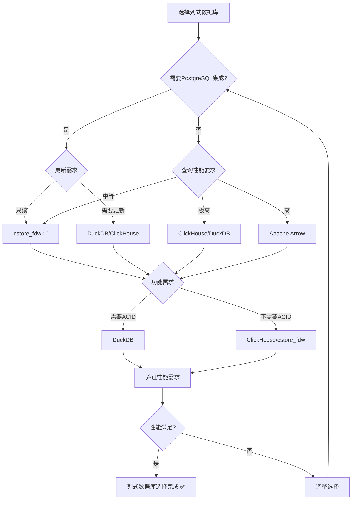

# PostgreSQL扩展：列式数据库（cstore_fdw）形式化理论分析

> **创建日期**：2025-01-15
> **最后更新**：2025-01-15
> **版本**：v1.0
> **状态**：进行中

---

## 📋 目录

- [PostgreSQL扩展：列式数据库（cstore\_fdw）形式化理论分析](#postgresql扩展列式数据库cstore_fdw形式化理论分析)
  - [📋 目录](#-目录)
  - [1. 概述](#1-概述)
    - [1.1. cstore\_fdw简介](#11-cstore_fdw简介)
    - [1.2. 列式数据库的重要性](#12-列式数据库的重要性)
    - [1.3. cstore\_fdw在PostgreSQL中的位置](#13-cstore_fdw在postgresql中的位置)
  - [2. 列式数据库的形式化定义](#2-列式数据库的形式化定义)
    - [2.1. 列式数据模型的形式化定义](#21-列式数据模型的形式化定义)
      - [2.1.1. 列式存储的形式化定义](#211-列式存储的形式化定义)
      - [2.1.2. 列式数据的形式化定义](#212-列式数据的形式化定义)
      - [2.1.3. 列式数据库的形式化定义](#213-列式数据库的形式化定义)
    - [2.2. cstore\_fdw的形式化规范](#22-cstore_fdw的形式化规范)
      - [2.2.1. cstore\_fdw存储模型的形式化定义](#221-cstore_fdw存储模型的形式化定义)
      - [2.2.2. cstore\_fdw查询模型的形式化定义](#222-cstore_fdw查询模型的形式化定义)
      - [2.2.3. cstore\_fdw压缩的形式化定义](#223-cstore_fdw压缩的形式化定义)
    - [2.3. cstore\_fdw性质的形式化证明](#23-cstore_fdw性质的形式化证明)
      - [2.3.1. 列式存储的性质](#231-列式存储的性质)
      - [2.3.2. 列式查询的性质](#232-列式查询的性质)
      - [2.3.3. 列式压缩的性质](#233-列式压缩的性质)
  - [3. 列式查询优化的形式化理论](#3-列式查询优化的形式化理论)
    - [3.1. 列式查询优化的形式化定义](#31-列式查询优化的形式化定义)
    - [3.2. 列式索引的形式化定义](#32-列式索引的形式化定义)
    - [3.3. 列式聚合的形式化定义](#33-列式聚合的形式化定义)
  - [4. cstore\_fdw与其他列式数据库的对比](#4-cstore_fdw与其他列式数据库的对比)
    - [4.1. 功能对比矩阵](#41-功能对比矩阵)
    - [4.2. 性能对比矩阵](#42-性能对比矩阵)
    - [4.3. PostgreSQL列式数据库选择决策树](#43-postgresql列式数据库选择决策树)
  - [5. 应用场景的形式化分析](#5-应用场景的形式化分析)
    - [5.1. 数据分析的形式化定义](#51-数据分析的形式化定义)
    - [5.2. OLAP应用的形式化定义](#52-olap应用的形式化定义)
    - [5.3. 数据仓库的形式化定义](#53-数据仓库的形式化定义)
  - [6. 参考资料](#6-参考资料)
    - [6.1. 经典文献](#61-经典文献)
    - [6.2. 相关资源](#62-相关资源)

---

## 1. 概述

### 1.1. cstore_fdw简介

cstore_fdw是PostgreSQL的列式存储外部数据包装器（Foreign Data Wrapper），提供：

- **列式存储**：按列存储数据，而非按行
- **列式压缩**：每列独立压缩
- **列式查询**：只读取需要的列
- **PostgreSQL集成**：通过FDW接口集成

### 1.2. 列式数据库的重要性

列式数据库在数据分析中至关重要：

1. **数据分析**：OLAP查询、聚合分析
2. **数据仓库**：大规模数据存储和分析
3. **报表生成**：快速生成报表和统计
4. **压缩效率**：高压缩比，节省存储空间

### 1.3. cstore_fdw在PostgreSQL中的位置

cstore_fdw扩展了PostgreSQL的列式能力：

- **行式存储**：PostgreSQL原生支持
- **列式存储**：cstore_fdw扩展支持
- **混合存储**：可以同时使用行式和列式存储

---

## 2. 列式数据库的形式化定义

### 2.1. 列式数据模型的形式化定义

#### 2.1.1. 列式存储的形式化定义

**定义2.1.1（列式存储）**：

列式存储 ColumnStore 是一个三元组 (Columns, Compression, Index)，其中：

- **Columns**：列集合，Columns = {C₁, C₂, ..., Cₙ}
- **Compression**：压缩函数，Compression: Column → CompressedColumn
- **Index**：索引结构，Index: Column → IndexStructure

**形式化表示**：

```text
ColumnStore = (Columns, Compression, Index)
其中：
  Columns = {C₁, C₂, ..., Cₙ}  （列集合）
  Compression: Column → CompressedColumn
  Index: Column → IndexStructure
```

**列式存储的性质**：

**性质2.1.1（列式存储的独立性）**：

列式存储中，每列独立存储，可以独立访问。

**形式化**：

```text
独立性 ⟺
  ∀Cᵢ, Cⱼ ∈ Columns, i ≠ j.
    Storage(Cᵢ) ∩ Storage(Cⱼ) = ∅
```

**性质2.1.2（列式存储的压缩性）**：

列式存储支持每列独立压缩，压缩效率高。

**形式化**：

```text
压缩性 ⟺
  ∀Cᵢ ∈ Columns.
    CompressionRatio(Cᵢ) > CompressionRatio(RowStore)
```

#### 2.1.2. 列式数据的形式化定义

**定义2.1.2（列式数据）**：

列式数据 ColumnData 是一个列值序列：

```text
ColumnData = [v₁, v₂, ..., vₙ]
其中：
  vᵢ ∈ Value  （列值）
  n = |Rows|   （行数）
```

**列式数据的性质**：

**性质2.1.3（列式数据的同质性）**：

列式数据中，同一列的所有值具有相同类型。

**形式化**：

```text
同质性 ⟺
  ∀vᵢ, vⱼ ∈ ColumnData. type(vᵢ) = type(vⱼ)
```

#### 2.1.3. 列式数据库的形式化定义

**定义2.1.3（列式数据库）**：

列式数据库 ColumnDB 是一个三元组 (Tables, Storage, Query)，其中：

- **Tables**：表集合
- **Storage**：列式存储系统
- **Query**：列式查询语言

**形式化表示**：

```text
ColumnDB = (Tables, Storage, Query)
其中：
  Tables = {T₁, T₂, ..., Tₙ}
  Storage: Table → ColumnStore
  Query: QueryExpression → ResultSet
```

### 2.2. cstore_fdw的形式化规范

#### 2.2.1. cstore_fdw存储模型的形式化定义

**定义2.2.1（cstore_fdw存储模型）**：

cstore_fdw将表存储为列式文件：

```text
cstore_fdw存储 = {
    File(Column₁),
    File(Column₂),
    ...,
    File(Columnₙ)
}
```

**存储格式**：

每列存储为独立文件，使用列式压缩格式。

#### 2.2.2. cstore_fdw查询模型的形式化定义

**定义2.2.2（cstore_fdw查询模型）**：

cstore_fdw查询只读取需要的列：

```text
列式查询(Query, Table) =
    只读取Query中引用的列
```

**查询优化的形式化定义**：

**定义2.2.3（列式查询优化）**：

列式查询优化是只读取查询需要的列：

```text
优化(Query) = {
    Column | Column ∈ Query.ProjectedColumns ∪ Query.FilteredColumns
}
```

#### 2.2.3. cstore_fdw压缩的形式化定义

**定义2.2.4（cstore_fdw压缩）**：

cstore_fdw使用列式压缩算法：

```text
压缩(Column) = Compress(Column, Algorithm)
其中：
  Algorithm ∈ {RLE, Dictionary, Delta, ...}
```

**压缩算法的形式化定义**：

**算法1：RLE（Run-Length Encoding）**：

```text
RLE压缩(Column) = {
    (value, count) | value ∈ Column, count = count(value, Column)
}
```

**算法2：字典压缩（Dictionary Compression）**：

```text
字典压缩(Column) = {
    Dictionary: Value → Code,
    CompressedColumn: [Code₁, Code₂, ..., Codeₙ]
}
```

### 2.3. cstore_fdw性质的形式化证明

#### 2.3.1. 列式存储的性质

**定理2.3.1（列式存储的查询效率）**：

列式存储对于只查询少数列的查询，效率高于行式存储。

**证明**：

**步骤1**：定义查询效率

查询效率 = 读取的数据量 / 总数据量

**步骤2**：比较列式和行式

- **行式存储**：需要读取所有列的数据
- **列式存储**：只读取查询需要的列

**步骤3**：结论

因此列式存储对于只查询少数列的查询，效率更高 ✅

#### 2.3.2. 列式查询的性质

**性质2.3.1（列式查询的选择性）**：

列式查询只读取需要的列，减少I/O。

**形式化**：

```text
选择性 ⟺
  I/O(列式查询) = Σ_{C ∈ 查询列} Size(C) < Size(Table)
```

#### 2.3.3. 列式压缩的性质

**定理2.3.2（列式压缩的效率）**：

列式压缩的压缩比通常高于行式压缩。

**证明**：

**步骤1**：定义压缩比

压缩比 = 原始大小 / 压缩后大小

**步骤2**：分析列式压缩

列式存储中，同一列的值类型相同，压缩效率高。

**步骤3**：结论

因此列式压缩的压缩比通常高于行式压缩 ✅

---

## 3. 列式查询优化的形式化理论

### 3.1. 列式查询优化的形式化定义

**定义3.1.1（列式查询优化）**：

列式查询优化是将查询转换为只读取需要的列：

```text
优化(Query) = {
    列 | 列 ∈ Query.ProjectedColumns ∪ Query.FilteredColumns
}
```

**优化策略**：

1. **列剪枝**：只读取查询需要的列
2. **谓词下推**：在列式存储层应用过滤条件
3. **列式聚合**：在列式存储层进行聚合

### 3.2. 列式索引的形式化定义

**定义3.2.1（列式索引）**：

列式索引 ColumnIndex 是一个映射函数：

```text
ColumnIndex: IndexKey → RowSet
```

**索引类型**：

1. **值索引**：按值索引行
2. **范围索引**：按范围索引行
3. **位图索引**：使用位图索引行

### 3.3. 列式聚合的形式化定义

**定义3.3.1（列式聚合）**：

列式聚合在列式存储层进行聚合操作：

```text
列式聚合(AggregationFunction, Column) =
    AggregationFunction(Column)
```

**聚合的优势**：

列式聚合只需要扫描相关列，不需要扫描整行。

---

## 4. cstore_fdw与其他列式数据库的对比

### 4.1. 功能对比矩阵

| 功能 | cstore_fdw | ClickHouse | Apache Parquet | Apache Arrow | DuckDB |
|------|-----------|------------|----------------|--------------|--------|
| **PostgreSQL集成** | ✅ | ❌ | ❌ | ❌ | ⚠️ |
| **SQL支持** | ✅ | ✅ | ❌ | ❌ | ✅ |
| **列式压缩** | ✅ | ✅ | ✅ | ✅ | ✅ |
| **列式查询** | ✅ | ✅ | ✅ | ✅ | ✅ |
| **ACID事务** | ⚠️ | ❌ | ❌ | ❌ | ✅ |
| **更新支持** | ❌ | ✅ | ❌ | ❌ | ✅ |

### 4.2. 性能对比矩阵

| 性能指标 | cstore_fdw | ClickHouse | Apache Parquet | Apache Arrow | DuckDB |
|---------|-----------|------------|----------------|--------------|--------|
| **查询性能** | ⭐⭐⭐ | ⭐⭐⭐⭐⭐ | ⭐⭐⭐ | ⭐⭐⭐⭐ | ⭐⭐⭐⭐⭐ |
| **压缩率** | ⭐⭐⭐⭐ | ⭐⭐⭐⭐⭐ | ⭐⭐⭐⭐⭐ | ⭐⭐⭐ | ⭐⭐⭐⭐ |
| **写入性能** | ⭐⭐ | ⭐⭐⭐⭐⭐ | ⭐⭐⭐⭐ | ⭐⭐⭐⭐⭐ | ⭐⭐⭐⭐ |
| **PostgreSQL集成** | ⭐⭐⭐⭐⭐ | ⭐ | ⭐ | ⭐ | ⭐⭐⭐ |

### 4.3. PostgreSQL列式数据库选择决策树



---

## 5. 应用场景的形式化分析

### 5.1. 数据分析的形式化定义

**定义5.1.1（数据分析查询）**：

数据分析查询通常是聚合查询：

```text
数据分析查询 = {
    SELECT AggregationFunction(Column)
    FROM Table
    WHERE Condition
    GROUP BY GroupByColumns
}
```

**列式存储的优势**：

列式存储对于聚合查询，只需要扫描相关列，效率高。

### 5.2. OLAP应用的形式化定义

**定义5.2.1（OLAP查询）**：

OLAP查询是多维数据分析查询：

```text
OLAP查询 = {
    维度查询,
    度量查询,
    切片查询,
    钻取查询
}
```

**列式存储的优势**：

列式存储支持快速的多维数据分析。

### 5.3. 数据仓库的形式化定义

**定义5.3.1（数据仓库）**：

数据仓库是面向分析的数据存储系统：

```text
数据仓库 = {
    事实表,
    维度表,
    聚合表
}
```

**列式存储的优势**：

列式存储适合数据仓库的大规模数据分析场景。

---

## 6. 参考资料

### 6.1. 经典文献

- cstore_fdw官方文档：<https://github.com/citusdata/cstore_fdw>
- "Column-Stores vs. Row-Stores" (Abadi et al., 2008)
- "The Design and Implementation of Modern Column-Oriented Database Systems" (Abadi et al., 2013)

### 6.2. 相关资源

- [cstore_fdw GitHub](https://github.com/citusdata/cstore_fdw)
- [列式数据库对比](https://www.citusdata.com/blog/2017/04/04/columnar-storage-for-postgresql/)
- [列式存储原理](https://en.wikipedia.org/wiki/Column-oriented_DBMS)

---

**最后更新**：2025-01-15
**维护者**：Data-Science Team
**状态**：进行中
