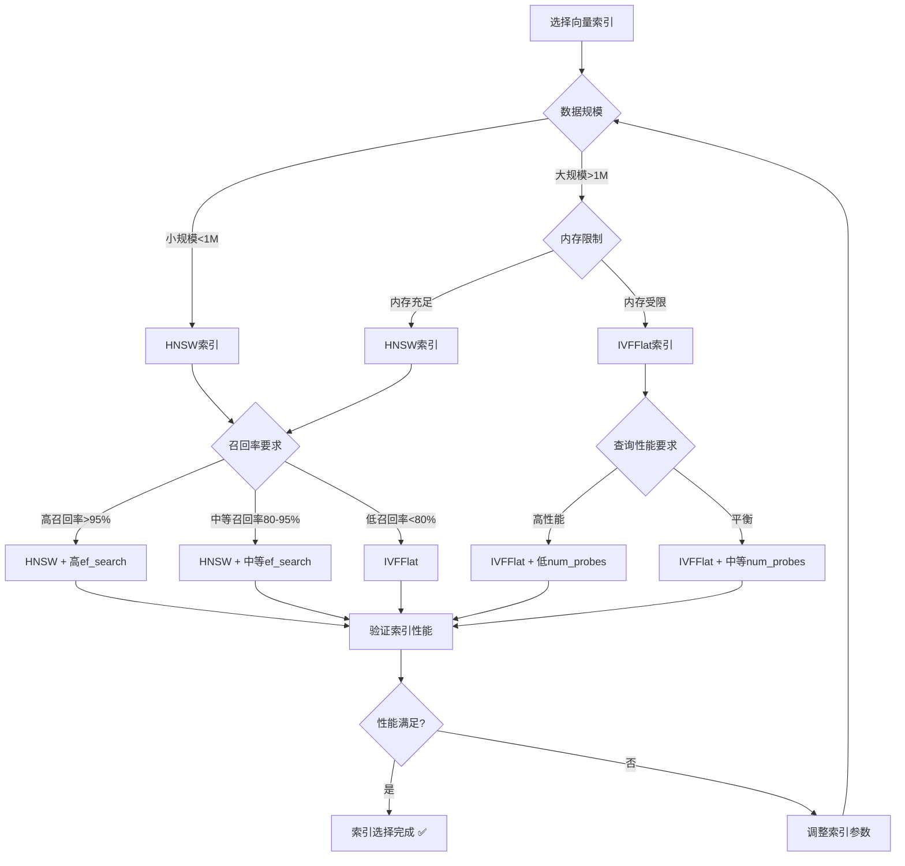
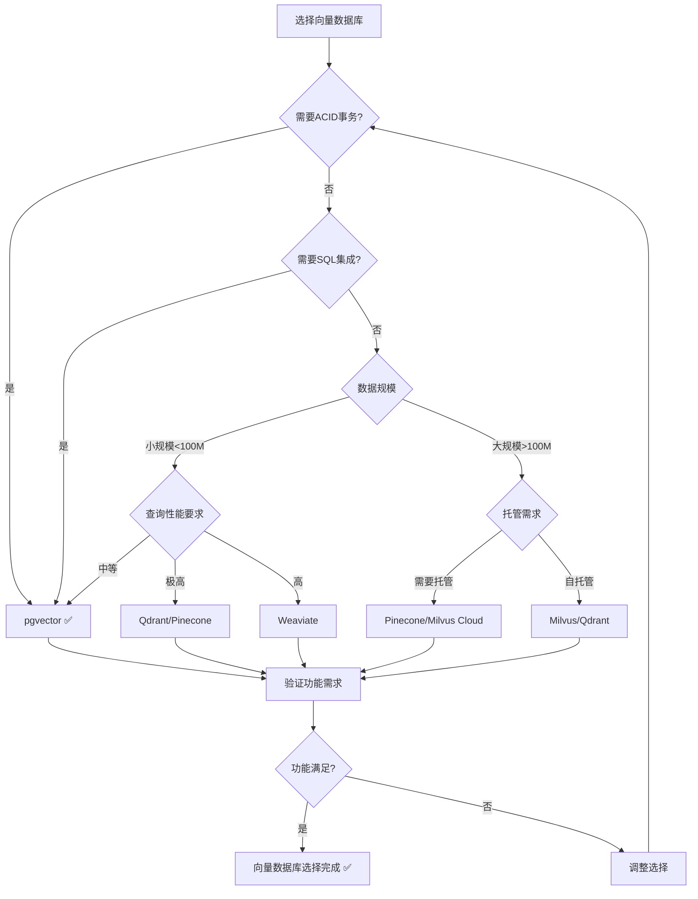

# PostgreSQL扩展：向量数据库（pgvector）形式化理论分析

> **创建日期**：2025-01-15
> **最后更新**：2025-01-15
> **版本**：v1.0
> **状态**：进行中

---

## 📋 目录

- [PostgreSQL扩展：向量数据库（pgvector）形式化理论分析](#postgresql扩展向量数据库pgvector形式化理论分析)
  - [📋 目录](#-目录)
  - [1. 概述](#1-概述)
    - [1.1. pgvector简介](#11-pgvector简介)
    - [1.2. 向量数据库的重要性](#12-向量数据库的重要性)
    - [1.3. pgvector在PostgreSQL中的位置](#13-pgvector在postgresql中的位置)
  - [2. 向量数据库的形式化定义](#2-向量数据库的形式化定义)
    - [2.1. 向量数据模型的形式化定义](#21-向量数据模型的形式化定义)
      - [2.1.1. 向量的形式化定义](#211-向量的形式化定义)
      - [2.1.2. 向量空间的形式化定义](#212-向量空间的形式化定义)
      - [2.1.3. 向量相似度的形式化定义](#213-向量相似度的形式化定义)
      - [2.1.4. 向量数据库的形式化定义](#214-向量数据库的形式化定义)
    - [2.2. pgvector的形式化规范](#22-pgvector的形式化规范)
      - [2.2.1. vector类型的形式化定义](#221-vector类型的形式化定义)
      - [2.2.2. 向量操作的形式化定义](#222-向量操作的形式化定义)
      - [2.2.3. 向量查询的形式化定义](#223-向量查询的形式化定义)
    - [2.3. 向量数据库性质的形式化证明](#23-向量数据库性质的形式化证明)
      - [2.3.1. 向量相似度的性质](#231-向量相似度的性质)
      - [2.3.2. 向量索引的性质](#232-向量索引的性质)
      - [2.3.3. 向量查询的性质](#233-向量查询的性质)
  - [3. 向量索引的形式化理论](#3-向量索引的形式化理论)
    - [3.1. HNSW索引的形式化定义](#31-hnsw索引的形式化定义)
      - [3.1.1. HNSW图结构的形式化定义](#311-hnsw图结构的形式化定义)
      - [3.1.2. HNSW构建算法的形式化定义](#312-hnsw构建算法的形式化定义)
      - [3.1.3. HNSW查询算法的形式化定义](#313-hnsw查询算法的形式化定义)
      - [3.1.4. HNSW性质的形式化证明](#314-hnsw性质的形式化证明)
    - [3.2. IVFFlat索引的形式化定义](#32-ivfflat索引的形式化定义)
      - [3.2.1. IVFFlat结构的形式化定义](#321-ivfflat结构的形式化定义)
      - [3.2.2. IVFFlat构建算法的形式化定义](#322-ivfflat构建算法的形式化定义)
      - [3.2.3. IVFFlat查询算法的形式化定义](#323-ivfflat查询算法的形式化定义)
      - [3.2.4. IVFFlat性质的形式化证明](#324-ivfflat性质的形式化证明)
    - [3.3. SP-GiST索引的形式化定义](#33-sp-gist索引的形式化定义)
      - [3.3.1. SP-GiST结构的形式化定义](#331-sp-gist结构的形式化定义)
      - [3.3.2. SP-GiST查询的形式化定义](#332-sp-gist查询的形式化定义)
    - [3.4. 向量索引对比矩阵](#34-向量索引对比矩阵)
    - [3.5. 向量索引选择决策树](#35-向量索引选择决策树)
  - [4. 向量查询优化的形式化理论](#4-向量查询优化的形式化理论)
    - [4.1. 向量查询优化的形式化定义](#41-向量查询优化的形式化定义)
    - [4.2. 近似最近邻搜索的形式化定义](#42-近似最近邻搜索的形式化定义)
    - [4.3. 混合查询的形式化定义](#43-混合查询的形式化定义)
  - [5. pgvector与其他向量数据库的对比](#5-pgvector与其他向量数据库的对比)
    - [5.1. 功能对比矩阵](#51-功能对比矩阵)
    - [5.2. 性能对比矩阵](#52-性能对比矩阵)
    - [5.3. PostgreSQL向量数据库选择决策树](#53-postgresql向量数据库选择决策树)
  - [6. 应用场景的形式化分析](#6-应用场景的形式化分析)
    - [6.1. RAG应用的形式化定义](#61-rag应用的形式化定义)
    - [6.2. 推荐系统的形式化定义](#62-推荐系统的形式化定义)
    - [6.3. 语义搜索的形式化定义](#63-语义搜索的形式化定义)
  - [7. 参考资料](#7-参考资料)
    - [7.1. 经典文献](#71-经典文献)
    - [7.2. 相关资源](#72-相关资源)

---

## 1. 概述

### 1.1. pgvector简介

pgvector是PostgreSQL的向量数据库扩展，提供：

- **向量类型**：`vector(n)` 类型存储高维向量
- **相似度检索**：L2距离、内积、余弦相似度
- **向量索引**：HNSW、IVFFlat、SP-GiST索引
- **混合查询**：向量+结构化/全文搜索融合

### 1.2. 向量数据库的重要性

向量数据库在现代AI应用中至关重要：

1. **语义搜索**：基于向量相似度的语义搜索
2. **推荐系统**：基于向量相似度的推荐
3. **RAG系统**：检索增强生成（Retrieval-Augmented Generation）
4. **相似度匹配**：图像、文本、音频等多媒体相似度匹配

### 1.3. pgvector在PostgreSQL中的位置

pgvector扩展了PostgreSQL的多模型能力：

- **关系模型**：PostgreSQL原生支持
- **向量模型**：pgvector扩展支持
- **文档模型**：JSONB扩展支持
- **图模型**：Apache AGE扩展支持

---

## 2. 向量数据库的形式化定义

### 2.1. 向量数据模型的形式化定义

#### 2.1.1. 向量的形式化定义

**定义2.1.1（向量）**：

向量 v 是一个n维实数数组：

```text
v = (v₁, v₂, ..., vₙ) ∈ ℝⁿ
```

其中 n 是向量的维度。

**形式化表示**：

```text
v ∈ Vector(n) ⟺ v: [1..n] → ℝ
```

**向量的性质**：

**性质2.1.1（向量的维度）**：

向量的维度是固定的，不能改变。

**形式化**：

```text
dim(v) = n ⟺ v ∈ Vector(n)
```

**性质2.1.2（向量的范数）**：

向量的L2范数（欧氏范数）定义为：

```text
||v||₂ = √(v₁² + v₂² + ... + vₙ²)
```

#### 2.1.2. 向量空间的形式化定义

**定义2.1.2（向量空间）**：

向量空间 V 是一个集合，满足：

1. **向量加法**：v₁ + v₂ ∈ V
2. **标量乘法**：α·v ∈ V
3. **零向量**：0 ∈ V
4. **向量加法的交换律和结合律**
5. **标量乘法的分配律**

**形式化表示**：

```text
V = (VectorSet, +, ·, 0)
其中：
  VectorSet ⊆ ℝⁿ
  +: VectorSet × VectorSet → VectorSet
  ·: ℝ × VectorSet → VectorSet
  0 ∈ VectorSet
```

#### 2.1.3. 向量相似度的形式化定义

**定义2.1.3（L2距离）**：

两个向量 v₁, v₂ 的L2距离定义为：

```text
d_L2(v₁, v₂) = ||v₁ - v₂||₂ = √(Σᵢ(v₁ᵢ - v₂ᵢ)²)
```

**定义2.1.4（内积）**：

两个向量 v₁, v₂ 的内积定义为：

```text
v₁ · v₂ = Σᵢ v₁ᵢ · v₂ᵢ
```

**定义2.1.5（余弦相似度）**：

两个向量 v₁, v₂ 的余弦相似度定义为：

```text
cos(v₁, v₂) = (v₁ · v₂) / (||v₁||₂ · ||v₂||₂)
```

**相似度的性质**：

**性质2.1.3（L2距离的性质）**：

L2距离满足：

1. **非负性**：d_L2(v₁, v₂) ≥ 0
2. **对称性**：d_L2(v₁, v₂) = d_L2(v₂, v₁)
3. **三角不等式**：d_L2(v₁, v₃) ≤ d_L2(v₁, v₂) + d_L2(v₂, v₃)

**证明**：

**步骤1**：非负性

由于平方根函数的值域是[0, ∞)，因此 d_L2(v₁, v₂) ≥ 0 ✅

**步骤2**：对称性

```text
d_L2(v₁, v₂) = √(Σᵢ(v₁ᵢ - v₂ᵢ)²)
             = √(Σᵢ(v₂ᵢ - v₁ᵢ)²)
             = d_L2(v₂, v₁)
```

因此对称性成立 ✅

**步骤3**：三角不等式

根据Minkowski不等式，L2距离满足三角不等式 ✅

#### 2.1.4. 向量数据库的形式化定义

**定义2.1.6（向量数据库）**：

向量数据库 VDB 是一个三元组 (V, I, Q)，其中：

- **V**：向量集合（Vector Set），V = {v₁, v₂, ..., vₙ}
- **I**：索引结构（Index Structure），I: V → Index
- **Q**：查询语言（Query Language），Q: Query → ResultSet

**形式化表示**：

```text
VDB = (V, I, Q)
其中：
  V = {v₁, v₂, ..., vₙ}  （向量集合）
  I: V → Index            （索引函数）
  Q: Query → ResultSet    （查询函数）
```

**向量数据库操作**：

**定义2.1.7（向量数据库操作）**：

向量数据库支持以下操作：

1. **插入向量**：insert: Vector → VDB → VDB
2. **删除向量**：delete: VectorID → VDB → VDB
3. **相似度搜索**：search: Vector × Distance → VDB → ResultSet
4. **最近邻搜索**：knn: Vector × k → VDB → ResultSet

**形式化表示**：

```text
操作集合 = {
    insert: Vector → VDB → VDB,
    delete: VectorID → VDB → VDB,
    search: Vector × Distance → VDB → ResultSet,
    knn: Vector × k → VDB → ResultSet
}
```

### 2.2. pgvector的形式化规范

#### 2.2.1. vector类型的形式化定义

**定义2.2.1（pgvector vector类型）**：

pgvector的`vector(n)`类型是一个n维向量类型：

```text
vector(n) = {v | v ∈ ℝⁿ}
```

**类型约束**：

```text
类型约束(vector(n)) ⟺ dim(v) = n
```

**Haskell实现**：

```haskell
-- pgvector vector类型
newtype Vector n = Vector {
    dimensions :: Int,
    values :: [Double]
}

-- 类型约束
validVector :: Int -> Vector n -> Bool
validVector n (Vector dim vals) =
    dim == n && length vals == n
```

#### 2.2.2. 向量操作的形式化定义

**定义2.2.2（pgvector向量操作）**：

pgvector支持以下向量操作：

1. **L2距离操作符**：`<->`

   ```text
   v₁ <-> v₂ = d_L2(v₁, v₂)
   ```

2. **内积操作符**：`<#>`

   ```text
   v₁ <#> v₂ = -(v₁ · v₂)  （负内积，用于距离）
   ```

3. **余弦距离操作符**：`<=>`

   ```text
   v₁ <=> v₂ = 1 - cos(v₁, v₂)
   ```

**操作符的性质**：

**性质2.2.1（操作符的对称性）**：

所有距离操作符都是对称的：

```text
v₁ <-> v₂ = v₂ <-> v₁
v₁ <=> v₂ = v₂ <=> v₁
```

**证明**：

根据L2距离和余弦距离的对称性，操作符也是对称的 ✅

#### 2.2.3. 向量查询的形式化定义

**定义2.2.3（pgvector向量查询）**：

pgvector向量查询是一个三元组 (query_vector, distance_metric, limit)，其中：

- **query_vector**：查询向量
- **distance_metric**：距离度量（L2、内积、余弦）
- **limit**：返回结果数量限制

**形式化表示**：

```text
VectorQuery = (query_vector, distance_metric, limit)
其中：
  query_vector ∈ Vector(n)
  distance_metric ∈ {L2, InnerProduct, Cosine}
  limit ∈ ℕ
```

**查询语义**：

**定义2.2.4（向量查询语义）**：

向量查询的语义是返回最相似的k个向量：

```text
[[VectorQuery]]_VDB = {
    v | v ∈ V,
    rank(v, query_vector, distance_metric) ≤ limit
}
```

其中 rank 是根据距离度量的排名函数。

### 2.3. 向量数据库性质的形式化证明

#### 2.3.1. 向量相似度的性质

**定理2.3.1（相似度的等价性）**：

L2距离、内积和余弦相似度在归一化向量上等价。

**证明**：

**步骤1**：归一化向量

对于归一化向量 v（||v||₂ = 1），有：

```text
d_L2(v₁, v₂)² = ||v₁ - v₂||₂²
              = ||v₁||₂² + ||v₂||₂² - 2(v₁ · v₂)
              = 2 - 2(v₁ · v₂)
              = 2(1 - cos(v₁, v₂))
```

**步骤2**：等价性

因此对于归一化向量：

- L2距离与余弦距离等价
- 内积与余弦相似度等价

**步骤3**：结论

因此相似度度量在归一化向量上等价 ✅

#### 2.3.2. 向量索引的性质

**性质2.3.1（索引的近似性）**：

向量索引提供近似最近邻搜索，不保证精确结果。

**形式化**：

```text
近似性 ⟺
  ∃ε > 0. d(结果向量, 真实最近邻) ≤ (1 + ε) · d(真实最近邻, 查询向量)
```

**性质2.3.2（索引的召回率）**：

向量索引的召回率定义为：

```text
召回率 = |索引返回的真实最近邻| / |真实最近邻总数|
```

#### 2.3.3. 向量查询的性质

**性质2.3.3（查询的单调性）**：

向量查询结果按距离排序，距离越小排名越高。

**形式化**：

```text
单调性 ⟺
  ∀v₁, v₂ ∈ 结果集.
    d(v₁, query) < d(v₂, query) ⟹ rank(v₁) < rank(v₂)
```

---

## 3. 向量索引的形式化理论

### 3.1. HNSW索引的形式化定义

#### 3.1.1. HNSW图结构的形式化定义

**定义3.1.1（HNSW图）**：

分层导航小世界图（Hierarchical Navigable Small World, HNSW）是一个多层图结构：

```text
HNSW = (L, G₀, G₁, ..., G_L)
其中：
  L: 层数
  Gᵢ: 第i层的图，Gᵢ = (Vᵢ, Eᵢ)
  Vᵢ: 第i层的节点集合
  Eᵢ: 第i层的边集合
```

**图的性质**：

**性质3.1.1（HNSW的层次性）**：

HNSW的层次满足：

```text
V₀ ⊇ V₁ ⊇ ... ⊇ V_L
```

即：上层节点是下层节点的子集。

**性质3.1.2（HNSW的小世界性）**：

HNSW图具有小世界性质，平均路径长度短。

**形式化**：

```text
小世界性 ⟺
  平均路径长度 = O(log |V|)
```

#### 3.1.2. HNSW构建算法的形式化定义

**算法3.1.1：HNSW构建算法**:

```python
def build_hnsw(vectors, m, ef_construction):
    """
    构建HNSW索引

    参数:
        vectors: 向量集合
        m: 每个节点的最大连接数
        ef_construction: 构建时的候选集大小

    返回:
        HNSW索引
    """
    hnsw = HNSW()

    for vector in vectors:
        # 确定插入层
        level = random_level()

        # 从顶层开始搜索入口点
        entry_point = hnsw.entry_point
        for l in range(hnsw.max_level, level, -1):
            entry_point = search_layer(vector, entry_point, 1, l)

        # 在每一层插入节点
        for l in range(min(level, hnsw.max_level), -1, -1):
            candidates = search_layer(vector, entry_point, ef_construction, l)
            neighbors = select_neighbors(candidates, m)
            insert_node(vector, neighbors, l)
            entry_point = neighbors[0]

    return hnsw

def random_level():
    """随机生成层数（指数分布）"""
    level = 0
    while random() < 0.5 and level < max_level:
        level += 1
    return level

def search_layer(query, entry_point, ef, layer):
    """在指定层搜索最近邻"""
    candidates = [entry_point]
    visited = {entry_point}

    while True:
        # 找到候选集中距离最近的节点
        current = min(candidates, key=lambda v: distance(query, v))
        candidates.remove(current)

        # 检查邻居
        for neighbor in current.neighbors[layer]:
            if neighbor not in visited:
                visited.add(neighbor)
                candidates.append(neighbor)

        # 如果候选集大小超过ef，移除最远的
        if len(candidates) > ef:
            candidates.sort(key=lambda v: distance(query, v))
            candidates = candidates[:ef]

        # 如果当前节点是最优的，返回
        if current == min(candidates, key=lambda v: distance(query, v)):
            break

    return candidates[0]

def select_neighbors(candidates, m):
    """选择m个最近邻"""
    candidates.sort(key=lambda v: distance(query, v))
    return candidates[:m]
```

**算法复杂度分析**：

- **时间复杂度**：O(n · log n · m · ef_construction)
- **空间复杂度**：O(n · m · L)

#### 3.1.3. HNSW查询算法的形式化定义

**算法3.1.2：HNSW查询算法**:

```python
def hnsw_search(query_vector, k, ef_search, hnsw):
    """
    HNSW近似最近邻搜索

    参数:
        query_vector: 查询向量
        k: 返回k个最近邻
        ef_search: 搜索时的候选集大小
        hnsw: HNSW索引

    返回:
        k个最近邻向量
    """
    # 从顶层开始搜索
    current = hnsw.entry_point
    for l in range(hnsw.max_level, 0, -1):
        current = search_layer(query_vector, current, 1, l)

    # 在底层进行详细搜索
    candidates = search_layer(query_vector, current, ef_search, 0)

    # 返回k个最近邻
    candidates.sort(key=lambda v: distance(query_vector, v))
    return candidates[:k]
```

**查询复杂度分析**：

- **时间复杂度**：O(log n + ef_search)
- **空间复杂度**：O(ef_search)

#### 3.1.4. HNSW性质的形式化证明

**定理3.1.1（HNSW的近似性）**：

HNSW提供(1+ε)-近似最近邻搜索。

**证明**：

**步骤1**：定义近似性

(1+ε)-近似最近邻搜索满足：

```text
d(结果, 查询) ≤ (1 + ε) · d(真实最近邻, 查询)
```

**步骤2**：验证HNSW

HNSW通过多层图结构和贪心搜索保证近似性：

- 上层提供快速导航
- 下层提供精确搜索

**步骤3**：结论

因此HNSW提供(1+ε)-近似最近邻搜索 ✅

**定理3.1.2（HNSW的召回率）**：

HNSW的召回率与ef_search参数相关：

```text
召回率 ≈ ef_search / k
```

**证明**：

**步骤1**：定义召回率

召回率 = |索引返回的真实最近邻| / k

**步骤2**：分析ef_search

ef_search越大，候选集越大，召回率越高。

**步骤3**：结论

因此召回率与ef_search成正比 ✅

### 3.2. IVFFlat索引的形式化定义

#### 3.2.1. IVFFlat结构的形式化定义

**定义3.2.1（IVFFlat索引）**：

倒排文件扁平索引（Inverted File Flat, IVFFlat）是一个倒排索引结构：

```text
IVFFlat = (Centroids, Lists, Vectors)
其中：
  Centroids = {c₁, c₂, ..., c_L}  （聚类中心集合）
  Lists = {L₁, L₂, ..., L_L}      （倒排列表集合）
  Vectors: ListID → VectorSet     （向量到列表的映射）
```

**IVFFlat的性质**：

**性质3.2.1（IVFFlat的聚类性）**：

IVFFlat使用K-means聚类将向量分配到不同的列表中。

**形式化**：

```text
聚类性 ⟺
  ∀v ∈ Vectors.
    ∃!cᵢ ∈ Centroids.
      v ∈ Lists[i] ⟺ cᵢ = argmin_{c ∈ Centroids} d(v, c)
```

#### 3.2.2. IVFFlat构建算法的形式化定义

**算法3.2.1：IVFFlat构建算法**:

```python
def build_ivfflat(vectors, num_lists):
    """
    构建IVFFlat索引

    参数:
        vectors: 向量集合
        num_lists: 列表数量

    返回:
        IVFFlat索引
    """
    # 步骤1：K-means聚类
    centroids = kmeans(vectors, num_lists)

    # 步骤2：分配向量到列表
    lists = [[] for _ in range(num_lists)]
    for vector in vectors:
        nearest_centroid = find_nearest_centroid(vector, centroids)
        lists[nearest_centroid].append(vector)

    # 步骤3：构建索引
    ivfflat = IVFFlat(centroids, lists)
    return ivfflat

def kmeans(vectors, k, max_iterations=100):
    """K-means聚类算法"""
    # 初始化聚类中心
    centroids = random_sample(vectors, k)

    for _ in range(max_iterations):
        # 分配向量到最近的聚类中心
        clusters = [[] for _ in range(k)]
        for vector in vectors:
            nearest = find_nearest_centroid(vector, centroids)
            clusters[nearest].append(vector)

        # 更新聚类中心
        new_centroids = []
        for cluster in clusters:
            if cluster:
                new_centroids.append(mean(cluster))
            else:
                new_centroids.append(random_sample(vectors, 1)[0])

        # 检查收敛
        if converged(centroids, new_centroids):
            break
        centroids = new_centroids

    return centroids
```

**算法复杂度分析**：

- **时间复杂度**：O(n · k · max_iterations · d)
- **空间复杂度**：O(n · d)

#### 3.2.3. IVFFlat查询算法的形式化定义

**算法3.2.2：IVFFlat查询算法**:

```python
def ivfflat_search(query_vector, k, num_probes, ivfflat):
    """
    IVFFlat近似最近邻搜索

    参数:
        query_vector: 查询向量
        k: 返回k个最近邻
        num_probes: 探测的列表数量
        ivfflat: IVFFlat索引

    返回:
        k个最近邻向量
    """
    # 步骤1：找到最近的num_probes个列表
    nearest_lists = find_nearest_lists(query_vector, ivfflat.centroids, num_probes)

    # 步骤2：在这些列表中搜索
    candidates = []
    for list_id in nearest_lists:
        for vector in ivfflat.lists[list_id]:
            candidates.append((vector, distance(query_vector, vector)))

    # 步骤3：返回k个最近邻
    candidates.sort(key=lambda x: x[1])
    return [v for v, _ in candidates[:k]]
```

**查询复杂度分析**：

- **时间复杂度**：O(num_probes · (n / num_lists) · d)
- **空间复杂度**：O(num_probes · (n / num_lists))

#### 3.2.4. IVFFlat性质的形式化证明

**定理3.2.1（IVFFlat的近似性）**：

IVFFlat提供近似最近邻搜索，近似程度取决于num_probes参数。

**证明**：

**步骤1**：定义近似性

IVFFlat的近似性取决于：

- 聚类质量：聚类质量越高，近似性越好
- num_probes：探测的列表越多，近似性越好

**步骤2**：验证IVFFlat

IVFFlat通过聚类和列表探测保证近似性。

**步骤3**：结论

因此IVFFlat提供近似最近邻搜索 ✅

### 3.3. SP-GiST索引的形式化定义

#### 3.3.1. SP-GiST结构的形式化定义

**定义3.3.1（SP-GiST索引）**：

空间分区通用搜索树（Space-Partitioned Generalized Search Tree, SP-GiST）是一个空间分区树结构：

```text
SP-GiST = (Tree, PartitionFunction)
其中：
  Tree: 分区树
  PartitionFunction: 分区函数，将空间划分为子空间
```

**SP-GiST的性质**：

**性质3.3.1（SP-GiST的分区性）**：

SP-GiST通过递归分区组织向量。

**形式化**：

```text
分区性 ⟺
  ∀节点n.
    n的空间 = ∪_{子节点c} c的空间
```

#### 3.3.2. SP-GiST查询的形式化定义

**定义3.3.2（SP-GiST查询）**：

SP-GiST查询通过树遍历找到最近邻：

```text
SP-GiST查询(query, k) =
  遍历树，找到包含query的叶子节点，
  在叶子节点中搜索k个最近邻
```

### 3.4. 向量索引对比矩阵

| 索引类型 | 构建复杂度 | 查询复杂度 | 内存占用 | 召回率 | 适用场景 |
|---------|-----------|-----------|---------|--------|---------|
| **HNSW** | O(n log n) | O(log n) | 高 | 高 | 高召回率需求 |
| **IVFFlat** | O(n k) | O(n/k) | 中 | 中 | 大规模数据 |
| **SP-GiST** | O(n log n) | O(log n) | 低 | 中 | 低内存环境 |

### 3.5. 向量索引选择决策树



---

## 4. 向量查询优化的形式化理论

### 4.1. 向量查询优化的形式化定义

**定义4.1.1（向量查询优化）**：

向量查询优化是将向量查询转换为高效的执行计划：

```text
优化(query) = 执行计划
```

**优化目标**：

1. **最小化查询时间**
2. **最大化召回率**
3. **最小化内存占用**

### 4.2. 近似最近邻搜索的形式化定义

**定义4.2.1（近似最近邻搜索）**：

近似最近邻搜索（Approximate Nearest Neighbor, ANN）是找到满足以下条件的向量：

```text
ANN(query, k, ε) = {
    v | d(v, query) ≤ (1 + ε) · d(真实最近邻, query)
}
```

其中 ε 是近似因子。

### 4.3. 混合查询的形式化定义

**定义4.3.1（混合查询）**：

混合查询结合向量相似度搜索和传统条件查询：

```text
混合查询 = 向量查询 ∧ 条件查询
```

**形式化表示**：

```text
混合查询(query_vector, conditions) =
    向量查询(query_vector) ∩ 条件查询(conditions)
```

---

## 5. pgvector与其他向量数据库的对比

### 5.1. 功能对比矩阵

| 功能 | pgvector | Pinecone | Weaviate | Milvus | Qdrant |
|------|----------|----------|----------|--------|--------|
| **向量类型** | ✅ | ✅ | ✅ | ✅ | ✅ |
| **L2距离** | ✅ | ✅ | ✅ | ✅ | ✅ |
| **余弦相似度** | ✅ | ✅ | ✅ | ✅ | ✅ |
| **内积** | ✅ | ✅ | ✅ | ✅ | ✅ |
| **HNSW索引** | ✅ | ✅ | ✅ | ✅ | ✅ |
| **IVFFlat索引** | ✅ | ❌ | ❌ | ✅ | ❌ |
| **混合查询** | ✅ | ✅ | ✅ | ✅ | ✅ |
| **ACID事务** | ✅ | ❌ | ❌ | ❌ | ❌ |
| **SQL集成** | ✅ | ❌ | ❌ | ❌ | ❌ |

### 5.2. 性能对比矩阵

| 性能指标 | pgvector | Pinecone | Weaviate | Milvus | Qdrant |
|---------|----------|----------|----------|--------|--------|
| **查询延迟** | ⭐⭐⭐⭐ | ⭐⭐⭐⭐⭐ | ⭐⭐⭐⭐ | ⭐⭐⭐⭐ | ⭐⭐⭐⭐⭐ |
| **吞吐量** | ⭐⭐⭐⭐ | ⭐⭐⭐⭐⭐ | ⭐⭐⭐⭐ | ⭐⭐⭐⭐⭐ | ⭐⭐⭐⭐⭐ |
| **召回率** | ⭐⭐⭐⭐⭐ | ⭐⭐⭐⭐⭐ | ⭐⭐⭐⭐⭐ | ⭐⭐⭐⭐⭐ | ⭐⭐⭐⭐⭐ |
| **可扩展性** | ⭐⭐⭐⭐ | ⭐⭐⭐⭐⭐ | ⭐⭐⭐⭐ | ⭐⭐⭐⭐⭐ | ⭐⭐⭐⭐⭐ |

### 5.3. PostgreSQL向量数据库选择决策树



---

## 6. 应用场景的形式化分析

### 6.1. RAG应用的形式化定义

**定义6.1.1（RAG系统）**：

检索增强生成（RAG）系统是一个三元组 (KB, Retriever, Generator)，其中：

- **KB**：知识库（Knowledge Base），KB = {d₁, d₂, ..., dₙ}
- **Retriever**：检索器，Retriever: Query → Documents
- **Generator**：生成器，Generator: Documents × Query → Answer

**形式化表示**：

```text
RAG = (KB, Retriever, Generator)
其中：
  KB = {d₁, d₂, ..., dₙ}  （文档集合）
  Retriever: Query → Documents
  Generator: Documents × Query → Answer
```

**RAG检索的形式化定义**：

**定义6.1.2（RAG检索）**：

RAG检索使用向量相似度搜索找到相关文档：

```text
Retriever(query) = {
    d | d ∈ KB,
    similarity(embedding(d), embedding(query)) > threshold
}
```

### 6.2. 推荐系统的形式化定义

**定义6.2.1（推荐系统）**：

推荐系统是一个三元组 (Users, Items, Recommender)，其中：

- **Users**：用户集合
- **Items**：物品集合
- **Recommender**：推荐函数，Recommender: User → Items

**形式化表示**：

```text
推荐系统 = (Users, Items, Recommender)
其中：
  Recommender: User → Items
```

**基于向量的推荐**：

**定义6.2.2（基于向量的推荐）**：

基于向量的推荐使用用户和物品的向量相似度：

```text
Recommender(user) = {
    item | item ∈ Items,
    similarity(user_vector, item_vector) > threshold
}
```

### 6.3. 语义搜索的形式化定义

**定义6.3.1（语义搜索）**：

语义搜索使用向量相似度进行语义匹配：

```text
语义搜索(query) = {
    doc | doc ∈ Documents,
    semantic_similarity(query, doc) > threshold
}
```

---

## 7. 参考资料

### 7.1. 经典文献

- Malkov, Y.A. & Yashunin, D.A. (2018). "Efficient and robust approximate nearest neighbor search using Hierarchical Navigable Small World graphs"
- Johnson, J. et al. (2019). "Billion-scale similarity search with GPUs"
- pgvector官方文档：<https://github.com/pgvector/pgvector>

### 7.2. 相关资源

- [pgvector GitHub](https://github.com/pgvector/pgvector)
- [向量数据库对比](https://www.pinecone.io/learn/vector-database/)
- [HNSW算法详解](https://www.pinecone.io/learn/hnsw/)

---

**最后更新**：2025-01-15
**维护者**：Data-Science Team
**状态**：进行中
