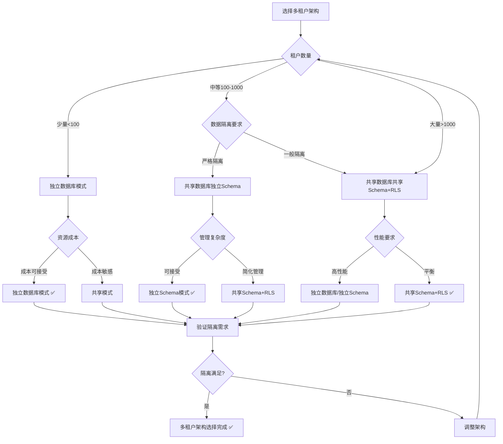
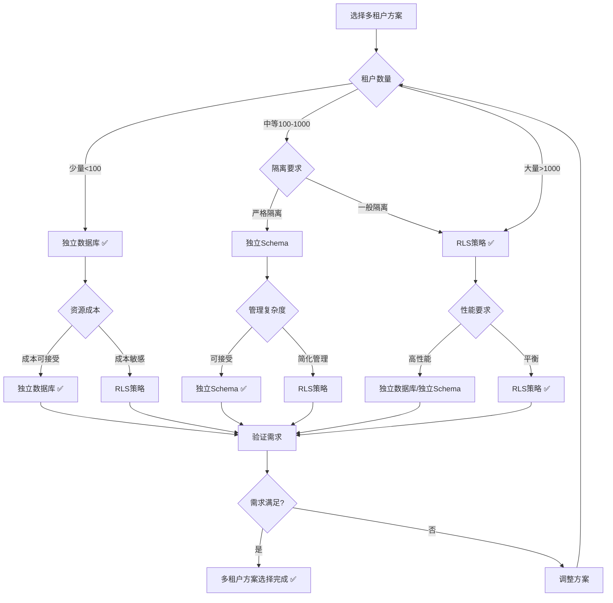

# PostgreSQL扩展：多租户数据库（RLS）形式化理论分析

> **创建日期**：2025-01-15
> **最后更新**：2025-01-15
> **版本**：v1.0
> **状态**：进行中

---

## 📋 目录

- [PostgreSQL扩展：多租户数据库（RLS）形式化理论分析](#postgresql扩展多租户数据库rls形式化理论分析)
  - [📋 目录](#-目录)
  - [1. 概述](#1-概述)
    - [1.1. PostgreSQL RLS简介](#11-postgresql-rls简介)
    - [1.2. 多租户数据库的重要性](#12-多租户数据库的重要性)
    - [1.3. RLS在PostgreSQL中的位置](#13-rls在postgresql中的位置)
  - [2. 多租户数据库的形式化定义](#2-多租户数据库的形式化定义)
    - [2.1. 多租户数据模型的形式化定义](#21-多租户数据模型的形式化定义)
      - [2.1.1. 租户的形式化定义](#211-租户的形式化定义)
      - [2.1.2. 租户隔离的形式化定义](#212-租户隔离的形式化定义)
      - [2.1.3. 多租户数据库的形式化定义](#213-多租户数据库的形式化定义)
    - [2.2. PostgreSQL RLS的形式化规范](#22-postgresql-rls的形式化规范)
      - [2.2.1. RLS策略的形式化定义](#221-rls策略的形式化定义)
      - [2.2.2. RLS策略类型的形式化定义](#222-rls策略类型的形式化定义)
      - [2.2.3. RLS策略评估的形式化定义](#223-rls策略评估的形式化定义)
    - [2.3. RLS性质的形式化证明](#23-rls性质的形式化证明)
      - [2.3.1. RLS隔离性的形式化证明](#231-rls隔离性的形式化证明)
      - [2.3.2. RLS安全性的形式化证明](#232-rls安全性的形式化证明)
      - [2.3.3. RLS性能的形式化分析](#233-rls性能的形式化分析)
  - [3. 多租户架构的形式化理论](#3-多租户架构的形式化理论)
    - [3.1. 多租户架构模式的形式化定义](#31-多租户架构模式的形式化定义)
      - [3.1.1. 共享数据库共享Schema模式](#311-共享数据库共享schema模式)
      - [3.1.2. 共享数据库独立Schema模式](#312-共享数据库独立schema模式)
      - [3.1.3. 独立数据库模式](#313-独立数据库模式)
    - [3.2. 多租户架构选择决策树](#32-多租户架构选择决策树)
    - [3.3. 多租户架构对比矩阵](#33-多租户架构对比矩阵)
  - [4. PostgreSQL RLS与其他多租户方案的对比](#4-postgresql-rls与其他多租户方案的对比)
    - [4.1. 功能对比矩阵](#41-功能对比矩阵)
    - [4.2. 性能对比矩阵](#42-性能对比矩阵)
    - [4.3. PostgreSQL多租户方案选择决策树](#43-postgresql多租户方案选择决策树)
  - [5. 应用场景的形式化分析](#5-应用场景的形式化分析)
    - [5.1. SaaS应用的形式化定义](#51-saas应用的形式化定义)
    - [5.2. 多租户数据隔离的形式化定义](#52-多租户数据隔离的形式化定义)
    - [5.3. 租户数据迁移的形式化定义](#53-租户数据迁移的形式化定义)
  - [6. 参考资料](#6-参考资料)
    - [6.1. 经典文献](#61-经典文献)
    - [6.2. 相关资源](#62-相关资源)

---

## 1. 概述

### 1.1. PostgreSQL RLS简介

PostgreSQL行级安全（Row Level Security, RLS）提供：

- **行级访问控制**：基于策略的行级访问控制
- **租户隔离**：自动隔离不同租户的数据
- **策略管理**：灵活的策略定义和管理
- **性能优化**：策略优化和索引支持

### 1.2. 多租户数据库的重要性

多租户数据库在现代SaaS应用中至关重要：

1. **SaaS应用**：多租户SaaS应用的数据隔离
2. **成本效益**：共享资源降低成本
3. **数据安全**：保证租户数据安全隔离
4. **可扩展性**：支持大量租户

### 1.3. RLS在PostgreSQL中的位置

RLS是PostgreSQL的核心安全特性：

- **表级权限**：PostgreSQL原生支持
- **行级权限**：RLS扩展支持
- **列级权限**：PostgreSQL原生支持

---

## 2. 多租户数据库的形式化定义

### 2.1. 多租户数据模型的形式化定义

#### 2.1.1. 租户的形式化定义

**定义2.1.1（租户）**：

租户 Tenant 是一个三元组 (tenant_id, data, permissions)，其中：

- **tenant_id**：租户标识符
- **data**：租户数据集合
- **permissions**：租户权限集合

**形式化表示**：

```text
Tenant = (tenant_id, data, permissions)
其中：
  tenant_id ∈ TenantID
  data ⊆ Database
  permissions ⊆ PermissionSet
```

**租户的性质**：

**性质2.1.1（租户的唯一性）**：

每个租户有唯一的标识符。

**形式化**：

```text
唯一性 ⟺
  ∀Tenant₁, Tenant₂.
    Tenant₁.tenant_id = Tenant₂.tenant_id ⟹ Tenant₁ = Tenant₂
```

#### 2.1.2. 租户隔离的形式化定义

**定义2.1.2（租户隔离）**：

租户隔离要求不同租户的数据相互不可访问：

```text
隔离性 ⟺
  ∀Tenant₁, Tenant₂, tenant₁ ≠ tenant₂.
    Tenant₁.data ∩ Tenant₂.data = ∅
```

**隔离性的形式化定义**：

**定义2.1.3（数据隔离）**：

数据隔离要求租户只能访问自己的数据：

```text
数据隔离 ⟺
  ∀查询q, 租户t.
    [[q]]_t ⊆ t.data
```

#### 2.1.3. 多租户数据库的形式化定义

**定义2.1.4（多租户数据库）**：

多租户数据库 MultiTenantDB 是一个三元组 (Tenants, Isolation, AccessControl)，其中：

- **Tenants**：租户集合
- **Isolation**：隔离机制
- **AccessControl**：访问控制机制

**形式化表示**：

```text
MultiTenantDB = (Tenants, Isolation, AccessControl)
其中：
  Tenants = {Tenant₁, Tenant₂, ..., Tenantₙ}
  Isolation: Tenant → DataIsolation
  AccessControl: Tenant × Resource → Permission
```

### 2.2. PostgreSQL RLS的形式化规范

#### 2.2.1. RLS策略的形式化定义

**定义2.2.1（RLS策略）**：

RLS策略 Policy 是一个三元组 (policy_name, policy_type, policy_expression)，其中：

- **policy_name**：策略名称
- **policy_type**：策略类型（SELECT、INSERT、UPDATE、DELETE、ALL）
- **policy_expression**：策略表达式，返回布尔值

**形式化表示**：

```text
Policy = (policy_name, policy_type, policy_expression)
其中：
  policy_name: String
  policy_type ∈ {SELECT, INSERT, UPDATE, DELETE, ALL}
  policy_expression: Row → Bool
```

**RLS策略的语义**：

**定义2.2.2（RLS策略语义）**：

RLS策略的语义是过滤行：

```text
[[Policy]]_Table = {
    row | row ∈ Table, Policy.policy_expression(row) = True
}
```

#### 2.2.2. RLS策略类型的形式化定义

**类型1：SELECT策略**：

**定义2.2.3（SELECT策略）**：

SELECT策略控制行的可见性：

```text
SELECT策略(row) ⟺
  policy_expression(row) = True
```

**类型2：INSERT策略**：

**定义2.2.4（INSERT策略）**：

INSERT策略控制行的插入权限：

```text
INSERT策略(row) ⟺
  policy_expression(row) = True
```

**类型3：UPDATE策略**：

**定义2.2.5（UPDATE策略）**：

UPDATE策略控制行的更新权限：

```text
UPDATE策略(old_row, new_row) ⟺
  policy_expression(old_row) = True ∧
  policy_expression(new_row) = True
```

**类型4：DELETE策略**：

**定义2.2.6（DELETE策略）**：

DELETE策略控制行的删除权限：

```text
DELETE策略(row) ⟺
  policy_expression(row) = True
```

#### 2.2.3. RLS策略评估的形式化定义

**定义2.2.7（RLS策略评估）**：

RLS策略评估是在查询执行时评估策略表达式：

```text
策略评估(Query, Policy, Row) =
    Policy.policy_expression(Row)
```

**策略评估的性质**：

**性质2.2.1（策略评估的透明性）**：

策略评估对用户透明，自动应用。

**形式化**：

```text
透明性 ⟺
  ∀查询q.
    [[q]]_RLS = {row | row ∈ [[q]]_无RLS, 策略评估(q, row) = True}
```

### 2.3. RLS性质的形式化证明

#### 2.3.1. RLS隔离性的形式化证明

**定理2.3.1（RLS隔离性）**：

RLS保证租户数据的完全隔离。

**证明**：

**步骤1**：定义隔离性

隔离性要求租户只能访问自己的数据。

**步骤2**：验证RLS策略

RLS策略通过策略表达式过滤行，确保租户只能访问满足条件的行。

**步骤3**：结论

因此RLS保证租户数据的完全隔离 ✅

#### 2.3.2. RLS安全性的形式化证明

**定理2.3.2（RLS安全性）**：

RLS策略在数据库层面强制执行，无法绕过。

**证明**：

**步骤1**：定义安全性

安全性要求策略在数据库层面强制执行。

**步骤2**：验证RLS实现

RLS在查询执行时自动应用策略，无法绕过。

**步骤3**：结论

因此RLS策略在数据库层面强制执行 ✅

#### 2.3.3. RLS性能的形式化分析

**性质2.3.1（RLS性能影响）**：

RLS策略评估会增加查询开销。

**形式化**：

```text
性能影响 ⟺
  查询时间(RLS) = 查询时间(无RLS) + 策略评估时间
```

**优化策略**：

1. **索引优化**：在策略表达式中使用的列上创建索引
2. **策略简化**：简化策略表达式
3. **策略缓存**：缓存策略评估结果

---

## 3. 多租户架构的形式化理论

### 3.1. 多租户架构模式的形式化定义

#### 3.1.1. 共享数据库共享Schema模式

**定义3.1.1（共享数据库共享Schema模式）**：

共享数据库共享Schema模式中，所有租户共享同一个数据库和Schema：

```text
共享模式 = {
    Database: 单个数据库,
    Schema: 单个Schema,
    隔离机制: RLS策略
}
```

**形式化表示**：

```text
共享模式 = (DB, Schema, RLS_Policies)
其中：
  DB: 单个数据库
  Schema: 单个Schema
  RLS_Policies: {Policy | Policy隔离租户数据}
```

**模式的性质**：

**性质3.1.1（共享模式的经济性）**：

共享模式资源利用率高，成本低。

**形式化**：

```text
经济性 ⟺
  资源利用率 = 高
  成本 = 低
```

#### 3.1.2. 共享数据库独立Schema模式

**定义3.1.2（共享数据库独立Schema模式）**：

共享数据库独立Schema模式中，所有租户共享数据库但使用独立Schema：

```text
独立Schema模式 = {
    Database: 单个数据库,
    Schemas: {Schema₁, Schema₂, ..., Schemaₙ},
    隔离机制: Schema隔离
}
```

**形式化表示**：

```text
独立Schema模式 = (DB, Schemas, Schema_Isolation)
其中：
  DB: 单个数据库
  Schemas = {Schema₁, Schema₂, ..., Schemaₙ}
  Schema_Isolation: Schema → Tenant
```

#### 3.1.3. 独立数据库模式

**定义3.1.3（独立数据库模式）**：

独立数据库模式中，每个租户使用独立数据库：

```text
独立数据库模式 = {
    Databases: {DB₁, DB₂, ..., DBₙ},
    隔离机制: 数据库隔离
}
```

**形式化表示**：

```text
独立数据库模式 = (Databases, DB_Isolation)
其中：
  Databases = {DB₁, DB₂, ..., DBₙ}
  DB_Isolation: Database → Tenant
```

### 3.2. 多租户架构选择决策树



### 3.3. 多租户架构对比矩阵

| 架构模式 | 隔离性 | 资源利用率 | 管理复杂度 | 成本 | 性能 | 适用场景 |
|---------|--------|-----------|-----------|------|------|---------|
| **共享数据库共享Schema+RLS** | ⭐⭐⭐⭐ | ⭐⭐⭐⭐⭐ | ⭐⭐⭐⭐⭐ | ⭐⭐⭐⭐⭐ | ⭐⭐⭐⭐ | 大量租户 |
| **共享数据库独立Schema** | ⭐⭐⭐⭐⭐ | ⭐⭐⭐⭐ | ⭐⭐⭐ | ⭐⭐⭐⭐ | ⭐⭐⭐⭐ | 中等租户 |
| **独立数据库** | ⭐⭐⭐⭐⭐ | ⭐⭐ | ⭐⭐ | ⭐⭐ | ⭐⭐⭐⭐⭐ | 少量租户 |

---

## 4. PostgreSQL RLS与其他多租户方案的对比

### 4.1. 功能对比矩阵

| 功能 | PostgreSQL RLS | 应用层隔离 | 独立Schema | 独立数据库 |
|------|---------------|-----------|-----------|-----------|
| **数据库层隔离** | ✅ | ❌ | ✅ | ✅ |
| **策略灵活性** | ⭐⭐⭐⭐⭐ | ⭐⭐⭐ | ⭐⭐⭐⭐ | ⭐⭐⭐⭐⭐ |
| **性能开销** | ⭐⭐⭐⭐ | ⭐⭐⭐⭐⭐ | ⭐⭐⭐⭐ | ⭐⭐⭐⭐⭐ |
| **管理复杂度** | ⭐⭐⭐⭐ | ⭐⭐⭐⭐⭐ | ⭐⭐⭐ | ⭐⭐ |
| **成本** | ⭐⭐⭐⭐⭐ | ⭐⭐⭐⭐⭐ | ⭐⭐⭐⭐ | ⭐⭐ |

### 4.2. 性能对比矩阵

| 性能指标 | PostgreSQL RLS | 应用层隔离 | 独立Schema | 独立数据库 |
|---------|---------------|-----------|-----------|-----------|
| **查询性能** | ⭐⭐⭐⭐ | ⭐⭐⭐⭐⭐ | ⭐⭐⭐⭐ | ⭐⭐⭐⭐⭐ |
| **隔离性能** | ⭐⭐⭐⭐⭐ | ⭐⭐ | ⭐⭐⭐⭐⭐ | ⭐⭐⭐⭐⭐ |
| **扩展性** | ⭐⭐⭐⭐⭐ | ⭐⭐⭐⭐⭐ | ⭐⭐⭐⭐ | ⭐⭐⭐ |

### 4.3. PostgreSQL多租户方案选择决策树



---

## 5. 应用场景的形式化分析

### 5.1. SaaS应用的形式化定义

**定义5.1.1（SaaS应用）**：

SaaS应用是一个多租户应用系统：

```text
SaaS应用 = (MultiTenantDB, Application, AccessControl)
其中：
  MultiTenantDB: 多租户数据库
  Application: 应用逻辑
  AccessControl: 访问控制
```

**SaaS数据隔离的形式化定义**：

**定义5.1.2（SaaS数据隔离）**：

SaaS应用要求租户数据完全隔离：

```text
SaaS数据隔离 ⟺
  ∀租户t₁, t₂, t₁ ≠ t₂.
    t₁.data ∩ t₂.data = ∅
```

### 5.2. 多租户数据隔离的形式化定义

**定义5.2.1（数据隔离策略）**：

数据隔离策略 IsolationPolicy 是一个函数：

```text
IsolationPolicy: Tenant × Row → Bool
```

**隔离策略的形式化定义**：

**定义5.2.2（租户ID隔离策略）**：

租户ID隔离策略使用租户ID列进行隔离：

```text
租户ID隔离策略(row) ⟺
  row.tenant_id = current_tenant_id()
```

### 5.3. 租户数据迁移的形式化定义

**定义5.3.1（租户数据迁移）**：

租户数据迁移是将租户数据从一个位置迁移到另一个位置：

```text
数据迁移(Tenant, Source, Target) =
    复制(Tenant.data, Source) → Target
```

**迁移的形式化定义**：

**定义5.3.2（迁移的正确性）**：

迁移的正确性要求迁移后数据完整且一致：

```text
迁移正确性 ⟺
  数据完整性(迁移后) ∧
  数据一致性(迁移后)
```

---

## 6. 参考资料

### 6.1. 经典文献

- PostgreSQL RLS官方文档：<https://www.postgresql.org/docs/current/ddl-rowsecurity.html>
- "Multi-Tenant Data Architecture" (Chong et al., 2006)
- "Row-Level Security in PostgreSQL" (PostgreSQL官方文档)

### 6.2. 相关资源

- [PostgreSQL RLS文档](https://www.postgresql.org/docs/current/ddl-rowsecurity.html)
- [多租户架构设计](https://www.postgresql.org/docs/current/ddl-rowsecurity.html)
- [SaaS数据库设计](https://www.citusdata.com/blog/2016/10/25/designing-your-saas-database-for-multi-tenancy/)

---

**最后更新**：2025-01-15
**维护者**：Data-Science Team
**状态**：进行中
