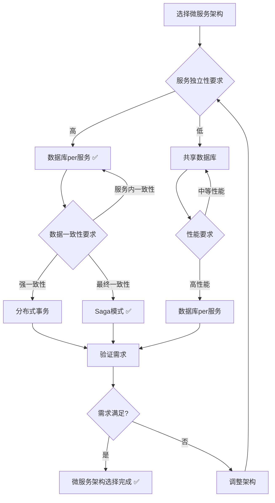
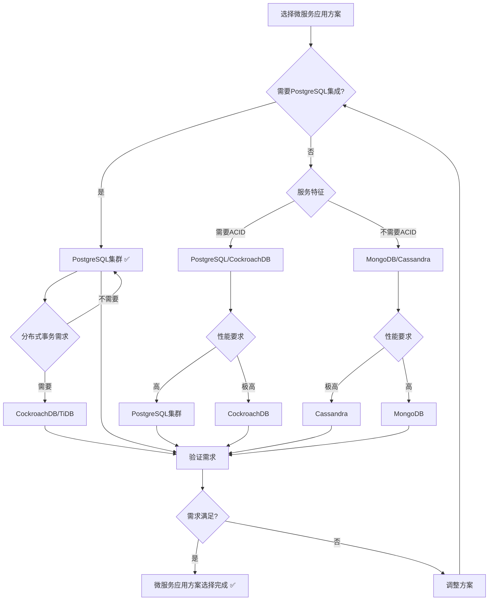

# PostgreSQL扩展：微服务应用场景形式化理论分析

> **创建日期**：2025-01-15
> **最后更新**：2025-01-15
> **版本**：v1.0
> **状态**：进行中

---

## 📋 目录

- [PostgreSQL扩展：微服务应用场景形式化理论分析](#postgresql扩展微服务应用场景形式化理论分析)
  - [📋 目录](#-目录)
  - [1. 概述](#1-概述)
    - [1.1. 微服务应用简介](#11-微服务应用简介)
    - [1.2. 微服务应用的重要性](#12-微服务应用的重要性)
    - [1.3. PostgreSQL在微服务应用中的位置](#13-postgresql在微服务应用中的位置)
  - [2. 微服务应用的形式化定义](#2-微服务应用的形式化定义)
    - [2.1. 微服务模型的形式化定义](#21-微服务模型的形式化定义)
      - [2.1.1. 微服务系统的形式化定义](#211-微服务系统的形式化定义)
      - [2.1.2. 服务的形式化定义](#212-服务的形式化定义)
      - [2.1.3. 服务间通信的形式化定义](#213-服务间通信的形式化定义)
    - [2.2. 数据库per服务的形式化定义](#22-数据库per服务的形式化定义)
      - [2.2.1. 数据库per服务模式的形式化定义](#221-数据库per服务模式的形式化定义)
      - [2.2.2. 服务数据的形式化定义](#222-服务数据的形式化定义)
      - [2.2.3. 数据一致性的形式化定义](#223-数据一致性的形式化定义)
    - [2.3. 分布式事务的形式化定义](#23-分布式事务的形式化定义)
      - [2.3.1. Saga模式的形式化定义](#231-saga模式的形式化定义)
      - [2.3.2. 两阶段提交的形式化定义](#232-两阶段提交的形式化定义)
      - [2.3.3. 最终一致性的形式化定义](#233-最终一致性的形式化定义)
  - [3. 微服务架构的形式化理论](#3-微服务架构的形式化理论)
    - [3.1. 数据库per服务架构的形式化定义](#31-数据库per服务架构的形式化定义)
      - [3.1.1. 服务数据库的形式化定义](#311-服务数据库的形式化定义)
      - [3.1.2. 数据所有权的形式化定义](#312-数据所有权的形式化定义)
      - [3.1.3. 服务独立性的形式化定义](#313-服务独立性的形式化定义)
    - [3.2. 分布式事务架构的形式化定义](#32-分布式事务架构的形式化定义)
      - [3.2.1. Saga模式的形式化定义](#321-saga模式的形式化定义)
      - [3.2.2. 补偿事务的形式化定义](#322-补偿事务的形式化定义)
    - [3.3. 微服务架构对比矩阵](#33-微服务架构对比矩阵)
    - [3.4. 微服务架构选择决策树](#34-微服务架构选择决策树)
  - [4. PostgreSQL微服务应用方案与其他方案的对比](#4-postgresql微服务应用方案与其他方案的对比)
    - [4.1. 功能对比矩阵](#41-功能对比矩阵)
    - [4.2. 性能对比矩阵](#42-性能对比矩阵)
    - [4.3. PostgreSQL微服务应用方案选择决策树](#43-postgresql微服务应用方案选择决策树)
  - [5. PostgreSQL微服务应用的形式化理论](#5-postgresql微服务应用的形式化理论)
    - [5.1. PostgreSQL数据库per服务的形式化定义](#51-postgresql数据库per服务的形式化定义)
      - [5.1.1. PostgreSQL服务数据库的形式化定义](#511-postgresql服务数据库的形式化定义)
      - [5.1.2. PostgreSQL服务数据库的性质](#512-postgresql服务数据库的性质)
    - [5.2. PostgreSQL分布式事务的形式化定义](#52-postgresql分布式事务的形式化定义)
      - [5.2.1. PostgreSQL两阶段提交的形式化定义](#521-postgresql两阶段提交的形式化定义)
      - [5.2.2. PostgreSQL Saga模式的形式化定义](#522-postgresql-saga模式的形式化定义)
    - [5.3. PostgreSQL Citus集群的形式化定义](#53-postgresql-citus集群的形式化定义)
      - [5.3.1. Citus集群的形式化定义](#531-citus集群的形式化定义)
      - [5.3.2. Citus分片的形式化定义](#532-citus分片的形式化定义)
    - [5.4. PostgreSQL微服务应用的最佳实践](#54-postgresql微服务应用的最佳实践)
      - [5.4.1. 数据库per服务的最佳实践](#541-数据库per服务的最佳实践)
      - [5.4.2. 服务间通信的最佳实践](#542-服务间通信的最佳实践)
      - [5.4.3. 分布式事务的最佳实践](#543-分布式事务的最佳实践)
  - [6. 应用场景的形式化分析](#6-应用场景的形式化分析)
    - [6.1. 微服务系统的形式化定义](#61-微服务系统的形式化定义)
    - [6.2. 服务数据同步的形式化定义](#62-服务数据同步的形式化定义)
    - [6.3. 服务扩展的形式化定义](#63-服务扩展的形式化定义)
    - [6.4. 微服务应用案例](#64-微服务应用案例)
      - [6.4.1. 电商微服务系统](#641-电商微服务系统)
      - [6.4.2. 社交微服务系统](#642-社交微服务系统)
  - [7. PostgreSQL微服务应用的技术实现](#7-postgresql微服务应用的技术实现)
    - [7.1. PostgreSQL数据库per服务的实现](#71-postgresql数据库per服务的实现)
      - [7.1.1. 服务数据库创建](#711-服务数据库创建)
      - [7.1.2. 服务数据库Schema设计](#712-服务数据库schema设计)
    - [7.2. PostgreSQL分布式事务的实现](#72-postgresql分布式事务的实现)
      - [7.2.1. Saga模式的实现](#721-saga模式的实现)
      - [7.2.2. Saga执行函数](#722-saga执行函数)
    - [7.3. PostgreSQL Citus集群的实现](#73-postgresql-citus集群的实现)
      - [7.3.1. Citus集群配置](#731-citus集群配置)
      - [7.3.2. 分布式表创建](#732-分布式表创建)
  - [8. 参考资料](#8-参考资料)
    - [8.1. 经典文献](#81-经典文献)
    - [8.2. 相关资源](#82-相关资源)

---

## 1. 概述

### 1.1. 微服务应用简介

微服务应用是现代分布式系统的架构模式，提供：

- **服务独立性**：每个服务独立开发和部署
- **数据库per服务**：每个服务使用独立数据库
- **分布式事务**：跨服务的事务处理
- **服务通信**：服务间通过API通信

### 1.2. 微服务应用的重要性

微服务应用在现代系统中至关重要：

1. **可扩展性**：独立扩展各个服务
2. **技术多样性**：不同服务可以使用不同技术栈
3. **故障隔离**：服务故障不影响其他服务
4. **团队自治**：团队可以独立开发和部署

### 1.3. PostgreSQL在微服务应用中的位置

PostgreSQL在微服务应用中提供：

- **服务数据库**：每个服务使用独立PostgreSQL实例
- **分布式事务**：支持分布式事务处理
- **数据复制**：支持服务间数据复制
- **ACID保证**：保证服务内数据一致性

---

## 2. 微服务应用的形式化定义

### 2.1. 微服务模型的形式化定义

#### 2.1.1. 微服务系统的形式化定义

**定义2.1.1（微服务系统）**：

微服务系统 MicroserviceSystem 是一个三元组 (Services, Databases, Communication)，其中：

- **Services**：服务集合，Services = {S₁, S₂, ..., Sₙ}
- **Databases**：数据库集合，Databases = {DB₁, DB₂, ..., DBₙ}
- **Communication**：服务间通信协议

**形式化表示**：

```text
MicroserviceSystem = (Services, Databases, Communication)
其中：
  Services = {S₁, S₂, ..., Sₙ}
  Databases = {DB₁, DB₂, ..., DBₙ}
  Communication: Service × Service → Protocol
```

**微服务系统的性质**：

**性质2.1.1（微服务系统的独立性）**：

每个服务独立开发和部署。

**形式化**：

```text
独立性 ⟺
  ∀Serviceᵢ ∈ Services.
    Serviceᵢ独立开发 ∧
    Serviceᵢ独立部署
```

#### 2.1.2. 服务的形式化定义

**定义2.1.2（服务）**：

服务 Service 是一个三元组 (service_id, database, api)，其中：

- **service_id**：服务标识符
- **database**：服务数据库
- **api**：服务API接口

**形式化表示**：

```text
Service = (service_id, database, api)
其中：
  service_id ∈ ServiceID
  database: Database
  api: APIInterface
```

#### 2.1.3. 服务间通信的形式化定义

**定义2.1.3（服务间通信）**：

服务间通信 InterServiceCommunication 通过API调用：

```text
服务间通信(Service₁, Service₂, request) =
    Service₂.api(Service₁.request)
```

### 2.2. 数据库per服务的形式化定义

#### 2.2.1. 数据库per服务模式的形式化定义

**定义2.2.1（数据库per服务）**：

数据库per服务 DatabasePerService 要求每个服务使用独立数据库：

```text
数据库per服务 ⟺
  ∀Serviceᵢ ∈ Services.
    ∃!DBᵢ ∈ Databases.
      Serviceᵢ使用DBᵢ
```

**数据库per服务的性质**：

**性质2.2.1（数据库per服务的独立性）**：

每个服务的数据库独立，互不干扰。

**形式化**：

```text
独立性 ⟺
  ∀Serviceᵢ, Serviceⱼ ∈ Services, i ≠ j.
    DBᵢ ∩ DBⱼ = ∅
```

#### 2.2.2. 服务数据的形式化定义

**定义2.2.2（服务数据）**：

服务数据 ServiceData 是服务拥有的数据：

```text
ServiceData(Service) = {
    data | data ∈ Database(Service)
}
```

#### 2.2.3. 数据一致性的形式化定义

**定义2.2.3（数据一致性）**：

数据一致性 DataConsistency 要求服务内数据一致：

```text
数据一致性 ⟺
  ∀Serviceᵢ ∈ Services.
    一致性约束(DBᵢ) 满足
```

### 2.3. 分布式事务的形式化定义

#### 2.3.1. Saga模式的形式化定义

**定义2.3.1（Saga模式）**：

Saga模式 SagaPattern 是分布式事务的一种模式：

```text
Saga = (Steps, CompensationSteps)
其中：
  Steps = {Step₁, Step₂, ..., Stepₙ}
  CompensationSteps = {Compensation₁, Compensation₂, ..., Compensationₙ}
```

**Saga执行的形式化定义**：

**定义2.3.2（Saga执行）**：

Saga执行按顺序执行步骤，如果失败则执行补偿：

```text
Saga执行 =
    for step in Steps:
        if step执行失败:
            for compensation in 已执行步骤的补偿:
                compensation执行()
            return 失败
    return 成功
```

#### 2.3.2. 两阶段提交的形式化定义

**定义2.3.3（两阶段提交）**：

两阶段提交 TwoPhaseCommit 是分布式事务的另一种模式：

```text
两阶段提交 = {
    Phase1: Prepare,
    Phase2: Commit | Abort
}
```

**两阶段提交的形式化定义**：

**定义2.3.4（两阶段提交过程）**：

两阶段提交过程包括：

1. **Prepare阶段**：所有参与者准备提交
2. **Commit阶段**：如果所有参与者准备成功，则提交；否则回滚

#### 2.3.3. 最终一致性的形式化定义

**定义2.3.5（最终一致性）**：

最终一致性 EventualConsistency 要求系统最终达到一致状态：

```text
最终一致性 ⟺
  ∃时间t.
    ∀时间t' > t.
      系统状态一致
```

---

## 3. 微服务架构的形式化理论

### 3.1. 数据库per服务架构的形式化定义

#### 3.1.1. 服务数据库的形式化定义

**定义3.1.1（服务数据库）**：

服务数据库 ServiceDatabase 是服务专用的数据库：

```text
ServiceDatabase(Service) = {
    DB | DB ∈ Databases,
        DB专属于Service
}
```

#### 3.1.2. 数据所有权的形式化定义

**定义3.1.2（数据所有权）**：

数据所有权 DataOwnership 定义服务对数据的所有权：

```text
数据所有权(data) =
    Service | data ∈ Database(Service)
```

#### 3.1.3. 服务独立性的形式化定义

**定义3.1.3（服务独立性）**：

服务独立性 ServiceIndependence 要求服务可以独立运行：

```text
服务独立性 ⟺
  ∀Serviceᵢ ∈ Services.
    Serviceᵢ可以独立运行
```

### 3.2. 分布式事务架构的形式化定义

#### 3.2.1. Saga模式的形式化定义

**定义3.2.1（Saga模式架构）**：

Saga模式架构 SagaArchitecture 管理分布式事务：

```text
SagaArchitecture = (Orchestrator, Services, CompensationLogic)
其中：
  Orchestrator: 协调器
  Services: 参与服务集合
  CompensationLogic: 补偿逻辑
```

#### 3.2.2. 补偿事务的形式化定义

**定义3.2.2（补偿事务）**：

补偿事务 CompensationTransaction 撤销已执行的操作：

```text
补偿事务(Step) =
    撤销(Step的操作)
```

### 3.3. 微服务架构对比矩阵

| 架构模式 | 服务独立性 | 数据一致性 | 复杂度 | 性能 | 适用场景 |
|---------|-----------|-----------|--------|------|---------|
| **数据库per服务** | ⭐⭐⭐⭐⭐ | ⭐⭐⭐ | ⭐⭐⭐ | ⭐⭐⭐⭐⭐ | 微服务系统 |
| **共享数据库** | ⭐⭐ | ⭐⭐⭐⭐⭐ | ⭐⭐⭐⭐⭐ | ⭐⭐⭐⭐ | 单体应用 |
| **分布式事务** | ⭐⭐⭐⭐ | ⭐⭐⭐⭐⭐ | ⭐⭐ | ⭐⭐⭐ | 强一致性需求 |

### 3.4. 微服务架构选择决策树



---

## 4. PostgreSQL微服务应用方案与其他方案的对比

### 4.1. 功能对比矩阵

| 功能 | PostgreSQL集群 | MongoDB | Cassandra | CockroachDB | TiDB |
|------|---------------|---------|-----------|-------------|------|
| **数据库per服务** | ✅ | ✅ | ✅ | ✅ | ✅ |
| **ACID事务** | ✅ | ⚠️ | ❌ | ✅ | ✅ |
| **分布式事务** | ⚠️ | ❌ | ❌ | ✅ | ✅ |
| **SQL支持** | ✅ | ❌ | ❌ | ✅ | ✅ |
| **PostgreSQL兼容** | ✅ | ❌ | ❌ | ⚠️ | ⚠️ |

### 4.2. 性能对比矩阵

| 性能指标 | PostgreSQL集群 | MongoDB | Cassandra | CockroachDB | TiDB |
|---------|---------------|---------|-----------|-------------|------|
| **服务独立性** | ⭐⭐⭐⭐⭐ | ⭐⭐⭐⭐⭐ | ⭐⭐⭐⭐⭐ | ⭐⭐⭐⭐ | ⭐⭐⭐⭐ |
| **数据一致性** | ⭐⭐⭐⭐⭐ | ⭐⭐⭐ | ⭐⭐ | ⭐⭐⭐⭐⭐ | ⭐⭐⭐⭐⭐ |
| **分布式事务** | ⭐⭐⭐ | ⭐⭐ | ⭐ | ⭐⭐⭐⭐⭐ | ⭐⭐⭐⭐⭐ |
| **PostgreSQL兼容** | ⭐⭐⭐⭐⭐ | ⭐ | ⭐ | ⭐⭐⭐ | ⭐⭐⭐ |

### 4.3. PostgreSQL微服务应用方案选择决策树



---

## 5. PostgreSQL微服务应用的形式化理论

### 5.1. PostgreSQL数据库per服务的形式化定义

#### 5.1.1. PostgreSQL服务数据库的形式化定义

**定义5.1.1（PostgreSQL服务数据库）**：

PostgreSQL服务数据库 PostgreSQLServiceDatabase 是服务专用的PostgreSQL数据库：

```text
PostgreSQLServiceDatabase(Service) = {
    PostgreSQLDB | PostgreSQLDB ∈ Databases,
        PostgreSQLDB专属于Service,
        PostgreSQLDB独立部署
}
```

#### 5.1.2. PostgreSQL服务数据库的性质

**性质5.1.1（PostgreSQL服务数据库的独立性）**：

每个服务的PostgreSQL数据库独立，互不干扰。

**形式化**：

```text
独立性 ⟺
  ∀Serviceᵢ, Serviceⱼ ∈ Services, i ≠ j.
    PostgreSQLDBᵢ ∩ PostgreSQLDBⱼ = ∅ ∧
    PostgreSQLDBᵢ独立部署 ∧
    PostgreSQLDBⱼ独立部署
```

### 5.2. PostgreSQL分布式事务的形式化定义

#### 5.2.1. PostgreSQL两阶段提交的形式化定义

**定义5.2.1（PostgreSQL两阶段提交）**：

PostgreSQL两阶段提交 PostgreSQLTwoPhaseCommit 是PostgreSQL分布式事务的模式：

```text
PostgreSQL两阶段提交 = {
    Phase1: PREPARE TRANSACTION,
    Phase2: COMMIT PREPARED | ROLLBACK PREPARED
}
```

#### 5.2.2. PostgreSQL Saga模式的形式化定义

**定义5.2.2（PostgreSQL Saga模式）**：

PostgreSQL Saga模式 PostgreSQLSagaPattern 使用PostgreSQL管理Saga：

```text
PostgreSQLSagaPattern = (SagaTable, StepTable, CompensationLogic)
其中：
  SagaTable: PostgreSQL表存储Saga实例
  StepTable: PostgreSQL表存储Saga步骤
  CompensationLogic: 补偿逻辑
```

### 5.3. PostgreSQL Citus集群的形式化定义

#### 5.3.1. Citus集群的形式化定义

**定义5.3.1（Citus集群）**：

Citus集群 CitusCluster 是一个三元组 (Coordinator, Workers, Sharding)，其中：

- **Coordinator**：协调节点
- **Workers**：工作节点集合
- **Sharding**：分片策略

**形式化表示**：

```text
CitusCluster = (Coordinator, Workers, Sharding)
其中：
  Coordinator: PostgreSQLCoordinatorNode
  Workers = {Worker₁, Worker₂, ..., Workerₙ}
  Sharding: ShardingStrategy
```

#### 5.3.2. Citus分片的形式化定义

**定义5.3.2（Citus分片）**：

Citus分片 CitusShard 将数据分布到多个工作节点：

```text
CitusShard(table, shard_key) = {
    Shard₁ → Worker₁,
    Shard₂ → Worker₂,
    ...,
    Shardₙ → Workerₙ
}
```

### 5.4. PostgreSQL微服务应用的最佳实践

#### 5.4.1. 数据库per服务的最佳实践

**实践5.4.1（数据库per服务）**：

每个微服务使用独立的PostgreSQL数据库：

```sql
-- 用户服务数据库
CREATE DATABASE user_service_db;

-- 订单服务数据库
CREATE DATABASE order_service_db;

-- 商品服务数据库
CREATE DATABASE product_service_db;
```

#### 5.4.2. 服务间通信的最佳实践

**实践5.4.2（服务间通信）**：

服务间通过API通信，不直接访问其他服务的数据库：

```text
服务间通信 ⟺
  ∀Serviceᵢ, Serviceⱼ ∈ Services, i ≠ j.
    Serviceᵢ不直接访问Database(Serviceⱼ) ∧
    Serviceᵢ通过API访问Serviceⱼ
```

#### 5.4.3. 分布式事务的最佳实践

**实践5.4.3（分布式事务）**：

使用Saga模式处理分布式事务：

```sql
-- Saga实例表
CREATE TABLE saga_instances (
    saga_id UUID PRIMARY KEY,
    saga_type VARCHAR(100) NOT NULL,
    status VARCHAR(20) NOT NULL,
    payload JSONB NOT NULL,
    created_at TIMESTAMPTZ NOT NULL DEFAULT CURRENT_TIMESTAMP
);

-- Saga步骤表
CREATE TABLE saga_steps (
    step_id BIGSERIAL PRIMARY KEY,
    saga_id UUID NOT NULL REFERENCES saga_instances(saga_id),
    step_order INTEGER NOT NULL,
    service_name VARCHAR(100) NOT NULL,
    status VARCHAR(20) NOT NULL,
    request_payload JSONB,
    response_payload JSONB
);
```

## 6. 应用场景的形式化分析

### 6.1. 微服务系统的形式化定义

**定义6.1.1（微服务系统架构）**：

微服务系统架构 MicroserviceArchitecture 是一个四元组 (Services, Databases, Communication, Transaction)，其中：

- **Services**：服务集合
- **Databases**：数据库集合（数据库per服务）
- **Communication**：服务间通信
- **Transaction**：分布式事务处理

**形式化表示**：

```text
MicroserviceArchitecture = (Services, Databases, Communication, Transaction)
其中：
  Services = {S₁, S₂, ..., Sₙ}
  Databases = {DB₁, DB₂, ..., DBₙ}
  Communication: Service × Service → Protocol
  Transaction: DistributedTransactionHandler
```

### 6.2. 服务数据同步的形式化定义

**定义6.2.1（服务数据同步）**：

服务数据同步 ServiceDataSync 同步服务间的数据：

```text
服务数据同步(Service₁, Service₂, data) =
    复制(data, Database(Service₁)) → Database(Service₂)
```

### 6.3. 服务扩展的形式化定义

**定义6.3.1（服务扩展）**：

服务扩展 ServiceScaling 扩展服务的容量：

```text
服务扩展(Service, scale_factor) =
    复制(Service, scale_factor)
```

### 6.4. 微服务应用案例

#### 6.4.1. 电商微服务系统

**案例6.4.1（电商微服务系统）**：

电商微服务系统包括：

- **用户服务**：用户管理，使用PostgreSQL数据库
- **商品服务**：商品管理，使用PostgreSQL数据库
- **订单服务**：订单处理，使用PostgreSQL数据库
- **支付服务**：支付处理，使用PostgreSQL数据库

**架构设计**：

```text
用户服务 → PostgreSQL用户数据库
商品服务 → PostgreSQL商品数据库
订单服务 → PostgreSQL订单数据库
支付服务 → PostgreSQL支付数据库
```

#### 6.4.2. 社交微服务系统

**案例6.4.2（社交微服务系统）**：

社交微服务系统包括：

- **用户服务**：用户管理，使用PostgreSQL数据库
- **内容服务**：内容管理，使用PostgreSQL数据库
- **关系服务**：关系管理，使用PostgreSQL数据库
- **消息服务**：消息处理，使用PostgreSQL数据库

**架构设计**：

```text
用户服务 → PostgreSQL用户数据库
内容服务 → PostgreSQL内容数据库
关系服务 → PostgreSQL关系数据库
消息服务 → PostgreSQL消息数据库
```

---

## 7. PostgreSQL微服务应用的技术实现

### 7.1. PostgreSQL数据库per服务的实现

#### 7.1.1. 服务数据库创建

```sql
-- 创建用户服务数据库
CREATE DATABASE user_service_db;

-- 创建订单服务数据库
CREATE DATABASE order_service_db;

-- 创建商品服务数据库
CREATE DATABASE product_service_db;
```

#### 7.1.2. 服务数据库Schema设计

```sql
-- 用户服务数据库Schema
\c user_service_db;

CREATE SCHEMA user_service;

CREATE TABLE user_service.users (
    user_id BIGSERIAL PRIMARY KEY,
    username VARCHAR(50) NOT NULL UNIQUE,
    email VARCHAR(100) NOT NULL UNIQUE,
    password_hash TEXT NOT NULL,
    profile_data JSONB,
    created_at TIMESTAMPTZ NOT NULL DEFAULT CURRENT_TIMESTAMP,
    updated_at TIMESTAMPTZ NOT NULL DEFAULT CURRENT_TIMESTAMP
);

CREATE INDEX idx_users_email ON user_service.users(email);
CREATE INDEX idx_users_username ON user_service.users(username);

-- 订单服务数据库Schema
\c order_service_db;

CREATE SCHEMA order_service;

CREATE TABLE order_service.orders (
    order_id BIGSERIAL PRIMARY KEY,
    user_id BIGINT NOT NULL,  -- 引用用户服务，但不使用外键
    order_number VARCHAR(50) NOT NULL UNIQUE,
    order_status VARCHAR(20) NOT NULL,
    total_amount DECIMAL(10,2) NOT NULL,
    created_at TIMESTAMPTZ NOT NULL DEFAULT CURRENT_TIMESTAMP
);

CREATE INDEX idx_orders_user_id ON order_service.orders(user_id);
CREATE INDEX idx_orders_status ON order_service.orders(order_status);
```

### 7.2. PostgreSQL分布式事务的实现

#### 7.2.1. Saga模式的实现

```sql
-- Saga实例表
CREATE SCHEMA saga_pattern;

CREATE TABLE saga_pattern.saga_instances (
    saga_id UUID PRIMARY KEY DEFAULT gen_random_uuid(),
    saga_type VARCHAR(100) NOT NULL,
    status VARCHAR(20) NOT NULL CHECK (status IN ('pending', 'executing', 'completed', 'compensating', 'failed')),
    current_step INTEGER DEFAULT 0,
    total_steps INTEGER NOT NULL,
    payload JSONB NOT NULL,
    result JSONB,
    error_message TEXT,
    created_at TIMESTAMPTZ NOT NULL DEFAULT CURRENT_TIMESTAMP,
    updated_at TIMESTAMPTZ NOT NULL DEFAULT CURRENT_TIMESTAMP
);

CREATE INDEX idx_saga_instances_status ON saga_pattern.saga_instances(status, created_at DESC);

-- Saga步骤表
CREATE TABLE saga_pattern.saga_steps (
    step_id BIGSERIAL PRIMARY KEY,
    saga_id UUID NOT NULL REFERENCES saga_pattern.saga_instances(saga_id) ON DELETE CASCADE,
    step_order INTEGER NOT NULL,
    step_name VARCHAR(100) NOT NULL,
    service_name VARCHAR(100) NOT NULL,
    action_type VARCHAR(20) NOT NULL CHECK (action_type IN ('action', 'compensation')),
    status VARCHAR(20) NOT NULL CHECK (status IN ('pending', 'executing', 'completed', 'failed', 'compensated')),
    request_payload JSONB,
    response_payload JSONB,
    error_message TEXT,
    executed_at TIMESTAMPTZ,
    completed_at TIMESTAMPTZ,
    UNIQUE(saga_id, step_order, action_type)
);

CREATE INDEX idx_saga_steps_saga ON saga_pattern.saga_steps(saga_id, step_order);
```

#### 7.2.2. Saga执行函数

```sql
-- Saga执行函数
CREATE OR REPLACE FUNCTION execute_saga_step(
    p_saga_id UUID,
    p_step_order INTEGER,
    p_service_name VARCHAR,
    p_action_payload JSONB
)
RETURNS JSONB AS $$
DECLARE
    v_step_id BIGINT;
    v_result JSONB;
BEGIN
    -- 记录步骤开始
    INSERT INTO saga_pattern.saga_steps (
        saga_id, step_order, step_name, service_name,
        action_type, status, request_payload, executed_at
    )
    VALUES (
        p_saga_id, p_step_order, 'step_' || p_step_order, p_service_name,
        'action', 'executing', p_action_payload, CURRENT_TIMESTAMP
    )
    RETURNING step_id INTO v_step_id;

    -- 这里应该调用实际的服务API
    -- 简化示例：假设调用成功
    v_result := '{"success": true}'::JSONB;

    -- 更新步骤状态
    UPDATE saga_pattern.saga_steps
    SET status = 'completed',
        response_payload = v_result,
        completed_at = CURRENT_TIMESTAMP
    WHERE step_id = v_step_id;

    -- 更新Saga状态
    UPDATE saga_pattern.saga_instances
    SET current_step = p_step_order,
        status = CASE
            WHEN p_step_order >= total_steps THEN 'completed'
            ELSE 'executing'
        END,
        updated_at = CURRENT_TIMESTAMP
    WHERE saga_id = p_saga_id;

    RETURN v_result;
EXCEPTION
    WHEN OTHERS THEN
        -- 步骤失败，标记为失败
        UPDATE saga_pattern.saga_steps
        SET status = 'failed',
            error_message = SQLERRM,
            completed_at = CURRENT_TIMESTAMP
        WHERE step_id = v_step_id;

        -- 触发补偿
        PERFORM compensate_saga(p_saga_id);

        RAISE;
END;
$$ LANGUAGE plpgsql;
```

### 7.3. PostgreSQL Citus集群的实现

#### 7.3.1. Citus集群配置

```sql
-- 安装Citus扩展
CREATE EXTENSION citus;

-- 添加工作节点
SELECT citus_add_node('worker1_host', 5432);
SELECT citus_add_node('worker2_host', 5432);
SELECT citus_add_node('worker3_host', 5432);

-- 查看节点信息
SELECT * FROM citus_get_active_worker_nodes();
```

#### 7.3.2. 分布式表创建

```sql
-- 创建分布式表
CREATE TABLE users (
    id BIGSERIAL PRIMARY KEY,
    name TEXT,
    email TEXT,
    created_at TIMESTAMPTZ DEFAULT NOW()
);

-- 按id分片
SELECT create_distributed_table('users', 'id');

-- 创建参考表（复制到所有节点）
CREATE TABLE countries (
    id SERIAL PRIMARY KEY,
    name TEXT,
    code TEXT
);

SELECT create_reference_table('countries');
```

## 8. 参考资料

### 8.1. 经典文献

- "Microservices Patterns" (Richardson, 2018)
- "Building Microservices" (Newman, 2015)
- "Database per Service Pattern" (Martin Fowler)
- "PostgreSQL: Up and Running" (Obe & Hsu, 2017)

### 8.2. 相关资源

- [微服务架构模式](https://microservices.io/patterns/)
- [数据库per服务](https://microservices.io/patterns/data/database-per-service.html)
- [分布式事务](https://microservices.io/patterns/data/distributed-transactions.html)
- [PostgreSQL Citus文档](https://docs.citusdata.com/)
- [PostgreSQL分布式事务](https://www.postgresql.org/docs/current/sql-prepare-transaction.html)

---

**最后更新**：2025-01-15
**维护者**：Data-Science Team
**状态**：进行中
