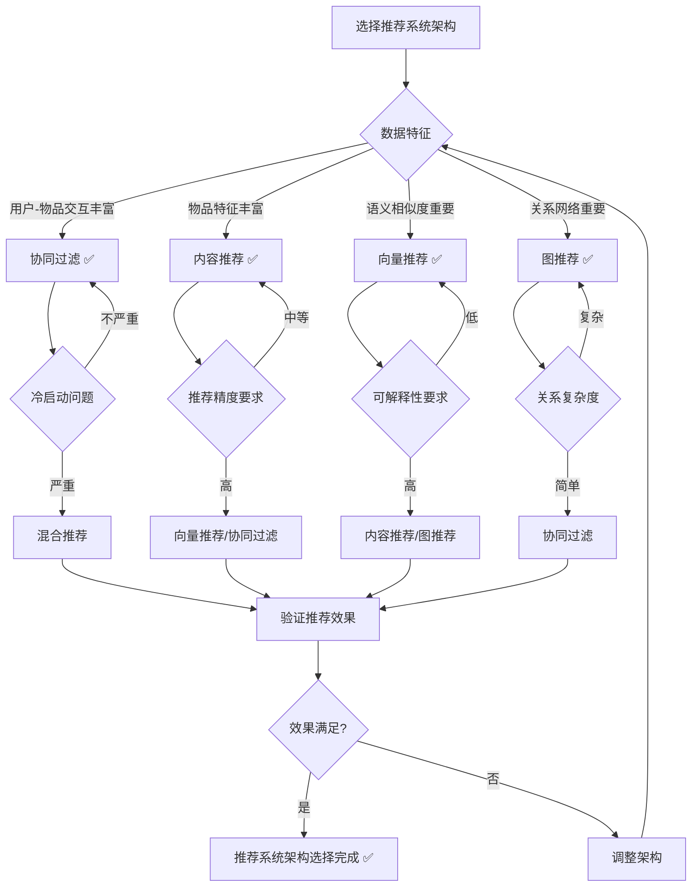
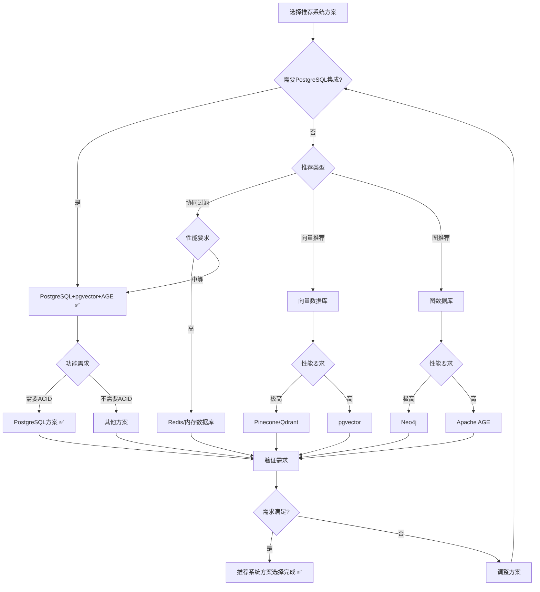

# PostgreSQL扩展：推荐系统应用场景形式化理论分析

> **创建日期**：2025-01-15
> **最后更新**：2025-01-15
> **版本**：v1.0
> **状态**：进行中

---

## 📋 目录

- [PostgreSQL扩展：推荐系统应用场景形式化理论分析](#postgresql扩展推荐系统应用场景形式化理论分析)
  - [📋 目录](#-目录)
  - [1. 概述](#1-概述)
    - [1.1. 推荐系统简介](#11-推荐系统简介)
    - [1.2. 推荐系统的重要性](#12-推荐系统的重要性)
    - [1.3. PostgreSQL在推荐系统中的应用](#13-postgresql在推荐系统中的应用)
  - [2. 推荐系统的形式化定义](#2-推荐系统的形式化定义)
    - [2.1. 推荐系统模型的形式化定义](#21-推荐系统模型的形式化定义)
      - [2.1.1. 推荐系统的形式化定义](#211-推荐系统的形式化定义)
      - [2.1.2. 用户-物品交互的形式化定义](#212-用户-物品交互的形式化定义)
      - [2.1.3. 推荐算法的形式化定义](#213-推荐算法的形式化定义)
    - [2.2. 协同过滤的形式化定义](#22-协同过滤的形式化定义)
      - [2.2.1. 用户协同过滤的形式化定义](#221-用户协同过滤的形式化定义)
      - [2.2.2. 物品协同过滤的形式化定义](#222-物品协同过滤的形式化定义)
      - [2.2.3. 矩阵分解的形式化定义](#223-矩阵分解的形式化定义)
    - [2.3. 内容推荐的形式化定义](#23-内容推荐的形式化定义)
      - [2.3.1. 内容特征的形式化定义](#231-内容特征的形式化定义)
      - [2.3.2. 向量推荐的形式化定义](#232-向量推荐的形式化定义)
      - [2.3.3. 混合推荐的形式化定义](#233-混合推荐的形式化定义)
  - [3. 推荐系统架构的形式化理论](#3-推荐系统架构的形式化理论)
    - [3.1. 协同过滤架构的形式化定义](#31-协同过滤架构的形式化定义)
      - [3.1.1. 用户相似度的形式化定义](#311-用户相似度的形式化定义)
      - [3.1.2. 物品相似度的形式化定义](#312-物品相似度的形式化定义)
      - [3.1.3. 推荐生成的形式化定义](#313-推荐生成的形式化定义)
    - [3.2. 向量推荐架构的形式化定义](#32-向量推荐架构的形式化定义)
      - [3.2.1. 用户向量的形式化定义](#321-用户向量的形式化定义)
      - [3.2.2. 物品向量的形式化定义](#322-物品向量的形式化定义)
      - [3.2.3. 向量相似度推荐的形式化定义](#323-向量相似度推荐的形式化定义)
    - [3.3. 图推荐架构的形式化定义](#33-图推荐架构的形式化定义)
      - [3.3.1. 用户-物品图的形式化定义](#331-用户-物品图的形式化定义)
      - [3.3.2. 图路径推荐的形式化定义](#332-图路径推荐的形式化定义)
      - [3.3.3. 图算法推荐的形式化定义](#333-图算法推荐的形式化定义)
    - [3.4. 推荐系统架构对比矩阵](#34-推荐系统架构对比矩阵)
    - [3.5. 推荐系统架构选择决策树](#35-推荐系统架构选择决策树)
  - [4. PostgreSQL推荐系统方案与其他方案的对比](#4-postgresql推荐系统方案与其他方案的对比)
    - [4.1. 功能对比矩阵](#41-功能对比矩阵)
    - [4.2. 性能对比矩阵](#42-性能对比矩阵)
    - [4.3. PostgreSQL推荐系统方案选择决策树](#43-postgresql推荐系统方案选择决策树)
  - [5. 应用场景的形式化分析](#5-应用场景的形式化分析)
    - [5.1. 电商推荐的形式化定义](#51-电商推荐的形式化定义)
    - [5.2. 内容推荐的形式化定义](#52-内容推荐的形式化定义)
    - [5.3. 社交推荐的形式化定义](#53-社交推荐的形式化定义)
  - [6. 参考资料](#6-参考资料)
    - [6.1. 经典文献](#61-经典文献)
    - [6.2. 相关资源](#62-相关资源)

---

## 1. 概述

### 1.1. 推荐系统简介

推荐系统是现代应用的核心组件，提供：

- **协同过滤**：基于用户-物品交互的推荐
- **内容推荐**：基于物品特征的推荐
- **向量推荐**：基于向量相似度的推荐
- **图推荐**：基于图结构的推荐

### 1.2. 推荐系统的重要性

推荐系统在现代应用中至关重要：

1. **个性化体验**：为用户提供个性化推荐
2. **业务增长**：提升用户参与度和转化率
3. **内容发现**：帮助用户发现新内容
4. **用户留存**：提升用户满意度和留存率

### 1.3. PostgreSQL在推荐系统中的应用

PostgreSQL通过多模型扩展支持推荐系统：

- **关系模型**：存储用户-物品交互数据
- **向量模型**：pgvector支持向量推荐
- **图模型**：Apache AGE支持图推荐
- **文档模型**：JSONB支持灵活的特征存储

---

## 2. 推荐系统的形式化定义

### 2.1. 推荐系统模型的形式化定义

#### 2.1.1. 推荐系统的形式化定义

**定义2.1.1（推荐系统）**：

推荐系统 RecommenderSystem 是一个三元组 (Users, Items, Recommender)，其中：

- **Users**：用户集合，Users = {u₁, u₂, ..., uₙ}
- **Items**：物品集合，Items = {i₁, i₂, ..., iₘ}
- **Recommender**：推荐函数，Recommender: User → Items

**形式化表示**：

```text
RecommenderSystem = (Users, Items, Recommender)
其中：
  Users = {u₁, u₂, ..., uₙ}
  Items = {i₁, i₂, ..., iₘ}
  Recommender: User → Items
```

**推荐系统的性质**：

**性质2.1.1（推荐的个性化性）**：

推荐系统为每个用户提供个性化推荐。

**形式化**：

```text
个性化性 ⟺
  ∀u₁, u₂ ∈ Users, u₁ ≠ u₂.
    Recommender(u₁) ≠ Recommender(u₂)
```

#### 2.1.2. 用户-物品交互的形式化定义

**定义2.1.2（用户-物品交互）**：

用户-物品交互 Interaction 是一个三元组 (user_id, item_id, rating)，其中：

- **user_id**：用户标识符
- **item_id**：物品标识符
- **rating**：评分（可选）

**形式化表示**：

```text
Interaction = (user_id, item_id, rating)
其中：
  user_id ∈ UserID
  item_id ∈ ItemID
  rating ∈ RatingDomain
```

**交互矩阵的形式化定义**：

**定义2.1.3（交互矩阵）**：

交互矩阵 InteractionMatrix 是一个矩阵：

```text
R = [rᵢⱼ]_{n×m}
其中：
  rᵢⱼ = rating(userᵢ, itemⱼ)  （如果存在交互）
  rᵢⱼ = NULL  （如果不存在交互）
```

#### 2.1.3. 推荐算法的形式化定义

**定义2.1.4（推荐算法）**：

推荐算法 RecommendationAlgorithm 是一个函数：

```text
推荐算法(user, k) = {
    item | item ∈ Items,
    score(user, item) > threshold,
    rank(score(user, item)) ≤ k
}
```

**推荐算法的性质**：

**性质2.1.2（推荐的多样性）**：

推荐系统应该提供多样化的推荐。

**形式化**：

```text
多样性 ⟺
  ∀推荐结果R.
    多样性(R) > 阈值
```

### 2.2. 协同过滤的形式化定义

#### 2.2.1. 用户协同过滤的形式化定义

**定义2.2.1（用户协同过滤）**：

用户协同过滤 UserBasedCF 基于相似用户的偏好推荐：

```text
用户协同过滤(user, item) =
    Σ_{相似用户v} similarity(user, v) · rating(v, item)
```

**用户相似度的形式化定义**：

**定义2.2.2（用户相似度）**：

用户相似度 UserSimilarity 使用余弦相似度或皮尔逊相关系数：

```text
用户相似度(u₁, u₂) =
    cos(rating_vector(u₁), rating_vector(u₂))
```

#### 2.2.2. 物品协同过滤的形式化定义

**定义2.2.3（物品协同过滤）**：

物品协同过滤 ItemBasedCF 基于相似物品的评分推荐：

```text
物品协同过滤(user, item) =
    Σ_{相似物品j} similarity(item, j) · rating(user, j)
```

**物品相似度的形式化定义**：

**定义2.2.4（物品相似度）**：

物品相似度 ItemSimilarity 使用余弦相似度：

```text
物品相似度(i₁, i₂) =
    cos(rating_vector(i₁), rating_vector(i₂))
```

#### 2.2.3. 矩阵分解的形式化定义

**定义2.2.5（矩阵分解）**：

矩阵分解 MatrixFactorization 将交互矩阵分解为低维矩阵：

```text
R ≈ U · Vᵀ
其中：
  U: n×k  （用户特征矩阵）
  V: m×k  （物品特征矩阵）
  k: 特征维度
```

**矩阵分解的性质**：

**性质2.2.1（矩阵分解的近似性）**：

矩阵分解提供交互矩阵的低维近似。

**形式化**：

```text
近似性 ⟺
  ||R - U · Vᵀ||_F < ε
```

### 2.3. 内容推荐的形式化定义

#### 2.3.1. 内容特征的形式化定义

**定义2.3.1（内容特征）**：

内容特征 ContentFeature 是物品的特征向量：

```text
ContentFeature(item) = (f₁, f₂, ..., fₖ)
其中：
  fᵢ ∈ FeatureDomain
```

#### 2.3.2. 向量推荐的形式化定义

**定义2.3.2（向量推荐）**：

向量推荐 VectorRecommendation 使用向量相似度：

```text
向量推荐(user, k) = {
    item | item ∈ Items,
    similarity(user_vector, item_vector) > threshold,
    rank(similarity(user_vector, item_vector)) ≤ k
}
```

**用户向量的形式化定义**：

**定义2.3.3（用户向量）**：

用户向量 UserVector 是用户偏好的向量表示：

```text
UserVector(user) =
    aggregate({item_vector | item ∈ 用户交互的物品})
```

#### 2.3.3. 混合推荐的形式化定义

**定义2.3.4（混合推荐）**：

混合推荐 HybridRecommendation 结合多种推荐方法：

```text
混合推荐(user, k) =
    融合(协同过滤(user, k), 内容推荐(user, k))
```

**融合策略的形式化定义**：

**定义2.3.5（融合策略）**：

融合策略包括：

1. **加权融合**：加权合并不同推荐结果
2. **重排序融合**：使用RRF重排序
3. **切换融合**：根据场景切换推荐方法

---

## 3. 推荐系统架构的形式化理论

### 3.1. 协同过滤架构的形式化定义

#### 3.1.1. 用户相似度的形式化定义

**定义3.1.1（用户相似度计算）**：

用户相似度计算 UserSimilarityComputation 使用余弦相似度：

```text
用户相似度(u₁, u₂) =
    (rating_vector(u₁) · rating_vector(u₂)) /
    (||rating_vector(u₁)||₂ · ||rating_vector(u₂)||₂)
```

#### 3.1.2. 物品相似度的形式化定义

**定义3.1.2（物品相似度计算）**：

物品相似度计算 ItemSimilarityComputation 使用余弦相似度：

```text
物品相似度(i₁, i₂) =
    (rating_vector(i₁) · rating_vector(i₂)) /
    (||rating_vector(i₁)||₂ · ||rating_vector(i₂)||₂)
```

#### 3.1.3. 推荐生成的形式化定义

**定义3.1.3（推荐生成）**：

推荐生成 RecommendationGeneration 基于相似度生成推荐：

```text
推荐生成(user, k) = {
    item | item ∈ Items,
    score(user, item) =
        Σ_{相似用户v} similarity(user, v) · rating(v, item),
    rank(score(user, item)) ≤ k
}
```

### 3.2. 向量推荐架构的形式化定义

#### 3.2.1. 用户向量的形式化定义

**定义3.2.1（用户向量）**：

用户向量 UserVector 是用户偏好的向量表示：

```text
UserVector(user) =
    mean({item_vector | item ∈ 用户交互的物品})
```

#### 3.2.2. 物品向量的形式化定义

**定义3.2.2（物品向量）**：

物品向量 ItemVector 是物品特征的向量表示：

```text
ItemVector(item) = embedding(item_features)
```

#### 3.2.3. 向量相似度推荐的形式化定义

**定义3.2.3（向量相似度推荐）**：

向量相似度推荐 VectorSimilarityRecommendation 使用向量相似度：

```text
向量相似度推荐(user, k) = {
    item | item ∈ Items,
    similarity(UserVector(user), ItemVector(item)) > threshold,
    rank(similarity(UserVector(user), ItemVector(item))) ≤ k
}
```

### 3.3. 图推荐架构的形式化定义

#### 3.3.1. 用户-物品图的形式化定义

**定义3.3.1（用户-物品图）**：

用户-物品图 UserItemGraph 是一个二分图：

```text
UserItemGraph = (Users, Items, Edges)
其中：
  Users: 用户节点集合
  Items: 物品节点集合
  Edges: 用户-物品交互边集合
```

#### 3.3.2. 图路径推荐的形式化定义

**定义3.3.2（图路径推荐）**：

图路径推荐 GraphPathRecommendation 使用图路径：

```text
图路径推荐(user, k) = {
    item | item ∈ Items,
    path_exists(user, item, UserItemGraph),
    path_length(user, item) ≤ max_depth,
    rank(path_score(user, item)) ≤ k
}
```

#### 3.3.3. 图算法推荐的形式化定义

**定义3.3.3（图算法推荐）**：

图算法推荐 GraphAlgorithmRecommendation 使用图算法（如PageRank）：

```text
图算法推荐(user, k) = {
    item | item ∈ Items,
    algorithm_score(user, item) > threshold,
    rank(algorithm_score(user, item)) ≤ k
}
```

### 3.4. 推荐系统架构对比矩阵

| 架构模式 | 推荐精度 | 可解释性 | 冷启动 | 复杂度 | 适用场景 |
|---------|---------|---------|--------|--------|---------|
| **协同过滤** | ⭐⭐⭐⭐ | ⭐⭐⭐ | ⭐⭐ | ⭐⭐⭐ | 用户-物品交互丰富 |
| **内容推荐** | ⭐⭐⭐ | ⭐⭐⭐⭐⭐ | ⭐⭐⭐⭐⭐ | ⭐⭐⭐⭐ | 物品特征丰富 |
| **向量推荐** | ⭐⭐⭐⭐⭐ | ⭐⭐ | ⭐⭐⭐ | ⭐⭐⭐⭐ | 语义相似度重要 |
| **图推荐** | ⭐⭐⭐⭐ | ⭐⭐⭐⭐ | ⭐⭐⭐ | ⭐⭐ | 关系网络重要 |

### 3.5. 推荐系统架构选择决策树



---

## 4. PostgreSQL推荐系统方案与其他方案的对比

### 4.1. 功能对比矩阵

| 功能 | PostgreSQL+pgvector+AGE | Redis+向量 | MongoDB+向量 | Cassandra+向量 | Elasticsearch |
|------|------------------------|-----------|-------------|---------------|---------------|
| **协同过滤** | ✅ | ⚠️ | ✅ | ⚠️ | ⚠️ |
| **向量推荐** | ✅ | ✅ | ✅ | ✅ | ✅ |
| **图推荐** | ✅ | ❌ | ❌ | ❌ | ❌ |
| **SQL查询** | ✅ | ❌ | ⚠️ | ❌ | ⚠️ |
| **ACID事务** | ✅ | ❌ | ⚠️ | ❌ | ❌ |
| **PostgreSQL集成** | ✅ | ❌ | ❌ | ❌ | ❌ |

### 4.2. 性能对比矩阵

| 性能指标 | PostgreSQL+pgvector+AGE | Redis+向量 | MongoDB+向量 | Cassandra+向量 | Elasticsearch |
|---------|------------------------|-----------|-------------|---------------|---------------|
| **推荐精度** | ⭐⭐⭐⭐⭐ | ⭐⭐⭐⭐ | ⭐⭐⭐⭐ | ⭐⭐⭐⭐ | ⭐⭐⭐⭐ |
| **查询性能** | ⭐⭐⭐⭐ | ⭐⭐⭐⭐⭐ | ⭐⭐⭐⭐ | ⭐⭐⭐⭐⭐ | ⭐⭐⭐⭐ |
| **可扩展性** | ⭐⭐⭐⭐ | ⭐⭐⭐⭐⭐ | ⭐⭐⭐⭐⭐ | ⭐⭐⭐⭐⭐ | ⭐⭐⭐⭐⭐ |
| **PostgreSQL集成** | ⭐⭐⭐⭐⭐ | ⭐ | ⭐ | ⭐ | ⭐ |

### 4.3. PostgreSQL推荐系统方案选择决策树



---

## 5. 应用场景的形式化分析

### 5.1. 电商推荐的形式化定义

**定义5.1.1（电商推荐系统）**：

电商推荐系统 ECommerceRecommender 是一个四元组 (Users, Products, Interactions, Recommender)，其中：

- **Users**：用户集合
- **Products**：商品集合
- **Interactions**：用户-商品交互集合
- **Recommender**：推荐函数

**形式化表示**：

```text
ECommerceRecommender = (Users, Products, Interactions, Recommender)
其中：
  Interactions = {(user, product, rating) | user ∈ Users, product ∈ Products}
  Recommender: User → Products
```

**电商推荐策略的形式化定义**：

**定义5.1.2（电商推荐策略）**：

电商推荐策略包括：

1. **协同过滤**：基于相似用户的购买行为
2. **内容推荐**：基于商品特征相似度
3. **向量推荐**：基于商品向量相似度
4. **图推荐**：基于商品关系图

### 5.2. 内容推荐的形式化定义

**定义5.2.1（内容推荐系统）**：

内容推荐系统 ContentRecommender 基于内容特征推荐：

```text
内容推荐(user, k) = {
    content | content ∈ Contents,
    similarity(user_preference, content_features) > threshold,
    rank(similarity(user_preference, content_features)) ≤ k
}
```

### 5.3. 社交推荐的形式化定义

**定义5.3.1（社交推荐系统）**：

社交推荐系统 SocialRecommender 基于社交关系推荐：

```text
社交推荐(user, k) = {
    item | item ∈ Items,
    ∃friend ∈ Friends(user).
        friend 交互过 item,
    rank(social_score(user, item)) ≤ k
}
```

---

## 6. 参考资料

### 6.1. 经典文献

- "Collaborative Filtering Recommender Systems" (Ricci et al., 2011)
- "Matrix Factorization Techniques for Recommender Systems" (Koren et al., 2009)
- "Deep Learning for Recommender Systems" (Zhang et al., 2019)

### 6.2. 相关资源

- [推荐系统最佳实践](https://www.pinecone.io/learn/recommendation-systems/)
- [协同过滤算法](https://en.wikipedia.org/wiki/Collaborative_filtering)
- [矩阵分解推荐](https://en.wikipedia.org/wiki/Matrix_factorization_(recommender_systems))

---

**最后更新**：2025-01-15
**维护者**：Data-Science Team
**状态**：进行中
