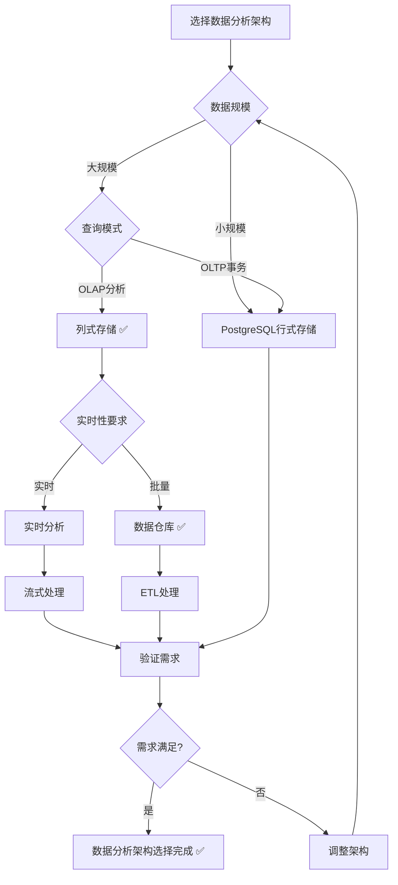
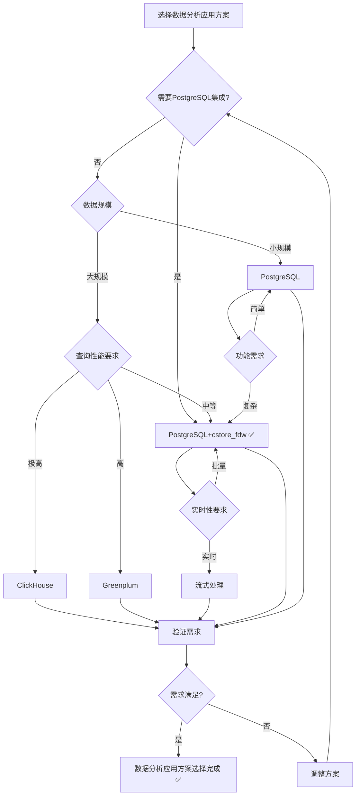

# PostgreSQL扩展：数据分析应用场景形式化理论分析

> **创建日期**：2025-01-15
> **最后更新**：2025-01-15
> **版本**：v1.0
> **状态**：进行中

---

## 📋 目录

- [PostgreSQL扩展：数据分析应用场景形式化理论分析](#postgresql扩展数据分析应用场景形式化理论分析)
  - [📋 目录](#-目录)
  - [1. 概述](#1-概述)
    - [1.1. 数据分析应用简介](#11-数据分析应用简介)
    - [1.2. 数据分析应用的重要性](#12-数据分析应用的重要性)
    - [1.3. PostgreSQL在数据分析应用中的位置](#13-postgresql在数据分析应用中的位置)
  - [2. 数据分析应用的形式化定义](#2-数据分析应用的形式化定义)
    - [2.1. 数据分析模型的形式化定义](#21-数据分析模型的形式化定义)
      - [2.1.1. 数据分析系统的形式化定义](#211-数据分析系统的形式化定义)
      - [2.1.2. 数据仓库的形式化定义](#212-数据仓库的形式化定义)
      - [2.1.3. OLAP的形式化定义](#213-olap的形式化定义)
    - [2.2. 列式存储的形式化定义](#22-列式存储的形式化定义)
      - [2.2.1. 列式存储模式的形式化定义](#221-列式存储模式的形式化定义)
      - [2.2.2. 列式数据的形式化定义](#222-列式数据的形式化定义)
      - [2.2.3. 列式查询的形式化定义](#223-列式查询的形式化定义)
    - [2.3. 数据仓库的形式化定义](#23-数据仓库的形式化定义)
      - [2.3.1. 星型模型的形式化定义](#231-星型模型的形式化定义)
      - [2.3.2. 雪花模型的形式化定义](#232-雪花模型的形式化定义)
      - [2.3.3. 事实表的形式化定义](#233-事实表的形式化定义)
  - [3. 数据分析架构的形式化理论](#3-数据分析架构的形式化理论)
    - [3.1. 列式存储架构的形式化定义](#31-列式存储架构的形式化定义)
      - [3.1.1. cstore\_fdw的形式化定义](#311-cstore_fdw的形式化定义)
      - [3.1.2. 物化视图的形式化定义](#312-物化视图的形式化定义)
      - [3.1.3. 列式查询优化的形式化定义](#313-列式查询优化的形式化定义)
    - [3.2. 数据仓库架构的形式化定义](#32-数据仓库架构的形式化定义)
      - [3.2.1. ETL的形式化定义](#321-etl的形式化定义)
      - [3.2.2. 数据湖的形式化定义](#322-数据湖的形式化定义)
    - [3.3. 数据分析架构对比矩阵](#33-数据分析架构对比矩阵)
    - [3.4. 数据分析架构选择决策树](#34-数据分析架构选择决策树)
  - [4. PostgreSQL数据分析应用方案与其他方案的对比](#4-postgresql数据分析应用方案与其他方案的对比)
    - [4.1. 功能对比矩阵](#41-功能对比矩阵)
    - [4.2. 性能对比矩阵](#42-性能对比矩阵)
    - [4.3. PostgreSQL数据分析应用方案选择决策树](#43-postgresql数据分析应用方案选择决策树)
  - [5. PostgreSQL数据分析应用的形式化理论](#5-postgresql数据分析应用的形式化理论)
    - [5.1. PostgreSQL列式存储的形式化定义](#51-postgresql列式存储的形式化定义)
      - [5.1.1. cstore\_fdw的形式化定义](#511-cstore_fdw的形式化定义)
      - [5.1.2. PostgreSQL列式存储的性质](#512-postgresql列式存储的性质)
    - [5.2. PostgreSQL物化视图的形式化定义](#52-postgresql物化视图的形式化定义)
      - [5.2.1. 物化视图的形式化定义](#521-物化视图的形式化定义)
    - [5.3. PostgreSQL数据分析应用的最佳实践](#53-postgresql数据分析应用的最佳实践)
      - [5.3.1. 列式存储的最佳实践](#531-列式存储的最佳实践)
      - [5.3.2. 物化视图的最佳实践](#532-物化视图的最佳实践)
  - [6. 应用场景的形式化分析](#6-应用场景的形式化分析)
    - [6.1. 商业智能的形式化定义](#61-商业智能的形式化定义)
    - [6.2. 数据科学的形式化定义](#62-数据科学的形式化定义)
    - [6.3. 实时分析的形式化定义](#63-实时分析的形式化定义)
  - [7. PostgreSQL数据分析应用的技术实现](#7-postgresql数据分析应用的技术实现)
    - [7.1. 列式存储的实现](#71-列式存储的实现)
      - [7.1.1. cstore\_fdw安装和配置](#711-cstore_fdw安装和配置)
    - [7.2. 物化视图的实现](#72-物化视图的实现)
      - [7.2.1. 物化视图创建和管理](#721-物化视图创建和管理)
    - [7.3. 数据仓库的实现](#73-数据仓库的实现)
      - [7.3.1. 星型模型实现](#731-星型模型实现)
  - [8. 参考资料](#8-参考资料)
    - [8.1. 经典文献](#81-经典文献)
    - [8.2. 相关资源](#82-相关资源)

---

## 1. 概述

### 1.1. 数据分析应用简介

数据分析应用是现代数据驱动系统的核心，提供：

- **数据仓库**：大规模数据存储和分析
- **OLAP分析**：多维数据分析
- **实时分析**：实时数据处理和分析
- **商业智能**：数据可视化和报表

### 1.2. 数据分析应用的重要性

数据分析应用在现代系统中至关重要：

1. **数据驱动决策**：基于数据做出决策
2. **业务洞察**：发现业务趋势和模式
3. **性能优化**：优化系统性能
4. **竞争优势**：获得竞争优势

### 1.3. PostgreSQL在数据分析应用中的位置

PostgreSQL在数据分析应用中提供：

- **列式存储**：cstore_fdw扩展支持列式存储
- **物化视图**：支持物化视图加速查询
- **数据仓库**：支持数据仓库设计
- **OLAP分析**：支持OLAP查询

---

## 2. 数据分析应用的形式化定义

### 2.1. 数据分析模型的形式化定义

#### 2.1.1. 数据分析系统的形式化定义

**定义2.1.1（数据分析系统）**：

数据分析系统 DataAnalysisSystem 是一个四元组 (DataSources, DataWarehouse, OLAP, BI)，其中：

- **DataSources**：数据源集合，DataSources = {DS₁, DS₂, ..., DSₙ}
- **DataWarehouse**：数据仓库
- **OLAP**：OLAP分析引擎
- **BI**：商业智能工具

**形式化表示**：

```text
DataAnalysisSystem = (DataSources, DataWarehouse, OLAP, BI)
其中：
  DataSources = {DS₁, DS₂, ..., DSₙ}
  DataWarehouse: DataWarehouseSystem
  OLAP: OLAPSystem
  BI: BISystem
```

**数据分析系统的性质**：

**性质2.1.1（数据分析系统的可扩展性）**：

数据分析系统可以扩展以处理大规模数据。

**形式化**：

```text
可扩展性 ⟺
  ∀数据规模n.
    ∃系统配置.
      系统可以处理规模n的数据
```

#### 2.1.2. 数据仓库的形式化定义

**定义2.1.2（数据仓库）**：

数据仓库 DataWarehouse 是一个三元组 (FactTables, DimensionTables, Aggregations)，其中：

- **FactTables**：事实表集合
- **DimensionTables**：维度表集合
- **Aggregations**：聚合表集合

**形式化表示**：

```text
DataWarehouse = (FactTables, DimensionTables, Aggregations)
其中：
  FactTables = {FT₁, FT₂, ..., FTₙ}
  DimensionTables = {DT₁, DT₂, ..., DTₘ}
  Aggregations = {AG₁, AG₂, ..., AGₖ}
```

#### 2.1.3. OLAP的形式化定义

**定义2.1.3（OLAP）**：

OLAP系统 OLAPSystem 支持多维数据分析：

```text
OLAP查询 = {
    维度查询,
    度量查询,
    切片查询,
    钻取查询
}
```

### 2.2. 列式存储的形式化定义

#### 2.2.1. 列式存储模式的形式化定义

**定义2.2.1（列式存储）**：

列式存储 ColumnStore 是一个三元组 (Columns, Compression, Index)，其中：

- **Columns**：列集合，Columns = {C₁, C₂, ..., Cₙ}
- **Compression**：压缩函数
- **Index**：索引结构

**形式化表示**：

```text
ColumnStore = (Columns, Compression, Index)
其中：
  Columns = {C₁, C₂, ..., Cₙ}
  Compression: Column → CompressedColumn
  Index: Column → IndexStructure
```

**列式存储的性质**：

**性质2.2.1（列式存储的压缩性）**：

列式存储具有高压缩率。

**形式化**：

```text
压缩性 ⟺
  ∀列C.
    压缩率(ColumnStore(C)) > 压缩率(RowStore(C))
```

#### 2.2.2. 列式数据的形式化定义

**定义2.2.2（列式数据）**：

列式数据 ColumnData 按列存储：

```text
ColumnData(table) = {
    Column₁: [value₁₁, value₁₂, ..., value₁ₙ],
    Column₂: [value₂₁, value₂₂, ..., value₂ₙ],
    ...,
    Columnₘ: [valueₘ₁, valueₘ₂, ..., valueₘₙ]
}
```

#### 2.2.3. 列式查询的形式化定义

**定义2.2.3（列式查询）**：

列式查询 ColumnQuery 只读取需要的列：

```text
列式查询(Query, ColumnStore) =
    只读取Query需要的列
```

### 2.3. 数据仓库的形式化定义

#### 2.3.1. 星型模型的形式化定义

**定义2.3.1（星型模型）**：

星型模型 StarSchema 是一个二元组 (FactTable, DimensionTables)，其中：

- **FactTable**：事实表
- **DimensionTables**：维度表集合

**形式化表示**：

```text
StarSchema = (FactTable, DimensionTables)
其中：
  FactTable: FactTable
  DimensionTables = {DT₁, DT₂, ..., DTₙ}
```

#### 2.3.2. 雪花模型的形式化定义

**定义2.3.2（雪花模型）**：

雪花模型 SnowflakeSchema 是星型模型的扩展，维度表可以进一步规范化：

```text
SnowflakeSchema = (FactTable, DimensionTables, SubDimensionTables)
其中：
  SubDimensionTables: DimensionTable → Set SubDimensionTable
```

#### 2.3.3. 事实表的形式化定义

**定义2.3.3（事实表）**：

事实表 FactTable 是一个三元组 (Measures, ForeignKeys, Grain)，其中：

- **Measures**：度量集合
- **ForeignKeys**：外键集合（指向维度表）
- **Grain**：事实表的粒度

**形式化表示**：

```text
FactTable = (Measures, ForeignKeys, Grain)
其中：
  Measures = {M₁, M₂, ..., Mₙ}
  ForeignKeys = {FK₁, FK₂, ..., FKₘ}
  Grain: 事实表的粒度
```

---

## 3. 数据分析架构的形式化理论

### 3.1. 列式存储架构的形式化定义

#### 3.1.1. cstore_fdw的形式化定义

**定义3.1.1（cstore_fdw）**：

cstore_fdw是PostgreSQL的列式存储外部数据包装器：

```text
cstore_fdw = (ColumnStore, FDWInterface, Compression)
其中：
  ColumnStore: 列式存储
  FDWInterface: Foreign Data Wrapper接口
  Compression: 压缩算法
```

#### 3.1.2. 物化视图的形式化定义

**定义3.1.2（物化视图）**：

物化视图 MaterializedView 是预计算的查询结果：

```text
MaterializedView = (Query, Result, RefreshPolicy)
其中：
  Query: 查询语句
  Result: 查询结果
  RefreshPolicy: 刷新策略
```

#### 3.1.3. 列式查询优化的形式化定义

**定义3.1.3（列式查询优化）**：

列式查询优化 ColumnQueryOptimization 优化列式查询：

```text
列式查询优化(Query, ColumnStore) =
    只扫描Query需要的列
```

### 3.2. 数据仓库架构的形式化定义

#### 3.2.1. ETL的形式化定义

**定义3.2.1（ETL）**：

ETL ExtractTransformLoad 是数据仓库的数据处理流程：

```text
ETL = (Extract, Transform, Load)
其中：
  Extract: 数据抽取
  Transform: 数据转换
  Load: 数据加载
```

#### 3.2.2. 数据湖的形式化定义

**定义3.2.2（数据湖）**：

数据湖 DataLake 是原始数据的存储系统：

```text
DataLake = (RawData, SchemaOnRead, Processing)
其中：
  RawData: 原始数据
  SchemaOnRead: 读取时模式
  Processing: 数据处理
```

### 3.3. 数据分析架构对比矩阵

| 架构模式 | 数据规模 | 查询性能 | 实时性 | 复杂度 | 适用场景 |
|---------|---------|---------|--------|--------|---------|
| **列式存储** | ⭐⭐⭐⭐⭐ | ⭐⭐⭐⭐⭐ | ⭐⭐⭐ | ⭐⭐⭐ | OLAP分析 |
| **行式存储** | ⭐⭐⭐ | ⭐⭐⭐ | ⭐⭐⭐⭐⭐ | ⭐⭐ | OLTP事务 |
| **数据仓库** | ⭐⭐⭐⭐⭐ | ⭐⭐⭐⭐ | ⭐⭐ | ⭐⭐⭐⭐ | 商业智能 |
| **数据湖** | ⭐⭐⭐⭐⭐ | ⭐⭐⭐ | ⭐⭐⭐ | ⭐⭐⭐⭐⭐ | 大数据分析 |

### 3.4. 数据分析架构选择决策树



---

## 4. PostgreSQL数据分析应用方案与其他方案的对比

### 4.1. 功能对比矩阵

| 功能 | PostgreSQL+cstore_fdw | ClickHouse | Greenplum | Snowflake | BigQuery |
|------|----------------------|------------|-----------|-----------|----------|
| **列式存储** | ✅ | ✅ | ✅ | ✅ | ✅ |
| **SQL支持** | ✅ | ✅ | ✅ | ✅ | ✅ |
| **PostgreSQL兼容** | ✅ | ❌ | ⚠️ | ❌ | ❌ |
| **物化视图** | ✅ | ✅ | ✅ | ✅ | ✅ |
| **实时分析** | ⚠️ | ✅ | ⚠️ | ✅ | ✅ |

### 4.2. 性能对比矩阵

| 性能指标 | PostgreSQL+cstore_fdw | ClickHouse | Greenplum | Snowflake | BigQuery |
|---------|----------------------|------------|-----------|-----------|----------|
| **查询性能** | ⭐⭐⭐ | ⭐⭐⭐⭐⭐ | ⭐⭐⭐⭐ | ⭐⭐⭐⭐⭐ | ⭐⭐⭐⭐⭐ |
| **压缩率** | ⭐⭐⭐ | ⭐⭐⭐⭐⭐ | ⭐⭐⭐⭐ | ⭐⭐⭐⭐ | ⭐⭐⭐⭐ |
| **PostgreSQL兼容** | ⭐⭐⭐⭐⭐ | ⭐ | ⭐⭐⭐ | ⭐ | ⭐ |
| **成本** | ⭐⭐⭐⭐⭐ | ⭐⭐⭐⭐ | ⭐⭐⭐ | ⭐⭐ | ⭐⭐ |

### 4.3. PostgreSQL数据分析应用方案选择决策树



---

## 5. PostgreSQL数据分析应用的形式化理论

### 5.1. PostgreSQL列式存储的形式化定义

#### 5.1.1. cstore_fdw的形式化定义

**定义5.1.1（PostgreSQL列式存储）**：

PostgreSQL列式存储 PostgreSQLColumnStore 使用cstore_fdw扩展：

```text
PostgreSQLColumnStore = (cstore_fdw, PostgreSQL, Compression)
其中：
  cstore_fdw: 列式存储扩展
  PostgreSQL: PostgreSQL数据库
  Compression: 压缩算法
```

#### 5.1.2. PostgreSQL列式存储的性质

**性质5.1.1（PostgreSQL列式存储的兼容性）**：

PostgreSQL列式存储与PostgreSQL完全兼容。

**形式化**：

```text
兼容性 ⟺
  ∀PostgreSQL查询Q.
    Q可以在PostgreSQLColumnStore上执行
```

### 5.2. PostgreSQL物化视图的形式化定义

#### 5.2.1. 物化视图的形式化定义

**定义5.2.1（PostgreSQL物化视图）**：

PostgreSQL物化视图 PostgreSQLMaterializedView 是预计算的查询结果：

```text
PostgreSQLMaterializedView = (Query, Result, RefreshPolicy)
其中：
  Query: SQL查询语句
  Result: 查询结果
  RefreshPolicy: 刷新策略（手动/自动）
```

### 5.3. PostgreSQL数据分析应用的最佳实践

#### 5.3.1. 列式存储的最佳实践

**实践5.3.1（列式存储）**：

使用cstore_fdw进行列式存储：

```sql
-- 创建列式存储表
CREATE FOREIGN TABLE sales_columnar (
    sale_id BIGINT,
    product_id BIGINT,
    customer_id BIGINT,
    sale_date DATE,
    amount DECIMAL(10,2)
)
SERVER cstore_server
OPTIONS (compression 'pglz');
```

#### 5.3.2. 物化视图的最佳实践

**实践5.3.2（物化视图）**：

使用物化视图加速查询：

```sql
-- 创建物化视图
CREATE MATERIALIZED VIEW mv_sales_summary AS
SELECT
    product_id,
    DATE_TRUNC('month', sale_date) AS month,
    SUM(amount) AS total_amount,
    COUNT(*) AS sale_count
FROM sales
GROUP BY product_id, month;

-- 创建索引
CREATE INDEX idx_mv_sales_summary_product_month
ON mv_sales_summary(product_id, month);

-- 刷新物化视图
REFRESH MATERIALIZED VIEW CONCURRENTLY mv_sales_summary;
```

---

## 6. 应用场景的形式化分析

### 6.1. 商业智能的形式化定义

**定义6.1.1（商业智能）**：

商业智能 BusinessIntelligence 是数据驱动的决策支持系统：

```text
BusinessIntelligence = (DataWarehouse, OLAP, Visualization, Reporting)
其中：
  DataWarehouse: 数据仓库
  OLAP: OLAP分析
  Visualization: 数据可视化
  Reporting: 报表生成
```

### 6.2. 数据科学的形式化定义

**定义6.2.1（数据科学）**：

数据科学 DataScience 是数据分析和机器学习：

```text
DataScience = (DataAnalysis, MachineLearning, ModelTraining, ModelEvaluation)
其中：
  DataAnalysis: 数据分析
  MachineLearning: 机器学习
  ModelTraining: 模型训练
  ModelEvaluation: 模型评估
```

### 6.3. 实时分析的形式化定义

**定义6.3.1（实时分析）**：

实时分析 RealTimeAnalysis 是实时数据处理和分析：

```text
RealTimeAnalysis = (StreamProcessing, RealTimeQueries, RealTimeDashboards)
其中：
  StreamProcessing: 流式处理
  RealTimeQueries: 实时查询
  RealTimeDashboards: 实时仪表板
```

---

## 7. PostgreSQL数据分析应用的技术实现

### 7.1. 列式存储的实现

#### 7.1.1. cstore_fdw安装和配置

```sql
-- 安装cstore_fdw扩展
CREATE EXTENSION cstore_fdw;

-- 创建外部服务器
CREATE SERVER cstore_server
FOREIGN DATA WRAPPER cstore_fdw;

-- 创建列式存储表
CREATE FOREIGN TABLE sales_columnar (
    sale_id BIGINT,
    product_id BIGINT,
    customer_id BIGINT,
    sale_date DATE,
    amount DECIMAL(10,2)
)
SERVER cstore_server
OPTIONS (compression 'pglz');
```

### 7.2. 物化视图的实现

#### 7.2.1. 物化视图创建和管理

```sql
-- 创建物化视图
CREATE MATERIALIZED VIEW mv_sales_summary AS
SELECT
    product_id,
    DATE_TRUNC('month', sale_date) AS month,
    SUM(amount) AS total_amount,
    COUNT(*) AS sale_count
FROM sales
GROUP BY product_id, month;

-- 创建索引
CREATE INDEX idx_mv_sales_summary_product_month
ON mv_sales_summary(product_id, month);

-- 刷新物化视图（并发刷新）
REFRESH MATERIALIZED VIEW CONCURRENTLY mv_sales_summary;
```

### 7.3. 数据仓库的实现

#### 7.3.1. 星型模型实现

```sql
-- 事实表
CREATE TABLE fact_sales (
    sale_id BIGSERIAL PRIMARY KEY,
    product_id BIGINT NOT NULL REFERENCES dim_products(product_id),
    customer_id BIGINT NOT NULL REFERENCES dim_customers(customer_id),
    date_id BIGINT NOT NULL REFERENCES dim_dates(date_id),
    amount DECIMAL(10,2) NOT NULL,
    quantity INTEGER NOT NULL
);

-- 维度表：产品
CREATE TABLE dim_products (
    product_id BIGSERIAL PRIMARY KEY,
    product_name VARCHAR(200) NOT NULL,
    category_id BIGINT NOT NULL REFERENCES dim_categories(category_id),
    price DECIMAL(10,2) NOT NULL
);

-- 维度表：客户
CREATE TABLE dim_customers (
    customer_id BIGSERIAL PRIMARY KEY,
    customer_name VARCHAR(200) NOT NULL,
    region_id BIGINT NOT NULL REFERENCES dim_regions(region_id)
);

-- 维度表：日期
CREATE TABLE dim_dates (
    date_id BIGSERIAL PRIMARY KEY,
    date DATE NOT NULL UNIQUE,
    year INTEGER NOT NULL,
    quarter INTEGER NOT NULL,
    month INTEGER NOT NULL,
    day INTEGER NOT NULL
);
```

---

## 8. 参考资料

### 8.1. 经典文献

- "The Data Warehouse Toolkit" (Kimball, 2013)
- "Building the Data Warehouse" (Inmon, 2005)
- "Column-Stores vs. Row-Stores" (Abadi et al., 2008)

### 8.2. 相关资源

- [PostgreSQL cstore_fdw文档](https://github.com/citusdata/cstore_fdw)
- [PostgreSQL物化视图文档](https://www.postgresql.org/docs/current/sql-creatematerializedview.html)
- [数据仓库设计指南](https://www.kimballgroup.com/data-warehouse-business-intelligence-resources/)

---

**最后更新**：2025-01-15
**维护者**：Data-Science Team
**状态**：进行中
