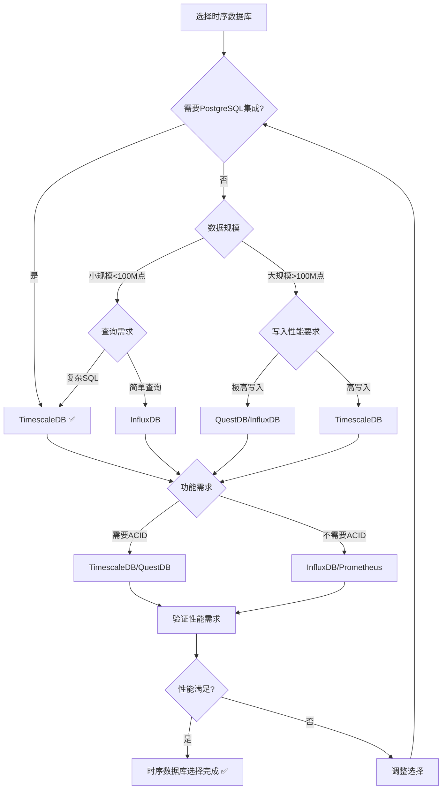

# PostgreSQL扩展：时序数据库（TimescaleDB）形式化理论分析

> **创建日期**：2025-01-15
> **最后更新**：2025-01-15
> **版本**：v1.0
> **状态**：进行中

---

## 📋 目录

- [PostgreSQL扩展：时序数据库（TimescaleDB）形式化理论分析](#postgresql扩展时序数据库timescaledb形式化理论分析)
  - [📋 目录](#-目录)
  - [1. 概述](#1-概述)
    - [1.1. TimescaleDB简介](#11-timescaledb简介)
    - [1.2. 时序数据库的重要性](#12-时序数据库的重要性)
    - [1.3. TimescaleDB在PostgreSQL中的位置](#13-timescaledb在postgresql中的位置)
  - [2. 时序数据库的形式化定义](#2-时序数据库的形式化定义)
    - [2.1. 时序数据模型的形式化定义](#21-时序数据模型的形式化定义)
      - [2.1.1. 时间序列的形式化定义](#211-时间序列的形式化定义)
      - [2.1.2. 时序数据点的形式化定义](#212-时序数据点的形式化定义)
      - [2.1.3. 时序数据库的形式化定义](#213-时序数据库的形式化定义)
    - [2.2. TimescaleDB的形式化规范](#22-timescaledb的形式化规范)
      - [2.2.1. 超表（Hypertable）的形式化定义](#221-超表hypertable的形式化定义)
      - [2.2.2. 块（Chunk）的形式化定义](#222-块chunk的形式化定义)
      - [2.2.3. 时序操作的形式化定义](#223-时序操作的形式化定义)
    - [2.3. TimescaleDB性质的形式化证明](#23-timescaledb性质的形式化证明)
      - [2.3.1. 超表的性质](#231-超表的性质)
      - [2.3.2. 块分区的性质](#232-块分区的性质)
      - [2.3.3. 时序查询的性质](#233-时序查询的性质)
  - [3. 连续聚合的形式化理论](#3-连续聚合的形式化理论)
    - [3.1. 连续聚合的形式化定义](#31-连续聚合的形式化定义)
    - [3.2. 增量更新的形式化定义](#32-增量更新的形式化定义)
    - [3.3. 连续聚合的性质](#33-连续聚合的性质)
  - [4. TimescaleDB与其他时序数据库的对比](#4-timescaledb与其他时序数据库的对比)
    - [4.1. 功能对比矩阵](#41-功能对比矩阵)
    - [4.2. 性能对比矩阵](#42-性能对比矩阵)
    - [4.3. PostgreSQL时序数据库选择决策树](#43-postgresql时序数据库选择决策树)
  - [5. 应用场景的形式化分析](#5-应用场景的形式化分析)
    - [5.1. IoT应用的形式化定义](#51-iot应用的形式化定义)
    - [5.2. 监控系统的形式化定义](#52-监控系统的形式化定义)
    - [5.3. 金融时序的形式化定义](#53-金融时序的形式化定义)
  - [6. 参考资料](#6-参考资料)
    - [6.1. 经典文献](#61-经典文献)
    - [6.2. 相关资源](#62-相关资源)

---

## 1. 概述

### 1.1. TimescaleDB简介

TimescaleDB是PostgreSQL的时序数据库扩展，提供：

- **超表（Hypertable）**：自动分区的时序表
- **块（Chunk）**：按时间分区的数据块
- **连续聚合（Continuous Aggregates）**：自动维护的物化视图
- **时序函数**：时间序列分析和聚合函数

### 1.2. 时序数据库的重要性

时序数据库在现代应用中至关重要：

1. **IoT数据**：传感器数据、设备监控
2. **监控系统**：系统指标、应用性能监控
3. **金融数据**：股票价格、交易数据
4. **日志分析**：应用日志、系统日志

### 1.3. TimescaleDB在PostgreSQL中的位置

TimescaleDB扩展了PostgreSQL的时序能力：

- **关系模型**：PostgreSQL原生支持
- **时序模型**：TimescaleDB扩展支持
- **向量模型**：pgvector扩展支持
- **图模型**：Apache AGE扩展支持

---

## 2. 时序数据库的形式化定义

### 2.1. 时序数据模型的形式化定义

#### 2.1.1. 时间序列的形式化定义

**定义2.1.1（时间序列）**：

时间序列 TS 是一个函数：

```text
TS: Time → Value
```

其中 Time 是时间域，Value 是值域。

**形式化表示**：

```text
TS = {(t₁, v₁), (t₂, v₂), ..., (tₙ, vₙ)}
其中：
  tᵢ ∈ Time  （时间戳）
  vᵢ ∈ Value （值）
  t₁ < t₂ < ... < tₙ  （时间有序）
```

**时间序列的性质**：

**性质2.1.1（时间序列的时间有序性）**：

时间序列中的时间戳是有序的。

**形式化**：

```text
时间有序性 ⟺ ∀i < j. tᵢ < tⱼ
```

**性质2.1.2（时间序列的连续性）**：

时间序列可以是连续的或离散的。

**形式化**：

```text
连续性 ⟺ Time是连续域
离散性 ⟺ Time是离散域
```

#### 2.1.2. 时序数据点的形式化定义

**定义2.1.2（时序数据点）**：

时序数据点 Point 是一个三元组 (timestamp, value, tags)，其中：

- **timestamp**：时间戳
- **value**：数值
- **tags**：标签集合（可选）

**形式化表示**：

```text
Point = (timestamp, value, tags)
其中：
  timestamp ∈ Time
  value ∈ Value
  tags ⊆ TagSet
```

#### 2.1.3. 时序数据库的形式化定义

**定义2.1.3（时序数据库）**：

时序数据库 TSDB 是一个三元组 (Series, Index, Query)，其中：

- **Series**：时间序列集合
- **Index**：时序索引结构
- **Query**：时序查询语言

**形式化表示**：

```text
TSDB = (Series, Index, Query)
其中：
  Series = {TS₁, TS₂, ..., TSₙ}  （时间序列集合）
  Index: Series → IndexStructure （索引函数）
  Query: QueryExpression → ResultSet （查询函数）
```

### 2.2. TimescaleDB的形式化规范

#### 2.2.1. 超表（Hypertable）的形式化定义

**定义2.2.1（超表）**：

超表 Hypertable 是一个三元组 (Schema, PartitionFunction, Chunks)，其中：

- **Schema**：表模式
- **PartitionFunction**：分区函数，按时间分区
- **Chunks**：块集合，Chunks = {Chunk₁, Chunk₂, ..., Chunkₙ}

**形式化表示**：

```text
Hypertable = (Schema, PartitionFunction, Chunks)
其中：
  Schema: 表模式
  PartitionFunction: Time → ChunkID
  Chunks = {Chunk₁, Chunk₂, ..., Chunkₙ}
```

**超表的性质**：

**性质2.2.1（超表的自动分区）**：

超表自动按时间分区，每个块包含一个时间范围的数据。

**形式化**：

```text
自动分区 ⟺
  ∀Chunkᵢ ∈ Chunks.
    ∃时间范围[t_start, t_end].
      Chunkᵢ = {Point | Point.timestamp ∈ [t_start, t_end]}
```

**性质2.2.2（超表的透明性）**：

超表对用户透明，用户像使用普通表一样使用超表。

**形式化**：

```text
透明性 ⟺
  ∀查询q.
    [[q]]_Hypertable = [[q]]_Union(Chunks)
```

#### 2.2.2. 块（Chunk）的形式化定义

**定义2.2.2（块）**：

块 Chunk 是一个三元组 (TimeRange, Data, Index)，其中：

- **TimeRange**：时间范围，TimeRange = [t_start, t_end]
- **Data**：数据集合，Data = {Point | Point.timestamp ∈ TimeRange}
- **Index**：索引结构

**形式化表示**：

```text
Chunk = (TimeRange, Data, Index)
其中：
  TimeRange = [t_start, t_end]
  Data = {Point | Point.timestamp ∈ TimeRange}
  Index: Data → IndexStructure
```

**块的性质**：

**性质2.2.3（块的时间不重叠性）**：

不同块的时间范围不重叠。

**形式化**：

```text
时间不重叠 ⟺
  ∀Chunkᵢ, Chunkⱼ ∈ Chunks, i ≠ j.
    TimeRange(Chunkᵢ) ∩ TimeRange(Chunkⱼ) = ∅
```

**性质2.2.4（块的时间覆盖性）**：

所有块的时间范围覆盖整个时间域。

**形式化**：

```text
时间覆盖 ⟺
  ∪_{Chunkᵢ ∈ Chunks} TimeRange(Chunkᵢ) = TimeDomain
```

#### 2.2.3. 时序操作的形式化定义

**定义2.2.3（时序操作）**：

TimescaleDB支持以下时序操作：

1. **插入操作**：insert: Point → Hypertable → Hypertable
2. **查询操作**：query: QueryExpression → Hypertable → ResultSet
3. **聚合操作**：aggregate: AggregationFunction × TimeRange → Hypertable → ResultSet
4. **删除操作**：delete: TimeRange → Hypertable → Hypertable

**形式化表示**：

```text
时序操作 = {
    insert: Point → Hypertable → Hypertable,
    query: QueryExpression → Hypertable → ResultSet,
    aggregate: AggregationFunction × TimeRange → Hypertable → ResultSet,
    delete: TimeRange → Hypertable → Hypertable
}
```

### 2.3. TimescaleDB性质的形式化证明

#### 2.3.1. 超表的性质

**定理2.3.1（超表的查询等价性）**：

超表的查询等价于对所有块的查询的并集。

**证明**：

**步骤1**：定义查询语义

超表的查询语义定义为对所有块的查询的并集。

**步骤2**：验证等价性

由于超表是块的逻辑视图，查询结果等价。

**步骤3**：结论

因此超表的查询等价于对所有块的查询的并集 ✅

#### 2.3.2. 块分区的性质

**定理2.3.2（块分区的正确性）**：

块分区保持数据的完整性和一致性。

**证明**：

**步骤1**：定义完整性

数据完整性要求所有数据点都存储在某个块中。

**步骤2**：验证完整性

由于块的时间范围覆盖整个时间域，所有数据点都被存储。

**步骤3**：验证一致性

由于块的时间范围不重叠，数据点不会被重复存储。

**步骤4**：结论

因此块分区保持数据的完整性和一致性 ✅

#### 2.3.3. 时序查询的性质

**性质2.3.1（时序查询的时间范围优化）**：

时序查询可以只查询相关的时间块，提高查询效率。

**形式化**：

```text
时间范围优化 ⟺
  ∀查询q, 时间范围[t_start, t_end].
    查询q只访问时间范围[t_start, t_end]内的块
```

---

## 3. 连续聚合的形式化理论

### 3.1. 连续聚合的形式化定义

**定义3.1.1（连续聚合）**：

连续聚合 ContinuousAggregate 是一个三元组 (SourceTable, AggregationFunction, RefreshPolicy)，其中：

- **SourceTable**：源表（超表）
- **AggregationFunction**：聚合函数
- **RefreshPolicy**：刷新策略

**形式化表示**：

```text
ContinuousAggregate = (SourceTable, AggregationFunction, RefreshPolicy)
其中：
  SourceTable: Hypertable
  AggregationFunction: TimeRange → AggregatedValue
  RefreshPolicy: RefreshStrategy
```

**连续聚合的语义**：

**定义3.1.2（连续聚合语义）**：

连续聚合的语义是自动维护的物化视图：

```text
[[ContinuousAggregate]] =
    MaterializedView(
        AggregationFunction(SourceTable),
        RefreshPolicy
    )
```

### 3.2. 增量更新的形式化定义

**定义3.2.1（增量更新）**：

增量更新只更新新增的数据，不重新计算整个聚合。

**形式化表示**：

```text
增量更新(ContinuousAggregate, NewData) =
    旧聚合值 + 聚合(NewData)
```

**增量更新的正确性**：

**定理3.2.1（增量更新的正确性）**：

增量更新保持聚合的正确性。

**证明**：

**步骤1**：定义正确性

增量更新的结果等于重新计算整个聚合的结果。

**步骤2**：验证正确性

对于可加性聚合函数（如SUM、COUNT），增量更新是正确的。

**步骤3**：结论

因此增量更新保持聚合的正确性 ✅

### 3.3. 连续聚合的性质

**性质3.3.1（连续聚合的自动维护性）**：

连续聚合自动维护，无需手动刷新。

**形式化**：

```text
自动维护 ⟺
  ∀新数据d.
    自动刷新(ContinuousAggregate, d)
```

**性质3.3.2（连续聚合的查询性能）**：

连续聚合提供快速的聚合查询性能。

**形式化**：

```text
查询性能 ⟺
  查询时间(ContinuousAggregate) << 查询时间(SourceTable)
```

---

## 4. TimescaleDB与其他时序数据库的对比

### 4.1. 功能对比矩阵

| 功能 | TimescaleDB | InfluxDB | Prometheus | OpenTSDB | QuestDB |
|------|------------|----------|------------|----------|---------|
| **SQL支持** | ✅ | ⚠️ | ❌ | ⚠️ | ✅ |
| **PostgreSQL集成** | ✅ | ❌ | ❌ | ❌ | ❌ |
| **自动分区** | ✅ | ✅ | ✅ | ✅ | ✅ |
| **连续聚合** | ✅ | ✅ | ✅ | ❌ | ✅ |
| **压缩** | ✅ | ✅ | ✅ | ✅ | ✅ |
| **ACID事务** | ✅ | ❌ | ❌ | ❌ | ✅ |
| **分布式** | ✅ | ✅ | ✅ | ✅ | ✅ |

### 4.2. 性能对比矩阵

| 性能指标 | TimescaleDB | InfluxDB | Prometheus | OpenTSDB | QuestDB |
|---------|------------|----------|------------|----------|---------|
| **写入性能** | ⭐⭐⭐⭐ | ⭐⭐⭐⭐⭐ | ⭐⭐⭐⭐ | ⭐⭐⭐⭐ | ⭐⭐⭐⭐⭐ |
| **查询性能** | ⭐⭐⭐⭐⭐ | ⭐⭐⭐⭐ | ⭐⭐⭐⭐ | ⭐⭐⭐ | ⭐⭐⭐⭐⭐ |
| **压缩率** | ⭐⭐⭐⭐ | ⭐⭐⭐⭐⭐ | ⭐⭐⭐⭐ | ⭐⭐⭐⭐ | ⭐⭐⭐⭐⭐ |
| **PostgreSQL集成** | ⭐⭐⭐⭐⭐ | ⭐ | ⭐ | ⭐ | ⭐ |

### 4.3. PostgreSQL时序数据库选择决策树



---

## 5. 应用场景的形式化分析

### 5.1. IoT应用的形式化定义

**定义5.1.1（IoT时序数据）**：

IoT时序数据是传感器设备产生的时间序列数据：

```text
IoT时序数据 = {
    (timestamp, sensor_id, value, metadata) |
    timestamp ∈ Time,
    sensor_id ∈ SensorID,
    value ∈ Value,
    metadata ∈ Metadata
}
```

**IoT查询的形式化定义**：

**定义5.1.2（IoT查询）**：

IoT查询包括：

1. **设备查询**：查询特定设备的数据
2. **时间范围查询**：查询特定时间范围的数据
3. **聚合查询**：对设备数据进行聚合

**形式化表示**：

```text
IoT查询 = {
    设备查询(sensor_id, time_range),
    时间范围查询(time_range),
    聚合查询(aggregation_function, time_range)
}
```

### 5.2. 监控系统的形式化定义

**定义5.2.1（监控时序数据）**：

监控时序数据是系统指标的时间序列：

```text
监控时序数据 = {
    (timestamp, metric_name, value, tags) |
    timestamp ∈ Time,
    metric_name ∈ MetricName,
    value ∈ Value,
    tags ∈ TagSet
}
```

**监控查询的形式化定义**：

**定义5.2.2（监控查询）**：

监控查询包括：

1. **指标查询**：查询特定指标的数据
2. **告警查询**：查询超过阈值的指标
3. **趋势分析**：分析指标的趋势

### 5.3. 金融时序的形式化定义

**定义5.3.1（金融时序数据）**：

金融时序数据是金融工具的价格时间序列：

```text
金融时序数据 = {
    (timestamp, symbol, price, volume) |
    timestamp ∈ Time,
    symbol ∈ Symbol,
    price ∈ Price,
    volume ∈ Volume
}
```

**金融查询的形式化定义**：

**定义5.3.2（金融查询）**：

金融查询包括：

1. **价格查询**：查询特定时间点的价格
2. **K线查询**：查询K线数据
3. **技术指标查询**：查询技术指标（MA、RSI等）

---

## 6. 参考资料

### 6.1. 经典文献

- TimescaleDB官方文档：<https://docs.timescale.com/>
- "Time Series Databases" (Jensen et al., 2017)
- "Hypertable: A Storage System for Time-Series Data" (TimescaleDB团队)

### 6.2. 相关资源

- [TimescaleDB GitHub](https://github.com/timescale/timescaledb)
- [时序数据库对比](https://www.timescale.com/blog/timescaledb-vs-influxdb/)
- [时序数据库选择指南](https://www.timescale.com/blog/choosing-a-time-series-database/)

---

**最后更新**：2025-01-15
**维护者**：Data-Science Team
**状态**：进行中
