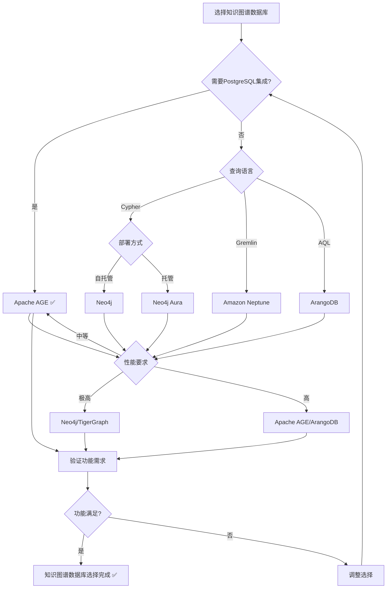

# PostgreSQL扩展：知识图谱数据库（Apache AGE）形式化理论分析

> **创建日期**：2025-01-15
> **最后更新**：2025-01-15
> **版本**：v1.0
> **状态**：进行中

---

## 📋 目录

- [PostgreSQL扩展：知识图谱数据库（Apache AGE）形式化理论分析](#postgresql扩展知识图谱数据库apache-age形式化理论分析)
  - [📋 目录](#-目录)
  - [1. 概述](#1-概述)
    - [1.1. Apache AGE简介](#11-apache-age简介)
    - [1.2. 知识图谱数据库的重要性](#12-知识图谱数据库的重要性)
    - [1.3. Apache AGE在PostgreSQL中的位置](#13-apache-age在postgresql中的位置)
  - [2. Apache AGE的形式化定义](#2-apache-age的形式化定义)
    - [2.1. Apache AGE架构的形式化定义](#21-apache-age架构的形式化定义)
      - [2.1.1. AGE图模型的形式化定义](#211-age图模型的形式化定义)
      - [2.1.2. AGE存储模型的形式化定义](#212-age存储模型的形式化定义)
      - [2.1.3. AGE查询模型的形式化定义](#213-age查询模型的形式化定义)
    - [2.2. Cypher查询语言的形式化语义](#22-cypher查询语言的形式化语义)
      - [2.2.1. Cypher语法的形式化定义](#221-cypher语法的形式化定义)
      - [2.2.2. Cypher语义的形式化定义](#222-cypher语义的形式化定义)
      - [2.2.3. Cypher查询优化的形式化定义](#223-cypher查询优化的形式化定义)
    - [2.3. Apache AGE性质的形式化证明](#23-apache-age性质的形式化证明)
      - [2.3.1. AGE图操作的性质](#231-age图操作的性质)
      - [2.3.2. AGE查询的性质](#232-age查询的性质)
      - [2.3.3. AGE事务的性质](#233-age事务的性质)
  - [3. 图查询优化的形式化理论](#3-图查询优化的形式化理论)
    - [3.1. 图模式匹配的形式化定义](#31-图模式匹配的形式化定义)
    - [3.2. 图查询优化的形式化定义](#32-图查询优化的形式化定义)
    - [3.3. 图索引的形式化定义](#33-图索引的形式化定义)
  - [4. Apache AGE与其他图数据库的对比](#4-apache-age与其他图数据库的对比)
    - [4.1. 功能对比矩阵](#41-功能对比矩阵)
    - [4.2. 性能对比矩阵](#42-性能对比矩阵)
    - [4.3. PostgreSQL知识图谱数据库选择决策树](#43-postgresql知识图谱数据库选择决策树)
  - [5. 应用场景的形式化分析](#5-应用场景的形式化分析)
    - [5.1. 知识推理的形式化定义](#51-知识推理的形式化定义)
    - [5.2. 关系分析的形式化定义](#52-关系分析的形式化定义)
    - [5.3. 路径查询的形式化定义](#53-路径查询的形式化定义)
  - [6. 参考资料](#6-参考资料)
    - [6.1. 经典文献](#61-经典文献)
    - [6.2. 相关资源](#62-相关资源)

---

## 1. 概述

### 1.1. Apache AGE简介

Apache AGE是PostgreSQL的图数据库扩展，提供：

- **Cypher查询语言**：Neo4j兼容的图查询语言
- **图数据模型**：节点和边的属性图模型
- **PostgreSQL集成**：与PostgreSQL关系模型无缝集成
- **ACID事务**：完整的ACID事务支持

### 1.2. 知识图谱数据库的重要性

知识图谱数据库在现代应用中至关重要：

1. **知识推理**：基于图结构的逻辑推理
2. **关系分析**：复杂关系的分析和查询
3. **路径查询**：多跳路径查询和分析
4. **语义搜索**：基于图结构的语义搜索

### 1.3. Apache AGE在PostgreSQL中的位置

Apache AGE扩展了PostgreSQL的多模型能力：

- **关系模型**：PostgreSQL原生支持
- **图模型**：Apache AGE扩展支持
- **向量模型**：pgvector扩展支持
- **文档模型**：JSONB扩展支持

---

## 2. Apache AGE的形式化定义

### 2.1. Apache AGE架构的形式化定义

#### 2.1.1. AGE图模型的形式化定义

**定义2.1.1（AGE属性图）**：

Apache AGE的属性图 G_age 是一个五元组 (V, E, L_V, L_E, A)，其中：

- **V**：节点集合（Vertices），V = {v₁, v₂, ..., vₙ}
- **E**：边集合（Edges），E = {e₁, e₂, ..., eₘ}
- **L_V: V → LabelSet**：节点标签函数
- **L_E: E → LabelSet**：边标签函数
- **A: (V ∪ E) → AttributeMap**：属性函数

**形式化表示**：

```text
G_age = (V, E, L_V, L_E, A)
其中：
  V = {v₁, v₂, ..., vₙ}  （节点集合）
  E = {e₁, e₂, ..., eₘ}  （边集合）
  L_V: V → LabelSet       （节点标签函数）
  L_E: E → LabelSet       （边标签函数）
  A: (V ∪ E) → AttributeMap  （属性函数）
```

**AGE图的性质**：

**性质2.1.1（AGE图的有向性）**：

AGE图是有向图，边有方向。

**形式化**：

```text
有向性 ⟺ ∀e ∈ E. e = (v_s, v_t), v_s ≠ v_t
```

**性质2.1.2（AGE图的多重性）**：

AGE图允许多重边，两个节点可以有多个不同的边。

**形式化**：

```text
多重性 ⟺ ∃v₁, v₂ ∈ V. |{e ∈ E | e = (v₁, v₂)}| > 1
```

#### 2.1.2. AGE存储模型的形式化定义

**定义2.1.2（AGE存储模型）**：

Apache AGE将图数据存储在PostgreSQL关系表中：

1. **节点表**：`ag_catalog.ag_vertex`

   ```text
   ag_vertex = (graphid, label, properties)
   ```

2. **边表**：`ag_catalog.ag_edge`

   ```text
   ag_edge = (graphid, start_vertex, end_vertex, label, properties)
   ```

**形式化映射**：

**定义2.1.3（图到关系的映射）**：

图 G_age = (V, E, L_V, L_E, A) 映射到关系表：

```text
映射(G_age) = {
    ag_vertex: {(id(v), L_V(v), A(v)) | v ∈ V},
    ag_edge: {(id(e), start(e), end(e), L_E(e), A(e)) | e ∈ E}
}
```

#### 2.1.3. AGE查询模型的形式化定义

**定义2.1.4（AGE查询模型）**：

Apache AGE查询模型支持：

1. **Cypher查询**：使用Cypher语法
2. **SQL查询**：使用标准SQL查询图数据
3. **混合查询**：结合Cypher和SQL

**形式化表示**：

```text
AGE查询 = Cypher查询 | SQL查询 | 混合查询
```

### 2.2. Cypher查询语言的形式化语义

#### 2.2.1. Cypher语法的形式化定义

**定义2.2.1（Cypher语法）**：

Cypher语法定义如下（BNF形式）：

```text
Query ::= MatchClause [WhereClause] [ReturnClause]
MatchClause ::= MATCH Pattern
Pattern ::= NodePattern [EdgePattern NodePattern]*
NodePattern ::= (Variable [Label] [Properties])
EdgePattern ::= -[Variable [Label] [Properties]]->
WhereClause ::= WHERE Condition
ReturnClause ::= RETURN ProjectionList
```

**语法元素说明**：

- **MATCH**：模式匹配
- **WHERE**：过滤条件
- **RETURN**：返回结果

#### 2.2.2. Cypher语义的形式化定义

**定义2.2.2（Cypher语义）**：

Cypher查询的语义定义为：

```text
[[CypherQuery]]_G = {
    binding | binding ∈ Match(Pattern, G) ∧
              Satisfies(WhereClause, binding)
}
```

其中：

- **Match**：模式匹配函数
- **Satisfies**：条件满足函数

**模式匹配的形式化定义**：

**定义2.2.3（模式匹配）**：

模式匹配 Match(Pattern, G) 返回所有满足模式的绑定：

```text
Match(Pattern, G) = {
    binding | binding: Variables → (V ∪ E),
              Pattern(binding) ⊆ G
}
```

#### 2.2.3. Cypher查询优化的形式化定义

**定义2.2.4（Cypher查询优化）**：

Cypher查询优化是将查询转换为高效的执行计划：

```text
优化(CypherQuery) = 执行计划
```

**优化策略**：

1. **模式匹配顺序优化**：选择最优的匹配顺序
2. **索引使用优化**：利用索引加速查询
3. **连接顺序优化**：优化多模式连接的顺序

### 2.3. Apache AGE性质的形式化证明

#### 2.3.1. AGE图操作的性质

**性质2.3.1（图操作的原子性）**：

AGE图操作是原子的，要么全部成功，要么全部失败。

**形式化**：

```text
原子性 ⟺
  ∀操作op.
    (成功(op) → 所有子操作成功) ∧
    (失败(op) → 所有子操作回滚)
```

**性质2.3.2（图操作的一致性）**：

AGE图操作保持图的一致性约束。

**形式化**：

```text
一致性 ⟺
  ∀操作op.
    Invariant(G) → Invariant(op(G))
```

#### 2.3.2. AGE查询的性质

**性质2.3.3（查询的确定性）**：

AGE查询是确定性的，相同查询在相同图上产生相同结果。

**形式化**：

```text
确定性 ⟺
  ∀查询q, 图G.
    [[q]]_G = [[q]]_G
```

#### 2.3.3. AGE事务的性质

**性质2.3.4（事务的ACID性质）**：

AGE事务满足ACID性质，继承自PostgreSQL。

**形式化**：

```text
ACID ⟺
  原子性(AGE事务) ∧
  一致性(AGE事务) ∧
  隔离性(AGE事务) ∧
  持久性(AGE事务)
```

---

## 3. 图查询优化的形式化理论

### 3.1. 图模式匹配的形式化定义

**定义3.1.1（图模式匹配）**：

图模式匹配是在图中找到所有满足模式的子图：

```text
模式匹配(Pattern, G) = {
    subgraph | subgraph ⊆ G ∧
                subgraph 同构于 Pattern
}
```

**模式匹配算法**：

**算法3.1.1：图模式匹配算法**

```python
def pattern_match(pattern, graph):
    """
    图模式匹配算法

    参数:
        pattern: 图模式
        graph: 图数据

    返回:
        所有满足模式的子图
    """
    # 步骤1：找到匹配的起始节点
    start_nodes = find_start_nodes(pattern, graph)

    # 步骤2：从每个起始节点开始匹配
    results = []
    for start_node in start_nodes:
        matches = match_from_node(pattern, start_node, graph)
        results.extend(matches)

    return results

def match_from_node(pattern, start_node, graph):
    """从给定节点开始匹配模式"""
    # 使用回溯算法匹配模式
    matches = []
    backtrack(pattern, start_node, {}, graph, matches)
    return matches

def backtrack(pattern, current_node, binding, graph, matches):
    """回溯算法匹配模式"""
    if complete_match(binding, pattern):
        matches.append(binding.copy())
        return

    # 找到下一个要匹配的模式节点
    next_pattern_node = find_next_pattern_node(pattern, binding)

    # 找到候选节点
    candidates = find_candidates(next_pattern_node, current_node, graph)

    for candidate in candidates:
        if is_valid_binding(binding, next_pattern_node, candidate):
            binding[next_pattern_node] = candidate
            backtrack(pattern, candidate, binding, graph, matches)
            binding.pop(next_pattern_node)
```

### 3.2. 图查询优化的形式化定义

**定义3.2.1（图查询优化）**：

图查询优化是将图查询转换为高效的执行计划：

```text
优化(GraphQuery) = 执行计划
```

**优化目标**：

1. **最小化查询时间**
2. **最小化内存占用**
3. **最大化并行度**

**优化策略**：

**策略1：模式匹配顺序优化**

选择最优的模式匹配顺序，减少搜索空间。

**策略2：索引使用优化**

利用节点和边的索引加速查询。

**策略3：连接顺序优化**

优化多个模式连接的顺序。

### 3.3. 图索引的形式化定义

**定义3.3.1（图索引）**：

图索引 I 是一个映射函数：

```text
I: IndexKey → EntitySet
```

其中 EntitySet 是节点或边的集合。

**索引类型**：

1. **节点标签索引**：按标签索引节点
2. **边类型索引**：按类型索引边
3. **属性索引**：按属性值索引实体
4. **路径索引**：预计算常用路径

**形式化表示**：

```text
节点标签索引: Label → NodeSet
边类型索引: EdgeType → EdgeSet
属性索引: (AttributeName, Value) → EntitySet
路径索引: PathPattern → PathSet
```

---

## 4. Apache AGE与其他图数据库的对比

### 4.1. 功能对比矩阵

| 功能 | Apache AGE | Neo4j | ArangoDB | Amazon Neptune | TigerGraph |
|------|-----------|-------|----------|----------------|------------|
| **Cypher查询** | ✅ | ✅ | ❌ | ✅ | ❌ |
| **SQL查询** | ✅ | ❌ | ✅ | ❌ | ❌ |
| **ACID事务** | ✅ | ✅ | ✅ | ✅ | ✅ |
| **PostgreSQL集成** | ✅ | ❌ | ❌ | ❌ | ❌ |
| **分布式** | ✅ | ✅ | ✅ | ✅ | ✅ |
| **图算法** | ⚠️ | ✅ | ✅ | ✅ | ✅ |
| **可视化** | ⚠️ | ✅ | ✅ | ✅ | ✅ |

### 4.2. 性能对比矩阵

| 性能指标 | Apache AGE | Neo4j | ArangoDB | Amazon Neptune | TigerGraph |
|---------|-----------|-------|----------|----------------|------------|
| **查询延迟** | ⭐⭐⭐⭐ | ⭐⭐⭐⭐⭐ | ⭐⭐⭐⭐ | ⭐⭐⭐⭐ | ⭐⭐⭐⭐⭐ |
| **吞吐量** | ⭐⭐⭐⭐ | ⭐⭐⭐⭐ | ⭐⭐⭐⭐⭐ | ⭐⭐⭐⭐ | ⭐⭐⭐⭐⭐ |
| **可扩展性** | ⭐⭐⭐⭐⭐ | ⭐⭐⭐⭐ | ⭐⭐⭐⭐⭐ | ⭐⭐⭐⭐⭐ | ⭐⭐⭐⭐⭐ |
| **PostgreSQL集成** | ⭐⭐⭐⭐⭐ | ⭐ | ⭐ | ⭐ | ⭐ |

### 4.3. PostgreSQL知识图谱数据库选择决策树



---

## 5. 应用场景的形式化分析

### 5.1. 知识推理的形式化定义

**定义5.1.1（知识推理）**：

知识推理是基于图结构的逻辑推理：

```text
推理(规则集, 知识图谱) = 新知识
```

**推理规则的形式化定义**：

**定义5.1.2（推理规则）**：

推理规则 Rule 是一个三元组 (前提, 结论, 条件)：

```text
Rule = (Premise, Conclusion, Condition)
其中：
  Premise: 图模式（前提模式）
  Conclusion: 图模式（结论模式）
  Condition: 条件（可选）
```

**推理的形式化定义**：

**定义5.1.3（推理过程）**：

推理过程是在知识图谱中应用推理规则：

```text
推理(Rules, KG) =
    KG ∪ {新三元组 | 规则 ∈ Rules,
                    匹配(规则.前提, KG),
                    满足(规则.条件),
                    新三元组 = 应用(规则.结论)}
```

### 5.2. 关系分析的形式化定义

**定义5.2.1（关系分析）**：

关系分析是分析图中实体间的关系：

```text
关系分析(实体1, 实体2, KG) = {
    路径 | 路径连接(实体1, 实体2, KG)
}
```

**路径查询的形式化定义**：

**定义5.2.2（路径查询）**：

路径查询找到连接两个实体的所有路径：

```text
路径查询(v₁, v₂, KG) = {
    路径 | 路径 = (v₁, e₁, v₂, e₂, ..., vₙ, eₙ, v₂),
          ∀eᵢ ∈ 路径. eᵢ ∈ E(KG)
}
```

### 5.3. 路径查询的形式化定义

**定义5.3.1（路径查询）**：

路径查询是在图中找到满足条件的路径：

```text
路径查询(起始节点, 终止节点, 路径模式, KG) = {
    路径 | 路径连接(起始节点, 终止节点, KG),
          路径匹配(路径模式)
}
```

**路径模式的形式化定义**：

**定义5.3.2（路径模式）**：

路径模式 PathPattern 定义路径的结构：

```text
PathPattern = NodePattern EdgePattern* NodePattern
```

**路径查询算法**：

**算法5.3.1：路径查询算法**

```python
def path_query(start_node, end_node, path_pattern, graph):
    """
    路径查询算法

    参数:
        start_node: 起始节点
        end_node: 终止节点
        path_pattern: 路径模式
        graph: 图数据

    返回:
        所有满足模式的路径
    """
    # 使用深度优先搜索或广度优先搜索
    paths = []
    dfs_path_search(start_node, end_node, path_pattern, graph, [], paths)
    return paths

def dfs_path_search(current, target, pattern, graph, path, results):
    """深度优先搜索路径"""
    if current == target and matches_pattern(path, pattern):
        results.append(path.copy())
        return

    if len(path) > max_depth(pattern):
        return

    # 探索邻居节点
    for edge, neighbor in graph.neighbors(current):
        if edge not in path and matches_pattern_so_far(path + [edge], pattern):
            path.append(edge)
            dfs_path_search(neighbor, target, pattern, graph, path, results)
            path.pop()
```

---

## 6. 参考资料

### 6.1. 经典文献

- Apache AGE官方文档：<https://age.apache.org/>
- Cypher查询语言规范：<https://neo4j.com/docs/cypher-manual/>
- "Graph Databases" (Robinson et al., 2015)

### 6.2. 相关资源

- [Apache AGE GitHub](https://github.com/apache/age)
- [Cypher查询语言](https://neo4j.com/developer/cypher/)
- [图数据库对比](https://db-engines.com/en/ranking/graph+dbms)

---

**最后更新**：2025-01-15
**维护者**：Data-Science Team
**状态**：进行中
