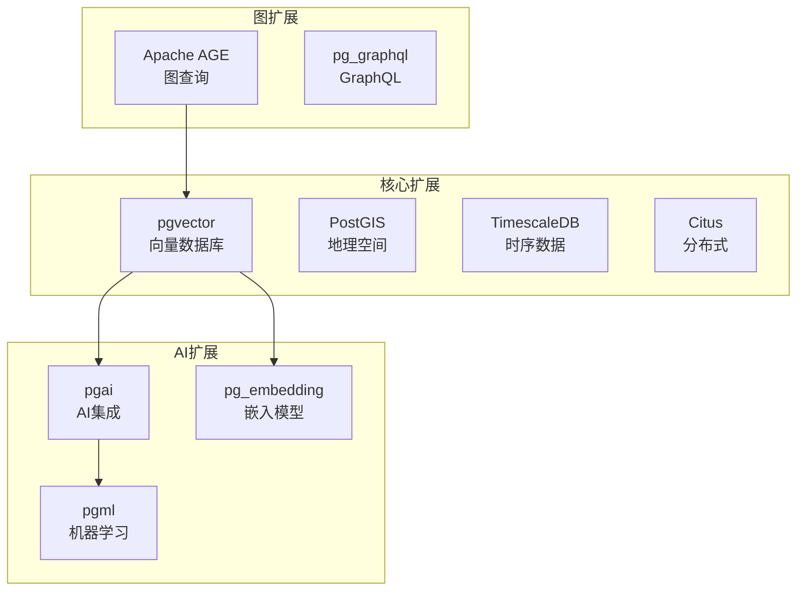

# PostgreSQL扩展：理论框架在PostgreSQL中的应用

> **创建日期**：2025-01-15
> **最后更新**：2025-12-01
> **版本**：v2.0 (增强版)
> **状态**：已完成 ✅

---

## 📋 目录

- [PostgreSQL扩展：理论框架在PostgreSQL中的应用](#postgresql扩展理论框架在postgresql中的应用)
  - [📋 目录](#-目录)
  - [1. 概述](#1-概述)
  - [2. 范畴论框架应用](#2-范畴论框架应用)
    - [2.1. PostgreSQL模式作为范畴](#21-postgresql模式作为范畴)
    - [2.2. 模式映射应用](#22-模式映射应用)
    - [2.3. 查询优化的范畴论方法](#23-查询优化的范畴论方法)
  - [3. 形式化验证应用](#3-形式化验证应用)
    - [3.1. MVCC的形式化验证](#31-mvcc的形式化验证)
    - [3.2. 查询优化的形式化验证](#32-查询优化的形式化验证)
    - [3.3. 事务一致性的形式化验证](#33-事务一致性的形式化验证)
  - [4. 多模型理论应用](#4-多模型理论应用)
    - [4.1. PostgreSQL多模型支持](#41-postgresql多模型支持)
    - [4.2. JSONB的范畴论视角](#42-jsonb的范畴论视角)
    - [4.3. 向量数据的范畴论模型](#43-向量数据的范畴论模型)
  - [5. 知识图谱应用](#5-知识图谱应用)
    - [5.1. PostgreSQL图数据支持](#51-postgresql图数据支持)
    - [5.2. 图查询的SQL扩展](#52-图查询的sql扩展)
  - [6. 实施计划](#6-实施计划)
    - [6.1. 短期计划（1-2个月）](#61-短期计划1-2个月)
    - [6.2. 中期计划（3-6个月）](#62-中期计划3-6个月)
    - [6.3. 长期计划（6-12个月）](#63-长期计划6-12个月)
  - [7. PostgreSQL 2024-2025生态](#7-postgresql-2024-2025生态)
    - [7.1. PostgreSQL扩展生态](#71-postgresql扩展生态)
    - [7.2. PostgreSQL扩展对比矩阵](#72-postgresql扩展对比矩阵)
    - [7.3. PostgreSQL多模态架构](#73-postgresql多模态架构)
  - [8. 参考资料](#8-参考资料)
    - [8.1. 权威文献](#81-权威文献)
    - [8.2. 在线资源](#82-在线资源)
    - [8.3. 相关文档](#83-相关文档)

---

## 1. 概述

本文档将第一阶段建立的理论框架应用到PostgreSQL系统中，扩展PostgreSQL模块的理论深度。

---

## 2. 范畴论框架应用

### 2.1. PostgreSQL模式作为范畴

**模式范畴定义**：

```haskell
-- PostgreSQL模式范畴
data PostgreSQLSchema = PGSchema {
    schemas :: [Schema],
    tables :: [Table],
    foreignKeys :: [ForeignKey],
    constraints :: [Constraint]
}

-- 表作为对象
data Table = Table {
    schema :: Schema,
    name :: TableName,
    columns :: [Column],
    primaryKey :: PrimaryKey
}

-- 外键作为态射
data ForeignKey = ForeignKey {
    fromTable :: Table,
    toTable :: Table,
    columns :: [(Column, Column)]
}
```

### 2.2. 模式映射应用

**版本升级映射**：

```sql
-- 旧模式 v1
CREATE TABLE users (
    id INTEGER PRIMARY KEY,
    name TEXT
);

-- 新模式 v2
CREATE TABLE users (
    id INTEGER PRIMARY KEY,
    first_name TEXT,
    last_name TEXT
);

-- 范畴论映射
mapping :: Schema_v1 -> Schema_v2
mapping Users_v1 = Users_v2
mapping (name) = (first_name, last_name)  -- 列拆分
```

### 2.3. 查询优化的范畴论方法

**查询重写的自然变换**：

```haskell
-- 查询作为自然变换
data QueryNaturalTransformation = QueryNT {
    source :: QueryPlan,
    target :: QueryPlan,
    components :: forall table. Table -> OptimizedPlan
}

-- 选择下推的自然变换
selectPushDown :: QueryNaturalTransformation
selectPushDown = QueryNT {
    source = JoinPlan (SelectPlan table1) table2,
    target = SelectPlan (JoinPlan table1 table2),
    components = \table -> pushSelectDown table
}
```

---

## 3. 形式化验证应用

### 3.1. MVCC的形式化验证

**TLA+规范**：

```tla
EXTENDS Naturals

VARIABLES
    xact_id,
    snapshot,
    visible_rows,
    version_chain

MVCC_Invariant ==
    \A row \in Rows:
        Visible(row, snapshot) <=>
            (row.xmin < snapshot.xmin /\
             (row.xmax = NULL \/ row.xmax > snapshot.xmax))

SnapshotIsolation ==
    \A t \in Transactions:
        \A row \in ReadSet(t):
            Visible(row, snapshot(t))

THEOREM MVCC_Invariant => SnapshotIsolation
```

### 3.2. 查询优化的形式化验证

**Coq证明**：

```coq
Theorem QueryOptimizationCorrectness :
  forall (q : Query) (db : Database),
    execute q db = execute (optimize q) db.
Proof.
  (* 证明优化后的查询与原查询等价 *)
  intros q db.
  apply optimization_equivalence_lemma.
Qed.
```

### 3.3. 事务一致性的形式化验证

**Isabelle证明**：

```isabelle
theorem ACID_properties:
  assumes "transaction_executed t db"
  shows "atomicity t db &
         consistency t db &
         isolation t db &
         durability t db"
proof -
  (* 证明ACID性质 *)
  from assms show ?thesis
    by (rule ACID_theorem)
qed
```

---

## 4. 多模型理论应用

### 4.1. PostgreSQL多模型支持

**统一数据模型**：

```haskell
-- PostgreSQL统一数据模型
data PostgreSQLUnifiedModel = PGUnifiedModel {
    relational :: RelationalModel,
    jsonb :: DocumentModel,
    array :: ArrayModel,
    vector :: VectorModel,
    graph :: GraphModel
}

-- 模型转换
instance ModelTransformer RelationalModel DocumentModel where
    transform (RelationalModel schema) =
        DocumentModel (relationalToJSONB schema)
```

### 4.2. JSONB的范畴论视角

**JSONB作为文档模型**：

```haskell
-- JSONB文档模型
data JSONBDocument = JSONBDoc {
    schema :: JSONBSchema,
    data :: JSONValue
}

-- JSONB查询作为自然变换
jsonbQuery :: QueryNaturalTransformation
jsonbQuery = QueryNT {
    source = JSONBInstance,
    target = FilteredJSONBInstance,
    components = \doc -> filterJSONB doc
}
```

### 4.3. 向量数据的范畴论模型

**向量数据模型**：

```haskell
-- 向量数据模型
data VectorModel = VectorModel {
    vectors :: [Vector],
    dimension :: Int,
    metric :: Metric
}

-- 向量查询作为自然变换
vectorQuery :: QueryNaturalTransformation
vectorQuery = QueryNT {
    source = VectorInstance,
    target = SimilarVectors,
    components = \vec -> findSimilar vec
}
```

---

## 5. 知识图谱应用

### 5.1. PostgreSQL图数据支持

**关系知识图映射**：

```sql
-- 关系数据库表
CREATE TABLE Person (
    id INTEGER PRIMARY KEY,
    name TEXT
);

CREATE TABLE Knows (
    person1_id INTEGER REFERENCES Person(id),
    person2_id INTEGER REFERENCES Person(id)
);

-- 知识图谱表示
-- Person节点类型
-- Knows边类型
```

### 5.2. 图查询的SQL扩展

**图查询SQL**：

```sql
-- 使用PostgreSQL图扩展
SELECT p1.name, p2.name
FROM graph_paths(
    'Person', 'Knows', 'Person',
    start_node => 1,
    max_depth => 3
) gp
JOIN Person p1 ON gp.start_node = p1.id
JOIN Person p2 ON gp.end_node = p2.id;
```

---

## 6. 实施计划

### 6.1. 短期计划（1-2个月）

1. **范畴论框架集成**
   - [ ] 创建PostgreSQL模式范畴分析文档
   - [ ] 实现模式映射的范畴论方法
   - [ ] 添加查询优化的范畴论视角

2. **形式化验证集成**
   - [ ] 创建MVCC的TLA+规范
   - [ ] 实现查询优化的Coq证明
   - [ ] 添加事务一致性的Isabelle证明

### 6.2. 中期计划（3-6个月）

1. **多模型理论集成**
   - [ ] 创建JSONB的范畴论分析
   - [ ] 实现向量数据的范畴论模型
   - [ ] 建立多模型统一框架

2. **知识图谱集成**
   - [ ] 创建关系知识图转换框架
   - [ ] 实现图查询的SQL扩展
   - [ ] 建立知识推理框架

### 6.3. 长期计划（6-12个月）

1. **深度整合**
   - [ ] 实现完整的形式化验证框架
   - [ ] 建立自动化验证工具链
   - [ ] 创建最佳实践指南

---

## 7. PostgreSQL 2024-2025生态

### 7.1. PostgreSQL扩展生态



### 7.2. PostgreSQL扩展对比矩阵

| 扩展 | 用途 | 成熟度 | 社区活跃度 | 推荐指数 |
|------|------|--------|-----------|---------|
| **pgvector** | 向量检索 | ⭐⭐⭐⭐⭐ | 高 | ⭐⭐⭐⭐⭐ |
| **PostGIS** | 地理空间 | ⭐⭐⭐⭐⭐ | 高 | ⭐⭐⭐⭐⭐ |
| **TimescaleDB** | 时序数据 | ⭐⭐⭐⭐⭐ | 高 | ⭐⭐⭐⭐⭐ |
| **Citus** | 分布式 | ⭐⭐⭐⭐ | 高 | ⭐⭐⭐⭐ |
| **Apache AGE** | 图数据库 | ⭐⭐⭐ | 中 | ⭐⭐⭐⭐ |
| **pgml** | 机器学习 | ⭐⭐⭐ | 中 | ⭐⭐⭐ |

### 7.3. PostgreSQL多模态架构

```sql
-- PostgreSQL多模态统一架构示例
CREATE SCHEMA multimodal;

-- 统一实体表
CREATE TABLE multimodal.entities (
    id UUID PRIMARY KEY DEFAULT gen_random_uuid(),
    entity_type VARCHAR(50) NOT NULL,
    -- 关系数据
    structured_data JSONB,
    -- 向量数据
    embedding vector(1536),
    -- 地理数据
    location geometry(Point, 4326),
    -- 时序关联
    time_series_ref BIGINT,
    -- 图关系
    graph_edges UUID[],
    created_at TIMESTAMPTZ DEFAULT CURRENT_TIMESTAMP
);

-- 多模态索引
CREATE INDEX idx_entities_embedding ON multimodal.entities
    USING ivfflat (embedding vector_cosine_ops);
CREATE INDEX idx_entities_location ON multimodal.entities
    USING gist (location);
CREATE INDEX idx_entities_structured ON multimodal.entities
    USING gin (structured_data);

-- 多模态查询函数
CREATE OR REPLACE FUNCTION multimodal.hybrid_search(
    p_query_embedding vector(1536),
    p_location geometry DEFAULT NULL,
    p_filters JSONB DEFAULT '{}'::JSONB,
    p_limit INTEGER DEFAULT 10
)
RETURNS TABLE (
    id UUID,
    entity_type VARCHAR,
    score FLOAT,
    data JSONB
) AS $$
BEGIN
    RETURN QUERY
    SELECT
        e.id,
        e.entity_type,
        (1 - (e.embedding <=> p_query_embedding))::FLOAT AS score,
        e.structured_data AS data
    FROM multimodal.entities e
    WHERE (p_location IS NULL OR ST_DWithin(e.location, p_location, 1000))
      AND (p_filters = '{}' OR e.structured_data @> p_filters)
    ORDER BY e.embedding <=> p_query_embedding
    LIMIT p_limit;
END;
$$ LANGUAGE plpgsql;
```

---

## 8. 参考资料

### 8.1. 权威文献

**PostgreSQL内部**：

- PostgreSQL Global Development Group "PostgreSQL Documentation"
- Momjian, B. "PostgreSQL: Introduction and Concepts"

### 8.2. 在线资源

| 资源 | URL | 描述 |
|------|-----|------|
| **PostgreSQL官网** | <https://www.postgresql.org/> | 官方文档 |
| **pgvector** | <https://github.com/pgvector/pgvector> | 向量扩展 |
| **Citus** | <https://www.citusdata.com/> | 分布式PG |

### 8.3. 相关文档

- [PostgreSQL索引](../../PostgreSQL/INDEX.md)
- [范畴论基础](../01-理论模型/01.01-范畴论基础.md)
- [07-数据库设计实践](../07-数据库设计实践/README.md)

---

**最后更新**：2025-12-01
**维护者**：Data-Science Team
**状态**：已完成 ✅
**版本**：v2.0 (增强版)
