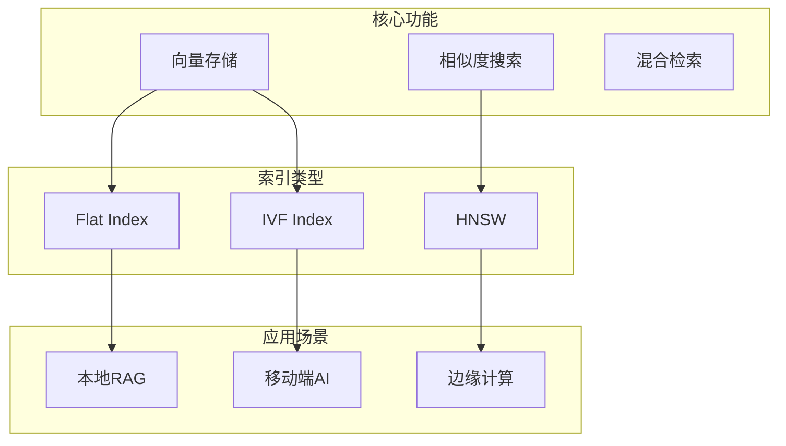
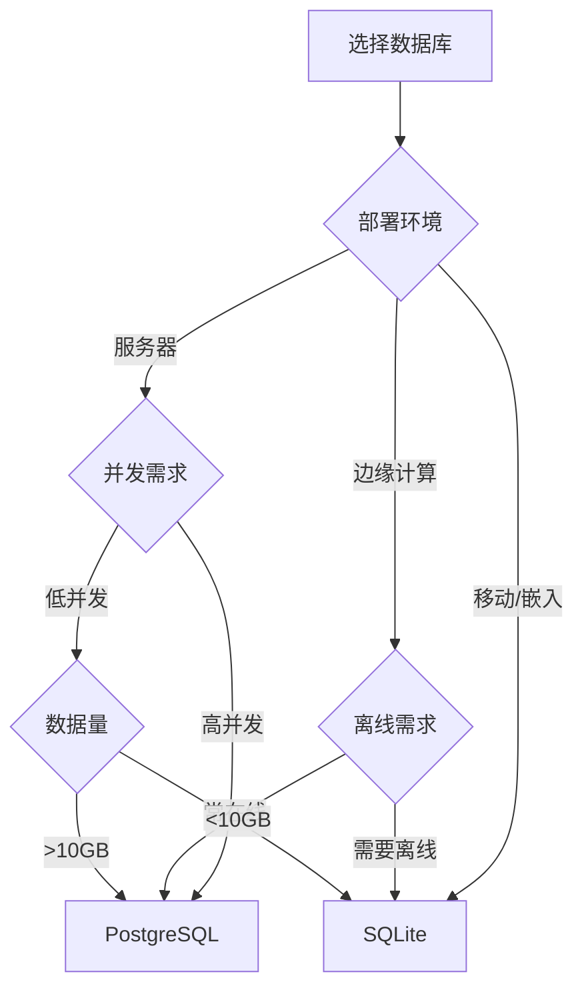
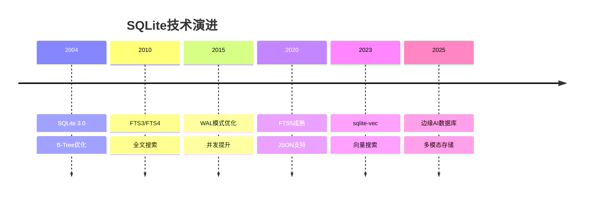

# SQLite扩展：理论框架在SQLite中的应用

> **创建日期**：2025-01-15
> **最后更新**：2025-12-01
> **版本**：v2.0 (增强版)
> **状态**：已完成 ✅

---

## 📋 目录

- [SQLite扩展：理论框架在SQLite中的应用](#sqlite扩展理论框架在sqlite中的应用)
  - [📋 目录](#-目录)
  - [1. 概述](#1-概述)
  - [2. 范畴论设计分析](#2-范畴论设计分析)
    - [2.1. SQLite架构的范畴论视角](#21-sqlite架构的范畴论视角)
    - [2.2. VFS接口的范畴论分析](#22-vfs接口的范畴论分析)
    - [2.3. 设计模式的范畴论视角](#23-设计模式的范畴论视角)
  - [3. 形式化验证应用](#3-形式化验证应用)
    - [3.1. SQLite事务的形式化验证](#31-sqlite事务的形式化验证)
    - [3.2. SQLite设计的正确性证明](#32-sqlite设计的正确性证明)
    - [3.3. 设计决策的形式化验证](#33-设计决策的形式化验证)
  - [4. 设计方法矩阵](#4-设计方法矩阵)
    - [4.1. SQLite设计决策矩阵](#41-sqlite设计决策矩阵)
    - [4.2. SQLite设计原则矩阵](#42-sqlite设计原则矩阵)
    - [4.3. SQLite设计模式矩阵](#43-sqlite设计模式矩阵)
  - [5. 实施计划](#5-实施计划)
    - [5.1. 短期计划（1-2个月）](#51-短期计划1-2个月)
    - [5.2. 中期计划（3-6个月）](#52-中期计划3-6个月)
  - [6. SQLite现代扩展](#6-sqlite现代扩展)
    - [6.1. SQLite向量扩展 (sqlite-vec)](#61-sqlite向量扩展-sqlite-vec)
    - [6.2. SQLite全文搜索 (FTS5)](#62-sqlite全文搜索-fts5)
    - [6.3. SQLite JSON扩展](#63-sqlite-json扩展)
  - [7. SQLite与PostgreSQL对比](#7-sqlite与postgresql对比)
    - [7.1. 特性对比矩阵](#71-特性对比矩阵)
    - [7.2. 选型决策树](#72-选型决策树)
  - [8. 2024-2025最新趋势](#8-2024-2025最新趋势)
    - [8.1. SQLite技术演进](#81-sqlite技术演进)
    - [8.2. SQLite现代应用场景](#82-sqlite现代应用场景)
  - [9. 参考资料](#9-参考资料)
    - [9.1. 权威文献](#91-权威文献)
    - [9.2. 在线资源](#92-在线资源)
    - [9.3. 相关文档](#93-相关文档)

---

## 1. 概述

本文档将第一阶段建立的理论框架应用到SQLite系统中，扩展SQLite模块的理论深度。

---

## 2. 范畴论设计分析

### 2.1. SQLite架构的范畴论视角

**五层架构作为范畴**：

```haskell
-- SQLite架构范畴
data SQLiteArchitecture = SQLiteArch {
    layers :: [Layer],
    morphisms :: [LayerMorphism]
}

-- 层作为对象
data Layer =
    SQLInterface
  | Compiler
  | VirtualMachine
  | Storage
  | OSInterface

-- 层间调用作为态射
data LayerMorphism = LayerMorphism {
    from :: Layer,
    to :: Layer,
    operation :: Operation
}
```

### 2.2. VFS接口的范畴论分析

**VFS作为范畴**：

```haskell
-- VFS范畴
data VFSCategory = VFS {
    objects :: [FileSystem],
    morphisms :: [FileOperation]
}

-- VFS适配器作为函子
vfsAdapter :: VFSCategory -> DatabaseCategory
vfsAdapter = Functor {
    fmap = \fs -> DatabaseFileSystem fs,
    preserve = \op -> True
}
```

### 2.3. 设计模式的范畴论视角

**设计模式作为自然变换**：

```haskell
-- 设计模式作为自然变换
data DesignPattern = Pattern {
    source :: Design,
    target :: Design,
    transformation :: NaturalTransformation
}

-- 工厂模式
factoryPattern :: DesignPattern
factoryPattern = Pattern {
    source = DirectCreation,
    target = FactoryCreation,
    transformation = factoryTransformation
}
```

---

## 3. 形式化验证应用

### 3.1. SQLite事务的形式化验证

**WAL模式规范**：

```tla
VARIABLES
    db_state,
    wal_file,
    checkpoint_state

WAL_Invariant ==
    \A page \in Pages:
        Consistent(db_state, wal_file, page)

WAL_Recovery ==
    \A wal_state \in WALStates:
        Recoverable(wal_state) =>
            Recover(wal_state) = ConsistentState

THEOREM WAL_Invariant => WAL_Recovery
```

### 3.2. SQLite设计的正确性证明

**Coq证明**：

```coq
Theorem SQLiteDesignCorrectness :
  forall (design : SQLiteDesign),
    DesignCorrect design.
Proof.
  (* 证明SQLite设计的正确性 *)
  intros design.
  apply design_correctness_lemma.
Qed.
```

### 3.3. 设计决策的形式化验证

**Isabelle证明**：

```isabelle
theorem design_decision_correctness:
  assumes "decision_made d"
  shows "decision_correct d"
proof -
  (* 证明设计决策的正确性 *)
  from assms show ?thesis
    by (rule decision_correctness_theorem)
qed
```

---

## 4. 设计方法矩阵

### 4.1. SQLite设计决策矩阵

| 设计决策 | 简单性 | 可靠性 | 性能 | 兼容性 | 选择 |
|---------|--------|--------|------|--------|------|
| **单文件数据库** | ⭐⭐⭐⭐⭐ | ⭐⭐⭐⭐ | ⭐⭐⭐ | ⭐⭐⭐⭐⭐ | ✅ |
| **嵌入式架构** | ⭐⭐⭐⭐⭐ | ⭐⭐⭐⭐ | ⭐⭐⭐⭐ | ⭐⭐⭐⭐ | ✅ |
| **B-Tree存储** | ⭐⭐⭐⭐ | ⭐⭐⭐⭐⭐ | ⭐⭐⭐⭐ | ⭐⭐⭐⭐⭐ | ✅ |
| **WAL模式** | ⭐⭐⭐ | ⭐⭐⭐⭐⭐ | ⭐⭐⭐⭐⭐ | ⭐⭐⭐⭐ | ✅ |
| **数据库级锁** | ⭐⭐⭐⭐⭐ | ⭐⭐⭐⭐⭐ | ⭐⭐⭐ | ⭐⭐⭐⭐⭐ | ✅ |

### 4.2. SQLite设计原则矩阵

| 设计原则 | 优先级 | 实现程度 | 影响 |
|---------|--------|---------|------|
| **简单性** | ⭐⭐⭐⭐⭐ | ⭐⭐⭐⭐⭐ | 极高 |
| **可靠性** | ⭐⭐⭐⭐⭐ | ⭐⭐⭐⭐⭐ | 极高 |
| **性能** | ⭐⭐⭐⭐ | ⭐⭐⭐⭐ | 高 |
| **兼容性** | ⭐⭐⭐⭐⭐ | ⭐⭐⭐⭐⭐ | 极高 |

### 4.3. SQLite设计模式矩阵

| 设计模式 | 应用场景 | 实现位置 | 效果 |
|---------|---------|---------|------|
| **工厂模式** | VFS创建 | VFS接口 | ⭐⭐⭐⭐⭐ |
| **策略模式** | 同步策略 | Pager模块 | ⭐⭐⭐⭐ |
| **适配器模式** | 平台适配 | VFS适配器 | ⭐⭐⭐⭐⭐ |
| **观察者模式** | 事件通知 | 回调机制 | ⭐⭐⭐⭐ |

---

## 5. 实施计划

### 5.1. 短期计划（1-2个月）

1. **范畴论分析**
   - [ ] 创建SQLite架构的范畴论分析文档
   - [ ] 实现VFS接口的范畴论视角
   - [ ] 添加设计模式的范畴论分析

2. **形式化验证**
   - [ ] 创建WAL模式的TLA+规范
   - [ ] 实现事务系统的Coq证明
   - [ ] 添加设计决策的Isabelle证明

### 5.2. 中期计划（3-6个月）

1. **设计方法矩阵**
   - [ ] 创建完整的设计决策矩阵
   - [ ] 实现设计原则评估矩阵
   - [ ] 建立设计模式应用矩阵

2. **设计优化**
   - [ ] 基于理论分析优化设计
   - [ ] 实现形式化验证工具
   - [ ] 建立设计最佳实践

---

## 6. SQLite现代扩展

### 6.1. SQLite向量扩展 (sqlite-vec)



**sqlite-vec Schema示例**：

```sql
-- 创建向量表
CREATE VIRTUAL TABLE documents USING vec0(
    embedding float[384]
);

-- 插入向量
INSERT INTO documents(rowid, embedding)
VALUES (1, vec_f32('[0.1, 0.2, ...]'));

-- 相似度搜索
SELECT rowid, distance
FROM documents
WHERE embedding MATCH vec_f32('[0.15, 0.25, ...]')
ORDER BY distance
LIMIT 10;
```

### 6.2. SQLite全文搜索 (FTS5)

```sql
-- 创建FTS5表
CREATE VIRTUAL TABLE articles_fts USING fts5(
    title,
    content,
    tokenize='porter unicode61'
);

-- 混合搜索（FTS5 + 向量）
WITH fts_results AS (
    SELECT rowid, bm25(articles_fts) AS fts_score
    FROM articles_fts
    WHERE articles_fts MATCH 'search query'
),
vec_results AS (
    SELECT rowid, distance AS vec_score
    FROM documents
    WHERE embedding MATCH ?
    LIMIT 100
)
SELECT
    f.rowid,
    (0.5 * (1 - f.fts_score) + 0.5 * (1 - v.vec_score)) AS combined_score
FROM fts_results f
JOIN vec_results v ON f.rowid = v.rowid
ORDER BY combined_score DESC
LIMIT 10;
```

### 6.3. SQLite JSON扩展

```sql
-- JSON数据操作
CREATE TABLE events (
    id INTEGER PRIMARY KEY,
    data JSON NOT NULL,
    created_at TEXT DEFAULT CURRENT_TIMESTAMP
);

-- JSON查询
SELECT
    json_extract(data, '$.user.name') AS user_name,
    json_extract(data, '$.event_type') AS event_type
FROM events
WHERE json_extract(data, '$.event_type') = 'click';

-- JSON聚合
SELECT
    json_group_array(json_object('id', id, 'type', json_extract(data, '$.event_type')))
FROM events;
```

---

## 7. SQLite与PostgreSQL对比

### 7.1. 特性对比矩阵

| 特性 | SQLite | PostgreSQL | 适用场景 |
|------|--------|------------|---------|
| **部署** | 嵌入式 | 服务器 | SQLite: 移动/边缘 |
| **并发** | 单写多读 | 多写多读 | PG: 高并发 |
| **向量** | sqlite-vec | pgvector | PG: 生产级 |
| **全文** | FTS5 | tsvector | 相当 |
| **JSON** | 内置 | JSONB | PG更强大 |
| **事务** | ACID | ACID | 相当 |
| **大小** | <1MB | >100MB | SQLite极轻量 |

### 7.2. 选型决策树



---

## 8. 2024-2025最新趋势

### 8.1. SQLite技术演进



### 8.2. SQLite现代应用场景

| 应用场景 | 技术栈 | SQLite角色 |
|---------|--------|-----------|
| **移动端RAG** | sqlite-vec + LLM | 本地知识库 |
| **边缘AI** | SQLite + TFLite | 特征存储 |
| **桌面应用** | Electron + SQLite | 本地数据 |
| **IoT设备** | SQLite | 传感器缓存 |
| **Web应用** | WASM SQLite | 浏览器存储 |

---

## 9. 参考资料

### 9.1. 权威文献

**SQLite设计**：

- Hipp, D.R. "The Design of SQLite"
- SQLite官方文档 "Architecture of SQLite"

### 9.2. 在线资源

| 资源 | URL | 描述 |
|------|-----|------|
| **SQLite官网** | <https://sqlite.org> | 官方文档 |
| **sqlite-vec** | <https://github.com/asg017/sqlite-vec> | 向量扩展 |
| **FTS5** | <https://sqlite.org/fts5.html> | 全文搜索 |

### 9.3. 相关文档

- [SQLite索引](../../Sqlite/INDEX.md)
- [SQLite设计模型](../../Sqlite/12-设计模型/)
- [范畴论基础](../01-理论模型/01.01-范畴论基础.md)
- [07.10-向量数据库设计](../07-数据库设计实践/07.10-向量数据库设计.md)

---

**最后更新**：2025-12-01
**维护者**：Data-Science Team
**状态**：已完成 ✅
**版本**：v2.0 (增强版)
