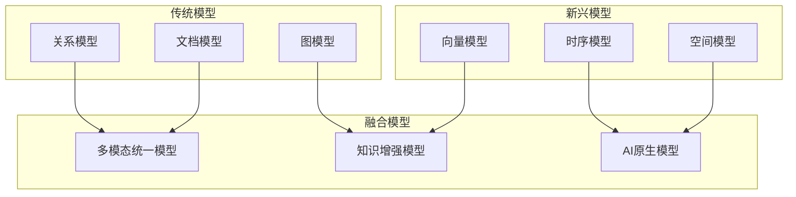

# 数据模型理论体系扩展：理论框架的全面应用

> **创建日期**：2025-01-15
> **最后更新**：2025-12-01
> **版本**：v2.0 (增强版)
> **状态**：已完成 ✅

---

## 📋 目录

- [数据模型理论体系扩展：理论框架的全面应用](#数据模型理论体系扩展理论框架的全面应用)
  - [📋 目录](#-目录)
  - [1. 概述](#1-概述)
  - [2. 范畴论模型扩展](#2-范畴论模型扩展)
    - [2.1. 数据模型的范畴论表示](#21-数据模型的范畴论表示)
    - [2.2. 模型转换的函子表示](#22-模型转换的函子表示)
  - [3. 多模型理论扩展](#3-多模型理论扩展)
    - [3.1. 统一数据模型框架](#31-统一数据模型框架)
    - [3.2. 跨模型查询优化](#32-跨模型查询优化)
  - [4. 形式化验证扩展](#4-形式化验证扩展)
    - [4.1. 数据模型的形式化规范](#41-数据模型的形式化规范)
    - [4.2. 模型转换的正确性证明](#42-模型转换的正确性证明)
  - [5. 知识图谱扩展](#5-知识图谱扩展)
    - [5.1. 数据模型到知识图谱的映射](#51-数据模型到知识图谱的映射)
    - [5.2. 知识推理框架](#52-知识推理框架)
  - [6. 实施计划](#6-实施计划)
    - [6.1. 短期计划（1-2个月）](#61-短期计划1-2个月)
    - [6.2. 中期计划（3-6个月）](#62-中期计划3-6个月)
  - [7. 2024-2025数据模型趋势](#7-2024-2025数据模型趋势)
    - [7.1. 多模态数据模型](#71-多模态数据模型)
    - [7.2. 数据模型演进矩阵](#72-数据模型演进矩阵)
    - [7.3. 统一数据模型架构](#73-统一数据模型架构)
  - [8. 参考资料](#8-参考资料)
    - [8.1. 权威文献](#81-权威文献)
    - [8.2. 在线资源](#82-在线资源)
    - [8.3. 相关文档](#83-相关文档)

---

## 1. 概述

本文档将第一阶段建立的理论框架全面应用到数据模型理论体系中，建立完整的理论框架。

---

## 2. 范畴论模型扩展

### 2.1. 数据模型的范畴论表示

**统一数据模型范畴**：

```haskell
-- 数据模型范畴
data DataModelCategory = DataModelCat {
    models :: [DataModel],
    transformations :: [ModelTransformation]
}

-- 数据模型类型
data DataModel =
    RelationalModel Schema
  | DocumentModel DocumentSchema
  | GraphModel GraphSchema
  | KeyValueModel KeyValueSchema
  | TimeSeriesModel TimeSeriesSchema
  | VectorModel VectorSchema

-- 模型转换作为态射
data ModelTransformation = ModelTrans {
    source :: DataModel,
    target :: DataModel,
    mapping :: Functor
}
```

### 2.2. 模型转换的函子表示

**转换函子**：

```haskell
-- 模型转换函子
class ModelTransformer a b where
    transformSchema :: Schema a -> Schema b
    transformInstance :: Instance a -> Instance b
    transformQuery :: Query b -> Query a

-- 关系模型到文档模型
instance ModelTransformer RelationalModel DocumentModel where
    transformSchema = relationalToDocumentSchema
    transformInstance = relationalToDocumentInstance
    transformQuery = documentToRelationalQuery
```

---

## 3. 多模型理论扩展

### 3.1. 统一数据模型框架

**统一框架定义**：

```haskell
-- 统一数据模型框架
data UnifiedDataModelFramework = UnifiedFramework {
    models :: [DataModel],
    mappings :: [ModelMapping],
    queries :: [UnifiedQuery],
    transactions :: [UnifiedTransaction]
}

-- 统一查询接口
class UnifiedQueryInterface q where
    type Model q :: DataModelType
    type Result q :: *

    execute :: q -> Instance (Model q) -> Result q
    optimize :: q -> q
    validate :: q -> Bool
```

### 3.2. 跨模型查询优化

**跨模型查询计划**：

```text
跨模型查询优化：
  1. 识别涉及的模型
  2. 选择最优执行模型
  3. 生成模型特定查询
  4. 执行查询
  5. 转换结果
  6. 合并结果
```

---

## 4. 形式化验证扩展

### 4.1. 数据模型的形式化规范

**TLA+规范**：

```tla
VARIABLES
    data_models,
    model_instances,
    model_transformations

DataModelInvariant ==
    \A model \in data_models:
        Consistent(model, model_instances[model])

ModelTransformationCorrect ==
    \A trans \in model_transformations:
        PreservesSemantics(trans)

THEOREM DataModelInvariant => ModelTransformationCorrect
```

### 4.2. 模型转换的正确性证明

**Coq证明**：

```coq
Theorem ModelTransformationCorrectness :
  forall (m1 m2 : DataModel) (trans : ModelTransformation m1 m2),
    TransformationCorrect trans.
Proof.
  (* 证明模型转换的正确性 *)
  intros m1 m2 trans.
  apply transformation_correctness_lemma.
Qed.
```

---

## 5. 知识图谱扩展

### 5.1. 数据模型到知识图谱的映射

**映射框架**：

```haskell
-- 数据模型到知识图谱的映射
class ToKnowledgeGraph a where
    toKnowledgeGraph :: a -> KnowledgeGraph

-- 关系模型到知识图谱
instance ToKnowledgeGraph RelationalModel where
    toKnowledgeGraph (RelationalModel schema) =
        KnowledgeGraph {
            entities = tablesToEntities schema,
            relations = foreignKeysToRelations schema,
            triples = generateTriples schema
        }
```

### 5.2. 知识推理框架

**推理规则**：

```haskell
-- 知识推理规则
data InferenceRule = InferenceRule {
    premise :: [Triple],
    conclusion :: Triple
}

-- 推理引擎
infer :: [InferenceRule] -> KnowledgeGraph -> KnowledgeGraph
infer rules kg =
    foldl applyRule kg rules
```

---

## 6. 实施计划

### 6.1. 短期计划（1-2个月）

1. **范畴论模型**
   - [ ] 创建数据模型的范畴论表示
   - [ ] 实现模型转换的函子框架
   - [ ] 添加查询的自然变换表示

2. **多模型理论**
   - [ ] 创建统一数据模型框架
   - [ ] 实现跨模型查询优化
   - [ ] 建立模型转换框架

### 6.2. 中期计划（3-6个月）

1. **形式化验证**
   - [ ] 创建数据模型的TLA+规范
   - [ ] 实现模型转换的Coq证明
   - [ ] 建立形式化验证框架

2. **知识图谱**
   - [ ] 创建数据模型到知识图谱的映射
   - [ ] 实现知识推理框架
   - [ ] 建立图查询框架

---

## 7. 2024-2025数据模型趋势

### 7.1. 多模态数据模型



### 7.2. 数据模型演进矩阵

| 模型类型 | 传统特征 | 2025趋势 | 代表技术 |
|---------|---------|---------|---------|
| **关系模型** | 结构化、ACID | AI增强查询 | PostgreSQL+AI |
| **文档模型** | 半结构化、灵活 | 向量融合 | MongoDB Atlas |
| **图模型** | 关系推理 | 知识图谱 | Neo4j+GQL |
| **向量模型** | 语义检索 | 多模态 | pgvector/Pinecone |
| **时序模型** | 时间序列 | 实时ML | TimescaleDB |

### 7.3. 统一数据模型架构

```sql
-- 统一数据模型Schema示例
CREATE SCHEMA unified_model;

-- 实体统一表
CREATE TABLE unified_model.entities (
    entity_id UUID PRIMARY KEY DEFAULT gen_random_uuid(),
    entity_type VARCHAR(50) NOT NULL,  -- relational, document, graph, vector
    data_content JSONB NOT NULL,
    embedding vector(1536),  -- 向量表示
    graph_links UUID[],  -- 图关系
    time_series_id BIGINT,  -- 时序关联
    created_at TIMESTAMPTZ DEFAULT CURRENT_TIMESTAMP
);

-- 统一查询接口
CREATE OR REPLACE FUNCTION unified_model.query(
    p_query_type VARCHAR,
    p_query_params JSONB
)
RETURNS JSONB AS $$
BEGIN
    CASE p_query_type
        WHEN 'relational' THEN
            RETURN unified_model.relational_query(p_query_params);
        WHEN 'vector' THEN
            RETURN unified_model.vector_query(p_query_params);
        WHEN 'graph' THEN
            RETURN unified_model.graph_query(p_query_params);
        ELSE
            RAISE EXCEPTION 'Unknown query type: %', p_query_type;
    END CASE;
END;
$$ LANGUAGE plpgsql;
```

---

## 8. 参考资料

### 8.1. 权威文献

**数据模型理论**：

- Abiteboul, S. et al. "Foundations of Databases"
- Date, C.J. "An Introduction to Database Systems"

### 8.2. 在线资源

| 资源 | URL | 描述 |
|------|-----|------|
| **CMU 15-445** | <https://15445.courses.cs.cmu.edu/> | 数据库系统 |
| **Stanford DB** | <https://cs.stanford.edu/people/widom/DB-mooc.html> | 数据库理论 |

### 8.3. 相关文档

- [范畴论基础](../01-理论模型/01.01-范畴论基础.md)
- [多模型数据库理论](../01-理论模型/01.03-多模型数据库理论.md)
- [06-数据模型理论体系](../06-数据模型理论体系/README.md)

---

**最后更新**：2025-12-01
**维护者**：Data-Science Team
**状态**：已完成 ✅
**版本**：v2.0 (增强版)
