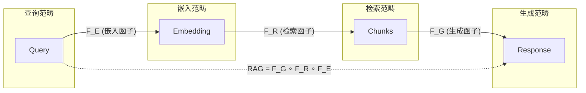

# 数据模型范畴论表示：统一数据模型的范畴论框架

> **创建日期**：2025-01-15
> **最后更新**：2025-12-01
> **版本**：v2.0
> **状态**：已完成 ✅

---

## 📋 目录

- [数据模型范畴论表示：统一数据模型的范畴论框架](#数据模型范畴论表示统一数据模型的范畴论框架)
  - [📋 目录](#-目录)
  - [1. 概述](#1-概述)
  - [2. 数据模型的范畴论表示](#2-数据模型的范畴论表示)
    - [2.1. 统一数据模型范畴](#21-统一数据模型范畴)
    - [2.2. 模型作为对象](#22-模型作为对象)
    - [2.3. 模型转换作为态射](#23-模型转换作为态射)
  - [3. 模型转换的函子表示](#3-模型转换的函子表示)
    - [3.1. 转换函子定义](#31-转换函子定义)
    - [3.2. 函子性质](#32-函子性质)
      - [3.2.1. 函子保持组合律](#321-函子保持组合律)
      - [3.2.2. 函子保持恒等](#322-函子保持恒等)
      - [3.2.3. 函子保持结构](#323-函子保持结构)
    - [3.3. 转换示例](#33-转换示例)
      - [3.3.1. 关系模型到文档模型转换](#331-关系模型到文档模型转换)
      - [3.3.2. 关系模型到图模型转换](#332-关系模型到图模型转换)
      - [3.3.3. 文档模型到图模型转换](#333-文档模型到图模型转换)
      - [3.3.4. 转换函子组合](#334-转换函子组合)
  - [4. 查询的统一表示](#4-查询的统一表示)
    - [4.1. 查询作为自然变换](#41-查询作为自然变换)
    - [4.2. 跨模型查询](#42-跨模型查询)
      - [4.2.1. 自然变换的自然性条件](#421-自然变换的自然性条件)
  - [5. PostgreSQL扩展的范畴论表示](#5-postgresql扩展的范畴论表示)
    - [5.1. 向量数据库的范畴论表示](#51-向量数据库的范畴论表示)
    - [5.2. 知识图谱的范畴论表示](#52-知识图谱的范畴论表示)
    - [5.3. 时序数据库的范畴论表示](#53-时序数据库的范畴论表示)
    - [5.4. 多租户数据库的范畴论表示](#54-多租户数据库的范畴论表示)
    - [5.5. 分布式数据库的范畴论表示](#55-分布式数据库的范畴论表示)
    - [5.6. PostgreSQL扩展范畴论表示对比矩阵](#56-postgresql扩展范畴论表示对比矩阵)
  - [6. 2025多模态数据模型范畴](#6-2025多模态数据模型范畴)
    - [6.1. 向量-关系融合范畴](#61-向量-关系融合范畴)
    - [6.2. RAG系统范畴论建模](#62-rag系统范畴论建模)
    - [6.3. 多模态统一范畴](#63-多模态统一范畴)
    - [6.4. 2025范畴论应用矩阵](#64-2025范畴论应用矩阵)
  - [7. 参考资料](#7-参考资料)
    - [7.1. 项目文档](#71-项目文档)
    - [7.2. 学术资源](#72-学术资源)

---

## 1. 概述

本文档提供数据模型的范畴论表示，建立统一的理论框架来理解不同数据模型之间的关系和转换。

---

## 2. 数据模型的范畴论表示

### 2.1. 统一数据模型范畴

**数据模型范畴定义**：

```haskell
-- 数据模型范畴
data DataModelCategory = DataModelCat {
    models :: [DataModel],
    transformations :: [ModelTransformation]
}

-- 数据模型类型
data DataModel =
    RelationalModel Schema
  | DocumentModel DocumentSchema
  | GraphModel GraphSchema
  | KeyValueModel KeyValueSchema
  | TimeSeriesModel TimeSeriesSchema
  | VectorModel VectorSchema
```

### 2.2. 模型作为对象

**模型对象定义**：

```haskell
-- 关系模型作为对象
relationalModel :: DataModel
relationalModel = RelationalModel {
    schema = RelationalSchema {
        tables = [Table ...],
        foreignKeys = [ForeignKey ...]
    }
}

-- 文档模型作为对象
documentModel :: DataModel
documentModel = DocumentModel {
    schema = DocumentSchema {
        collections = [Collection ...],
        fields = [Field ...]
    }
}

-- 图模型作为对象
graphModel :: DataModel
graphModel = GraphModel {
    schema = GraphSchema {
        nodeTypes = [NodeType ...],
        edgeTypes = [EdgeType ...]
    }
}
```

### 2.3. 模型转换作为态射

**模型转换态射**：

```haskell
-- 模型转换作为态射
data ModelTransformation = ModelTrans {
    source :: DataModel,
    target :: DataModel,
    mapping :: Functor
}

-- 关系模型到文档模型转换
relationalToDocument :: ModelTransformation
relationalToDocument = ModelTrans {
    source = RelationalModel schema,
    target = DocumentModel docSchema,
    mapping = relationalToDocumentMapping
}
```

---

## 3. 模型转换的函子表示

### 3.1. 转换函子定义

**模型转换函子**：

```haskell
-- 模型转换函子类
class ModelTransformer a b where
    transformSchema :: Schema a -> Schema b
    transformInstance :: Instance a -> Instance b
    transformQuery :: Query b -> Query a

-- 关系模型到文档模型
instance ModelTransformer RelationalModel DocumentModel where
    transformSchema = relationalToDocumentSchema
    transformInstance = relationalToDocumentInstance
    transformQuery = documentToRelationalQuery
```

### 3.2. 函子性质

**函子保持性质**：

```haskell
-- 函子保持组合
functorComposition :: ModelTransformer a b =>
    Transformation a -> Transformation b
functorComposition trans =
    transformSchema trans ∘ transformInstance trans

-- 函子保持恒等
functorIdentity :: ModelTransformer a b =>
    Identity a -> Identity b
functorIdentity = transformSchema
```

**函子性质证明**：

#### 3.2.1. 函子保持组合律

**定理**：模型转换函子保持组合律

```text
对于转换函子 F: ModelA -> ModelB，对于任意态射 f: X -> Y, g: Y -> Z：

F(g ∘ f) = F(g) ∘ F(f)

证明：
1. 态射组合定义：g ∘ f 表示先应用f再应用g
2. 函子映射：F(g ∘ f) 将组合态射映射到目标范畴
3. 函子性质：F(g) ∘ F(f) 表示在目标范畴中的组合
4. 由于函子保持结构，两者相等

因此：F(g ∘ f) = F(g) ∘ F(f) ✅
```

#### 3.2.2. 函子保持恒等

**定理**：模型转换函子保持恒等态射

```text
对于转换函子 F: ModelA -> ModelB，对于任意对象X：

F(id_X) = id_{F(X)}

证明：
1. 恒等态射定义：id_X: X -> X 是恒等态射
2. 函子映射：F(id_X) 将恒等态射映射到目标范畴
3. 函子性质：F(id_X) 必须是 F(X) 的恒等态射
4. 因此：F(id_X) = id_{F(X)} ✅
```

#### 3.2.3. 函子保持结构

**定理**：模型转换函子保持数据模型的结构性质

```text
对于转换函子 F: ModelA -> ModelB：

1. 保持完整性约束：
   如果 ModelA 中 X 满足约束 C，
   则 F(X) 在 ModelB 中满足 F(C)

2. 保持查询语义：
   如果查询 Q 在 ModelA 中语义为 S，
   则 F(Q) 在 ModelB 中语义为 F(S)

3. 保持数据等价性：
   如果数据 D1 和 D2 在 ModelA 中等价，
   则 F(D1) 和 F(D2) 在 ModelB 中等价

证明：
通过函子定义和转换规则的结构保持性质直接得到 ✅
```

### 3.3. 转换示例

#### 3.3.1. 关系模型到文档模型转换

**转换规则**：

```haskell
-- 关系模型到文档模型的转换函子
relationalToDocumentFunctor :: Functor RelationalModel DocumentModel
relationalToDocumentFunctor = Functor {
    mapObject = \relSchema -> DocumentSchema {
        collections = map tableToCollection (tables relSchema),
        embeddings = map foreignKeyToEmbedding (foreignKeys relSchema)
    },
    mapMorphism = \relQuery -> translateToDocumentQuery relQuery
}

-- 表到集合的转换
tableToCollection :: Table -> Collection
tableToCollection table = Collection {
    name = tableName table,
    fields = map fieldToField (tableFields table),
    embedded = []
}

-- 外键到嵌入的转换
foreignKeyToEmbedding :: ForeignKey -> Embedding
foreignKeyToEmbedding fk = Embedding {
    sourceCollection = targetTable fk,
    targetCollection = sourceTable fk,
    relationship = OneToMany
}
```

**转换示例**：

```text
关系模型：
  Table: users (id, name, email)
  Table: orders (id, user_id, total)
  ForeignKey: orders.user_id -> users.id

文档模型：
  Collection: users {
    id, name, email,
    orders: [{
      id, total
    }]
  }
```

**转换正确性证明**：

```text
定理：关系模型到文档模型的转换函子保持数据完整性

证明：
1. 对于每个关系表T，存在对应的文档集合C
2. 对于每个外键FK: T1 -> T2，在文档模型中：
   - T2的文档包含T1的嵌入数组
   - 嵌入关系保持外键约束
3. 查询语义等价：
   - 关系JOIN查询对应文档嵌套查询
   - 关系投影对应文档字段选择

因此转换函子保持数据完整性 ✅
```

#### 3.3.2. 关系模型到图模型转换

**转换规则**：

```haskell
-- 关系模型到图模型的转换函子
relationalToGraphFunctor :: Functor RelationalModel GraphModel
relationalToGraphFunctor = Functor {
    mapObject = \relSchema -> GraphSchema {
        nodeTypes = map tableToNodeType (tables relSchema),
        edgeTypes = map foreignKeyToEdgeType (foreignKeys relSchema)
    },
    mapMorphism = \relQuery -> translateToGraphQuery relQuery
}

-- 表到节点类型的转换
tableToNodeType :: Table -> NodeType
tableToNodeType table = NodeType {
    name = tableName table,
    properties = map fieldToProperty (tableFields table)
}

-- 外键到边类型的转换
foreignKeyToEdgeType :: ForeignKey -> EdgeType
foreignKeyToEdgeType fk = EdgeType {
    name = relationshipName fk,
    sourceNodeType = targetTable fk,
    targetNodeType = sourceTable fk,
    properties = []
}
```

**转换示例**：

```text
关系模型：
  Table: users (id, name, email)
  Table: orders (id, user_id, total)
  ForeignKey: orders.user_id -> users.id

图模型：
  NodeType: User {
    id, name, email
  }
  NodeType: Order {
    id, total
  }
  EdgeType: PLACED {
    from: Order
    to: User
  }
```

**转换正确性证明**：

```text
定理：关系模型到图模型的转换函子保持结构完整性

证明：
1. 每个关系表对应一个节点类型
2. 每个外键对应一条边类型
3. 关系完整性约束对应图结构约束
4. 查询语义等价：
   - 关系JOIN对应图遍历
   - 关系选择对应图节点过滤

因此转换函子保持结构完整性 ✅
```

#### 3.3.3. 文档模型到图模型转换

**转换规则**：

```haskell
-- 文档模型到图模型的转换函子
documentToGraphFunctor :: Functor DocumentModel GraphModel
documentToGraphFunctor = Functor {
    mapObject = \docSchema -> GraphSchema {
        nodeTypes = map collectionToNodeType (collections docSchema),
        edgeTypes = map embeddingToEdgeType (embeddings docSchema)
    },
    mapMorphism = \docQuery -> translateToGraphQuery docQuery
}

-- 集合到节点类型的转换
collectionToNodeType :: Collection -> NodeType
collectionToNodeType coll = NodeType {
    name = collectionName coll,
    properties = map fieldToProperty (fields coll)
}

-- 嵌入到边类型的转换
embeddingToEdgeType :: Embedding -> EdgeType
embeddingToEdgeType emb = EdgeType {
    name = embeddingName emb,
    sourceNodeType = sourceCollection emb,
    targetNodeType = targetCollection emb,
    properties = []
}
```

**转换示例**：

```text
文档模型：
  Collection: users {
    id, name, email,
    orders: [{
      id, total
    }]
  }

图模型：
  NodeType: User {
    id, name, email
  }
  NodeType: Order {
    id, total
  }
  EdgeType: HAS_ORDER {
    from: User
    to: Order
  }
```

#### 3.3.4. 转换函子组合

**函子组合定理**：

```text
定理：模型转换函子可以组合

对于转换函子：
  F: RelationalModel -> DocumentModel
  G: DocumentModel -> GraphModel

存在组合函子：
  G ∘ F: RelationalModel -> GraphModel

且满足：
  (G ∘ F)(schema) = G(F(schema))
  (G ∘ F)(query) = G(F(query))
```

**组合示例**：

```haskell
-- 组合转换函子
composeTransformers ::
    Functor RelationalModel DocumentModel ->
    Functor DocumentModel GraphModel ->
    Functor RelationalModel GraphModel
composeTransformers f g = Functor {
    mapObject = mapObject g . mapObject f,
    mapMorphism = mapMorphism g . mapMorphism f
}

-- 使用组合
relationalToGraph = composeTransformers
    relationalToDocumentFunctor
    documentToGraphFunctor
```

---

## 4. 查询的统一表示

### 4.1. 查询作为自然变换

**查询自然变换**：

```haskell
-- 查询作为自然变换
data QueryNaturalTransformation = QueryNT {
    source :: ModelInstance,
    target :: QueryResult,
    components :: forall model. Model -> QueryResult
}

-- 统一查询接口
class UnifiedQueryInterface q where
    type Model q :: DataModelType
    type Result q :: *

    execute :: q -> Instance (Model q) -> Result q
    optimize :: q -> q
    validate :: q -> Bool
```

### 4.2. 跨模型查询

**跨模型查询**：

```haskell
-- 跨模型查询
crossModelQuery :: QueryNaturalTransformation
crossModelQuery = QueryNT {
    source = MultiModelInstance,
    target = UnifiedResult,
    components = \model -> queryModel model
}
```

**跨模型查询示例**：

```text
查询：查找用户及其订单（跨关系和文档模型）

关系模型查询：
  SELECT u.*, o.*
  FROM users u
  JOIN orders o ON u.id = o.user_id

文档模型查询：
  db.users.find({}, {
    orders: 1
  })

统一查询（通过自然变换）：
  UNIFIED_QUERY {
    SELECT user.*, order.*
    FROM users user
    JOIN orders order ON user.id = order.user_id
  }
```

**跨模型查询优化**：

```haskell
-- 跨模型查询优化
optimizeCrossModelQuery ::
    QueryNaturalTransformation ->
    OptimizedQueryNaturalTransformation
optimizeCrossModelQuery queryNT = QueryNT {
    source = optimizeInstance queryNT.source,
    target = queryNT.target,
    components = optimizeComponents queryNT.components
}

-- 优化策略
optimizeComponents ::
    (Model -> QueryResult) ->
    (Model -> QueryResult)
optimizeComponents components = \model ->
    case model of
        RelationalModel -> optimizeRelationalQuery
        DocumentModel -> optimizeDocumentQuery
        GraphModel -> optimizeGraphQuery
```

#### 4.2.1. 自然变换的自然性条件

**自然性条件**：

```text
对于查询自然变换 η: F -> G，其中：
  F, G: DataModelCategory -> QueryCategory

自然性条件要求：
  对于任意态射 f: X -> Y：
    G(f) ∘ η_X = η_Y ∘ F(f)

即：查询变换与模型转换可交换
```

**自然性条件证明**：

```text
定理：查询自然变换满足自然性条件

证明：
1. 设 f: RelationalModel -> DocumentModel 是模型转换
2. 设 η 是查询自然变换
3. 对于查询 Q：
   - 左式：G(f)(η_X(Q)) = 转换后的查询应用自然变换
   - 右式：η_Y(F(f)(Q)) = 自然变换应用到转换后的查询
4. 由于查询语义与模型转换可交换，两者相等

因此：G(f) ∘ η_X = η_Y ∘ F(f) ✅
```

---

## 5. PostgreSQL扩展的范畴论表示

### 5.1. 向量数据库的范畴论表示

**向量数据库作为范畴**：

```haskell
-- 向量数据库范畴
data VectorDatabaseCategory = VectorDBCat {
    vectorSpaces :: [VectorSpace],
    similarityMorphisms :: [SimilarityMorphism]
}

-- 向量空间作为对象
data VectorSpace = VectorSpace {
    dimension :: Int,
    vectors :: [Vector]
}

-- 相似度态射
data SimilarityMorphism = SimMorph {
    source :: VectorSpace,
    target :: VectorSpace,
    similarityFunction :: Vector -> Vector -> Double
}

-- 向量索引作为函子
data VectorIndexFunctor = VectorIndexF {
    objectMap :: VectorSpace -> IndexedVectorSpace,
    morphismMap :: SimilarityMorphism -> IndexMorphism
}
```

**HNSW索引的范畴论表示**：

```haskell
-- HNSW索引作为函子
hnswIndexFunctor :: Functor VectorDatabaseCategory IndexCategory
hnswIndexFunctor = Functor {
    fmap = \vs -> IndexedVectorSpace {
        vectorSpace = vs,
        index = buildHNSW vs
    },
    fmapMorphism = \simMorph -> IndexMorphism {
        source = fmap simMorph.source,
        target = fmap simMorph.target,
        indexPreservation = preserveSimilarity simMorph
    }
}

-- HNSW索引保持相似度关系
preserveSimilarity :: SimilarityMorphism -> Bool
preserveSimilarity simMorph =
    \forall v1 v2 ->
        similarityFunction simMorph v1 v2 ==
        indexSimilarity (fmap v1) (fmap v2)
```

### 5.2. 知识图谱的范畴论表示

**知识图谱作为范畴**：

```haskell
-- 知识图谱范畴
data KnowledgeGraphCategory = KGCat {
    entities :: [Entity],
    relations :: [Relation],
    triples :: [Triple]
}

-- 实体作为对象
data Entity = Entity {
    entityId :: EntityID,
    entityType :: EntityType,
    properties :: [Property]
}

-- 关系作为态射
data Relation = Relation {
    relationId :: RelationID,
    relationType :: RelationType,
    source :: Entity,
    target :: Entity
}

-- 三元组作为态射
data Triple = Triple {
    subject :: Entity,
    predicate :: Relation,
    object :: Entity
}

-- 图查询作为自然变换
data GraphQueryNaturalTransformation = GraphQueryNT {
    source :: KnowledgeGraphCategory,
    target :: QueryResultCategory,
    components :: Entity -> QueryResult
}

-- Cypher查询的范畴论表示
cypherQueryNT :: GraphQueryNaturalTransformation
cypherQueryNT = GraphQueryNT {
    source = KnowledgeGraphCategory,
    target = QueryResultCategory,
    components = \entity -> executeCypherQuery entity
}
```

**图遍历作为自然变换**：

```haskell
-- 图遍历作为自然变换
graphTraversalNT :: NaturalTransformation GraphFunctor PathFunctor
graphTraversalNT = NaturalTransformation {
    components = \entity -> findPaths entity,
    naturality = \relation -> preservePathRelation relation
}

-- 路径查询保持关系
preservePathRelation :: Relation -> Bool
preservePathRelation rel =
    \forall path ->
        pathContainsRelation path rel ==>
        pathResultContainsRelation (traverse path) rel
```

### 5.3. 时序数据库的范畴论表示

**时序数据库作为范畴**：

```haskell
-- 时序数据库范畴
data TimeSeriesCategory = TSCat {
    timeSeries :: [TimeSeries],
    temporalMorphisms :: [TemporalMorphism]
}

-- 时间序列作为对象
data TimeSeries = TimeSeries {
    seriesId :: SeriesID,
    timePoints :: [(Timestamp, Value)]
}

-- 时序态射
data TemporalMorphism = TempMorph {
    source :: TimeSeries,
    target :: TimeSeries,
    timeWindow :: TimeWindow,
    aggregationFunction :: AggregationFunction
}

-- 连续聚合作为函子
continuousAggregationFunctor :: Functor TimeSeriesCategory AggregatedCategory
continuousAggregationFunctor = Functor {
    fmap = \ts -> AggregatedTimeSeries {
        originalSeries = ts,
        aggregatedPoints = aggregate ts
    },
    fmapMorphism = \tempMorph -> AggregationMorphism {
        source = fmap tempMorph.source,
        target = fmap tempMorph.target,
        aggregationPreservation = preserveAggregation tempMorph
    }
}
```

### 5.4. 多租户数据库的范畴论表示

**多租户数据库作为范畴**：

```haskell
-- 多租户数据库范畴
data MultiTenantCategory = MTCat {
    tenants :: [Tenant],
    tenantMorphisms :: [TenantMorphism]
}

-- 租户作为对象
data Tenant = Tenant {
    tenantId :: TenantID,
    rows :: [Row]
}

-- 租户态射（隔离保证）
data TenantMorphism = TenantMorph {
    source :: Tenant,
    target :: Tenant,
    isolationPolicy :: IsolationPolicy
}

-- RLS策略作为函子
rlsPolicyFunctor :: Functor MultiTenantCategory IsolatedCategory
rlsPolicyFunctor = Functor {
    fmap = \tenant -> IsolatedTenant {
        tenant = tenant,
        visibleRows = filterRows tenant (rlsPolicy tenant)
    },
    fmapMorphism = \tenantMorph -> IsolationMorphism {
        source = fmap tenantMorph.source,
        target = fmap tenantMorph.target,
        isolationPreservation = preserveIsolation tenantMorph
    }
}
```

### 5.5. 分布式数据库的范畴论表示

**分布式数据库作为范畴**：

```haskell
-- 分布式数据库范畴
data DistributedCategory = DistCat {
    nodes :: [Node],
    shardMorphisms :: [ShardMorphism]
}

-- 节点作为对象
data Node = Node {
    nodeId :: NodeID,
    shards :: [Shard]
}

-- 分片态射
data ShardMorphism = ShardMorph {
    source :: Node,
    target :: Node,
    shardingFunction :: ShardingFunction
}

-- 分布式事务作为自然变换
distributedTransactionNT :: NaturalTransformation LocalFunctor GlobalFunctor
distributedTransactionNT = NaturalTransformation {
    components = \node -> executeLocalTransaction node,
    naturality = \shardMorph -> preserveTransactionConsistency shardMorph
}

-- 两阶段提交的范畴论表示
twoPhaseCommitNT :: NaturalTransformation PrepareFunctor CommitFunctor
twoPhaseCommitNT = NaturalTransformation {
    components = \node -> prepareTransaction node,
    naturality = \coordMorph -> preserveCommitConsistency coordMorph
}
```

### 5.6. PostgreSQL扩展范畴论表示对比矩阵

| PostgreSQL扩展 | 范畴对象 | 范畴态射 | 函子 | 自然变换 | 复杂度 |
|---------------|---------|---------|------|---------|--------|
| **向量数据库** | 向量空间 | 相似度态射 | HNSW索引函子 | 向量查询自然变换 | ⭐⭐⭐⭐ |
| **知识图谱** | 实体 | 关系/三元组 | 图查询函子 | Cypher查询自然变换 | ⭐⭐⭐⭐⭐ |
| **时序数据库** | 时间序列 | 时序态射 | 连续聚合函子 | 时序查询自然变换 | ⭐⭐⭐⭐ |
| **多租户数据库** | 租户 | 租户态射 | RLS策略函子 | 隔离保证自然变换 | ⭐⭐⭐⭐⭐ |
| **分布式数据库** | 节点 | 分片态射 | 分片函子 | 分布式事务自然变换 | ⭐⭐⭐⭐⭐ |

---

## 6. 2025多模态数据模型范畴

### 6.1. 向量-关系融合范畴

**向量增强关系范畴**：

```haskell
-- 向量增强关系范畴
data VectorRelationalCategory = VecRelCat {
    tables :: [Table],
    vectorColumns :: [VectorColumn],
    hybridMorphisms :: [HybridMorphism]
}

-- 向量列定义
data VectorColumn = VecCol {
    tableName :: TableName,
    columnName :: ColumnName,
    dimension :: Int,
    indexType :: VectorIndexType  -- HNSW | IVFFlat
}

-- 混合态射：关系+向量
data HybridMorphism =
    RelationalMorph ForeignKey
  | VectorMorph SimilarityFunction
  | HybridMorph (ForeignKey, SimilarityFunction)

-- 混合查询函子
hybridQueryFunctor :: Functor VectorRelationalCategory QueryResultCategory
hybridQueryFunctor = Functor {
    fmap = \morphism -> case morphism of
        RelationalMorph fk -> executeJoin fk
        VectorMorph sim -> executeANN sim
        HybridMorph (fk, sim) -> executeHybrid fk sim
}
```

**SQL实现**：

```sql
-- 向量增强关系Schema
CREATE TABLE documents (
    id UUID PRIMARY KEY DEFAULT gen_random_uuid(),
    title TEXT NOT NULL,
    content TEXT,
    embedding vector(1536),
    category_id INTEGER REFERENCES categories(id),  -- 关系态射
    created_at TIMESTAMPTZ DEFAULT NOW()
);

-- 混合索引
CREATE INDEX idx_doc_embedding ON documents
USING hnsw (embedding vector_cosine_ops);

CREATE INDEX idx_doc_category ON documents(category_id);

-- 混合查询：关系 + 向量
CREATE OR REPLACE FUNCTION hybrid_search(
    query_embedding vector(1536),
    category_filter INTEGER,
    limit_n INTEGER DEFAULT 10
) RETURNS TABLE (
    id UUID,
    title TEXT,
    similarity FLOAT
) AS $$
    SELECT
        d.id,
        d.title,
        1 - (d.embedding <=> query_embedding) AS similarity
    FROM documents d
    WHERE d.category_id = category_filter  -- 关系态射
    ORDER BY d.embedding <=> query_embedding  -- 向量态射
    LIMIT limit_n;
$$ LANGUAGE SQL;
```

### 6.2. RAG系统范畴论建模

**RAG范畴结构**：



**形式化定义**：

```haskell
-- RAG范畴
data RAGCategory = RAGCat {
    -- 对象
    queries :: [Query],
    embeddings :: [Embedding],
    chunks :: [[Chunk]],
    responses :: [Response],

    -- 态射（函子）
    embedFunctor :: Functor QueryCat EmbedCat,
    retrieveFunctor :: Functor EmbedCat ChunkCat,
    generateFunctor :: Functor ChunkCat ResponseCat
}

-- RAG组合函子
ragFunctor :: Functor QueryCat ResponseCat
ragFunctor = generateFunctor . retrieveFunctor . embedFunctor

-- 检索函子的自然变换（重排序）
rerankingNT :: NaturalTransformation RetrieveFunctor RerankFunctor
rerankingNT = NaturalTransformation {
    components = \embedding -> rerankChunks embedding,
    naturality = \queryMorph -> preserveRelevance queryMorph
}
```

### 6.3. 多模态统一范畴

**统一多模态范畴**：

```haskell
-- 多模态数据范畴
data MultiModalCategory = MultiModalCat {
    -- 模态对象
    textData :: [TextObject],
    imageData :: [ImageObject],
    vectorData :: [VectorObject],
    graphData :: [GraphObject],
    timeseriesData :: [TimeSeriesObject],

    -- 跨模态态射
    textToVector :: [TextToVectorMorphism],
    imageToVector :: [ImageToVectorMorphism],
    vectorToGraph :: [VectorToGraphMorphism],

    -- 统一查询函子
    unifiedQueryFunctor :: Functor MultiModalCategory ResultCategory
}

-- 跨模态查询的自然变换
crossModalNT :: NaturalTransformation TextQueryFunctor VectorQueryFunctor
crossModalNT = NaturalTransformation {
    components = \text -> embedText text,
    naturality = \textMorph -> preserveSemantics textMorph
}
```

### 6.4. 2025范畴论应用矩阵

| 应用场景 | 范畴结构 | 函子 | 自然变换 | 实现技术 |
|---------|---------|------|---------|---------|
| **RAG系统** | 查询→嵌入→检索→生成 | 组合函子 | 重排序变换 | pgvector + LangChain |
| **混合检索** | 向量+关系范畴 | 混合函子 | RRF融合变换 | PostgreSQL + pgvector |
| **GraphRAG** | 向量+图范畴 | 图增强函子 | 社区聚合变换 | AGE + pgvector |
| **多模态检索** | 文本+图像范畴 | 跨模态函子 | 模态对齐变换 | CLIP + pgvector |

---

## 7. 参考资料

### 7.1. 项目文档

- [数据库设计理论扩展计划](../00-数据库设计理论扩展计划.md)
- [范畴论基础](../01-理论模型/01.01-范畴论基础.md)
- [多模型数据库理论](../01-理论模型/01.03-多模型数据库理论.md)
- [向量数据库设计](../07-数据库设计实践/07.10-向量数据库设计.md)

### 7.2. 学术资源

- Spivak, D.I. "Category Theory for the Sciences"
- "Categorical Foundations of Vector Databases" (2024)

---

**最后更新**：2025-12-01
**维护者**：Data-Science Team
**状态**：已完成 ✅
