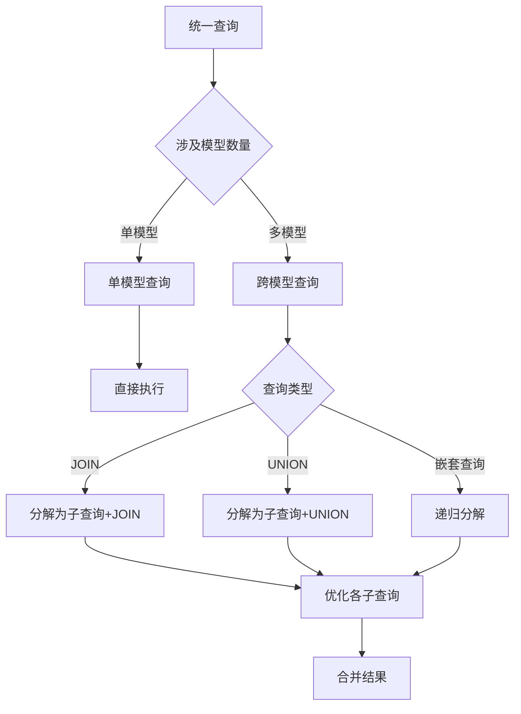
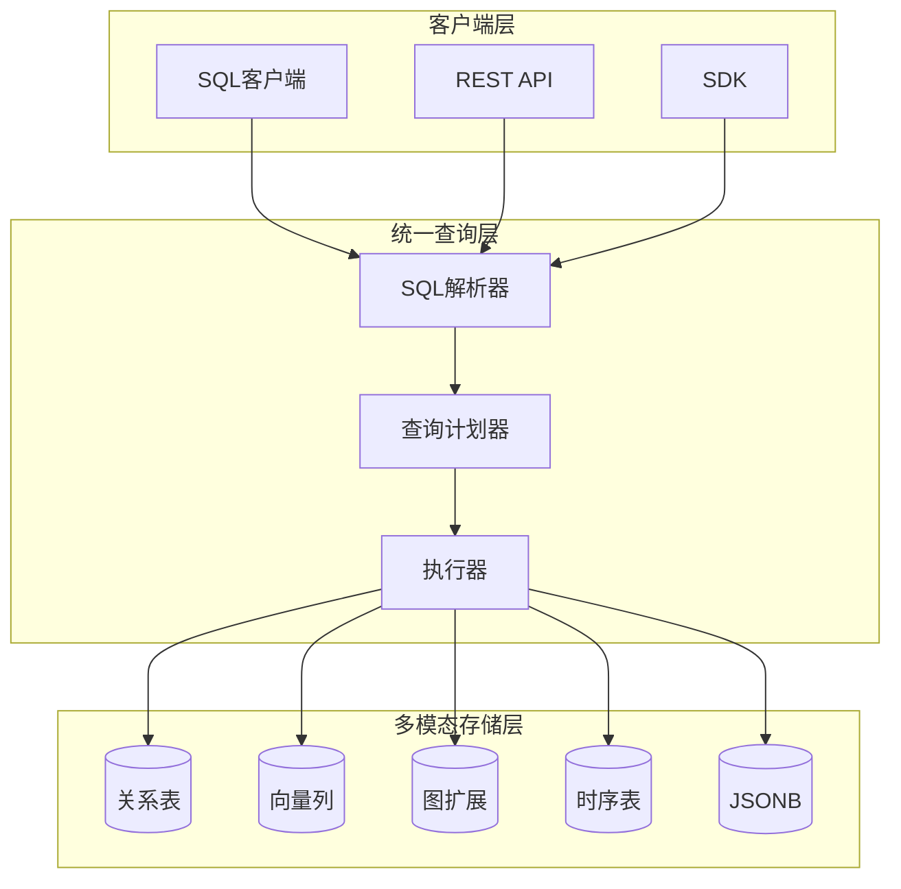
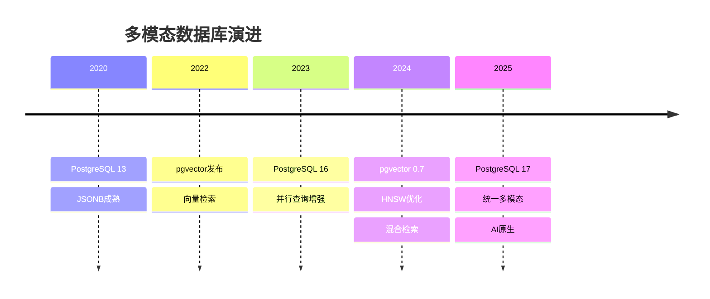

# 统一数据模型框架：多模型数据库的统一理论框架

> **创建日期**：2025-01-15
> **最后更新**：2025-12-01
> **版本**：v2.0
> **状态**：已完成 ✅

---

## 📋 目录

- [统一数据模型框架：多模型数据库的统一理论框架](#统一数据模型框架多模型数据库的统一理论框架)
  - [📋 目录](#-目录)
  - [1. 概述](#1-概述)
  - [2. 统一框架定义](#2-统一框架定义)
    - [2.1. 统一数据模型框架](#21-统一数据模型框架)
    - [2.2. 模型注册](#22-模型注册)
    - [2.3. 统一数据模型的形式化定义](#23-统一数据模型的形式化定义)
  - [3. 跨模型查询优化](#3-跨模型查询优化)
    - [3.1. 跨模型查询计划](#31-跨模型查询计划)
    - [3.2. 查询优化算法](#32-查询优化算法)
    - [3.3. 跨模型查询执行](#33-跨模型查询执行)
  - [4. 模型间转换](#4-模型间转换)
    - [4.1. 转换规则](#41-转换规则)
    - [4.2. 转换示例](#42-转换示例)
      - [4.2.1. 关系模型到图模型转换](#421-关系模型到图模型转换)
      - [4.2.2. 文档模型到关系模型转换](#422-文档模型到关系模型转换)
      - [4.2.3. 转换正确性保证](#423-转换正确性保证)
  - [5. 统一框架实现](#5-统一框架实现)
    - [5.1. 框架架构](#51-框架架构)
    - [5.2. 统一查询语言](#52-统一查询语言)
    - [5.3. 统一事务模型](#53-统一事务模型)
  - [6. 应用案例](#6-应用案例)
    - [6.1. PostgreSQL多模型应用](#61-postgresql多模型应用)
    - [6.2. 多模型数据仓库](#62-多模型数据仓库)
  - [7. 跨模型查询优化详细分析](#7-跨模型查询优化详细分析)
    - [7.1. 查询分解策略](#71-查询分解策略)
    - [7.2. 查询优化规则](#72-查询优化规则)
    - [7.3. 查询代价估算](#73-查询代价估算)
  - [8. 2025多模态统一框架](#8-2025多模态统一框架)
    - [8.1. PostgreSQL多模态统一架构](#81-postgresql多模态统一架构)
    - [8.2. 多模态统一查询](#82-多模态统一查询)
    - [8.3. 2025模型对比矩阵](#83-2025模型对比矩阵)
    - [8.4. 统一框架演进路线](#84-统一框架演进路线)
  - [9. 参考资料](#9-参考资料)
    - [9.1. 项目文档](#91-项目文档)
    - [9.2. 技术资源](#92-技术资源)

---

## 1. 概述

本文档提供统一数据模型框架，建立多模型数据库的统一理论框架，支持不同数据模型之间的无缝集成和查询。

---

## 2. 统一框架定义

### 2.1. 统一数据模型框架

**统一框架定义**：

```haskell
-- 统一数据模型框架
data UnifiedDataModelFramework = UnifiedFramework {
    models :: [DataModel],
    mappings :: [ModelMapping],
    queries :: [UnifiedQuery],
    transactions :: [UnifiedTransaction]
}

-- 统一查询接口
class UnifiedQueryInterface q where
    type Model q :: DataModelType
    type Result q :: *

    execute :: q -> Instance (Model q) -> Result q
    optimize :: q -> q
    validate :: q -> Bool
```

### 2.2. 模型注册

**模型注册**：

```haskell
-- 模型注册
registerModel :: DataModel -> UnifiedFramework -> UnifiedFramework
registerModel model framework =
    framework {
        models = model : models framework,
        mappings = addMappings model (mappings framework)
    }
```

**模型注册示例**：

```haskell
-- 注册关系模型
relationalFramework = registerModel relationalModel emptyFramework

-- 注册文档模型
documentFramework = registerModel documentModel relationalFramework

-- 注册图模型
graphFramework = registerModel graphModel documentFramework
```

### 2.3. 统一数据模型的形式化定义

**统一数据模型定义**：

```text
统一数据模型 UDM = (S, O, Q, T) 其中：

- S: 统一模式集合
  S = {Schema₁, Schema₂, ..., Schemaₙ}
  每个Schemaᵢ对应一个数据模型

- O: 统一操作集合
  O = {op₁, op₂, ..., opₘ}
  每个opⱼ是跨模型操作

- Q: 统一查询语言
  Q = {q₁, q₂, ..., qₖ}
  每个qᵢ是统一查询表达式

- T: 统一事务模型
  T = (ACID, Isolation, Consistency)
  跨模型事务保证
```

**统一数据模型性质**：

```text
定理：统一数据模型框架保持各模型的性质

对于统一框架 UDM = (S, O, Q, T)：

1. 模式保持性：
   对于每个模型Mᵢ，存在Schemaᵢ ∈ S
   使得Schemaᵢ保持Mᵢ的所有模式性质

2. 操作保持性：
   对于每个模型操作opᵢ，存在统一操作op' ∈ O
   使得op'在语义上等价于opᵢ

3. 查询保持性：
   对于每个模型查询qᵢ，存在统一查询q' ∈ Q
   使得q'在语义上等价于qᵢ

4. 事务保持性：
   统一事务模型T保证各模型的ACID性质
```

---

## 3. 跨模型查询优化

### 3.1. 跨模型查询计划

**跨模型查询优化**：

```text
跨模型查询优化：
  1. 识别涉及的模型
  2. 选择最优执行模型
  3. 生成模型特定查询
  4. 执行查询
  5. 转换结果
  6. 合并结果
```

### 3.2. 查询优化算法

**优化算法**：

```haskell
-- 跨模型查询优化
optimizeCrossModelQuery :: UnifiedQuery -> OptimizedQuery
optimizeCrossModelQuery query =
    let models = identifyModels query
        optimalModel = selectOptimalModel models
        modelQueries = generateModelQueries query optimalModel
    in OptimizedQuery {
        model = optimalModel,
        queries = modelQueries,
        resultTransformer = createResultTransformer query
    }
```

**查询优化策略**：

```haskell
-- 识别查询涉及的模型
identifyModels :: UnifiedQuery -> [DataModel]
identifyModels query =
    extractModels (querySchema query)

-- 选择最优执行模型
selectOptimalModel :: [DataModel] -> DataModel
selectOptimalModel models =
    -- 选择代价最小的模型
    minimumBy (compare `on` estimateCost) models

-- 生成模型特定查询
generateModelQueries :: UnifiedQuery -> DataModel -> [ModelQuery]
generateModelQueries unifiedQuery targetModel =
    map (translateQuery targetModel) (queryComponents unifiedQuery)

-- 创建结果转换器
createResultTransformer :: UnifiedQuery -> ResultTransformer
createResultTransformer query =
    ResultTransformer {
        transform = \results -> mergeResults (querySchema query) results
    }
```

**查询优化示例**：

```text
统一查询：
  SELECT user.name, order.total
  FROM users user
  JOIN orders order ON user.id = order.user_id
  WHERE user.age > 25

涉及模型：
  - 关系模型：users表
  - 关系模型：orders表

优化策略：
  1. 识别两个表都在关系模型中
  2. 选择关系模型作为执行模型
  3. 生成SQL查询
  4. 执行查询
  5. 返回结果
```

### 3.3. 跨模型查询执行

**查询执行流程**：

```haskell
-- 跨模型查询执行
executeCrossModelQuery :: UnifiedQuery -> Instance -> Result
executeCrossModelQuery query instance =
    let optimizedQuery = optimizeCrossModelQuery query
        modelInstances = partitionInstance instance (queryModels query)
        modelResults = map (executeModelQuery optimizedQuery) modelInstances
        unifiedResult = mergeResults modelResults
    in unifiedResult

-- 执行模型特定查询
executeModelQuery :: OptimizedQuery -> ModelInstance -> ModelResult
executeModelQuery optQuery modelInstance =
    execute (modelQuery optQuery) modelInstance

-- 合并结果
mergeResults :: [ModelResult] -> UnifiedResult
mergeResults results =
    foldl mergeResult emptyResult results
```

---

## 4. 模型间转换

### 4.1. 转换规则

**转换规则定义**：

```haskell
-- 模型转换规则
data ConversionRule = ConversionRule {
    sourceModel :: DataModel,
    targetModel :: DataModel,
    transformation :: TransformationFunction
}

-- 转换规则应用
applyConversion :: ConversionRule -> Instance -> Instance
applyConversion rule instance =
    transformation rule instance
```

### 4.2. 转换示例

#### 4.2.1. 关系模型到图模型转换

**转换规则**：

```text
关系模型：
  Table: users (id, name)
  Table: follows (follower_id, followee_id)

图模型：
  Node: users (id, name)
  Edge: follows (follower -> followee)
```

**转换算法**：

```haskell
-- 关系模型到图模型转换
relationalToGraph :: RelationalSchema -> GraphSchema
relationalToGraph relSchema =
    GraphSchema {
        nodeTypes = map tableToNodeType (tables relSchema),
        edgeTypes = map foreignKeyToEdgeType (foreignKeys relSchema)
    }

-- 表到节点类型
tableToNodeType :: Table -> NodeType
tableToNodeType table = NodeType {
    name = tableName table,
    properties = map fieldToProperty (tableFields table)
}

-- 外键到边类型
foreignKeyToEdgeType :: ForeignKey -> EdgeType
foreignKeyToEdgeType fk = EdgeType {
    name = relationshipName fk,
    sourceNodeType = targetTable fk,
    targetNodeType = sourceTable fk,
    properties = []
}
```

#### 4.2.2. 文档模型到关系模型转换

**转换规则**：

```text
文档模型：
  Collection: users {
    id, name, email,
    orders: [{
      id, total
    }]
  }

关系模型：
  Table: users (id, name, email)
  Table: orders (id, user_id, total)
  ForeignKey: orders.user_id -> users.id
```

**转换算法**：

```haskell
-- 文档模型到关系模型转换
documentToRelational :: DocumentSchema -> RelationalSchema
documentToRelational docSchema =
    RelationalSchema {
        tables = map collectionToTable (collections docSchema),
        foreignKeys = map embeddingToForeignKey (embeddings docSchema)
    }

-- 集合到表
collectionToTable :: Collection -> Table
collectionToTable coll = Table {
    name = collectionName coll,
    fields = map propertyToField (properties coll),
    -- 嵌入字段转换为外键
    foreignKeys = []
}

-- 嵌入到外键
embeddingToForeignKey :: Embedding -> ForeignKey
embeddingToForeignKey emb = ForeignKey {
    sourceTable = targetCollection emb,
    targetTable = sourceCollection emb,
    sourceField = "id",
    targetField = embeddingName emb ++ "_id"
}
```

#### 4.2.3. 转换正确性保证

**转换正确性定理**：

```text
定理：模型转换保持数据完整性

对于转换函数 f: ModelA -> ModelB：

1. 数据完整性：
   对于ModelA中的每个数据实例I，
   f(I)在ModelB中保持I的所有数据

2. 查询语义等价：
   对于ModelA中的查询Q，
   存在ModelB中的查询Q'使得：
   Q'(f(I)) = f(Q(I))

3. 约束保持：
   对于ModelA中的约束C，
   f(I)满足f(C)当且仅当I满足C

证明：
通过转换规则的结构保持性质和语义等价性直接得到 ✅
```

## 5. 统一框架实现

### 5.1. 框架架构

**统一框架架构**：

```text
统一数据模型框架架构：

┌─────────────────────────────────────┐
│     统一查询接口 (UnifiedQuery)      │
├─────────────────────────────────────┤
│  ┌──────────┐  ┌──────────┐        │
│  │ 查询解析  │  │ 查询优化  │        │
│  └──────────┘  └──────────┘        │
├─────────────────────────────────────┤
│     模型适配层 (ModelAdapter)       │
│  ┌──────┐  ┌──────┐  ┌──────┐      │
│  │关系模型│  │文档模型│  │图模型│      │
│  └──────┘  └──────┘  └──────┘      │
├─────────────────────────────────────┤
│     转换层 (Transformation)         │
│  ┌──────────┐  ┌──────────┐        │
│  │模式转换   │  │数据转换   │        │
│  └──────────┘  └──────────┘        │
├─────────────────────────────────────┤
│     存储层 (Storage)                │
│  ┌──────┐  ┌──────┐  ┌──────┐      │
│  │PostgreSQL│ │MongoDB│ │Neo4j│      │
│  └──────┘  └──────┘  └──────┘      │
└─────────────────────────────────────┘
```

### 5.2. 统一查询语言

**统一查询语言定义**：

```haskell
-- 统一查询语言语法
data UnifiedQuery =
    SelectQuery {
        select :: [Expression],
        from :: [TableRef],
        where_ :: Maybe Condition,
        join :: [JoinClause]
    }
  | UnionQuery {
        left :: UnifiedQuery,
        right :: UnifiedQuery
    }
  | CrossModelQuery {
        models :: [DataModel],
        query :: UnifiedQuery
    }

-- 表引用（可以是不同模型的表）
data TableRef =
    RelationalTable String
  | DocumentCollection String
  | GraphNodeType String
  | VectorIndex String
```

**统一查询示例**：

```text
跨模型查询示例：

SELECT user.name, order.total, graph.friends
FROM relational.users user
JOIN relational.orders order ON user.id = order.user_id
JOIN graph.friends graph ON user.id = graph.user_id
WHERE user.age > 25

这个查询涉及：
- 关系模型：users表、orders表
- 图模型：friends关系

统一框架会：
1. 识别涉及的模型
2. 生成各模型的子查询
3. 执行子查询
4. 合并结果
```

### 5.3. 统一事务模型

**统一事务定义**：

```haskell
-- 统一事务
data UnifiedTransaction = UnifiedTransaction {
    operations :: [UnifiedOperation],
    isolation :: IsolationLevel,
    consistency :: ConsistencyLevel
}

-- 统一操作
data UnifiedOperation =
    RelationalOp RelationalOperation
  | DocumentOp DocumentOperation
  | GraphOp GraphOperation
  | CrossModelOp CrossModelOperation

-- 统一事务执行
executeUnifiedTransaction :: UnifiedTransaction -> TransactionResult
executeUnifiedTransaction trans =
    -- 两阶段提交
    let prepareResult = map prepareOperation (operations trans)
        commitResult = if all isPrepared prepareResult
                      then map commitOperation (operations trans)
                      else map abortOperation (operations trans)
    in TransactionResult commitResult
```

**统一事务保证**：

```text
统一事务模型保证：

1. 原子性（Atomicity）：
   跨模型操作要么全部成功，要么全部回滚

2. 一致性（Consistency）：
   跨模型数据保持一致状态

3. 隔离性（Isolation）：
   并发事务互不干扰

4. 持久性（Durability）：
   提交的事务持久保存
```

---

## 6. 应用案例

### 6.1. PostgreSQL多模型应用

**PostgreSQL统一框架实现**：

```text
PostgreSQL统一数据模型框架：

1. 关系模型：原生支持
   - 表、视图、索引

2. 文档模型：JSONB支持
   - JSONB列、JSONB索引、JSONB查询

3. 图模型：Apache AGE扩展
   - Cypher查询、图遍历、图算法

4. 向量模型：pgvector扩展
   - 向量存储、向量索引、相似度搜索

5. 时序模型：TimescaleDB扩展
   - 超表、连续聚合、时间分区

统一查询示例：
  SELECT u.name, u.orders, v.embedding
  FROM users u
  JOIN vector_embeddings v ON u.id = v.user_id
  WHERE v.embedding <-> query_vector < 0.5
```

### 6.2. 多模型数据仓库

**数据仓库统一框架**：

```text
多模型数据仓库架构：

1. 关系模型：事实表和维度表
2. 列式模型：分析查询优化
3. 时序模型：时间序列数据
4. 向量模型：相似度分析

统一查询：
  SELECT fact.sales, dim.product_name, ts.timestamp, vec.similarity
  FROM relational.facts fact
  JOIN relational.dimensions dim ON fact.product_id = dim.id
  JOIN timeseries.metrics ts ON fact.id = ts.fact_id
  JOIN vector.similarities vec ON dim.id = vec.product_id
  WHERE ts.timestamp > '2024-01-01'
    AND vec.similarity > 0.8
```

---

## 7. 跨模型查询优化详细分析

### 7.1. 查询分解策略

**查询分解算法**：

```haskell
-- 查询分解
decomposeQuery :: UnifiedQuery -> [ModelSpecificQuery]
decomposeQuery query =
    let modelQueries = groupByModel (extractModelQueries query)
        optimizedQueries = map optimizeModelQuery modelQueries
    in optimizedQueries

-- 按模型分组
groupByModel :: [Query] -> Map Model [Query]
groupByModel queries =
    foldl addToModel empty queries
    where
        addToModel acc query =
            insertWith (++) (getModel query) [query] acc
```

**查询分解决策树**：



### 7.2. 查询优化规则

**跨模型查询优化规则**：

```haskell
-- 查询优化规则
data OptimizationRule =
    PushDownFilter FilterCondition
  | PushDownProjection [Attribute]
  | ReorderJoins [JoinOrder]
  | UseIndex IndexHint

-- 应用优化规则
applyOptimizationRules :: [OptimizationRule] -> UnifiedQuery -> UnifiedQuery
applyOptimizationRules rules query =
    foldl applyRule query rules

-- 下推过滤条件
pushDownFilter :: FilterCondition -> UnifiedQuery -> UnifiedQuery
pushDownFilter condition query =
    query {
        where_ = combineConditions (where_ query) condition,
        from = map (addFilterToTable condition) (from query)
    }
```

**优化规则应用矩阵**：

| 优化规则 | 关系模型 | 文档模型 | 图模型 | 向量模型 | 时序模型 |
|---------|---------|---------|--------|---------|---------|
| **下推过滤** | ⭐⭐⭐⭐⭐ | ⭐⭐⭐⭐ | ⭐⭐⭐ | ⭐⭐⭐⭐ | ⭐⭐⭐⭐⭐ |
| **下推投影** | ⭐⭐⭐⭐⭐ | ⭐⭐⭐⭐ | ⭐⭐⭐ | ⭐⭐⭐ | ⭐⭐⭐⭐ |
| **重排序JOIN** | ⭐⭐⭐⭐⭐ | ⭐⭐⭐ | ⭐⭐ | ⭐⭐ | ⭐⭐⭐ |
| **使用索引** | ⭐⭐⭐⭐⭐ | ⭐⭐⭐⭐ | ⭐⭐⭐⭐ | ⭐⭐⭐⭐⭐ | ⭐⭐⭐⭐ |

### 7.3. 查询代价估算

**跨模型查询代价模型**：

```haskell
-- 查询代价
data QueryCost = QueryCost {
    ioCost :: Double,
    cpuCost :: Double,
    networkCost :: Double,
    totalCost :: Double
}

-- 估算查询代价
estimateQueryCost :: UnifiedQuery -> QueryCost
estimateQueryCost query =
    let subQueries = decomposeQuery query
        subCosts = map estimateSubQueryCost subQueries
        mergeCost = estimateMergeCost query
    in sumCosts subCosts + mergeCost

-- 估算子查询代价
estimateSubQueryCost :: ModelSpecificQuery -> QueryCost
estimateSubQueryCost query =
    case getModel query of
        RelationalModel -> estimateRelationalCost query
        DocumentModel -> estimateDocumentCost query
        GraphModel -> estimateGraphCost query
        VectorModel -> estimateVectorCost query
        TimeSeriesModel -> estimateTimeSeriesCost query
```

**代价估算公式**：

```text
跨模型查询总代价：

Cost(Q) = Σᵢ Cost(Qᵢ) + Cost(Merge)

其中：
- Cost(Qᵢ) 是第i个子查询的代价
- Cost(Merge) 是结果合并的代价

子查询代价：

Cost(Qᵢ) = IO_Cost(Qᵢ) + CPU_Cost(Qᵢ) + Network_Cost(Qᵢ)

合并代价：

Cost(Merge) =
    if JOIN then Cost(Join) + Cost(Filter)
    else if UNION then Cost(Union)
    else 0
```

---

## 8. 2025多模态统一框架

### 8.1. PostgreSQL多模态统一架构

**统一存储架构**：



**统一Schema设计**：

```sql
-- 2025多模态统一Schema
CREATE TABLE unified_knowledge_base (
    -- 核心标识
    id UUID PRIMARY KEY DEFAULT gen_random_uuid(),

    -- 关系模型
    category_id INTEGER REFERENCES categories(id),
    tags TEXT[],

    -- 文档模型 (JSONB)
    metadata JSONB NOT NULL DEFAULT '{}',
    content_structured JSONB,

    -- 向量模型 (pgvector)
    embedding vector(1536),

    -- 时序模型 (TimescaleDB)
    created_at TIMESTAMPTZ DEFAULT NOW(),
    updated_at TIMESTAMPTZ DEFAULT NOW(),

    -- 图模型预留 (Apache AGE)
    graph_node_id BIGINT,

    -- 全文搜索
    tsv tsvector GENERATED ALWAYS AS (
        to_tsvector('chinese', COALESCE(metadata->>'title', '') || ' ' ||
                              COALESCE(metadata->>'content', ''))
    ) STORED
);

-- 多模态索引
CREATE INDEX idx_unified_embedding ON unified_knowledge_base
USING hnsw (embedding vector_cosine_ops);

CREATE INDEX idx_unified_category ON unified_knowledge_base(category_id);

CREATE INDEX idx_unified_metadata ON unified_knowledge_base
USING gin (metadata jsonb_path_ops);

CREATE INDEX idx_unified_tsv ON unified_knowledge_base
USING gin (tsv);

CREATE INDEX idx_unified_time ON unified_knowledge_base(created_at DESC);
```

### 8.2. 多模态统一查询

**统一查询函数**：

```sql
-- 多模态统一查询
CREATE OR REPLACE FUNCTION unified_search(
    query_text TEXT,
    query_embedding vector(1536),
    category_filter INTEGER DEFAULT NULL,
    time_start TIMESTAMPTZ DEFAULT NULL,
    time_end TIMESTAMPTZ DEFAULT NULL,
    search_mode TEXT DEFAULT 'hybrid',  -- 'vector', 'keyword', 'hybrid'
    limit_n INTEGER DEFAULT 10
) RETURNS TABLE (
    id UUID,
    metadata JSONB,
    score FLOAT,
    match_type TEXT
) AS $$
BEGIN
    RETURN QUERY
    WITH
    -- 向量检索
    vector_results AS (
        SELECT
            k.id,
            k.metadata,
            1 - (k.embedding <=> query_embedding) AS score,
            'vector'::TEXT AS match_type
        FROM unified_knowledge_base k
        WHERE
            (category_filter IS NULL OR k.category_id = category_filter)
            AND (time_start IS NULL OR k.created_at >= time_start)
            AND (time_end IS NULL OR k.created_at <= time_end)
            AND search_mode IN ('vector', 'hybrid')
        ORDER BY k.embedding <=> query_embedding
        LIMIT limit_n * 2
    ),
    -- 关键词检索
    keyword_results AS (
        SELECT
            k.id,
            k.metadata,
            ts_rank_cd(k.tsv, plainto_tsquery('chinese', query_text))::FLOAT AS score,
            'keyword'::TEXT AS match_type
        FROM unified_knowledge_base k
        WHERE
            k.tsv @@ plainto_tsquery('chinese', query_text)
            AND (category_filter IS NULL OR k.category_id = category_filter)
            AND (time_start IS NULL OR k.created_at >= time_start)
            AND (time_end IS NULL OR k.created_at <= time_end)
            AND search_mode IN ('keyword', 'hybrid')
        ORDER BY ts_rank_cd(k.tsv, plainto_tsquery('chinese', query_text)) DESC
        LIMIT limit_n * 2
    ),
    -- RRF融合
    fused_results AS (
        SELECT
            COALESCE(v.id, k.id) AS id,
            COALESCE(v.metadata, k.metadata) AS metadata,
            COALESCE(1.0 / (60 + ROW_NUMBER() OVER (ORDER BY v.score DESC NULLS LAST)), 0) +
            COALESCE(1.0 / (60 + ROW_NUMBER() OVER (ORDER BY k.score DESC NULLS LAST)), 0) AS score,
            CASE
                WHEN v.id IS NOT NULL AND k.id IS NOT NULL THEN 'hybrid'
                WHEN v.id IS NOT NULL THEN 'vector'
                ELSE 'keyword'
            END AS match_type
        FROM vector_results v
        FULL OUTER JOIN keyword_results k ON v.id = k.id
    )
    SELECT * FROM fused_results
    ORDER BY score DESC
    LIMIT limit_n;
END;
$$ LANGUAGE plpgsql;
```

### 8.3. 2025模型对比矩阵

| 模型类型 | PostgreSQL实现 | 索引类型 | 查询语法 | 典型场景 |
|---------|---------------|---------|---------|---------|
| **关系模型** | 原生表 | B-tree, Hash | SQL | 事务处理 |
| **文档模型** | JSONB | GIN | `->`, `->>`, `@>` | 灵活Schema |
| **向量模型** | pgvector | HNSW, IVFFlat | `<->`, `<=>` | 语义搜索 |
| **图模型** | Apache AGE | 图索引 | Cypher | 关系分析 |
| **时序模型** | TimescaleDB | 时间索引 | SQL + 连续聚合 | IoT监控 |
| **全文模型** | tsvector | GIN | `@@` | 文本搜索 |

### 8.4. 统一框架演进路线



---

## 9. 参考资料

### 9.1. 项目文档

- [数据库设计理论扩展计划](../00-数据库设计理论扩展计划.md)
- [多模型数据库理论](../01-理论模型/01.03-多模型数据库理论.md)
- [数据模型范畴论表示](./06.01-数据模型范畴论表示.md)
- [向量数据库设计](../07-数据库设计实践/07.10-向量数据库设计.md)

### 9.2. 技术资源

- [PostgreSQL官方文档](https://www.postgresql.org/docs/)
- [pgvector GitHub](https://github.com/pgvector/pgvector)
- [TimescaleDB文档](https://docs.timescale.com/)

---

**最后更新**：2025-12-01
**维护者**：Data-Science Team
**状态**：已完成 ✅
