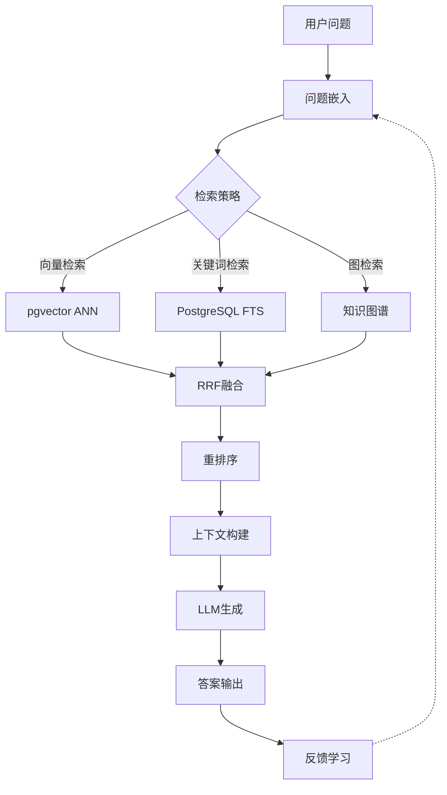

# 数据模型理论体系综合应用案例

> **创建日期**：2025-01-15
> **最后更新**：2025-12-01
> **版本**：v2.0
> **状态**：已完成 ✅

---

## 📋 目录

- [数据模型理论体系综合应用案例](#数据模型理论体系综合应用案例)
  - [📋 目录](#-目录)
  - [1. 概述](#1-概述)
  - [2. 案例1：多模型数据仓库设计](#2-案例1多模型数据仓库设计)
    - [2.1. 业务场景](#21-业务场景)
    - [2.2. 数据模型选择](#22-数据模型选择)
    - [2.3. 范畴论表示](#23-范畴论表示)
    - [2.4. 统一框架应用](#24-统一框架应用)
    - [2.5. 形式化验证](#25-形式化验证)
    - [2.6. 知识图谱映射](#26-知识图谱映射)
  - [3. 案例2：AI应用多模型数据库](#3-案例2ai应用多模型数据库)
    - [3.1. 业务场景](#31-业务场景)
    - [3.2. 数据模型架构](#32-数据模型架构)
    - [3.3. 向量数据库集成](#33-向量数据库集成)
    - [3.4. 知识图谱推理](#34-知识图谱推理)
    - [3.5. 跨模型查询优化](#35-跨模型查询优化)
  - [4. 案例3：IoT时序数据平台](#4-案例3iot时序数据平台)
    - [4.1. 业务场景](#41-业务场景)
    - [4.2. 时序数据库设计](#42-时序数据库设计)
    - [4.3. 多模型转换](#43-多模型转换)
    - [4.4. 实时分析查询](#44-实时分析查询)
  - [5. 案例4：SaaS多租户系统](#5-案例4saas多租户系统)
    - [5.1. 业务场景](#51-业务场景)
    - [5.2. 多租户数据模型](#52-多租户数据模型)
    - [5.3. 租户隔离验证](#53-租户隔离验证)
    - [5.4. 跨租户查询](#54-跨租户查询)
  - [6. 案例5：分布式多模型系统](#6-案例5分布式多模型系统)
    - [6.1. 业务场景](#61-业务场景)
    - [6.2. 分布式架构设计](#62-分布式架构设计)
    - [6.3. 跨模型事务管理](#63-跨模型事务管理)
    - [6.4. 一致性保证](#64-一致性保证)
  - [7. 综合对比分析](#7-综合对比分析)
    - [7.1. 案例对比矩阵](#71-案例对比矩阵)
    - [7.2. 理论应用对比](#72-理论应用对比)
  - [8. 最佳实践总结](#8-最佳实践总结)
    - [8.1. 数据模型选择原则](#81-数据模型选择原则)
    - [8.2. 跨模型集成策略](#82-跨模型集成策略)
    - [8.3. 形式化验证建议](#83-形式化验证建议)
    - [8.4. 知识图谱应用](#84-知识图谱应用)
  - [9. 案例6：企业RAG知识库系统（2025）](#9-案例6企业rag知识库系统2025)
    - [9.1. 业务场景](#91-业务场景)
    - [9.2. 多模态数据模型](#92-多模态数据模型)
    - [9.3. RAG检索流程](#93-rag检索流程)
    - [9.4. 2025技术选型对比](#94-2025技术选型对比)
    - [9.5. 性能优化策略](#95-性能优化策略)
  - [10. 参考资料](#10-参考资料)
    - [10.1. 项目文档](#101-项目文档)
    - [10.2. 理论资源](#102-理论资源)

---

## 1. 概述

本文档提供数据模型理论体系的综合应用案例，展示如何将范畴论表示、统一框架、形式化规范和知识图谱映射等理论应用到实际业务场景中。

**核心目标**：

- 展示理论在实际场景中的应用
- 提供完整的设计思路和实现方案
- 验证理论框架的实用性和有效性

---

## 2. 案例1：多模型数据仓库设计

### 2.1. 业务场景

**需求**：构建一个企业级数据仓库，需要存储和处理多种类型的数据：

- **关系数据**：客户信息、订单数据、产品目录
- **文档数据**：产品描述、用户评论、日志数据
- **图数据**：客户关系网络、产品关联关系
- **时序数据**：销售趋势、用户行为时间序列

**挑战**：

- 如何统一管理和查询多种数据模型？
- 如何保证数据一致性和完整性？
- 如何优化跨模型查询性能？

### 2.2. 数据模型选择

**数据模型映射**：

| 数据类型 | 数据模型 | 存储系统 | 查询语言 |
|---------|---------|---------|---------|
| 客户/订单 | 关系模型 | PostgreSQL | SQL |
| 产品描述 | 文档模型 | PostgreSQL JSONB | SQL/JSON |
| 关系网络 | 图模型 | Apache AGE | Cypher |
| 销售趋势 | 时序模型 | TimescaleDB | SQL |

### 2.3. 范畴论表示

**数据模型范畴**：

```haskell
-- 多模型数据仓库范畴
data WarehouseCategory = WarehouseCat {
    models :: [DataModel],
    transformations :: [ModelTransformation]
}

-- 模型对象
relationalModel :: DataModel
relationalModel = RelationalModel {
    schema = RelationalSchema {
        tables = [Customer, Order, Product],
        foreignKeys = [Order.customerId -> Customer.id]
    }
}

documentModel :: DataModel
documentModel = DocumentModel {
    schema = DocumentSchema {
        collections = [ProductDescriptions, UserReviews],
        fields = [description, rating, comment]
    }
}

graphModel :: DataModel
graphModel = GraphModel {
    schema = GraphSchema {
        nodeTypes = [Customer, Product],
        edgeTypes = [PURCHASED, RECOMMENDS]
    }
}

timeSeriesModel :: DataModel
timeSeriesModel = TimeSeriesModel {
    schema = TimeSeriesSchema {
        metrics = [Sales, UserActivity],
        timeGranularity = Hour
    }
}
```

**模型转换函子**：

```haskell
-- 关系模型到图模型转换函子
relationalToGraphFunctor :: Functor RelationalModel GraphModel
relationalToGraphFunctor = Functor {
    mapObject = \relSchema -> transformToGraphSchema relSchema,
    mapMorphism = \relQuery -> translateToCypherQuery relQuery
}

-- 文档模型到关系模型转换函子
documentToRelationalFunctor :: Functor DocumentModel RelationalModel
documentToRelationalFunctor = Functor {
    mapObject = \docSchema -> flattenToRelationalSchema docSchema,
    mapMorphism = \docQuery -> translateToSQLQuery docQuery
}
```

### 2.4. 统一框架应用

**统一查询语言**：

```sql
-- 跨模型查询示例
SELECT
    c.name AS customer_name,
    p.name AS product_name,
    COUNT(o.id) AS order_count,
    AVG(r.rating) AS avg_rating,
    g.degree AS network_degree,
    ts.sales_trend
FROM
    customers c
    JOIN orders o ON c.id = o.customer_id
    JOIN products p ON o.product_id = p.id
    LEFT JOIN LATERAL (
        SELECT AVG(rating) AS rating
        FROM product_reviews
        WHERE product_id = p.id
    ) r ON true
    LEFT JOIN LATERAL (
        SELECT COUNT(*) AS degree
        FROM graph_query('MATCH (c:Customer {id: $1})-[r]-(n) RETURN COUNT(r) AS degree', c.id)
    ) g ON true
    LEFT JOIN LATERAL (
        SELECT sales_trend
        FROM sales_metrics
        WHERE product_id = p.id
        AND time_bucket('1 day', timestamp) = CURRENT_DATE
    ) ts ON true
GROUP BY c.id, p.id, g.degree, ts.sales_trend
ORDER BY order_count DESC;
```

**跨模型事务管理**：

```haskell
-- 跨模型事务
crossModelTransaction :: Transaction [Result]
crossModelTransaction = do
    -- 关系模型操作
    customer <- insertCustomer customerData
    order <- insertOrder orderData customer.id

    -- 文档模型操作
    review <- insertReview reviewData order.id

    -- 图模型操作
    createRelationship customer.id product.id "PURCHASED"

    -- 时序模型操作
    recordMetric "sales" order.amount order.timestamp

    -- 提交事务
    commitTransaction
    return [customer, order, review]
```

### 2.5. 形式化验证

**TLA+规范**：

```tla
EXTENDS Naturals, Sequences

VARIABLES
    relational_db,
    document_db,
    graph_db,
    timeseries_db,
    transactions

MultiModelWarehouseInvariant ==
    /\ relational_db \in [Table -> [Row -> Value]]
    /\ document_db \in [Collection -> [DocID -> Document]]
    /\ graph_db \in [EntityID -> [RelationID -> EntityID]]
    /\ timeseries_db \in [MetricID -> Seq(Timestamp \times Value)]
    /\ \A t \in transactions:
        CrossModelConsistency(t, relational_db, document_db, graph_db, timeseries_db)

CrossModelConsistency(t, rel, doc, graph, ts) ==
    /\ OrderConsistency(t, rel, doc)
    /\ RelationshipConsistency(t, rel, graph)
    /\ MetricConsistency(t, rel, ts)

THEOREM MultiModelWarehouseCorrectness ==
    MultiModelWarehouseInvariant => DataConsistency
```

**Coq证明**：

```coq
Theorem CrossModelQueryCorrectness :
  forall (q : CrossModelQuery) (warehouse : MultiModelWarehouse),
    executeCrossModelQuery q warehouse =
    combineResults [
      executeRelationalQuery (relationalPart q) warehouse.relational_db,
      executeDocumentQuery (documentPart q) warehouse.document_db,
      executeGraphQuery (graphPart q) warehouse.graph_db,
      executeTimeSeriesQuery (timeseriesPart q) warehouse.timeseries_db
    ].
Proof.
  intros q warehouse.
  unfold executeCrossModelQuery.
  (* 证明跨模型查询的正确性 *)
  apply cross_model_query_decomposition.
  apply query_result_combination.
Qed.
```

### 2.6. 知识图谱映射

**数据模型到知识图谱映射**：

```haskell
-- 关系模型到知识图谱映射
relationalToKGMapping :: RelationalSchema -> KnowledgeGraph
relationalToKGMapping schema = KnowledgeGraph {
    entities = map tableToEntity schema.tables,
    relations = map foreignKeyToRelation schema.foreignKeys,
    triples = generateTriples schema
}

-- 文档模型到知识图谱映射
documentToKGMapping :: DocumentSchema -> KnowledgeGraph
documentToKGMapping schema = KnowledgeGraph {
    entities = map collectionToEntity schema.collections,
    relations = map fieldToRelation schema.fields,
    triples = generateDocumentTriples schema
}

-- 图模型到知识图谱映射（直接映射）
graphToKGMapping :: GraphSchema -> KnowledgeGraph
graphToKGMapping schema = KnowledgeGraph {
    entities = schema.nodeTypes,
    relations = schema.edgeTypes,
    triples = schema.triples
}
```

**知识推理应用**：

```sparql
# 跨模型知识推理查询
PREFIX : <http://example.org/warehouse#>

SELECT ?customer ?product ?recommendation
WHERE {
    # 关系模型数据
    ?customer :purchased ?order .
    ?order :contains ?product .

    # 文档模型数据
    ?product :hasReview ?review .
    ?review :rating ?rating .
    FILTER (?rating >= 4.0)

    # 图模型数据
    ?customer :follows ?friend .
    ?friend :purchased ?friendOrder .
    ?friendOrder :contains ?recommendation .

    # 时序模型数据
    ?product :salesTrend ?trend .
    FILTER (?trend > 0.1)

    # 推理规则：推荐高评分且销售增长的产品
    FILTER NOT EXISTS {
        ?customer :purchased ?existingOrder .
        ?existingOrder :contains ?recommendation
    }
}
```

---

## 3. 案例2：AI应用多模型数据库

### 3.1. 业务场景

**需求**：构建一个AI应用数据库，支持：

- **向量数据**：文本嵌入、图像特征向量
- **关系数据**：用户信息、内容元数据
- **图数据**：知识图谱、实体关系
- **时序数据**：用户行为序列、模型训练指标

**应用场景**：

- RAG（检索增强生成）
- 语义搜索
- 推荐系统
- 知识问答

### 3.2. 数据模型架构

**架构设计**：

```text
┌─────────────────────────────────────────┐
│         AI应用多模型数据库               │
├─────────────────────────────────────────┤
│  向量数据库 (pgvector)                   │
│  - 文本嵌入向量                          │
│  - 图像特征向量                          │
│  - 语义相似度搜索                        │
├─────────────────────────────────────────┤
│  关系数据库 (PostgreSQL)                 │
│  - 用户信息                              │
│  - 内容元数据                            │
│  - 权限管理                              │
├─────────────────────────────────────────┤
│  图数据库 (Apache AGE)                   │
│  - 知识图谱                              │
│  - 实体关系                              │
│  - 推理路径                              │
├─────────────────────────────────────────┤
│  时序数据库 (TimescaleDB)                │
│  - 用户行为序列                          │
│  - 模型训练指标                          │
│  - 性能监控                              │
└─────────────────────────────────────────┘
```

### 3.3. 向量数据库集成

**向量相似度查询**：

```sql
-- RAG检索查询
WITH semantic_search AS (
    SELECT
        content_id,
        content_text,
        1 - (embedding <=> $query_embedding) AS similarity
    FROM content_embeddings
    WHERE embedding <=> $query_embedding < 0.3
    ORDER BY similarity DESC
    LIMIT 10
),
knowledge_graph AS (
    SELECT
        e1.id AS entity_id,
        e1.name AS entity_name,
        r.type AS relation_type,
        e2.name AS related_entity
    FROM graph_query('
        MATCH (e1:Entity)-[r]->(e2:Entity)
        WHERE e1.id IN $entity_ids
        RETURN e1, r, e2
    ', ARRAY(SELECT content_id FROM semantic_search))
)
SELECT
    ss.content_id,
    ss.content_text,
    ss.similarity,
    kg.entity_name,
    kg.relation_type,
    kg.related_entity
FROM semantic_search ss
LEFT JOIN knowledge_graph kg ON ss.content_id = kg.entity_id
ORDER BY ss.similarity DESC;
```

### 3.4. 知识图谱推理

**知识推理查询**：

```cypher
// 知识图谱推理：查找相关实体
MATCH path = (start:Entity {id: $entity_id})-[:RELATED_TO*1..3]-(related:Entity)
WHERE
    // 向量相似度过滤
    EXISTS {
        MATCH (related)-[:HAS_EMBEDDING]->(emb:Embedding)
        WHERE emb.vector <=> $query_vector < 0.3
    }
    // 时序模式过滤
    AND EXISTS {
        MATCH (related)-[:HAS_ACTIVITY]->(activity:Activity)
        WHERE activity.timestamp > datetime() - duration('P7D')
        AND activity.frequency > 10
    }
RETURN
    related,
    length(path) AS path_length,
    [r IN relationships(path) | type(r)] AS relation_path
ORDER BY path_length, related.relevance DESC
LIMIT 20;
```

### 3.5. 跨模型查询优化

**查询优化策略**：

```haskell
-- 跨模型查询优化
optimizeCrossModelQuery :: CrossModelQuery -> OptimizedQueryPlan
optimizeCrossModelQuery query =
    let
        -- 1. 查询分解
        decomposed = decomposeQuery query

        -- 2. 代价估算
        costs = map estimateCost decomposed

        -- 3. 执行顺序优化
        ordered = optimizeOrder decomposed costs

        -- 4. 并行执行计划
        parallel = createParallelPlan ordered
    in
        OptimizedQueryPlan {
            steps = parallel,
            estimatedCost = sum costs,
            estimatedTime = max (map estimatedTime parallel)
        }

-- 查询分解策略
decomposeQuery :: CrossModelQuery -> [SubQuery]
decomposeQuery query =
    [ VectorSubQuery (vectorPart query),
      RelationalSubQuery (relationalPart query),
      GraphSubQuery (graphPart query),
      TimeSeriesSubQuery (timeseriesPart query)
    ]

-- 代价估算
estimateCost :: SubQuery -> Cost
estimateCost (VectorSubQuery q) =
    Cost {
        cpuCost = vectorSearchCost q,
        ioCost = indexScanCost q,
        networkCost = 0
    }
estimateCost (GraphSubQuery q) =
    Cost {
        cpuCost = graphTraversalCost q,
        ioCost = graphScanCost q,
        networkCost = 0
    }
```

---

## 4. 案例3：IoT时序数据平台

### 4.1. 业务场景

**需求**：构建一个IoT时序数据平台，处理：

- **时序数据**：传感器数据、设备状态
- **关系数据**：设备信息、用户管理
- **图数据**：设备拓扑关系、依赖关系
- **文档数据**：设备配置、告警规则

**挑战**：

- 高并发写入（百万级设备）
- 实时查询和分析
- 数据压缩和存储优化
- 跨模型关联查询

### 4.2. 时序数据库设计

**TimescaleDB设计**：

```sql
-- 创建时序表
CREATE TABLE sensor_data (
    time TIMESTAMPTZ NOT NULL,
    device_id INTEGER NOT NULL,
    sensor_type TEXT NOT NULL,
    value DOUBLE PRECISION,
    metadata JSONB
);

-- 转换为时序表
SELECT create_hypertable('sensor_data', 'time');

-- 创建索引
CREATE INDEX idx_device_time ON sensor_data (device_id, time DESC);
CREATE INDEX idx_sensor_type ON sensor_data (sensor_type, time DESC);
CREATE INDEX idx_metadata ON sensor_data USING GIN (metadata);
```

### 4.3. 多模型转换

**时序数据到关系模型转换**：

```haskell
-- 时序数据聚合转换
timeSeriesToRelational :: TimeSeriesData -> RelationalData
timeSeriesToRelational ts =
    RelationalData {
        tables = [
            Table {
                name = "device_summary",
                rows = aggregateByDevice ts
            },
            Table {
                name = "sensor_summary",
                rows = aggregateBySensor ts
            }
        ]
    }

-- 时序数据到图模型转换
timeSeriesToGraph :: TimeSeriesData -> GraphData
timeSeriesToGraph ts =
    GraphData {
        nodes = map deviceToNode (uniqueDevices ts),
        edges = map correlationToEdge (findCorrelations ts)
    }
```

### 4.4. 实时分析查询

**跨模型实时查询**：

```sql
-- 实时设备状态查询
WITH device_status AS (
    SELECT
        device_id,
        sensor_type,
        value,
        time
    FROM sensor_data
    WHERE time > NOW() - INTERVAL '1 hour'
    ORDER BY time DESC
),
device_info AS (
    SELECT
        d.id,
        d.name,
        d.location,
        d.type,
        d.config
    FROM devices d
    WHERE d.id IN (SELECT DISTINCT device_id FROM device_status)
),
device_topology AS (
    SELECT
        source_device,
        target_device,
        relation_type
    FROM graph_query('
        MATCH (d1:Device)-[r]->(d2:Device)
        WHERE d1.id IN $device_ids
        RETURN d1.id AS source_device,
               d2.id AS target_device,
               type(r) AS relation_type
    ', ARRAY(SELECT DISTINCT device_id FROM device_status))
)
SELECT
    ds.device_id,
    di.name AS device_name,
    di.location,
    ds.sensor_type,
    ds.value,
    ds.time,
    dt.relation_type,
    dt.target_device AS related_device
FROM device_status ds
JOIN device_info di ON ds.device_id = di.id
LEFT JOIN device_topology dt ON ds.device_id = dt.source_device
ORDER BY ds.time DESC;
```

---

## 5. 案例4：SaaS多租户系统

### 5.1. 业务场景

**需求**：构建一个SaaS多租户系统，支持：

- **多租户数据隔离**：每个租户的数据完全隔离
- **共享资源优化**：共享数据库实例，降低成本
- **跨租户分析**：支持管理员进行跨租户数据分析
- **租户自定义**：支持租户自定义数据模型

### 5.2. 多租户数据模型

**RLS策略设计**：

```sql
-- 启用RLS
ALTER TABLE customers ENABLE ROW LEVEL SECURITY;
ALTER TABLE orders ENABLE ROW LEVEL SECURITY;
ALTER TABLE products ENABLE ROW LEVEL SECURITY;

-- 创建租户隔离策略
CREATE POLICY tenant_isolation_policy ON customers
    FOR ALL
    USING (tenant_id = current_setting('app.current_tenant')::INTEGER);

CREATE POLICY tenant_isolation_policy ON orders
    FOR ALL
    USING (tenant_id = current_setting('app.current_tenant')::INTEGER);

CREATE POLICY tenant_isolation_policy ON products
    FOR ALL
    USING (tenant_id = current_setting('app.current_tenant')::INTEGER);

-- 管理员跨租户访问策略
CREATE POLICY admin_cross_tenant_policy ON customers
    FOR SELECT
    USING (
        current_setting('app.user_role') = 'admin'
        OR tenant_id = current_setting('app.current_tenant')::INTEGER
    );
```

### 5.3. 租户隔离验证

**形式化验证**：

```coq
Theorem TenantIsolationCorrectness :
  forall (tenant1 tenant2 : TenantID) (db : MultiTenantDB),
    tenant1 <> tenant2 ->
    forall (r : Row),
      Visible(r, tenant1, db) /\ Visible(r, tenant2, db) ->
      RowTenant(r, db) = tenant1 /\ RowTenant(r, db) = tenant2 ->
      False.
Proof.
  intros tenant1 tenant2 db H_neq r H_visible H_tenant.
  (* 证明租户隔离的正确性 *)
  assert (H: RowTenant(r, db) = tenant1).
  {
    apply tenant_isolation_policy.
    apply H_visible.
  }
  assert (H': RowTenant(r, db) = tenant2).
  {
    apply tenant_isolation_policy.
    apply H_visible.
  }
  rewrite H in H'.
  contradiction.
Qed.
```

### 5.4. 跨租户查询

**跨租户分析查询**：

```sql
-- 管理员跨租户分析查询
SET app.user_role = 'admin';

WITH tenant_stats AS (
    SELECT
        tenant_id,
        COUNT(DISTINCT customer_id) AS customer_count,
        COUNT(DISTINCT order_id) AS order_count,
        SUM(order_amount) AS total_revenue,
        AVG(order_amount) AS avg_order_value
    FROM orders
    WHERE order_date >= CURRENT_DATE - INTERVAL '30 days'
    GROUP BY tenant_id
),
tenant_activity AS (
    SELECT
        tenant_id,
        COUNT(*) AS activity_count,
        MAX(activity_time) AS last_activity
    FROM user_activities
    WHERE activity_time >= CURRENT_DATE - INTERVAL '7 days'
    GROUP BY tenant_id
)
SELECT
    t.id AS tenant_id,
    t.name AS tenant_name,
    ts.customer_count,
    ts.order_count,
    ts.total_revenue,
    ts.avg_order_value,
    ta.activity_count,
    ta.last_activity
FROM tenants t
LEFT JOIN tenant_stats ts ON t.id = ts.tenant_id
LEFT JOIN tenant_activity ta ON t.id = ta.tenant_id
ORDER BY ts.total_revenue DESC;
```

---

## 6. 案例5：分布式多模型系统

### 6.1. 业务场景

**需求**：构建一个分布式多模型系统，支持：

- **数据分片**：跨多个节点分布数据
- **跨模型事务**：保证跨模型操作的原子性
- **一致性保证**：强一致性或最终一致性
- **高可用性**：节点故障自动恢复

### 6.2. 分布式架构设计

**分片策略**：

```haskell
-- 分布式数据模型
data DistributedModel = DistributedModel {
    shards :: [Shard],
    shardingStrategy :: ShardingStrategy,
    replicationFactor :: Int
}

-- 分片策略
data ShardingStrategy =
    HashSharding HashFunction
  | RangeSharding RangeFunction
  | DirectorySharding DirectoryFunction

-- 分片函数
hashSharding :: HashFunction -> DataKey -> ShardID
hashSharding hashFunc key =
    ShardID (hashFunc key `mod` shardCount)

-- 数据分布
distributeData :: DistributedModel -> Data -> [ShardData]
distributeData model data =
    map (\shard -> ShardData {
        shardId = shard.id,
        data = filter (belongsToShard shard) data
    }) model.shards
```

### 6.3. 跨模型事务管理

**两阶段提交**：

```haskell
-- 分布式事务
data DistributedTransaction = DistributedTransaction {
    transactionId :: TransactionID,
    participants :: [NodeID],
    operations :: [Operation]
}

-- 两阶段提交
twoPhaseCommit :: DistributedTransaction -> IO TransactionResult
twoPhaseCommit transaction = do
    -- Phase 1: Prepare
    prepareResults <- mapM prepareOperation transaction.operations

    if all isPrepared prepareResults
        then do
            -- Phase 2: Commit
            commitResults <- mapM commitOperation transaction.operations
            return Committed
        else do
            -- Phase 2: Abort
            abortResults <- mapM abortOperation transaction.operations
            return Aborted

-- 跨模型事务
crossModelDistributedTransaction ::
    [RelationalOperation] ->
    [DocumentOperation] ->
    [GraphOperation] ->
    IO TransactionResult
crossModelDistributedTransaction relOps docOps graphOps = do
    let transaction = DistributedTransaction {
        transactionId = generateTransactionID,
        participants = [
            relationalNode,
            documentNode,
            graphNode
        ],
        operations =
            map RelationalOp relOps ++
            map DocumentOp docOps ++
            map GraphOp graphOps
    }
    twoPhaseCommit transaction
```

### 6.4. 一致性保证

**一致性验证**：

```coq
Theorem DistributedConsistency :
  forall (transaction : DistributedTransaction) (nodes : [Node]),
    TwoPhaseCommit transaction nodes ->
    forall (node : Node),
      In node nodes ->
      LocalStateConsistent node transaction.
Proof.
  intros transaction nodes H_2pc node H_in.
  (* 证明分布式一致性 *)
  assert (H_prepare: AllPrepared transaction nodes).
  {
    apply two_phase_commit_prepare.
    apply H_2pc.
  }
  assert (H_commit: AllCommitted transaction nodes).
  {
    apply two_phase_commit_commit.
    apply H_2pc.
  }
  apply local_state_consistency.
  apply H_prepare.
  apply H_commit.
Qed.
```

---

## 7. 综合对比分析

### 7.1. 案例对比矩阵

| 案例 | 主要数据模型 | 核心挑战 | 解决方案 | 复杂度 |
|-----|------------|---------|---------|--------|
| **多模型数据仓库** | 关系+文档+图+时序 | 跨模型查询 | 统一查询框架 | ⭐⭐⭐⭐ |
| **AI应用数据库** | 向量+关系+图+时序 | 语义搜索 | 向量相似度+知识推理 | ⭐⭐⭐⭐⭐ |
| **IoT时序平台** | 时序+关系+图 | 高并发写入 | 时序优化+实时分析 | ⭐⭐⭐⭐ |
| **SaaS多租户** | 关系+文档 | 数据隔离 | RLS策略 | ⭐⭐⭐ |
| **分布式系统** | 多模型分布式 | 一致性保证 | 两阶段提交 | ⭐⭐⭐⭐⭐ |

### 7.2. 理论应用对比

| 理论框架 | 案例1 | 案例2 | 案例3 | 案例4 | 案例5 |
|---------|------|------|------|------|------|
| **范畴论表示** | ⭐⭐⭐⭐ | ⭐⭐⭐⭐⭐ | ⭐⭐⭐ | ⭐⭐⭐ | ⭐⭐⭐⭐ |
| **统一框架** | ⭐⭐⭐⭐⭐ | ⭐⭐⭐⭐ | ⭐⭐⭐⭐ | ⭐⭐⭐ | ⭐⭐⭐⭐⭐ |
| **形式化验证** | ⭐⭐⭐⭐ | ⭐⭐⭐ | ⭐⭐⭐ | ⭐⭐⭐⭐ | ⭐⭐⭐⭐⭐ |
| **知识图谱映射** | ⭐⭐⭐⭐ | ⭐⭐⭐⭐⭐ | ⭐⭐⭐ | ⭐⭐ | ⭐⭐⭐ |

---

## 8. 最佳实践总结

### 8.1. 数据模型选择原则

1. **根据数据特性选择模型**
   - 结构化数据 → 关系模型
   - 半结构化数据 → 文档模型
   - 关系网络 → 图模型
   - 时间序列 → 时序模型
   - 语义向量 → 向量模型

2. **考虑查询模式**
   - 复杂关联查询 → 关系模型
   - 路径查询 → 图模型
   - 相似度搜索 → 向量模型
   - 时间范围查询 → 时序模型

3. **平衡一致性和性能**
   - 强一致性需求 → 关系模型
   - 最终一致性可接受 → 文档/图模型
   - 高并发写入 → 时序/向量模型

### 8.2. 跨模型集成策略

1. **统一查询接口**
   - 使用统一查询语言
   - 提供查询转换层
   - 优化查询执行计划

2. **数据一致性保证**
   - 使用分布式事务
   - 实现最终一致性
   - 提供补偿机制

3. **性能优化**
   - 查询分解和并行执行
   - 缓存常用查询结果
   - 索引优化

### 8.3. 形式化验证建议

1. **关键操作验证**
   - 事务一致性
   - 数据隔离性
   - 查询正确性

2. **使用形式化方法**
   - TLA+用于系统规范
   - Coq/Isabelle用于证明
   - Alloy用于模型检查

### 8.4. 知识图谱应用

1. **数据模型映射**
   - 统一到知识图谱表示
   - 支持知识推理
   - 提供图查询接口

2. **推理应用**
   - 实体关系推理
   - 路径查询优化
   - 知识补全

---

## 9. 案例6：企业RAG知识库系统（2025）

### 9.1. 业务场景

**需求**：构建企业级RAG知识库系统，支持：

- **多源文档**：PDF、Word、网页、数据库
- **智能检索**：语义搜索 + 关键词搜索
- **知识问答**：基于文档的精准问答
- **知识图谱**：实体关系提取与推理

**技术栈**：

- PostgreSQL 17 + pgvector
- LangChain / LlamaIndex
- OpenAI GPT-4o / Claude

### 9.2. 多模态数据模型

```sql
-- RAG知识库完整Schema
CREATE SCHEMA IF NOT EXISTS rag;

-- 文档表
CREATE TABLE rag.documents (
    id UUID PRIMARY KEY DEFAULT gen_random_uuid(),
    title TEXT NOT NULL,
    source_url TEXT,
    source_type TEXT CHECK (source_type IN ('pdf', 'web', 'doc', 'database')),
    content TEXT,
    metadata JSONB DEFAULT '{}',
    created_at TIMESTAMPTZ DEFAULT NOW(),
    updated_at TIMESTAMPTZ DEFAULT NOW()
);

-- 文档块表（用于检索）
CREATE TABLE rag.chunks (
    id UUID PRIMARY KEY DEFAULT gen_random_uuid(),
    document_id UUID REFERENCES rag.documents(id) ON DELETE CASCADE,
    chunk_index INTEGER NOT NULL,
    content TEXT NOT NULL,
    embedding vector(1536),
    token_count INTEGER,
    metadata JSONB DEFAULT '{}',
    UNIQUE (document_id, chunk_index)
);

-- 实体表（知识图谱）
CREATE TABLE rag.entities (
    id UUID PRIMARY KEY DEFAULT gen_random_uuid(),
    name TEXT NOT NULL,
    entity_type TEXT NOT NULL,
    description TEXT,
    embedding vector(1536),
    metadata JSONB DEFAULT '{}'
);

-- 关系表（知识图谱）
CREATE TABLE rag.relations (
    id UUID PRIMARY KEY DEFAULT gen_random_uuid(),
    source_entity_id UUID REFERENCES rag.entities(id),
    target_entity_id UUID REFERENCES rag.entities(id),
    relation_type TEXT NOT NULL,
    confidence FLOAT DEFAULT 1.0,
    metadata JSONB DEFAULT '{}'
);

-- 对话历史表
CREATE TABLE rag.conversations (
    id UUID PRIMARY KEY DEFAULT gen_random_uuid(),
    session_id UUID NOT NULL,
    role TEXT CHECK (role IN ('user', 'assistant', 'system')),
    content TEXT NOT NULL,
    context_chunks UUID[],
    created_at TIMESTAMPTZ DEFAULT NOW()
);

-- 索引
CREATE INDEX idx_chunks_embedding ON rag.chunks
USING hnsw (embedding vector_cosine_ops) WITH (m = 16, ef_construction = 64);

CREATE INDEX idx_chunks_document ON rag.chunks(document_id);

CREATE INDEX idx_entities_embedding ON rag.entities
USING hnsw (embedding vector_cosine_ops);

CREATE INDEX idx_entities_type ON rag.entities(entity_type);

CREATE INDEX idx_relations_source ON rag.relations(source_entity_id);
CREATE INDEX idx_relations_target ON rag.relations(target_entity_id);
```

### 9.3. RAG检索流程



**检索函数实现**：

```sql
-- RAG混合检索函数
CREATE OR REPLACE FUNCTION rag.hybrid_retrieve(
    query_text TEXT,
    query_embedding vector(1536),
    top_k INTEGER DEFAULT 10,
    vector_weight FLOAT DEFAULT 0.7,
    keyword_weight FLOAT DEFAULT 0.3
) RETURNS TABLE (
    chunk_id UUID,
    document_id UUID,
    content TEXT,
    score FLOAT,
    match_type TEXT
) AS $$
WITH
-- 向量检索
vector_results AS (
    SELECT
        c.id AS chunk_id,
        c.document_id,
        c.content,
        1 - (c.embedding <=> query_embedding) AS score,
        'vector'::TEXT AS match_type,
        ROW_NUMBER() OVER (ORDER BY c.embedding <=> query_embedding) AS rank
    FROM rag.chunks c
    ORDER BY c.embedding <=> query_embedding
    LIMIT top_k * 2
),
-- 关键词检索
keyword_results AS (
    SELECT
        c.id AS chunk_id,
        c.document_id,
        c.content,
        ts_rank_cd(to_tsvector('chinese', c.content),
                   plainto_tsquery('chinese', query_text))::FLOAT AS score,
        'keyword'::TEXT AS match_type,
        ROW_NUMBER() OVER (
            ORDER BY ts_rank_cd(to_tsvector('chinese', c.content),
                               plainto_tsquery('chinese', query_text)) DESC
        ) AS rank
    FROM rag.chunks c
    WHERE to_tsvector('chinese', c.content) @@ plainto_tsquery('chinese', query_text)
    LIMIT top_k * 2
),
-- RRF融合
fused AS (
    SELECT
        COALESCE(v.chunk_id, k.chunk_id) AS chunk_id,
        COALESCE(v.document_id, k.document_id) AS document_id,
        COALESCE(v.content, k.content) AS content,
        (COALESCE(vector_weight / (60 + v.rank), 0) +
         COALESCE(keyword_weight / (60 + k.rank), 0)) AS score,
        CASE
            WHEN v.chunk_id IS NOT NULL AND k.chunk_id IS NOT NULL THEN 'hybrid'
            WHEN v.chunk_id IS NOT NULL THEN 'vector'
            ELSE 'keyword'
        END AS match_type
    FROM vector_results v
    FULL OUTER JOIN keyword_results k ON v.chunk_id = k.chunk_id
)
SELECT * FROM fused
ORDER BY score DESC
LIMIT top_k;
$$ LANGUAGE SQL;

-- 知识图谱增强检索
CREATE OR REPLACE FUNCTION rag.graph_enhanced_retrieve(
    query_text TEXT,
    query_embedding vector(1536),
    top_k INTEGER DEFAULT 10
) RETURNS TABLE (
    chunk_id UUID,
    content TEXT,
    related_entities JSONB,
    score FLOAT
) AS $$
WITH
-- 基础检索
base_results AS (
    SELECT * FROM rag.hybrid_retrieve(query_text, query_embedding, top_k)
),
-- 提取相关实体
related_entities AS (
    SELECT
        br.chunk_id,
        jsonb_agg(jsonb_build_object(
            'entity_id', e.id,
            'name', e.name,
            'type', e.entity_type,
            'similarity', 1 - (e.embedding <=> query_embedding)
        )) AS entities
    FROM base_results br
    CROSS JOIN LATERAL (
        SELECT * FROM rag.entities e
        ORDER BY e.embedding <=> query_embedding
        LIMIT 5
    ) e
    GROUP BY br.chunk_id
)
SELECT
    br.chunk_id,
    br.content,
    COALESCE(re.entities, '[]'::JSONB) AS related_entities,
    br.score
FROM base_results br
LEFT JOIN related_entities re ON br.chunk_id = re.chunk_id
ORDER BY br.score DESC;
$$ LANGUAGE SQL;
```

### 9.4. 2025技术选型对比

| 组件 | 方案A | 方案B | 方案C | 推荐 |
|------|-------|-------|-------|------|
| **向量存储** | pgvector | Pinecone | Weaviate | pgvector ⭐ |
| **全文搜索** | PostgreSQL | Elasticsearch | OpenSearch | PostgreSQL ⭐ |
| **知识图谱** | Apache AGE | Neo4j | 自定义表 | 自定义表 ⭐ |
| **Embedding** | OpenAI | Cohere | 本地模型 | OpenAI ⭐ |
| **LLM** | GPT-4o | Claude | Llama | GPT-4o ⭐ |
| **框架** | LangChain | LlamaIndex | 自定义 | LangChain ⭐ |

### 9.5. 性能优化策略

```sql
-- 1. 分区表优化（按时间）
CREATE TABLE rag.chunks_partitioned (
    LIKE rag.chunks INCLUDING ALL
) PARTITION BY RANGE (created_at);

-- 2. 向量索引参数调优
ALTER INDEX idx_chunks_embedding SET (hnsw.ef_search = 100);

-- 3. 物化视图加速
CREATE MATERIALIZED VIEW rag.entity_embeddings_cache AS
SELECT id, name, entity_type, embedding
FROM rag.entities
WHERE embedding IS NOT NULL;

CREATE INDEX idx_entity_cache_embedding ON rag.entity_embeddings_cache
USING hnsw (embedding vector_cosine_ops);

-- 4. 查询缓存
CREATE TABLE rag.query_cache (
    query_hash TEXT PRIMARY KEY,
    query_embedding vector(1536),
    results JSONB,
    created_at TIMESTAMPTZ DEFAULT NOW(),
    hit_count INTEGER DEFAULT 0
);
```

---

## 10. 参考资料

### 10.1. 项目文档

- [数据模型范畴论表示](./06.01-数据模型范畴论表示.md)
- [统一数据模型框架](./06.02-统一数据模型框架.md)
- [数据模型形式化规范](./06.03-数据模型形式化规范.md)
- [数据模型知识图谱映射](./06.04-数据模型知识图谱映射.md)
- [向量数据库设计](../07-数据库设计实践/07.10-向量数据库设计.md)
- [AI驱动数据库优化](../01-理论模型/01.10-AI驱动数据库优化理论.md)

### 10.2. 理论资源

- [数据库设计理论扩展计划](../00-数据库设计理论扩展计划.md)
- [多模型数据库理论](../01-理论模型/01.03-多模型数据库理论.md)
- [知识图谱理论](../01-理论模型/01.04-知识图谱理论.md)

---

**最后更新**：2025-12-01
**维护者**：Data-Science Team
**状态**：已完成 ✅
