# Schema设计方法论：数据库模式设计的系统化方法

> **创建日期**：2025-01-15
> **最后更新**：2025-01-15
> **版本**：v1.0
> **状态**：实施中

---

## 📋 目录

- [Schema设计方法论：数据库模式设计的系统化方法](#schema设计方法论数据库模式设计的系统化方法)
  - [📋 目录](#-目录)
  - [1. 概述](#1-概述)
    - [1.1. Schema设计的核心目标](#11-schema设计的核心目标)
    - [1.2. Schema设计决策树](#12-schema设计决策树)
  - [2. Schema设计流程](#2-schema设计流程)
    - [2.1. 设计流程概览](#21-设计流程概览)
    - [2.2. 设计阶段对比矩阵](#22-设计阶段对比矩阵)
  - [3. 需求分析与建模](#3-需求分析与建模)
    - [3.1. 需求收集方法](#31-需求收集方法)
    - [3.2. 需求分析决策树](#32-需求分析决策树)
    - [3.3. 需求建模方法](#33-需求建模方法)
  - [4. 概念模型设计](#4-概念模型设计)
    - [4.1. 实体识别](#41-实体识别)
    - [4.2. 关系识别](#42-关系识别)
    - [4.3. ER图设计](#43-er图设计)
  - [5. 逻辑模型设计](#5-逻辑模型设计)
    - [5.1. 表设计原则](#51-表设计原则)
    - [5.2. 表设计决策树](#52-表设计决策树)
    - [5.3. 键设计策略](#53-键设计策略)
    - [5.4. 范式化决策](#54-范式化决策)
  - [6. 物理模型设计](#6-物理模型设计)
    - [6.1. 数据类型选择](#61-数据类型选择)
    - [6.2. 索引设计](#62-索引设计)
    - [6.3. 分区设计](#63-分区设计)
  - [7. Schema优化与重构](#7-schema优化与重构)
    - [7.1. 性能优化](#71-性能优化)
    - [7.2. Schema重构](#72-schema重构)
  - [8. 设计模式与最佳实践](#8-设计模式与最佳实践)
    - [8.1. 常见设计模式](#81-常见设计模式)
    - [8.2. 最佳实践矩阵](#82-最佳实践矩阵)
  - [9. 参考资料](#9-参考资料)

---

## 1. 概述

Schema设计是数据库设计的核心，涉及从业务需求到物理实现的完整过程。

### 1.1. Schema设计的核心目标

1. **数据完整性**：确保数据的一致性和正确性
2. **查询性能**：优化常见查询的执行效率
3. **可扩展性**：支持未来业务需求的变化
4. **可维护性**：便于理解和维护
5. **安全性**：保护敏感数据

### 1.2. Schema设计决策树

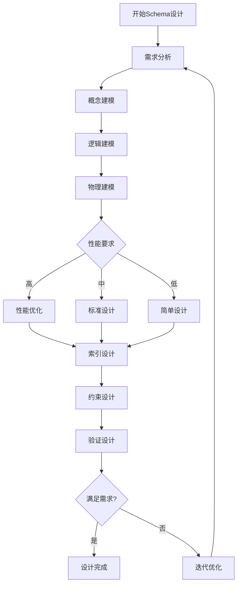

---

## 2. Schema设计流程

### 2.1. 设计流程概览

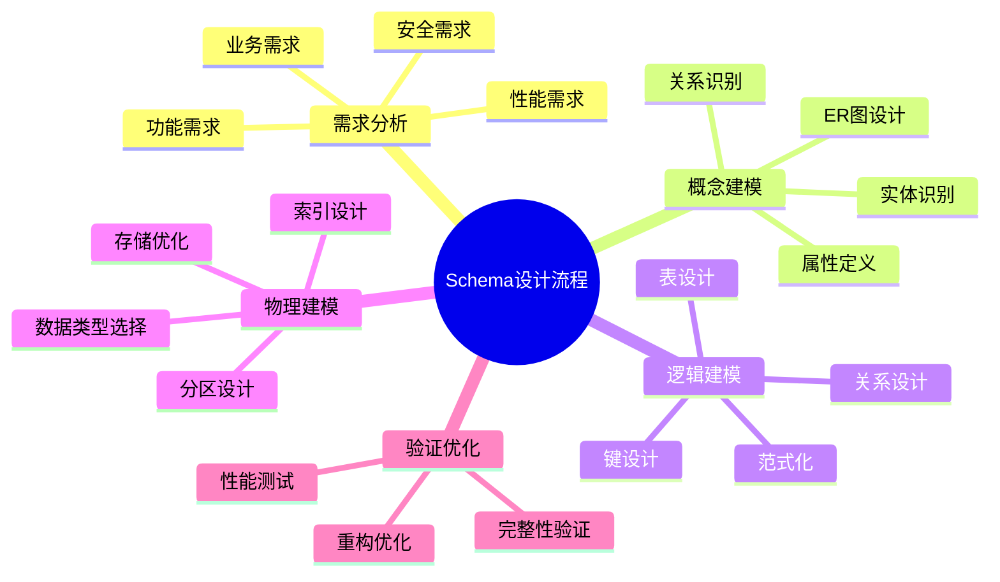

### 2.2. 设计阶段对比矩阵

| 设计阶段 | 输入 | 输出 | 主要活动 | 工具 |
|---------|------|------|---------|------|
| **需求分析** | 业务需求文档 | 需求规格说明 | 需求收集、分析 | 需求管理工具 |
| **概念建模** | 需求规格说明 | ER图 | 实体识别、关系建模 | ER工具 |
| **逻辑建模** | ER图 | 逻辑Schema | 表设计、范式化 | 数据库设计工具 |
| **物理建模** | 逻辑Schema | 物理Schema | 数据类型、索引 | DDL生成工具 |
| **验证优化** | 物理Schema | 优化Schema | 测试、调优 | 性能分析工具 |

---

## 3. 需求分析与建模

### 3.1. 需求收集方法

**需求来源**：

1. **业务需求**：
   - 业务流程分析
   - 业务规则识别
   - 业务实体识别

2. **功能需求**：
   - 数据操作需求
   - 查询需求
   - 报表需求

3. **非功能需求**：
   - 性能需求
   - 安全需求
   - 可用性需求

### 3.2. 需求分析决策树

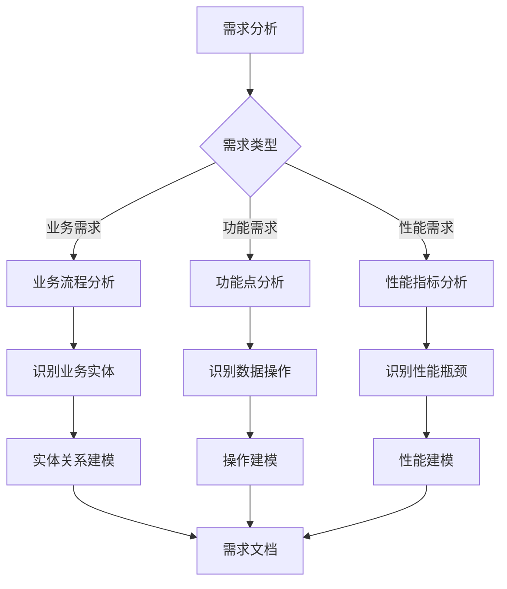

### 3.3. 需求建模方法

**用例建模**：

```text
用例：用户注册
前置条件：用户未注册
主流程：
  1. 用户输入注册信息
  2. 系统验证信息
  3. 创建用户记录
  4. 发送确认邮件
后置条件：用户记录已创建

数据需求：
  - 用户表：id, username, email, password_hash, created_at
  - 验证规则：email唯一，username唯一
```

**数据流建模**：


---

## 4. 概念模型设计

### 4.1. 实体识别

**实体识别方法**：

1. **名词识别法**：从需求文档中提取名词作为候选实体
2. **业务对象法**：识别业务中的核心对象
3. **数据流法**：从数据流中识别数据存储点

**实体识别决策树**：

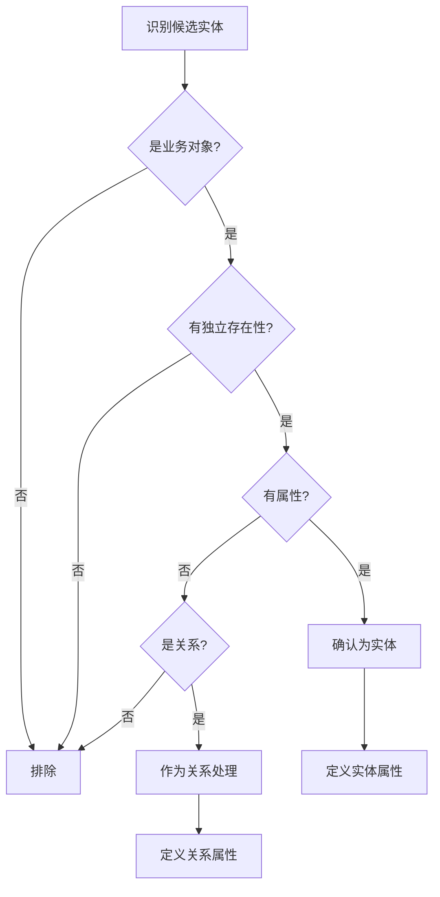

### 4.2. 关系识别

**关系类型**：

1. **一对一（1:1）**：每个实体实例只与另一个实体实例关联
2. **一对多（1:N）**：一个实体实例与多个另一个实体实例关联
3. **多对多（M:N）**：多个实体实例与多个另一个实体实例关联

**关系识别决策树**：

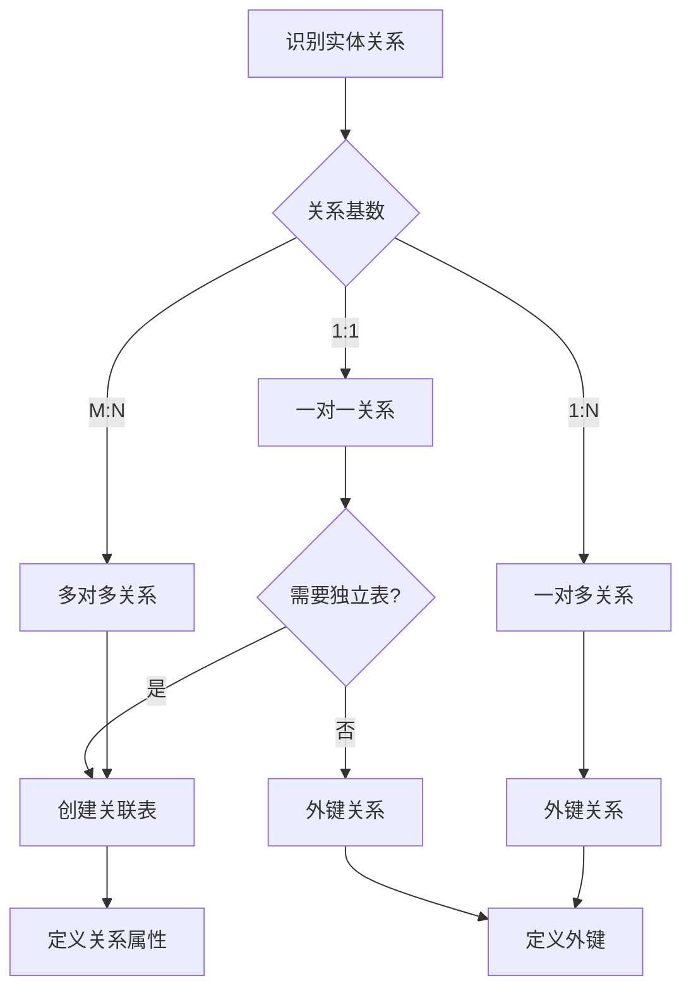

### 4.3. ER图设计

**ER图元素**：

- **实体**：矩形表示
- **属性**：椭圆表示
- **关系**：菱形表示
- **基数**：1, N, M标注

**ER图示例**：

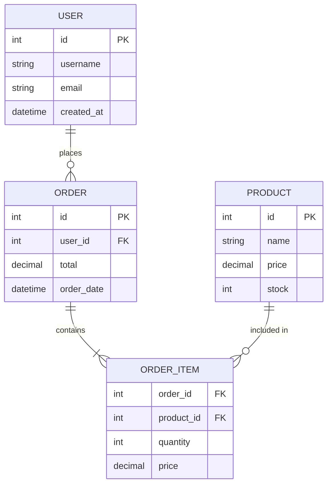

---

## 5. 逻辑模型设计

### 5.1. 表设计原则

**表设计原则**：

1. **单一职责**：每个表只表示一个实体或关系
2. **规范化**：遵循范式理论，消除冗余
3. **完整性**：定义适当的约束保证数据完整性
4. **可扩展性**：考虑未来需求变化

### 5.2. 表设计决策树

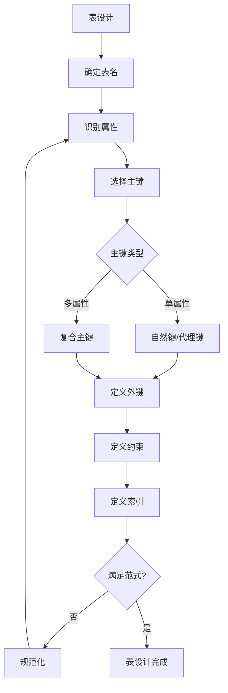

### 5.3. 键设计策略

**主键选择策略**：

| 策略 | 优点 | 缺点 | 适用场景 |
|------|------|------|---------|
| **自然键** | 有业务意义，查询方便 | 可能变化，复合键复杂 | 业务稳定的标识符 |
| **代理键** | 稳定，简单 | 无业务意义，需要额外查询 | 大多数场景 |
| **复合键** | 反映业务关系 | 复杂，性能影响 | 关联表 |

**外键设计策略**：

```sql
-- 外键约束示例
CREATE TABLE orders (
    id INTEGER PRIMARY KEY,
    user_id INTEGER NOT NULL,
    order_date DATE NOT NULL,
    FOREIGN KEY (user_id) REFERENCES users(id)
        ON DELETE CASCADE      -- 级联删除
        ON UPDATE CASCADE      -- 级联更新
);

-- 索引优化
CREATE INDEX idx_orders_user_id ON orders(user_id);
```

### 5.4. 范式化决策

**范式选择决策树**：

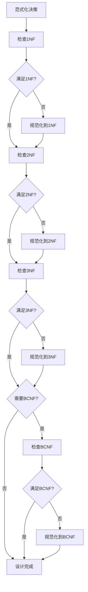

---

## 6. 物理模型设计

### 6.1. 数据类型选择

**数据类型选择决策树**：

```mermaid
flowchart TD
    A[选择数据类型] --> B{数据特性}

    B -->|整数| C{数值范围}
    B -->|小数| D{精度要求}
    B -->|文本| E{长度要求}
    B -->|日期时间| F{精度要求}
    B -->|布尔| G[BOOLEAN]

    C -->|小| H[SMALLINT]
    C -->|中| I[INTEGER]
    C -->|大| J[BIGINT]

    D -->|固定精度| K[DECIMAL]
    D -->|浮点| L[REAL/DOUBLE]

    E -->|短| M[VARCHAR(n)]
    E -->|长| N[TEXT]
    E -->|固定| O[CHAR(n)]

    F -->|日期| P[DATE]
    F -->|时间| Q[TIME]
    F -->|日期时间| R[TIMESTAMP]
```

### 6.2. 索引设计

**索引设计原则**：

1. **主键索引**：自动创建，无需手动创建
2. **外键索引**：通常需要创建以提高连接性能
3. **查询索引**：为频繁查询的列创建索引
4. **复合索引**：考虑查询模式创建复合索引

**索引设计决策树**：

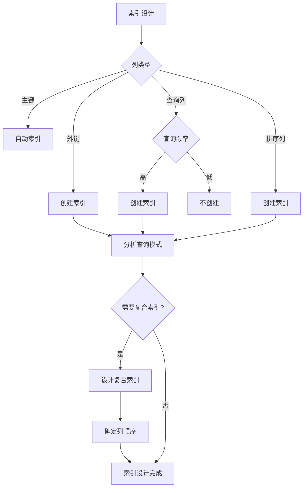

**索引设计示例**：

```sql
-- 单列索引
CREATE INDEX idx_users_email ON users(email);

-- 复合索引（考虑查询模式）
CREATE INDEX idx_orders_user_date ON orders(user_id, order_date DESC);

-- 部分索引（PostgreSQL）
CREATE INDEX idx_orders_active ON orders(user_id)
WHERE status = 'active';

-- 覆盖索引（包含查询所需的所有列）
CREATE INDEX idx_orders_covering ON orders(user_id, order_date, total);
```

### 6.3. 分区设计

**分区策略**：

| 分区类型 | 适用场景 | 优点 | 缺点 |
|---------|---------|------|------|
| **范围分区** | 时间序列数据 | 查询性能好 | 数据分布不均 |
| **列表分区** | 离散值分区 | 简单直观 | 分区数量限制 |
| **哈希分区** | 均匀分布 | 负载均衡 | 范围查询性能差 |
| **复合分区** | 复杂场景 | 灵活 | 管理复杂 |

**分区设计决策树**：

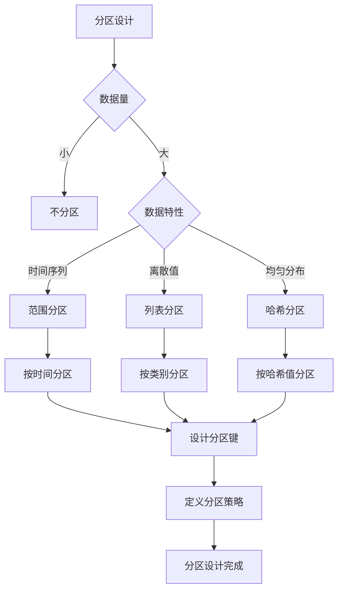

---

## 7. Schema优化与重构

### 7.1. 性能优化

**性能优化策略**：

1. **查询优化**：
   - 添加适当的索引
   - 优化查询语句
   - 使用物化视图

2. **存储优化**：
   - 数据类型优化
   - 表压缩
   - 分区

3. **架构优化**：
   - 读写分离
   - 缓存策略
   - 分库分表

### 7.2. Schema重构

**重构决策树**：

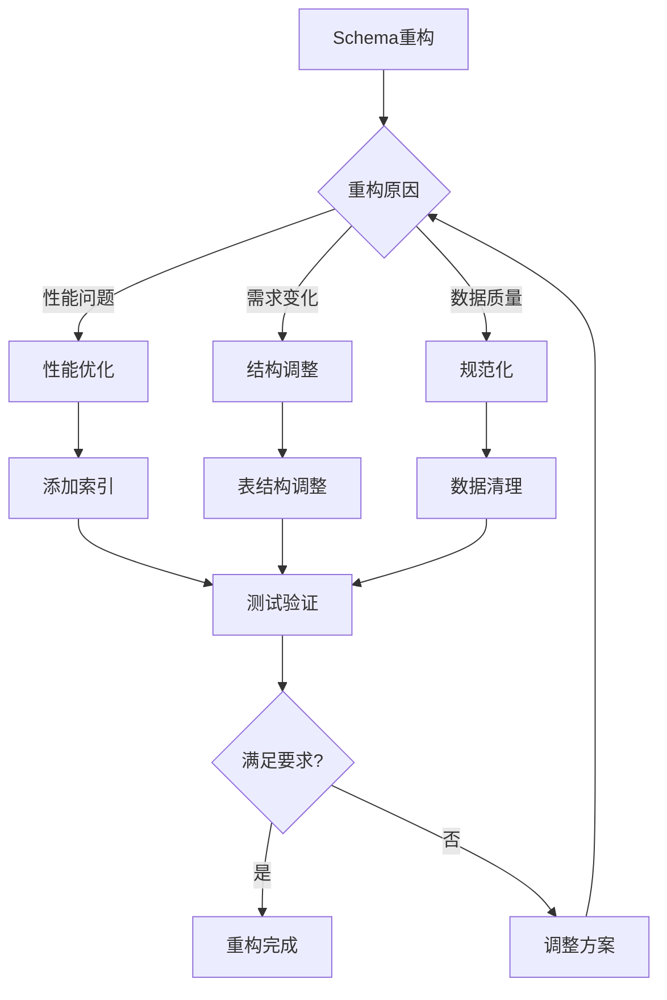

**重构步骤**：

```text
1. 分析当前Schema
2. 识别问题和改进点
3. 设计新Schema
4. 制定迁移计划
5. 执行迁移
6. 验证数据完整性
7. 性能测试
8. 回滚计划（如需要）
```

---

## 8. 设计模式与最佳实践

### 8.1. 常见设计模式

**1. 主从模式（Master-Detail）**：

```sql
-- 主表
CREATE TABLE orders (
    id INTEGER PRIMARY KEY,
    order_date DATE,
    total DECIMAL
);

-- 从表
CREATE TABLE order_items (
    order_id INTEGER,
    product_id INTEGER,
    quantity INTEGER,
    price DECIMAL,
    PRIMARY KEY (order_id, product_id),
    FOREIGN KEY (order_id) REFERENCES orders(id)
);
```

**2. 审计模式（Audit Pattern）**：

```sql
CREATE TABLE users (
    id INTEGER PRIMARY KEY,
    username VARCHAR(50),
    created_at TIMESTAMP DEFAULT CURRENT_TIMESTAMP,
    updated_at TIMESTAMP DEFAULT CURRENT_TIMESTAMP,
    created_by INTEGER,
    updated_by INTEGER
);

-- 审计日志表
CREATE TABLE audit_log (
    id SERIAL PRIMARY KEY,
    table_name VARCHAR(100) NOT NULL,
    record_id INTEGER NOT NULL,
    operation VARCHAR(20) NOT NULL,  -- INSERT, UPDATE, DELETE
    old_values JSONB,
    new_values JSONB,
    changed_by INTEGER,
    changed_at TIMESTAMP DEFAULT CURRENT_TIMESTAMP
);

-- 自动审计触发器
CREATE OR REPLACE FUNCTION audit_trigger()
RETURNS TRIGGER AS $$
BEGIN
    INSERT INTO audit_log (table_name, record_id, operation, old_values, new_values, changed_by)
    VALUES (
        TG_TABLE_NAME,
        COALESCE(NEW.id, OLD.id),
        TG_OP,
        row_to_json(OLD),
        row_to_json(NEW),
        current_setting('app.user_id', TRUE)::INTEGER
    );
    RETURN NEW;
END;
$$ LANGUAGE plpgsql;

CREATE TRIGGER users_audit
AFTER INSERT OR UPDATE OR DELETE ON users
FOR EACH ROW EXECUTE FUNCTION audit_trigger();
```

**3. 软删除模式（Soft Delete）**：

```sql
CREATE TABLE products (
    id INTEGER PRIMARY KEY,
    name VARCHAR(100),
    deleted_at TIMESTAMP NULL,
    deleted_by INTEGER NULL
);

-- 查询时过滤已删除记录
CREATE INDEX idx_products_active ON products(id) WHERE deleted_at IS NULL;

-- 创建视图只显示未删除记录
CREATE VIEW active_products AS
SELECT * FROM products WHERE deleted_at IS NULL;

-- 软删除函数
CREATE OR REPLACE FUNCTION soft_delete_product(p_id INTEGER, p_deleted_by INTEGER)
RETURNS VOID AS $$
BEGIN
    UPDATE products
    SET deleted_at = CURRENT_TIMESTAMP,
        deleted_by = p_deleted_by
    WHERE id = p_id AND deleted_at IS NULL;
END;
$$ LANGUAGE plpgsql;
```

**4. 版本控制模式（Versioning Pattern）**：

```sql
-- 版本化表设计
CREATE TABLE documents (
    id INTEGER PRIMARY KEY,
    current_version INTEGER NOT NULL DEFAULT 1,
    title VARCHAR(200) NOT NULL,
    content TEXT NOT NULL,
    created_at TIMESTAMP DEFAULT CURRENT_TIMESTAMP
);

CREATE TABLE document_versions (
    id INTEGER PRIMARY KEY,
    document_id INTEGER REFERENCES documents(id),
    version INTEGER NOT NULL,
    title VARCHAR(200) NOT NULL,
    content TEXT NOT NULL,
    created_by INTEGER,
    created_at TIMESTAMP DEFAULT CURRENT_TIMESTAMP,
    UNIQUE(document_id, version)
);

-- 版本创建触发器
CREATE OR REPLACE FUNCTION create_version()
RETURNS TRIGGER AS $$
BEGIN
    INSERT INTO document_versions (document_id, version, title, content, created_by)
    VALUES (NEW.id, NEW.current_version, NEW.title, NEW.content, current_setting('app.user_id', TRUE)::INTEGER);
    RETURN NEW;
END;
$$ LANGUAGE plpgsql;

CREATE TRIGGER document_version_trigger
AFTER INSERT OR UPDATE ON documents
FOR EACH ROW EXECUTE FUNCTION create_version();
```

**5. 多租户模式（Multi-Tenant Pattern）**：

```sql
-- 方案1：共享表，租户ID列
CREATE TABLE orders (
    id INTEGER PRIMARY KEY,
    tenant_id INTEGER NOT NULL,
    user_id INTEGER NOT NULL,
    total DECIMAL(10,2),
    FOREIGN KEY (tenant_id) REFERENCES tenants(id),
    FOREIGN KEY (user_id) REFERENCES users(id)
);

CREATE INDEX idx_orders_tenant ON orders(tenant_id);

-- 行级安全策略（PostgreSQL）
ALTER TABLE orders ENABLE ROW LEVEL SECURITY;

CREATE POLICY tenant_isolation ON orders
    FOR ALL
    USING (tenant_id = current_setting('app.tenant_id', TRUE)::INTEGER);

-- 方案2：每个租户独立Schema
CREATE SCHEMA tenant_1;
CREATE SCHEMA tenant_2;

CREATE TABLE tenant_1.orders (
    id INTEGER PRIMARY KEY,
    user_id INTEGER NOT NULL,
    total DECIMAL(10,2)
);

CREATE TABLE tenant_2.orders (
    id INTEGER PRIMARY KEY,
    user_id INTEGER NOT NULL,
    total DECIMAL(10,2)
);
```

**6. 时间序列模式（Time-Series Pattern）**：

```sql
-- 时间序列表设计
CREATE TABLE sensor_readings (
    sensor_id INTEGER NOT NULL,
    reading_time TIMESTAMP NOT NULL,
    value DECIMAL(10,2) NOT NULL,
    PRIMARY KEY (sensor_id, reading_time)
) PARTITION BY RANGE (reading_time);

-- 按月分区
CREATE TABLE sensor_readings_2024_01 PARTITION OF sensor_readings
    FOR VALUES FROM ('2024-01-01') TO ('2024-02-01');

CREATE TABLE sensor_readings_2024_02 PARTITION OF sensor_readings
    FOR VALUES FROM ('2024-02-01') TO ('2024-03-01');

-- 时间序列查询优化
CREATE INDEX idx_sensor_readings_time ON sensor_readings(sensor_id, reading_time DESC);

-- 自动分区创建函数
CREATE OR REPLACE FUNCTION create_monthly_partition(p_table_name TEXT, p_start_date DATE)
RETURNS VOID AS $$
DECLARE
    v_partition_name TEXT;
    v_end_date DATE;
    v_sql TEXT;
BEGIN
    v_end_date := p_start_date + INTERVAL '1 month';
    v_partition_name := p_table_name || '_' || to_char(p_start_date, 'YYYY_MM');

    v_sql := format('CREATE TABLE IF NOT EXISTS %I PARTITION OF %I FOR VALUES FROM (%L) TO (%L)',
        v_partition_name, p_table_name, p_start_date, v_end_date);

    EXECUTE v_sql;
END;
$$ LANGUAGE plpgsql;
```

### 8.2. 最佳实践矩阵

| 实践 | 描述 | 适用场景 | 优先级 |
|------|------|---------|--------|
| **使用代理键** | 使用自增ID作为主键 | 大多数表 | ⭐⭐⭐⭐⭐ |
| **外键约束** | 定义外键保证完整性 | 关联表 | ⭐⭐⭐⭐⭐ |
| **NOT NULL约束** | 必填字段使用NOT NULL | 关键字段 | ⭐⭐⭐⭐⭐ |
| **索引优化** | 为查询列创建索引 | 频繁查询 | ⭐⭐⭐⭐ |
| **命名规范** | 统一的命名约定 | 所有对象 | ⭐⭐⭐⭐ |
| **文档化** | 记录设计决策 | 复杂Schema | ⭐⭐⭐ |

---

## 9. 参考资料

- [关系数据库理论](./01-理论模型/01.02-关系数据库理论.md)
- [范式理论](./01-理论模型/01.02-关系数据库理论.md#5-范式理论)
- [PostgreSQL Schema设计](../PostgreSQL/INDEX.md)

---

**最后更新**：2025-01-15
**维护者**：Data-Science Team
**状态**：实施中
