# Schema设计方法论：数据库模式设计的系统化方法

> **创建日期**：2025-01-15
> **最后更新**：2025-12-01
> **版本**：v2.0 (增强版)
> **状态**：实施中

---

## 📋 目录

- [Schema设计方法论：数据库模式设计的系统化方法](#schema设计方法论数据库模式设计的系统化方法)
  - [📋 目录](#-目录)
  - [1. 概述](#1-概述)
    - [1.1. Schema设计知识体系思维导图](#11-schema设计知识体系思维导图)
    - [1.2. Schema设计的核心目标](#12-schema设计的核心目标)
    - [1.3. Schema设计决策树](#13-schema设计决策树)
    - [1.4. 设计方法论演进时间线](#14-设计方法论演进时间线)
  - [2. 形式化理论基础](#2-形式化理论基础)
    - [2.1. 关系模型的形式化定义](#21-关系模型的形式化定义)
    - [2.2. 函数依赖与范式理论](#22-函数依赖与范式理论)
    - [2.3. 范式层级形式化证明](#23-范式层级形式化证明)
    - [2.4. Schema设计正确性验证](#24-schema设计正确性验证)
  - [3. Schema设计流程](#3-schema设计流程)
    - [3.1. 设计流程概览](#31-设计流程概览)
    - [3.2. 设计阶段对比矩阵](#32-设计阶段对比矩阵)
    - [3.3. 敏捷与瀑布设计流程对比](#33-敏捷与瀑布设计流程对比)
  - [4. 领域驱动设计（DDD）与Schema设计集成](#4-领域驱动设计ddd与schema设计集成)
    - [4.1. DDD核心概念与数据库映射](#41-ddd核心概念与数据库映射)
    - [4.2. 聚合根与表设计](#42-聚合根与表设计)
    - [4.3. 限界上下文与Schema边界](#43-限界上下文与schema边界)
    - [4.4. DDD战术模式数据库实现](#44-ddd战术模式数据库实现)
  - [5. 需求分析与建模](#5-需求分析与建模)
    - [5.1. 需求收集方法](#51-需求收集方法)
    - [5.2. 需求分析决策树](#52-需求分析决策树)
    - [5.3. 需求建模方法](#53-需求建模方法)
    - [5.4. 事件风暴与数据建模](#54-事件风暴与数据建模)
  - [6. 概念模型设计](#6-概念模型设计)
    - [6.1. 实体识别](#61-实体识别)
    - [6.2. 关系识别](#62-关系识别)
    - [6.3. ER图设计](#63-er图设计)
    - [6.4. 概念模型形式化验证](#64-概念模型形式化验证)
  - [7. 逻辑模型设计](#7-逻辑模型设计)
    - [7.1. 表设计原则](#71-表设计原则)
    - [7.2. 表设计决策树](#72-表设计决策树)
    - [7.3. 键设计策略](#73-键设计策略)
    - [7.4. 范式化决策](#74-范式化决策)
    - [7.5. 反范式化策略](#75-反范式化策略)
  - [8. 物理模型设计](#8-物理模型设计)
    - [8.1. 数据类型选择](#81-数据类型选择)
    - [8.2. 数据类型选择决策矩阵](#82-数据类型选择决策矩阵)
    - [8.3. 索引设计](#83-索引设计)
    - [8.4. 索引类型对比矩阵](#84-索引类型对比矩阵)
    - [8.5. 分区设计](#85-分区设计)
  - [9. Schema优化与重构](#9-schema优化与重构)
    - [9.1. 性能优化](#91-性能优化)
    - [9.2. Schema重构](#92-schema重构)
    - [9.3. 零停机迁移策略](#93-零停机迁移策略)
  - [10. 设计模式与最佳实践](#10-设计模式与最佳实践)
    - [10.1. 常见设计模式](#101-常见设计模式)
    - [10.2. 模式选择决策矩阵](#102-模式选择决策矩阵)
    - [10.3. 最佳实践矩阵](#103-最佳实践矩阵)
  - [11. 2024-2025最新趋势](#11-2024-2025最新趋势)
    - [11.1. Schema设计技术演进](#111-schema设计技术演进)
    - [11.2. AI辅助Schema设计](#112-ai辅助schema设计)
    - [11.3. 云原生Schema设计模式](#113-云原生schema设计模式)
  - [12. 工具与自动化](#12-工具与自动化)
    - [12.1. Schema设计工具对比](#121-schema设计工具对比)
    - [12.2. Schema验证自动化](#122-schema验证自动化)
  - [13. 参考资料](#13-参考资料)
    - [13.1. 权威文献](#131-权威文献)
    - [13.2. 在线资源](#132-在线资源)

---

## 1. 概述

Schema设计是数据库设计的核心，涉及从业务需求到物理实现的完整过程。本文档基于形式化理论，结合领域驱动设计(DDD)方法论，提供系统化的Schema设计指南。

### 1.1. Schema设计知识体系思维导图

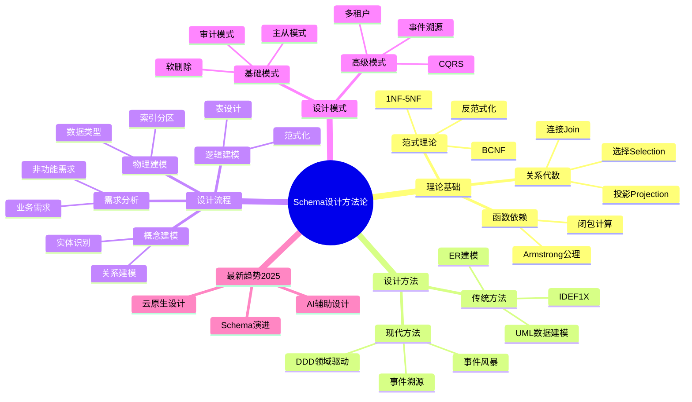

### 1.2. Schema设计的核心目标

**目标层次模型**：

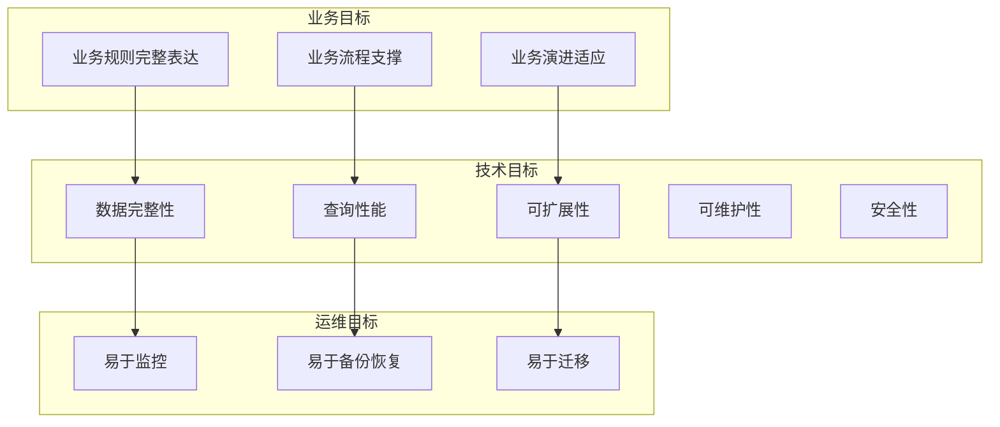

**目标优先级矩阵**：

| 目标 | OLTP系统 | OLAP系统 | 混合系统 | 微服务 |
|------|---------|---------|---------|--------|
| **数据完整性** | ⭐⭐⭐⭐⭐ | ⭐⭐⭐ | ⭐⭐⭐⭐ | ⭐⭐⭐⭐ |
| **查询性能** | ⭐⭐⭐⭐ | ⭐⭐⭐⭐⭐ | ⭐⭐⭐⭐ | ⭐⭐⭐ |
| **写入性能** | ⭐⭐⭐⭐⭐ | ⭐⭐ | ⭐⭐⭐⭐ | ⭐⭐⭐⭐ |
| **可扩展性** | ⭐⭐⭐ | ⭐⭐⭐⭐ | ⭐⭐⭐⭐ | ⭐⭐⭐⭐⭐ |
| **可维护性** | ⭐⭐⭐⭐ | ⭐⭐⭐ | ⭐⭐⭐⭐ | ⭐⭐⭐⭐⭐ |

### 1.3. Schema设计决策树

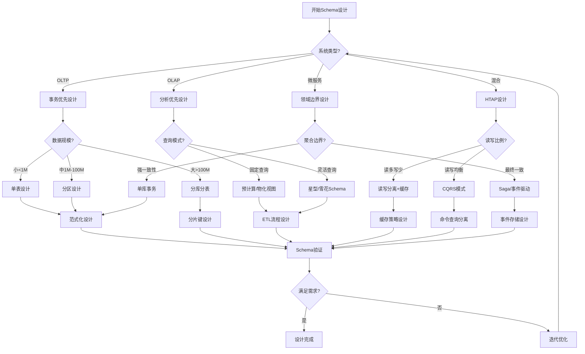

### 1.4. 设计方法论演进时间线

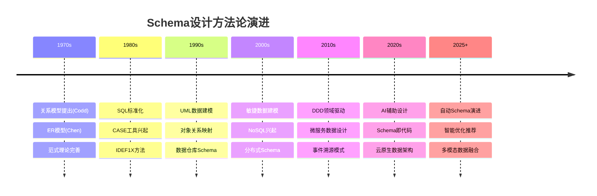

---

## 2. 形式化理论基础

### 2.1. 关系模型的形式化定义

**定义2.1.1（关系Schema）**：

关系Schema R 是一个二元组：

```text
R = (U, F)

其中：
- U = {A₁, A₂, ..., Aₙ} 是属性集合
- F 是 U 上的函数依赖集合
```

**定义2.1.2（关系实例）**：

关系 R 的实例 r 是定义在属性集合 U 上的一个有限集合：

```text
r ⊆ dom(A₁) × dom(A₂) × ... × dom(Aₙ)

其中 dom(Aᵢ) 是属性 Aᵢ 的值域
```

**关系的形式化性质**：

| 性质 | 形式化定义 | 实际意义 |
|------|-----------|---------|
| **元组唯一性** | ∀t₁,t₂∈r, t₁≠t₂ ⟹ ∃Aᵢ: t₁[Aᵢ]≠t₂[Aᵢ] | 无重复行 |
| **属性原子性** | ∀A∈U, ∀t∈r: t[A]∈dom(A)且为原子值 | 值不可分 |
| **元组无序性** | r = {t₁,...,tₙ} = {t_{π(1)},...,t_{π(n)}} | 行顺序无关 |
| **属性无序性** | R(A,B,C) ≡ R(B,C,A) | 列顺序无关 |

### 2.2. 函数依赖与范式理论

**定义2.2.1（函数依赖）**：

设 R 是关系Schema，X, Y ⊆ U。函数依赖 X → Y 成立，当且仅当：

```text
∀t₁,t₂∈r(R): t₁[X] = t₂[X] ⟹ t₁[Y] = t₂[Y]
```

**Armstrong公理系统**：

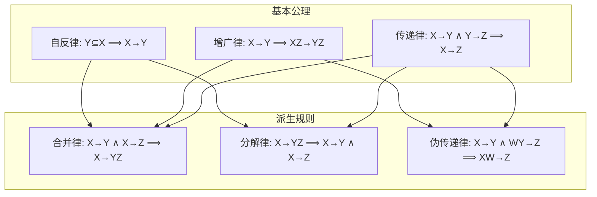

**函数依赖类型对比矩阵**：

| 依赖类型 | 形式化定义 | 判定条件 | 对范式的影响 |
|---------|-----------|---------|-------------|
| **平凡依赖** | Y ⊆ X 时 X→Y | 总是成立 | 无影响 |
| **完全依赖** | X→Y 且 ∀X'⊂X: X'↛Y | 最小决定因素 | 2NF要求 |
| **部分依赖** | ∃X'⊂X: X'→Y | 存在真子集决定 | 违反2NF |
| **传递依赖** | X→Y, Y→Z, Y↛X | 间接决定 | 违反3NF |

### 2.3. 范式层级形式化证明

**定理2.3.1（范式层级包含关系）**：

```text
5NF ⊂ 4NF ⊂ BCNF ⊂ 3NF ⊂ 2NF ⊂ 1NF

证明（以3NF⊂2NF为例）：
1. 假设R满足3NF
2. 3NF定义：对于每个非平凡FD X→Y，X是超键或Y是主属性
3. 2NF定义：每个非主属性完全依赖于主键
4. 若存在部分依赖K'→A（K'⊂K是主键真子集，A非主属性）
5. 则K'不是超键（因为K'⊂K），且A不是主属性
6. 这违反3NF定义
7. 因此R满足2NF ∎
```

**范式选择决策矩阵**：

| 范式 | 消除的异常 | 查询复杂度 | 更新复杂度 | 推荐场景 |
|------|-----------|-----------|-----------|---------|
| **1NF** | - | ⭐ | ⭐ | 最低要求 |
| **2NF** | 部分依赖冗余 | ⭐⭐ | ⭐⭐ | 复合主键表 |
| **3NF** | 传递依赖冗余 | ⭐⭐⭐ | ⭐⭐⭐ | 大多数OLTP |
| **BCNF** | 所有FD冗余 | ⭐⭐⭐⭐ | ⭐⭐⭐⭐ | 严格要求 |
| **4NF** | 多值依赖冗余 | ⭐⭐⭐⭐ | ⭐⭐⭐⭐ | 多对多关系 |
| **5NF** | 连接依赖冗余 | ⭐⭐⭐⭐⭐ | ⭐⭐⭐⭐⭐ | 理论研究 |

### 2.4. Schema设计正确性验证

**算法2.4.1：Schema范式验证**:

```python
def verify_normalization(schema: RelationSchema, target_nf: str) -> ValidationResult:
    """
    验证Schema是否满足目标范式

    参数:
        schema: 关系Schema (属性集合, 函数依赖集合)
        target_nf: 目标范式 ('1NF', '2NF', '3NF', 'BCNF', '4NF', '5NF')

    返回:
        ValidationResult: (is_valid, violations, suggestions)
    """
    violations = []

    # 1NF检查：属性原子性
    if target_nf in ['1NF', '2NF', '3NF', 'BCNF', '4NF', '5NF']:
        for attr in schema.attributes:
            if not is_atomic(attr.domain):
                violations.append(f"属性 {attr.name} 违反1NF：值域非原子")

    # 2NF检查：消除部分依赖
    if target_nf in ['2NF', '3NF', 'BCNF', '4NF', '5NF']:
        candidate_keys = compute_candidate_keys(schema)
        for fd in schema.functional_dependencies:
            if is_partial_dependency(fd, candidate_keys):
                violations.append(f"FD {fd} 违反2NF：部分依赖")

    # 3NF检查：消除传递依赖
    if target_nf in ['3NF', 'BCNF', '4NF', '5NF']:
        for fd in schema.functional_dependencies:
            X, Y = fd.determinant, fd.dependent
            if not is_superkey(X, schema) and not is_prime_attribute(Y, schema):
                violations.append(f"FD {fd} 违反3NF：非超键决定非主属性")

    # BCNF检查：所有决定因素都是超键
    if target_nf in ['BCNF', '4NF', '5NF']:
        for fd in schema.functional_dependencies:
            if not is_trivial(fd) and not is_superkey(fd.determinant, schema):
                violations.append(f"FD {fd} 违反BCNF：决定因素非超键")

    return ValidationResult(
        is_valid=len(violations) == 0,
        violations=violations,
        suggestions=generate_decomposition_suggestions(violations)
    )
```

---

## 3. Schema设计流程

### 3.1. 设计流程概览

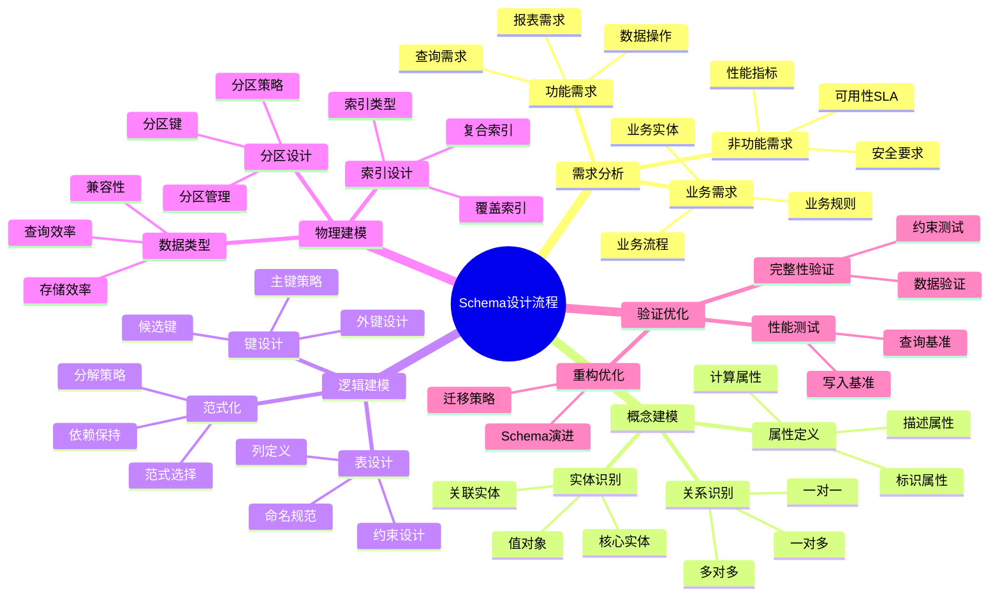

### 3.2. 设计阶段对比矩阵

| 设计阶段 | 输入 | 输出 | 主要活动 | 工具 | 参与角色 |
|---------|------|------|---------|------|---------|
| **需求分析** | 业务需求文档 | 需求规格说明 | 需求收集、分析 | Jira, Confluence | BA, PM |
| **概念建模** | 需求规格说明 | ER图/领域模型 | 实体识别、DDD建模 | Draw.io, Miro | 架构师, DBA |
| **逻辑建模** | ER图 | 逻辑Schema | 表设计、范式化 | DbSchema, ERwin | DBA |
| **物理建模** | 逻辑Schema | DDL脚本 | 数据类型、索引 | pgAdmin, DataGrip | DBA |
| **验证优化** | 物理Schema | 优化Schema | 测试、调优 | pgBench, EXPLAIN | DBA, Dev |

### 3.3. 敏捷与瀑布设计流程对比

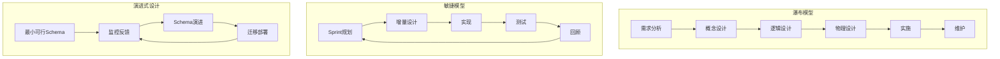

**设计方法对比矩阵**：

| 维度 | 瀑布模型 | 敏捷模型 | 演进式设计 |
|------|---------|---------|-----------|
| **适用场景** | 需求明确、稳定 | 需求变化、迭代 | 持续演进 |
| **设计深度** | 完整详细 | 增量设计 | 最小可行 |
| **变更成本** | 高 | 中 | 低 |
| **文档要求** | 详细文档 | 轻量文档 | 代码即文档 |
| **团队协作** | 阶段交接 | 持续协作 | DevOps |
| **风险管理** | 后期暴露 | 早期发现 | 持续监控 |

---

## 4. 领域驱动设计（DDD）与Schema设计集成

### 4.1. DDD核心概念与数据库映射

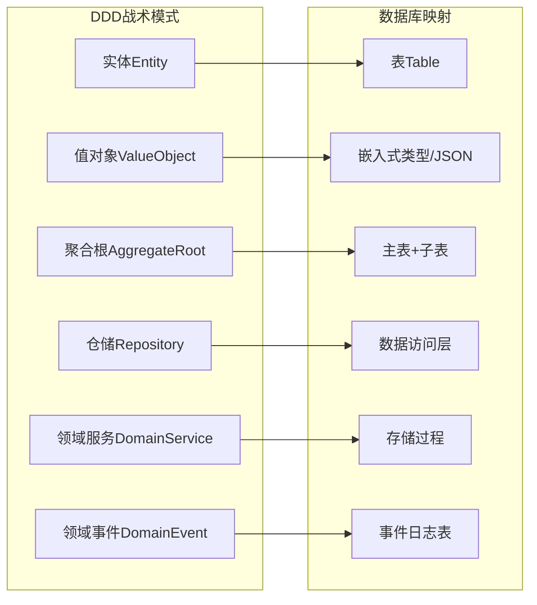

**DDD概念数据库映射对比**：

| DDD概念 | 数据库映射方式 | 优点 | 缺点 | 示例 |
|---------|--------------|------|------|------|
| **实体(Entity)** | 独立表 | 清晰、可查询 | 需要ID管理 | `users`表 |
| **值对象(VO)** | 嵌入列/JSON | 简单、原子 | 查询受限 | `address`字段 |
| **聚合根** | 主表+级联 | 一致性保证 | 性能考量 | `orders`+`order_items` |
| **仓储** | Repository模式 | 解耦 | 抽象开销 | `OrderRepository` |
| **领域事件** | 事件表 | 可追溯 | 存储增长 | `domain_events` |

### 4.2. 聚合根与表设计

**聚合设计原则**：

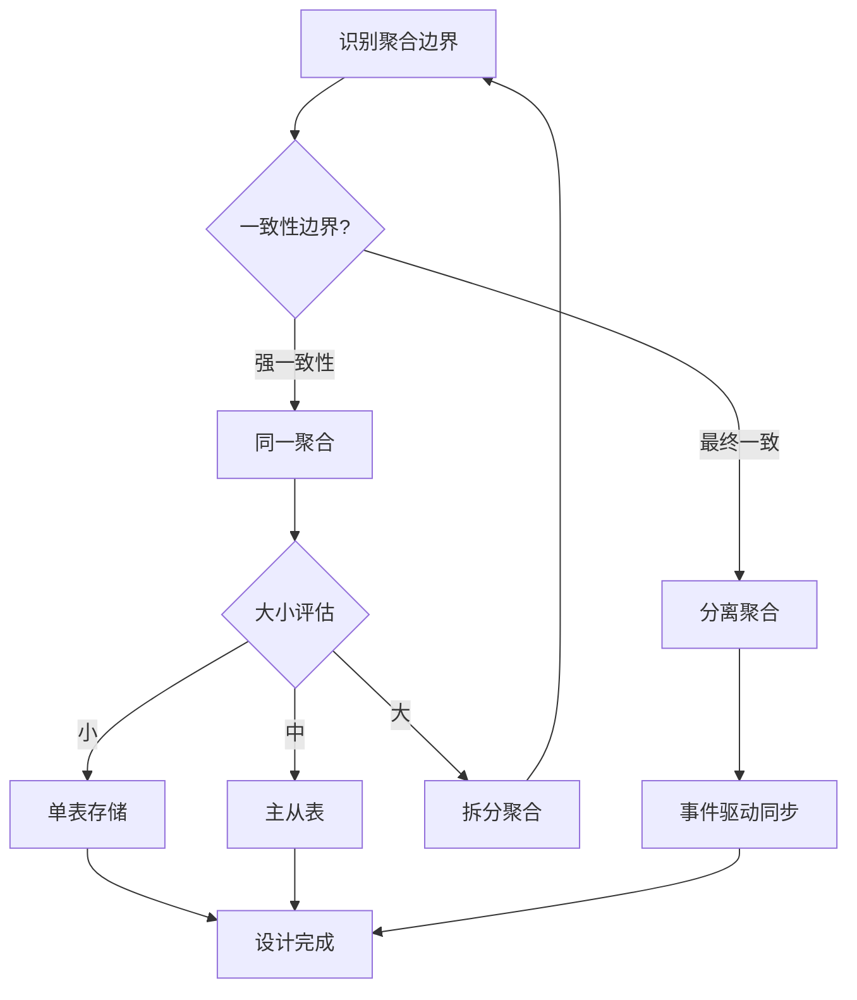

**聚合根表设计示例**：

```sql
-- 订单聚合根设计
-- 聚合根：Order
-- 聚合成员：OrderItem, ShippingAddress

CREATE TABLE orders (
    -- 聚合根标识
    id UUID PRIMARY KEY DEFAULT gen_random_uuid(),
    order_number VARCHAR(32) UNIQUE NOT NULL,

    -- 聚合版本（乐观锁）
    version INTEGER NOT NULL DEFAULT 1,

    -- 聚合状态
    status VARCHAR(20) NOT NULL DEFAULT 'CREATED',

    -- 值对象：嵌入式存储
    shipping_address JSONB NOT NULL,
    -- 示例: {"street": "123 Main St", "city": "NYC", "zip": "10001"}

    -- 聚合元数据
    created_at TIMESTAMPTZ NOT NULL DEFAULT CURRENT_TIMESTAMP,
    updated_at TIMESTAMPTZ NOT NULL DEFAULT CURRENT_TIMESTAMP,

    -- 领域约束
    CONSTRAINT valid_status CHECK (status IN ('CREATED', 'PAID', 'SHIPPED', 'DELIVERED', 'CANCELLED'))
);

-- 聚合成员：订单项（只能通过聚合根访问）
CREATE TABLE order_items (
    id UUID PRIMARY KEY DEFAULT gen_random_uuid(),
    order_id UUID NOT NULL REFERENCES orders(id) ON DELETE CASCADE,

    -- 产品快照（值对象）
    product_snapshot JSONB NOT NULL,
    -- 示例: {"product_id": "...", "name": "...", "price": 99.99}

    quantity INTEGER NOT NULL CHECK (quantity > 0),
    unit_price DECIMAL(10,2) NOT NULL CHECK (unit_price >= 0),

    -- 不允许直接查询，只通过聚合根
    CONSTRAINT fk_order FOREIGN KEY (order_id) REFERENCES orders(id)
);

-- 聚合根索引
CREATE INDEX idx_orders_number ON orders(order_number);
CREATE INDEX idx_orders_status ON orders(status);

-- 聚合成员索引（仅支持聚合内查询）
CREATE INDEX idx_order_items_order ON order_items(order_id);

-- 聚合不变量检查触发器
CREATE OR REPLACE FUNCTION check_order_invariants()
RETURNS TRIGGER AS $$
BEGIN
    -- 不变量1：订单至少有一个订单项（在业务层保证）
    -- 不变量2：已发货订单不能修改
    IF TG_OP = 'UPDATE' AND OLD.status IN ('SHIPPED', 'DELIVERED') THEN
        IF NEW.status NOT IN ('SHIPPED', 'DELIVERED', 'CANCELLED') THEN
            RAISE EXCEPTION 'Cannot modify shipped order status to %', NEW.status;
        END IF;
    END IF;

    NEW.updated_at = CURRENT_TIMESTAMP;
    NEW.version = OLD.version + 1;
    RETURN NEW;
END;
$$ LANGUAGE plpgsql;

CREATE TRIGGER order_invariants_check
BEFORE UPDATE ON orders
FOR EACH ROW EXECUTE FUNCTION check_order_invariants();
```

### 4.3. 限界上下文与Schema边界

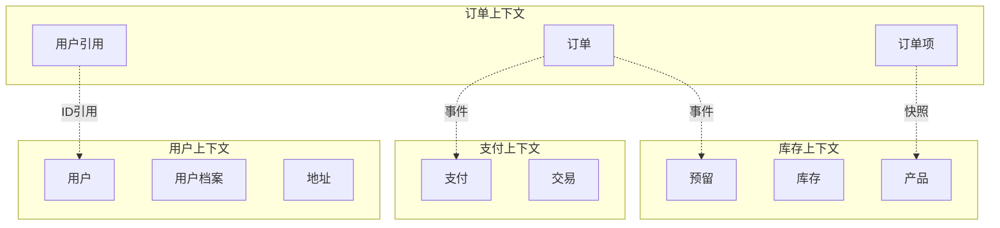

**上下文间数据共享策略**：

| 策略 | 描述 | 优点 | 缺点 | 适用场景 |
|------|------|------|------|---------|
| **共享内核** | 共享Schema | 简单 | 耦合高 | 紧密相关上下文 |
| **客户-供应商** | 供应商提供API | 解耦 | 依赖 | 上下游关系明确 |
| **防腐层** | 翻译层隔离 | 完全解耦 | 复杂 | 遗留系统集成 |
| **发布语言** | 标准化格式 | 通用 | 协商成本 | 多上下文集成 |
| **分离方式** | 完全独立 | 自治 | 同步难 | 独立演进 |

### 4.4. DDD战术模式数据库实现

**值对象存储策略**：

```sql
-- 策略1：嵌入式列（简单值对象）
CREATE TABLE users (
    id UUID PRIMARY KEY,
    -- Money值对象
    account_balance_amount DECIMAL(10,2) NOT NULL DEFAULT 0,
    account_balance_currency VARCHAR(3) NOT NULL DEFAULT 'USD',
    -- Address值对象
    address_street VARCHAR(200),
    address_city VARCHAR(100),
    address_zip VARCHAR(20)
);

-- 策略2：JSONB存储（复杂值对象）
CREATE TABLE products (
    id UUID PRIMARY KEY,
    name VARCHAR(200) NOT NULL,
    -- 复杂值对象
    specifications JSONB NOT NULL DEFAULT '{}',
    -- 示例: {"weight": {"value": 1.5, "unit": "kg"}, "dimensions": {...}}
    pricing JSONB NOT NULL,
    -- 示例: {"base_price": 99.99, "currency": "USD", "tax_rate": 0.1}

    -- JSONB约束
    CONSTRAINT valid_specs CHECK (jsonb_typeof(specifications) = 'object'),
    CONSTRAINT valid_pricing CHECK (
        pricing ? 'base_price' AND
        pricing ? 'currency' AND
        (pricing->>'base_price')::DECIMAL >= 0
    )
);

-- 策略3：关联表（值对象集合）
CREATE TABLE user_phones (
    user_id UUID NOT NULL REFERENCES users(id) ON DELETE CASCADE,
    phone_type VARCHAR(20) NOT NULL,
    country_code VARCHAR(5) NOT NULL,
    number VARCHAR(20) NOT NULL,
    is_primary BOOLEAN DEFAULT FALSE,
    PRIMARY KEY (user_id, phone_type, number)
);
```

**领域事件存储**：

```sql
-- 领域事件表
CREATE TABLE domain_events (
    event_id UUID PRIMARY KEY DEFAULT gen_random_uuid(),
    aggregate_type VARCHAR(100) NOT NULL,
    aggregate_id UUID NOT NULL,
    event_type VARCHAR(100) NOT NULL,
    event_data JSONB NOT NULL,
    metadata JSONB DEFAULT '{}',
    occurred_at TIMESTAMPTZ NOT NULL DEFAULT CURRENT_TIMESTAMP,
    published_at TIMESTAMPTZ,

    -- 事件版本（用于乐观并发）
    sequence_number BIGINT NOT NULL,

    UNIQUE(aggregate_type, aggregate_id, sequence_number)
);

-- 事件索引
CREATE INDEX idx_events_aggregate ON domain_events(aggregate_type, aggregate_id, sequence_number);
CREATE INDEX idx_events_type ON domain_events(event_type);
CREATE INDEX idx_events_occurred ON domain_events(occurred_at);
CREATE INDEX idx_events_unpublished ON domain_events(published_at) WHERE published_at IS NULL;

-- 事件发布函数
CREATE OR REPLACE FUNCTION publish_domain_event(
    p_aggregate_type VARCHAR,
    p_aggregate_id UUID,
    p_event_type VARCHAR,
    p_event_data JSONB
)
RETURNS UUID AS $$
DECLARE
    v_event_id UUID;
    v_sequence BIGINT;
BEGIN
    -- 获取下一个序列号
    SELECT COALESCE(MAX(sequence_number), 0) + 1 INTO v_sequence
    FROM domain_events
    WHERE aggregate_type = p_aggregate_type AND aggregate_id = p_aggregate_id;

    INSERT INTO domain_events (aggregate_type, aggregate_id, event_type, event_data, sequence_number)
    VALUES (p_aggregate_type, p_aggregate_id, p_event_type, p_event_data, v_sequence)
    RETURNING event_id INTO v_event_id;

    -- 通知订阅者（PostgreSQL NOTIFY）
    PERFORM pg_notify('domain_events', json_build_object(
        'event_id', v_event_id,
        'aggregate_type', p_aggregate_type,
        'event_type', p_event_type
    )::TEXT);

    RETURN v_event_id;
END;
$$ LANGUAGE plpgsql;
```

---

## 5. 需求分析与建模

### 5.1. 需求收集方法

**需求收集方法对比**：

| 方法 | 描述 | 优点 | 缺点 | 适用场景 |
|------|------|------|------|---------|
| **访谈** | 与利益相关者面谈 | 深入理解 | 耗时 | 复杂业务 |
| **问卷** | 标准化问题收集 | 规模化 | 深度不足 | 大范围调研 |
| **观察** | 观察现有系统使用 | 发现隐性需求 | 主观性 | 现有系统改造 |
| **原型** | 快速原型验证 | 直观 | 可能误导 | 新系统设计 |
| **事件风暴** | 领域专家协作 | 全面 | 需要技巧 | DDD项目 |

### 5.2. 需求分析决策树

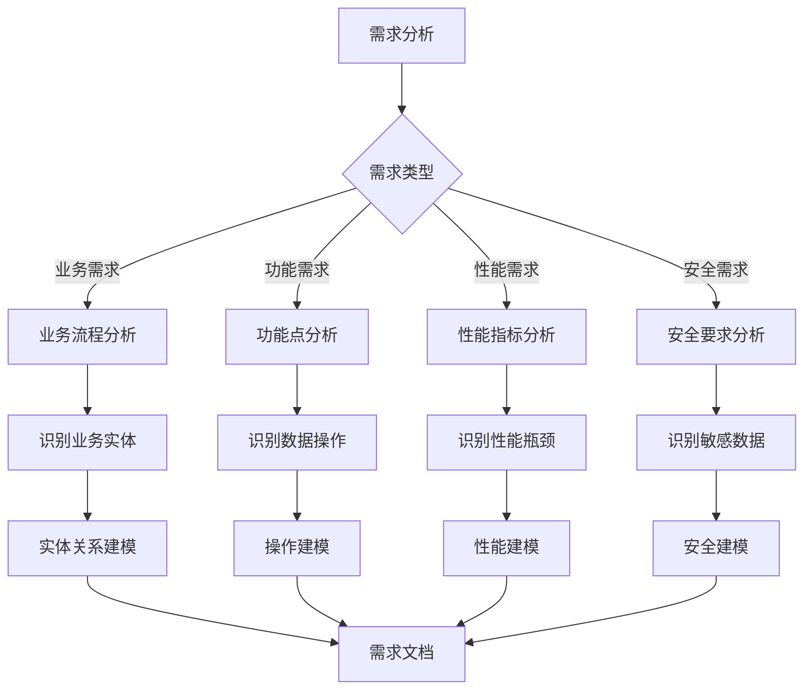

### 5.3. 需求建模方法

**用例建模**：

```text
用例：用户注册
前置条件：用户未注册
主流程：
  1. 用户输入注册信息
  2. 系统验证信息
  3. 创建用户记录
  4. 发送确认邮件
后置条件：用户记录已创建

数据需求：
  - 用户表：id, username, email, password_hash, created_at
  - 验证规则：email唯一，username唯一
```

**数据流建模**：


### 5.4. 事件风暴与数据建模

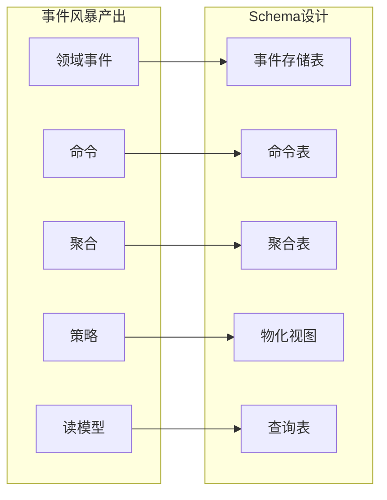

---

## 6. 概念模型设计

### 6.1. 实体识别

**实体识别方法**：

1. **名词识别法**：从需求文档中提取名词作为候选实体
2. **业务对象法**：识别业务中的核心对象
3. **数据流法**：从数据流中识别数据存储点
4. **DDD方法**：通过事件风暴识别聚合根

**实体识别决策树**：

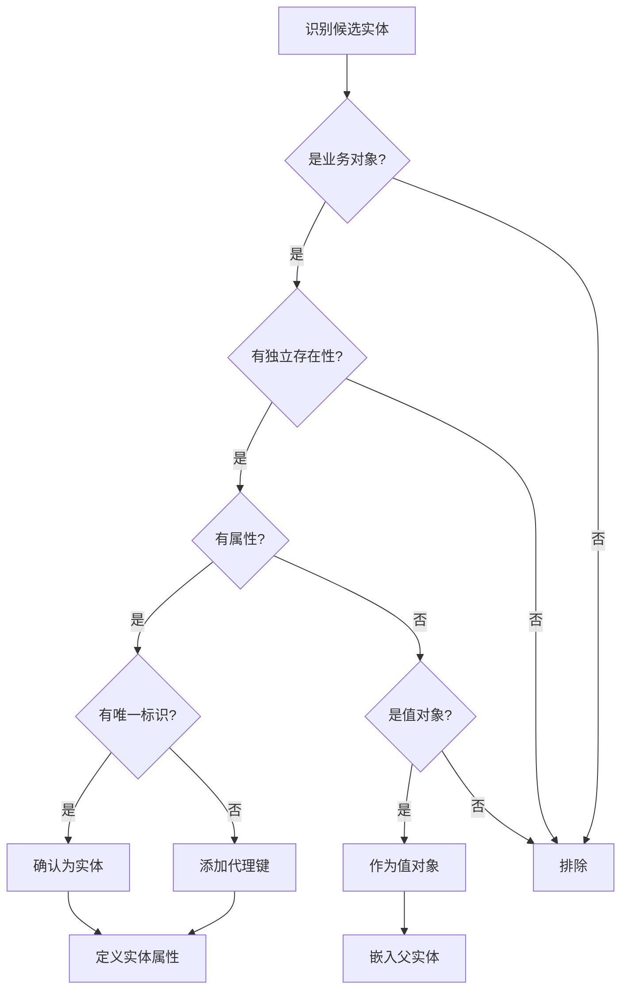

### 6.2. 关系识别

**关系类型**：

1. **一对一（1:1）**：每个实体实例只与另一个实体实例关联
2. **一对多（1:N）**：一个实体实例与多个另一个实体实例关联
3. **多对多（M:N）**：多个实体实例与多个另一个实体实例关联

**关系识别决策树**：

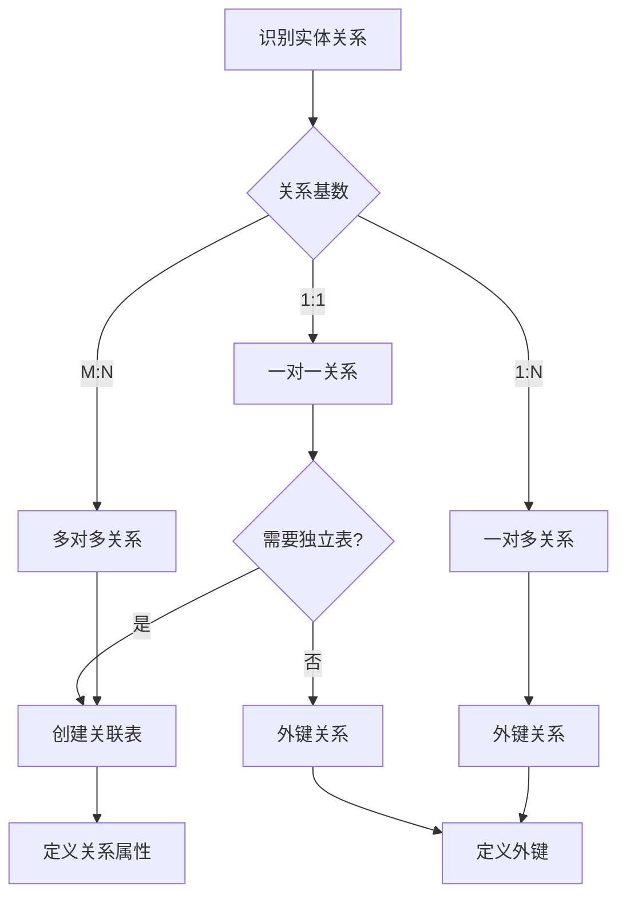

### 6.3. ER图设计

**ER图示例**：

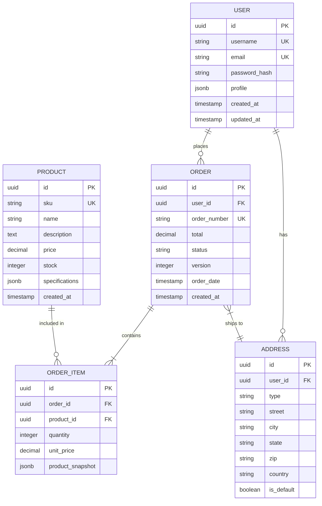

### 6.4. 概念模型形式化验证

**验证检查清单**：

| 检查项 | 验证方法 | 通过条件 |
|-------|---------|---------|
| **实体完整性** | 每个实体有唯一标识 | 所有实体有PK |
| **关系完整性** | 关系有明确基数 | 所有关系标注基数 |
| **属性完整性** | 属性归属明确 | 无悬挂属性 |
| **业务规则覆盖** | 业务约束可表达 | 约束可映射 |
| **无冗余实体** | 无重复概念 | 实体唯一 |

---

## 7. 逻辑模型设计

### 7.1. 表设计原则

**表设计原则**：

1. **单一职责**：每个表只表示一个实体或关系
2. **规范化**：遵循范式理论，消除冗余
3. **完整性**：定义适当的约束保证数据完整性
4. **可扩展性**：考虑未来需求变化
5. **命名一致性**：遵循命名规范

**命名规范**：

| 对象类型 | 命名规则 | 示例 |
|---------|---------|------|
| **表名** | snake_case复数 | `users`, `order_items` |
| **列名** | snake_case | `created_at`, `user_id` |
| **主键** | `id` 或 `{table}_id` | `id`, `user_id` |
| **外键** | `{referenced_table}_id` | `user_id`, `order_id` |
| **索引** | `idx_{table}_{columns}` | `idx_orders_user_id` |
| **唯一约束** | `uk_{table}_{columns}` | `uk_users_email` |
| **检查约束** | `chk_{table}_{description}` | `chk_orders_status` |

### 7.2. 表设计决策树

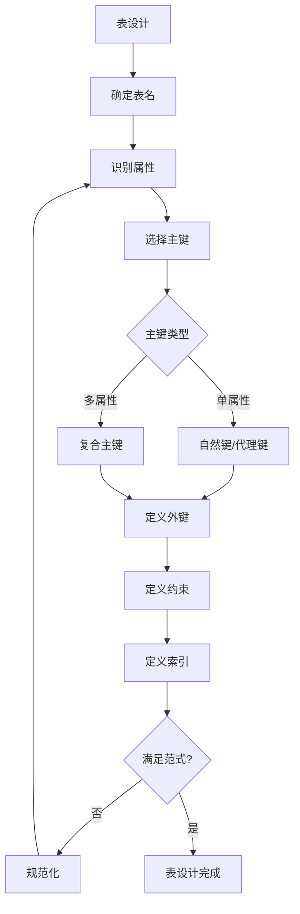

### 7.3. 键设计策略

**主键选择策略**：

| 策略 | 类型 | 优点 | 缺点 | 适用场景 |
|------|------|------|------|---------|
| **UUID** | 代理键 | 全局唯一、分布式友好 | 存储大、无序 | 分布式系统 |
| **ULID** | 代理键 | 有序UUID、可排序 | 非标准 | 需要排序的分布式 |
| **自增ID** | 代理键 | 简单、有序、紧凑 | 单点、可预测 | 单机OLTP |
| **雪花ID** | 代理键 | 有序、分布式 | 时钟依赖 | 高并发分布式 |
| **自然键** | 自然键 | 有业务意义 | 可能变化 | 稳定业务标识 |
| **复合键** | 复合键 | 反映业务关系 | 复杂 | 关联表 |

**主键选择决策树**：

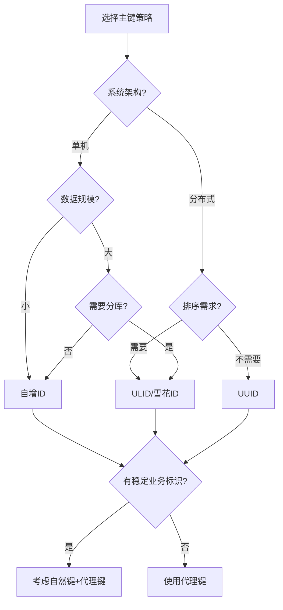

**外键设计示例**：

```sql
-- 外键约束示例
CREATE TABLE orders (
    id UUID PRIMARY KEY DEFAULT gen_random_uuid(),
    user_id UUID NOT NULL,
    shipping_address_id UUID,
    order_date TIMESTAMPTZ NOT NULL DEFAULT CURRENT_TIMESTAMP,

    -- 强外键（用户必须存在）
    CONSTRAINT fk_orders_user
        FOREIGN KEY (user_id) REFERENCES users(id)
        ON DELETE RESTRICT      -- 阻止删除有订单的用户
        ON UPDATE CASCADE,      -- 级联更新

    -- 可空外键（地址可选）
    CONSTRAINT fk_orders_address
        FOREIGN KEY (shipping_address_id) REFERENCES addresses(id)
        ON DELETE SET NULL      -- 删除地址时置空
        ON UPDATE CASCADE
);

-- 外键索引（重要！）
CREATE INDEX idx_orders_user_id ON orders(user_id);
CREATE INDEX idx_orders_address_id ON orders(shipping_address_id);
```

### 7.4. 范式化决策

**范式选择决策树**：

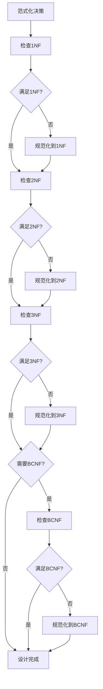

### 7.5. 反范式化策略

**反范式化决策矩阵**：

| 场景 | 反范式化策略 | 优点 | 代价 | 建议 |
|------|-------------|------|------|------|
| **频繁JOIN** | 合并表 | 减少JOIN | 冗余 | 读多写少 |
| **计算字段** | 预计算列 | 避免计算 | 同步 | 复杂计算 |
| **聚合查询** | 汇总表 | 快速聚合 | 存储 | 报表场景 |
| **历史快照** | 冗余快照 | 时间旅行 | 存储 | 审计需求 |
| **层次数据** | 物化路径 | 快速查询 | 更新复杂 | 树形结构 |

**反范式化示例**：

```sql
-- 场景：订单列表需要显示用户名和产品名
-- 范式化设计需要3表JOIN

-- 反范式化方案1：冗余字段
CREATE TABLE order_items_denormalized (
    id UUID PRIMARY KEY,
    order_id UUID NOT NULL REFERENCES orders(id),
    product_id UUID NOT NULL REFERENCES products(id),

    -- 冗余字段（查询优化）
    product_name VARCHAR(200) NOT NULL,     -- 冗余
    product_sku VARCHAR(50) NOT NULL,       -- 冗余

    quantity INTEGER NOT NULL,
    unit_price DECIMAL(10,2) NOT NULL,

    -- 同步触发器维护冗余字段
    created_at TIMESTAMPTZ DEFAULT CURRENT_TIMESTAMP
);

-- 同步触发器
CREATE OR REPLACE FUNCTION sync_order_item_product()
RETURNS TRIGGER AS $$
BEGIN
    IF TG_OP = 'INSERT' OR TG_OP = 'UPDATE' THEN
        SELECT name, sku INTO NEW.product_name, NEW.product_sku
        FROM products WHERE id = NEW.product_id;
    END IF;
    RETURN NEW;
END;
$$ LANGUAGE plpgsql;

CREATE TRIGGER trg_sync_product
BEFORE INSERT OR UPDATE ON order_items_denormalized
FOR EACH ROW EXECUTE FUNCTION sync_order_item_product();

-- 反范式化方案2：物化视图
CREATE MATERIALIZED VIEW mv_order_details AS
SELECT
    o.id AS order_id,
    o.order_number,
    o.status,
    u.username,
    u.email,
    oi.product_id,
    p.name AS product_name,
    oi.quantity,
    oi.unit_price,
    (oi.quantity * oi.unit_price) AS line_total
FROM orders o
JOIN users u ON o.user_id = u.id
JOIN order_items oi ON o.id = oi.order_id
JOIN products p ON oi.product_id = p.id;

-- 刷新物化视图
CREATE UNIQUE INDEX idx_mv_order_details ON mv_order_details(order_id, product_id);
REFRESH MATERIALIZED VIEW CONCURRENTLY mv_order_details;
```

---

## 8. 物理模型设计

### 8.1. 数据类型选择

**数据类型选择决策树**：

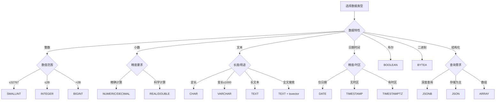

### 8.2. 数据类型选择决策矩阵

| 数据类型 | 存储大小 | 范围/精度 | 适用场景 | PostgreSQL类型 |
|---------|---------|----------|---------|---------------|
| **小整数** | 2字节 | -32768~32767 | 状态码、枚举 | SMALLINT |
| **整数** | 4字节 | ±2.1B | 普通ID、计数 | INTEGER |
| **大整数** | 8字节 | ±9.2E18 | 大ID、时间戳 | BIGINT |
| **精确小数** | 可变 | 任意精度 | 金额、比率 | NUMERIC(p,s) |
| **浮点数** | 4/8字节 | 约6/15位 | 科学计算 | REAL/DOUBLE |
| **定长字符** | n字节 | 固定长度 | 代码、编码 | CHAR(n) |
| **变长字符** | 1+n字节 | 最大1GB | 名称、描述 | VARCHAR(n)/TEXT |
| **日期** | 4字节 | 4713BC-5874897AD | 生日、日期 | DATE |
| **时间戳** | 8字节 | 微秒精度 | 创建时间 | TIMESTAMP |
| **带时区时间戳** | 8字节 | 微秒精度+时区 | 国际化时间 | TIMESTAMPTZ |
| **UUID** | 16字节 | 128位 | 分布式ID | UUID |
| **JSON** | 可变 | 任意JSON | 灵活结构 | JSONB |

### 8.3. 索引设计

**索引设计原则**：

1. **主键索引**：自动创建，无需手动创建
2. **外键索引**：通常需要创建以提高连接性能
3. **查询索引**：为频繁查询的列创建索引
4. **复合索引**：考虑查询模式，最左前缀原则
5. **部分索引**：只索引部分数据，减少存储

**索引设计决策树**：

```mermaid
flowchart TD
    A[索引设计] --> B{列用途}

    B -->|主键| C[自动B-Tree]
    B -->|外键| D[创建B-Tree]
    B -->|等值查询| E{选择性?}
    B -->|范围查询| F[B-Tree]
    B -->|全文搜索| G[GIN + tsvector]
    B -->|JSON查询| H[GIN]
    B -->|地理空间| I[GiST/SP-GiST]
    B -->|向量相似| J[HNSW/IVFFlat]

    E -->|高>10%| K[创建B-Tree]
    E -->|低<10%| L[考虑部分索引]

    D --> M[分析查询模式]
    K --> M
    L --> M
    F --> M

    M --> N{需要复合索引?}
    N -->|是| O[设计复合索引]
    N -->|否| P[完成]

    O --> Q[确定列顺序]
    Q --> R{需要覆盖索引?}
    R -->|是| S[INCLUDE列]
    R -->|否| P
    S --> P
```

### 8.4. 索引类型对比矩阵

| 索引类型 | 适用操作 | 优点 | 缺点 | PostgreSQL语法 |
|---------|---------|------|------|---------------|
| **B-Tree** | =, <, >, BETWEEN | 通用、有序 | 不适合数组 | 默认 |
| **Hash** | = | 等值快 | 仅等值 | USING hash |
| **GIN** | 数组、JSON、全文 | 多值高效 | 写入慢 | USING gin |
| **GiST** | 几何、范围、全文 | 灵活 | 精度损失 | USING gist |
| **SP-GiST** | 非平衡结构 | 特定数据高效 | 场景限制 | USING spgist |
| **BRIN** | 大表范围 | 存储小 | 精度低 | USING brin |
| **HNSW** | 向量相似 | ANN高效 | 内存大 | USING hnsw |

**索引设计示例**：

```sql
-- 单列索引
CREATE INDEX idx_users_email ON users(email);

-- 复合索引（考虑查询模式和列顺序）
CREATE INDEX idx_orders_user_status_date
ON orders(user_id, status, order_date DESC);

-- 部分索引（只索引活跃数据）
CREATE INDEX idx_orders_active
ON orders(user_id, order_date)
WHERE status NOT IN ('CANCELLED', 'COMPLETED');

-- 覆盖索引（避免回表）
CREATE INDEX idx_orders_covering
ON orders(user_id, order_date)
INCLUDE (status, total);

-- 表达式索引
CREATE INDEX idx_users_email_lower ON users(LOWER(email));

-- GIN索引（JSONB）
CREATE INDEX idx_products_specs ON products USING gin(specifications);

-- 全文搜索索引
CREATE INDEX idx_products_search
ON products USING gin(to_tsvector('english', name || ' ' || description));
```

### 8.5. 分区设计

**分区策略**：

| 分区类型 | 适用场景 | 优点 | 缺点 | PostgreSQL语法 |
|---------|---------|------|------|---------------|
| **范围分区** | 时间序列 | 查询性能好 | 数据分布不均 | PARTITION BY RANGE |
| **列表分区** | 离散值 | 简单直观 | 分区数量限制 | PARTITION BY LIST |
| **哈希分区** | 均匀分布 | 负载均衡 | 范围查询差 | PARTITION BY HASH |

**分区设计示例**：

```sql
-- 范围分区：按月分区订单表
CREATE TABLE orders_partitioned (
    id UUID NOT NULL,
    user_id UUID NOT NULL,
    order_date TIMESTAMPTZ NOT NULL,
    total DECIMAL(10,2),
    status VARCHAR(20),
    PRIMARY KEY (id, order_date)
) PARTITION BY RANGE (order_date);

-- 创建分区
CREATE TABLE orders_2024_01 PARTITION OF orders_partitioned
    FOR VALUES FROM ('2024-01-01') TO ('2024-02-01');
CREATE TABLE orders_2024_02 PARTITION OF orders_partitioned
    FOR VALUES FROM ('2024-02-01') TO ('2024-03-01');
-- ... 更多分区

-- 自动分区管理函数
CREATE OR REPLACE FUNCTION create_orders_partition(p_date DATE)
RETURNS VOID AS $$
DECLARE
    v_partition_name TEXT;
    v_start_date DATE;
    v_end_date DATE;
BEGIN
    v_start_date := DATE_TRUNC('month', p_date);
    v_end_date := v_start_date + INTERVAL '1 month';
    v_partition_name := 'orders_' || TO_CHAR(v_start_date, 'YYYY_MM');

    EXECUTE format(
        'CREATE TABLE IF NOT EXISTS %I PARTITION OF orders_partitioned
         FOR VALUES FROM (%L) TO (%L)',
        v_partition_name, v_start_date, v_end_date
    );
END;
$$ LANGUAGE plpgsql;

-- 列表分区：按地区分区
CREATE TABLE users_by_region (
    id UUID NOT NULL,
    region VARCHAR(10) NOT NULL,
    username VARCHAR(50),
    PRIMARY KEY (id, region)
) PARTITION BY LIST (region);

CREATE TABLE users_us PARTITION OF users_by_region FOR VALUES IN ('US');
CREATE TABLE users_eu PARTITION OF users_by_region FOR VALUES IN ('EU', 'UK');
CREATE TABLE users_asia PARTITION OF users_by_region FOR VALUES IN ('CN', 'JP', 'KR');
```

---

## 9. Schema优化与重构

### 9.1. 性能优化

**性能优化策略**：

```mermaid
flowchart TD
    A[性能问题] --> B{问题类型}

    B -->|查询慢| C[查询优化]
    B -->|写入慢| D[写入优化]
    B -->|锁竞争| E[并发优化]
    B -->|存储大| F[存储优化]

    C --> C1[添加索引]
    C --> C2[优化SQL]
    C --> C3[物化视图]
    C --> C4[分区剪枝]

    D --> D1[批量写入]
    D --> D2[延迟索引]
    D --> D3[异步写入]
    D --> D4[分区]

    E --> E1[减小事务]
    E --> E2[乐观锁]
    E --> E3[分区隔离]

    F --> F1[数据归档]
    F --> F2[压缩]
    F --> F3[列存储]
```

### 9.2. Schema重构

**重构决策树**：

```mermaid
flowchart TD
    A[Schema重构] --> B{重构原因}

    B -->|性能问题| C[性能优化]
    B -->|需求变化| D[结构调整]
    B -->|数据质量| E[规范化]
    B -->|技术债务| F[架构升级]

    C --> G[分析瓶颈]
    D --> H[评估影响]
    E --> I[数据清理]
    F --> J[迁移规划]

    G --> K[实施方案]
    H --> K
    I --> K
    J --> K

    K --> L{在线迁移?}
    L -->|是| M[零停机迁移]
    L -->|否| N[计划停机]

    M --> O[验证测试]
    N --> O
    O --> P{成功?}
    P -->|是| Q[完成]
    P -->|否| R[回滚]
```

### 9.3. 零停机迁移策略

**迁移模式对比**：

| 迁移模式 | 描述 | 适用场景 | 复杂度 |
|---------|------|---------|-------|
| **扩展收缩** | 先添加后删除 | 添加列、改名 | 低 |
| **双写** | 同时写新旧 | 表迁移 | 中 |
| **影子表** | 后台迁移 | 大表重构 | 高 |
| **蓝绿部署** | 完整切换 | 大改动 | 高 |

**零停机迁移示例**：

```sql
-- 场景：将username列从VARCHAR(50)扩展到VARCHAR(100)
-- PostgreSQL可以直接扩展，但这里演示完整流程

-- 步骤1：添加新列
ALTER TABLE users ADD COLUMN username_new VARCHAR(100);

-- 步骤2：同步数据
UPDATE users SET username_new = username WHERE username_new IS NULL;

-- 步骤3：添加触发器保持同步
CREATE OR REPLACE FUNCTION sync_username()
RETURNS TRIGGER AS $$
BEGIN
    NEW.username_new = NEW.username;
    RETURN NEW;
END;
$$ LANGUAGE plpgsql;

CREATE TRIGGER trg_sync_username
BEFORE INSERT OR UPDATE ON users
FOR EACH ROW EXECUTE FUNCTION sync_username();

-- 步骤4：应用层切换（读新写双写）
-- 步骤5：验证数据一致性
SELECT COUNT(*) FROM users WHERE username != username_new;

-- 步骤6：删除旧列
DROP TRIGGER trg_sync_username ON users;
ALTER TABLE users DROP COLUMN username;
ALTER TABLE users RENAME COLUMN username_new TO username;
```

---

## 10. 设计模式与最佳实践

### 10.1. 常见设计模式

**1. 审计模式（Audit Pattern）**：

```sql
-- 审计日志表
CREATE TABLE audit_log (
    id BIGSERIAL PRIMARY KEY,
    table_name VARCHAR(100) NOT NULL,
    record_id UUID NOT NULL,
    operation VARCHAR(20) NOT NULL,
    old_values JSONB,
    new_values JSONB,
    changed_by UUID,
    changed_at TIMESTAMPTZ DEFAULT CURRENT_TIMESTAMP,
    client_ip INET,
    user_agent TEXT
);

CREATE INDEX idx_audit_table_record ON audit_log(table_name, record_id);
CREATE INDEX idx_audit_changed_at ON audit_log(changed_at);

-- 通用审计触发器
CREATE OR REPLACE FUNCTION audit_trigger_func()
RETURNS TRIGGER AS $$
BEGIN
    INSERT INTO audit_log (table_name, record_id, operation, old_values, new_values, changed_by)
    VALUES (
        TG_TABLE_NAME,
        COALESCE(NEW.id, OLD.id),
        TG_OP,
        CASE WHEN TG_OP IN ('UPDATE', 'DELETE') THEN to_jsonb(OLD) END,
        CASE WHEN TG_OP IN ('INSERT', 'UPDATE') THEN to_jsonb(NEW) END,
        current_setting('app.current_user_id', TRUE)::UUID
    );
    RETURN COALESCE(NEW, OLD);
END;
$$ LANGUAGE plpgsql;

-- 应用到表
CREATE TRIGGER audit_users
AFTER INSERT OR UPDATE OR DELETE ON users
FOR EACH ROW EXECUTE FUNCTION audit_trigger_func();
```

**2. 软删除模式（Soft Delete）**：

```sql
CREATE TABLE products (
    id UUID PRIMARY KEY DEFAULT gen_random_uuid(),
    name VARCHAR(200) NOT NULL,
    price DECIMAL(10,2),

    -- 软删除字段
    is_deleted BOOLEAN DEFAULT FALSE,
    deleted_at TIMESTAMPTZ,
    deleted_by UUID,

    created_at TIMESTAMPTZ DEFAULT CURRENT_TIMESTAMP
);

-- 部分索引：只索引未删除数据
CREATE INDEX idx_products_active ON products(name) WHERE NOT is_deleted;

-- 活跃数据视图
CREATE VIEW active_products AS
SELECT * FROM products WHERE NOT is_deleted;

-- 软删除函数
CREATE OR REPLACE FUNCTION soft_delete(
    p_table_name TEXT,
    p_id UUID,
    p_deleted_by UUID DEFAULT NULL
)
RETURNS BOOLEAN AS $$
BEGIN
    EXECUTE format(
        'UPDATE %I SET is_deleted = TRUE, deleted_at = NOW(), deleted_by = $1 WHERE id = $2',
        p_table_name
    ) USING p_deleted_by, p_id;
    RETURN FOUND;
END;
$$ LANGUAGE plpgsql;
```

**3. 多租户模式（Multi-Tenant）**：

```sql
-- 方案1：行级安全（RLS）
CREATE TABLE tenant_data (
    id UUID PRIMARY KEY DEFAULT gen_random_uuid(),
    tenant_id UUID NOT NULL REFERENCES tenants(id),
    data JSONB,
    created_at TIMESTAMPTZ DEFAULT CURRENT_TIMESTAMP
);

CREATE INDEX idx_tenant_data_tenant ON tenant_data(tenant_id);

ALTER TABLE tenant_data ENABLE ROW LEVEL SECURITY;

CREATE POLICY tenant_isolation ON tenant_data
    FOR ALL
    USING (tenant_id = current_setting('app.current_tenant_id')::UUID);

-- 方案2：Schema隔离
CREATE OR REPLACE FUNCTION create_tenant_schema(p_tenant_id TEXT)
RETURNS VOID AS $$
BEGIN
    EXECUTE format('CREATE SCHEMA IF NOT EXISTS tenant_%s', p_tenant_id);
    EXECUTE format('
        CREATE TABLE tenant_%s.users (
            id UUID PRIMARY KEY DEFAULT gen_random_uuid(),
            email VARCHAR(200) UNIQUE NOT NULL,
            created_at TIMESTAMPTZ DEFAULT CURRENT_TIMESTAMP
        )', p_tenant_id);
    -- 创建其他表...
END;
$$ LANGUAGE plpgsql;
```

### 10.2. 模式选择决策矩阵

| 设计模式 | 适用场景 | 优点 | 缺点 | 复杂度 |
|---------|---------|------|------|-------|
| **审计模式** | 合规、追溯 | 完整记录 | 存储增长 | ⭐⭐ |
| **软删除** | 数据恢复 | 可恢复 | 查询复杂 | ⭐ |
| **版本控制** | 历史追溯 | 时间旅行 | 存储大 | ⭐⭐⭐ |
| **多租户RLS** | SaaS | 简单 | 性能影响 | ⭐⭐ |
| **多租户Schema** | SaaS | 隔离好 | 管理复杂 | ⭐⭐⭐ |
| **事件溯源** | 领域驱动 | 可重放 | 复杂 | ⭐⭐⭐⭐ |
| **CQRS** | 读写分离 | 性能好 | 复杂 | ⭐⭐⭐⭐ |

### 10.3. 最佳实践矩阵

| 实践 | 描述 | 适用场景 | 优先级 |
|------|------|---------|--------|
| **使用UUID主键** | 分布式友好 | 分布式系统 | ⭐⭐⭐⭐⭐ |
| **外键索引** | 提高JOIN性能 | 关联表 | ⭐⭐⭐⭐⭐ |
| **NOT NULL约束** | 数据完整性 | 关键字段 | ⭐⭐⭐⭐⭐ |
| **CHECK约束** | 业务规则 | 枚举、范围 | ⭐⭐⭐⭐ |
| **TIMESTAMPTZ** | 时区安全 | 国际化 | ⭐⭐⭐⭐ |
| **JSONB** | 灵活结构 | 可变Schema | ⭐⭐⭐⭐ |
| **命名规范** | 一致性 | 所有对象 | ⭐⭐⭐⭐ |
| **注释文档** | 可维护性 | 复杂Schema | ⭐⭐⭐ |

---

## 11. 2024-2025最新趋势

### 11.1. Schema设计技术演进

```mermaid
timeline
    title Schema设计技术演进 2020-2025
    2020 : 微服务数据设计成熟
         : 事件驱动架构普及
    2021 : Schema即代码兴起
         : GitOps数据管理
    2022 : 向量数据库Schema
         : 知识图谱融合
    2023 : AI辅助Schema设计
         : LLM数据模型
    2024 : 自动Schema优化
         : 多模态数据融合
    2025 : 智能Schema演进
         : 自适应数据架构
```

### 11.2. AI辅助Schema设计

**AI辅助设计能力矩阵**：

| 能力 | 当前成熟度 | 2025预期 | 工具示例 |
|------|-----------|---------|---------|
| **需求分析** | ⭐⭐⭐ | ⭐⭐⭐⭐ | GPT-4, Claude |
| **ER图生成** | ⭐⭐ | ⭐⭐⭐⭐ | DBML AI |
| **DDL生成** | ⭐⭐⭐⭐ | ⭐⭐⭐⭐⭐ | Copilot |
| **索引推荐** | ⭐⭐⭐ | ⭐⭐⭐⭐⭐ | pgAnalyze AI |
| **查询优化** | ⭐⭐⭐⭐ | ⭐⭐⭐⭐⭐ | OtterTune |
| **Schema演进** | ⭐⭐ | ⭐⭐⭐⭐ | 研发中 |

### 11.3. 云原生Schema设计模式

**云原生数据库选择矩阵**：

| 场景 | AWS | GCP | Azure | 开源替代 |
|------|-----|-----|-------|---------|
| **OLTP** | Aurora PostgreSQL | Cloud SQL | Azure PostgreSQL | PostgreSQL |
| **OLAP** | Redshift | BigQuery | Synapse | ClickHouse |
| **文档** | DocumentDB | Firestore | Cosmos DB | MongoDB |
| **图** | Neptune | - | Cosmos DB | Neo4j |
| **向量** | OpenSearch | Vertex AI | Cognitive Search | pgvector |
| **时序** | Timestream | - | Time Series | TimescaleDB |

---

## 12. 工具与自动化

### 12.1. Schema设计工具对比

| 工具 | 类型 | 优点 | 缺点 | 适用场景 |
|------|------|------|------|---------|
| **DbSchema** | GUI | 可视化强 | 付费 | 企业项目 |
| **DBeaver** | GUI/免费 | 多数据库 | 建模弱 | 日常开发 |
| **pgModeler** | GUI/开源 | PostgreSQL专用 | 学习曲线 | PG项目 |
| **dbdiagram.io** | 在线 | 简单易用 | 功能有限 | 快速原型 |
| **DBML** | DSL | 代码化 | 需学习 | IaC项目 |
| **Prisma** | ORM | 类型安全 | 迁移限制 | 现代应用 |

### 12.2. Schema验证自动化

```python
# schema_validator.py - Schema验证自动化脚本

from dataclasses import dataclass
from typing import List, Dict, Any
import re

@dataclass
class ValidationRule:
    name: str
    check: callable
    severity: str  # 'error', 'warning', 'info'

class SchemaValidator:
    """Schema验证器"""

    def __init__(self):
        self.rules = [
            ValidationRule("表命名规范", self._check_table_naming, "error"),
            ValidationRule("主键存在", self._check_primary_key, "error"),
            ValidationRule("外键索引", self._check_foreign_key_index, "warning"),
            ValidationRule("时间戳字段", self._check_timestamp_fields, "info"),
            ValidationRule("注释存在", self._check_comments, "info"),
        ]

    def validate(self, schema: Dict[str, Any]) -> List[Dict]:
        """验证Schema"""
        results = []
        for rule in self.rules:
            issues = rule.check(schema)
            for issue in issues:
                results.append({
                    "rule": rule.name,
                    "severity": rule.severity,
                    "issue": issue
                })
        return results

    def _check_table_naming(self, schema: Dict) -> List[str]:
        """检查表命名规范"""
        issues = []
        for table_name in schema.get("tables", {}):
            if not re.match(r'^[a-z][a-z0-9_]*s?$', table_name):
                issues.append(f"表名 '{table_name}' 不符合命名规范（应为snake_case）")
        return issues

    def _check_primary_key(self, schema: Dict) -> List[str]:
        """检查主键存在"""
        issues = []
        for table_name, table in schema.get("tables", {}).items():
            if "primary_key" not in table:
                issues.append(f"表 '{table_name}' 缺少主键")
        return issues

    def _check_foreign_key_index(self, schema: Dict) -> List[str]:
        """检查外键索引"""
        issues = []
        for table_name, table in schema.get("tables", {}).items():
            fks = table.get("foreign_keys", [])
            indexes = table.get("indexes", [])
            indexed_columns = set()
            for idx in indexes:
                indexed_columns.update(idx.get("columns", []))

            for fk in fks:
                fk_columns = fk.get("columns", [])
                if not set(fk_columns).issubset(indexed_columns):
                    issues.append(f"表 '{table_name}' 的外键列 {fk_columns} 缺少索引")
        return issues

    def _check_timestamp_fields(self, schema: Dict) -> List[str]:
        """检查时间戳字段"""
        issues = []
        for table_name, table in schema.get("tables", {}).items():
            columns = [c["name"] for c in table.get("columns", [])]
            if "created_at" not in columns:
                issues.append(f"表 '{table_name}' 建议添加 'created_at' 字段")
            if "updated_at" not in columns:
                issues.append(f"表 '{table_name}' 建议添加 'updated_at' 字段")
        return issues

    def _check_comments(self, schema: Dict) -> List[str]:
        """检查注释存在"""
        issues = []
        for table_name, table in schema.get("tables", {}).items():
            if not table.get("comment"):
                issues.append(f"表 '{table_name}' 缺少注释")
        return issues

# 使用示例
if __name__ == "__main__":
    schema = {
        "tables": {
            "users": {
                "primary_key": ["id"],
                "columns": [
                    {"name": "id", "type": "UUID"},
                    {"name": "email", "type": "VARCHAR(200)"},
                    {"name": "created_at", "type": "TIMESTAMPTZ"},
                ],
                "comment": "用户表"
            },
            "Order": {  # 故意错误的命名
                "columns": [
                    {"name": "id", "type": "UUID"},
                    {"name": "user_id", "type": "UUID"},
                ],
                "foreign_keys": [
                    {"columns": ["user_id"], "references": "users.id"}
                ],
                "indexes": []  # 缺少外键索引
            }
        }
    }

    validator = SchemaValidator()
    results = validator.validate(schema)
    for r in results:
        print(f"[{r['severity'].upper()}] {r['rule']}: {r['issue']}")
```

---

## 13. 参考资料

### 13.1. 权威文献

**经典理论**：

- Codd, E.F. (1970). "A Relational Model of Data for Large Shared Data Banks"
- Chen, P. (1976). "The Entity-Relationship Model"
- Date, C.J. "An Introduction to Database Systems"

**现代实践**：

- Fowler, M. "Patterns of Enterprise Application Architecture"
- Evans, E. "Domain-Driven Design"
- Vernon, V. "Implementing Domain-Driven Design"
- Kleppmann, M. "Designing Data-Intensive Applications"

### 13.2. 在线资源

| 资源 | URL | 描述 |
|------|-----|------|
| **PostgreSQL官方文档** | <https://www.postgresql.org/docs/> | 权威数据库文档 |
| **Martin Fowler Blog** | <https://martinfowler.com> | 架构模式 |
| **AWS Database Blog** | <https://aws.amazon.com/blogs/database/> | 云数据库实践 |
| **Use The Index, Luke** | <https://use-the-index-luke.com> | 索引设计 |
| **DBML** | <https://dbml.dbdiagram.io> | Schema DSL |
| **pgAnalyze** | <https://pganalyze.com/docs> | PostgreSQL优化 |

---

**最后更新**：2025-12-01
**维护者**：Data-Science Team
**状态**：实施中
**版本**：v2.0 (增强版)
