# 元模型理论：数据库设计的元数据建模框架

> **创建日期**：2025-01-15
> **最后更新**：2025-12-01
> **版本**：v2.0 (增强版)
> **状态**：实施中

---

## 📋 目录

- [元模型理论：数据库设计的元数据建模框架](#元模型理论数据库设计的元数据建模框架)
  - [📋 目录](#-目录)
  - [1. 概述](#1-概述)
    - [1.1. 元模型的价值](#11-元模型的价值)
    - [1.2. 元模型层次结构](#12-元模型层次结构)
  - [2. 元模型基础](#2-元模型基础)
    - [2.1. 元模型定义](#21-元模型定义)
    - [2.2. 元模型核心概念](#22-元模型核心概念)
    - [2.3. 元模型选择决策树](#23-元模型选择决策树)
  - [3. 数据库元模型](#3-数据库元模型)
    - [3.1. 数据库元模型结构](#31-数据库元模型结构)
    - [3.2. 元模型关系图](#32-元模型关系图)
    - [3.3. 元模型约束规则](#33-元模型约束规则)
    - [3.4. 元模型验证决策树](#34-元模型验证决策树)
  - [4. 元模型应用](#4-元模型应用)
    - [4.1. Schema自动生成](#41-schema自动生成)
    - [4.2. 模型转换](#42-模型转换)
    - [4.3. 约束验证](#43-约束验证)
  - [5. 元数据管理](#5-元数据管理)
    - [5.1. 元数据存储](#51-元数据存储)
    - [5.2. 元数据查询](#52-元数据查询)
    - [5.3. 元数据管理决策树](#53-元数据管理决策树)
  - [6. MOF形式化定义](#6-mof形式化定义)
    - [6.1. MOF四层架构形式化](#61-mof四层架构形式化)
    - [6.2. 范畴论表达](#62-范畴论表达)
  - [7. 2024-2025最新趋势](#7-2024-2025最新趋势)
    - [7.1. 现代元数据管理平台](#71-现代元数据管理平台)
    - [7.2. 元数据自动发现趋势](#72-元数据自动发现趋势)
  - [8. 参考资料](#8-参考资料)
    - [8.1. 权威文献](#81-权威文献)
    - [8.2. 在线资源](#82-在线资源)
    - [8.3. 相关文档](#83-相关文档)

---

## 1. 概述

元模型是"模型的模型"，用于描述和定义数据库结构、约束和行为的抽象框架。

### 1.1. 元模型的价值

1. **统一建模**：提供统一的建模语言和框架
2. **自动生成**：基于元模型自动生成Schema
3. **模型转换**：在不同模型间转换
4. **约束验证**：自动验证模型约束
5. **文档生成**：自动生成技术文档

### 1.2. 元模型层次结构

```mermaid
mindmap
  root((元模型层次))
    M0层-实例数据
      实际数据
      业务记录
      运行时数据
    M1层-模型
      数据库Schema
      表定义
      约束定义
    M2层-元模型
      元数据Schema
      建模语言
      建模规则
    M3层-元元模型
      元模型定义
      语言定义
      规则定义
```



---

## 2. 元模型基础

### 2.1. 元模型定义

**元模型（Metamodel）**：用于描述模型的结构、语义和约束的模型。

**四层架构（MOF - Meta Object Facility）**：

```text
M3层：元元模型（Meta-metamodel）
  └─ 定义元模型的语言

M2层：元模型（Metamodel）
  └─ 定义模型的语言（如UML、ER模型）

M1层：模型（Model）
  └─ 具体的数据库Schema

M0层：实例（Instance）
  └─ 实际的数据记录
```

### 2.2. 元模型核心概念

**核心元素**：

1. **元类（Metaclass）**：定义模型元素的类型
2. **元属性（Metaattribute）**：定义模型元素的属性
3. **元关系（Metarelation）**：定义模型元素间的关系
4. **元约束（Metaconstraint）**：定义模型元素的约束

**元模型示例**：

```text
元模型：数据库Schema元模型

元类：
  - Table（表）
  - Column（列）
  - Key（键）
  - Constraint（约束）
  - Index（索引）

元属性：
  - Table: name, columns, constraints
  - Column: name, type, nullable, default
  - Key: name, columns, type

元关系：
  - Table contains Column
  - Table has Key
  - Column belongs to Table
  - Key references Column

元约束：
  - Table必须有至少一个Column
  - Primary Key的Column不能为NULL
  - Foreign Key必须引用存在的Table
```

### 2.3. 元模型选择决策树

```mermaid
flowchart TD
    A[选择元模型] --> B{应用场景}

    B -->|数据库设计| C[数据库元模型]
    B -->|UML建模| D[UML元模型]
    B -->|ER建模| E[ER元模型]
    B -->|通用建模| F[MOF元模型]

    C --> G[定义数据库结构]
    D --> H[定义UML图]
    E --> I[定义ER图]
    F --> J[定义通用模型]

    G --> K[生成DDL]
    H --> L[生成代码]
    I --> M[生成Schema]
    J --> N[模型转换]
```



---

## 3. 数据库元模型

### 3.1. 数据库元模型结构

**核心元类定义**：

```text
DatabaseSchema {
    name: String
    tables: Table[]
    views: View[]
    procedures: Procedure[]
}

Table {
    name: String
    schema: DatabaseSchema
    columns: Column[]
    keys: Key[]
    constraints: Constraint[]
    indexes: Index[]
}

Column {
    name: String
    table: Table
    dataType: DataType
    nullable: Boolean
    defaultValue: Value
    constraints: Constraint[]
}

Key {
    name: String
    table: Table
    columns: Column[]
    type: KeyType  // PRIMARY, FOREIGN, UNIQUE
    referencedTable: Table?  // for FOREIGN KEY
}

Constraint {
    name: String
    table: Table
    type: ConstraintType  // CHECK, NOT NULL, UNIQUE
    expression: Expression
}

Index {
    name: String
    table: Table
    columns: Column[]
    unique: Boolean
    type: IndexType  // B-TREE, HASH, etc.
}
```

### 3.2. 元模型关系图


### 3.3. 元模型约束规则

**约束规则定义**：

```text
规则1：表完整性
  ∀ t ∈ Table: |t.columns| > 0
  "每个表必须至少有一个列"

规则2：主键唯一性
  ∀ t ∈ Table: |{k ∈ t.keys | k.type = PRIMARY}| ≤ 1
  "每个表最多有一个主键"

规则3：外键引用完整性
  ∀ k ∈ Key:
    k.type = FOREIGN ⟹
      k.referencedTable ≠ null ∧
      k.columns.length = k.referencedTable.primaryKey.columns.length
  "外键必须引用存在的表，且列数匹配"

规则4：列类型一致性
  ∀ c ∈ Column:
    c.defaultValue.type = c.dataType
  "默认值类型必须与列类型一致"
```

### 3.4. 元模型验证决策树

```mermaid
flowchart TD
    A[元模型验证] --> B[验证表完整性]
    B --> C{所有表有列?}
    C -->|否| D[验证失败]
    C -->|是| E[验证键完整性]

    E --> F{主键唯一?}
    F -->|否| D
    F -->|是| G[验证外键引用]

    G --> H{外键有效?}
    H -->|否| D
    H -->|是| I[验证约束]

    I --> J{约束有效?}
    J -->|否| D
    J -->|是| K[验证完成]
```



---

## 4. 元模型应用

### 4.1. Schema自动生成

**基于元模型生成DDL**：

```text
算法：元模型到DDL转换
输入：DatabaseSchema元模型实例
输出：DDL语句

步骤：
1. 对于每个Table t：
   生成 CREATE TABLE t.name (

2. 对于每个Column c ∈ t.columns：
   生成 c.name c.dataType [NOT NULL] [DEFAULT c.defaultValue]

3. 对于每个Key k ∈ t.keys：
   如果 k.type = PRIMARY：
     生成 PRIMARY KEY (k.columns)
   如果 k.type = FOREIGN：
     生成 FOREIGN KEY (k.columns) REFERENCES k.referencedTable

4. 生成 );
```

**Python实现示例**：

```python
class Column:
    def __init__(self, name, data_type, nullable=True, default=None):
        self.name = name
        self.data_type = data_type
        self.nullable = nullable
        self.default = default

    def to_ddl(self):
        ddl = f"{self.name} {self.data_type}"
        if not self.nullable:
            ddl += " NOT NULL"
        if self.default:
            ddl += f" DEFAULT {self.default}"
        return ddl

class Table:
    def __init__(self, name, columns, primary_key=None, foreign_keys=None):
        self.name = name
        self.columns = columns
        self.primary_key = primary_key
        self.foreign_keys = foreign_keys or []

    def to_ddl(self):
        ddl_parts = []

        # CREATE TABLE
        ddl_parts.append(f"CREATE TABLE {self.name} (")

        # Columns
        column_ddls = [col.to_ddl() for col in self.columns]
        ddl_parts.append("    " + ",\n    ".join(column_ddls))

        # Primary Key
        if self.primary_key:
            pk_cols = ", ".join(self.primary_key)
            ddl_parts.append(f",\n    PRIMARY KEY ({pk_cols})")

        # Foreign Keys
        for fk in self.foreign_keys:
            fk_cols = ", ".join(fk['columns'])
            ref_table = fk['references']
            ref_cols = ", ".join(fk.get('referenced_columns', fk['columns']))
            ddl_parts.append(f",\n    FOREIGN KEY ({fk_cols}) REFERENCES {ref_table}({ref_cols})")

        ddl_parts.append("\n);")

        return "\n".join(ddl_parts)

# 使用示例
users_table = Table(
    name="users",
    columns=[
        Column("id", "SERIAL", nullable=False),
        Column("username", "VARCHAR(50)", nullable=False),
        Column("email", "VARCHAR(100)", nullable=False),
        Column("created_at", "TIMESTAMP", default="CURRENT_TIMESTAMP")
    ],
    primary_key=["id"]
)

print(users_table.to_ddl())
# 输出：
# CREATE TABLE users (
#     id SERIAL NOT NULL,
#     username VARCHAR(50) NOT NULL,
#     email VARCHAR(100) NOT NULL,
#     created_at TIMESTAMP DEFAULT CURRENT_TIMESTAMP,
#     PRIMARY KEY (id)
# );
```

**生成示例**：

```sql
-- 元模型定义
Table: Users {
    columns: [
        Column(name: "id", type: INTEGER, nullable: false),
        Column(name: "username", type: VARCHAR(50), nullable: false),
        Column(name: "email", type: VARCHAR(100), nullable: false)
    ],
    keys: [
        Key(name: "pk_users", type: PRIMARY, columns: ["id"])
    ]
}

-- 生成的DDL
CREATE TABLE Users (
    id INTEGER NOT NULL,
    username VARCHAR(50) NOT NULL,
    email VARCHAR(100) NOT NULL,
    PRIMARY KEY (id)
);
```

### 4.2. 模型转换

**元模型间转换**：

```mermaid
flowchart TD
    A[源元模型] --> B[元模型映射]
    B --> C[目标元模型]

    C --> D{转换类型}
    D -->|ER到关系| E[表生成]
    D -->|UML到关系| F[类映射表]
    D -->|关系到文档| G[嵌套结构]

    E --> H[转换完成]
    F --> H
    G --> H
```



**转换规则示例**：

```text
ER模型 → 关系模型转换规则：

规则1：实体转表
  Entity E → Table T
  T.name = E.name
  T.columns = E.attributes

规则2：关系转表（M:N）
  Relationship R (M:N) → Table T
  T.name = R.name
  T.columns = [FK1, FK2, R.attributes]
  T.foreignKeys = [FK1 → E1, FK2 → E2]

规则3：关系转外键（1:N）
  Relationship R (1:N) → Foreign Key FK
  FK.table = R.manySide
  FK.references = R.oneSide
```

### 4.3. 约束验证

**基于元模型的约束验证**：

```text
算法：约束验证
输入：元模型实例 M，数据实例 I
输出：验证结果

步骤：
1. 对于每个约束规则 r ∈ M.constraints：
   验证 r 在 I 上是否满足

2. 对于每个表 t ∈ M.tables：
   验证 t 的完整性约束

3. 对于每个外键 fk ∈ M.foreignKeys：
   验证 fk 的引用完整性

4. 返回验证结果
```

---

## 5. 元数据管理

### 5.1. 元数据存储

**元数据存储策略**：

| 策略 | 优点 | 缺点 | 适用场景 |
|------|------|------|---------|
| **数据库系统表** | 集成好，查询方便 | 依赖数据库 | 单一数据库 |
| **独立元数据库** | 独立管理，跨数据库 | 需要同步 | 多数据库环境 |
| **文件存储** | 简单，版本控制 | 查询不便 | 小型项目 |
| **元数据仓库** | 统一管理，分析方便 | 复杂 | 大型企业 |

### 5.2. 元数据查询

**元数据查询示例**：

```sql
-- PostgreSQL系统表查询
-- 查询所有表
SELECT table_name
FROM information_schema.tables
WHERE table_schema = 'public';

-- 查询表的所有列
SELECT column_name, data_type, is_nullable
FROM information_schema.columns
WHERE table_name = 'users';

-- 查询外键关系
SELECT
    tc.table_name,
    kcu.column_name,
    ccu.table_name AS foreign_table_name,
    ccu.column_name AS foreign_column_name
FROM information_schema.table_constraints AS tc
JOIN information_schema.key_column_usage AS kcu
    ON tc.constraint_name = kcu.constraint_name
JOIN information_schema.constraint_column_usage AS ccu
    ON ccu.constraint_name = tc.constraint_name
WHERE tc.constraint_type = 'FOREIGN KEY';
```

**完整的Schema导出函数**：

```sql
-- 导出完整Schema元数据
CREATE OR REPLACE FUNCTION export_schema_metadata(p_schema_name TEXT DEFAULT 'public')
RETURNS TABLE (
    table_name TEXT,
    column_name TEXT,
    data_type TEXT,
    is_nullable TEXT,
    column_default TEXT,
    is_primary_key BOOLEAN,
    is_foreign_key BOOLEAN,
    foreign_table TEXT,
    foreign_column TEXT
) AS $$
BEGIN
    RETURN QUERY
    SELECT
        t.table_name::TEXT,
        c.column_name::TEXT,
        c.data_type::TEXT,
        c.is_nullable::TEXT,
        c.column_default::TEXT,
        COALESCE(pk.is_pk, FALSE) AS is_primary_key,
        COALESCE(fk.is_fk, FALSE) AS is_foreign_key,
        fk.ref_table::TEXT,
        fk.ref_column::TEXT
    FROM information_schema.tables t
    JOIN information_schema.columns c
        ON t.table_schema = c.table_schema
        AND t.table_name = c.table_name
    LEFT JOIN (
        SELECT
            kcu.table_name,
            kcu.column_name,
            TRUE AS is_pk
        FROM information_schema.table_constraints tc
        JOIN information_schema.key_column_usage kcu
            ON tc.constraint_name = kcu.constraint_name
        WHERE tc.constraint_type = 'PRIMARY KEY'
    ) pk ON t.table_name = pk.table_name AND c.column_name = pk.column_name
    LEFT JOIN (
        SELECT
            kcu.table_name,
            kcu.column_name,
            TRUE AS is_fk,
            ccu.table_name AS ref_table,
            ccu.column_name AS ref_column
        FROM information_schema.table_constraints tc
        JOIN information_schema.key_column_usage kcu
            ON tc.constraint_name = kcu.constraint_name
        JOIN information_schema.constraint_column_usage ccu
            ON ccu.constraint_name = tc.constraint_name
        WHERE tc.constraint_type = 'FOREIGN KEY'
    ) fk ON t.table_name = fk.table_name AND c.column_name = fk.column_name
    WHERE t.table_schema = p_schema_name
    ORDER BY t.table_name, c.ordinal_position;
END;
$$ LANGUAGE plpgsql;

-- 使用示例
SELECT * FROM export_schema_metadata('public');
```

**Python元数据提取工具**：

```python
import psycopg2
from dataclasses import dataclass
from typing import List, Optional

@dataclass
class Column:
    name: str
    data_type: str
    nullable: bool
    default: Optional[str]
    is_primary_key: bool
    is_foreign_key: bool
    foreign_table: Optional[str] = None
    foreign_column: Optional[str] = None

@dataclass
class Table:
    name: str
    columns: List[Column]

class SchemaExtractor:
    def __init__(self, connection):
        self.conn = connection

    def extract_schema(self, schema_name='public'):
        """提取完整Schema元数据"""
        with self.conn.cursor() as cur:
            cur.execute("""
                SELECT * FROM export_schema_metadata(%s)
            """, (schema_name,))

            tables = {}
            for row in cur.fetchall():
                table_name = row[0]
                if table_name not in tables:
                    tables[table_name] = Table(name=table_name, columns=[])

                column = Column(
                    name=row[1],
                    data_type=row[2],
                    nullable=row[3] == 'YES',
                    default=row[4],
                    is_primary_key=row[5],
                    is_foreign_key=row[6],
                    foreign_table=row[7],
                    foreign_column=row[8]
                )
                tables[table_name].columns.append(column)

            return list(tables.values())

    def generate_erd(self, schema_name='public'):
        """生成ER图（Mermaid格式）"""
        tables = self.extract_schema(schema_name)

        erd = ["erDiagram"]

        for table in tables:
            erd.append(f"    {table.name} {{")
            for col in table.columns:
                col_type = col.data_type.upper()
                pk_marker = " PK" if col.is_primary_key else ""
                fk_marker = f" FK" if col.is_foreign_key else ""
                erd.append(f"        {col_type} {col.name}{pk_marker}{fk_marker}")
            erd.append("    }")

        # 添加关系
        for table in tables:
            for col in table.columns:
                if col.is_foreign_key and col.foreign_table:
                    erd.append(
                        f"    {col.foreign_table} ||--o{{ {table.name} : \"{col.name}\""
                    )

        return "\n".join(erd)

# 使用示例
conn = psycopg2.connect("dbname=mydb user=postgres")
extractor = SchemaExtractor(conn)
schema = extractor.extract_schema()
erd = extractor.generate_erd()
print(erd)
```

### 5.3. 元数据管理决策树

```mermaid
flowchart TD
    A[元数据管理] --> B{管理需求}

    B -->|简单查询| C[使用系统表]
    B -->|复杂分析| D[元数据仓库]
    B -->|版本控制| E[文件存储]
    B -->|跨数据库| F[独立元数据库]

    C --> G[直接查询]
    D --> H[ETL到仓库]
    E --> I[Git管理]
    F --> J[同步机制]

    G --> K[管理完成]
    H --> K
    I --> K
    J --> K
```



---

## 6. MOF形式化定义

### 6.1. MOF四层架构形式化

**定义6.1.1（MOF架构）**：

MOF (Meta Object Facility) 架构是一个四层元建模体系：

```text
设 MOF = (M₀, M₁, M₂, M₃, ι) 其中：

M₃: 元元模型层（Meta-metamodel）
  M₃ = {Class, Attribute, Association, Package, ...}
  定义元模型的语言

M₂: 元模型层（Metamodel）
  M₂ ⊆ instance_of(M₃)
  例如：UML、ER模型、数据库Schema元模型

M₁: 模型层（Model）
  M₁ ⊆ instance_of(M₂)
  例如：具体的数据库Schema

M₀: 实例层（Instance）
  M₀ ⊆ instance_of(M₁)
  例如：实际数据记录

ι: Mᵢ → Mᵢ₊₁ 实例化关系
```

### 6.2. 范畴论表达

**定义6.2.1（Schema范畴）**：

数据库Schema可以表示为范畴 𝒮：

```text
范畴 𝒮 = (Ob, Mor, ∘, id) 其中：

Ob: 对象集合（表/实体）
  Ob = {Table₁, Table₂, ..., Tableₙ}

Mor: 态射集合（外键关系）
  Mor(A, B) = {f: A → B | f 是外键引用}

∘: 态射复合（传递关系）
  g ∘ f: A → C 当 f: A → B, g: B → C

id: 恒等态射
  idₐ: A → A 对于所有 A ∈ Ob
```

**示例：电商Schema范畴**：

```mermaid
flowchart LR
    subgraph 对象
        U[Users]
        O[Orders]
        I[OrderItems]
        P[Products]
    end

    subgraph 态射
        U -->|user_id| O
        O -->|order_id| I
        P -->|product_id| I
    end
```

---

## 7. 2024-2025最新趋势

### 7.1. 现代元数据管理平台

| 平台 | 类型 | 特点 | 适用场景 |
|------|------|------|---------|
| **DataHub** | 开源 | LinkedIn出品、图谱 | 大型企业 |
| **OpenMetadata** | 开源 | 现代化、API优先 | 中小型 |
| **Atlan** | 商业 | 协作、AI辅助 | 数据团队 |
| **Alation** | 商业 | 数据目录领导者 | 企业级 |
| **Collibra** | 商业 | 治理导向 | 合规要求高 |

### 7.2. 元数据自动发现趋势

```mermaid
flowchart TB
    subgraph 传统方法
        T1[手动录入]
        T2[脚本扫描]
    end

    subgraph 现代方法
        M1[自动发现]
        M2[血缘追踪]
        M3[AI分类]
        M4[变更检测]
    end

    subgraph 2025趋势
        N1[实时元数据]
        N2[语义理解]
        N3[自动文档]
    end

    T1 --> M1
    T2 --> M1
    M1 --> N1
    M2 --> N1
    M3 --> N2
    M4 --> N3
```

---

## 8. 参考资料

### 8.1. 权威文献

**元建模理论**：

- OMG (2016). "Meta Object Facility (MOF) Core Specification"
- Bézivin, J. (2005). "On the Unification Power of Models"
- Kühne, T. (2006). "Matters of (Meta-) Modeling"

### 8.2. 在线资源

| 资源 | URL | 描述 |
|------|-----|------|
| **OMG MOF** | <https://www.omg.org/mof/> | MOF标准 |
| **DataHub** | <https://datahubproject.io> | 元数据平台 |
| **OpenMetadata** | <https://open-metadata.org> | 开源元数据 |

### 8.3. 相关文档

- [07.01-Schema设计方法论](./07.01-Schema设计方法论.md)
- [07.15-数据库设计工具与模板库](./07.15-数据库设计工具与模板库.md)

---

**最后更新**：2025-12-01
**维护者**：Data-Science Team
**状态**：实施中
**版本**：v2.0 (增强版)
