# 数据建模指导：从业务需求到数据库设计的实践指南

> **创建日期**：2025-01-15
> **最后更新**：2025-12-01
> **版本**：v2.0 (增强版)
> **状态**：已完成 ✅

---

## 📋 目录

- [数据建模指导：从业务需求到数据库设计的实践指南](#数据建模指导从业务需求到数据库设计的实践指南)
  - [📋 目录](#-目录)
  - [1. 概述](#1-概述)
    - [1.1. 建模层次](#11-建模层次)
    - [1.2. 建模流程决策树](#12-建模流程决策树)
  - [2. 业务分析](#2-业务分析)
    - [2.1. 业务需求收集](#21-业务需求收集)
    - [2.2. 业务实体识别](#22-业务实体识别)
    - [2.3. 业务规则提取](#23-业务规则提取)
  - [3. 概念建模](#3-概念建模)
    - [3.1. ER图设计](#31-er图设计)
    - [3.2. 关系识别](#32-关系识别)
    - [3.3. 属性设计](#33-属性设计)
  - [4. 逻辑建模](#4-逻辑建模)
    - [4.1. ER到关系模型转换](#41-er到关系模型转换)
    - [4.2. 范式化设计](#42-范式化设计)
    - [4.3. 反范式化设计](#43-反范式化设计)
  - [5. 物理建模](#5-物理建模)
    - [5.1. 数据类型选择](#51-数据类型选择)
    - [5.2. 索引设计](#52-索引设计)
    - [5.3. 分区设计](#53-分区设计)
  - [6. 建模最佳实践](#6-建模最佳实践)
    - [6.1. 命名规范](#61-命名规范)
    - [6.2. 设计原则](#62-设计原则)
    - [6.3. 常见陷阱](#63-常见陷阱)
  - [7. 案例分析](#7-案例分析)
    - [7.1. 电商系统建模](#71-电商系统建模)
    - [7.2. 建模决策记录](#72-建模决策记录)
  - [8. 2024-2025建模趋势](#8-2024-2025建模趋势)
    - [8.1. 数据建模方法演进](#81-数据建模方法演进)
    - [8.2. 建模方法选型矩阵](#82-建模方法选型矩阵)
    - [8.3. AI辅助数据建模](#83-ai辅助数据建模)
    - [8.4. 多模态数据建模](#84-多模态数据建模)
  - [9. 参考资料](#9-参考资料)
    - [9.1. 权威文献](#91-权威文献)
    - [9.2. 在线资源](#92-在线资源)
    - [9.3. 相关文档](#93-相关文档)

---

## 1. 概述

数据建模是将业务需求转化为数据库结构的过程，涉及多个层次的抽象和设计。

### 1.1. 建模层次

```mermaid
mindmap
  root((数据建模层次))
    业务层
      业务流程
      业务规则
      业务实体
    概念层
      实体识别
      关系识别
      ER模型
    逻辑层
      表设计
      键设计
      范式化
    物理层
      数据类型
      索引
      存储
```



### 1.2. 建模流程决策树

```mermaid
flowchart TD
    A[开始建模] --> B[业务分析]
    B --> C[概念建模]
    C --> D[逻辑建模]
    D --> E[物理建模]

    E --> F{验证}
    F -->|通过| G[建模完成]
    F -->|失败| H[问题分析]

    H --> I{问题类型}
    I -->|业务理解| B
    I -->|概念设计| C
    I -->|逻辑设计| D
    I -->|物理设计| E
```



---

## 2. 业务分析

### 2.1. 业务需求收集

**需求来源**：

1. **业务文档**：业务流程文档、需求文档
2. **业务访谈**：与业务人员访谈
3. **现有系统**：分析现有系统的数据结构
4. **业务规则**：识别业务规则和约束

### 2.2. 业务实体识别

**实体识别方法**：

```text
方法1：名词识别法
  从业务文档中提取名词作为候选实体
  过滤：排除非实体名词（如操作、状态等）

方法2：业务流程法
  分析业务流程，识别参与的业务对象
  每个业务对象是一个候选实体

方法3：数据流法
  分析数据流，识别数据存储点
  每个数据存储点对应一个实体
```

**实体识别决策树**：

```mermaid
flowchart TD
    A[识别候选实体] --> B{是业务对象?}
    B -->|是| C{有独立存在性?}
    B -->|否| D[排除]

    C -->|是| E{有属性?}
    C -->|否| D

    E -->|是| F[确认为实体]
    E -->|否| G{是关系?}

    G -->|是| H[作为关系处理]
    G -->|否| D

    F --> I[定义实体属性]
    H --> J[定义关系属性]
```



### 2.3. 业务规则提取

**业务规则类型**：

1. **数据规则**：数据格式、取值范围
2. **完整性规则**：必填、唯一性、引用完整性
3. **业务逻辑规则**：计算规则、状态转换规则
4. **安全规则**：访问控制、数据权限

**规则提取示例**：

```text
业务规则：用户注册

规则1：用户名唯一性
  约束：username必须唯一
  实现：UNIQUE约束

规则2：邮箱格式验证
  约束：email必须符合邮箱格式
  实现：CHECK约束或应用层验证

规则3：密码强度要求
  约束：密码至少8位，包含字母和数字
  实现：应用层验证

规则4：注册时间记录
  约束：自动记录注册时间
  实现：DEFAULT CURRENT_TIMESTAMP
```

---

## 3. 概念建模

### 3.1. ER图设计

**ER图设计步骤**：

1. **识别实体**：确定所有实体
2. **识别属性**：为每个实体定义属性
3. **识别关系**：确定实体间的关系
4. **确定基数**：定义关系的基数（1:1, 1:N, M:N）
5. **绘制ER图**：使用标准符号绘制

**ER图示例**：


### 3.2. 关系识别

**关系识别决策树**：

```mermaid
flowchart TD
    A[识别关系] --> B{关系类型}

    B -->|1:1| C[一对一]
    B -->|1:N| D[一对多]
    B -->|M:N| E[多对多]

    C --> F{需要独立表?}
    F -->|是| G[创建关联表]
    F -->|否| H[外键关系]

    D --> I[外键关系]
    E --> G

    G --> J[定义关系属性]
    H --> K[确定外键位置]
    I --> K
```



### 3.3. 属性设计

**属性设计原则**：

1. **原子性**：属性值不可再分
2. **相关性**：属性与实体相关
3. **非冗余**：避免重复属性
4. **完整性**：包含所有必要属性

**属性类型**：

| 属性类型 | 描述 | 示例 |
|---------|------|------|
| **简单属性** | 不可再分的属性 | name, age |
| **复合属性** | 可分解的属性 | address (street, city, zip) |
| **单值属性** | 每个实例一个值 | email |
| **多值属性** | 每个实例多个值 | phone_numbers |
| **派生属性** | 可计算的属性 | age (from birth_date) |

---

## 4. 逻辑建模

### 4.1. ER到关系模型转换

**转换规则**：

```text
规则1：实体转表
  Entity E → Table T
  T.name = E.name
  T.columns = E.attributes (简单属性)

规则2：1:1关系
  Relationship R (1:1) → Foreign Key FK
  选择一方作为外键持有者
  FK.table = chosenSide
  FK.references = otherSide

规则3：1:N关系
  Relationship R (1:N) → Foreign Key FK
  FK.table = N-side
  FK.references = 1-side

规则4：M:N关系
  Relationship R (M:N) → Table T
  T.name = R.name
  T.columns = [FK1, FK2, R.attributes]
  T.foreignKeys = [FK1 → E1, FK2 → E2]
```

**转换示例**：

```sql
-- ER模型：USER (1) --places-- (N) ORDER

-- 转换结果：
CREATE TABLE users (
    id INTEGER PRIMARY KEY,
    username VARCHAR(50) UNIQUE NOT NULL,
    email VARCHAR(100) UNIQUE NOT NULL,
    password_hash VARCHAR(255) NOT NULL,
    created_at TIMESTAMP DEFAULT CURRENT_TIMESTAMP
);

CREATE TABLE orders (
    id INTEGER PRIMARY KEY,
    user_id INTEGER NOT NULL,
    total DECIMAL(10,2),
    status VARCHAR(20),
    order_date TIMESTAMP DEFAULT CURRENT_TIMESTAMP,
    FOREIGN KEY (user_id) REFERENCES users(id)
);
```

### 4.2. 范式化设计

**范式化决策流程**：

```mermaid
flowchart TD
    A[开始范式化] --> B[检查1NF]
    B --> C{满足1NF?}
    C -->|否| D[消除多值属性]
    C -->|是| E[检查2NF]

    D --> E
    E --> F{满足2NF?}
    F -->|否| G[消除部分依赖]
    F -->|是| H[检查3NF]

    G --> H
    H --> I{满足3NF?}
    I -->|否| J[消除传递依赖]
    I -->|是| K{需要BCNF?}

    J --> K
    K -->|是| L[检查BCNF]
    K -->|否| M[设计完成]

    L --> N{满足BCNF?}
    N -->|否| O[消除非主属性依赖]
    N -->|是| M

    O --> M
```



### 4.3. 反范式化设计

**反范式化场景**：

| 场景 | 原因 | 方法 | 风险 |
|------|------|------|------|
| **查询性能** | 减少JOIN操作 | 冗余列 | 数据一致性 |
| **报表需求** | 预计算聚合 | 汇总表 | 存储空间 |
| **历史数据** | 保留快照 | 非规范化 | 数据冗余 |

**反范式化决策树**：

```mermaid
flowchart TD
    A[反范式化决策] --> B{性能问题?}
    B -->|是| C{问题类型}
    B -->|否| D[保持范式化]

    C -->|JOIN过多| E[冗余列]
    C -->|聚合慢| F[汇总表]
    C -->|查询复杂| G[物化视图]

    E --> H[评估一致性风险]
    F --> H
    G --> H

    H --> I{风险可接受?}
    I -->|是| J[实施反范式化]
    I -->|否| K[优化查询/索引]

    J --> L[设计完成]
    K --> L
    D --> L
```



---

## 5. 物理建模

### 5.1. 数据类型选择

**数据类型选择指南**：

| 业务需求 | 推荐类型 | 理由 |
|---------|---------|------|
| **整数ID** | INTEGER/BIGINT | 性能好，范围足够 |
| **短文本** | VARCHAR(n) | 节省空间 |
| **长文本** | TEXT | 无长度限制 |
| **金额** | DECIMAL(10,2) | 精确计算 |
| **日期** | DATE | 只存储日期 |
| **时间戳** | TIMESTAMP | 包含日期时间 |
| **布尔值** | BOOLEAN | 语义清晰 |
| **JSON数据** | JSON/JSONB | 灵活结构 |

### 5.2. 索引设计

**索引设计策略**：

```text
策略1：主键索引
  自动创建，无需手动创建

策略2：外键索引
  为所有外键创建索引
  CREATE INDEX idx_table_fk ON table(foreign_key);

策略3：查询索引
  为WHERE子句中的列创建索引
  CREATE INDEX idx_table_column ON table(column);

策略4：排序索引
  为ORDER BY中的列创建索引
  CREATE INDEX idx_table_sort ON table(sort_column);

策略5：复合索引
  为多列查询创建复合索引
  CREATE INDEX idx_table_multi ON table(col1, col2);
```

**索引设计决策树**：

```mermaid
flowchart TD
    A[索引设计] --> B{列类型}

    B -->|主键| C[自动索引]
    B -->|外键| D[创建索引]
    B -->|查询列| E{查询频率}
    B -->|排序列| F[创建索引]

    E -->|高| G[创建索引]
    E -->|低| H[不创建]

    D --> I[分析查询模式]
    G --> I
    F --> I

    I --> J{需要复合索引?}
    J -->|是| K[设计复合索引]
    J -->|否| L[索引设计完成]

    K --> M[确定列顺序]
    M --> L
```



### 5.3. 分区设计

**分区策略选择**：

```mermaid
flowchart TD
    A[分区设计] --> B{数据量}
    B -->|小| C[不分区]
    B -->|大| D{数据特性}

    D -->|时间序列| E[范围分区]
    D -->|离散值| F[列表分区]
    D -->|均匀分布| G[哈希分区]

    E --> H[按时间分区]
    F --> I[按类别分区]
    G --> J[按哈希值分区]

    H --> K[设计分区键]
    I --> K
    J --> K

    K --> L[定义分区策略]
    L --> M[分区设计完成]
```



---

## 6. 建模最佳实践

### 6.1. 命名规范

**命名约定**：

```text
表名：
  - 使用复数形式：users, orders
  - 使用小写字母和下划线：order_items
  - 避免缩写：users而非usr

列名：
  - 使用单数形式：name, email
  - 使用小写字母和下划线：first_name
  - 布尔值使用is_前缀：is_active

索引名：
  - 格式：idx_table_column
  - 示例：idx_users_email

外键名：
  - 格式：fk_table_referenced_table
  - 示例：fk_orders_users
```

### 6.2. 设计原则

**核心原则**：

1. **单一职责**：每个表只表示一个实体
2. **规范化**：遵循范式理论
3. **完整性**：定义适当的约束
4. **性能**：考虑查询性能
5. **可扩展性**：考虑未来需求

### 6.3. 常见陷阱

**避免的陷阱**：

| 陷阱 | 问题 | 解决方案 |
|------|------|---------|
| **过度范式化** | 查询性能差 | 适当反范式化 |
| **表设计过大** | 维护困难 | 拆分表 |
| **缺少索引** | 查询慢 | 添加索引 |
| **外键缺失** | 数据不一致 | 定义外键 |
| **数据类型不当** | 存储浪费 | 选择合适类型 |

---

## 7. 案例分析

### 7.1. 电商系统建模

**业务需求**：

- 用户注册和登录
- 商品浏览和搜索
- 购物车管理
- 订单处理
- 支付处理

**概念模型**：


**逻辑模型**：

```sql
-- 用户表
CREATE TABLE users (
    id SERIAL PRIMARY KEY,
    username VARCHAR(50) UNIQUE NOT NULL,
    email VARCHAR(100) UNIQUE NOT NULL,
    password_hash VARCHAR(255) NOT NULL,
    created_at TIMESTAMP DEFAULT CURRENT_TIMESTAMP
);

-- 商品表
CREATE TABLE products (
    id SERIAL PRIMARY KEY,
    name VARCHAR(200) NOT NULL,
    description TEXT,
    price DECIMAL(10,2) NOT NULL,
    stock INTEGER DEFAULT 0,
    category_id INTEGER REFERENCES categories(id),
    created_at TIMESTAMP DEFAULT CURRENT_TIMESTAMP
);

-- 订单表
CREATE TABLE orders (
    id SERIAL PRIMARY KEY,
    user_id INTEGER NOT NULL REFERENCES users(id),
    total DECIMAL(10,2) NOT NULL,
    status VARCHAR(20) DEFAULT 'pending',
    order_date TIMESTAMP DEFAULT CURRENT_TIMESTAMP
);

-- 订单项表
CREATE TABLE order_items (
    order_id INTEGER REFERENCES orders(id),
    product_id INTEGER REFERENCES products(id),
    quantity INTEGER NOT NULL,
    price DECIMAL(10,2) NOT NULL,
    PRIMARY KEY (order_id, product_id)
);
```

### 7.2. 建模决策记录

**关键决策**：

1. **用户表设计**：
   - 决策：使用代理键（id）而非自然键（username）
   - 理由：username可能变化，代理键更稳定
   - 实现：

     ```sql
     CREATE TABLE users (
         id SERIAL PRIMARY KEY,
         username VARCHAR(50) UNIQUE NOT NULL,
         email VARCHAR(100) UNIQUE NOT NULL
     );
     CREATE INDEX idx_users_email ON users(email);  -- 登录查询
     ```

2. **订单项设计**：
   - 决策：存储price而非从product表查询
   - 理由：商品价格可能变化，需要保留历史价格
   - 实现：

     ```sql
     CREATE TABLE order_items (
         order_id INTEGER,
         product_id INTEGER,
         quantity INTEGER NOT NULL,
         price DECIMAL(10,2) NOT NULL,  -- 订单时的价格快照
         PRIMARY KEY (order_id, product_id)
     );
     ```

3. **索引设计**：
   - users表：email索引（登录查询）
   - products表：category_id索引（分类查询）
   - orders表：user_id索引（用户订单查询）
   - 实现：

     ```sql
     CREATE INDEX idx_users_email ON users(email);
     CREATE INDEX idx_products_category ON products(category_id);
     CREATE INDEX idx_orders_user ON orders(user_id, order_date DESC);  -- 复合索引优化排序
     ```

4. **数据一致性设计**：
   - 决策：使用外键约束保证引用完整性
   - 理由：防止孤立记录，保证数据一致性
   - 实现：

     ```sql
     ALTER TABLE orders
     ADD CONSTRAINT fk_orders_users
     FOREIGN KEY (user_id) REFERENCES users(id)
     ON DELETE RESTRICT;  -- 防止删除有订单的用户
     ```

5. **性能优化设计**：
   - 决策：订单表按时间分区
   - 理由：订单数据量大，按时间查询频繁
   - 实现：

     ```sql
     CREATE TABLE orders (
         id SERIAL,
         user_id INTEGER NOT NULL,
         order_date TIMESTAMP NOT NULL,
         total DECIMAL(10,2) NOT NULL
     ) PARTITION BY RANGE (order_date);

     CREATE TABLE orders_2024 PARTITION OF orders
         FOR VALUES FROM ('2024-01-01') TO ('2025-01-01');
     ```

---

## 8. 2024-2025建模趋势

### 8.1. 数据建模方法演进

```mermaid
timeline
    title 数据建模方法演进
    1976 : ER模型
         : Chen提出
    1990 : 维度建模
         : Kimball方法
    2010 : 敏捷建模
         : 迭代设计
    2018 : Data Vault 2.0
         : 审计追溯
    2023 : AI辅助建模
         : 自动推荐
    2025 : 语义建模
         : 知识图谱融合
```



### 8.2. 建模方法选型矩阵

| 方法 | 适用场景 | 复杂度 | 灵活性 | 学习曲线 |
|------|---------|--------|--------|---------|
| **ER建模** | OLTP系统 | 中 | 中 | 低 |
| **维度建模** | 数据仓库 | 中 | 低 | 中 |
| **Data Vault** | 企业数据湖 | 高 | 高 | 高 |
| **图建模** | 关系网络 | 中 | 高 | 中 |
| **文档建模** | 内容管理 | 低 | 高 | 低 |

### 8.3. AI辅助数据建模

```mermaid
flowchart TB
    subgraph 输入
        I1[业务需求文档]
        I2[现有Schema]
        I3[查询模式]
    end

    subgraph AI建模引擎
        A1[NLP实体识别]
        A2[关系推断]
        A3[范式分析]
        A4[性能预测]
    end

    subgraph 输出
        O1[ER图建议]
        O2[Schema DDL]
        O3[索引建议]
        O4[优化建议]
    end

    I1 --> A1
    I2 --> A3
    I3 --> A4
    A1 --> A2
    A2 --> O1
    A3 --> O2
    A4 --> O3
    A1 --> O4
```

### 8.4. 多模态数据建模

```sql
-- 多模态统一建模示例
CREATE TABLE multi_modal_entities (
    id UUID PRIMARY KEY DEFAULT gen_random_uuid(),
    entity_type VARCHAR(50) NOT NULL,
    -- 关系数据
    structured_attrs JSONB,
    -- 向量表示
    embedding vector(1536),
    -- 图关系
    related_entities UUID[],
    -- 时间维度
    valid_from TIMESTAMPTZ,
    valid_to TIMESTAMPTZ,
    -- 空间维度
    location GEOGRAPHY(POINT, 4326),
    -- 元数据
    created_at TIMESTAMPTZ DEFAULT CURRENT_TIMESTAMP,
    updated_at TIMESTAMPTZ DEFAULT CURRENT_TIMESTAMP
);

-- 多维度索引
CREATE INDEX idx_multi_embedding ON multi_modal_entities USING ivfflat (embedding vector_cosine_ops);
CREATE INDEX idx_multi_location ON multi_modal_entities USING gist (location);
CREATE INDEX idx_multi_attrs ON multi_modal_entities USING gin (structured_attrs);
CREATE INDEX idx_multi_time ON multi_modal_entities (valid_from, valid_to);
```

---

## 9. 参考资料

### 9.1. 权威文献

**数据建模理论**：

- Kimball, R. "The Data Warehouse Toolkit"
- Linstedt, D. "Building a Scalable Data Warehouse with Data Vault 2.0"

### 9.2. 在线资源

| 资源 | URL | 描述 |
|------|-----|------|
| **dbdiagram.io** | <https://dbdiagram.io/> | 在线ER建模 |
| **ERDPlus** | <https://erdplus.com/> | ER图工具 |
| **Vertabelo** | <https://vertabelo.com/> | 协作建模 |

### 9.3. 相关文档

- [07.01-Schema设计方法论](./07.01-Schema设计方法论.md)
- [07.02-元模型理论](./07.02-元模型理论.md)
- [01-理论模型/01.02-关系数据库理论](../01-理论模型/01.02-关系数据库理论.md)

---

**最后更新**：2025-12-01
**维护者**：Data-Science Team
**状态**：已完成 ✅
**版本**：v2.0 (增强版)
