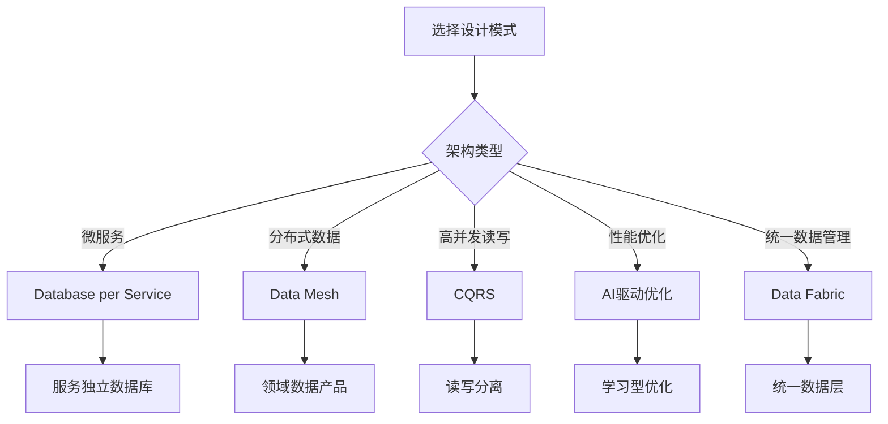
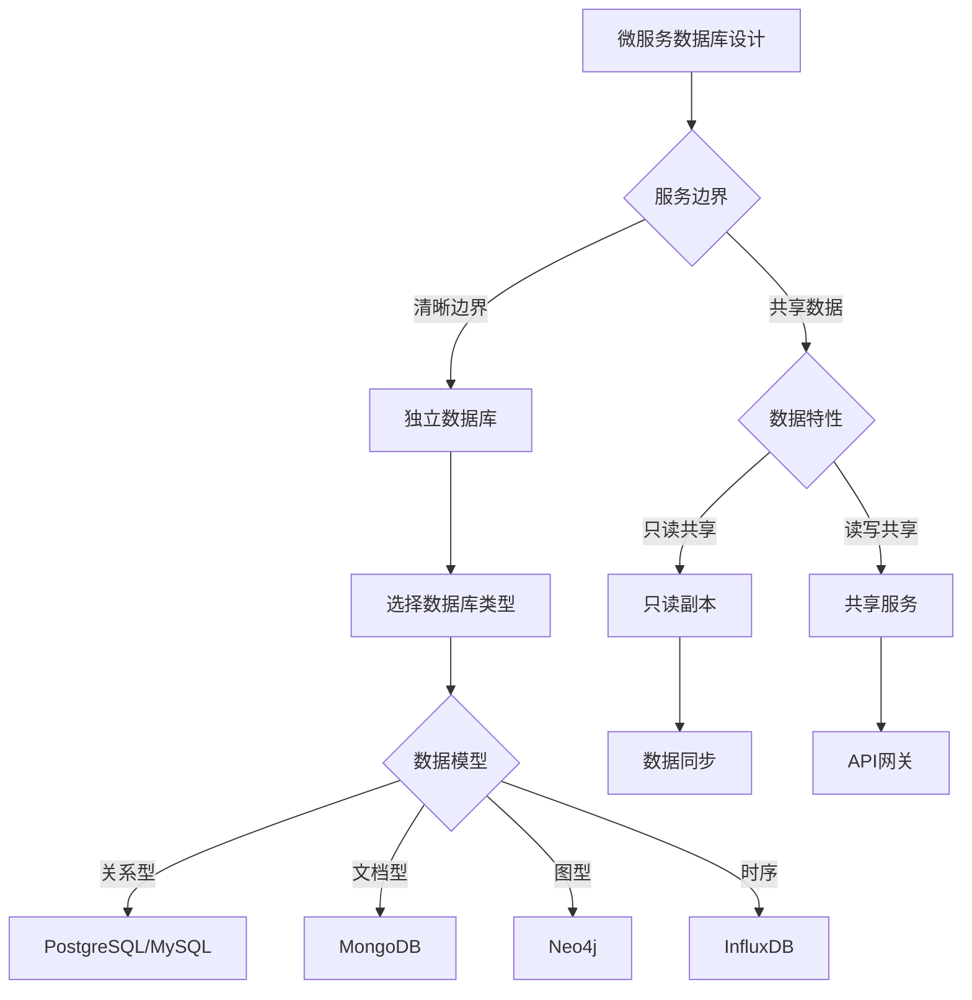
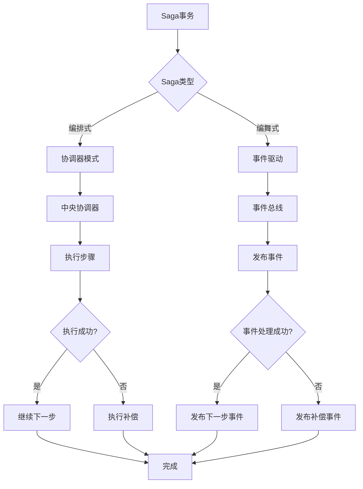
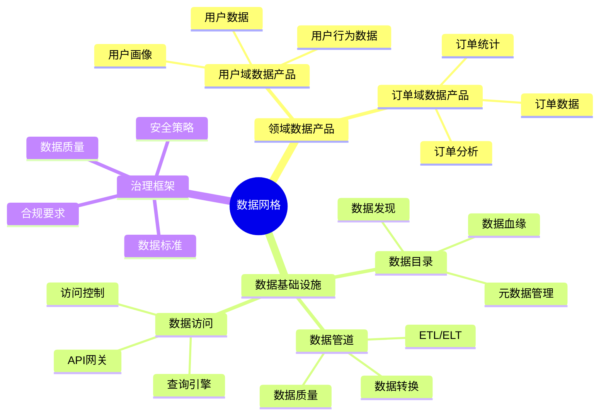
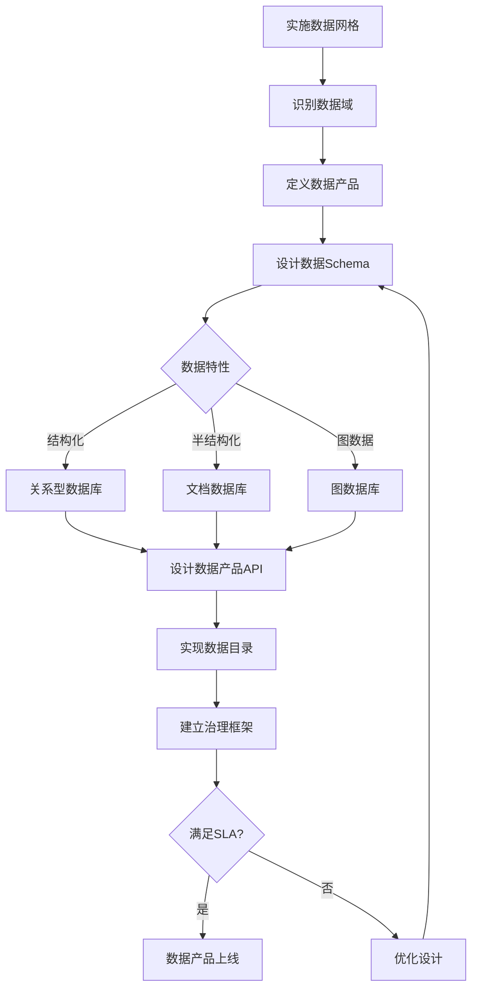
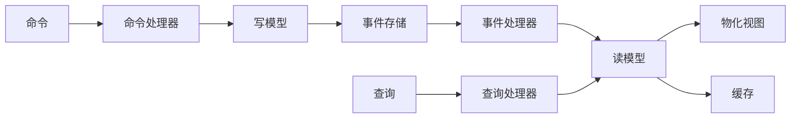
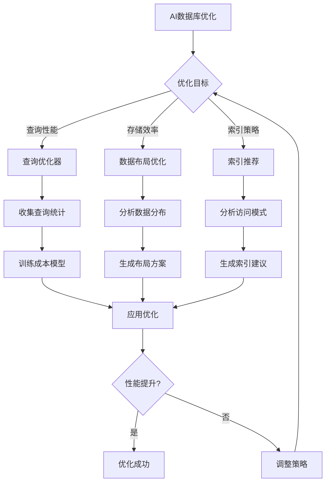
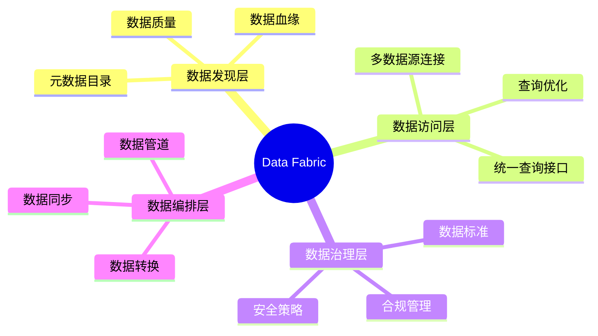

# 现代数据库设计模式：微服务、数据网格与AI驱动设计

> **创建日期**：2025-01-15
> **最后更新**：2025-01-15
> **版本**：v1.0
> **状态**：实施中

---

## 📋 目录

- [现代数据库设计模式：微服务、数据网格与AI驱动设计](#现代数据库设计模式微服务数据网格与ai驱动设计)
  - [📋 目录](#-目录)
  - [1. 概述](#1-概述)
    - [1.1. 现代数据库设计挑战](#11-现代数据库设计挑战)
    - [1.2. 现代设计模式决策树](#12-现代设计模式决策树)
  - [2. 微服务架构下的数据库设计](#2-微服务架构下的数据库设计)
    - [2.1. Database per Service模式](#21-database-per-service模式)
    - [2.2. Saga模式实现](#22-saga模式实现)
    - [2.3. 微服务数据库设计模式对比](#23-微服务数据库设计模式对比)
  - [3. 数据网格（Data Mesh）架构](#3-数据网格data-mesh架构)
    - [3.1. 数据网格核心概念](#31-数据网格核心概念)
    - [3.2. 数据产品设计](#32-数据产品设计)
    - [3.3. 数据网格实施决策树](#33-数据网格实施决策树)
  - [4. 事件驱动架构与CQRS](#4-事件驱动架构与cqrs)
    - [4.1. CQRS模式设计](#41-cqrs模式设计)
    - [4.2. Event Sourcing实现](#42-event-sourcing实现)
    - [4.3. CQRS vs 传统模式对比](#43-cqrs-vs-传统模式对比)
  - [5. AI驱动的数据库优化](#5-ai驱动的数据库优化)
    - [5.1. 学习型查询优化](#51-学习型查询优化)
    - [5.2. 数据布局优化（Qd-tree）](#52-数据布局优化qd-tree)
    - [5.3. AI优化决策树](#53-ai优化决策树)
  - [6. 分布式数据库设计模式](#6-分布式数据库设计模式)
    - [6.1. 数据分片策略](#61-数据分片策略)
    - [6.2. 数据复制策略](#62-数据复制策略)
  - [7. 数据编织（Data Fabric）](#7-数据编织data-fabric)
    - [7.1. Data Fabric架构](#71-data-fabric架构)
    - [7.2. 统一数据访问层](#72-统一数据访问层)
  - [8. 参考资料](#8-参考资料)

---

## 1. 概述

现代数据库设计面临新的挑战：微服务架构、分布式系统、云原生应用等。本文档介绍最新的数据库设计模式和最佳实践。

### 1.1. 现代数据库设计挑战

| 挑战 | 传统方案 | 现代方案 |
|------|---------|---------|
| **服务解耦** | 共享数据库 | Database per Service |
| **数据分布** | 集中式存储 | 数据网格 |
| **读写分离** | 单一模型 | CQRS模式 |
| **性能优化** | 手动调优 | AI驱动优化 |
| **数据一致性** | 强一致性 | 最终一致性 |

### 1.2. 现代设计模式决策树



---

## 2. 微服务架构下的数据库设计

### 2.1. Database per Service模式

**核心原则**：每个微服务拥有独立的数据库，服务间通过API通信。

**设计决策树**：



**实现示例**：

```sql
-- 用户服务数据库（PostgreSQL）
CREATE SCHEMA user_service;

CREATE TABLE user_service.users (
    id UUID PRIMARY KEY DEFAULT gen_random_uuid(),
    username VARCHAR(50) UNIQUE NOT NULL,
    email VARCHAR(100) UNIQUE NOT NULL,
    password_hash VARCHAR(255) NOT NULL,
    created_at TIMESTAMP DEFAULT CURRENT_TIMESTAMP
);

-- 订单服务数据库（PostgreSQL）
CREATE SCHEMA order_service;

CREATE TABLE order_service.orders (
    id UUID PRIMARY KEY DEFAULT gen_random_uuid(),
    user_id UUID NOT NULL,  -- 引用用户服务，但不使用外键
    total DECIMAL(10,2) NOT NULL,
    status VARCHAR(20) DEFAULT 'pending',
    order_date TIMESTAMP DEFAULT CURRENT_TIMESTAMP
);

-- 注意：不使用外键约束，通过应用层保证一致性
-- CREATE INDEX idx_orders_user_id ON order_service.orders(user_id);
```

**服务间数据同步**：

```text
模式1：事件驱动同步
  用户服务 → 发布UserCreated事件 → 订单服务订阅 → 更新本地缓存

模式2：API查询
  订单服务需要用户信息 → 调用用户服务API → 获取用户数据

模式3：只读副本
  用户服务 → 数据变更 → 同步到只读副本 → 订单服务查询副本
```

### 2.2. Saga模式实现

**Saga模式**：管理跨服务的事务，通过补偿操作保证最终一致性。

**Saga实现决策树**：



**Saga实现示例**：

```sql
-- Saga状态表
CREATE TABLE saga_instances (
    saga_id UUID PRIMARY KEY,
    saga_type VARCHAR(50) NOT NULL,
    status VARCHAR(20) NOT NULL,  -- PENDING, COMPLETED, FAILED, COMPENSATING
    current_step INTEGER DEFAULT 0,
    created_at TIMESTAMP DEFAULT CURRENT_TIMESTAMP,
    updated_at TIMESTAMP DEFAULT CURRENT_TIMESTAMP
);

-- Saga步骤表
CREATE TABLE saga_steps (
    step_id UUID PRIMARY KEY,
    saga_id UUID REFERENCES saga_instances(saga_id),
    step_order INTEGER NOT NULL,
    service_name VARCHAR(50) NOT NULL,
    action_type VARCHAR(20) NOT NULL,  -- EXECUTE, COMPENSATE
    status VARCHAR(20) NOT NULL,
    request_data JSONB,
    response_data JSONB,
    error_message TEXT,
    executed_at TIMESTAMP
);

-- 订单创建Saga示例
-- Step 1: 创建订单
INSERT INTO saga_steps (step_id, saga_id, step_order, service_name, action_type, status)
VALUES (gen_random_uuid(), saga_id, 1, 'order-service', 'EXECUTE', 'PENDING');

-- Step 2: 扣减库存
INSERT INTO saga_steps (step_id, saga_id, step_order, service_name, action_type, status)
VALUES (gen_random_uuid(), saga_id, 2, 'inventory-service', 'EXECUTE', 'PENDING');

-- Step 3: 扣减账户余额
INSERT INTO saga_steps (step_id, saga_id, step_order, service_name, action_type, status)
VALUES (gen_random_uuid(), saga_id, 3, 'payment-service', 'EXECUTE', 'PENDING');
```

### 2.3. 微服务数据库设计模式对比

| 模式 | 优点 | 缺点 | 适用场景 |
|------|------|------|---------|
| **Database per Service** | 服务解耦、独立扩展 | 数据一致性难、跨服务查询复杂 | 微服务架构 |
| **共享数据库** | 简单、ACID事务 | 服务耦合、难以扩展 | 单体应用 |
| **API组合** | 灵活、解耦 | 性能开销、延迟 | 跨服务查询 |
| **CQRS** | 读写分离、性能优化 | 复杂度高、最终一致性 | 高并发读写 |

---

## 3. 数据网格（Data Mesh）架构

### 3.1. 数据网格核心概念

**数据网格原则**：

1. **领域所有权**：数据由业务领域团队拥有
2. **数据作为产品**：数据被视为产品，有明确的SLA
3. **自助式基础设施**：提供统一的数据平台
4. **联合治理**：统一的治理标准，分散执行

**数据网格架构**：



### 3.2. 数据产品设计

**数据产品Schema设计**：

```sql
-- 用户域数据产品：用户数据
CREATE SCHEMA user_domain;

CREATE TABLE user_domain.user_profiles (
    user_id UUID PRIMARY KEY,
    username VARCHAR(50) NOT NULL,
    email VARCHAR(100) NOT NULL,
    profile_data JSONB,  -- 灵活的用户画像数据
    created_at TIMESTAMP DEFAULT CURRENT_TIMESTAMP,
    updated_at TIMESTAMP DEFAULT CURRENT_TIMESTAMP
);

-- 数据产品元数据表
CREATE TABLE data_products (
    product_id UUID PRIMARY KEY,
    domain_name VARCHAR(50) NOT NULL,
    product_name VARCHAR(100) NOT NULL,
    schema_name VARCHAR(50) NOT NULL,
    owner_team VARCHAR(50) NOT NULL,
    sla_availability DECIMAL(5,2) DEFAULT 99.9,
    sla_latency_ms INTEGER DEFAULT 100,
    data_freshness_seconds INTEGER DEFAULT 3600,
    created_at TIMESTAMP DEFAULT CURRENT_TIMESTAMP
);

-- 数据产品访问日志
CREATE TABLE data_product_access_log (
    access_id UUID PRIMARY KEY,
    product_id UUID REFERENCES data_products(product_id),
    consumer_service VARCHAR(50) NOT NULL,
    access_type VARCHAR(20) NOT NULL,  -- READ, WRITE, QUERY
    query_latency_ms INTEGER,
    success BOOLEAN,
    accessed_at TIMESTAMP DEFAULT CURRENT_TIMESTAMP
);
```

### 3.3. 数据网格实施决策树



---

## 4. 事件驱动架构与CQRS

### 4.1. CQRS模式设计

**CQRS（Command Query Responsibility Segregation）**：将读写操作分离到不同的模型。

**CQRS架构**：



**CQRS实现示例**：

```sql
-- 写模型：订单命令表
CREATE TABLE order_commands (
    command_id UUID PRIMARY KEY,
    order_id UUID NOT NULL,
    command_type VARCHAR(50) NOT NULL,  -- CREATE_ORDER, UPDATE_ORDER, CANCEL_ORDER
    command_data JSONB NOT NULL,
    status VARCHAR(20) DEFAULT 'PENDING',
    created_at TIMESTAMP DEFAULT CURRENT_TIMESTAMP
);

-- 事件存储
CREATE TABLE order_events (
    event_id UUID PRIMARY KEY,
    order_id UUID NOT NULL,
    event_type VARCHAR(50) NOT NULL,
    event_data JSONB NOT NULL,
    event_version INTEGER NOT NULL,
    occurred_at TIMESTAMP DEFAULT CURRENT_TIMESTAMP
);

CREATE INDEX idx_order_events_order_id ON order_events(order_id, event_version);

-- 读模型：订单视图
CREATE TABLE order_read_views (
    order_id UUID PRIMARY KEY,
    user_id UUID NOT NULL,
    total DECIMAL(10,2) NOT NULL,
    status VARCHAR(20) NOT NULL,
    order_date TIMESTAMP NOT NULL,
    items JSONB NOT NULL,
    last_updated_at TIMESTAMP DEFAULT CURRENT_TIMESTAMP
);

-- 事件处理器：更新读模型
CREATE OR REPLACE FUNCTION update_order_read_view()
RETURNS TRIGGER AS $$
BEGIN
    INSERT INTO order_read_views (order_id, user_id, total, status, order_date, items)
    VALUES (
        NEW.order_id,
        (NEW.event_data->>'user_id')::UUID,
        (NEW.event_data->>'total')::DECIMAL,
        NEW.event_data->>'status',
        NEW.occurred_at,
        NEW.event_data->'items'
    )
    ON CONFLICT (order_id) DO UPDATE SET
        total = EXCLUDED.total,
        status = EXCLUDED.status,
        items = EXCLUDED.items,
        last_updated_at = CURRENT_TIMESTAMP;
    RETURN NEW;
END;
$$ LANGUAGE plpgsql;

CREATE TRIGGER order_event_handler
AFTER INSERT ON order_events
FOR EACH ROW
EXECUTE FUNCTION update_order_read_view();
```

### 4.2. Event Sourcing实现

**Event Sourcing**：将所有状态变更存储为事件序列。

**事件溯源Schema**：

```sql
-- 聚合根表
CREATE TABLE aggregates (
    aggregate_id UUID PRIMARY KEY,
    aggregate_type VARCHAR(50) NOT NULL,
    current_version INTEGER DEFAULT 0,
    created_at TIMESTAMP DEFAULT CURRENT_TIMESTAMP
);

-- 事件表
CREATE TABLE events (
    event_id UUID PRIMARY KEY,
    aggregate_id UUID NOT NULL REFERENCES aggregates(aggregate_id),
    event_type VARCHAR(50) NOT NULL,
    event_data JSONB NOT NULL,
    event_version INTEGER NOT NULL,
    metadata JSONB,
    occurred_at TIMESTAMP DEFAULT CURRENT_TIMESTAMP,
    UNIQUE(aggregate_id, event_version)
);

CREATE INDEX idx_events_aggregate ON events(aggregate_id, event_version);

-- 快照表（性能优化）
CREATE TABLE snapshots (
    snapshot_id UUID PRIMARY KEY,
    aggregate_id UUID NOT NULL REFERENCES aggregates(aggregate_id),
    snapshot_data JSONB NOT NULL,
    snapshot_version INTEGER NOT NULL,
    created_at TIMESTAMP DEFAULT CURRENT_TIMESTAMP,
    UNIQUE(aggregate_id, snapshot_version)
);
```

**事件重建逻辑**：

```sql
-- 从事件重建聚合状态
CREATE OR REPLACE FUNCTION rebuild_aggregate_state(
    p_aggregate_id UUID,
    p_snapshot_version INTEGER DEFAULT NULL
)
RETURNS JSONB AS $$
DECLARE
    v_snapshot JSONB;
    v_events JSONB[];
    v_state JSONB;
BEGIN
    -- 如果有快照，从快照开始
    IF p_snapshot_version IS NOT NULL THEN
        SELECT snapshot_data INTO v_snapshot
        FROM snapshots
        WHERE aggregate_id = p_aggregate_id
          AND snapshot_version = p_snapshot_version;
    END IF;

    -- 获取快照之后的事件
    SELECT ARRAY_AGG(event_data ORDER BY event_version)
    INTO v_events
    FROM events
    WHERE aggregate_id = p_aggregate_id
      AND (p_snapshot_version IS NULL OR event_version > p_snapshot_version);

    -- 应用事件重建状态
    v_state := COALESCE(v_snapshot, '{}'::JSONB);
    -- 这里需要根据业务逻辑应用事件
    -- 简化示例：合并所有事件数据
    FOR i IN 1..array_length(v_events, 1) LOOP
        v_state := v_state || v_events[i];
    END LOOP;

    RETURN v_state;
END;
$$ LANGUAGE plpgsql;
```

### 4.3. CQRS vs 传统模式对比

| 特性 | 传统模式 | CQRS模式 |
|------|---------|---------|
| **读写模型** | 统一模型 | 分离模型 |
| **查询性能** | 受写操作影响 | 读模型优化 |
| **扩展性** | 读写耦合 | 独立扩展 |
| **复杂度** | 低 | 高 |
| **一致性** | 强一致性 | 最终一致性 |
| **适用场景** | 简单应用 | 高并发、复杂查询 |

---

## 5. AI驱动的数据库优化

### 5.1. 学习型查询优化

**AI优化框架**（基于Baihe等框架）：

```text
AI优化组件：
  1. 查询计划选择器：使用机器学习选择最优执行计划
  2. 索引推荐器：自动推荐索引策略
  3. 数据布局优化器：优化数据物理布局
  4. 成本模型学习器：学习查询成本模型
```

**学习型索引设计**：

```sql
-- 查询模式统计表
CREATE TABLE query_patterns (
    pattern_id UUID PRIMARY KEY,
    query_template TEXT NOT NULL,
    table_name VARCHAR(100) NOT NULL,
    filter_columns TEXT[],
    join_tables TEXT[],
    frequency INTEGER DEFAULT 0,
    avg_execution_time_ms DECIMAL(10,2),
    last_executed_at TIMESTAMP
);

-- 索引推荐表
CREATE TABLE index_recommendations (
    recommendation_id UUID PRIMARY KEY,
    table_name VARCHAR(100) NOT NULL,
    recommended_index TEXT NOT NULL,
    expected_improvement DECIMAL(5,2),  -- 预期性能提升百分比
    confidence_score DECIMAL(3,2),  -- 置信度 0-1
    created_at TIMESTAMP DEFAULT CURRENT_TIMESTAMP
);

-- 自动索引创建函数
CREATE OR REPLACE FUNCTION auto_create_index(
    p_table_name VARCHAR,
    p_columns TEXT[]
)
RETURNS VOID AS $$
DECLARE
    v_index_name VARCHAR;
    v_sql TEXT;
BEGIN
    v_index_name := 'idx_' || p_table_name || '_' || array_to_string(p_columns, '_');
    v_sql := 'CREATE INDEX IF NOT EXISTS ' || v_index_name ||
             ' ON ' || p_table_name ||
             ' (' || array_to_string(p_columns, ', ') || ')';
    EXECUTE v_sql;
END;
$$ LANGUAGE plpgsql;
```

### 5.2. 数据布局优化（Qd-tree）

**Qd-tree数据布局**：通过学习数据分布优化数据块组织。

**实现思路**：

```sql
-- 数据分布统计表
CREATE TABLE data_distribution_stats (
    table_name VARCHAR(100) NOT NULL,
    column_name VARCHAR(100) NOT NULL,
    value_range NUMRANGE,
    row_count BIGINT,
    block_count INTEGER,
    avg_rows_per_block DECIMAL(10,2),
    last_analyzed_at TIMESTAMP DEFAULT CURRENT_TIMESTAMP,
    PRIMARY KEY (table_name, column_name)
);

-- 数据块重组建议
CREATE TABLE block_reorganization_recommendations (
    recommendation_id UUID PRIMARY KEY,
    table_name VARCHAR(100) NOT NULL,
    current_layout TEXT,
    recommended_layout TEXT,
    expected_io_reduction DECIMAL(5,2),
    reorganization_cost INTEGER,  -- 预估时间（秒）
    created_at TIMESTAMP DEFAULT CURRENT_TIMESTAMP
);
```

### 5.3. AI优化决策树



---

## 6. 分布式数据库设计模式

### 6.1. 数据分片策略

**分片策略选择**：

| 策略 | 方法 | 优点 | 缺点 | 适用场景 |
|------|------|------|------|---------|
| **范围分片** | 按值范围 | 范围查询高效 | 数据倾斜 | 时间序列、有序数据 |
| **哈希分片** | 哈希函数 | 负载均衡 | 范围查询差 | 均匀分布数据 |
| **目录分片** | 查找表 | 灵活 | 单点故障 | 复杂分片规则 |
| **一致性哈希** | 哈希环 | 动态扩展 | 实现复杂 | 动态扩容场景 |

**分片实现示例**：

```sql
-- 分片配置表
CREATE TABLE shard_configurations (
    shard_id INTEGER PRIMARY KEY,
    table_name VARCHAR(100) NOT NULL,
    shard_key_column VARCHAR(100) NOT NULL,
    shard_strategy VARCHAR(20) NOT NULL,  -- RANGE, HASH, DIRECTORY
    shard_range_start BIGINT,
    shard_range_end BIGINT,
    shard_node VARCHAR(100) NOT NULL,
    is_active BOOLEAN DEFAULT TRUE
);

-- 范围分片示例：订单表按用户ID分片
INSERT INTO shard_configurations VALUES
(1, 'orders', 'user_id', 'RANGE', 0, 1000000, 'node1', TRUE),
(2, 'orders', 'user_id', 'RANGE', 1000001, 2000000, 'node2', TRUE),
(3, 'orders', 'user_id', 'RANGE', 2000001, 3000000, 'node3', TRUE);

-- 分片路由函数
CREATE OR REPLACE FUNCTION get_shard_for_user(p_user_id BIGINT)
RETURNS INTEGER AS $$
BEGIN
    RETURN (
        SELECT shard_id
        FROM shard_configurations
        WHERE table_name = 'orders'
          AND shard_strategy = 'RANGE'
          AND p_user_id >= shard_range_start
          AND p_user_id <= shard_range_end
          AND is_active = TRUE
        LIMIT 1
    );
END;
$$ LANGUAGE plpgsql;
```

### 6.2. 数据复制策略

**复制策略对比**：

| 策略 | 一致性 | 可用性 | 性能 | 适用场景 |
|------|--------|--------|------|---------|
| **主从复制** | 最终一致 | 高 | 读性能好 | 读多写少 |
| **主主复制** | 最终一致 | 很高 | 读写性能好 | 多地域部署 |
| **链式复制** | 强一致 | 中 | 写性能好 | 强一致性要求 |
| **仲裁复制** | 可配置 | 高 | 平衡 | 灵活需求 |

**复制配置示例**：

```sql
-- 复制配置表
CREATE TABLE replication_configurations (
    replication_id UUID PRIMARY KEY,
    table_name VARCHAR(100) NOT NULL,
    replication_strategy VARCHAR(20) NOT NULL,  -- MASTER_SLAVE, MASTER_MASTER, CHAIN
    primary_node VARCHAR(100) NOT NULL,
    replica_nodes TEXT[] NOT NULL,
    consistency_level VARCHAR(20) DEFAULT 'EVENTUAL',  -- STRONG, EVENTUAL
    replication_factor INTEGER DEFAULT 3
);

-- 复制状态表
CREATE TABLE replication_status (
    status_id UUID PRIMARY KEY,
    replication_id UUID REFERENCES replication_configurations(replication_id),
    node_name VARCHAR(100) NOT NULL,
    lag_seconds INTEGER DEFAULT 0,
    last_synced_at TIMESTAMP,
    is_healthy BOOLEAN DEFAULT TRUE
);
```

---

## 7. 数据编织（Data Fabric）

### 7.1. Data Fabric架构

**Data Fabric核心组件**：



### 7.2. 统一数据访问层

**多数据源查询示例**：

```sql
-- 数据源配置表
CREATE TABLE data_sources (
    source_id UUID PRIMARY KEY,
    source_name VARCHAR(100) NOT NULL,
    source_type VARCHAR(20) NOT NULL,  -- POSTGRESQL, MYSQL, MONGODB, REDIS
    connection_string TEXT NOT NULL,
    schema_name VARCHAR(100),
    is_active BOOLEAN DEFAULT TRUE
);

-- 统一查询视图（PostgreSQL FDW示例）
-- 创建MySQL外部表
CREATE EXTENSION IF NOT EXISTS mysql_fdw;

CREATE SERVER mysql_server
FOREIGN DATA WRAPPER mysql_fdw
OPTIONS (host 'mysql-host', port '3306');

CREATE USER MAPPING FOR CURRENT_USER
SERVER mysql_server
OPTIONS (username 'user', password 'password');

CREATE FOREIGN TABLE mysql_users (
    id INTEGER,
    username VARCHAR(50),
    email VARCHAR(100)
)
SERVER mysql_server
OPTIONS (dbname 'user_db', table_name 'users');

-- 统一查询：跨数据源JOIN
SELECT
    p.id,
    p.name,
    u.username,
    u.email
FROM products p
JOIN mysql_users u ON p.user_id = u.id;
```

---

## 8. 参考资料

- [微服务架构数据库设计](../Analysis/4-软件架构与工程/4.3-微服务架构/)
- [事件驱动架构](../Matter/Software/Microservice/)
- [数据网格理论](https://martinfowler.com/articles/data-mesh-principles.html)
- [CQRS模式](https://martinfowler.com/bliki/CQRS.html)

---

**最后更新**：2025-01-15
**维护者**：Data-Science Team
**状态**：实施中
