# 现代数据库设计模式：微服务、数据网格与AI驱动设计

> **创建日期**：2025-01-15
> **最后更新**：2025-12-01
> **版本**：v2.0
> **状态**：已完成 ✅

---

## 📋 目录

- [现代数据库设计模式：微服务、数据网格与AI驱动设计](#现代数据库设计模式微服务数据网格与ai驱动设计)
  - [📋 目录](#-目录)
  - [1. 概述](#1-概述)
    - [1.1. 现代数据库设计知识图谱](#11-现代数据库设计知识图谱)
    - [1.2. 设计模式演进时间线](#12-设计模式演进时间线)
    - [1.3. 现代数据库设计挑战](#13-现代数据库设计挑战)
    - [1.4. 现代设计模式决策树](#14-现代设计模式决策树)
  - [2. 形式化理论基础](#2-形式化理论基础)
    - [2.1. CAP定理形式化](#21-cap定理形式化)
    - [2.2. PACELC定理](#22-pacelc定理)
    - [2.3. 一致性模型层级](#23-一致性模型层级)
  - [2. 微服务架构下的数据库设计](#2-微服务架构下的数据库设计)
    - [2.1. Database per Service模式](#21-database-per-service模式)
    - [2.2. Saga模式实现](#22-saga模式实现)
    - [2.3. 微服务数据库设计模式对比](#23-微服务数据库设计模式对比)
  - [3. 数据网格（Data Mesh）架构](#3-数据网格data-mesh架构)
    - [3.1. 数据网格核心概念](#31-数据网格核心概念)
    - [3.2. 数据产品设计](#32-数据产品设计)
    - [3.3. 数据网格实施决策树](#33-数据网格实施决策树)
  - [4. 事件驱动架构与CQRS](#4-事件驱动架构与cqrs)
    - [4.1. CQRS模式设计](#41-cqrs模式设计)
    - [4.2. Event Sourcing实现](#42-event-sourcing实现)
    - [4.3. CQRS vs 传统模式对比](#43-cqrs-vs-传统模式对比)
  - [5. AI驱动的数据库优化](#5-ai驱动的数据库优化)
    - [5.1. 学习型查询优化](#51-学习型查询优化)
    - [5.2. 数据布局优化（Qd-tree）](#52-数据布局优化qd-tree)
    - [5.3. AI优化决策树](#53-ai优化决策树)
  - [6. 分布式数据库设计模式](#6-分布式数据库设计模式)
    - [6.1. 数据分片策略](#61-数据分片策略)
    - [6.2. 数据复制策略](#62-数据复制策略)
  - [7. 数据编织（Data Fabric）](#7-数据编织data-fabric)
    - [7.1. Data Fabric架构](#71-data-fabric架构)
    - [7.2. 统一数据访问层](#72-统一数据访问层)
  - [8. 边缘计算数据库设计](#8-边缘计算数据库设计)
    - [8.1. 边缘数据库架构概述](#81-边缘数据库架构概述)
    - [8.2. 边缘数据库选型矩阵](#82-边缘数据库选型矩阵)
    - [8.3. 边缘同步模式](#83-边缘同步模式)
  - [9. 云原生数据库设计模式](#9-云原生数据库设计模式)
    - [9.1. 云原生数据库架构思维导图](#91-云原生数据库架构思维导图)
    - [9.2. 云数据库选型决策矩阵](#92-云数据库选型决策矩阵)
    - [9.3. Kubernetes数据库部署示例](#93-kubernetes数据库部署示例)
  - [10. 2024-2025最新趋势](#10-2024-2025最新趋势)
    - [10.1. 技术趋势雷达图](#101-技术趋势雷达图)
    - [10.2. 2025热门技术对比](#102-2025热门技术对比)
    - [10.3. LLM应用数据库架构](#103-llm应用数据库架构)
  - [11. 参考资料](#11-参考资料)
    - [11.1. 权威文献](#111-权威文献)
    - [11.2. 在线资源](#112-在线资源)
    - [11.3. 相关文档](#113-相关文档)

---

## 1. 概述

现代数据库设计面临新的挑战：微服务架构、分布式系统、云原生应用、AI集成等。本文档基于形式化理论，介绍2024-2025年最新的数据库设计模式和最佳实践。

### 1.1. 现代数据库设计知识图谱

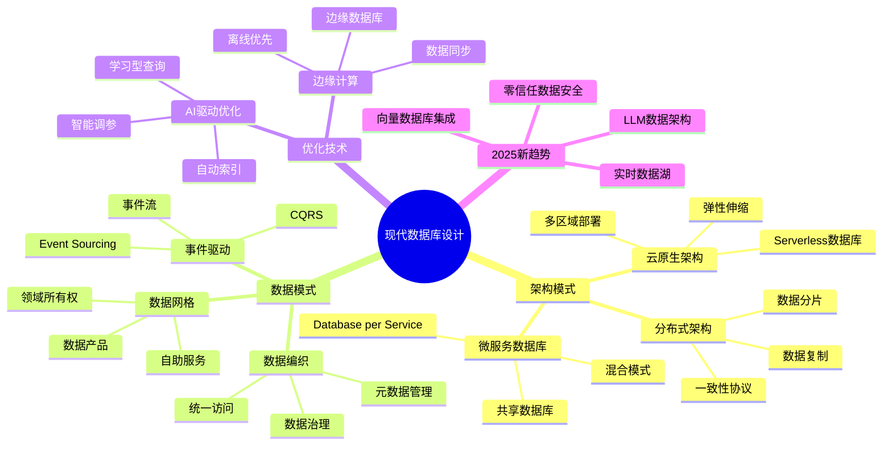
```mermaid
mindmap
  root((现代数据库设计))
    架构模式
      微服务数据库
        Database per Service
        共享数据库
        混合模式
      分布式架构
        数据分片
        数据复制
        一致性协议
      云原生架构
        Serverless数据库
        多区域部署
        弹性伸缩
    数据模式
      事件驱动
        Event Sourcing
        CQRS
        事件流
      数据网格
        领域所有权
        数据产品
        自助服务
      数据编织
        统一访问
        元数据管理
        数据治理
    优化技术
      AI驱动优化
        学习型查询
        自动索引
        智能调参
      边缘计算
        边缘数据库
        数据同步
        离线优先
    2025新趋势
      向量数据库集成
      LLM数据架构
      实时数据湖
      零信任数据安全
```

### 1.2. 设计模式演进时间线

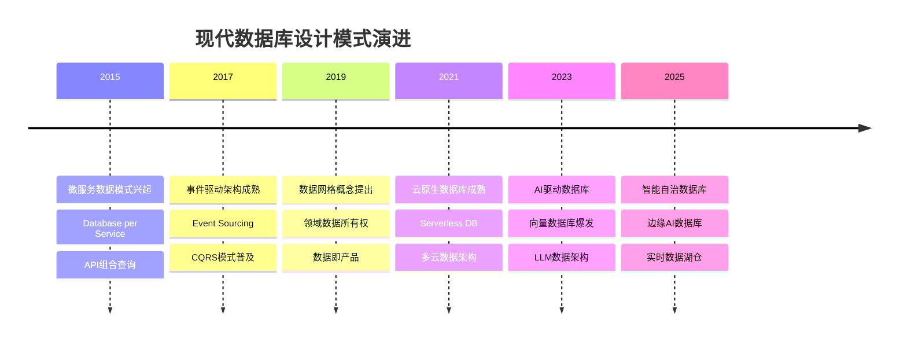
```mermaid
timeline
    title 现代数据库设计模式演进
    2015 : 微服务数据模式兴起
         : Database per Service
         : API组合查询
    2017 : 事件驱动架构成熟
         : Event Sourcing
         : CQRS模式普及
    2019 : 数据网格概念提出
         : 领域数据所有权
         : 数据即产品
    2021 : 云原生数据库成熟
         : Serverless DB
         : 多云数据架构
    2023 : AI驱动数据库
         : 向量数据库爆发
         : LLM数据架构
    2025 : 智能自治数据库
         : 边缘AI数据库
         : 实时数据湖仓
```

### 1.3. 现代数据库设计挑战

**挑战维度对比矩阵**：

| 挑战维度 | 传统方案 | 现代方案 | 2025趋势 |
|---------|---------|---------|---------|
| **服务解耦** | 共享数据库 | Database per Service | 数据网格 |
| **数据分布** | 集中式存储 | 分片+复制 | 边缘+云混合 |
| **读写分离** | 主从复制 | CQRS模式 | 实时物化视图 |
| **性能优化** | 手动调优 | AI驱动优化 | 自治数据库 |
| **数据一致性** | ACID强一致 | BASE最终一致 | 可调一致性 |
| **AI集成** | 外部服务 | 向量扩展 | 原生AI引擎 |
| **安全合规** | 边界防护 | RLS+加密 | 零信任架构 |

### 1.4. 现代设计模式决策树

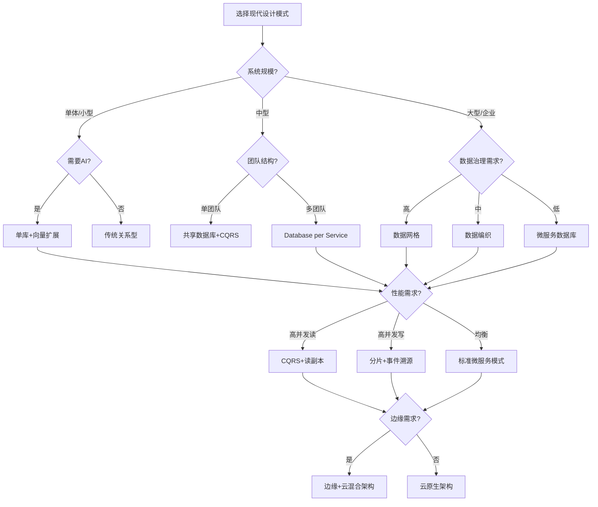
```mermaid
flowchart TD
    A[选择现代设计模式] --> B{系统规模?}

    B -->|单体/小型| C{需要AI?}
    B -->|中型| D{团队结构?}
    B -->|大型/企业| E{数据治理需求?}

    C -->|是| F[单库+向量扩展]
    C -->|否| G[传统关系型]

    D -->|单团队| H[共享数据库+CQRS]
    D -->|多团队| I[Database per Service]

    E -->|高| J[数据网格]
    E -->|中| K[数据编织]
    E -->|低| L[微服务数据库]

    F --> M{性能需求?}
    I --> M
    J --> M
    K --> M
    L --> M

    M -->|高并发读| N[CQRS+读副本]
    M -->|高并发写| O[分片+事件溯源]
    M -->|均衡| P[标准微服务模式]

    N --> Q{边缘需求?}
    O --> Q
    P --> Q

    Q -->|是| R[边缘+云混合架构]
    Q -->|否| S[云原生架构]
```

---

## 2. 形式化理论基础

### 2.1. CAP定理形式化

**定理2.1.1（CAP定理 - Brewer, 2000）**：

在分布式系统中，不可能同时满足以下三个属性：

```text
设分布式系统 S = (N, E, D)，其中：
- N = {n₁, n₂, ..., nₖ} 是节点集合
- E ⊆ N × N 是网络连接
- D 是分布式数据

CAP属性定义：
1. 一致性(C): ∀nᵢ,nⱼ∈N, read(nᵢ) = read(nⱼ) after write(nₓ)
2. 可用性(A): ∀n∈N, ∀request r, ∃response within bounded time
3. 分区容错(P): 系统在网络分区时继续运行

定理: ¬(C ∧ A ∧ P)
```

**CAP权衡决策矩阵**：

| 选择 | 牺牲 | 系统类型 | 典型场景 | 代表系统 |
|------|------|---------|---------|---------|
| **CP** | 可用性 | 强一致性 | 金融交易 | ZooKeeper, etcd |
| **AP** | 一致性 | 高可用性 | 社交网络 | Cassandra, DynamoDB |
| **CA** | 分区容错 | 单机系统 | 传统数据库 | PostgreSQL单机 |

### 2.2. PACELC定理

**定理2.2.1（PACELC定理 - Abadi, 2012）**：

扩展CAP定理，考虑无分区时的延迟-一致性权衡：

```text
PACELC:
  if (Partition) then (choose Availability or Consistency)
  else (choose Latency or Consistency)

形式化：
  P → (A ⊕ C)  -- 分区时选择可用性或一致性
  ¬P → (L ⊕ C) -- 无分区时选择延迟或一致性
```

**PACELC系统分类**：

| 系统 | 分区时(P) | 正常时(E) | 描述 |
|------|----------|----------|------|
| **PA/EL** | 可用性 | 低延迟 | DynamoDB, Cassandra |
| **PC/EC** | 一致性 | 一致性 | PostgreSQL, MySQL |
| **PA/EC** | 可用性 | 一致性 | MongoDB默认 |
| **PC/EL** | 一致性 | 低延迟 | CockroachDB |

### 2.3. 一致性模型层级

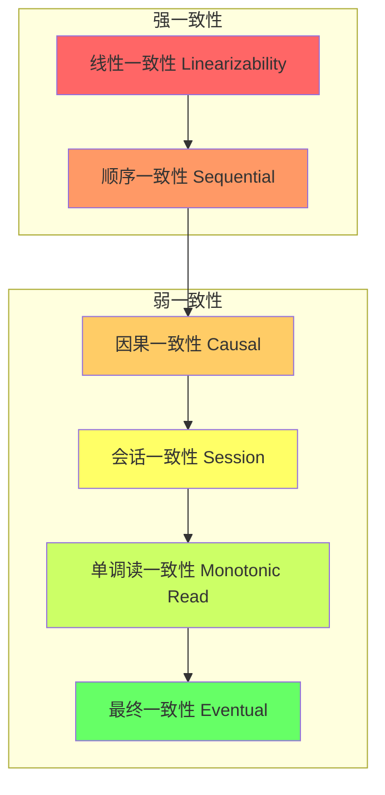
```mermaid
flowchart TB
    subgraph 强一致性
        L1[线性一致性 Linearizability]
        L2[顺序一致性 Sequential]
    end

    subgraph 弱一致性
        W1[因果一致性 Causal]
        W2[会话一致性 Session]
        W3[单调读一致性 Monotonic Read]
        W4[最终一致性 Eventual]
    end

    L1 --> L2
    L2 --> W1
    W1 --> W2
    W2 --> W3
    W3 --> W4

    style L1 fill:#f66
    style L2 fill:#f96
    style W1 fill:#fc6
    style W2 fill:#ff6
    style W3 fill:#cf6
    style W4 fill:#6f6
```

**一致性模型对比矩阵**：

| 一致性级别 | 延迟 | 可用性 | 实现复杂度 | 适用场景 |
|-----------|------|--------|-----------|---------|
| **线性一致性** | 高 | 低 | 高 | 金融交易、分布式锁 |
| **顺序一致性** | 中高 | 中 | 中高 | 分布式文件系统 |
| **因果一致性** | 中 | 中高 | 中 | 协作应用、社交网络 |
| **会话一致性** | 低 | 高 | 低 | Web会话、购物车 |
| **最终一致性** | 最低 | 最高 | 低 | DNS、CDN、缓存 |

---

## 2. 微服务架构下的数据库设计

### 2.1. Database per Service模式

**核心原则**：每个微服务拥有独立的数据库，服务间通过API通信。

**设计决策树**：

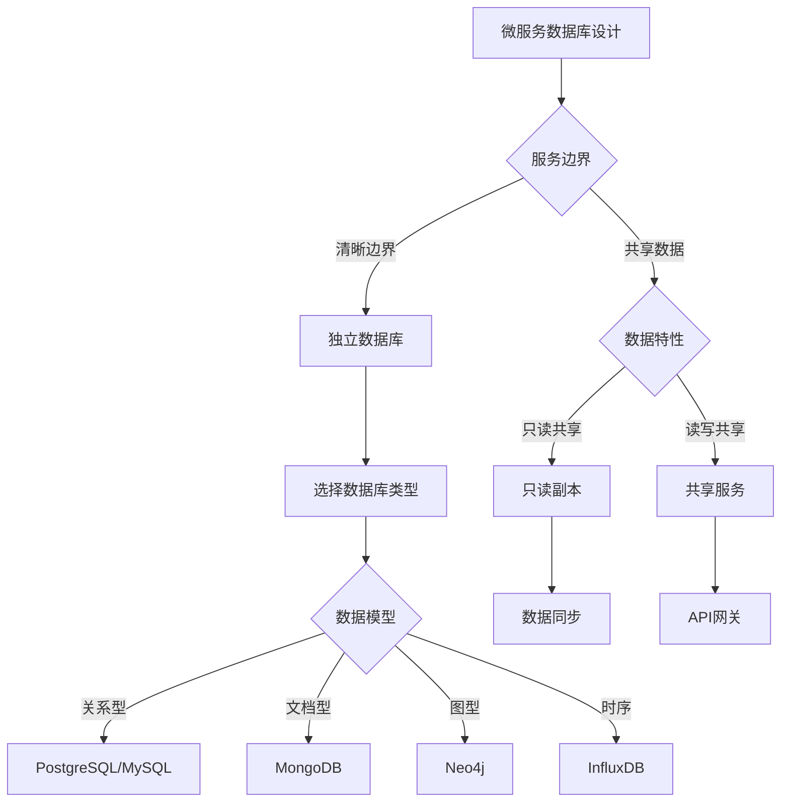
```mermaid
flowchart TD
    A[微服务数据库设计] --> B{服务边界}

    B -->|清晰边界| C[独立数据库]
    B -->|共享数据| D{数据特性}

    C --> E[选择数据库类型]
    D -->|只读共享| F[只读副本]
    D -->|读写共享| G[共享服务]

    E --> H{数据模型}
    H -->|关系型| I[PostgreSQL/MySQL]
    H -->|文档型| J[MongoDB]
    H -->|图型| K[Neo4j]
    H -->|时序| L[InfluxDB]

    F --> M[数据同步]
    G --> N[API网关]
```

**实现示例**：

```sql
-- 用户服务数据库（PostgreSQL）
CREATE SCHEMA user_service;

CREATE TABLE user_service.users (
    id UUID PRIMARY KEY DEFAULT gen_random_uuid(),
    username VARCHAR(50) UNIQUE NOT NULL,
    email VARCHAR(100) UNIQUE NOT NULL,
    password_hash VARCHAR(255) NOT NULL,
    created_at TIMESTAMP DEFAULT CURRENT_TIMESTAMP
);

-- 订单服务数据库（PostgreSQL）
CREATE SCHEMA order_service;

CREATE TABLE order_service.orders (
    id UUID PRIMARY KEY DEFAULT gen_random_uuid(),
    user_id UUID NOT NULL,  -- 引用用户服务，但不使用外键
    total DECIMAL(10,2) NOT NULL,
    status VARCHAR(20) DEFAULT 'pending',
    order_date TIMESTAMP DEFAULT CURRENT_TIMESTAMP
);

-- 注意：不使用外键约束，通过应用层保证一致性
-- CREATE INDEX idx_orders_user_id ON order_service.orders(user_id);
```

**服务间数据同步**：

```text
模式1：事件驱动同步
  用户服务 → 发布UserCreated事件 → 订单服务订阅 → 更新本地缓存

模式2：API查询
  订单服务需要用户信息 → 调用用户服务API → 获取用户数据

模式3：只读副本
  用户服务 → 数据变更 → 同步到只读副本 → 订单服务查询副本
```

### 2.2. Saga模式实现

**Saga模式**：管理跨服务的事务，通过补偿操作保证最终一致性。

**Saga实现决策树**：

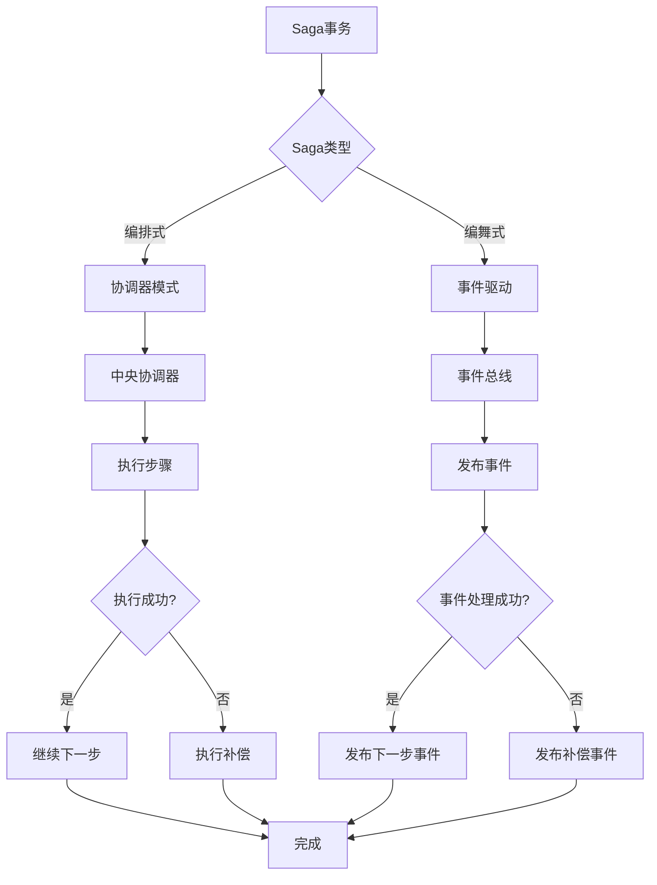
```mermaid
flowchart TD
    A[Saga事务] --> B{Saga类型}

    B -->|编排式| C[协调器模式]
    B -->|编舞式| D[事件驱动]

    C --> E[中央协调器]
    D --> F[事件总线]

    E --> G[执行步骤]
    F --> H[发布事件]

    G --> I{执行成功?}
    H --> J{事件处理成功?}

    I -->|是| K[继续下一步]
    I -->|否| L[执行补偿]

    J -->|是| M[发布下一步事件]
    J -->|否| N[发布补偿事件]

    K --> O[完成]
    L --> O
    M --> O
    N --> O
```

**Saga实现示例**：

```sql
-- Saga状态表
CREATE TABLE saga_instances (
    saga_id UUID PRIMARY KEY,
    saga_type VARCHAR(50) NOT NULL,
    status VARCHAR(20) NOT NULL,  -- PENDING, COMPLETED, FAILED, COMPENSATING
    current_step INTEGER DEFAULT 0,
    created_at TIMESTAMP DEFAULT CURRENT_TIMESTAMP,
    updated_at TIMESTAMP DEFAULT CURRENT_TIMESTAMP
);

-- Saga步骤表
CREATE TABLE saga_steps (
    step_id UUID PRIMARY KEY,
    saga_id UUID REFERENCES saga_instances(saga_id),
    step_order INTEGER NOT NULL,
    service_name VARCHAR(50) NOT NULL,
    action_type VARCHAR(20) NOT NULL,  -- EXECUTE, COMPENSATE
    status VARCHAR(20) NOT NULL,
    request_data JSONB,
    response_data JSONB,
    error_message TEXT,
    executed_at TIMESTAMP
);

-- 订单创建Saga示例
-- Step 1: 创建订单
INSERT INTO saga_steps (step_id, saga_id, step_order, service_name, action_type, status)
VALUES (gen_random_uuid(), saga_id, 1, 'order-service', 'EXECUTE', 'PENDING');

-- Step 2: 扣减库存
INSERT INTO saga_steps (step_id, saga_id, step_order, service_name, action_type, status)
VALUES (gen_random_uuid(), saga_id, 2, 'inventory-service', 'EXECUTE', 'PENDING');

-- Step 3: 扣减账户余额
INSERT INTO saga_steps (step_id, saga_id, step_order, service_name, action_type, status)
VALUES (gen_random_uuid(), saga_id, 3, 'payment-service', 'EXECUTE', 'PENDING');
```

### 2.3. 微服务数据库设计模式对比

| 模式 | 优点 | 缺点 | 适用场景 |
|------|------|------|---------|
| **Database per Service** | 服务解耦、独立扩展 | 数据一致性难、跨服务查询复杂 | 微服务架构 |
| **共享数据库** | 简单、ACID事务 | 服务耦合、难以扩展 | 单体应用 |
| **API组合** | 灵活、解耦 | 性能开销、延迟 | 跨服务查询 |
| **CQRS** | 读写分离、性能优化 | 复杂度高、最终一致性 | 高并发读写 |

---

## 3. 数据网格（Data Mesh）架构

### 3.1. 数据网格核心概念

**数据网格原则**：

1. **领域所有权**：数据由业务领域团队拥有
2. **数据作为产品**：数据被视为产品，有明确的SLA
3. **自助式基础设施**：提供统一的数据平台
4. **联合治理**：统一的治理标准，分散执行

**数据网格架构**：

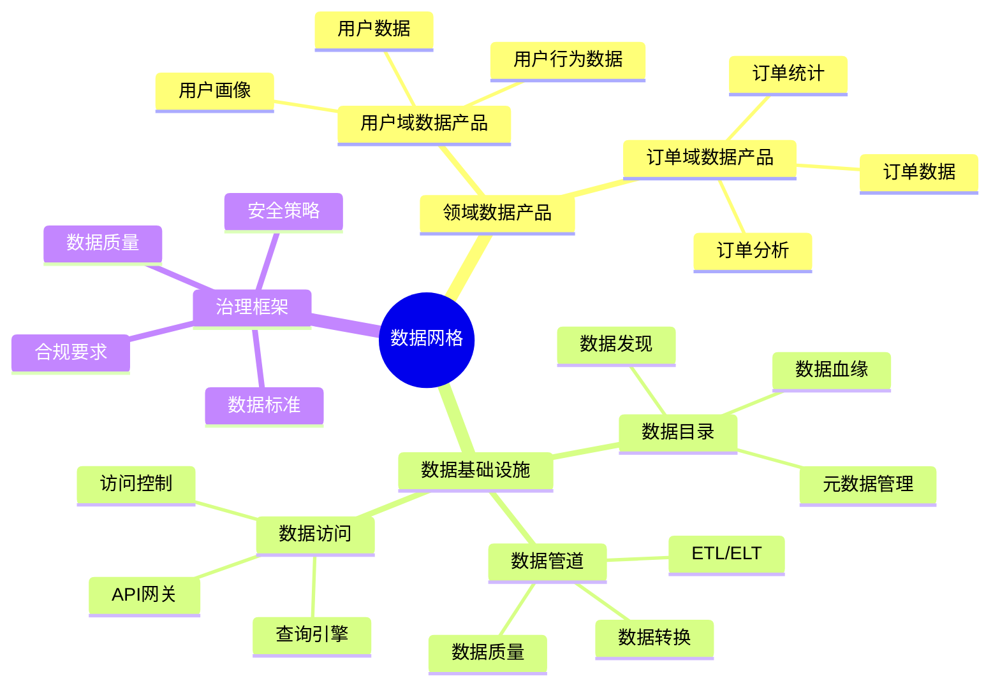
```mermaid
mindmap
  root((数据网格))
    领域数据产品
      用户域数据产品
        用户数据
        用户行为数据
        用户画像
      订单域数据产品
        订单数据
        订单统计
        订单分析
    数据基础设施
      数据目录
        元数据管理
        数据发现
        数据血缘
      数据管道
        ETL/ELT
        数据转换
        数据质量
      数据访问
        API网关
        查询引擎
        访问控制
    治理框架
      数据标准
      数据质量
      安全策略
      合规要求
```

### 3.2. 数据产品设计

**数据产品Schema设计**：

```sql
-- 用户域数据产品：用户数据
CREATE SCHEMA user_domain;

CREATE TABLE user_domain.user_profiles (
    user_id UUID PRIMARY KEY,
    username VARCHAR(50) NOT NULL,
    email VARCHAR(100) NOT NULL,
    profile_data JSONB,  -- 灵活的用户画像数据
    created_at TIMESTAMP DEFAULT CURRENT_TIMESTAMP,
    updated_at TIMESTAMP DEFAULT CURRENT_TIMESTAMP
);

-- 数据产品元数据表
CREATE TABLE data_products (
    product_id UUID PRIMARY KEY,
    domain_name VARCHAR(50) NOT NULL,
    product_name VARCHAR(100) NOT NULL,
    schema_name VARCHAR(50) NOT NULL,
    owner_team VARCHAR(50) NOT NULL,
    sla_availability DECIMAL(5,2) DEFAULT 99.9,
    sla_latency_ms INTEGER DEFAULT 100,
    data_freshness_seconds INTEGER DEFAULT 3600,
    created_at TIMESTAMP DEFAULT CURRENT_TIMESTAMP
);

-- 数据产品访问日志
CREATE TABLE data_product_access_log (
    access_id UUID PRIMARY KEY,
    product_id UUID REFERENCES data_products(product_id),
    consumer_service VARCHAR(50) NOT NULL,
    access_type VARCHAR(20) NOT NULL,  -- READ, WRITE, QUERY
    query_latency_ms INTEGER,
    success BOOLEAN,
    accessed_at TIMESTAMP DEFAULT CURRENT_TIMESTAMP
);
```

### 3.3. 数据网格实施决策树

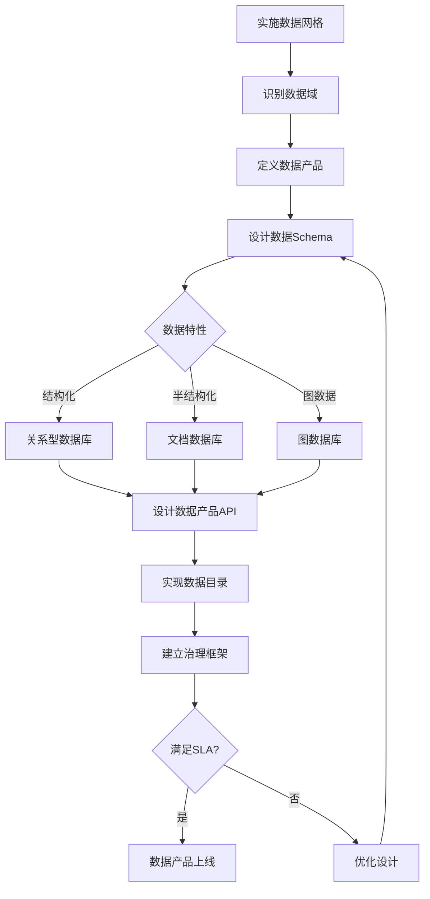
```mermaid
flowchart TD
    A[实施数据网格] --> B[识别数据域]
    B --> C[定义数据产品]
    C --> D[设计数据Schema]

    D --> E{数据特性}
    E -->|结构化| F[关系型数据库]
    E -->|半结构化| G[文档数据库]
    E -->|图数据| H[图数据库]

    F --> I[设计数据产品API]
    G --> I
    H --> I

    I --> J[实现数据目录]
    J --> K[建立治理框架]

    K --> L{满足SLA?}
    L -->|是| M[数据产品上线]
    L -->|否| N[优化设计]
    N --> D
```

---

## 4. 事件驱动架构与CQRS

### 4.1. CQRS模式设计

**CQRS（Command Query Responsibility Segregation）**：将读写操作分离到不同的模型。

**CQRS架构**：

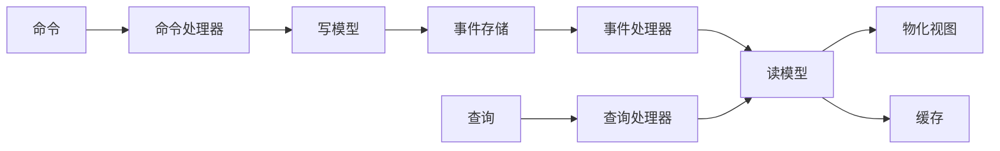
```mermaid
flowchart LR
    A[命令] --> B[命令处理器]
    B --> C[写模型]
    C --> D[事件存储]

    D --> E[事件处理器]
    E --> F[读模型]

    G[查询] --> H[查询处理器]
    H --> F

    F --> I[物化视图]
    F --> J[缓存]
```

**CQRS实现示例**：

```sql
-- 写模型：订单命令表
CREATE TABLE order_commands (
    command_id UUID PRIMARY KEY,
    order_id UUID NOT NULL,
    command_type VARCHAR(50) NOT NULL,  -- CREATE_ORDER, UPDATE_ORDER, CANCEL_ORDER
    command_data JSONB NOT NULL,
    status VARCHAR(20) DEFAULT 'PENDING',
    created_at TIMESTAMP DEFAULT CURRENT_TIMESTAMP
);

-- 事件存储
CREATE TABLE order_events (
    event_id UUID PRIMARY KEY,
    order_id UUID NOT NULL,
    event_type VARCHAR(50) NOT NULL,
    event_data JSONB NOT NULL,
    event_version INTEGER NOT NULL,
    occurred_at TIMESTAMP DEFAULT CURRENT_TIMESTAMP
);

CREATE INDEX idx_order_events_order_id ON order_events(order_id, event_version);

-- 读模型：订单视图
CREATE TABLE order_read_views (
    order_id UUID PRIMARY KEY,
    user_id UUID NOT NULL,
    total DECIMAL(10,2) NOT NULL,
    status VARCHAR(20) NOT NULL,
    order_date TIMESTAMP NOT NULL,
    items JSONB NOT NULL,
    last_updated_at TIMESTAMP DEFAULT CURRENT_TIMESTAMP
);

-- 事件处理器：更新读模型
CREATE OR REPLACE FUNCTION update_order_read_view()
RETURNS TRIGGER AS $$
BEGIN
    INSERT INTO order_read_views (order_id, user_id, total, status, order_date, items)
    VALUES (
        NEW.order_id,
        (NEW.event_data->>'user_id')::UUID,
        (NEW.event_data->>'total')::DECIMAL,
        NEW.event_data->>'status',
        NEW.occurred_at,
        NEW.event_data->'items'
    )
    ON CONFLICT (order_id) DO UPDATE SET
        total = EXCLUDED.total,
        status = EXCLUDED.status,
        items = EXCLUDED.items,
        last_updated_at = CURRENT_TIMESTAMP;
    RETURN NEW;
END;
$$ LANGUAGE plpgsql;

CREATE TRIGGER order_event_handler
AFTER INSERT ON order_events
FOR EACH ROW
EXECUTE FUNCTION update_order_read_view();
```

### 4.2. Event Sourcing实现

**Event Sourcing**：将所有状态变更存储为事件序列。

**事件溯源Schema**：

```sql
-- 聚合根表
CREATE TABLE aggregates (
    aggregate_id UUID PRIMARY KEY,
    aggregate_type VARCHAR(50) NOT NULL,
    current_version INTEGER DEFAULT 0,
    created_at TIMESTAMP DEFAULT CURRENT_TIMESTAMP
);

-- 事件表
CREATE TABLE events (
    event_id UUID PRIMARY KEY,
    aggregate_id UUID NOT NULL REFERENCES aggregates(aggregate_id),
    event_type VARCHAR(50) NOT NULL,
    event_data JSONB NOT NULL,
    event_version INTEGER NOT NULL,
    metadata JSONB,
    occurred_at TIMESTAMP DEFAULT CURRENT_TIMESTAMP,
    UNIQUE(aggregate_id, event_version)
);

CREATE INDEX idx_events_aggregate ON events(aggregate_id, event_version);

-- 快照表（性能优化）
CREATE TABLE snapshots (
    snapshot_id UUID PRIMARY KEY,
    aggregate_id UUID NOT NULL REFERENCES aggregates(aggregate_id),
    snapshot_data JSONB NOT NULL,
    snapshot_version INTEGER NOT NULL,
    created_at TIMESTAMP DEFAULT CURRENT_TIMESTAMP,
    UNIQUE(aggregate_id, snapshot_version)
);
```

**事件重建逻辑**：

```sql
-- 从事件重建聚合状态
CREATE OR REPLACE FUNCTION rebuild_aggregate_state(
    p_aggregate_id UUID,
    p_snapshot_version INTEGER DEFAULT NULL
)
RETURNS JSONB AS $$
DECLARE
    v_snapshot JSONB;
    v_events JSONB[];
    v_state JSONB;
BEGIN
    -- 如果有快照，从快照开始
    IF p_snapshot_version IS NOT NULL THEN
        SELECT snapshot_data INTO v_snapshot
        FROM snapshots
        WHERE aggregate_id = p_aggregate_id
          AND snapshot_version = p_snapshot_version;
    END IF;

    -- 获取快照之后的事件
    SELECT ARRAY_AGG(event_data ORDER BY event_version)
    INTO v_events
    FROM events
    WHERE aggregate_id = p_aggregate_id
      AND (p_snapshot_version IS NULL OR event_version > p_snapshot_version);

    -- 应用事件重建状态
    v_state := COALESCE(v_snapshot, '{}'::JSONB);
    -- 这里需要根据业务逻辑应用事件
    -- 简化示例：合并所有事件数据
    FOR i IN 1..array_length(v_events, 1) LOOP
        v_state := v_state || v_events[i];
    END LOOP;

    RETURN v_state;
END;
$$ LANGUAGE plpgsql;
```

### 4.3. CQRS vs 传统模式对比

| 特性 | 传统模式 | CQRS模式 |
|------|---------|---------|
| **读写模型** | 统一模型 | 分离模型 |
| **查询性能** | 受写操作影响 | 读模型优化 |
| **扩展性** | 读写耦合 | 独立扩展 |
| **复杂度** | 低 | 高 |
| **一致性** | 强一致性 | 最终一致性 |
| **适用场景** | 简单应用 | 高并发、复杂查询 |

---

## 5. AI驱动的数据库优化

### 5.1. 学习型查询优化

**AI优化框架**（基于Baihe等框架）：

```text
AI优化组件：
  1. 查询计划选择器：使用机器学习选择最优执行计划
  2. 索引推荐器：自动推荐索引策略
  3. 数据布局优化器：优化数据物理布局
  4. 成本模型学习器：学习查询成本模型
```

**学习型索引设计**：

```sql
-- 查询模式统计表
CREATE TABLE query_patterns (
    pattern_id UUID PRIMARY KEY,
    query_template TEXT NOT NULL,
    table_name VARCHAR(100) NOT NULL,
    filter_columns TEXT[],
    join_tables TEXT[],
    frequency INTEGER DEFAULT 0,
    avg_execution_time_ms DECIMAL(10,2),
    last_executed_at TIMESTAMP
);

-- 索引推荐表
CREATE TABLE index_recommendations (
    recommendation_id UUID PRIMARY KEY,
    table_name VARCHAR(100) NOT NULL,
    recommended_index TEXT NOT NULL,
    expected_improvement DECIMAL(5,2),  -- 预期性能提升百分比
    confidence_score DECIMAL(3,2),  -- 置信度 0-1
    created_at TIMESTAMP DEFAULT CURRENT_TIMESTAMP
);

-- 自动索引创建函数
CREATE OR REPLACE FUNCTION auto_create_index(
    p_table_name VARCHAR,
    p_columns TEXT[]
)
RETURNS VOID AS $$
DECLARE
    v_index_name VARCHAR;
    v_sql TEXT;
BEGIN
    v_index_name := 'idx_' || p_table_name || '_' || array_to_string(p_columns, '_');
    v_sql := 'CREATE INDEX IF NOT EXISTS ' || v_index_name ||
             ' ON ' || p_table_name ||
             ' (' || array_to_string(p_columns, ', ') || ')';
    EXECUTE v_sql;
END;
$$ LANGUAGE plpgsql;
```

### 5.2. 数据布局优化（Qd-tree）

**Qd-tree数据布局**：通过学习数据分布优化数据块组织。

**实现思路**：

```sql
-- 数据分布统计表
CREATE TABLE data_distribution_stats (
    table_name VARCHAR(100) NOT NULL,
    column_name VARCHAR(100) NOT NULL,
    value_range NUMRANGE,
    row_count BIGINT,
    block_count INTEGER,
    avg_rows_per_block DECIMAL(10,2),
    last_analyzed_at TIMESTAMP DEFAULT CURRENT_TIMESTAMP,
    PRIMARY KEY (table_name, column_name)
);

-- 数据块重组建议
CREATE TABLE block_reorganization_recommendations (
    recommendation_id UUID PRIMARY KEY,
    table_name VARCHAR(100) NOT NULL,
    current_layout TEXT,
    recommended_layout TEXT,
    expected_io_reduction DECIMAL(5,2),
    reorganization_cost INTEGER,  -- 预估时间（秒）
    created_at TIMESTAMP DEFAULT CURRENT_TIMESTAMP
);
```

### 5.3. AI优化决策树

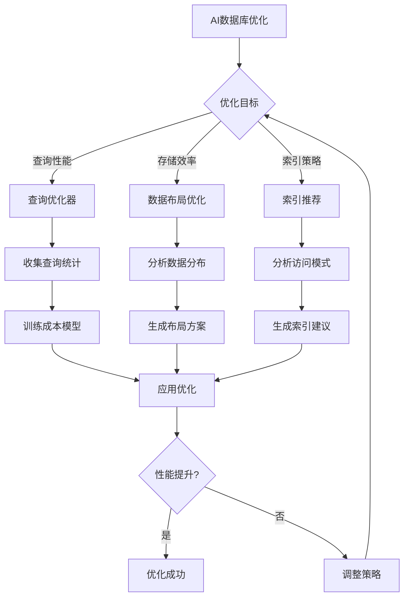
```mermaid
flowchart TD
    A[AI数据库优化] --> B{优化目标}

    B -->|查询性能| C[查询优化器]
    B -->|存储效率| D[数据布局优化]
    B -->|索引策略| E[索引推荐]

    C --> F[收集查询统计]
    D --> G[分析数据分布]
    E --> H[分析访问模式]

    F --> I[训练成本模型]
    G --> J[生成布局方案]
    H --> K[生成索引建议]

    I --> L[应用优化]
    J --> L
    K --> L

    L --> M{性能提升?}
    M -->|是| N[优化成功]
    M -->|否| O[调整策略]
    O --> B
```

---

## 6. 分布式数据库设计模式

### 6.1. 数据分片策略

**分片策略选择**：

| 策略 | 方法 | 优点 | 缺点 | 适用场景 |
|------|------|------|------|---------|
| **范围分片** | 按值范围 | 范围查询高效 | 数据倾斜 | 时间序列、有序数据 |
| **哈希分片** | 哈希函数 | 负载均衡 | 范围查询差 | 均匀分布数据 |
| **目录分片** | 查找表 | 灵活 | 单点故障 | 复杂分片规则 |
| **一致性哈希** | 哈希环 | 动态扩展 | 实现复杂 | 动态扩容场景 |

**分片实现示例**：

```sql
-- 分片配置表
CREATE TABLE shard_configurations (
    shard_id INTEGER PRIMARY KEY,
    table_name VARCHAR(100) NOT NULL,
    shard_key_column VARCHAR(100) NOT NULL,
    shard_strategy VARCHAR(20) NOT NULL,  -- RANGE, HASH, DIRECTORY
    shard_range_start BIGINT,
    shard_range_end BIGINT,
    shard_node VARCHAR(100) NOT NULL,
    is_active BOOLEAN DEFAULT TRUE
);

-- 范围分片示例：订单表按用户ID分片
INSERT INTO shard_configurations VALUES
(1, 'orders', 'user_id', 'RANGE', 0, 1000000, 'node1', TRUE),
(2, 'orders', 'user_id', 'RANGE', 1000001, 2000000, 'node2', TRUE),
(3, 'orders', 'user_id', 'RANGE', 2000001, 3000000, 'node3', TRUE);

-- 分片路由函数
CREATE OR REPLACE FUNCTION get_shard_for_user(p_user_id BIGINT)
RETURNS INTEGER AS $$
BEGIN
    RETURN (
        SELECT shard_id
        FROM shard_configurations
        WHERE table_name = 'orders'
          AND shard_strategy = 'RANGE'
          AND p_user_id >= shard_range_start
          AND p_user_id <= shard_range_end
          AND is_active = TRUE
        LIMIT 1
    );
END;
$$ LANGUAGE plpgsql;
```

### 6.2. 数据复制策略

**复制策略对比**：

| 策略 | 一致性 | 可用性 | 性能 | 适用场景 |
|------|--------|--------|------|---------|
| **主从复制** | 最终一致 | 高 | 读性能好 | 读多写少 |
| **主主复制** | 最终一致 | 很高 | 读写性能好 | 多地域部署 |
| **链式复制** | 强一致 | 中 | 写性能好 | 强一致性要求 |
| **仲裁复制** | 可配置 | 高 | 平衡 | 灵活需求 |

**复制配置示例**：

```sql
-- 复制配置表
CREATE TABLE replication_configurations (
    replication_id UUID PRIMARY KEY,
    table_name VARCHAR(100) NOT NULL,
    replication_strategy VARCHAR(20) NOT NULL,  -- MASTER_SLAVE, MASTER_MASTER, CHAIN
    primary_node VARCHAR(100) NOT NULL,
    replica_nodes TEXT[] NOT NULL,
    consistency_level VARCHAR(20) DEFAULT 'EVENTUAL',  -- STRONG, EVENTUAL
    replication_factor INTEGER DEFAULT 3
);

-- 复制状态表
CREATE TABLE replication_status (
    status_id UUID PRIMARY KEY,
    replication_id UUID REFERENCES replication_configurations(replication_id),
    node_name VARCHAR(100) NOT NULL,
    lag_seconds INTEGER DEFAULT 0,
    last_synced_at TIMESTAMP,
    is_healthy BOOLEAN DEFAULT TRUE
);
```

---

## 7. 数据编织（Data Fabric）

### 7.1. Data Fabric架构

**Data Fabric核心组件**：

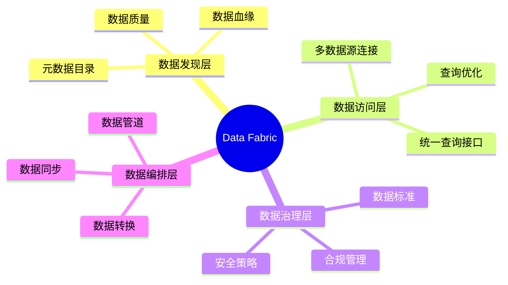
```mermaid
mindmap
  root((Data Fabric))
    数据发现层
      元数据目录
      数据血缘
      数据质量
    数据访问层
      统一查询接口
      多数据源连接
      查询优化
    数据治理层
      数据标准
      安全策略
      合规管理
    数据编排层
      数据管道
      数据转换
      数据同步
```

### 7.2. 统一数据访问层

**多数据源查询示例**：

```sql
-- 数据源配置表
CREATE TABLE data_sources (
    source_id UUID PRIMARY KEY,
    source_name VARCHAR(100) NOT NULL,
    source_type VARCHAR(20) NOT NULL,  -- POSTGRESQL, MYSQL, MONGODB, REDIS
    connection_string TEXT NOT NULL,
    schema_name VARCHAR(100),
    is_active BOOLEAN DEFAULT TRUE
);

-- 统一查询视图（PostgreSQL FDW示例）
-- 创建MySQL外部表
CREATE EXTENSION IF NOT EXISTS mysql_fdw;

CREATE SERVER mysql_server
FOREIGN DATA WRAPPER mysql_fdw
OPTIONS (host 'mysql-host', port '3306');

CREATE USER MAPPING FOR CURRENT_USER
SERVER mysql_server
OPTIONS (username 'user', password 'password');

CREATE FOREIGN TABLE mysql_users (
    id INTEGER,
    username VARCHAR(50),
    email VARCHAR(100)
)
SERVER mysql_server
OPTIONS (dbname 'user_db', table_name 'users');

-- 统一查询：跨数据源JOIN
SELECT
    p.id,
    p.name,
    u.username,
    u.email
FROM products p
JOIN mysql_users u ON p.user_id = u.id;
```

---

---

## 8. 边缘计算数据库设计

### 8.1. 边缘数据库架构概述

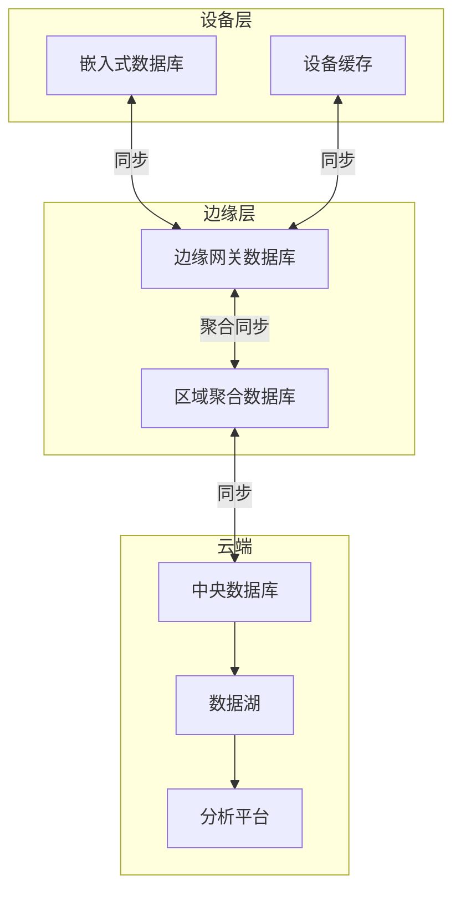
```mermaid
flowchart TB
    subgraph 云端
        C1[中央数据库]
        C2[数据湖]
        C3[分析平台]
    end

    subgraph 边缘层
        E1[边缘网关数据库]
        E2[区域聚合数据库]
    end

    subgraph 设备层
        D1[嵌入式数据库]
        D2[设备缓存]
    end

    D1 <-->|同步| E1
    D2 <-->|同步| E1
    E1 <-->|聚合同步| E2
    E2 <-->|同步| C1
    C1 --> C2
    C2 --> C3
```

### 8.2. 边缘数据库选型矩阵

| 数据库 | 类型 | 资源占用 | 同步能力 | 适用场景 |
|-------|------|---------|---------|---------|
| **SQLite** | 关系型 | 极低 | 手动 | 移动应用、嵌入式 |
| **LiteFS** | SQLite复制 | 低 | 自动 | 边缘SQLite集群 |
| **CouchDB/PouchDB** | 文档型 | 低 | 内置 | 离线优先应用 |
| **Realm** | 对象型 | 低 | 内置 | 移动应用 |
| **TiKV** | 分布式KV | 中 | Raft | 边缘分布式 |
| **PostgreSQL Edge** | 关系型 | 中 | 逻辑复制 | 边缘网关 |

### 8.3. 边缘同步模式

```sql
-- 边缘数据库Schema设计
CREATE TABLE edge_sync_log (
    sync_id UUID PRIMARY KEY DEFAULT gen_random_uuid(),
    table_name VARCHAR(100) NOT NULL,
    record_id UUID NOT NULL,
    operation VARCHAR(10) NOT NULL,  -- INSERT, UPDATE, DELETE
    data JSONB NOT NULL,
    local_timestamp TIMESTAMPTZ NOT NULL DEFAULT CURRENT_TIMESTAMP,
    cloud_timestamp TIMESTAMPTZ,
    sync_status VARCHAR(20) DEFAULT 'PENDING',  -- PENDING, SYNCED, CONFLICT
    conflict_resolution JSONB,

    CONSTRAINT valid_operation CHECK (operation IN ('INSERT', 'UPDATE', 'DELETE'))
);

CREATE INDEX idx_sync_status ON edge_sync_log(sync_status, local_timestamp);

-- 冲突解决函数（Last Write Wins）
CREATE OR REPLACE FUNCTION resolve_sync_conflict(
    p_local_data JSONB,
    p_cloud_data JSONB,
    p_local_ts TIMESTAMPTZ,
    p_cloud_ts TIMESTAMPTZ
)
RETURNS JSONB AS $$
BEGIN
    IF p_local_ts > p_cloud_ts THEN
        RETURN p_local_data;
    ELSE
        RETURN p_cloud_data;
    END IF;
END;
$$ LANGUAGE plpgsql;
```

---

## 9. 云原生数据库设计模式

### 9.1. 云原生数据库架构思维导图

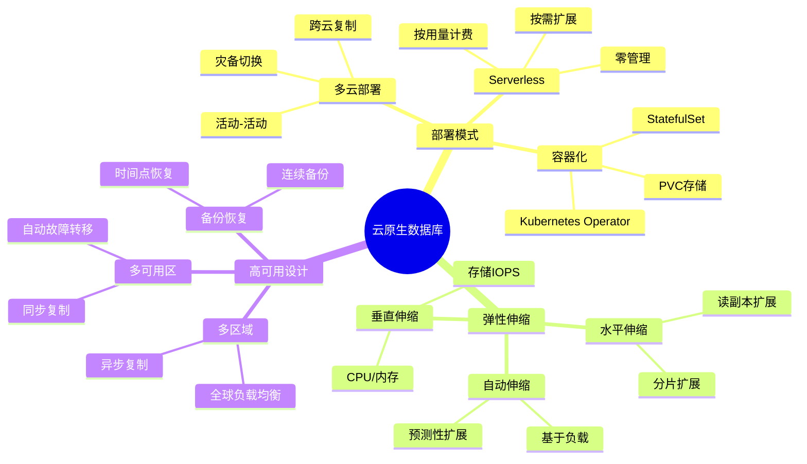
```mermaid
mindmap
  root((云原生数据库))
    部署模式
      Serverless
        按需扩展
        按用量计费
        零管理
      容器化
        Kubernetes Operator
        StatefulSet
        PVC存储
      多云部署
        跨云复制
        活动-活动
        灾备切换
    弹性伸缩
      水平伸缩
        读副本扩展
        分片扩展
      垂直伸缩
        CPU/内存
        存储IOPS
      自动伸缩
        基于负载
        预测性扩展
    高可用设计
      多可用区
        同步复制
        自动故障转移
      多区域
        异步复制
        全球负载均衡
      备份恢复
        连续备份
        时间点恢复
```

### 9.2. 云数据库选型决策矩阵

| 场景 | AWS | GCP | Azure | 开源替代 |
|------|-----|-----|-------|---------|
| **OLTP高并发** | Aurora PostgreSQL | Cloud Spanner | Cosmos DB | CockroachDB |
| **OLAP分析** | Redshift | BigQuery | Synapse | ClickHouse |
| **文档存储** | DocumentDB | Firestore | Cosmos DB | MongoDB Atlas |
| **图数据库** | Neptune | - | Cosmos Gremlin | Neo4j Aura |
| **向量检索** | OpenSearch | Vertex AI | Cognitive Search | Qdrant Cloud |
| **时序数据** | Timestream | - | Time Series | TimescaleDB Cloud |
| **缓存** | ElastiCache | Memorystore | Azure Cache | Redis Cloud |

### 9.3. Kubernetes数据库部署示例

```yaml
# PostgreSQL StatefulSet配置
apiVersion: apps/v1
kind: StatefulSet
metadata:
  name: postgresql
spec:
  serviceName: postgresql
  replicas: 3
  selector:
    matchLabels:
      app: postgresql
  template:
    metadata:
      labels:
        app: postgresql
    spec:
      containers:
      - name: postgresql
        image: postgres:16
        ports:
        - containerPort: 5432
        env:
        - name: POSTGRES_DB
          value: "appdb"
        - name: POSTGRES_USER
          valueFrom:
            secretKeyRef:
              name: postgresql-secret
              key: username
        - name: POSTGRES_PASSWORD
          valueFrom:
            secretKeyRef:
              name: postgresql-secret
              key: password
        volumeMounts:
        - name: postgresql-data
          mountPath: /var/lib/postgresql/data
        resources:
          requests:
            memory: "1Gi"
            cpu: "500m"
          limits:
            memory: "2Gi"
            cpu: "1000m"
  volumeClaimTemplates:
  - metadata:
      name: postgresql-data
    spec:
      accessModes: ["ReadWriteOnce"]
      storageClassName: fast-ssd
      resources:
        requests:
          storage: 100Gi
```

---

## 10. 2024-2025最新趋势

### 10.1. 技术趋势雷达图

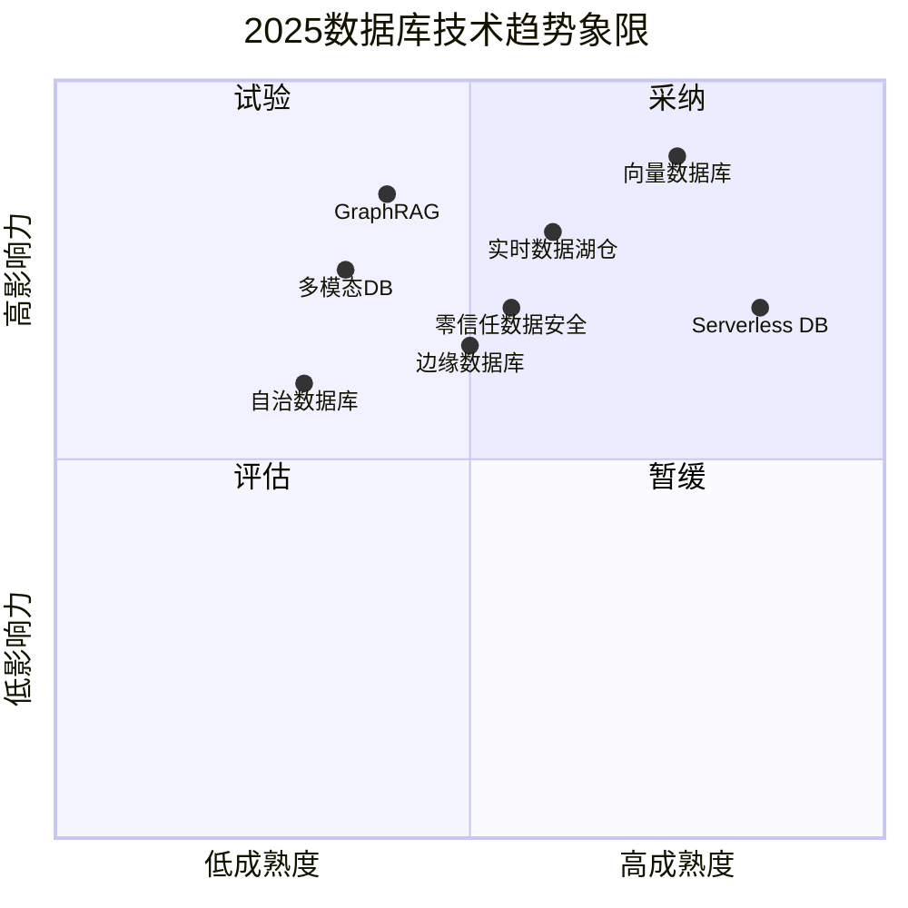
```mermaid
quadrantChart
    title 2025数据库技术趋势象限
    x-axis 低成熟度 --> 高成熟度
    y-axis 低影响力 --> 高影响力
    quadrant-1 采纳
    quadrant-2 试验
    quadrant-3 评估
    quadrant-4 暂缓
    向量数据库: [0.75, 0.9]
    GraphRAG: [0.4, 0.85]
    Serverless DB: [0.85, 0.7]
    边缘数据库: [0.5, 0.65]
    自治数据库: [0.3, 0.6]
    多模态DB: [0.35, 0.75]
    实时数据湖仓: [0.6, 0.8]
    零信任数据安全: [0.55, 0.7]
```

### 10.2. 2025热门技术对比

| 技术 | 成熟度 | 采用率 | 学习曲线 | 推荐场景 |
|------|--------|--------|---------|---------|
| **向量数据库(pgvector)** | ⭐⭐⭐⭐⭐ | 高 | 低 | RAG/语义搜索 |
| **GraphRAG** | ⭐⭐⭐ | 中 | 高 | 知识增强LLM |
| **实时数据湖仓** | ⭐⭐⭐⭐ | 中高 | 中 | 统一分析 |
| **Serverless数据库** | ⭐⭐⭐⭐ | 高 | 低 | 弹性负载 |
| **边缘AI数据库** | ⭐⭐⭐ | 低 | 高 | IoT智能分析 |
| **自治数据库** | ⭐⭐⭐ | 中 | 低 | 运维简化 |

### 10.3. LLM应用数据库架构

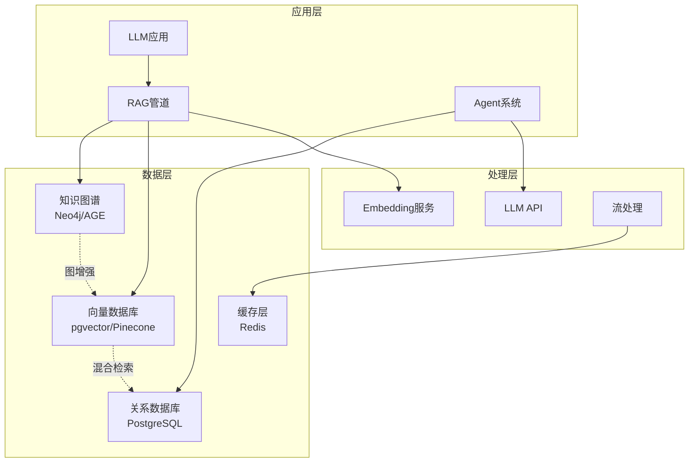
```mermaid
flowchart TB
    subgraph 应用层
        A1[LLM应用]
        A2[RAG管道]
        A3[Agent系统]
    end

    subgraph 数据层
        D1[向量数据库<br/>pgvector/Pinecone]
        D2[知识图谱<br/>Neo4j/AGE]
        D3[关系数据库<br/>PostgreSQL]
        D4[缓存层<br/>Redis]
    end

    subgraph 处理层
        P1[Embedding服务]
        P2[LLM API]
        P3[流处理]
    end

    A1 --> A2
    A2 --> P1
    A2 --> D1
    A2 --> D2
    A3 --> P2
    A3 --> D3
    P3 --> D4

    D1 -.-> |混合检索| D3
    D2 -.-> |图增强| D1
```

---

## 11. 参考资料

### 11.1. 权威文献

**分布式系统理论**：

- Brewer, E. (2000). "Towards Robust Distributed Systems" (CAP定理)
- Abadi, D. (2012). "Consistency Tradeoffs in Modern Distributed Database System Design" (PACELC)
- Kleppmann, M. "Designing Data-Intensive Applications"

**现代架构模式**：

- Dehghani, Z. (2019). "How to Move Beyond a Monolithic Data Lake to a Distributed Data Mesh"
- Fowler, M. "CQRS" - <https://martinfowler.com/bliki/CQRS.html>
- Richardson, C. "Microservices Patterns"

### 11.2. 在线资源

| 资源 | URL | 描述 |
|------|-----|------|
| **Martin Fowler** | <https://martinfowler.com> | 架构模式权威 |
| **Data Mesh原则** | <https://martinfowler.com/articles/data-mesh-principles.html> | 数据网格 |
| **PostgreSQL文档** | <https://www.postgresql.org/docs/> | 数据库参考 |
| **AWS架构中心** | <https://aws.amazon.com/architecture/> | 云原生实践 |
| **CNCF Landscape** | <https://landscape.cncf.io/> | 云原生生态 |
| **CMU 15-721** | <https://15721.courses.cs.cmu.edu/> | 高级数据库 |

### 11.3. 相关文档

- [07.01-Schema设计方法论](./07.01-Schema设计方法论.md)
- [07.10-向量数据库设计](./07.10-向量数据库设计.md)
- [07.17-分布式数据库设计模式](./07.17-分布式数据库设计模式.md)
- [07.33-数据库设计模式演进历史与未来趋势](./07.33-数据库设计模式演进历史与未来趋势.md)

---

**最后更新**：2025-12-01
**维护者**：Data-Science Team
**状态**：已完成 ✅
**版本**：v2.0 (增强版)
