```mermaid
flowchart TD
    A[继承设计] --> B{类型差异}

    B -->|差异小| C[单表+type列]
    B -->|差异大| D{查询模式}

    D -->|多类型联合查询| E[单表+type列+部分列]
    D -->|类型独立查询| F[多表继承]

    F --> G[基表+子表]
    G --> H[使用外键关联]
```

```mermaid
flowchart TD
    A[选择主键] --> B{有稳定自然键?}

    B -->|是| C{自然键简单?}
    B -->|否| D[使用代理键]

    C -->|是| E[使用自然键]
    C -->|否| F{复合键?}

    F -->|是| G[考虑代理键]
    F -->|否| H[使用自然键]

    E --> I[主键选择完成]
    G --> I
    H --> I
    D --> I
```

```mermaid
flowchart TD
    A[使用触发器?] --> B{逻辑类型}

    B -->|审计日志| C[可以使用]
    B -->|数据验证| D[考虑CHECK约束]
    B -->|业务逻辑| E[应用层实现]
    B -->|数据同步| F[考虑事件驱动]

    C --> G[实现触发器]
    D --> H[使用约束]
    E --> I[应用代码]
    F --> J[消息队列]
```

# 数据库设计反模式与解决方案：常见陷阱与最佳实践

> **创建日期**：2025-01-15
> **最后更新**：2025-01-15
> **版本**：v1.0
> **状态**：实施中

---

## 📋 目录

- [数据库设计反模式与解决方案：常见陷阱与最佳实践](#数据库设计反模式与解决方案常见陷阱与最佳实践)
  - [📋 目录](#-目录)
  - [1. 概述](#1-概述)
    - [1.1. 反模式分类](#11-反模式分类)
  - [2. Schema设计反模式](#2-schema设计反模式)
    - [2.1. 多用途表（God Table）](#21-多用途表god-table)
    - [2.2. 单表继承（Single Table Inheritance）](#22-单表继承single-table-inheritance)
    - [2.3. 伪键滥用（Pseudokey Neat-Freak）](#23-伪键滥用pseudokey-neat-freak)
    - [2.4. 列数过多（Wide Table）](#24-列数过多wide-table)
  - [3. 查询设计反模式](#3-查询设计反模式)
    - [3.1. N+1查询问题](#31-n1查询问题)
    - [3.2. 全表扫描](#32-全表扫描)
    - [3.3. 隐式类型转换](#33-隐式类型转换)
  - [4. 性能优化反模式](#4-性能优化反模式)
    - [4.1. 索引滥用](#41-索引滥用)
    - [4.2. 过度规范化](#42-过度规范化)
  - [5. 数据一致性反模式](#5-数据一致性反模式)
    - [5.1. 缺少外键约束](#51-缺少外键约束)
    - [5.2. 触发器滥用](#52-触发器滥用)
  - [6. 参考资料](#6-参考资料)

---

## 1. 概述

反模式（Anti-pattern）是看似合理但实际有害的设计模式。本文档识别常见的数据库设计反模式并提供解决方案。

### 1.1. 反模式分类

```mermaid
mindmap
  root((数据库反模式))
    Schema反模式
      多用途表
      单表继承
      伪键滥用
      列数过多
    查询反模式
      N+1查询
      全表扫描
      隐式转换
      过度使用子查询
    性能反模式
      索引滥用
      过度规范化
      缺少索引
      数据类型不当
    一致性反模式
      缺少外键
      触发器滥用
      全局状态表
```



---

## 2. Schema设计反模式

### 2.1. 多用途表（God Table）

**反模式**：将所有数据塞进一个巨大的表。

**问题示例**：

```sql
-- 反模式：万能表
CREATE TABLE everything (
    id INTEGER PRIMARY KEY,
    type VARCHAR(50),  -- 'user', 'order', 'product', ...
    data JSONB,  -- 所有数据都塞这里
    created_at TIMESTAMP
);
```

**问题**：

- 无法建立有效索引
- 查询性能差
- 数据完整性无法保证
- 难以维护

**解决方案**：

```sql
-- 正确：按实体分离
CREATE TABLE users (
    id INTEGER PRIMARY KEY,
    username VARCHAR(50),
    email VARCHAR(100)
);

CREATE TABLE orders (
    id INTEGER PRIMARY KEY,
    user_id INTEGER REFERENCES users(id),
    total DECIMAL(10,2)
);

CREATE TABLE products (
    id INTEGER PRIMARY KEY,
    name VARCHAR(200),
    price DECIMAL(10,2)
);
```

### 2.2. 单表继承（Single Table Inheritance）

**反模式**：使用一个表存储多种类型的实体，用type列区分。

**问题示例**：

```sql
-- 反模式：单表继承
CREATE TABLE vehicles (
    id INTEGER PRIMARY KEY,
    type VARCHAR(20),  -- 'car', 'truck', 'motorcycle'
    wheels INTEGER,
    cargo_capacity INTEGER,  -- 只有truck需要
    engine_cc INTEGER,  -- 只有motorcycle需要
    doors INTEGER  -- 只有car需要
);
```

**问题**：

- 大量NULL值
- 无法使用CHECK约束
- 查询需要过滤type

**解决方案决策树**：



**正确方案**：

```sql
-- 方案1：多表继承（类型差异大）
CREATE TABLE vehicles (
    id INTEGER PRIMARY KEY,
    type VARCHAR(20) NOT NULL,
    wheels INTEGER NOT NULL,
    created_at TIMESTAMP DEFAULT CURRENT_TIMESTAMP
);

CREATE TABLE cars (
    vehicle_id INTEGER PRIMARY KEY REFERENCES vehicles(id),
    doors INTEGER NOT NULL,
    CHECK ((SELECT type FROM vehicles WHERE id = vehicle_id) = 'car')
);

CREATE TABLE trucks (
    vehicle_id INTEGER PRIMARY KEY REFERENCES vehicles(id),
    cargo_capacity INTEGER NOT NULL,
    CHECK ((SELECT type FROM vehicles WHERE id = vehicle_id) = 'truck')
);

-- 方案2：共享表+扩展表（PostgreSQL）
CREATE TABLE vehicles (
    id INTEGER PRIMARY KEY,
    type VARCHAR(20) NOT NULL,
    common_attributes JSONB NOT NULL
);

CREATE TABLE vehicle_extensions (
    vehicle_id INTEGER PRIMARY KEY REFERENCES vehicles(id),
    type_specific_data JSONB NOT NULL
);
```

### 2.3. 伪键滥用（Pseudokey Neat-Freak）

**反模式**：为所有表都添加自增ID，即使有自然键。

**问题示例**：

```sql
-- 反模式：不必要的代理键
CREATE TABLE countries (
    id SERIAL PRIMARY KEY,  -- 不必要的
    country_code CHAR(2) UNIQUE NOT NULL,  -- 自然键
    name VARCHAR(100) NOT NULL
);

CREATE TABLE country_languages (
    id SERIAL PRIMARY KEY,  -- 不必要的
    country_id INTEGER REFERENCES countries(id),
    language_code CHAR(2),
    UNIQUE(country_id, language_code)  -- 这才是真正的键
);
```

**解决方案决策树**：



**正确方案**：

```sql
-- 正确：使用自然键
CREATE TABLE countries (
    country_code CHAR(2) PRIMARY KEY,  -- ISO代码是稳定的自然键
    name VARCHAR(100) NOT NULL
);

-- 正确：关联表使用复合主键
CREATE TABLE country_languages (
    country_code CHAR(2) REFERENCES countries(country_code),
    language_code CHAR(2),
    PRIMARY KEY (country_code, language_code)
);

-- 需要代理键的场景：订单表
CREATE TABLE orders (
    id SERIAL PRIMARY KEY,  -- 订单号可能变化，使用代理键
    order_number VARCHAR(50) UNIQUE NOT NULL,
    user_id INTEGER NOT NULL
);
```

### 2.4. 列数过多（Wide Table）

**反模式**：表有数百列，包含所有可能的属性。

**问题示例**：

```sql
-- 反模式：列数过多
CREATE TABLE users (
    id INTEGER PRIMARY KEY,
    username VARCHAR(50),
    email VARCHAR(100),
    -- ... 200+ 列
    attribute_1 VARCHAR(100),
    attribute_2 VARCHAR(100),
    -- ...
    attribute_200 VARCHAR(100)
);
```

**问题**：

- 行宽过大，影响性能
- 大量NULL值
- 难以维护
- 索引效率低

**解决方案**：

```sql
-- 方案1：垂直分割
CREATE TABLE users (
    id INTEGER PRIMARY KEY,
    username VARCHAR(50),
    email VARCHAR(100),
    created_at TIMESTAMP
);

CREATE TABLE user_profiles (
    user_id INTEGER PRIMARY KEY REFERENCES users(id),
    bio TEXT,
    avatar_url VARCHAR(255),
    preferences JSONB
);

-- 方案2：使用JSONB（PostgreSQL）
CREATE TABLE users (
    id INTEGER PRIMARY KEY,
    username VARCHAR(50),
    email VARCHAR(100),
    profile_data JSONB,  -- 灵活属性
    created_at TIMESTAMP
);

-- 为JSONB字段创建GIN索引
CREATE INDEX idx_users_profile_data ON users USING GIN (profile_data);
```

---

## 3. 查询设计反模式

### 3.1. N+1查询问题

**反模式**：在循环中执行查询。

**问题示例**：

```sql
-- 反模式：N+1查询
-- 应用代码伪代码
users = SELECT * FROM users;
FOR EACH user IN users:
    orders = SELECT * FROM orders WHERE user_id = user.id;  -- N次查询
```

**解决方案**：

```sql
-- 方案1：使用JOIN
SELECT
    u.id,
    u.username,
    o.id AS order_id,
    o.total
FROM users u
LEFT JOIN orders o ON u.id = o.user_id;

-- 方案2：使用IN子查询（小数据集）
SELECT * FROM orders
WHERE user_id IN (SELECT id FROM users WHERE status = 'active');

-- 方案3：使用EXISTS（大数据集）
SELECT * FROM orders o
WHERE EXISTS (
    SELECT 1 FROM users u
    WHERE u.id = o.user_id AND u.status = 'active'
);
```

### 3.2. 全表扫描

**反模式**：查询没有使用索引，导致全表扫描。

**问题示例**：

```sql
-- 反模式：全表扫描
SELECT * FROM orders WHERE YEAR(order_date) = 2024;  -- 函数调用阻止索引使用
SELECT * FROM users WHERE email LIKE '%@gmail.com';  -- 前导通配符
```

**解决方案**：

```sql
-- 正确：避免函数调用
SELECT * FROM orders
WHERE order_date >= '2024-01-01'
  AND order_date < '2025-01-01';

-- 正确：使用全文搜索（PostgreSQL）
CREATE INDEX idx_users_email_gin ON users USING GIN (email gin_trgm_ops);
SELECT * FROM users WHERE email LIKE '%@gmail.com';  -- 使用GIN索引

-- 或者使用全文搜索
CREATE INDEX idx_users_email_fulltext ON users USING GIN (to_tsvector('english', email));
SELECT * FROM users
WHERE to_tsvector('english', email) @@ to_tsquery('gmail.com');
```

### 3.3. 隐式类型转换

**反模式**：WHERE条件中的类型不匹配导致隐式转换。

**问题示例**：

```sql
-- 反模式：隐式转换
CREATE TABLE orders (
    id VARCHAR(50) PRIMARY KEY,  -- 字符串类型
    user_id INTEGER
);

-- 查询时使用数字
SELECT * FROM orders WHERE id = 123;  -- 隐式转换，无法使用索引
```

**解决方案**：

```sql
-- 正确：类型匹配
SELECT * FROM orders WHERE id = '123';  -- 字符串匹配字符串

-- 或者修改表结构
CREATE TABLE orders (
    id INTEGER PRIMARY KEY,  -- 使用数字类型
    user_id INTEGER
);
```

---

## 4. 性能优化反模式

### 4.1. 索引滥用

**反模式**：为所有列创建索引。

**问题**：

- 写操作变慢
- 存储空间浪费
- 索引维护开销

**索引创建决策树**：

```mermaid
flowchart TD
    A[创建索引?] --> B{列类型}

    B -->|主键| C[自动创建]
    B -->|外键| D[通常需要]
    B -->|查询列| E{查询频率}
    B -->|排序列| F{排序频率}

    E -->|高| G[创建索引]
    E -->|低| H[不创建]

    F -->|高| I[创建索引]
    F -->|低| J[不创建]

    G --> K[分析选择性]
    I --> K

    K --> L{选择性高?}
    L -->|是| M[创建索引]
    L -->|否| N[考虑不创建]
```



**正确实践**：

```sql
-- 分析索引选择性
SELECT
    column_name,
    COUNT(DISTINCT column_name) * 100.0 / COUNT(*) AS selectivity
FROM table_name
GROUP BY column_name;

-- 选择性 > 10% 通常值得创建索引
-- 选择性 < 1% 通常不值得

-- 监控索引使用情况
SELECT
    schemaname,
    tablename,
    indexname,
    idx_scan,
    idx_tup_read,
    idx_tup_fetch
FROM pg_stat_user_indexes
WHERE idx_scan = 0  -- 未使用的索引
ORDER BY pg_relation_size(indexrelid) DESC;
```

### 4.2. 过度规范化

**反模式**：为了规范化而规范化，导致查询需要大量JOIN。

**问题示例**：

```sql
-- 过度规范化：每个属性一个表
CREATE TABLE users (id INTEGER PRIMARY KEY);
CREATE TABLE user_names (user_id INTEGER, name VARCHAR(50));
CREATE TABLE user_emails (user_id INTEGER, email VARCHAR(100));
CREATE TABLE user_phones (user_id INTEGER, phone VARCHAR(20));

-- 查询需要多次JOIN
SELECT u.id, n.name, e.email, p.phone
FROM users u
JOIN user_names n ON u.id = n.user_id
JOIN user_emails e ON u.id = e.user_id
JOIN user_phones p ON u.id = p.user_id;
```

**解决方案**：

```sql
-- 正确：适度反范式化
CREATE TABLE users (
    id INTEGER PRIMARY KEY,
    name VARCHAR(50) NOT NULL,
    email VARCHAR(100) NOT NULL,
    phone VARCHAR(20)
);

-- 或者：合理的规范化
CREATE TABLE users (
    id INTEGER PRIMARY KEY,
    name VARCHAR(50) NOT NULL,
    email VARCHAR(100) NOT NULL
);

-- 只有多值属性才分离
CREATE TABLE user_phones (
    user_id INTEGER REFERENCES users(id),
    phone VARCHAR(20),
    PRIMARY KEY (user_id, phone)
);
```

---

## 5. 数据一致性反模式

### 5.1. 缺少外键约束

**反模式**：不使用外键约束，依赖应用层保证一致性。

**问题**：

- 数据不一致
- 孤立记录
- 难以维护

**解决方案**：

```sql
-- 正确：使用外键约束
CREATE TABLE orders (
    id INTEGER PRIMARY KEY,
    user_id INTEGER NOT NULL,
    FOREIGN KEY (user_id) REFERENCES users(id)
        ON DELETE RESTRICT  -- 防止删除有订单的用户
        ON UPDATE CASCADE   -- 用户ID更新时级联
);

-- 检查孤立记录
SELECT o.*
FROM orders o
LEFT JOIN users u ON o.user_id = u.id
WHERE u.id IS NULL;  -- 找到孤立记录
```

### 5.2. 触发器滥用

**反模式**：使用触发器实现复杂业务逻辑。

**问题**：

- 难以调试
- 性能影响
- 隐藏的业务逻辑

**解决方案决策树**：



**正确实践**：

```sql
-- 触发器用于审计（合理使用）
CREATE TABLE audit_log (
    id SERIAL PRIMARY KEY,
    table_name VARCHAR(100),
    operation VARCHAR(20),
    old_data JSONB,
    new_data JSONB,
    changed_at TIMESTAMP DEFAULT CURRENT_TIMESTAMP
);

CREATE OR REPLACE FUNCTION audit_trigger()
RETURNS TRIGGER AS $$
BEGIN
    INSERT INTO audit_log (table_name, operation, old_data, new_data)
    VALUES (
        TG_TABLE_NAME,
        TG_OP,
        row_to_json(OLD),
        row_to_json(NEW)
    );
    RETURN NEW;
END;
$$ LANGUAGE plpgsql;

CREATE TRIGGER users_audit
AFTER INSERT OR UPDATE OR DELETE ON users
FOR EACH ROW EXECUTE FUNCTION audit_trigger();
```

---

## 6. 参考资料

- [SQL反模式](https://www.oreilly.com/library/view/sql-antipatterns/9781934356555/)
- [数据库设计最佳实践](./07.01-Schema设计方法论.md)
- [PostgreSQL最佳实践](../PostgreSQL/INDEX.md)

---

**最后更新**：2025-01-15
**维护者**：Data-Science Team
**状态**：实施中
