```mermaid
flowchart TD
    A[继承设计] --> B{类型差异}

    B -->|差异小| C[单表+type列]
    B -->|差异大| D{查询模式}

    D -->|多类型联合查询| E[单表+type列+部分列]
    D -->|类型独立查询| F[多表继承]

    F --> G[基表+子表]
    G --> H[使用外键关联]
```

```mermaid
flowchart TD
    A[选择主键] --> B{有稳定自然键?}

    B -->|是| C{自然键简单?}
    B -->|否| D[使用代理键]

    C -->|是| E[使用自然键]
    C -->|否| F{复合键?}

    F -->|是| G[考虑代理键]
    F -->|否| H[使用自然键]

    E --> I[主键选择完成]
    G --> I
    H --> I
    D --> I
```

```mermaid
flowchart TD
    A[使用触发器?] --> B{逻辑类型}

    B -->|审计日志| C[可以使用]
    B -->|数据验证| D[考虑CHECK约束]
    B -->|业务逻辑| E[应用层实现]
    B -->|数据同步| F[考虑事件驱动]

    C --> G[实现触发器]
    D --> H[使用约束]
    E --> I[应用代码]
    F --> J[消息队列]
```

# 数据库设计反模式与解决方案：常见陷阱与最佳实践

> **创建日期**：2025-01-15
> **最后更新**：2025-12-01
> **版本**：v2.0 (增强版)
> **状态**：实施中

---

## 📋 目录

- [数据库设计反模式与解决方案：常见陷阱与最佳实践](#数据库设计反模式与解决方案常见陷阱与最佳实践)
  - [📋 目录](#-目录)
  - [1. 概述](#1-概述)
    - [1.1. 反模式分类](#11-反模式分类)
  - [2. Schema设计反模式](#2-schema设计反模式)
    - [2.1. 多用途表（God Table）](#21-多用途表god-table)
    - [2.2. 单表继承（Single Table Inheritance）](#22-单表继承single-table-inheritance)
    - [2.3. 伪键滥用（Pseudokey Neat-Freak）](#23-伪键滥用pseudokey-neat-freak)
    - [2.4. 列数过多（Wide Table）](#24-列数过多wide-table)
  - [3. 查询设计反模式](#3-查询设计反模式)
    - [3.1. N+1查询问题](#31-n1查询问题)
    - [3.2. 全表扫描](#32-全表扫描)
    - [3.3. 隐式类型转换](#33-隐式类型转换)
  - [4. 性能优化反模式](#4-性能优化反模式)
    - [4.1. 索引滥用](#41-索引滥用)
    - [4.2. 过度规范化](#42-过度规范化)
  - [5. 数据一致性反模式](#5-数据一致性反模式)
    - [5.1. 缺少外键约束](#51-缺少外键约束)
    - [5.2. 触发器滥用](#52-触发器滥用)
  - [6. 反模式识别方法](#6-反模式识别方法)
    - [6.1. 反模式检测工具](#61-反模式检测工具)
    - [6.2. 反模式检查清单](#62-反模式检查清单)
    - [6.3. 反模式识别决策树](#63-反模式识别决策树)
  - [7. 反模式修复策略](#7-反模式修复策略)
    - [7.1. 修复优先级](#71-修复优先级)
    - [7.2. 修复方法](#72-修复方法)
    - [7.3. 修复决策树](#73-修复决策树)
  - [8. 反模式预防措施](#8-反模式预防措施)
    - [8.1. 设计评审](#81-设计评审)
    - [8.2. 代码审查](#82-代码审查)
    - [8.3. 自动化检查](#83-自动化检查)
  - [9. 实际案例深度分析](#9-实际案例深度分析)
    - [9.1. 案例1：电商系统反模式修复](#91-案例1电商系统反模式修复)
    - [9.2. 案例2：金融系统反模式修复](#92-案例2金融系统反模式修复)
    - [9.3. 案例3：社交网络反模式修复](#93-案例3社交网络反模式修复)
  - [10. 反模式对比矩阵](#10-反模式对比矩阵)
    - [10.1. 反模式影响对比](#101-反模式影响对比)
    - [10.2. 修复成本对比](#102-修复成本对比)
  - [11. 形式化反模式识别](#11-形式化反模式识别)
    - [11.1. 反模式形式化定义](#111-反模式形式化定义)
    - [11.2. 自动化检测算法](#112-自动化检测算法)
  - [12. 参考资料](#12-参考资料)
    - [12.1. 权威文献](#121-权威文献)
    - [12.2. 在线资源](#122-在线资源)
    - [12.3. 相关文档](#123-相关文档)

---

## 1. 概述

反模式（Anti-pattern）是看似合理但实际有害的设计模式。本文档识别常见的数据库设计反模式并提供解决方案。

### 1.1. 反模式分类

```mermaid
mindmap
  root((数据库反模式))
    Schema反模式
      多用途表
      单表继承
      伪键滥用
      列数过多
    查询反模式
      N+1查询
      全表扫描
      隐式转换
      过度使用子查询
    性能反模式
      索引滥用
      过度规范化
      缺少索引
      数据类型不当
    一致性反模式
      缺少外键
      触发器滥用
      全局状态表
```



---

## 2. Schema设计反模式

### 2.1. 多用途表（God Table）

**反模式**：将所有数据塞进一个巨大的表。

**问题示例**：

```sql
-- 反模式：万能表
CREATE TABLE everything (
    id INTEGER PRIMARY KEY,
    type VARCHAR(50),  -- 'user', 'order', 'product', ...
    data JSONB,  -- 所有数据都塞这里
    created_at TIMESTAMP
);
```

**问题**：

- 无法建立有效索引
- 查询性能差
- 数据完整性无法保证
- 难以维护

**解决方案**：

```sql
-- 正确：按实体分离
CREATE TABLE users (
    id INTEGER PRIMARY KEY,
    username VARCHAR(50),
    email VARCHAR(100)
);

CREATE TABLE orders (
    id INTEGER PRIMARY KEY,
    user_id INTEGER REFERENCES users(id),
    total DECIMAL(10,2)
);

CREATE TABLE products (
    id INTEGER PRIMARY KEY,
    name VARCHAR(200),
    price DECIMAL(10,2)
);
```

### 2.2. 单表继承（Single Table Inheritance）

**反模式**：使用一个表存储多种类型的实体，用type列区分。

**问题示例**：

```sql
-- 反模式：单表继承
CREATE TABLE vehicles (
    id INTEGER PRIMARY KEY,
    type VARCHAR(20),  -- 'car', 'truck', 'motorcycle'
    wheels INTEGER,
    cargo_capacity INTEGER,  -- 只有truck需要
    engine_cc INTEGER,  -- 只有motorcycle需要
    doors INTEGER  -- 只有car需要
);
```

**问题**：

- 大量NULL值
- 无法使用CHECK约束
- 查询需要过滤type

**解决方案决策树**：



**正确方案**：

```sql
-- 方案1：多表继承（类型差异大）
CREATE TABLE vehicles (
    id INTEGER PRIMARY KEY,
    type VARCHAR(20) NOT NULL,
    wheels INTEGER NOT NULL,
    created_at TIMESTAMP DEFAULT CURRENT_TIMESTAMP
);

CREATE TABLE cars (
    vehicle_id INTEGER PRIMARY KEY REFERENCES vehicles(id),
    doors INTEGER NOT NULL,
    CHECK ((SELECT type FROM vehicles WHERE id = vehicle_id) = 'car')
);

CREATE TABLE trucks (
    vehicle_id INTEGER PRIMARY KEY REFERENCES vehicles(id),
    cargo_capacity INTEGER NOT NULL,
    CHECK ((SELECT type FROM vehicles WHERE id = vehicle_id) = 'truck')
);

-- 方案2：共享表+扩展表（PostgreSQL）
CREATE TABLE vehicles (
    id INTEGER PRIMARY KEY,
    type VARCHAR(20) NOT NULL,
    common_attributes JSONB NOT NULL
);

CREATE TABLE vehicle_extensions (
    vehicle_id INTEGER PRIMARY KEY REFERENCES vehicles(id),
    type_specific_data JSONB NOT NULL
);
```

### 2.3. 伪键滥用（Pseudokey Neat-Freak）

**反模式**：为所有表都添加自增ID，即使有自然键。

**问题示例**：

```sql
-- 反模式：不必要的代理键
CREATE TABLE countries (
    id SERIAL PRIMARY KEY,  -- 不必要的
    country_code CHAR(2) UNIQUE NOT NULL,  -- 自然键
    name VARCHAR(100) NOT NULL
);

CREATE TABLE country_languages (
    id SERIAL PRIMARY KEY,  -- 不必要的
    country_id INTEGER REFERENCES countries(id),
    language_code CHAR(2),
    UNIQUE(country_id, language_code)  -- 这才是真正的键
);
```

**解决方案决策树**：



**正确方案**：

```sql
-- 正确：使用自然键
CREATE TABLE countries (
    country_code CHAR(2) PRIMARY KEY,  -- ISO代码是稳定的自然键
    name VARCHAR(100) NOT NULL
);

-- 正确：关联表使用复合主键
CREATE TABLE country_languages (
    country_code CHAR(2) REFERENCES countries(country_code),
    language_code CHAR(2),
    PRIMARY KEY (country_code, language_code)
);

-- 需要代理键的场景：订单表
CREATE TABLE orders (
    id SERIAL PRIMARY KEY,  -- 订单号可能变化，使用代理键
    order_number VARCHAR(50) UNIQUE NOT NULL,
    user_id INTEGER NOT NULL
);
```

### 2.4. 列数过多（Wide Table）

**反模式**：表有数百列，包含所有可能的属性。

**问题示例**：

```sql
-- 反模式：列数过多
CREATE TABLE users (
    id INTEGER PRIMARY KEY,
    username VARCHAR(50),
    email VARCHAR(100),
    -- ... 200+ 列
    attribute_1 VARCHAR(100),
    attribute_2 VARCHAR(100),
    -- ...
    attribute_200 VARCHAR(100)
);
```

**问题**：

- 行宽过大，影响性能
- 大量NULL值
- 难以维护
- 索引效率低

**解决方案**：

```sql
-- 方案1：垂直分割
CREATE TABLE users (
    id INTEGER PRIMARY KEY,
    username VARCHAR(50),
    email VARCHAR(100),
    created_at TIMESTAMP
);

CREATE TABLE user_profiles (
    user_id INTEGER PRIMARY KEY REFERENCES users(id),
    bio TEXT,
    avatar_url VARCHAR(255),
    preferences JSONB
);

-- 方案2：使用JSONB（PostgreSQL）
CREATE TABLE users (
    id INTEGER PRIMARY KEY,
    username VARCHAR(50),
    email VARCHAR(100),
    profile_data JSONB,  -- 灵活属性
    created_at TIMESTAMP
);

-- 为JSONB字段创建GIN索引
CREATE INDEX idx_users_profile_data ON users USING GIN (profile_data);
```

---

## 3. 查询设计反模式

### 3.1. N+1查询问题

**反模式**：在循环中执行查询。

**问题示例**：

```sql
-- 反模式：N+1查询
-- 应用代码伪代码
users = SELECT * FROM users;
FOR EACH user IN users:
    orders = SELECT * FROM orders WHERE user_id = user.id;  -- N次查询
```

**解决方案**：

```sql
-- 方案1：使用JOIN
SELECT
    u.id,
    u.username,
    o.id AS order_id,
    o.total
FROM users u
LEFT JOIN orders o ON u.id = o.user_id;

-- 方案2：使用IN子查询（小数据集）
SELECT * FROM orders
WHERE user_id IN (SELECT id FROM users WHERE status = 'active');

-- 方案3：使用EXISTS（大数据集）
SELECT * FROM orders o
WHERE EXISTS (
    SELECT 1 FROM users u
    WHERE u.id = o.user_id AND u.status = 'active'
);
```

### 3.2. 全表扫描

**反模式**：查询没有使用索引，导致全表扫描。

**问题示例**：

```sql
-- 反模式：全表扫描
SELECT * FROM orders WHERE YEAR(order_date) = 2024;  -- 函数调用阻止索引使用
SELECT * FROM users WHERE email LIKE '%@gmail.com';  -- 前导通配符
```

**解决方案**：

```sql
-- 正确：避免函数调用
SELECT * FROM orders
WHERE order_date >= '2024-01-01'
  AND order_date < '2025-01-01';

-- 正确：使用全文搜索（PostgreSQL）
CREATE INDEX idx_users_email_gin ON users USING GIN (email gin_trgm_ops);
SELECT * FROM users WHERE email LIKE '%@gmail.com';  -- 使用GIN索引

-- 或者使用全文搜索
CREATE INDEX idx_users_email_fulltext ON users USING GIN (to_tsvector('english', email));
SELECT * FROM users
WHERE to_tsvector('english', email) @@ to_tsquery('gmail.com');
```

### 3.3. 隐式类型转换

**反模式**：WHERE条件中的类型不匹配导致隐式转换。

**问题示例**：

```sql
-- 反模式：隐式转换
CREATE TABLE orders (
    id VARCHAR(50) PRIMARY KEY,  -- 字符串类型
    user_id INTEGER
);

-- 查询时使用数字
SELECT * FROM orders WHERE id = 123;  -- 隐式转换，无法使用索引
```

**解决方案**：

```sql
-- 正确：类型匹配
SELECT * FROM orders WHERE id = '123';  -- 字符串匹配字符串

-- 或者修改表结构
CREATE TABLE orders (
    id INTEGER PRIMARY KEY,  -- 使用数字类型
    user_id INTEGER
);
```

---

## 4. 性能优化反模式

### 4.1. 索引滥用

**反模式**：为所有列创建索引。

**问题**：

- 写操作变慢
- 存储空间浪费
- 索引维护开销

**索引创建决策树**：

```mermaid
flowchart TD
    A[创建索引?] --> B{列类型}

    B -->|主键| C[自动创建]
    B -->|外键| D[通常需要]
    B -->|查询列| E{查询频率}
    B -->|排序列| F{排序频率}

    E -->|高| G[创建索引]
    E -->|低| H[不创建]

    F -->|高| I[创建索引]
    F -->|低| J[不创建]

    G --> K[分析选择性]
    I --> K

    K --> L{选择性高?}
    L -->|是| M[创建索引]
    L -->|否| N[考虑不创建]
```



**正确实践**：

```sql
-- 分析索引选择性
SELECT
    column_name,
    COUNT(DISTINCT column_name) * 100.0 / COUNT(*) AS selectivity
FROM table_name
GROUP BY column_name;

-- 选择性 > 10% 通常值得创建索引
-- 选择性 < 1% 通常不值得

-- 监控索引使用情况
SELECT
    schemaname,
    tablename,
    indexname,
    idx_scan,
    idx_tup_read,
    idx_tup_fetch
FROM pg_stat_user_indexes
WHERE idx_scan = 0  -- 未使用的索引
ORDER BY pg_relation_size(indexrelid) DESC;
```

### 4.2. 过度规范化

**反模式**：为了规范化而规范化，导致查询需要大量JOIN。

**问题示例**：

```sql
-- 过度规范化：每个属性一个表
CREATE TABLE users (id INTEGER PRIMARY KEY);
CREATE TABLE user_names (user_id INTEGER, name VARCHAR(50));
CREATE TABLE user_emails (user_id INTEGER, email VARCHAR(100));
CREATE TABLE user_phones (user_id INTEGER, phone VARCHAR(20));

-- 查询需要多次JOIN
SELECT u.id, n.name, e.email, p.phone
FROM users u
JOIN user_names n ON u.id = n.user_id
JOIN user_emails e ON u.id = e.user_id
JOIN user_phones p ON u.id = p.user_id;
```

**解决方案**：

```sql
-- 正确：适度反范式化
CREATE TABLE users (
    id INTEGER PRIMARY KEY,
    name VARCHAR(50) NOT NULL,
    email VARCHAR(100) NOT NULL,
    phone VARCHAR(20)
);

-- 或者：合理的规范化
CREATE TABLE users (
    id INTEGER PRIMARY KEY,
    name VARCHAR(50) NOT NULL,
    email VARCHAR(100) NOT NULL
);

-- 只有多值属性才分离
CREATE TABLE user_phones (
    user_id INTEGER REFERENCES users(id),
    phone VARCHAR(20),
    PRIMARY KEY (user_id, phone)
);
```

---

## 5. 数据一致性反模式

### 5.1. 缺少外键约束

**反模式**：不使用外键约束，依赖应用层保证一致性。

**问题**：

- 数据不一致
- 孤立记录
- 难以维护

**解决方案**：

```sql
-- 正确：使用外键约束
CREATE TABLE orders (
    id INTEGER PRIMARY KEY,
    user_id INTEGER NOT NULL,
    FOREIGN KEY (user_id) REFERENCES users(id)
        ON DELETE RESTRICT  -- 防止删除有订单的用户
        ON UPDATE CASCADE   -- 用户ID更新时级联
);

-- 检查孤立记录
SELECT o.*
FROM orders o
LEFT JOIN users u ON o.user_id = u.id
WHERE u.id IS NULL;  -- 找到孤立记录
```

### 5.2. 触发器滥用

**反模式**：使用触发器实现复杂业务逻辑。

**问题**：

- 难以调试
- 性能影响
- 隐藏的业务逻辑

**解决方案决策树**：



**正确实践**：

```sql
-- 触发器用于审计（合理使用）
CREATE TABLE audit_log (
    id SERIAL PRIMARY KEY,
    table_name VARCHAR(100),
    operation VARCHAR(20),
    old_data JSONB,
    new_data JSONB,
    changed_at TIMESTAMP DEFAULT CURRENT_TIMESTAMP
);

CREATE OR REPLACE FUNCTION audit_trigger()
RETURNS TRIGGER AS $$
BEGIN
    INSERT INTO audit_log (table_name, operation, old_data, new_data)
    VALUES (
        TG_TABLE_NAME,
        TG_OP,
        row_to_json(OLD),
        row_to_json(NEW)
    );
    RETURN NEW;
END;
$$ LANGUAGE plpgsql;

CREATE TRIGGER users_audit
AFTER INSERT OR UPDATE OR DELETE ON users
FOR EACH ROW EXECUTE FUNCTION audit_trigger();
```

---

## 6. 反模式识别方法

### 6.1. 反模式检测工具

**自动化检测工具**：

```sql
-- 检测多用途表
SELECT
    table_name,
    column_count,
    CASE
        WHEN column_count > 50 THEN '可能的多用途表'
        ELSE '正常'
    END AS status
FROM (
    SELECT
        table_name,
        COUNT(*) as column_count
    FROM information_schema.columns
    WHERE table_schema = 'public'
    GROUP BY table_name
) t
WHERE column_count > 50;

-- 检测缺少外键的表
SELECT
    t.table_name,
    COUNT(c.column_name) as foreign_key_count
FROM information_schema.tables t
LEFT JOIN information_schema.table_constraints tc
    ON t.table_name = tc.table_name
    AND tc.constraint_type = 'FOREIGN KEY'
LEFT JOIN information_schema.key_column_usage c
    ON tc.constraint_name = c.constraint_name
WHERE t.table_schema = 'public'
    AND t.table_type = 'BASE TABLE'
GROUP BY t.table_name
HAVING COUNT(c.column_name) = 0;

-- 检测缺少索引的表
SELECT
    schemaname,
    tablename,
    seq_scan,
    idx_scan,
    seq_scan - idx_scan AS too_many_seq_scans
FROM pg_stat_user_tables
WHERE seq_scan > idx_scan + 10000
ORDER BY too_many_seq_scans DESC;
```

### 6.2. 反模式检查清单

**Schema设计检查清单**：

| 检查项 | 检查内容 | 严重程度 |
|--------|---------|---------|
| **表设计** | 表列数是否过多（>50列） | ⭐⭐⭐ |
| **表设计** | 是否存在多用途表 | ⭐⭐⭐⭐ |
| **索引设计** | 是否缺少必要索引 | ⭐⭐⭐⭐ |
| **索引设计** | 是否存在索引滥用 | ⭐⭐⭐ |
| **约束设计** | 是否缺少外键约束 | ⭐⭐⭐⭐⭐ |
| **约束设计** | 是否缺少检查约束 | ⭐⭐⭐ |
| **数据类型** | 数据类型是否合适 | ⭐⭐⭐ |
| **范式设计** | 是否过度规范化 | ⭐⭐⭐ |

### 6.3. 反模式识别决策树

```mermaid
flowchart TD
    A[开始反模式识别] --> B{表设计}

    B -->|列数>50| C[可能的多用途表]
    B -->|单表继承| D[单表继承反模式]
    B -->|正常| E{索引设计}

    E -->|缺少索引| F[索引缺失反模式]
    E -->|索引过多| G[索引滥用反模式]
    E -->|正常| H{约束设计}

    H -->|缺少外键| I[外键缺失反模式]
    H -->|缺少检查约束| J[约束缺失反模式]
    H -->|正常| K[设计正常]
```



---

## 7. 反模式修复策略

### 7.1. 修复优先级

**优先级矩阵**：

| 反模式 | 影响程度 | 修复难度 | 优先级 | 建议修复时间 |
|--------|---------|---------|--------|------------|
| **缺少外键约束** | ⭐⭐⭐⭐⭐ | ⭐⭐ | P0 | 立即修复 |
| **索引缺失** | ⭐⭐⭐⭐ | ⭐⭐⭐ | P0 | 1周内 |
| **多用途表** | ⭐⭐⭐⭐ | ⭐⭐⭐⭐ | P1 | 1个月内 |
| **N+1查询** | ⭐⭐⭐ | ⭐⭐ | P1 | 2周内 |
| **索引滥用** | ⭐⭐⭐ | ⭐⭐ | P2 | 1个月内 |
| **过度规范化** | ⭐⭐ | ⭐⭐⭐ | P2 | 2个月内 |

### 7.2. 修复方法

**修复流程**：

```mermaid
flowchart TD
    A[识别反模式] --> B[评估影响]
    B --> C[制定修复计划]
    C --> D[实施修复]
    D --> E[验证修复效果]
    E --> F{效果满意?}
    F -->|是| G[修复完成]
    F -->|否| H[调整修复方案]
    H --> D
```



**修复示例**：

```sql
-- 修复缺少外键约束
-- 步骤1：添加外键约束
ALTER TABLE order_items
ADD CONSTRAINT fk_order_items_order
FOREIGN KEY (order_id) REFERENCES orders(id) ON DELETE CASCADE;

-- 步骤2：验证数据完整性
SELECT COUNT(*) FROM order_items oi
LEFT JOIN orders o ON oi.order_id = o.id
WHERE o.id IS NULL;  -- 应该返回0

-- 步骤3：创建索引（如果外键列没有索引）
CREATE INDEX idx_order_items_order_id ON order_items(order_id);
```

### 7.3. 修复决策树

```mermaid
flowchart TD
    A[发现反模式] --> B{影响程度}

    B -->|高| C{修复难度}
    B -->|中| D{修复成本}
    B -->|低| E[低优先级]

    C -->|低| F[立即修复]
    C -->|高| G[制定计划]

    D -->|低| H[近期修复]
    D -->|高| I[长期规划]

    F --> J[实施修复]
    G --> J
    H --> J
    I --> K[纳入重构计划]
```



---

## 8. 反模式预防措施

### 8.1. 设计评审

**设计评审检查清单**：

1. **Schema设计评审**：
   - 表设计是否合理
   - 索引设计是否充分
   - 约束设计是否完整
   - 数据类型是否合适

2. **查询设计评审**：
   - 是否存在N+1查询
   - 是否存在全表扫描
   - 查询是否可以使用索引

3. **性能设计评审**：
   - 是否考虑了性能需求
   - 是否进行了性能测试
   - 是否建立了监控机制

### 8.2. 代码审查

**代码审查要点**：

1. **SQL代码审查**：
   - SQL语句是否优化
   - 是否使用了合适的索引
   - 是否避免了反模式

2. **ORM代码审查**：
   - 是否避免了N+1查询
   - 是否使用了预加载
   - 是否使用了批量操作

### 8.3. 自动化检查

**自动化检查工具**：

```python
# 反模式检测脚本示例
import psycopg2
from typing import List, Dict

class AntiPatternDetector:
    def __init__(self, connection_string: str):
        self.conn = psycopg2.connect(connection_string)

    def detect_god_tables(self) -> List[Dict]:
        """检测多用途表"""
        query = """
        SELECT
            table_name,
            COUNT(*) as column_count
        FROM information_schema.columns
        WHERE table_schema = 'public'
        GROUP BY table_name
        HAVING COUNT(*) > 50
        ORDER BY column_count DESC;
        """
        cursor = self.conn.cursor()
        cursor.execute(query)
        return [{'table': row[0], 'columns': row[1]}
                for row in cursor.fetchall()]

    def detect_missing_foreign_keys(self) -> List[Dict]:
        """检测缺少外键的表"""
        query = """
        SELECT
            t.table_name,
            COUNT(c.column_name) as fk_count
        FROM information_schema.tables t
        LEFT JOIN information_schema.table_constraints tc
            ON t.table_name = tc.table_name
            AND tc.constraint_type = 'FOREIGN KEY'
        LEFT JOIN information_schema.key_column_usage c
            ON tc.constraint_name = c.constraint_name
        WHERE t.table_schema = 'public'
            AND t.table_type = 'BASE TABLE'
        GROUP BY t.table_name
        HAVING COUNT(c.column_name) = 0;
        """
        cursor = self.conn.cursor()
        cursor.execute(query)
        return [{'table': row[0]} for row in cursor.fetchall()]

    def detect_missing_indexes(self) -> List[Dict]:
        """检测缺少索引的表"""
        query = """
        SELECT
            schemaname,
            tablename,
            seq_scan,
            idx_scan,
            seq_scan - idx_scan AS too_many_seq_scans
        FROM pg_stat_user_tables
        WHERE seq_scan > idx_scan + 10000
        ORDER BY too_many_seq_scans DESC;
        """
        cursor = self.conn.cursor()
        cursor.execute(query)
        return [{'table': row[1], 'seq_scans': row[2], 'idx_scans': row[3]}
                for row in cursor.fetchall()]

    def generate_report(self) -> str:
        """生成反模式检测报告"""
        report = []
        report.append("=== 反模式检测报告 ===\n")

        god_tables = self.detect_god_tables()
        if god_tables:
            report.append(f"多用途表: {len(god_tables)}个")
            for table in god_tables:
                report.append(f"  - {table['table']}: {table['columns']}列")

        missing_fks = self.detect_missing_foreign_keys()
        if missing_fks:
            report.append(f"\n缺少外键的表: {len(missing_fks)}个")
            for table in missing_fks:
                report.append(f"  - {table['table']}")

        missing_indexes = self.detect_missing_indexes()
        if missing_indexes:
            report.append(f"\n缺少索引的表: {len(missing_indexes)}个")
            for table in missing_indexes:
                report.append(f"  - {table['table']}: {table['seq_scans']}次顺序扫描")

        return "\n".join(report)
```

---

## 9. 实际案例深度分析

### 9.1. 案例1：电商系统反模式修复

**背景**：

某电商系统存在多个反模式，导致性能问题和数据一致性问题。

**发现的反模式**：

1. **缺少外键约束**：订单项表缺少外键约束
2. **索引缺失**：商品搜索查询缺少索引
3. **N+1查询**：订单列表查询存在N+1问题

**修复过程**：

1. **添加外键约束**：

   ```sql
   -- 验证数据完整性
   SELECT COUNT(*) FROM order_items oi
   LEFT JOIN orders o ON oi.order_id = o.id
   WHERE o.id IS NULL;

   -- 添加外键约束
   ALTER TABLE order_items
   ADD CONSTRAINT fk_order_items_order
   FOREIGN KEY (order_id) REFERENCES orders(id) ON DELETE CASCADE;
   ```

2. **创建索引**：

   ```sql
   -- 创建全文搜索索引
   CREATE INDEX idx_products_name_gin ON products
       USING gin(to_tsvector('english', name));
   ```

3. **优化查询**：

   ```sql
   -- 优化前：N+1查询
   -- 优化后：使用JOIN
   SELECT o.*, u.username, u.email
   FROM orders o
   JOIN users u ON o.user_id = u.id
   WHERE o.user_id = $1
   ORDER BY o.created_at DESC
   LIMIT 20;
   ```

**修复效果**：

- 数据一致性：100%
- 查询性能：提升10x
- 系统稳定性：显著提升

### 9.2. 案例2：金融系统反模式修复

**背景**：

某金融系统存在安全相关的反模式。

**发现的反模式**：

1. **缺少检查约束**：账户余额可以为负数
2. **缺少审计日志**：关键操作没有审计日志
3. **数据类型不当**：金额使用FLOAT类型

**修复过程**：

1. **添加检查约束**：

   ```sql
   ALTER TABLE accounts
   ADD CONSTRAINT chk_accounts_balance
       CHECK (balance >= 0);
   ```

2. **添加审计日志**：

   ```sql
   CREATE TABLE audit_logs (
       id UUID PRIMARY KEY,
       table_name VARCHAR(100),
       operation VARCHAR(20),
       record_id UUID,
       old_data JSONB,
       new_data JSONB,
       created_at TIMESTAMP
   );
   ```

3. **修改数据类型**：

   ```sql
   -- 使用DECIMAL替代FLOAT
   ALTER TABLE accounts
   ALTER COLUMN balance TYPE DECIMAL(15,2);
   ```

**修复效果**：

- 数据完整性：100%
- 审计覆盖率：100%
- 数据精度：显著提升

### 9.3. 案例3：社交网络反模式修复

**背景**：

某社交网络系统存在性能相关的反模式。

**发现的反模式**：

1. **多用途表**：将所有数据塞进一个表
2. **缺少分区**：大表没有分区
3. **索引滥用**：创建了过多不必要的索引

**修复过程**：

1. **表拆分**：

   ```sql
   -- 拆分多用途表
   CREATE TABLE users (...);
   CREATE TABLE posts (...);
   CREATE TABLE comments (...);
   ```

2. **添加分区**：

   ```sql
   -- 为帖子表添加分区
   CREATE TABLE posts (
       ...
   ) PARTITION BY RANGE (created_at);
   ```

3. **索引优化**：

   ```sql
   -- 删除不必要的索引
   DROP INDEX idx_posts_unused;

   -- 创建必要的复合索引
   CREATE INDEX idx_posts_user_created ON posts(user_id, created_at DESC);
   ```

**修复效果**：

- 查询性能：提升5x
- 存储空间：减少30%
- 维护成本：降低40%

---

## 10. 反模式对比矩阵

### 10.1. 反模式影响对比

| 反模式 | 性能影响 | 数据完整性影响 | 可维护性影响 | 总体影响 |
|--------|---------|--------------|------------|---------|
| **缺少外键约束** | ⭐⭐ | ⭐⭐⭐⭐⭐ | ⭐⭐⭐ | ⭐⭐⭐⭐⭐ |
| **索引缺失** | ⭐⭐⭐⭐⭐ | ⭐ | ⭐⭐ | ⭐⭐⭐⭐ |
| **多用途表** | ⭐⭐⭐⭐ | ⭐⭐⭐ | ⭐⭐⭐⭐ | ⭐⭐⭐⭐ |
| **N+1查询** | ⭐⭐⭐⭐ | ⭐ | ⭐⭐ | ⭐⭐⭐ |
| **索引滥用** | ⭐⭐⭐ | ⭐ | ⭐⭐ | ⭐⭐ |
| **过度规范化** | ⭐⭐ | ⭐ | ⭐⭐⭐ | ⭐⭐ |

### 10.2. 修复成本对比

| 反模式 | 修复时间 | 修复风险 | 修复成本 | 总体成本 |
|--------|---------|---------|---------|---------|
| **缺少外键约束** | 1-2天 | 中 | 低 | 低-中 |
| **索引缺失** | 1-3天 | 低 | 低 | 低 |
| **多用途表** | 1-2周 | 高 | 高 | 高 |
| **N+1查询** | 1-3天 | 低 | 低 | 低 |
| **索引滥用** | 1-2天 | 低 | 低 | 低 |
| **过度规范化** | 1-2周 | 中 | 中 | 中 |

---

## 11. 形式化反模式识别

### 11.1. 反模式形式化定义

**定义11.1.1（反模式检测规则）**：

```text
反模式检测规则集 R = {r₁, r₂, ..., rₙ}

每条规则 rᵢ = (条件, 反模式类型, 严重程度)

检测函数：
detect(Schema S, Rule r) → Boolean

反模式集合：
AntiPatterns(S) = {rᵢ.type | rᵢ ∈ R ∧ detect(S, rᵢ) = true}
```

### 11.2. 自动化检测算法

```python
from dataclasses import dataclass
from typing import List, Dict, Any
from enum import Enum

class Severity(Enum):
    LOW = 1
    MEDIUM = 2
    HIGH = 3
    CRITICAL = 4

@dataclass
class AntiPattern:
    name: str
    severity: Severity
    table: str
    description: str
    recommendation: str

class AntiPatternDetector:
    """反模式自动检测器"""

    def __init__(self, conn):
        self.conn = conn

    def detect_all(self, schema: str = 'public') -> List[AntiPattern]:
        """检测所有反模式"""
        results = []
        results.extend(self.detect_god_table(schema))
        results.extend(self.detect_missing_pk(schema))
        results.extend(self.detect_missing_fk_index(schema))
        results.extend(self.detect_wide_table(schema))
        results.extend(self.detect_unused_indexes(schema))
        return results

    def detect_god_table(self, schema: str) -> List[AntiPattern]:
        """检测God Table反模式"""
        query = """
        SELECT table_name, COUNT(*) as column_count
        FROM information_schema.columns
        WHERE table_schema = %s
        GROUP BY table_name
        HAVING COUNT(*) > 30
        """
        results = []
        with self.conn.cursor() as cur:
            cur.execute(query, (schema,))
            for row in cur.fetchall():
                results.append(AntiPattern(
                    name="God Table",
                    severity=Severity.HIGH,
                    table=row[0],
                    description=f"表 {row[0]} 有 {row[1]} 列，超过30列阈值",
                    recommendation="考虑按职责拆分为多个表"
                ))
        return results

    def detect_missing_pk(self, schema: str) -> List[AntiPattern]:
        """检测缺少主键"""
        query = """
        SELECT t.table_name
        FROM information_schema.tables t
        LEFT JOIN information_schema.table_constraints tc
            ON t.table_name = tc.table_name
            AND tc.constraint_type = 'PRIMARY KEY'
        WHERE t.table_schema = %s
            AND t.table_type = 'BASE TABLE'
            AND tc.constraint_name IS NULL
        """
        results = []
        with self.conn.cursor() as cur:
            cur.execute(query, (schema,))
            for row in cur.fetchall():
                results.append(AntiPattern(
                    name="Missing Primary Key",
                    severity=Severity.CRITICAL,
                    table=row[0],
                    description=f"表 {row[0]} 没有主键",
                    recommendation="添加主键约束"
                ))
        return results

    def detect_missing_fk_index(self, schema: str) -> List[AntiPattern]:
        """检测外键列缺少索引"""
        query = """
        SELECT
            tc.table_name,
            kcu.column_name
        FROM information_schema.table_constraints tc
        JOIN information_schema.key_column_usage kcu
            ON tc.constraint_name = kcu.constraint_name
        WHERE tc.constraint_type = 'FOREIGN KEY'
            AND tc.table_schema = %s
            AND NOT EXISTS (
                SELECT 1 FROM pg_indexes pi
                WHERE pi.tablename = tc.table_name
                    AND pi.indexdef LIKE '%%' || kcu.column_name || '%%'
            )
        """
        results = []
        with self.conn.cursor() as cur:
            cur.execute(query, (schema,))
            for row in cur.fetchall():
                results.append(AntiPattern(
                    name="Missing FK Index",
                    severity=Severity.HIGH,
                    table=row[0],
                    description=f"外键列 {row[0]}.{row[1]} 缺少索引",
                    recommendation=f"CREATE INDEX ON {row[0]}({row[1]})"
                ))
        return results

# 使用示例
# detector = AntiPatternDetector(conn)
# issues = detector.detect_all()
# for issue in issues:
#     print(f"[{issue.severity.name}] {issue.name}: {issue.description}")
```

---

## 12. 参考资料

### 12.1. 权威文献

- **Bill Karwin** (2010). "SQL Antipatterns: Avoiding the Pitfalls of Database Programming"
- **Martin Fowler** (2002). "Patterns of Enterprise Application Architecture"
- **Ambler, S.** (2003). "Agile Database Techniques"

### 12.2. 在线资源

| 资源 | URL | 描述 |
|------|-----|------|
| **PostgreSQL Wiki** | <https://wiki.postgresql.org/wiki/Don%27t_Do_This> | PG反模式 |
| **Use The Index, Luke** | <https://use-the-index-luke.com> | 索引反模式 |
| **SQL Performance** | <https://sqlperformance.com> | 性能反模式 |

### 12.3. 相关文档

- [07.01-Schema设计方法论](./07.01-Schema设计方法论.md)
- [07.08-数据库性能调优](./07.08-数据库性能调优.md)
- [07.14-数据库设计最佳实践库](./07.14-数据库设计最佳实践库.md)

---

**最后更新**：2025-12-01
**维护者**：Data-Science Team
**状态**：实施中
**版本**：v2.0 (增强版)
