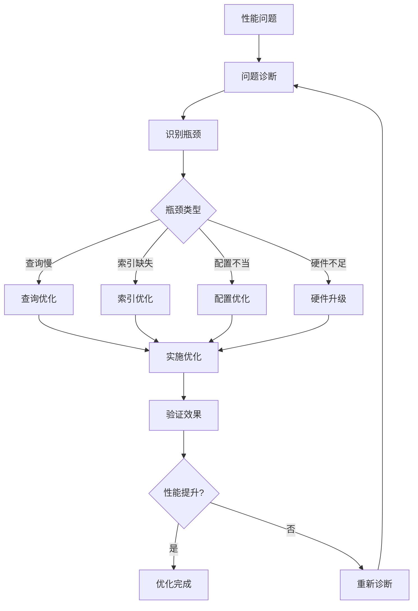

# 数据库性能调优实战：从问题诊断到优化实施

> **创建日期**：2025-01-15
> **最后更新**：2025-01-15
> **版本**：v1.0
> **状态**：实施中

---

## 📋 目录

- [数据库性能调优实战：从问题诊断到优化实施](#数据库性能调优实战从问题诊断到优化实施)
  - [📋 目录](#-目录)
  - [1. 概述](#1-概述)
    - [1.1. 性能调优流程](#11-性能调优流程)
  - [2. 性能问题诊断](#2-性能问题诊断)
    - [2.1. 慢查询识别](#21-慢查询识别)
    - [2.2. 锁等待分析](#22-锁等待分析)
    - [2.3. 表统计信息分析](#23-表统计信息分析)
  - [3. 查询优化实战](#3-查询优化实战)
    - [3.1. JOIN优化](#31-join优化)
    - [3.2. 子查询优化](#32-子查询优化)
    - [3.3. 分页优化](#33-分页优化)
  - [4. 索引优化实战](#4-索引优化实战)
    - [4.1. 索引使用分析](#41-索引使用分析)
    - [4.2. 索引优化案例](#42-索引优化案例)
  - [5. 配置优化](#5-配置优化)
    - [5.1. PostgreSQL配置优化](#51-postgresql配置优化)
    - [5.2. 自动VACUUM优化](#52-自动vacuum优化)
  - [6. 监控与告警](#6-监控与告警)
    - [6.1. 性能监控视图](#61-性能监控视图)
    - [6.2. 告警规则](#62-告警规则)
  - [7. 参考资料](#7-参考资料)

---

## 1. 概述

性能调优是数据库管理的核心技能。本文档提供从问题诊断到优化实施的完整实战指南。

### 1.1. 性能调优流程



---

## 2. 性能问题诊断

### 2.1. 慢查询识别

**启用慢查询日志（PostgreSQL）**：

```sql
-- 启用pg_stat_statements扩展
CREATE EXTENSION IF NOT EXISTS pg_stat_statements;

-- 查看慢查询
SELECT
    query,
    calls,
    total_exec_time,
    mean_exec_time,
    max_exec_time,
    (total_exec_time / calls) AS avg_time_per_call
FROM pg_stat_statements
WHERE mean_exec_time > 1000  -- 平均执行时间超过1秒
ORDER BY mean_exec_time DESC
LIMIT 20;
```

**查询执行计划分析**：

```sql
-- 分析查询计划
EXPLAIN (ANALYZE, BUFFERS, VERBOSE)
SELECT u.username, o.total, o.order_date
FROM users u
JOIN orders o ON u.id = o.user_id
WHERE u.email = 'user@example.com'
ORDER BY o.order_date DESC
LIMIT 10;

-- 关键指标解读：
-- Seq Scan: 全表扫描，通常需要优化
-- Index Scan: 索引扫描，通常较好
-- Nested Loop: 嵌套循环，小数据集时好
-- Hash Join: 哈希连接，大数据集时好
-- Sort: 排序操作，可能需要索引优化
```

### 2.2. 锁等待分析

**锁等待查询**：

```sql
-- 查看当前锁等待
SELECT
    blocked_locks.pid AS blocked_pid,
    blocked_activity.usename AS blocked_user,
    blocking_locks.pid AS blocking_pid,
    blocking_activity.usename AS blocking_user,
    blocked_activity.query AS blocked_statement,
    blocking_activity.query AS blocking_statement,
    blocked_activity.application_name AS blocked_application,
    blocking_activity.application_name AS blocking_application
FROM pg_catalog.pg_locks blocked_locks
JOIN pg_catalog.pg_stat_activity blocked_activity ON blocked_activity.pid = blocked_locks.pid
JOIN pg_catalog.pg_locks blocking_locks
    ON blocking_locks.locktype = blocked_locks.locktype
    AND blocking_locks.database IS NOT DISTINCT FROM blocked_locks.database
    AND blocking_locks.relation IS NOT DISTINCT FROM blocked_locks.relation
    AND blocking_locks.page IS NOT DISTINCT FROM blocked_locks.page
    AND blocking_locks.tuple IS NOT DISTINCT FROM blocked_locks.tuple
    AND blocking_locks.virtualxid IS NOT DISTINCT FROM blocked_locks.virtualxid
    AND blocking_locks.transactionid IS NOT DISTINCT FROM blocked_locks.transactionid
    AND blocking_locks.classid IS NOT DISTINCT FROM blocked_locks.classid
    AND blocking_locks.objid IS NOT DISTINCT FROM blocked_locks.objid
    AND blocking_locks.objsubid IS NOT DISTINCT FROM blocked_locks.objsubid
    AND blocking_locks.pid != blocked_locks.pid
JOIN pg_catalog.pg_stat_activity blocking_activity ON blocking_activity.pid = blocking_locks.pid
WHERE NOT blocked_locks.granted;
```

### 2.3. 表统计信息分析

**表大小和统计信息**：

```sql
-- 表大小分析
SELECT
    schemaname,
    tablename,
    pg_size_pretty(pg_total_relation_size(schemaname||'.'||tablename)) AS total_size,
    pg_size_pretty(pg_relation_size(schemaname||'.'||tablename)) AS table_size,
    pg_size_pretty(pg_indexes_size(schemaname||'.'||tablename)) AS indexes_size,
    n_live_tup AS row_count,
    n_dead_tup AS dead_rows,
    last_vacuum,
    last_autovacuum,
    last_analyze,
    last_autoanalyze
FROM pg_stat_user_tables
ORDER BY pg_total_relation_size(schemaname||'.'||tablename) DESC;

-- 表膨胀检查
SELECT
    schemaname,
    tablename,
    n_dead_tup,
    n_live_tup,
    CASE
        WHEN n_live_tup > 0
        THEN ROUND(100.0 * n_dead_tup / (n_live_tup + n_dead_tup), 2)
        ELSE 0
    END AS dead_tuple_percentage
FROM pg_stat_user_tables
WHERE n_dead_tup > 1000
ORDER BY n_dead_tup DESC;
```

---

## 3. 查询优化实战

### 3.1. JOIN优化

**优化前（慢查询）**：

```sql
-- 问题：没有索引，全表扫描
SELECT u.username, o.total, p.name
FROM users u
JOIN orders o ON u.id = o.user_id
JOIN order_items oi ON o.id = oi.order_id
JOIN products p ON oi.product_id = p.id
WHERE u.email = 'user@example.com';
```

**优化后**：

```sql
-- 1. 添加索引
CREATE INDEX idx_orders_user_id ON orders(user_id);
CREATE INDEX idx_order_items_order_id ON order_items(order_id);
CREATE INDEX idx_order_items_product_id ON order_items(product_id);
CREATE INDEX idx_users_email ON users(email);

-- 2. 优化查询（使用EXISTS替代JOIN）
SELECT u.username, o.total, p.name
FROM users u
JOIN orders o ON u.id = o.user_id
JOIN order_items oi ON o.id = oi.order_id
JOIN products p ON oi.product_id = p.id
WHERE u.email = 'user@example.com'
  AND EXISTS (
      SELECT 1 FROM order_items oi2
      WHERE oi2.order_id = o.id
  );

-- 3. 或者使用物化视图（如果查询频繁）
CREATE MATERIALIZED VIEW user_order_summary AS
SELECT
    u.id AS user_id,
    u.username,
    u.email,
    o.id AS order_id,
    o.total,
    o.order_date,
    p.name AS product_name
FROM users u
JOIN orders o ON u.id = o.user_id
JOIN order_items oi ON o.id = oi.order_id
JOIN products p ON oi.product_id = p.id;

CREATE INDEX idx_user_order_summary_email ON user_order_summary(email);

-- 定期刷新物化视图
REFRESH MATERIALIZED VIEW CONCURRENTLY user_order_summary;
```

### 3.2. 子查询优化

**优化前**：

```sql
-- 问题：相关子查询，执行N次
SELECT
    u.id,
    u.username,
    (SELECT COUNT(*) FROM orders WHERE user_id = u.id) AS order_count,
    (SELECT SUM(total) FROM orders WHERE user_id = u.id) AS total_spent
FROM users u;
```

**优化后**：

```sql
-- 使用JOIN和聚合
SELECT
    u.id,
    u.username,
    COALESCE(o.order_count, 0) AS order_count,
    COALESCE(o.total_spent, 0) AS total_spent
FROM users u
LEFT JOIN (
    SELECT
        user_id,
        COUNT(*) AS order_count,
        SUM(total) AS total_spent
    FROM orders
    GROUP BY user_id
) o ON u.id = o.user_id;
```

### 3.3. 分页优化

**优化前（深度分页慢）**：

```sql
-- 问题：OFFSET越大越慢
SELECT * FROM orders
ORDER BY order_date DESC
OFFSET 100000 LIMIT 20;
```

**优化后（游标分页）**：

```sql
-- 使用游标分页
SELECT * FROM orders
WHERE order_date < '2024-01-01'  -- 上一页的最后一条记录的order_date
ORDER BY order_date DESC
LIMIT 20;

-- 或者使用索引覆盖
CREATE INDEX idx_orders_date_id ON orders(order_date DESC, id);

SELECT o.*
FROM (
    SELECT id
    FROM orders
    ORDER BY order_date DESC, id DESC
    LIMIT 20 OFFSET 100000
) sub
JOIN orders o ON sub.id = o.id
ORDER BY o.order_date DESC, o.id DESC;
```

---

## 4. 索引优化实战

### 4.1. 索引使用分析

**索引使用情况查询**：

```sql
-- 未使用的索引
SELECT
    schemaname,
    tablename,
    indexname,
    idx_scan,
    pg_size_pretty(pg_relation_size(indexrelid)) AS index_size
FROM pg_stat_user_indexes
WHERE idx_scan = 0
  AND schemaname = 'public'
ORDER BY pg_relation_size(indexrelid) DESC;

-- 索引使用统计
SELECT
    schemaname,
    tablename,
    indexname,
    idx_scan,
    idx_tup_read,
    idx_tup_fetch,
    pg_size_pretty(pg_relation_size(indexrelid)) AS index_size
FROM pg_stat_user_indexes
WHERE schemaname = 'public'
ORDER BY idx_scan DESC;
```

### 4.2. 索引优化案例

**案例1：复合索引优化**:

```sql
-- 查询模式
SELECT * FROM orders
WHERE user_id = 123
  AND status = 'completed'
  AND order_date >= '2024-01-01'
ORDER BY order_date DESC;

-- 优化：创建复合索引
CREATE INDEX idx_orders_user_status_date
ON orders(user_id, status, order_date DESC);

-- 索引列顺序原则：
-- 1. 等值查询列在前（user_id, status）
-- 2. 范围查询列在后（order_date）
-- 3. 排序列在最后（order_date DESC）
```

**案例2：部分索引优化**:

```sql
-- 查询：只查询活跃订单
SELECT * FROM orders WHERE status = 'active';

-- 优化：创建部分索引（只索引活跃订单）
CREATE INDEX idx_orders_active
ON orders(user_id, order_date DESC)
WHERE status = 'active';

-- 优势：索引更小，查询更快
```

**案例3：表达式索引**:

```sql
-- 查询：按邮箱域名查询
SELECT * FROM users WHERE email LIKE '%@gmail.com';

-- 优化：创建表达式索引
CREATE INDEX idx_users_email_domain
ON users((substring(email FROM '@(.+)$')));

-- 或者使用全文搜索
CREATE INDEX idx_users_email_gin
ON users USING GIN (email gin_trgm_ops);
```

---

## 5. 配置优化

### 5.1. PostgreSQL配置优化

**关键配置参数**：

```sql
-- 查看当前配置
SHOW shared_buffers;
SHOW effective_cache_size;
SHOW work_mem;
SHOW maintenance_work_mem;
SHOW max_connections;

-- 推荐配置（8GB内存服务器）
-- postgresql.conf
shared_buffers = 2GB                    -- 25% of RAM
effective_cache_size = 6GB              -- 75% of RAM
work_mem = 16MB                         -- (RAM - shared_buffers) / (max_connections * 2)
maintenance_work_mem = 512MB            -- 用于VACUUM等操作
max_connections = 100                   -- 根据实际需求
random_page_cost = 1.1                  -- SSD环境
effective_io_concurrency = 200         -- SSD环境
```

### 5.2. 自动VACUUM优化

**VACUUM配置**：

```sql
-- 查看VACUUM统计
SELECT
    schemaname,
    tablename,
    last_vacuum,
    last_autovacuum,
    vacuum_count,
    autovacuum_count,
    n_dead_tup,
    n_live_tup
FROM pg_stat_user_tables
ORDER BY n_dead_tup DESC;

-- 手动执行VACUUM
VACUUM ANALYZE orders;

-- 表级VACUUM配置
ALTER TABLE orders SET (
    autovacuum_vacuum_scale_factor = 0.05,  -- 5% dead tuples触发
    autovacuum_analyze_scale_factor = 0.02  -- 2%变化触发analyze
);
```

---

## 6. 监控与告警

### 6.1. 性能监控视图

**创建监控视图**：

```sql
-- 慢查询监控视图
CREATE VIEW slow_queries AS
SELECT
    query,
    calls,
    total_exec_time,
    mean_exec_time,
    max_exec_time,
    (total_exec_time / calls) AS avg_time_per_call
FROM pg_stat_statements
WHERE mean_exec_time > 1000
ORDER BY mean_exec_time DESC;

-- 表性能监控视图
CREATE VIEW table_performance AS
SELECT
    schemaname,
    tablename,
    seq_scan,
    seq_tup_read,
    idx_scan,
    idx_tup_fetch,
    n_tup_ins,
    n_tup_upd,
    n_tup_del,
    n_live_tup,
    n_dead_tup,
    last_vacuum,
    last_autovacuum
FROM pg_stat_user_tables
ORDER BY seq_scan DESC;
```

### 6.2. 告警规则

**性能告警SQL**：

```sql
-- 慢查询告警
SELECT
    'SLOW_QUERY' AS alert_type,
    query,
    mean_exec_time,
    calls
FROM pg_stat_statements
WHERE mean_exec_time > 5000  -- 5秒
  AND calls > 10;

-- 表膨胀告警
SELECT
    'TABLE_BLOAT' AS alert_type,
    schemaname,
    tablename,
    n_dead_tup,
    ROUND(100.0 * n_dead_tup / NULLIF(n_live_tup + n_dead_tup, 0), 2) AS dead_percentage
FROM pg_stat_user_tables
WHERE n_dead_tup > 10000
  AND ROUND(100.0 * n_dead_tup / NULLIF(n_live_tup + n_dead_tup, 0), 2) > 20;

-- 锁等待告警
SELECT
    'LOCK_WAIT' AS alert_type,
    COUNT(*) AS waiting_queries
FROM pg_locks
WHERE NOT granted;
```

---

## 7. 参考资料

- [数据分析与使用指南](./07.04-数据分析与使用指南.md)
- [数据库设计反模式](./07.06-数据库设计反模式与解决方案.md)
- [PostgreSQL性能调优](https://www.postgresql.org/docs/current/performance-tips.html)

---

**最后更新**：2025-01-15
**维护者**：Data-Science Team
**状态**：实施中
