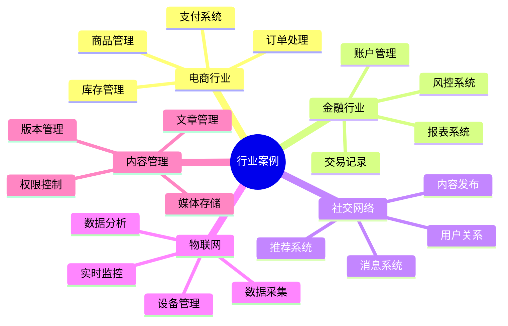
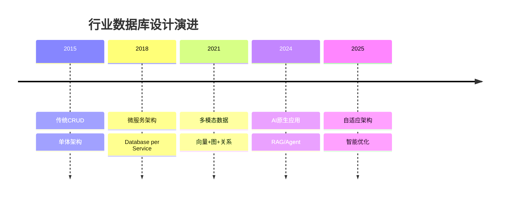

# 行业案例库：数据库设计的实际应用案例

> **创建日期**：2025-01-15
> **最后更新**：2025-12-01
> **版本**：v2.0 (增强版)
> **状态**：已完成 ✅

---

## 📋 目录

- [行业案例库：数据库设计的实际应用案例](#行业案例库数据库设计的实际应用案例)
  - [📋 目录](#-目录)
  - [1. 概述](#1-概述)
    - [1.1. 案例分类](#11-案例分类)
  - [2. 电商行业案例](#2-电商行业案例)
    - [2.1. 大型电商平台Schema设计](#21-大型电商平台schema设计)
    - [2.2. 设计决策说明](#22-设计决策说明)
  - [3. 金融行业案例](#3-金融行业案例)
    - [3.1. 银行核心系统Schema设计](#31-银行核心系统schema设计)
    - [3.2. 风控系统设计](#32-风控系统设计)
  - [4. 社交网络案例](#4-社交网络案例)
    - [4.1. 社交网络核心Schema](#41-社交网络核心schema)
  - [5. 物联网案例](#5-物联网案例)
    - [5.1. IoT设备数据Schema](#51-iot设备数据schema)
  - [6. 内容管理系统案例](#6-内容管理系统案例)
    - [6.1. CMS Schema设计](#61-cms-schema设计)
  - [7. 2024-2025行业案例趋势](#7-2024-2025行业案例趋势)
    - [7.1. 行业数据库设计演进](#71-行业数据库设计演进)
    - [7.2. 行业案例选型矩阵](#72-行业案例选型矩阵)
    - [7.3. AI应用行业案例](#73-ai应用行业案例)
  - [8. 参考资料](#8-参考资料)
    - [8.1. 权威文献](#81-权威文献)
    - [8.2. 在线资源](#82-在线资源)
    - [8.3. 相关文档](#83-相关文档)

---

## 1. 概述

本文档提供不同行业的数据库设计实际案例，每个案例包含完整的Schema设计、设计决策和优化策略。

### 1.1. 案例分类



---

## 2. 电商行业案例

### 2.1. 大型电商平台Schema设计

**业务特点**：

- 高并发读写
- 海量商品数据
- 复杂订单流程
- 实时库存管理

**完整Schema设计**：

```sql
-- ============================================
-- 用户域
-- ============================================

CREATE SCHEMA user_domain;

-- 用户主表（分表设计）
CREATE TABLE user_domain.users_0 (
    user_id BIGINT PRIMARY KEY,
    username VARCHAR(50) UNIQUE NOT NULL,
    email VARCHAR(100) UNIQUE NOT NULL,
    phone VARCHAR(20) UNIQUE,
    password_hash VARCHAR(255) NOT NULL,
    status VARCHAR(20) DEFAULT 'active',
    created_at TIMESTAMP DEFAULT CURRENT_TIMESTAMP,
    updated_at TIMESTAMP DEFAULT CURRENT_TIMESTAMP
) PARTITION BY HASH (user_id);

-- 用户分表（按user_id哈希）
CREATE TABLE user_domain.users_0_p0 PARTITION OF user_domain.users_0
    FOR VALUES WITH (MODULUS 4, REMAINDER 0);
CREATE TABLE user_domain.users_0_p1 PARTITION OF user_domain.users_0
    FOR VALUES WITH (MODULUS 4, REMAINDER 1);
CREATE TABLE user_domain.users_0_p2 PARTITION OF user_domain.users_0
    FOR VALUES WITH (MODULUS 4, REMAINDER 2);
CREATE TABLE user_domain.users_0_p3 PARTITION OF user_domain.users_0
    FOR VALUES WITH (MODULUS 4, REMAINDER 3);

-- 用户地址表
CREATE TABLE user_domain.addresses (
    address_id BIGSERIAL PRIMARY KEY,
    user_id BIGINT NOT NULL,
    address_type VARCHAR(20) NOT NULL,  -- home, work, other
    recipient_name VARCHAR(100) NOT NULL,
    phone VARCHAR(20) NOT NULL,
    province VARCHAR(50) NOT NULL,
    city VARCHAR(50) NOT NULL,
    district VARCHAR(50) NOT NULL,
    street VARCHAR(200) NOT NULL,
    postal_code VARCHAR(10),
    is_default BOOLEAN DEFAULT FALSE,
    created_at TIMESTAMP DEFAULT CURRENT_TIMESTAMP
);

CREATE INDEX idx_addresses_user ON user_domain.addresses(user_id);
CREATE INDEX idx_addresses_user_default ON user_domain.addresses(user_id, is_default)
    WHERE is_default = TRUE;

-- ============================================
-- 商品域
-- ============================================

CREATE SCHEMA product_domain;

-- 商品分类表（树形结构）
CREATE TABLE product_domain.categories (
    category_id BIGSERIAL PRIMARY KEY,
    name VARCHAR(100) NOT NULL,
    parent_id BIGINT REFERENCES product_domain.categories(category_id),
    level INTEGER NOT NULL,
    path TEXT NOT NULL,  -- 路径：/1/2/3
    sort_order INTEGER DEFAULT 0,
    is_active BOOLEAN DEFAULT TRUE,
    created_at TIMESTAMP DEFAULT CURRENT_TIMESTAMP
);

CREATE INDEX idx_categories_parent ON product_domain.categories(parent_id);
CREATE INDEX idx_categories_path ON product_domain.categories USING GIN (path gin_trgm_ops);

-- 商品主表
CREATE TABLE product_domain.products (
    product_id BIGSERIAL PRIMARY KEY,
    spu_code VARCHAR(50) UNIQUE NOT NULL,  -- 商品编码
    name VARCHAR(200) NOT NULL,
    title VARCHAR(300),  -- SEO标题
    description TEXT,
    category_id BIGINT NOT NULL REFERENCES product_domain.categories(category_id),
    brand_id BIGINT,
    price DECIMAL(10,2) NOT NULL CHECK (price > 0),
    original_price DECIMAL(10,2),
    cost_price DECIMAL(10,2),  -- 成本价
    weight DECIMAL(8,2),
    volume DECIMAL(8,2),
    status VARCHAR(20) DEFAULT 'draft',  -- draft, active, inactive, deleted
    sales_count INTEGER DEFAULT 0,
    view_count INTEGER DEFAULT 0,
    rating_average DECIMAL(3,2) DEFAULT 0 CHECK (rating_average >= 0 AND rating_average <= 5),
    rating_count INTEGER DEFAULT 0,
    created_at TIMESTAMP DEFAULT CURRENT_TIMESTAMP,
    updated_at TIMESTAMP DEFAULT CURRENT_TIMESTAMP
) PARTITION BY RANGE (created_at);

-- 按月分区
CREATE TABLE product_domain.products_2024_01 PARTITION OF product_domain.products
    FOR VALUES FROM ('2024-01-01') TO ('2024-02-01');

CREATE INDEX idx_products_category ON product_domain.products(category_id);
CREATE INDEX idx_products_status ON product_domain.products(status) WHERE status = 'active';
CREATE INDEX idx_products_price ON product_domain.products(price);
CREATE INDEX idx_products_rating ON product_domain.products(rating_average DESC, rating_count DESC);
CREATE INDEX idx_products_search ON product_domain.products USING GIN (
    to_tsvector('english', name || ' ' || COALESCE(title, '') || ' ' || COALESCE(description, ''))
);

-- 商品SKU表（规格）
CREATE TABLE product_domain.product_skus (
    sku_id BIGSERIAL PRIMARY KEY,
    product_id BIGINT NOT NULL REFERENCES product_domain.products(product_id) ON DELETE CASCADE,
    sku_code VARCHAR(50) UNIQUE NOT NULL,
    attributes JSONB NOT NULL,  -- {"color": "red", "size": "L", "material": "cotton"}
    price DECIMAL(10,2) NOT NULL,
    cost_price DECIMAL(10,2),
    stock INTEGER DEFAULT 0 CHECK (stock >= 0),
    reserved_stock INTEGER DEFAULT 0 CHECK (reserved_stock >= 0),  -- 已预订库存
    available_stock INTEGER GENERATED ALWAYS AS (stock - reserved_stock) STORED,
    weight DECIMAL(8,2),
    barcode VARCHAR(50),
    is_default BOOLEAN DEFAULT FALSE,
    status VARCHAR(20) DEFAULT 'active',
    created_at TIMESTAMP DEFAULT CURRENT_TIMESTAMP
);

CREATE INDEX idx_product_skus_product ON product_domain.product_skus(product_id);
CREATE INDEX idx_product_skus_code ON product_domain.product_skus(sku_code);
CREATE INDEX idx_product_skus_stock ON product_domain.product_skus(available_stock)
    WHERE status = 'active';
CREATE INDEX idx_product_skus_attributes ON product_domain.product_skus USING GIN (attributes);

-- 库存变更日志（用于库存追溯）
CREATE TABLE product_domain.stock_logs (
    log_id BIGSERIAL PRIMARY KEY,
    sku_id BIGINT NOT NULL REFERENCES product_domain.product_skus(sku_id),
    change_type VARCHAR(20) NOT NULL,  -- IN, OUT, RESERVE, RELEASE, ADJUST
    quantity INTEGER NOT NULL,
    before_stock INTEGER NOT NULL,
    after_stock INTEGER NOT NULL,
    reference_type VARCHAR(50),  -- ORDER, RETURN, ADJUSTMENT
    reference_id BIGINT,
    operator_id BIGINT,
    remark TEXT,
    created_at TIMESTAMP DEFAULT CURRENT_TIMESTAMP
) PARTITION BY RANGE (created_at);

CREATE INDEX idx_stock_logs_sku ON product_domain.stock_logs(sku_id, created_at DESC);
CREATE INDEX idx_stock_logs_reference ON product_domain.stock_logs(reference_type, reference_id);

-- ============================================
-- 订单域
-- ============================================

CREATE SCHEMA order_domain;

-- 订单主表
CREATE TABLE order_domain.orders (
    order_id BIGSERIAL PRIMARY KEY,
    order_number VARCHAR(50) UNIQUE NOT NULL,
    user_id BIGINT NOT NULL,
    order_type VARCHAR(20) DEFAULT 'normal',  -- normal, group, presale
    total_amount DECIMAL(10,2) NOT NULL CHECK (total_amount > 0),
    discount_amount DECIMAL(10,2) DEFAULT 0,
    shipping_fee DECIMAL(10,2) DEFAULT 0,
    final_amount DECIMAL(10,2) NOT NULL,
    payment_amount DECIMAL(10,2) DEFAULT 0,
    refund_amount DECIMAL(10,2) DEFAULT 0,
    status VARCHAR(20) DEFAULT 'pending',  -- pending, paid, shipped, completed, cancelled, refunded
    payment_status VARCHAR(20) DEFAULT 'unpaid',  -- unpaid, paid, partial_refund, refunded
    shipping_status VARCHAR(20) DEFAULT 'unshipped',  -- unshipped, shipped, delivered
    shipping_address JSONB NOT NULL,
    payment_method VARCHAR(50),
    payment_transaction_id VARCHAR(100),
    remark TEXT,
    order_date TIMESTAMP DEFAULT CURRENT_TIMESTAMP,
    paid_at TIMESTAMP,
    shipped_at TIMESTAMP,
    completed_at TIMESTAMP,
    cancelled_at TIMESTAMP,
    cancel_reason TEXT
) PARTITION BY RANGE (order_date);

-- 按月分区
CREATE TABLE order_domain.orders_2024_01 PARTITION OF order_domain.orders
    FOR VALUES FROM ('2024-01-01') TO ('2024-02-01');

CREATE INDEX idx_orders_user ON order_domain.orders(user_id, order_date DESC);
CREATE INDEX idx_orders_number ON order_domain.orders(order_number);
CREATE INDEX idx_orders_status ON order_domain.orders(status);
CREATE INDEX idx_orders_payment_status ON order_domain.orders(payment_status);
CREATE INDEX idx_orders_date ON order_domain.orders(order_date DESC);

-- 订单项表
CREATE TABLE order_domain.order_items (
    item_id BIGSERIAL PRIMARY KEY,
    order_id BIGINT NOT NULL,
    product_id BIGINT NOT NULL,
    sku_id BIGINT,
    product_name VARCHAR(200) NOT NULL,  -- 快照
    product_image VARCHAR(500),
    sku_attributes JSONB,  -- 快照
    price DECIMAL(10,2) NOT NULL,  -- 订单时的价格
    cost_price DECIMAL(10,2),  -- 成本价
    quantity INTEGER NOT NULL CHECK (quantity > 0),
    subtotal DECIMAL(10,2) NOT NULL,
    discount_amount DECIMAL(10,2) DEFAULT 0,
    final_amount DECIMAL(10,2) NOT NULL,
    refund_quantity INTEGER DEFAULT 0,
    refund_amount DECIMAL(10,2) DEFAULT 0,
    created_at TIMESTAMP DEFAULT CURRENT_TIMESTAMP,
    FOREIGN KEY (order_id) REFERENCES order_domain.orders(order_id) ON DELETE CASCADE
) PARTITION BY RANGE (created_at);

CREATE INDEX idx_order_items_order ON order_domain.order_items(order_id);
CREATE INDEX idx_order_items_product ON order_domain.order_items(product_id);
CREATE INDEX idx_order_items_sku ON order_domain.order_items(sku_id);

-- 订单状态变更日志
CREATE TABLE order_domain.order_status_logs (
    log_id BIGSERIAL PRIMARY KEY,
    order_id BIGINT NOT NULL,
    old_status VARCHAR(20),
    new_status VARCHAR(20) NOT NULL,
    changed_by VARCHAR(50),  -- user_id or system
    change_reason TEXT,
    created_at TIMESTAMP DEFAULT CURRENT_TIMESTAMP
) PARTITION BY RANGE (created_at);

CREATE INDEX idx_order_status_logs_order ON order_domain.order_status_logs(order_id, created_at DESC);

-- ============================================
-- 购物车域
-- ============================================

CREATE SCHEMA cart_domain;

-- 购物车表
CREATE TABLE cart_domain.carts (
    cart_id BIGSERIAL PRIMARY KEY,
    user_id BIGINT NOT NULL UNIQUE,
    updated_at TIMESTAMP DEFAULT CURRENT_TIMESTAMP
);

CREATE INDEX idx_carts_user ON cart_domain.carts(user_id);

-- 购物车项表
CREATE TABLE cart_domain.cart_items (
    item_id BIGSERIAL PRIMARY KEY,
    cart_id BIGINT NOT NULL REFERENCES cart_domain.carts(cart_id) ON DELETE CASCADE,
    product_id BIGINT NOT NULL,
    sku_id BIGINT,
    quantity INTEGER NOT NULL CHECK (quantity > 0),
    added_at TIMESTAMP DEFAULT CURRENT_TIMESTAMP,
    updated_at TIMESTAMP DEFAULT CURRENT_TIMESTAMP,
    UNIQUE(cart_id, product_id, sku_id)
);

CREATE INDEX idx_cart_items_cart ON cart_domain.cart_items(cart_id);
CREATE INDEX idx_cart_items_product ON cart_domain.cart_items(product_id);

-- ============================================
-- 支付域
-- ============================================

CREATE SCHEMA payment_domain;

-- 支付记录表
CREATE TABLE payment_domain.payments (
    payment_id BIGSERIAL PRIMARY KEY,
    order_id BIGINT NOT NULL,
    payment_number VARCHAR(50) UNIQUE NOT NULL,
    payment_method VARCHAR(50) NOT NULL,  -- alipay, wechat, credit_card
    amount DECIMAL(10,2) NOT NULL,
    status VARCHAR(20) DEFAULT 'pending',  -- pending, processing, success, failed, refunded
    transaction_id VARCHAR(100),
    third_party_response JSONB,
    paid_at TIMESTAMP,
    created_at TIMESTAMP DEFAULT CURRENT_TIMESTAMP
) PARTITION BY RANGE (created_at);

CREATE INDEX idx_payments_order ON payment_domain.payments(order_id);
CREATE INDEX idx_payments_number ON payment_domain.payments(payment_number);
CREATE INDEX idx_payments_status ON payment_domain.payments(status);
CREATE INDEX idx_payments_transaction ON payment_domain.payments(transaction_id);

-- ============================================
-- 触发器：自动更新商品评分
-- ============================================

CREATE SCHEMA review_domain;

CREATE TABLE review_domain.reviews (
    review_id BIGSERIAL PRIMARY KEY,
    product_id BIGINT NOT NULL,
    user_id BIGINT NOT NULL,
    order_id BIGINT,
    sku_id BIGINT,
    rating INTEGER NOT NULL CHECK (rating >= 1 AND rating <= 5),
    title VARCHAR(200),
    content TEXT,
    images TEXT[],
    is_anonymous BOOLEAN DEFAULT FALSE,
    helpful_count INTEGER DEFAULT 0,
    status VARCHAR(20) DEFAULT 'pending',  -- pending, approved, rejected
    created_at TIMESTAMP DEFAULT CURRENT_TIMESTAMP,
    updated_at TIMESTAMP DEFAULT CURRENT_TIMESTAMP,
    UNIQUE(product_id, user_id, order_id)
);

CREATE INDEX idx_reviews_product ON review_domain.reviews(product_id, rating DESC, created_at DESC);
CREATE INDEX idx_reviews_user ON review_domain.reviews(user_id);
CREATE INDEX idx_reviews_order ON review_domain.reviews(order_id);

-- 更新商品评分的触发器函数
CREATE OR REPLACE FUNCTION update_product_rating()
RETURNS TRIGGER AS $$
BEGIN
    UPDATE product_domain.products
    SET
        rating_average = (
            SELECT AVG(rating)::DECIMAL(3,2)
            FROM review_domain.reviews
            WHERE product_id = NEW.product_id AND status = 'approved'
        ),
        rating_count = (
            SELECT COUNT(*)
            FROM review_domain.reviews
            WHERE product_id = NEW.product_id AND status = 'approved'
        )
    WHERE id = NEW.product_id;

    RETURN NEW;
END;
$$ LANGUAGE plpgsql;

CREATE TRIGGER product_rating_update
AFTER INSERT OR UPDATE ON review_domain.reviews
FOR EACH ROW
WHEN (NEW.status = 'approved')
EXECUTE FUNCTION update_product_rating();
```

### 2.2. 设计决策说明

**关键设计决策**：

1. **分表策略**：
   - 用户表按user_id哈希分表，支持水平扩展
   - 订单表按时间分区，便于历史数据管理

2. **库存管理**：
   - 使用reserved_stock字段处理订单预订
   - available_stock使用生成列自动计算
   - stock_logs表记录所有库存变更

3. **价格快照**：
   - 订单项存储商品价格快照，保证历史价格准确性

4. **搜索优化**：
   - 使用全文搜索索引优化商品搜索
   - JSONB索引支持SKU属性查询

---

## 3. 金融行业案例

### 3.1. 银行核心系统Schema设计

**业务特点**：

- 强一致性要求
- 高并发交易
- 严格审计要求
- 实时风控

**核心表设计**：

```sql
CREATE SCHEMA banking_core;

-- 账户表
CREATE TABLE banking_core.accounts (
    account_id BIGSERIAL PRIMARY KEY,
    account_number VARCHAR(50) UNIQUE NOT NULL,
    customer_id BIGINT NOT NULL,
    account_type VARCHAR(20) NOT NULL,  -- savings, checking, credit
    currency VARCHAR(3) NOT NULL DEFAULT 'CNY',
    balance DECIMAL(15,2) NOT NULL DEFAULT 0 CHECK (balance >= 0),
    available_balance DECIMAL(15,2) NOT NULL DEFAULT 0,
    frozen_amount DECIMAL(15,2) DEFAULT 0,
    status VARCHAR(20) DEFAULT 'active',  -- active, frozen, closed
    opened_at TIMESTAMP DEFAULT CURRENT_TIMESTAMP,
    closed_at TIMESTAMP,
    version INTEGER DEFAULT 0  -- 乐观锁版本号
);

CREATE INDEX idx_accounts_customer ON banking_core.accounts(customer_id);
CREATE INDEX idx_accounts_number ON banking_core.accounts(account_number);
CREATE INDEX idx_accounts_type ON banking_core.accounts(account_type, status);

-- 交易记录表（分区表）
CREATE TABLE banking_core.transactions (
    transaction_id BIGSERIAL,
    transaction_number VARCHAR(50) UNIQUE NOT NULL,
    account_id BIGINT NOT NULL REFERENCES banking_core.accounts(account_id),
    transaction_type VARCHAR(20) NOT NULL,  -- deposit, withdrawal, transfer, interest
    amount DECIMAL(15,2) NOT NULL,
    balance_before DECIMAL(15,2) NOT NULL,
    balance_after DECIMAL(15,2) NOT NULL,
    counterparty_account VARCHAR(50),
    description TEXT,
    status VARCHAR(20) DEFAULT 'pending',  -- pending, completed, failed, cancelled
    transaction_date TIMESTAMP DEFAULT CURRENT_TIMESTAMP,
    PRIMARY KEY (transaction_id, transaction_date)
) PARTITION BY RANGE (transaction_date);

-- 按月分区
CREATE TABLE banking_core.transactions_2024_01 PARTITION OF banking_core.transactions
    FOR VALUES FROM ('2024-01-01') TO ('2024-02-01');

CREATE INDEX idx_transactions_account ON banking_core.transactions(account_id, transaction_date DESC);
CREATE INDEX idx_transactions_number ON banking_core.transactions(transaction_number);
CREATE INDEX idx_transactions_date ON banking_core.transactions(transaction_date DESC);

-- 账户余额变更（使用事件溯源）
CREATE TABLE banking_core.account_balance_events (
    event_id BIGSERIAL PRIMARY KEY,
    account_id BIGINT NOT NULL,
    event_type VARCHAR(20) NOT NULL,  -- DEPOSIT, WITHDRAWAL, TRANSFER_IN, TRANSFER_OUT
    amount DECIMAL(15,2) NOT NULL,
    balance_before DECIMAL(15,2) NOT NULL,
    balance_after DECIMAL(15,2) NOT NULL,
    transaction_id BIGINT,
    event_date TIMESTAMP DEFAULT CURRENT_TIMESTAMP
) PARTITION BY RANGE (event_date);

CREATE INDEX idx_balance_events_account ON banking_core.account_balance_events(account_id, event_date DESC);

-- 账户余额快照（定期生成，用于快速查询）
CREATE TABLE banking_core.account_balance_snapshots (
    snapshot_id BIGSERIAL PRIMARY KEY,
    account_id BIGINT NOT NULL,
    balance DECIMAL(15,2) NOT NULL,
    snapshot_date DATE NOT NULL,
    UNIQUE(account_id, snapshot_date)
);

CREATE INDEX idx_balance_snapshots_account ON banking_core.account_balance_snapshots(account_id, snapshot_date DESC);
```

### 3.2. 风控系统设计

```sql
CREATE SCHEMA risk_control;

-- 风控规则表
CREATE TABLE risk_control.rules (
    rule_id BIGSERIAL PRIMARY KEY,
    rule_name VARCHAR(100) NOT NULL,
    rule_type VARCHAR(50) NOT NULL,  -- AMOUNT_LIMIT, FREQUENCY_LIMIT, PATTERN_DETECTION
    rule_config JSONB NOT NULL,
    priority INTEGER DEFAULT 0,
    is_active BOOLEAN DEFAULT TRUE,
    created_at TIMESTAMP DEFAULT CURRENT_TIMESTAMP
);

-- 风控事件表
CREATE TABLE risk_control.risk_events (
    event_id BIGSERIAL PRIMARY KEY,
    transaction_id BIGINT,
    account_id BIGINT NOT NULL,
    rule_id BIGINT REFERENCES risk_control.rules(rule_id),
    risk_level VARCHAR(20) NOT NULL,  -- low, medium, high, critical
    risk_score DECIMAL(5,2) NOT NULL,
    event_data JSONB NOT NULL,
    action_taken VARCHAR(50),  -- ALLOW, BLOCK, REVIEW
    created_at TIMESTAMP DEFAULT CURRENT_TIMESTAMP
) PARTITION BY RANGE (created_at);

CREATE INDEX idx_risk_events_account ON risk_control.risk_events(account_id, created_at DESC);
CREATE INDEX idx_risk_events_transaction ON risk_control.risk_events(transaction_id);
CREATE INDEX idx_risk_events_level ON risk_control.risk_events(risk_level, created_at DESC);
```

---

## 4. 社交网络案例

### 4.1. 社交网络核心Schema

```sql
CREATE SCHEMA social_network;

-- 用户表
CREATE TABLE social_network.users (
    user_id BIGSERIAL PRIMARY KEY,
    username VARCHAR(50) UNIQUE NOT NULL,
    email VARCHAR(100) UNIQUE NOT NULL,
    nickname VARCHAR(100),
    avatar_url VARCHAR(500),
    bio TEXT,
    status VARCHAR(20) DEFAULT 'active',
    created_at TIMESTAMP DEFAULT CURRENT_TIMESTAMP
);

-- 用户关系表（关注/粉丝）
CREATE TABLE social_network.user_relations (
    relation_id BIGSERIAL PRIMARY KEY,
    follower_id BIGINT NOT NULL REFERENCES social_network.users(user_id),
    followee_id BIGINT NOT NULL REFERENCES social_network.users(user_id),
    relation_type VARCHAR(20) DEFAULT 'follow',  -- follow, block, mute
    created_at TIMESTAMP DEFAULT CURRENT_TIMESTAMP,
    UNIQUE(follower_id, followee_id, relation_type),
    CHECK (follower_id != followee_id)
);

CREATE INDEX idx_relations_follower ON social_network.user_relations(follower_id);
CREATE INDEX idx_relations_followee ON social_network.user_relations(followee_id);

-- 内容表（帖子）
CREATE TABLE social_network.posts (
    post_id BIGSERIAL PRIMARY KEY,
    user_id BIGINT NOT NULL REFERENCES social_network.users(user_id),
    content TEXT NOT NULL,
    media_urls TEXT[],
    visibility VARCHAR(20) DEFAULT 'public',  -- public, friends, private
    like_count INTEGER DEFAULT 0,
    comment_count INTEGER DEFAULT 0,
    share_count INTEGER DEFAULT 0,
    created_at TIMESTAMP DEFAULT CURRENT_TIMESTAMP,
    updated_at TIMESTAMP DEFAULT CURRENT_TIMESTAMP
) PARTITION BY RANGE (created_at);

CREATE INDEX idx_posts_user ON social_network.posts(user_id, created_at DESC);
CREATE INDEX idx_posts_created ON social_network.posts(created_at DESC);
CREATE INDEX idx_posts_content ON social_network.posts USING GIN (to_tsvector('english', content));

-- 点赞表
CREATE TABLE social_network.likes (
    like_id BIGSERIAL PRIMARY KEY,
    post_id BIGINT NOT NULL,
    user_id BIGINT NOT NULL REFERENCES social_network.users(user_id),
    created_at TIMESTAMP DEFAULT CURRENT_TIMESTAMP,
    UNIQUE(post_id, user_id)
);

CREATE INDEX idx_likes_post ON social_network.likes(post_id);
CREATE INDEX idx_likes_user ON social_network.likes(user_id);
```

---

## 5. 物联网案例

### 5.1. IoT设备数据Schema

```sql
CREATE SCHEMA iot;

-- 设备表
CREATE TABLE iot.devices (
    device_id BIGSERIAL PRIMARY KEY,
    device_code VARCHAR(50) UNIQUE NOT NULL,
    device_type VARCHAR(50) NOT NULL,
    location VARCHAR(200),
    status VARCHAR(20) DEFAULT 'online',
    last_heartbeat TIMESTAMP,
    created_at TIMESTAMP DEFAULT CURRENT_TIMESTAMP
);

CREATE INDEX idx_devices_type ON iot.devices(device_type);
CREATE INDEX idx_devices_status ON iot.devices(status);

-- 传感器数据表（时序数据）
CREATE TABLE iot.sensor_data (
    data_id BIGSERIAL,
    device_id BIGINT NOT NULL REFERENCES iot.devices(device_id),
    sensor_type VARCHAR(50) NOT NULL,
    value DECIMAL(10,4) NOT NULL,
    unit VARCHAR(20),
    quality INTEGER DEFAULT 100,  -- 数据质量 0-100
    collected_at TIMESTAMP NOT NULL,
    PRIMARY KEY (data_id, collected_at)
) PARTITION BY RANGE (collected_at);

-- 按小时分区（高频数据）
CREATE TABLE iot.sensor_data_2024_01_01_00 PARTITION OF iot.sensor_data
    FOR VALUES FROM ('2024-01-01 00:00:00') TO ('2024-01-01 01:00:00');

CREATE INDEX idx_sensor_data_device ON iot.sensor_data(device_id, collected_at DESC);
CREATE INDEX idx_sensor_data_type ON iot.sensor_data(sensor_type, collected_at DESC);

-- 数据聚合表（按分钟聚合）
CREATE TABLE iot.sensor_data_aggregated (
    agg_id BIGSERIAL PRIMARY KEY,
    device_id BIGINT NOT NULL,
    sensor_type VARCHAR(50) NOT NULL,
    minute_timestamp TIMESTAMP NOT NULL,
    min_value DECIMAL(10,4),
    max_value DECIMAL(10,4),
    avg_value DECIMAL(10,4),
    count INTEGER NOT NULL,
    UNIQUE(device_id, sensor_type, minute_timestamp)
);

CREATE INDEX idx_sensor_agg_device ON iot.sensor_data_aggregated(device_id, minute_timestamp DESC);
```

---

## 6. 内容管理系统案例

### 6.1. CMS Schema设计

```sql
CREATE SCHEMA cms;

-- 文章表
CREATE TABLE cms.articles (
    article_id BIGSERIAL PRIMARY KEY,
    title VARCHAR(200) NOT NULL,
    slug VARCHAR(200) UNIQUE NOT NULL,
    content TEXT NOT NULL,
    excerpt TEXT,
    author_id BIGINT NOT NULL,
    category_id BIGINT,
    status VARCHAR(20) DEFAULT 'draft',  -- draft, published, archived
    published_at TIMESTAMP,
    view_count INTEGER DEFAULT 0,
    like_count INTEGER DEFAULT 0,
    created_at TIMESTAMP DEFAULT CURRENT_TIMESTAMP,
    updated_at TIMESTAMP DEFAULT CURRENT_TIMESTAMP
);

CREATE INDEX idx_articles_author ON cms.articles(author_id);
CREATE INDEX idx_articles_status ON cms.articles(status, published_at DESC);
CREATE INDEX idx_articles_slug ON cms.articles(slug);
CREATE INDEX idx_articles_search ON cms.articles USING GIN (
    to_tsvector('english', title || ' ' || COALESCE(excerpt, '') || ' ' || content)
);

-- 文章版本表（版本控制）
CREATE TABLE cms.article_versions (
    version_id BIGSERIAL PRIMARY KEY,
    article_id BIGINT NOT NULL REFERENCES cms.articles(article_id),
    version_number INTEGER NOT NULL,
    title VARCHAR(200) NOT NULL,
    content TEXT NOT NULL,
    author_id BIGINT NOT NULL,
    created_at TIMESTAMP DEFAULT CURRENT_TIMESTAMP,
    UNIQUE(article_id, version_number)
);

CREATE INDEX idx_article_versions_article ON cms.article_versions(article_id, version_number DESC);
```

---

## 7. 2024-2025行业案例趋势

### 7.1. 行业数据库设计演进



### 7.2. 行业案例选型矩阵

| 行业 | 核心需求 | 推荐架构 | 关键技术 |
|------|---------|---------|---------|
| **电商** | 高并发、复杂业务 | 微服务+CQRS | PG+Redis+ES |
| **金融** | 强一致性、审计 | 分布式事务 | PG+审计日志 |
| **社交** | 关系网络 | 图数据库 | Neo4j/AGE |
| **IoT** | 高频写入 | 时序数据库 | TimescaleDB |
| **AI应用** | 语义检索 | 向量数据库 | pgvector |
| **游戏** | 低延迟 | 内存数据库 | Redis |

### 7.3. AI应用行业案例

```sql
-- AI应用行业典型Schema
CREATE SCHEMA ai_app;

-- 知识库表
CREATE TABLE ai_app.knowledge_base (
    id UUID PRIMARY KEY DEFAULT gen_random_uuid(),
    name VARCHAR(200) NOT NULL,
    description TEXT,
    embedding_model VARCHAR(100) DEFAULT 'text-embedding-3-small',
    chunk_size INTEGER DEFAULT 500,
    created_at TIMESTAMPTZ DEFAULT CURRENT_TIMESTAMP
);

-- 文档块表
CREATE TABLE ai_app.documents (
    id UUID PRIMARY KEY DEFAULT gen_random_uuid(),
    kb_id UUID REFERENCES ai_app.knowledge_base(id),
    content TEXT NOT NULL,
    embedding vector(1536),
    metadata JSONB DEFAULT '{}',
    created_at TIMESTAMPTZ DEFAULT CURRENT_TIMESTAMP
);

CREATE INDEX idx_docs_embedding ON ai_app.documents
    USING ivfflat (embedding vector_cosine_ops) WITH (lists = 100);

-- 对话表
CREATE TABLE ai_app.conversations (
    id UUID PRIMARY KEY DEFAULT gen_random_uuid(),
    user_id UUID NOT NULL,
    title VARCHAR(500),
    model VARCHAR(100) DEFAULT 'gpt-4',
    created_at TIMESTAMPTZ DEFAULT CURRENT_TIMESTAMP
);

-- 消息表
CREATE TABLE ai_app.messages (
    id UUID PRIMARY KEY DEFAULT gen_random_uuid(),
    conversation_id UUID REFERENCES ai_app.conversations(id),
    role VARCHAR(20) CHECK (role IN ('user', 'assistant', 'system')),
    content TEXT NOT NULL,
    tokens INTEGER,
    created_at TIMESTAMPTZ DEFAULT CURRENT_TIMESTAMP
);

-- RAG检索函数
CREATE OR REPLACE FUNCTION ai_app.rag_search(
    p_kb_id UUID,
    p_query_embedding vector(1536),
    p_limit INTEGER DEFAULT 5
)
RETURNS TABLE (id UUID, content TEXT, similarity FLOAT) AS $$
BEGIN
    RETURN QUERY
    SELECT d.id, d.content, 1 - (d.embedding <=> p_query_embedding) AS similarity
    FROM ai_app.documents d
    WHERE d.kb_id = p_kb_id
    ORDER BY d.embedding <=> p_query_embedding
    LIMIT p_limit;
END;
$$ LANGUAGE plpgsql;
```

---

## 8. 参考资料

### 8.1. 权威文献

**行业实践**：

- Richardson, C. "Microservices Patterns"
- Fowler, M. "Patterns of Enterprise Application Architecture"

### 8.2. 在线资源

| 资源 | URL | 描述 |
|------|-----|------|
| **AWS架构中心** | <https://aws.amazon.com/architecture/> | 云原生案例 |
| **Azure架构** | <https://docs.microsoft.com/azure/architecture/> | 行业方案 |

### 8.3. 相关文档

- [07.01-Schema设计方法论](./07.01-Schema设计方法论.md)
- [07.16-数据库设计案例深度解析](./07.16-数据库设计案例深度解析.md)
- [07.10-向量数据库设计](./07.10-向量数据库设计.md)

---

**最后更新**：2025-12-01
**维护者**：Data-Science Team
**状态**：已完成 ✅
**版本**：v2.0 (增强版)
