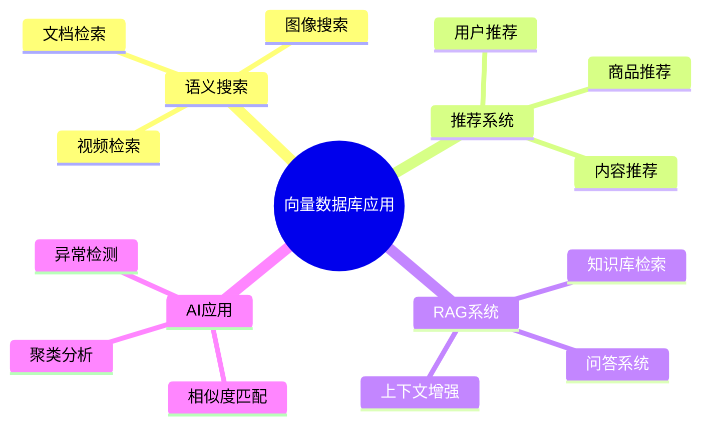
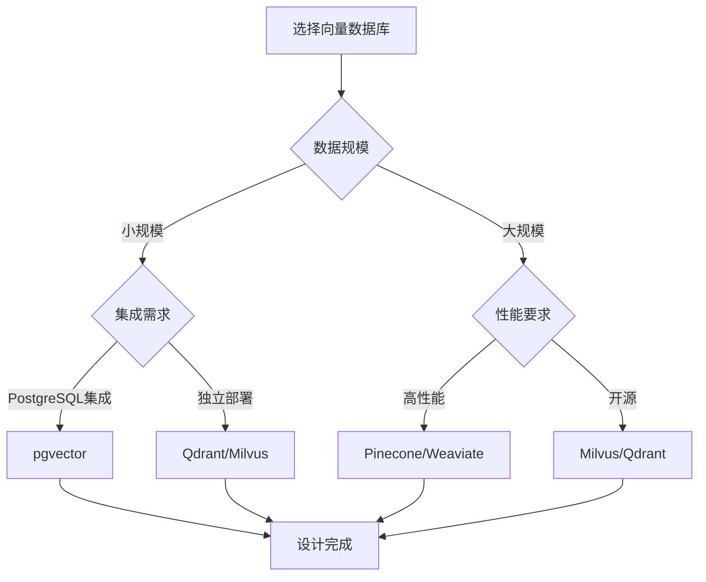
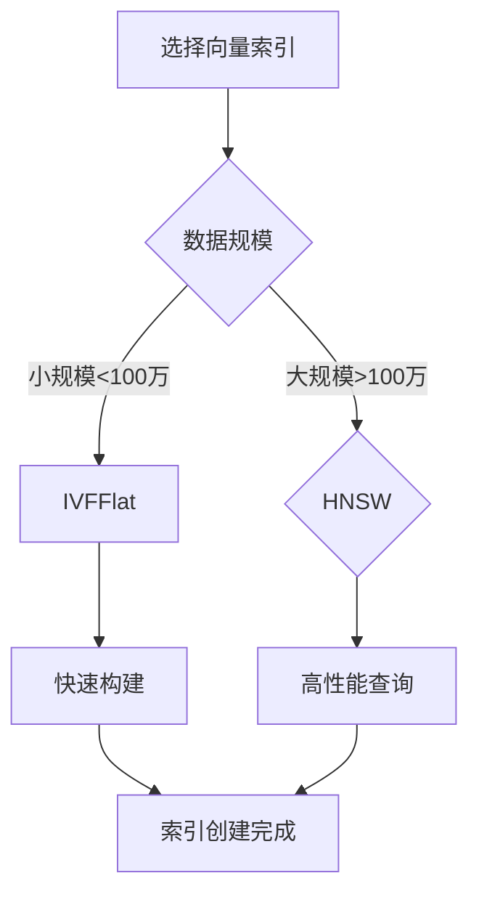
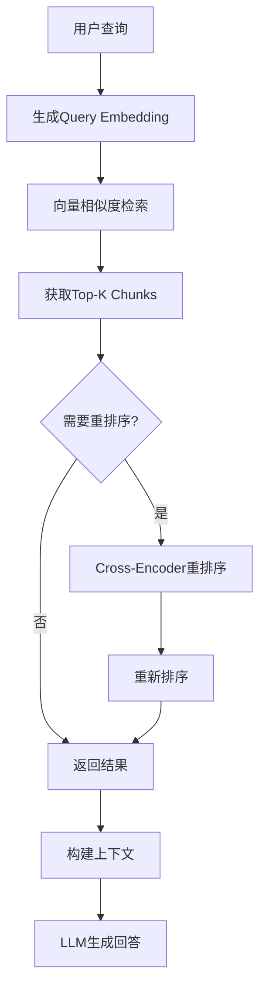

# 向量数据库设计：Embedding存储与相似度检索

> **创建日期**：2025-01-15
> **最后更新**：2025-01-15
> **版本**：v1.0
> **状态**：实施中

---

## 📋 目录

- [向量数据库设计：Embedding存储与相似度检索](#向量数据库设计embedding存储与相似度检索)
  - [📋 目录](#-目录)
  - [1. 概述](#1-概述)
    - [1.1. 向量数据库应用场景](#11-向量数据库应用场景)
    - [1.2. 向量数据库选择决策树](#12-向量数据库选择决策树)
  - [2. 向量数据库基础](#2-向量数据库基础)
    - [2.1. 向量Embedding基础](#21-向量embedding基础)
    - [2.2. 相似度度量](#22-相似度度量)
  - [3. 向量索引设计](#3-向量索引设计)
    - [3.1. HNSW索引（PostgreSQL pgvector）](#31-hnsw索引postgresql-pgvector)
    - [3.2. IVFFlat索引](#32-ivfflat索引)
    - [3.3. 索引性能对比](#33-索引性能对比)
  - [4. 混合检索设计](#4-混合检索设计)
    - [4.1. 向量+关键词混合检索](#41-向量关键词混合检索)
    - [4.2. RRF（Reciprocal Rank Fusion）融合](#42-rrfreciprocal-rank-fusion融合)
  - [5. RAG系统设计](#5-rag系统设计)
    - [5.1. RAG知识库Schema设计](#51-rag知识库schema设计)
    - [5.2. RAG检索流程](#52-rag检索流程)
    - [5.3. 上下文窗口构建](#53-上下文窗口构建)
  - [6. 向量数据库Schema设计](#6-向量数据库schema设计)
    - [6.1. 多模态向量存储](#61-多模态向量存储)
    - [6.2. 向量版本管理](#62-向量版本管理)
  - [7. 性能优化](#7-性能优化)
    - [7.1. 索引参数调优](#71-索引参数调优)
    - [7.2. 批量插入优化](#72-批量插入优化)
    - [7.3. 向量压缩](#73-向量压缩)
  - [8. 参考资料](#8-参考资料)

---

## 1. 概述

向量数据库是AI时代的关键基础设施，用于存储和检索高维向量（Embedding），支持语义搜索、推荐系统、RAG等应用。

### 1.1. 向量数据库应用场景



### 1.2. 向量数据库选择决策树



---

## 2. 向量数据库基础

### 2.1. 向量Embedding基础

**向量Embedding定义**：

```text
给定文档集合 D = {d₁, d₂, ..., dₙ}，
Embedding函数 f: D → ℝᵈ 将文档映射到d维向量空间。

性质：
1. 语义相似性：相似文档的向量距离近
2. 维度固定：所有向量维度相同
3. 归一化：通常L2归一化，||v|| = 1
```

**常见Embedding模型**：

| 模型 | 维度 | 特点 | 适用场景 |
|------|------|------|---------|
| **OpenAI text-embedding-ada-002** | 1536 | 通用文本 | 文档检索、语义搜索 |
| **sentence-transformers** | 384-768 | 多语言支持 | 多语言检索 |
| **BGE (BAAI)** | 768-1024 | 中文优化 | 中文语义搜索 |
| **Cohere embed** | 1024 | 长文本优化 | 长文档检索 |
| **Image Embeddings** | 512-2048 | 图像特征 | 图像搜索 |

### 2.2. 相似度度量

**余弦相似度**（最常用）：

```sql
-- PostgreSQL pgvector
SELECT
    id,
    content,
    1 - (embedding <=> query_embedding) AS cosine_similarity
FROM documents
ORDER BY embedding <=> query_embedding
LIMIT 10;
```

**欧氏距离**：

```sql
SELECT
    id,
    content,
    embedding <-> query_embedding AS euclidean_distance
FROM documents
ORDER BY embedding <-> query_embedding
LIMIT 10;
```

**点积**（归一化向量）：

```sql
SELECT
    id,
    content,
    embedding <#> query_embedding AS negative_dot_product
FROM documents
ORDER BY embedding <#> query_embedding
LIMIT 10;
```

---

## 3. 向量索引设计

### 3.1. HNSW索引（PostgreSQL pgvector）

**HNSW（Hierarchical Navigable Small World）**：多层图索引结构。

```sql
-- 创建向量表
CREATE TABLE document_embeddings (
    id BIGSERIAL PRIMARY KEY,
    document_id BIGINT NOT NULL,
    content TEXT NOT NULL,
    embedding vector(1536) NOT NULL,  -- OpenAI ada-002维度
    metadata JSONB,
    created_at TIMESTAMP DEFAULT CURRENT_TIMESTAMP
);

-- 创建HNSW索引
CREATE INDEX idx_document_embeddings_hnsw
ON document_embeddings
USING hnsw (embedding vector_cosine_ops)
WITH (m = 16, ef_construction = 64);

-- 查询参数说明：
-- m: 每个节点的最大连接数（默认16）
-- ef_construction: 构建时的搜索宽度（默认64）
-- ef_search: 查询时的搜索宽度（默认40，查询时设置）
```

**索引选择决策树**：



### 3.2. IVFFlat索引

**IVFFlat（Inverted File Index）**：基于聚类的索引。

```sql
-- 创建IVFFlat索引
CREATE INDEX idx_document_embeddings_ivfflat
ON document_embeddings
USING ivfflat (embedding vector_cosine_ops)
WITH (lists = 100);

-- lists参数：聚类中心数量
-- 建议：lists = rows / 1000（至少100）
```

### 3.3. 索引性能对比

| 索引类型 | 构建速度 | 查询速度 | 内存占用 | 适用场景 |
|---------|---------|---------|---------|---------|
| **HNSW** | 慢 | 快 | 高 | 查询频繁，数据量大 |
| **IVFFlat** | 快 | 中 | 低 | 数据量大，查询较少 |
| **无索引** | - | 慢 | 低 | 小数据集 |

---

## 4. 混合检索设计

### 4.1. 向量+关键词混合检索

**PostgreSQL实现**：

```sql
-- 创建混合检索表
CREATE TABLE hybrid_search_documents (
    id BIGSERIAL PRIMARY KEY,
    document_id BIGINT NOT NULL,
    title VARCHAR(500) NOT NULL,
    content TEXT NOT NULL,
    embedding vector(1536) NOT NULL,
    keywords TEXT[],  -- 关键词数组
    category VARCHAR(50),
    created_at TIMESTAMP DEFAULT CURRENT_TIMESTAMP
);

-- 全文搜索索引
CREATE INDEX idx_hybrid_search_fts
ON hybrid_search_documents
USING GIN (to_tsvector('english', title || ' ' || content));

-- 向量索引
CREATE INDEX idx_hybrid_search_vector
ON hybrid_search_documents
USING hnsw (embedding vector_cosine_ops);

-- 混合检索查询
WITH vector_results AS (
    SELECT
        id,
        document_id,
        title,
        content,
        1 - (embedding <=> $1::vector) AS vector_score
    FROM hybrid_search_documents
    ORDER BY embedding <=> $1::vector
    LIMIT 50
),
keyword_results AS (
    SELECT
        id,
        document_id,
        title,
        content,
        ts_rank(to_tsvector('english', title || ' ' || content),
                plainto_tsquery('english', $2)) AS keyword_score
    FROM hybrid_search_documents
    WHERE to_tsvector('english', title || ' ' || content)
          @@ plainto_tsquery('english', $2)
    ORDER BY keyword_score DESC
    LIMIT 50
),
combined_results AS (
    SELECT
        COALESCE(v.id, k.id) AS id,
        COALESCE(v.document_id, k.document_id) AS document_id,
        COALESCE(v.title, k.title) AS title,
        COALESCE(v.content, k.content) AS content,
        COALESCE(v.vector_score, 0) * 0.6 +
        COALESCE(k.keyword_score, 0) * 0.4 AS combined_score
    FROM vector_results v
    FULL OUTER JOIN keyword_results k ON v.id = k.id
)
SELECT
    id,
    document_id,
    title,
    LEFT(content, 200) AS content_preview,
    combined_score
FROM combined_results
ORDER BY combined_score DESC
LIMIT 10;
```

### 4.2. RRF（Reciprocal Rank Fusion）融合

**RRF算法**：

```sql
-- RRF融合函数
CREATE OR REPLACE FUNCTION rrf_fusion(
    vector_rank INTEGER,
    keyword_rank INTEGER,
    k INTEGER DEFAULT 60
)
RETURNS DECIMAL AS $$
BEGIN
    RETURN
        COALESCE(1.0 / (k + vector_rank), 0) +
        COALESCE(1.0 / (k + keyword_rank), 0);
END;
$$ LANGUAGE plpgsql;

-- 使用RRF的混合检索
WITH vector_ranked AS (
    SELECT
        id,
        ROW_NUMBER() OVER (ORDER BY embedding <=> $1::vector) AS rank
    FROM hybrid_search_documents
),
keyword_ranked AS (
    SELECT
        id,
        ROW_NUMBER() OVER (
            ORDER BY ts_rank(to_tsvector('english', title || ' ' || content),
                            plainto_tsquery('english', $2)) DESC
        ) AS rank
    FROM hybrid_search_documents
    WHERE to_tsvector('english', title || ' ' || content)
          @@ plainto_tsquery('english', $2)
)
SELECT
    h.id,
    h.title,
    h.content,
    rrf_fusion(v.rank, k.rank) AS rrf_score
FROM hybrid_search_documents h
LEFT JOIN vector_ranked v ON h.id = v.id
LEFT JOIN keyword_ranked k ON h.id = k.id
WHERE v.rank IS NOT NULL OR k.rank IS NOT NULL
ORDER BY rrf_score DESC
LIMIT 10;
```

---

## 5. RAG系统设计

### 5.1. RAG知识库Schema设计

**完整RAG系统Schema**：

```sql
CREATE SCHEMA rag_system;

-- 文档源表
CREATE TABLE rag_system.document_sources (
    source_id BIGSERIAL PRIMARY KEY,
    source_name VARCHAR(200) NOT NULL,
    source_type VARCHAR(50) NOT NULL,  -- file, url, database
    source_path TEXT,
    metadata JSONB,
    created_at TIMESTAMP DEFAULT CURRENT_TIMESTAMP
);

-- 文档表
CREATE TABLE rag_system.documents (
    document_id BIGSERIAL PRIMARY KEY,
    source_id BIGINT REFERENCES rag_system.document_sources(source_id),
    title VARCHAR(500),
    content TEXT NOT NULL,
    content_hash VARCHAR(64) UNIQUE,  -- 内容去重
    document_type VARCHAR(50),  -- pdf, markdown, html
    metadata JSONB,
    created_at TIMESTAMP DEFAULT CURRENT_TIMESTAMP,
    updated_at TIMESTAMP DEFAULT CURRENT_TIMESTAMP
);

CREATE INDEX idx_documents_source ON rag_system.documents(source_id);
CREATE INDEX idx_documents_hash ON rag_system.documents(content_hash);

-- 文档块表（Chunking）
CREATE TABLE rag_system.document_chunks (
    chunk_id BIGSERIAL PRIMARY KEY,
    document_id BIGINT NOT NULL REFERENCES rag_system.documents(document_id) ON DELETE CASCADE,
    chunk_index INTEGER NOT NULL,
    content TEXT NOT NULL,
    content_length INTEGER NOT NULL,
    embedding vector(1536),  -- OpenAI ada-002
    metadata JSONB,  -- 包含位置信息、上下文等
    created_at TIMESTAMP DEFAULT CURRENT_TIMESTAMP,
    UNIQUE(document_id, chunk_index)
);

-- 向量索引
CREATE INDEX idx_chunks_embedding_hnsw
ON rag_system.document_chunks
USING hnsw (embedding vector_cosine_ops)
WITH (m = 16, ef_construction = 64);

CREATE INDEX idx_chunks_document ON rag_system.document_chunks(document_id, chunk_index);

-- 查询历史表
CREATE TABLE rag_system.query_history (
    query_id BIGSERIAL PRIMARY KEY,
    query_text TEXT NOT NULL,
    query_embedding vector(1536),
    retrieved_chunks INTEGER[],
    response_text TEXT,
    metadata JSONB,
    created_at TIMESTAMP DEFAULT CURRENT_TIMESTAMP
);

CREATE INDEX idx_query_history_created ON rag_system.query_history(created_at DESC);

-- 查询-文档关联表（用于反馈学习）
CREATE TABLE rag_system.query_chunk_relevance (
    relevance_id BIGSERIAL PRIMARY KEY,
    query_id BIGINT REFERENCES rag_system.query_history(query_id),
    chunk_id BIGINT REFERENCES rag_system.document_chunks(chunk_id),
    relevance_score DECIMAL(3,2) CHECK (relevance_score >= 0 AND relevance_score <= 1),
    feedback_type VARCHAR(20),  -- positive, negative, neutral
    created_at TIMESTAMP DEFAULT CURRENT_TIMESTAMP,
    UNIQUE(query_id, chunk_id)
);

CREATE INDEX idx_relevance_query ON rag_system.query_chunk_relevance(query_id);
CREATE INDEX idx_relevance_chunk ON rag_system.query_chunk_relevance(chunk_id);
```

### 5.2. RAG检索流程

**检索流程决策树**：



**RAG检索实现**：

```sql
-- RAG检索函数
CREATE OR REPLACE FUNCTION rag_retrieve(
    p_query_embedding vector(1536),
    p_query_text TEXT,
    p_top_k INTEGER DEFAULT 10,
    p_similarity_threshold DECIMAL DEFAULT 0.7
)
RETURNS TABLE (
    chunk_id BIGINT,
    document_id BIGINT,
    content TEXT,
    similarity DECIMAL,
    metadata JSONB
) AS $$
BEGIN
    RETURN QUERY
    SELECT
        c.chunk_id,
        c.document_id,
        c.content,
        1 - (c.embedding <=> p_query_embedding) AS similarity,
        c.metadata
    FROM rag_system.document_chunks c
    WHERE c.embedding IS NOT NULL
      AND 1 - (c.embedding <=> p_query_embedding) >= p_similarity_threshold
    ORDER BY c.embedding <=> p_query_embedding
    LIMIT p_top_k;
END;
$$ LANGUAGE plpgsql;

-- 使用示例
SELECT * FROM rag_retrieve(
    (SELECT embedding FROM rag_system.query_history WHERE query_id = 1),
    'What is machine learning?',
    10,
    0.7
);
```

### 5.3. 上下文窗口构建

**上下文构建函数**：

```sql
-- 构建上下文窗口（包含相邻chunks）
CREATE OR REPLACE FUNCTION build_context_window(
    p_chunk_ids BIGINT[],
    p_context_size INTEGER DEFAULT 2
)
RETURNS TABLE (
    chunk_id BIGINT,
    document_id BIGINT,
    chunk_index INTEGER,
    content TEXT,
    is_retrieved BOOLEAN
) AS $$
BEGIN
    RETURN QUERY
    WITH retrieved_chunks AS (
        SELECT
            chunk_id,
            document_id,
            chunk_index
        FROM rag_system.document_chunks
        WHERE chunk_id = ANY(p_chunk_ids)
    ),
    context_chunks AS (
        SELECT DISTINCT
            c.chunk_id,
            c.document_id,
            c.chunk_index,
            c.content,
            (c.chunk_id = ANY(p_chunk_ids)) AS is_retrieved
        FROM rag_system.document_chunks c
        JOIN retrieved_chunks r ON c.document_id = r.document_id
        WHERE c.chunk_index BETWEEN
            r.chunk_index - p_context_size AND
            r.chunk_index + p_context_size
    )
    SELECT
        chunk_id,
        document_id,
        chunk_index,
        content,
        is_retrieved
    FROM context_chunks
    ORDER BY document_id, chunk_index;
END;
$$ LANGUAGE plpgsql;
```

---

## 6. 向量数据库Schema设计

### 6.1. 多模态向量存储

**支持文本、图像、音频等多种模态**：

```sql
CREATE SCHEMA multimodal_vectors;

-- 多模态向量表
CREATE TABLE multimodal_vectors.embeddings (
    embedding_id BIGSERIAL PRIMARY KEY,
    entity_id BIGINT NOT NULL,
    entity_type VARCHAR(50) NOT NULL,  -- text, image, audio, video
    modality VARCHAR(50) NOT NULL,  -- text_embedding, image_embedding, etc.
    embedding vector(1536) NOT NULL,
    model_name VARCHAR(100) NOT NULL,  -- 使用的模型名称
    original_content TEXT,  -- 原始内容（文本）或路径（媒体）
    metadata JSONB,
    created_at TIMESTAMP DEFAULT CURRENT_TIMESTAMP
);

-- 多模态索引
CREATE INDEX idx_multimodal_embeddings_vector
ON multimodal_vectors.embeddings
USING hnsw (embedding vector_cosine_ops);

CREATE INDEX idx_multimodal_embeddings_entity
ON multimodal_vectors.embeddings(entity_type, entity_id);

-- 跨模态检索
CREATE OR REPLACE FUNCTION cross_modal_search(
    p_query_embedding vector(1536),
    p_target_modality VARCHAR(50),
    p_top_k INTEGER DEFAULT 10
)
RETURNS TABLE (
    embedding_id BIGINT,
    entity_id BIGINT,
    entity_type VARCHAR(50),
    modality VARCHAR(50),
    similarity DECIMAL,
    original_content TEXT
) AS $$
BEGIN
    RETURN QUERY
    SELECT
        e.embedding_id,
        e.entity_id,
        e.entity_type,
        e.modality,
        1 - (e.embedding <=> p_query_embedding) AS similarity,
        e.original_content
    FROM multimodal_vectors.embeddings e
    WHERE e.modality = p_target_modality
    ORDER BY e.embedding <=> p_query_embedding
    LIMIT p_top_k;
END;
$$ LANGUAGE plpgsql;
```

### 6.2. 向量版本管理

**支持Embedding模型版本管理**：

```sql
CREATE SCHEMA vector_versions;

-- 向量版本表
CREATE TABLE vector_versions.embedding_versions (
    version_id BIGSERIAL PRIMARY KEY,
    entity_id BIGINT NOT NULL,
    model_name VARCHAR(100) NOT NULL,
    model_version VARCHAR(50) NOT NULL,
    embedding_dimension INTEGER NOT NULL,
    embedding vector NOT NULL,  -- 动态维度
    is_current BOOLEAN DEFAULT TRUE,
    created_at TIMESTAMP DEFAULT CURRENT_TIMESTAMP,
    UNIQUE(entity_id, model_name, model_version)
);

-- 版本切换
CREATE OR REPLACE FUNCTION switch_embedding_version(
    p_entity_id BIGINT,
    p_model_name VARCHAR(100),
    p_target_version VARCHAR(50)
)
RETURNS VOID AS $$
BEGIN
    -- 标记旧版本为非当前
    UPDATE vector_versions.embedding_versions
    SET is_current = FALSE
    WHERE entity_id = p_entity_id
      AND model_name = p_model_name
      AND is_current = TRUE;

    -- 标记新版本为当前
    UPDATE vector_versions.embedding_versions
    SET is_current = TRUE
    WHERE entity_id = p_entity_id
      AND model_name = p_model_name
      AND model_version = p_target_version;
END;
$$ LANGUAGE plpgsql;
```

---

## 7. 性能优化

### 7.1. 索引参数调优

**HNSW参数优化**：

```sql
-- 查询性能优化
SET hnsw.ef_search = 100;  -- 增加搜索宽度，提高召回率

-- 针对不同场景的参数
-- 高召回率场景
CREATE INDEX idx_high_recall
ON document_embeddings
USING hnsw (embedding vector_cosine_ops)
WITH (m = 32, ef_construction = 200);

-- 快速查询场景
CREATE INDEX idx_fast_query
ON document_embeddings
USING hnsw (embedding vector_cosine_ops)
WITH (m = 16, ef_construction = 64);
```

### 7.2. 批量插入优化

**批量插入向量**：

```sql
-- 批量插入函数
CREATE OR REPLACE FUNCTION batch_insert_embeddings(
    p_embeddings vector(1536)[],
    p_contents TEXT[],
    p_metadata JSONB[]
)
RETURNS INTEGER AS $$
DECLARE
    v_count INTEGER;
BEGIN
    INSERT INTO rag_system.document_chunks (content, embedding, metadata)
    SELECT
        unnest(p_contents),
        unnest(p_embeddings),
        unnest(p_metadata);

    GET DIAGNOSTICS v_count = ROW_COUNT;
    RETURN v_count;
END;
$$ LANGUAGE plpgsql;

-- 使用示例
SELECT batch_insert_embeddings(
    ARRAY[
        '[0.1, 0.2, ...]'::vector(1536),
        '[0.3, 0.4, ...]'::vector(1536)
    ],
    ARRAY['Content 1', 'Content 2'],
    ARRAY['{"source": "doc1"}'::jsonb, '{"source": "doc2"}'::jsonb]
);
```

### 7.3. 向量压缩

**量化压缩存储**：

```sql
-- 向量压缩表（存储量化后的向量）
CREATE TABLE document_embeddings_compressed (
    id BIGSERIAL PRIMARY KEY,
    document_id BIGINT NOT NULL,
    embedding_quantized BYTEA,  -- 量化后的向量
    embedding_original vector(1536),  -- 原始向量（可选）
    quantization_bits INTEGER DEFAULT 8,  -- 量化位数
    scale_factor DECIMAL,
    created_at TIMESTAMP DEFAULT CURRENT_TIMESTAMP
);

-- 量化函数（简化示例）
CREATE OR REPLACE FUNCTION quantize_vector(
    p_vector vector(1536),
    p_bits INTEGER DEFAULT 8
)
RETURNS BYTEA AS $$
DECLARE
    v_min DECIMAL;
    v_max DECIMAL;
    v_scale DECIMAL;
    v_quantized BYTEA;
BEGIN
    -- 计算缩放因子
    SELECT MIN(unnest), MAX(unnest) INTO v_min, v_max
    FROM unnest(p_vector::DECIMAL[]);

    v_scale := POWER(2, p_bits) / (v_max - v_min);

    -- 量化（简化实现）
    -- 实际实现需要更复杂的编码

    RETURN v_quantized;
END;
$$ LANGUAGE plpgsql;
```

---

## 8. 参考资料

- [PostgreSQL向量支持](../../PostgreSQL/03-高级特性/03.05-向量数据库支持.md)
- [RAG系统设计](../../PostgreSQL/09-应用设计/行业案例/向量检索与RAG.md)
- [知识图谱理论](../01-理论模型/01.04-知识图谱理论.md)

---

**最后更新**：2025-01-15
**维护者**：Data-Science Team
**状态**：实施中
