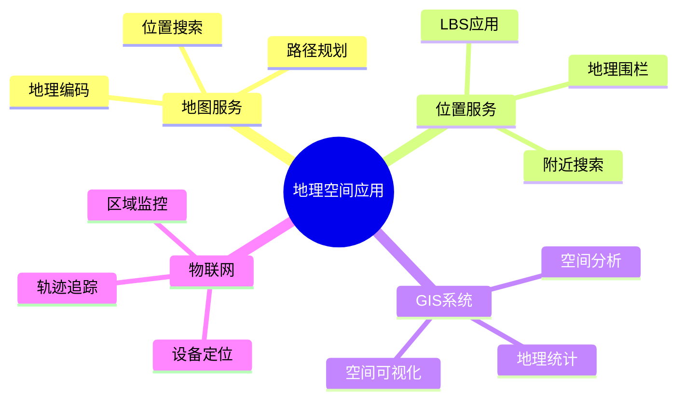
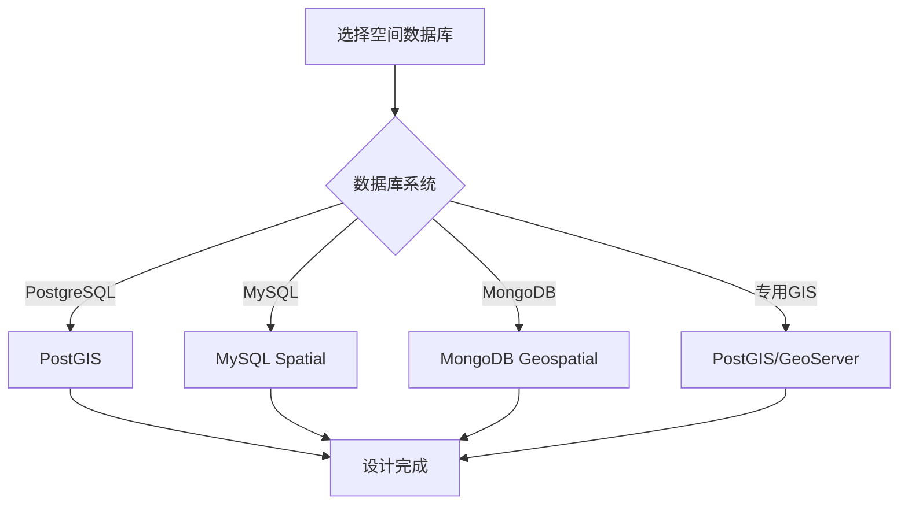
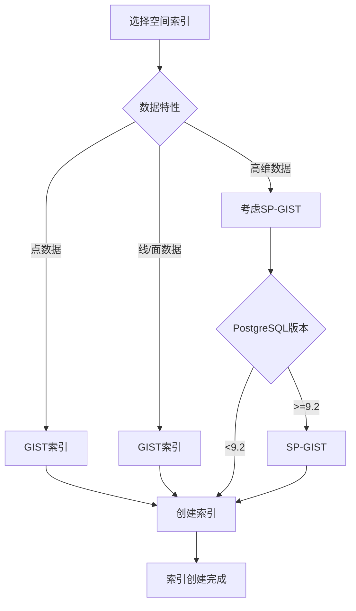
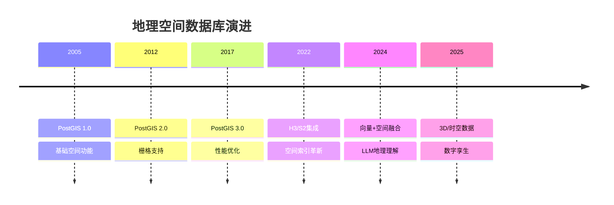

# 地理空间数据库设计：PostGIS与空间数据建模

> **创建日期**：2025-01-15
> **最后更新**：2025-12-01
> **版本**：v2.0 (增强版)
> **状态**：已完成 ✅

---

## 📋 目录

- [地理空间数据库设计：PostGIS与空间数据建模](#地理空间数据库设计postgis与空间数据建模)
  - [📋 目录](#-目录)
  - [1. 概述](#1-概述)
    - [1.1. 地理空间应用场景](#11-地理空间应用场景)
    - [1.2. 空间数据库选择决策树](#12-空间数据库选择决策树)
  - [2. 地理空间数据类型](#2-地理空间数据类型)
    - [2.1. PostGIS几何类型](#21-postgis几何类型)
    - [2.2. 地理坐标系统](#22-地理坐标系统)
  - [3. 空间索引设计](#3-空间索引设计)
    - [3.1. GIST索引](#31-gist索引)
    - [3.2. 空间索引选择决策树](#32-空间索引选择决策树)
    - [3.3. 索引维护](#33-索引维护)
  - [4. 空间查询设计](#4-空间查询设计)
    - [4.1. 附近搜索（KNN查询）](#41-附近搜索knn查询)
    - [4.2. 范围查询](#42-范围查询)
    - [4.3. 空间关系查询](#43-空间关系查询)
    - [4.4. 空间聚合查询](#44-空间聚合查询)
  - [5. 地理空间应用案例](#5-地理空间应用案例)
    - [5.1. 位置服务（LBS）Schema设计](#51-位置服务lbsschema设计)
    - [5.2. 路径规划Schema设计](#52-路径规划schema设计)
    - [5.3. 地理编码系统](#53-地理编码系统)
  - [6. 性能优化](#6-性能优化)
    - [6.1. 空间索引优化](#61-空间索引优化)
    - [6.2. 空间查询优化](#62-空间查询优化)
    - [6.3. 空间数据分区](#63-空间数据分区)
  - [7. 2024-2025最新趋势](#7-2024-2025最新趋势)
    - [7.1. 地理空间技术演进](#71-地理空间技术演进)
    - [7.2. 空间数据库选型矩阵](#72-空间数据库选型矩阵)
    - [7.3. H3六边形空间索引](#73-h3六边形空间索引)
    - [7.4. 空间+向量融合](#74-空间向量融合)
  - [8. 参考资料](#8-参考资料)
    - [8.1. 权威文献](#81-权威文献)
    - [8.2. 在线资源](#82-在线资源)
    - [8.3. 相关文档](#83-相关文档)

---

## 1. 概述

地理空间数据库用于存储和查询地理位置数据，支持地图应用、位置服务、GIS系统等。

### 1.1. 地理空间应用场景



### 1.2. 空间数据库选择决策树



---

## 2. 地理空间数据类型

### 2.1. PostGIS几何类型

**基本几何类型**：

```sql
-- 启用PostGIS扩展
CREATE EXTENSION IF NOT EXISTS postgis;
CREATE EXTENSION IF NOT EXISTS postgis_topology;

-- 点（Point）
CREATE TABLE locations (
    id BIGSERIAL PRIMARY KEY,
    name VARCHAR(200) NOT NULL,
    location GEOMETRY(POINT, 4326) NOT NULL,  -- WGS84坐标系
    address TEXT,
    created_at TIMESTAMP DEFAULT CURRENT_TIMESTAMP
);

-- 线（LineString）
CREATE TABLE routes (
    id BIGSERIAL PRIMARY KEY,
    route_name VARCHAR(200) NOT NULL,
    path GEOMETRY(LINESTRING, 4326) NOT NULL,
    distance_meters DECIMAL(10,2),
    created_at TIMESTAMP DEFAULT CURRENT_TIMESTAMP
);

-- 多边形（Polygon）
CREATE TABLE regions (
    id BIGSERIAL PRIMARY KEY,
    region_name VARCHAR(200) NOT NULL,
    boundary GEOMETRY(POLYGON, 4326) NOT NULL,
    area_sqkm DECIMAL(12,2),
    created_at TIMESTAMP DEFAULT CURRENT_TIMESTAMP
);

-- 多点（MultiPoint）
CREATE TABLE clusters (
    id BIGSERIAL PRIMARY KEY,
    cluster_name VARCHAR(200),
    points GEOMETRY(MULTIPOINT, 4326) NOT NULL
);

-- 多线（MultiLineString）
CREATE TABLE road_networks (
    id BIGSERIAL PRIMARY KEY,
    network_name VARCHAR(200),
    roads GEOMETRY(MULTILINESTRING, 4326) NOT NULL
);

-- 多多边形（MultiPolygon）
CREATE TABLE countries (
    id BIGSERIAL PRIMARY KEY,
    country_name VARCHAR(100) NOT NULL,
    territory GEOMETRY(MULTIPOLYGON, 4326) NOT NULL,
    area_sqkm DECIMAL(15,2)
);
```

### 2.2. 地理坐标系统

**常用坐标系**：

| 坐标系 | EPSG代码 | 用途 | 范围 |
|--------|---------|------|------|
| **WGS84** | 4326 | 全球定位 | 全球 |
| **Web Mercator** | 3857 | Web地图 | 全球 |
| **GCJ-02** | - | 中国加密 | 中国 |
| **BD-09** | - | 百度坐标 | 中国 |

**坐标系转换**：

```sql
-- 创建不同坐标系的数据
CREATE TABLE locations_wgs84 (
    id BIGSERIAL PRIMARY KEY,
    name VARCHAR(200),
    location GEOMETRY(POINT, 4326)  -- WGS84
);

CREATE TABLE locations_mercator (
    id BIGSERIAL PRIMARY KEY,
    name VARCHAR(200),
    location GEOMETRY(POINT, 3857)  -- Web Mercator
);

-- 坐标系转换
INSERT INTO locations_mercator (name, location)
SELECT
    name,
    ST_Transform(location, 3857)  -- 转换为Web Mercator
FROM locations_wgs84;
```

---

## 3. 空间索引设计

### 3.1. GIST索引

**GIST（Generalized Search Tree）索引**：PostGIS的标准空间索引。

```sql
-- 创建GIST空间索引
CREATE INDEX idx_locations_location_gist
ON locations
USING GIST (location);

-- 复合索引（空间+属性）
CREATE INDEX idx_locations_location_name_gist
ON locations
USING GIST (location, name);

-- 覆盖索引（包含常用列）
CREATE INDEX idx_locations_covering
ON locations
USING GIST (location)
INCLUDE (name, address);
```

### 3.2. 空间索引选择决策树



### 3.3. 索引维护

**空间索引统计信息**：

```sql
-- 更新空间索引统计
ANALYZE locations;

-- 查看索引使用情况
SELECT
    schemaname,
    tablename,
    indexname,
    idx_scan,
    idx_tup_read,
    idx_tup_fetch
FROM pg_stat_user_indexes
WHERE schemaname = 'public'
  AND tablename = 'locations';
```

---

## 4. 空间查询设计

### 4.1. 附近搜索（KNN查询）

**查找最近的N个点**：

```sql
-- 查找距离指定点最近的10个位置
SELECT
    id,
    name,
    address,
    ST_Distance(
        location,
        ST_SetSRID(ST_MakePoint(116.3974, 39.9093), 4326)::geography
    ) AS distance_meters
FROM locations
ORDER BY location <-> ST_SetSRID(ST_MakePoint(116.3974, 39.9093), 4326)
LIMIT 10;

-- 使用地理类型（自动计算球面距离）
ALTER TABLE locations
ADD COLUMN location_geog GEOGRAPHY(POINT, 4326);

UPDATE locations
SET location_geog = location::geography;

-- 地理类型KNN查询（更准确）
SELECT
    id,
    name,
    ST_Distance(
        location_geog,
        ST_SetSRID(ST_MakePoint(116.3974, 39.9093), 4326)::geography
    ) AS distance_meters
FROM locations
ORDER BY location_geog <-> ST_SetSRID(ST_MakePoint(116.3974, 39.9093), 4326)::geography
LIMIT 10;
```

### 4.2. 范围查询

**查找指定范围内的点**：

```sql
-- 查找圆形范围内的点（半径1公里）
SELECT
    id,
    name,
    address,
    ST_Distance(
        location_geog,
        ST_SetSRID(ST_MakePoint(116.3974, 39.9093), 4326)::geography
    ) AS distance_meters
FROM locations
WHERE ST_DWithin(
    location_geog,
    ST_SetSRID(ST_MakePoint(116.3974, 39.9093), 4326)::geography,
    1000  -- 1000米
);

-- 查找矩形范围内的点
SELECT
    id,
    name,
    address
FROM locations
WHERE ST_Within(
    location,
    ST_MakeEnvelope(
        116.3, 39.8,  -- 左下角
        116.5, 40.0,  -- 右上角
        4326
    )
);

-- 查找多边形范围内的点
SELECT
    id,
    name,
    address
FROM locations
WHERE ST_Within(
    location,
    ST_GeomFromText(
        'POLYGON((116.3 39.8, 116.5 39.8, 116.5 40.0, 116.3 40.0, 116.3 39.8))',
        4326
    )
);
```

### 4.3. 空间关系查询

**空间关系判断**：

```sql
-- 判断点是否在多边形内
SELECT
    l.id,
    l.name,
    r.region_name
FROM locations l
JOIN regions r ON ST_Within(l.location, r.boundary);

-- 判断线是否与多边形相交
SELECT
    r.id,
    r.route_name,
    reg.region_name
FROM routes r
JOIN regions reg ON ST_Intersects(r.path, reg.boundary);

-- 计算两个几何体的距离
SELECT
    ST_Distance(
        ST_SetSRID(ST_MakePoint(116.3974, 39.9093), 4326)::geography,
        location_geog
    ) AS distance_meters
FROM locations
WHERE id = 1;

-- 计算缓冲区
SELECT
    id,
    name,
    ST_Buffer(location_geog, 500) AS buffer_500m  -- 500米缓冲区
FROM locations
WHERE id = 1;
```

### 4.4. 空间聚合查询

**空间统计**：

```sql
-- 计算区域内的点数量
SELECT
    r.region_name,
    COUNT(l.id) AS location_count,
    ST_Area(r.boundary::geography) / 1000000 AS area_sqkm
FROM regions r
LEFT JOIN locations l ON ST_Within(l.location, r.boundary)
GROUP BY r.id, r.region_name, r.boundary;

-- 计算点的凸包（Convex Hull）
SELECT
    ST_ConvexHull(ST_Collect(location)) AS convex_hull
FROM locations;

-- 计算点的中心点
SELECT
    ST_Centroid(ST_Collect(location)) AS center_point
FROM locations;

-- 计算最小边界矩形（MBR）
SELECT
    ST_Envelope(ST_Collect(location)) AS bounding_box
FROM locations;
```

---

## 5. 地理空间应用案例

### 5.1. 位置服务（LBS）Schema设计

**完整的LBS系统Schema**：

```sql
CREATE SCHEMA lbs_system;

-- 用户位置表
CREATE TABLE lbs_system.user_locations (
    location_id BIGSERIAL PRIMARY KEY,
    user_id BIGINT NOT NULL,
    location GEOGRAPHY(POINT, 4326) NOT NULL,
    accuracy DECIMAL(10,2),  -- 精度（米）
    altitude DECIMAL(10,2),  -- 海拔（米）
    speed DECIMAL(5,2),  -- 速度（m/s）
    heading DECIMAL(5,2),  -- 方向（度）
    location_time TIMESTAMP NOT NULL,
    created_at TIMESTAMP DEFAULT CURRENT_TIMESTAMP
) PARTITION BY RANGE (location_time);

-- 按月分区
CREATE TABLE lbs_system.user_locations_2024_01
PARTITION OF lbs_system.user_locations
FOR VALUES FROM ('2024-01-01') TO ('2024-02-01');

CREATE INDEX idx_user_locations_user ON lbs_system.user_locations(user_id, location_time DESC);
CREATE INDEX idx_user_locations_location_gist
ON lbs_system.user_locations USING GIST (location);

-- 地理围栏表
CREATE TABLE lbs_system.geofences (
    geofence_id BIGSERIAL PRIMARY KEY,
    geofence_name VARCHAR(200) NOT NULL,
    boundary GEOGRAPHY(POLYGON, 4326) NOT NULL,
    geofence_type VARCHAR(50),  -- circle, polygon, custom
    radius_meters DECIMAL(10,2),  -- 圆形围栏半径
    is_active BOOLEAN DEFAULT TRUE,
    created_at TIMESTAMP DEFAULT CURRENT_TIMESTAMP
);

CREATE INDEX idx_geofences_boundary_gist
ON lbs_system.geofences USING GIST (boundary);

-- 围栏事件表
CREATE TABLE lbs_system.geofence_events (
    event_id BIGSERIAL PRIMARY KEY,
    user_id BIGINT NOT NULL,
    geofence_id BIGINT REFERENCES lbs_system.geofences(geofence_id),
    event_type VARCHAR(20) NOT NULL,  -- ENTER, EXIT, INSIDE
    location GEOGRAPHY(POINT, 4326) NOT NULL,
    event_time TIMESTAMP NOT NULL,
    created_at TIMESTAMP DEFAULT CURRENT_TIMESTAMP
) PARTITION BY RANGE (event_time);

CREATE INDEX idx_geofence_events_user ON lbs_system.geofence_events(user_id, event_time DESC);

-- 围栏检测触发器
CREATE OR REPLACE FUNCTION check_geofence_events()
RETURNS TRIGGER AS $$
DECLARE
    v_geofence RECORD;
    v_previous_location GEOGRAPHY;
    v_was_inside BOOLEAN;
    v_is_inside BOOLEAN;
BEGIN
    -- 获取用户上一个位置
    SELECT location INTO v_previous_location
    FROM lbs_system.user_locations
    WHERE user_id = NEW.user_id
      AND location_time < NEW.location_time
    ORDER BY location_time DESC
    LIMIT 1;

    -- 检查所有活跃的围栏
    FOR v_geofence IN
        SELECT * FROM lbs_system.geofences WHERE is_active = TRUE
    LOOP
        -- 检查是否在围栏内
        v_is_inside := ST_Within(NEW.location::geometry, v_geofence.boundary::geometry);

        IF v_previous_location IS NOT NULL THEN
            v_was_inside := ST_Within(v_previous_location::geometry, v_geofence.boundary::geometry);
        ELSE
            v_was_inside := FALSE;
        END IF;

        -- 检测进入事件
        IF NOT v_was_inside AND v_is_inside THEN
            INSERT INTO lbs_system.geofence_events
            (user_id, geofence_id, event_type, location, event_time)
            VALUES (NEW.user_id, v_geofence.geofence_id, 'ENTER', NEW.location, NEW.location_time);
        END IF;

        -- 检测离开事件
        IF v_was_inside AND NOT v_is_inside THEN
            INSERT INTO lbs_system.geofence_events
            (user_id, geofence_id, event_type, location, event_time)
            VALUES (NEW.user_id, v_geofence.geofence_id, 'EXIT', NEW.location, NEW.location_time);
        END IF;
    END LOOP;

    RETURN NEW;
END;
$$ LANGUAGE plpgsql;

CREATE TRIGGER geofence_check_trigger
AFTER INSERT ON lbs_system.user_locations
FOR EACH ROW
EXECUTE FUNCTION check_geofence_events();
```

### 5.2. 路径规划Schema设计

**路径规划系统**：

```sql
CREATE SCHEMA routing_system;

-- 道路网络表
CREATE TABLE routing_system.road_network (
    road_id BIGSERIAL PRIMARY KEY,
    road_name VARCHAR(200),
    road_type VARCHAR(50),  -- highway, street, path
    geometry GEOGRAPHY(LINESTRING, 4326) NOT NULL,
    length_meters DECIMAL(10,2),
    max_speed_kmh INTEGER,
    one_way BOOLEAN DEFAULT FALSE,
    toll BOOLEAN DEFAULT FALSE,
    metadata JSONB,
    created_at TIMESTAMP DEFAULT CURRENT_TIMESTAMP
);

CREATE INDEX idx_road_network_geometry_gist
ON routing_system.road_network USING GIST (geometry);

-- 道路节点表（用于路径规划）
CREATE TABLE routing_system.road_nodes (
    node_id BIGSERIAL PRIMARY KEY,
    location GEOGRAPHY(POINT, 4326) NOT NULL,
    node_type VARCHAR(50),  -- intersection, endpoint
    metadata JSONB
);

CREATE INDEX idx_road_nodes_location_gist
ON routing_system.road_nodes USING GIST (location);

-- 路径规划结果表
CREATE TABLE routing_system.route_results (
    route_id BIGSERIAL PRIMARY KEY,
    start_point GEOGRAPHY(POINT, 4326) NOT NULL,
    end_point GEOGRAPHY(POINT, 4326) NOT NULL,
    route_path GEOGRAPHY(LINESTRING, 4326) NOT NULL,
    total_distance_meters DECIMAL(10,2) NOT NULL,
    estimated_time_seconds INTEGER,
    route_type VARCHAR(50),  -- fastest, shortest, scenic
    created_at TIMESTAMP DEFAULT CURRENT_TIMESTAMP
);

CREATE INDEX idx_route_results_path_gist
ON routing_system.route_results USING GIST (route_path);
```

### 5.3. 地理编码系统

**地址与坐标互转**：

```sql
CREATE SCHEMA geocoding;

-- 地理编码缓存表
CREATE TABLE geocoding.address_cache (
    cache_id BIGSERIAL PRIMARY KEY,
    address TEXT NOT NULL,
    normalized_address TEXT,
    location GEOGRAPHY(POINT, 4326),
    address_components JSONB,  -- {country, province, city, district, street}
    confidence_score DECIMAL(3,2),
    geocoding_service VARCHAR(50),  -- google, baidu, gaode
    created_at TIMESTAMP DEFAULT CURRENT_TIMESTAMP,
    updated_at TIMESTAMP DEFAULT CURRENT_TIMESTAMP,
    UNIQUE(address, geocoding_service)
);

CREATE INDEX idx_address_cache_location_gist
ON geocoding.address_cache USING GIST (location);
CREATE INDEX idx_address_cache_address ON geocoding.address_cache USING GIN (address gin_trgm_ops);

-- 反向地理编码缓存（坐标→地址）
CREATE TABLE geocoding.reverse_geocoding_cache (
    cache_id BIGSERIAL PRIMARY KEY,
    location GEOGRAPHY(POINT, 4326) NOT NULL,
    address TEXT,
    address_components JSONB,
    confidence_score DECIMAL(3,2),
    geocoding_service VARCHAR(50),
    created_at TIMESTAMP DEFAULT CURRENT_TIMESTAMP,
    UNIQUE(location, geocoding_service)
);

CREATE INDEX idx_reverse_geocoding_location_gist
ON geocoding.reverse_geocoding_cache USING GIST (location);
```

---

## 6. 性能优化

### 6.1. 空间索引优化

**索引参数调优**：

```sql
-- GIST索引参数
-- pages_per_range: 每个范围包含的页面数（默认128）
CREATE INDEX idx_locations_optimized
ON locations
USING GIST (location)
WITH (fillfactor = 90);  -- 预留10%空间用于更新

-- 部分索引（只索引活跃数据）
CREATE INDEX idx_locations_active_gist
ON locations
USING GIST (location)
WHERE status = 'active';
```

### 6.2. 空间查询优化

**查询优化技巧**：

```sql
-- 1. 使用空间索引提示
SET enable_seqscan = OFF;  -- 强制使用索引（仅测试用）

-- 2. 限制搜索范围
SELECT *
FROM locations
WHERE ST_DWithin(
    location_geog,
    ST_SetSRID(ST_MakePoint(116.3974, 39.9093), 4326)::geography,
    1000
)
AND ST_X(location::geometry) BETWEEN 116.3 AND 116.5  -- 快速过滤
AND ST_Y(location::geometry) BETWEEN 39.8 AND 40.0;

-- 3. 使用边界框预过滤
SELECT *
FROM locations
WHERE location && ST_MakeEnvelope(116.3, 39.8, 116.5, 40.0, 4326)  -- 快速边界框检查
  AND ST_DWithin(
      location_geog,
      ST_SetSRID(ST_MakePoint(116.3974, 39.9093), 4326)::geography,
      1000
  );
```

### 6.3. 空间数据分区

**按空间范围分区**：

```sql
-- 按地理区域分区
CREATE TABLE locations_china (
    id BIGSERIAL,
    name VARCHAR(200),
    location GEOGRAPHY(POINT, 4326),
    CONSTRAINT check_china_bounds CHECK (
        ST_X(location::geometry) BETWEEN 73 AND 135 AND
        ST_Y(location::geometry) BETWEEN 18 AND 54
    )
) PARTITION BY RANGE (ST_X(location::geometry));

-- 创建分区
CREATE TABLE locations_china_east
PARTITION OF locations_china
FOR VALUES FROM (100) TO (135);

CREATE TABLE locations_china_west
PARTITION OF locations_china
FOR VALUES FROM (73) TO (100);
```

---

## 7. 2024-2025最新趋势

### 7.1. 地理空间技术演进



### 7.2. 空间数据库选型矩阵

| 数据库 | 类型 | 3D支持 | 栅格 | 向量融合 | 适用场景 |
|-------|------|--------|------|---------|---------|
| **PostGIS** | PG扩展 | ✅ | ✅ | pgvector | 通用GIS |
| **H3-pg** | PG扩展 | ❌ | ❌ | ✅ | 六边形索引 |
| **MongoDB** | 原生 | ❌ | ❌ | ✅ | 简单地理 |
| **Elasticsearch** | 搜索 | ❌ | ❌ | ❌ | 地理搜索 |
| **BigQuery GIS** | 云原生 | ❌ | ✅ | ❌ | 大数据分析 |

### 7.3. H3六边形空间索引

```sql
-- 安装H3扩展
CREATE EXTENSION IF NOT EXISTS h3;

-- H3空间索引表
CREATE TABLE locations_h3 (
    id BIGSERIAL PRIMARY KEY,
    name VARCHAR(200),
    location GEOGRAPHY(POINT, 4326),
    h3_index_res9 h3index,  -- 分辨率9 (~175m边长)
    h3_index_res7 h3index   -- 分辨率7 (~1.2km边长)
);

-- 自动计算H3索引
CREATE OR REPLACE FUNCTION update_h3_index()
RETURNS TRIGGER AS $$
BEGIN
    NEW.h3_index_res9 := h3_lat_lng_to_cell(
        ST_Y(NEW.location::geometry),
        ST_X(NEW.location::geometry),
        9
    );
    NEW.h3_index_res7 := h3_lat_lng_to_cell(
        ST_Y(NEW.location::geometry),
        ST_X(NEW.location::geometry),
        7
    );
    RETURN NEW;
END;
$$ LANGUAGE plpgsql;

CREATE TRIGGER trg_h3_index
BEFORE INSERT OR UPDATE ON locations_h3
FOR EACH ROW EXECUTE FUNCTION update_h3_index();

-- H3邻域查询（比传统ST_DWithin更快）
SELECT *
FROM locations_h3
WHERE h3_index_res9 = ANY(
    h3_grid_disk(h3_lat_lng_to_cell(39.9, 116.4, 9), 2)
);
```

### 7.4. 空间+向量融合

```sql
-- 空间+语义混合检索
CREATE TABLE geo_pois (
    id UUID PRIMARY KEY DEFAULT gen_random_uuid(),
    name VARCHAR(200),
    description TEXT,
    location GEOGRAPHY(POINT, 4326),
    embedding vector(1536),  -- 语义向量
    categories TEXT[]
);

-- 混合空间语义搜索
CREATE OR REPLACE FUNCTION geo_semantic_search(
    p_lat FLOAT,
    p_lng FLOAT,
    p_radius_meters INTEGER,
    p_query_embedding vector(1536),
    p_limit INTEGER DEFAULT 10
)
RETURNS TABLE (
    id UUID,
    name VARCHAR,
    distance_meters FLOAT,
    semantic_score FLOAT,
    combined_score FLOAT
) AS $$
BEGIN
    RETURN QUERY
    SELECT
        g.id,
        g.name,
        ST_Distance(g.location, ST_SetSRID(ST_MakePoint(p_lng, p_lat), 4326)::geography)::FLOAT AS distance_meters,
        (1 - (g.embedding <=> p_query_embedding))::FLOAT AS semantic_score,
        -- 综合分数：距离越近越好，语义越相似越好
        (0.5 * (1 - LEAST(ST_Distance(g.location, ST_SetSRID(ST_MakePoint(p_lng, p_lat), 4326)::geography) / p_radius_meters, 1))
         + 0.5 * (1 - (g.embedding <=> p_query_embedding)))::FLOAT AS combined_score
    FROM geo_pois g
    WHERE ST_DWithin(g.location, ST_SetSRID(ST_MakePoint(p_lng, p_lat), 4326)::geography, p_radius_meters)
    ORDER BY combined_score DESC
    LIMIT p_limit;
END;
$$ LANGUAGE plpgsql;
```

---

## 8. 参考资料

### 8.1. 权威文献

**地理空间理论**：

- Rigaux, P. et al. "Spatial Databases: With Application to GIS"
- PostGIS Development Team "PostGIS Manual"

### 8.2. 在线资源

| 资源 | URL | 描述 |
|------|-----|------|
| **PostGIS** | <https://postgis.net/> | 官方文档 |
| **H3** | <https://h3geo.org/> | 六边形索引 |
| **OpenStreetMap** | <https://www.openstreetmap.org/> | 地理数据 |

### 8.3. 相关文档

- [07.01-Schema设计方法论](./07.01-Schema设计方法论.md)
- [07.10-向量数据库设计](./07.10-向量数据库设计.md)

---

**最后更新**：2025-12-01
**维护者**：Data-Science Team
**状态**：已完成 ✅
**版本**：v2.0 (增强版)
