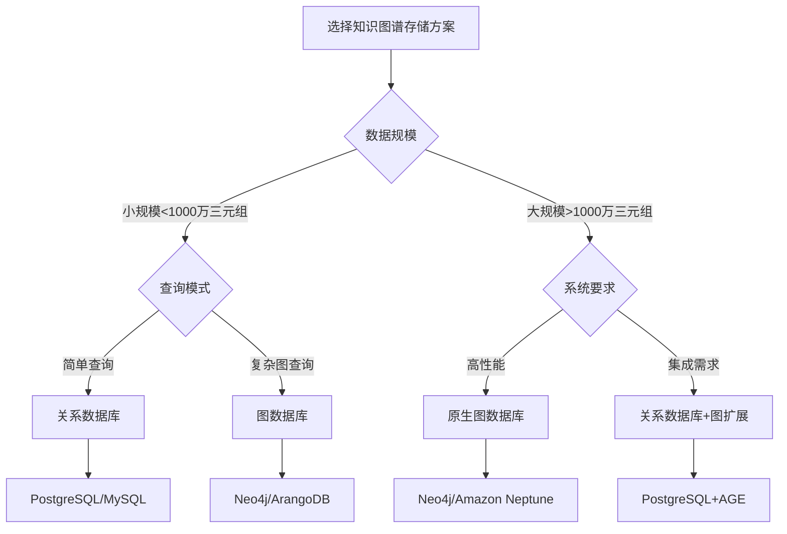
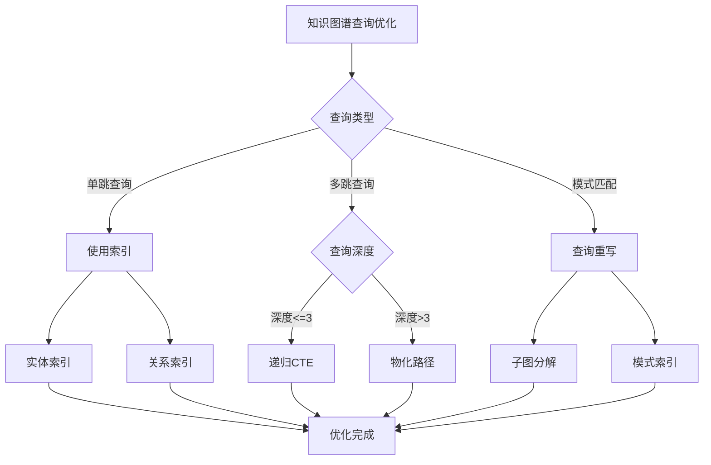

# 知识图谱数据库设计实战：从Schema到查询优化

> **创建日期**：2025-01-15
> **最后更新**：2025-01-15
> **版本**：v1.0
> **状态**：实施中

---

## 📋 目录

- [知识图谱数据库设计实战：从Schema到查询优化](#知识图谱数据库设计实战从schema到查询优化)
  - [📋 目录](#-目录)
  - [1. 概述](#1-概述)
    - [1.1. 知识图谱存储方案选择决策树](#11-知识图谱存储方案选择决策树)
  - [2. 知识图谱Schema设计](#2-知识图谱schema设计)
    - [2.1. 三元组存储Schema（关系数据库）](#21-三元组存储schema关系数据库)
    - [2.2. 优化Schema设计（支持快速查询）](#22-优化schema设计支持快速查询)
    - [2.3. 分区表设计（大规模数据）](#23-分区表设计大规模数据)
  - [3. 关系数据库存储知识图谱](#3-关系数据库存储知识图谱)
    - [3.1. 基础查询函数](#31-基础查询函数)
    - [3.2. 图模式匹配查询](#32-图模式匹配查询)
  - [4. Neo4j图数据库设计](#4-neo4j图数据库设计)
    - [4.1. Neo4j Schema设计](#41-neo4j-schema设计)
    - [4.2. Neo4j数据导入](#42-neo4j数据导入)
    - [4.3. Neo4j查询优化](#43-neo4j查询优化)
  - [5. PostgreSQL图扩展设计](#5-postgresql图扩展设计)
    - [5.1. Apache AGE集成](#51-apache-age集成)
    - [5.2. PostgreSQL图查询](#52-postgresql图查询)
  - [6. 知识图谱查询优化](#6-知识图谱查询优化)
    - [6.1. 查询优化策略](#61-查询优化策略)
    - [6.2. 索引优化](#62-索引优化)
    - [6.3. 查询重写优化](#63-查询重写优化)
  - [7. 实际应用案例](#7-实际应用案例)
    - [7.1. 企业知识图谱案例](#71-企业知识图谱案例)
    - [7.2. 推荐系统知识图谱案例](#72-推荐系统知识图谱案例)
  - [8. 参考资料](#8-参考资料)

---

## 1. 概述

知识图谱数据库设计需要平衡存储效率、查询性能和语义表达能力。

### 1.1. 知识图谱存储方案选择决策树



---

## 2. 知识图谱Schema设计

### 2.1. 三元组存储Schema（关系数据库）

**基础三元组表设计**：

```sql
CREATE SCHEMA knowledge_graph;

-- 实体表
CREATE TABLE knowledge_graph.entities (
    entity_id BIGSERIAL PRIMARY KEY,
    entity_uri VARCHAR(500) UNIQUE NOT NULL,
    entity_type VARCHAR(100) NOT NULL,  -- Person, Company, Location等
    entity_name VARCHAR(200),
    properties JSONB,  -- 实体属性
    created_at TIMESTAMP DEFAULT CURRENT_TIMESTAMP,
    updated_at TIMESTAMP DEFAULT CURRENT_TIMESTAMP
);

CREATE INDEX idx_entities_uri ON knowledge_graph.entities(entity_uri);
CREATE INDEX idx_entities_type ON knowledge_graph.entities(entity_type);
CREATE INDEX idx_entities_name ON knowledge_graph.entities(entity_name);
CREATE INDEX idx_entities_properties ON knowledge_graph.entities USING GIN (properties);

-- 关系表
CREATE TABLE knowledge_graph.relations (
    relation_id SERIAL PRIMARY KEY,
    relation_uri VARCHAR(500) UNIQUE NOT NULL,
    relation_name VARCHAR(200) NOT NULL,
    relation_type VARCHAR(100),  -- SYMMETRIC, TRANSITIVE, INVERSE等
    domain_entity_type VARCHAR(100),  -- 定义域实体类型
    range_entity_type VARCHAR(100),  -- 值域实体类型
    created_at TIMESTAMP DEFAULT CURRENT_TIMESTAMP
);

CREATE INDEX idx_relations_uri ON knowledge_graph.relations(relation_uri);
CREATE INDEX idx_relations_type ON knowledge_graph.relations(relation_type);

-- 三元组表（核心表）
CREATE TABLE knowledge_graph.triples (
    triple_id BIGSERIAL PRIMARY KEY,
    subject_id BIGINT NOT NULL REFERENCES knowledge_graph.entities(entity_id) ON DELETE CASCADE,
    predicate_id INTEGER NOT NULL REFERENCES knowledge_graph.relations(relation_id),
    object_id BIGINT NOT NULL REFERENCES knowledge_graph.entities(entity_id) ON DELETE CASCADE,
    confidence DECIMAL(5,4) DEFAULT 1.0,  -- 置信度
    source VARCHAR(200),  -- 数据来源
    properties JSONB,  -- 关系属性
    created_at TIMESTAMP DEFAULT CURRENT_TIMESTAMP,
    UNIQUE(subject_id, predicate_id, object_id)
);

-- 三元组索引（关键性能优化）
CREATE INDEX idx_triples_subject ON knowledge_graph.triples(subject_id);
CREATE INDEX idx_triples_predicate ON knowledge_graph.triples(predicate_id);
CREATE INDEX idx_triples_object ON knowledge_graph.triples(object_id);
CREATE INDEX idx_triples_spo ON knowledge_graph.triples(subject_id, predicate_id, object_id);
CREATE INDEX idx_triples_ops ON knowledge_graph.triples(object_id, predicate_id, subject_id);  -- 反向查询
CREATE INDEX idx_triples_properties ON knowledge_graph.triples USING GIN (properties);

-- 实体类型表（本体）
CREATE TABLE knowledge_graph.entity_types (
    type_id SERIAL PRIMARY KEY,
    type_uri VARCHAR(500) UNIQUE NOT NULL,
    type_name VARCHAR(200) NOT NULL,
    parent_type_id INTEGER REFERENCES knowledge_graph.entity_types(type_id),
    properties_schema JSONB,  -- 属性模式定义
    created_at TIMESTAMP DEFAULT CURRENT_TIMESTAMP
);

CREATE INDEX idx_entity_types_parent ON knowledge_graph.entity_types(parent_type_id);

-- 实体类型关联表
CREATE TABLE knowledge_graph.entity_type_assignments (
    entity_id BIGINT NOT NULL REFERENCES knowledge_graph.entities(entity_id) ON DELETE CASCADE,
    type_id INTEGER NOT NULL REFERENCES knowledge_graph.entity_types(type_id) ON DELETE CASCADE,
    PRIMARY KEY (entity_id, type_id)
);

CREATE INDEX idx_entity_type_assignments_entity ON knowledge_graph.entity_type_assignments(entity_id);
CREATE INDEX idx_entity_type_assignments_type ON knowledge_graph.entity_type_assignments(type_id);
```

### 2.2. 优化Schema设计（支持快速查询）

**物化视图优化**：

```sql
-- 常用查询模式物化视图
CREATE MATERIALIZED VIEW knowledge_graph.entity_out_degree AS
SELECT
    e.entity_id,
    e.entity_uri,
    e.entity_type,
    COUNT(t.triple_id) AS out_degree
FROM knowledge_graph.entities e
LEFT JOIN knowledge_graph.triples t ON e.entity_id = t.subject_id
GROUP BY e.entity_id, e.entity_uri, e.entity_type;

CREATE INDEX idx_entity_out_degree_degree ON knowledge_graph.entity_out_degree(out_degree DESC);

CREATE MATERIALIZED VIEW knowledge_graph.entity_in_degree AS
SELECT
    e.entity_id,
    e.entity_uri,
    e.entity_type,
    COUNT(t.triple_id) AS in_degree
FROM knowledge_graph.entities e
LEFT JOIN knowledge_graph.triples t ON e.entity_id = t.object_id
GROUP BY e.entity_id, e.entity_uri, e.entity_type;

CREATE INDEX idx_entity_in_degree_degree ON knowledge_graph.entity_in_degree(in_degree DESC);

-- 刷新物化视图函数
CREATE OR REPLACE FUNCTION refresh_kg_materialized_views()
RETURNS VOID AS $$
BEGIN
    REFRESH MATERIALIZED VIEW CONCURRENTLY knowledge_graph.entity_out_degree;
    REFRESH MATERIALIZED VIEW CONCURRENTLY knowledge_graph.entity_in_degree;
END;
$$ LANGUAGE plpgsql;
```

### 2.3. 分区表设计（大规模数据）

**按实体类型分区**：

```sql
-- 三元组分区表（按主体实体类型分区）
CREATE TABLE knowledge_graph.triples_partitioned (
    triple_id BIGSERIAL,
    subject_id BIGINT NOT NULL,
    predicate_id INTEGER NOT NULL,
    object_id BIGINT NOT NULL,
    confidence DECIMAL(5,4) DEFAULT 1.0,
    source VARCHAR(200),
    properties JSONB,
    created_at TIMESTAMP DEFAULT CURRENT_TIMESTAMP,
    PRIMARY KEY (triple_id, subject_id)
) PARTITION BY HASH (subject_id);

-- 创建分区（示例：4个分区）
CREATE TABLE knowledge_graph.triples_partitioned_0
PARTITION OF knowledge_graph.triples_partitioned
FOR VALUES WITH (MODULUS 4, REMAINDER 0);

CREATE TABLE knowledge_graph.triples_partitioned_1
PARTITION OF knowledge_graph.triples_partitioned
FOR VALUES WITH (MODULUS 4, REMAINDER 1);

CREATE TABLE knowledge_graph.triples_partitioned_2
PARTITION OF knowledge_graph.triples_partitioned
FOR VALUES WITH (MODULUS 4, REMAINDER 2);

CREATE TABLE knowledge_graph.triples_partitioned_3
PARTITION OF knowledge_graph.triples_partitioned
FOR VALUES WITH (MODULUS 4, REMAINDER 3);
```

---

## 3. 关系数据库存储知识图谱

### 3.1. 基础查询函数

**单跳查询**：

```sql
-- 查找实体的所有出边
CREATE OR REPLACE FUNCTION get_entity_outgoing_relations(
    p_entity_uri VARCHAR(500)
)
RETURNS TABLE (
    relation_name VARCHAR(200),
    target_entity_uri VARCHAR(500),
    target_entity_name VARCHAR(200),
    properties JSONB
) AS $$
BEGIN
    RETURN QUERY
    SELECT
        r.relation_name,
        e2.entity_uri AS target_entity_uri,
        e2.entity_name AS target_entity_name,
        t.properties
    FROM knowledge_graph.triples t
    JOIN knowledge_graph.entities e1 ON t.subject_id = e1.entity_id
    JOIN knowledge_graph.relations r ON t.predicate_id = r.relation_id
    JOIN knowledge_graph.entities e2 ON t.object_id = e2.entity_id
    WHERE e1.entity_uri = p_entity_uri;
END;
$$ LANGUAGE plpgsql;

-- 查找实体的所有入边
CREATE OR REPLACE FUNCTION get_entity_incoming_relations(
    p_entity_uri VARCHAR(500)
)
RETURNS TABLE (
    relation_name VARCHAR(200),
    source_entity_uri VARCHAR(500),
    source_entity_name VARCHAR(200),
    properties JSONB
) AS $$
BEGIN
    RETURN QUERY
    SELECT
        r.relation_name,
        e1.entity_uri AS source_entity_uri,
        e1.entity_name AS source_entity_name,
        t.properties
    FROM knowledge_graph.triples t
    JOIN knowledge_graph.entities e1 ON t.subject_id = e1.entity_id
    JOIN knowledge_graph.relations r ON t.predicate_id = r.relation_id
    JOIN knowledge_graph.entities e2 ON t.object_id = e2.entity_id
    WHERE e2.entity_uri = p_entity_uri;
END;
$$ LANGUAGE plpgsql;
```

**多跳查询（路径查询）**：

```sql
-- 递归查询：查找两个实体之间的路径
CREATE OR REPLACE FUNCTION find_path_between_entities(
    p_start_entity_uri VARCHAR(500),
    p_end_entity_uri VARCHAR(500),
    p_max_depth INTEGER DEFAULT 5
)
RETURNS TABLE (
    path_length INTEGER,
    path_triples JSONB
) AS $$
DECLARE
    v_start_id BIGINT;
    v_end_id BIGINT;
BEGIN
    -- 获取实体ID
    SELECT entity_id INTO v_start_id
    FROM knowledge_graph.entities
    WHERE entity_uri = p_start_entity_uri;

    SELECT entity_id INTO v_end_id
    FROM knowledge_graph.entities
    WHERE entity_uri = p_end_entity_uri;

    -- 递归查询路径
    RETURN QUERY
    WITH RECURSIVE path_search AS (
        -- 基础情况：直接连接
        SELECT
            t.subject_id AS current_entity,
            t.object_id AS target_entity,
            1 AS depth,
            ARRAY[t.triple_id] AS path_triple_ids,
            ARRAY[jsonb_build_object(
                'subject', e1.entity_uri,
                'predicate', r.relation_name,
                'object', e2.entity_uri
            )] AS path_triples
        FROM knowledge_graph.triples t
        JOIN knowledge_graph.entities e1 ON t.subject_id = e1.entity_id
        JOIN knowledge_graph.relations r ON t.predicate_id = r.relation_id
        JOIN knowledge_graph.entities e2 ON t.object_id = e2.entity_id
        WHERE t.subject_id = v_start_id

        UNION

        -- 递归情况：扩展路径
        SELECT
            t.object_id AS current_entity,
            CASE WHEN t.object_id = v_end_id THEN v_end_id ELSE NULL END AS target_entity,
            ps.depth + 1 AS depth,
            ps.path_triple_ids || t.triple_id,
            ps.path_triples || jsonb_build_object(
                'subject', e1.entity_uri,
                'predicate', r.relation_name,
                'object', e2.entity_uri
            )
        FROM path_search ps
        JOIN knowledge_graph.triples t ON ps.current_entity = t.subject_id
        JOIN knowledge_graph.entities e1 ON t.subject_id = e1.entity_id
        JOIN knowledge_graph.relations r ON t.predicate_id = r.relation_id
        JOIN knowledge_graph.entities e2 ON t.object_id = e2.entity_id
        WHERE ps.depth < p_max_depth
          AND t.triple_id != ALL(ps.path_triple_ids)  -- 避免循环
          AND ps.target_entity IS NULL  -- 未找到目标
    )
    SELECT
        depth AS path_length,
        path_triples
    FROM path_search
    WHERE target_entity = v_end_id
    ORDER BY depth
    LIMIT 10;
END;
$$ LANGUAGE plpgsql;
```

### 3.2. 图模式匹配查询

**子图模式匹配**：

```sql
-- 查找匹配特定模式的子图
CREATE OR REPLACE FUNCTION match_graph_pattern(
    p_pattern JSONB
)
RETURNS TABLE (
    match_id BIGINT,
    matched_entities JSONB,
    matched_relations JSONB
) AS $$
DECLARE
    v_pattern_nodes JSONB;
    v_pattern_edges JSONB;
BEGIN
    v_pattern_nodes := p_pattern->'nodes';
    v_pattern_edges := p_pattern->'edges';

    -- 实现图模式匹配逻辑
    -- 这里简化示例，实际需要实现子图同构算法

    RETURN QUERY
    SELECT
        ROW_NUMBER() OVER ()::BIGINT AS match_id,
        '{}'::JSONB AS matched_entities,
        '{}'::JSONB AS matched_relations;
END;
$$ LANGUAGE plpgsql;

-- 使用示例
-- SELECT * FROM match_graph_pattern('{
--   "nodes": [
--     {"type": "Person", "name": "Alice"},
--     {"type": "Company"}
--   ],
--   "edges": [
--     {"from": 0, "to": 1, "relation": "worksAt"}
--   ]
-- }'::JSONB);
```

---

## 4. Neo4j图数据库设计

### 4.1. Neo4j Schema设计

**节点和关系设计**：

```cypher
// 创建节点约束
CREATE CONSTRAINT person_id IF NOT EXISTS
FOR (p:Person) REQUIRE p.id IS UNIQUE;

CREATE CONSTRAINT company_id IF NOT EXISTS
FOR (c:Company) REQUIRE c.id IS UNIQUE;

CREATE CONSTRAINT location_id IF NOT EXISTS
FOR (l:Location) REQUIRE l.id IS UNIQUE;

// 创建索引
CREATE INDEX person_name IF NOT EXISTS FOR (p:Person) ON (p.name);
CREATE INDEX company_name IF NOT EXISTS FOR (c:Company) ON (c.name);
CREATE INDEX location_name IF NOT EXISTS FOR (l:Location) ON (l.name);

// 创建关系索引
CREATE INDEX works_at_since IF NOT EXISTS
FOR ()-[r:WORKS_AT]-() ON (r.since);
```

### 4.2. Neo4j数据导入

**批量导入脚本**：

```cypher
// 使用LOAD CSV导入
LOAD CSV WITH HEADERS FROM 'file:///entities.csv' AS row
CREATE (e:Entity {
    id: row.id,
    uri: row.uri,
    type: row.type,
    name: row.name,
    properties: apoc.convert.fromJsonMap(row.properties)
});

// 导入关系
LOAD CSV WITH HEADERS FROM 'file:///triples.csv' AS row
MATCH (s:Entity {id: row.subject_id})
MATCH (o:Entity {id: row.object_id})
CREATE (s)-[r:RELATION {
    type: row.predicate,
    confidence: toFloat(row.confidence),
    source: row.source
}]->(o);
```

### 4.3. Neo4j查询优化

**查询优化技巧**：

```cypher
// 1. 使用索引提示
MATCH (p:Person)
USING INDEX p:Person(name)
WHERE p.name = 'Alice'
RETURN p;

// 2. 限制查询深度
MATCH path = (a:Person {name: 'Alice'})-[*1..3]-(b:Person {name: 'Bob'})
RETURN path
LIMIT 10;

// 3. 使用PROFILE分析查询计划
PROFILE
MATCH (p:Person)-[:WORKS_AT]->(c:Company)
WHERE p.age > 25
RETURN p.name, c.name;

// 4. 使用EXPLAIN查看执行计划
EXPLAIN
MATCH (p:Person)-[:KNOWS*2..4]-(friend:Person)
RETURN DISTINCT friend.name;
```

---

## 5. PostgreSQL图扩展设计

### 5.1. Apache AGE集成

**Apache AGE Schema设计**：

```sql
-- 启用Apache AGE扩展
CREATE EXTENSION IF NOT EXISTS age;

-- 创建图
SELECT create_graph('knowledge_graph');

-- 创建节点标签
SELECT * FROM cypher('knowledge_graph', $$
    CREATE (p:Person {
        id: 1,
        name: 'Alice',
        age: 30
    })
    RETURN p
$$) AS (p agtype);

-- 创建关系
SELECT * FROM cypher('knowledge_graph', $$
    MATCH (p:Person {id: 1})
    MATCH (c:Company {id: 1})
    CREATE (p)-[r:WORKS_AT {
        since: '2020-01-01',
        position: 'Engineer'
    }]->(c)
    RETURN r
$$) AS (r agtype);
```

### 5.2. PostgreSQL图查询

**Cypher查询示例**：

```sql
-- 查找一个人的所有同事
SELECT * FROM cypher('knowledge_graph', $$
    MATCH (p1:Person {name: 'Alice'})-[:WORKS_AT]->(c:Company)<-[:WORKS_AT]-(p2:Person)
    WHERE p1 <> p2
    RETURN p2.name AS colleague_name
$$) AS (colleague_name agtype);

-- 查找两个实体之间的最短路径
SELECT * FROM cypher('knowledge_graph', $$
    MATCH path = shortestPath(
        (a:Person {name: 'Alice'})-[*]-(b:Person {name: 'Bob'})
    )
    RETURN path
$$) AS (path agtype);
```

---

## 6. 知识图谱查询优化

### 6.1. 查询优化策略

**优化决策树**：



### 6.2. 索引优化

**复合索引设计**：

```sql
-- 针对常见查询模式的复合索引
CREATE INDEX idx_triples_subject_predicate
ON knowledge_graph.triples(subject_id, predicate_id);

CREATE INDEX idx_triples_object_predicate
ON knowledge_graph.triples(object_id, predicate_id);

-- 部分索引（只索引活跃数据）
CREATE INDEX idx_triples_active
ON knowledge_graph.triples(subject_id, predicate_id, object_id)
WHERE confidence >= 0.8;

-- 表达式索引（支持属性查询）
CREATE INDEX idx_entities_name_lower
ON knowledge_graph.entities(LOWER(entity_name));
```

### 6.3. 查询重写优化

**查询重写规则**：

```sql
-- 优化：将多表JOIN改为单表查询
-- 原始查询（慢）
SELECT e1.entity_name, r.relation_name, e2.entity_name
FROM knowledge_graph.triples t
JOIN knowledge_graph.entities e1 ON t.subject_id = e1.entity_id
JOIN knowledge_graph.relations r ON t.predicate_id = r.relation_id
JOIN knowledge_graph.entities e2 ON t.object_id = e2.entity_id
WHERE e1.entity_uri = 'http://example.org/Alice';

-- 优化查询（快）
WITH subject_entity AS (
    SELECT entity_id FROM knowledge_graph.entities
    WHERE entity_uri = 'http://example.org/Alice'
)
SELECT
    e1.entity_name,
    r.relation_name,
    e2.entity_name
FROM knowledge_graph.triples t
CROSS JOIN subject_entity se
JOIN knowledge_graph.entities e1 ON t.subject_id = e1.entity_id
JOIN knowledge_graph.relations r ON t.predicate_id = r.relation_id
JOIN knowledge_graph.entities e2 ON t.object_id = e2.entity_id
WHERE t.subject_id = se.entity_id;
```

---

## 7. 实际应用案例

### 7.1. 企业知识图谱案例

**Schema设计**：

```sql
-- 企业知识图谱Schema
CREATE SCHEMA enterprise_kg;

-- 人员实体
CREATE TABLE enterprise_kg.persons (
    person_id BIGSERIAL PRIMARY KEY,
    employee_id VARCHAR(50) UNIQUE NOT NULL,
    name VARCHAR(200) NOT NULL,
    email VARCHAR(200),
    department VARCHAR(100),
    position VARCHAR(100),
    properties JSONB
);

-- 项目实体
CREATE TABLE enterprise_kg.projects (
    project_id BIGSERIAL PRIMARY KEY,
    project_code VARCHAR(50) UNIQUE NOT NULL,
    project_name VARCHAR(200) NOT NULL,
    status VARCHAR(50),
    start_date DATE,
    end_date DATE,
    properties JSONB
);

-- 技能实体
CREATE TABLE enterprise_kg.skills (
    skill_id BIGSERIAL PRIMARY KEY,
    skill_name VARCHAR(100) UNIQUE NOT NULL,
    category VARCHAR(50),
    properties JSONB
);

-- 关系表
CREATE TABLE enterprise_kg.person_project_relations (
    person_id BIGINT REFERENCES enterprise_kg.persons(person_id),
    project_id BIGINT REFERENCES enterprise_kg.projects(project_id),
    role VARCHAR(50),  -- LEADER, MEMBER, CONSULTANT
    start_date DATE,
    end_date DATE,
    PRIMARY KEY (person_id, project_id)
);

CREATE TABLE enterprise_kg.person_skill_relations (
    person_id BIGINT REFERENCES enterprise_kg.persons(person_id),
    skill_id BIGINT REFERENCES enterprise_kg.skills(skill_id),
    proficiency_level INTEGER CHECK (proficiency_level BETWEEN 1 AND 5),
    certified BOOLEAN DEFAULT FALSE,
    PRIMARY KEY (person_id, skill_id)
);

-- 查询：查找具有特定技能的项目成员
CREATE OR REPLACE FUNCTION find_project_members_with_skill(
    p_project_code VARCHAR(50),
    p_skill_name VARCHAR(100),
    p_min_proficiency INTEGER DEFAULT 3
)
RETURNS TABLE (
    person_name VARCHAR(200),
    role VARCHAR(50),
    proficiency_level INTEGER
) AS $$
BEGIN
    RETURN QUERY
    SELECT
        p.name AS person_name,
        ppr.role,
        psr.proficiency_level
    FROM enterprise_kg.persons p
    JOIN enterprise_kg.person_project_relations ppr ON p.person_id = ppr.person_id
    JOIN enterprise_kg.projects prj ON ppr.project_id = prj.project_id
    JOIN enterprise_kg.person_skill_relations psr ON p.person_id = psr.person_id
    JOIN enterprise_kg.skills s ON psr.skill_id = s.skill_id
    WHERE prj.project_code = p_project_code
      AND s.skill_name = p_skill_name
      AND psr.proficiency_level >= p_min_proficiency;
END;
$$ LANGUAGE plpgsql;
```

### 7.2. 推荐系统知识图谱案例

**推荐系统Schema**：

```sql
CREATE SCHEMA recommendation_kg;

-- 用户实体
CREATE TABLE recommendation_kg.users (
    user_id BIGSERIAL PRIMARY KEY,
    username VARCHAR(100) UNIQUE NOT NULL,
    age INTEGER,
    gender VARCHAR(10),
    location VARCHAR(100),
    properties JSONB
);

-- 商品实体
CREATE TABLE recommendation_kg.items (
    item_id BIGSERIAL PRIMARY KEY,
    item_name VARCHAR(200) NOT NULL,
    category VARCHAR(100),
    price DECIMAL(10,2),
    properties JSONB
);

-- 用户-商品关系（购买、浏览、收藏等）
CREATE TABLE recommendation_kg.user_item_relations (
    user_id BIGINT REFERENCES recommendation_kg.users(user_id),
    item_id BIGINT REFERENCES recommendation_kg.items(item_id),
    relation_type VARCHAR(50) NOT NULL,  -- PURCHASED, VIEWED, LIKED, RATED
    timestamp TIMESTAMP DEFAULT CURRENT_TIMESTAMP,
    rating INTEGER CHECK (rating BETWEEN 1 AND 5),
    PRIMARY KEY (user_id, item_id, relation_type)
);

-- 商品相似度关系（基于知识图谱计算）
CREATE TABLE recommendation_kg.item_similarity (
    item1_id BIGINT REFERENCES recommendation_kg.items(item_id),
    item2_id BIGINT REFERENCES recommendation_kg.items(item_id),
    similarity_score DECIMAL(5,4) NOT NULL,
    similarity_type VARCHAR(50),  -- CATEGORY, BRAND, FEATURE
    PRIMARY KEY (item1_id, item2_id),
    CHECK (item1_id < item2_id)  -- 避免重复
);

-- 推荐查询：基于知识图谱的协同过滤
CREATE OR REPLACE FUNCTION recommend_items_by_kg(
    p_user_id BIGINT,
    p_top_k INTEGER DEFAULT 10
)
RETURNS TABLE (
    item_id BIGINT,
    item_name VARCHAR(200),
    recommendation_score DECIMAL(5,4),
    reason TEXT
) AS $$
BEGIN
    RETURN QUERY
    WITH user_purchased_items AS (
        SELECT item_id
        FROM recommendation_kg.user_item_relations
        WHERE user_id = p_user_id
          AND relation_type = 'PURCHASED'
    ),
    similar_users AS (
        SELECT DISTINCT uir2.user_id
        FROM recommendation_kg.user_item_relations uir1
        JOIN recommendation_kg.user_item_relations uir2
            ON uir1.item_id = uir2.item_id
        WHERE uir1.user_id = p_user_id
          AND uir2.user_id <> p_user_id
          AND uir1.relation_type = 'PURCHASED'
          AND uir2.relation_type = 'PURCHASED'
    ),
    candidate_items AS (
        SELECT DISTINCT uir.item_id
        FROM recommendation_kg.user_item_relations uir
        JOIN similar_users su ON uir.user_id = su.user_id
        WHERE uir.relation_type = 'PURCHASED'
          AND uir.item_id NOT IN (SELECT item_id FROM user_purchased_items)
    )
    SELECT
        i.item_id,
        i.item_name,
        COUNT(*)::DECIMAL / (SELECT COUNT(*) FROM similar_users) AS recommendation_score,
        'Similar users also purchased' AS reason
    FROM candidate_items ci
    JOIN recommendation_kg.items i ON ci.item_id = i.item_id
    GROUP BY i.item_id, i.item_name
    ORDER BY recommendation_score DESC
    LIMIT p_top_k;
END;
$$ LANGUAGE plpgsql;
```

---

## 8. 参考资料

- [知识图谱理论](../01-理论模型/01.04-知识图谱理论.md)
- [知识推理与归纳理论](../01-理论模型/01.06-知识推理与归纳理论.md)
- [PostgreSQL图数据库功能](../../PostgreSQL/04-高级特性/03.06-图数据库功能.md)

---

**最后更新**：2025-01-15
**维护者**：Data-Science Team
**状态**：实施中
