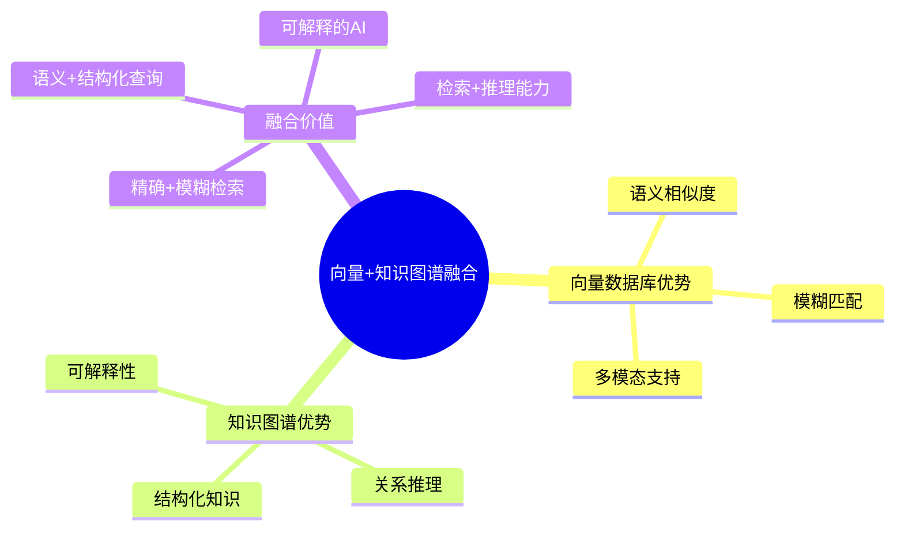
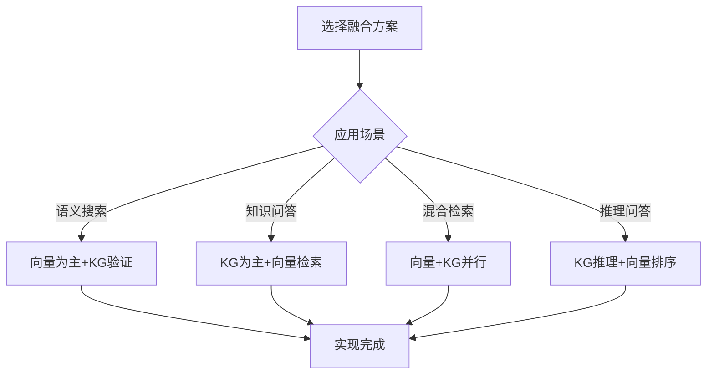
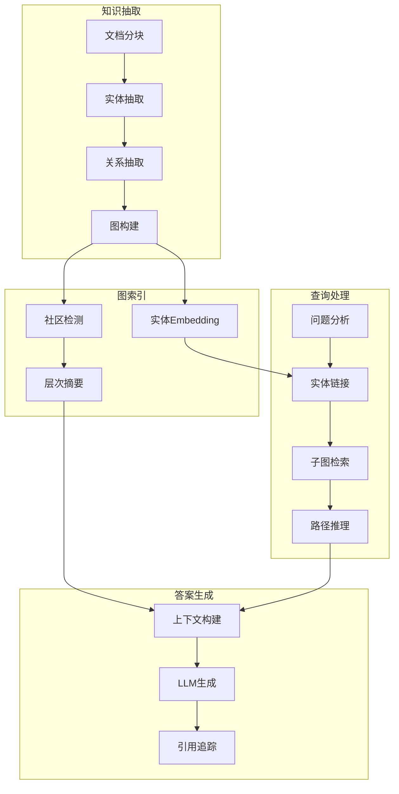
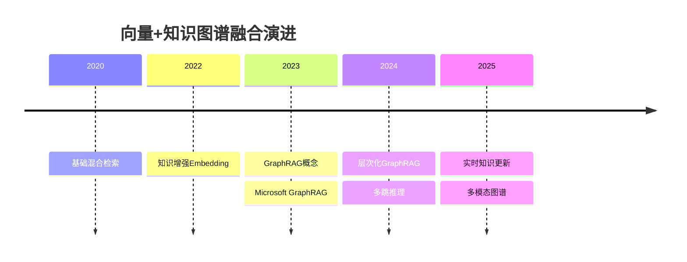

# 向量与知识图谱融合设计：混合检索与智能问答

> **创建日期**：2025-01-15
> **最后更新**：2025-12-01
> **版本**：v2.0 (增强版)
> **状态**：实施中

---

## 📋 目录

- [向量与知识图谱融合设计：混合检索与智能问答](#向量与知识图谱融合设计混合检索与智能问答)
  - [📋 目录](#-目录)
  - [1. 概述](#1-概述)
    - [1.1. 融合优势](#11-融合优势)
    - [1.2. 融合方案选择决策树](#12-融合方案选择决策树)
  - [2. 向量+知识图谱融合架构](#2-向量知识图谱融合架构)
    - [2.1. 融合架构设计](#21-融合架构设计)
    - [2.2. 数据同步机制](#22-数据同步机制)
  - [3. 混合检索Schema设计](#3-混合检索schema设计)
    - [3.1. 向量+知识图谱混合检索表](#31-向量知识图谱混合检索表)
    - [3.2. 混合检索函数](#32-混合检索函数)
  - [4. 知识增强的RAG系统](#4-知识增强的rag系统)
    - [4.1. KG-RAG架构](#41-kg-rag架构)
    - [4.2. KG-RAG检索函数](#42-kg-rag检索函数)
  - [5. 图增强的向量检索](#5-图增强的向量检索)
    - [5.1. 图结构增强的向量检索](#51-图结构增强的向量检索)
  - [6. 智能问答系统设计](#6-智能问答系统设计)
    - [6.1. 问答系统Schema](#61-问答系统schema)
    - [6.2. 智能问答函数](#62-智能问答函数)
  - [7. 实际应用案例](#7-实际应用案例)
    - [7.1. 企业知识管理系统](#71-企业知识管理系统)
  - [8. GraphRAG深度架构](#8-graphrag深度架构)
    - [8.1. GraphRAG核心原理](#81-graphrag核心原理)
    - [8.2. GraphRAG Schema设计](#82-graphrag-schema设计)
  - [9. 2024-2025最新趋势](#9-2024-2025最新趋势)
    - [9.1. 融合技术演进](#91-融合技术演进)
    - [9.2. 融合方案对比](#92-融合方案对比)
  - [10. 参考资料](#10-参考资料)
    - [10.1. 权威文献](#101-权威文献)
    - [10.2. 在线资源](#102-在线资源)
    - [10.3. 相关文档](#103-相关文档)

---

## 1. 概述

向量数据库和知识图谱各有优势，融合两者可以实现更强大的语义理解和推理能力。

### 1.1. 融合优势



### 1.2. 融合方案选择决策树



---

## 2. 向量+知识图谱融合架构

### 2.1. 融合架构设计

**三层融合架构**：

```text
┌─────────────────────────────────────┐
│  应用层：智能问答、语义搜索          │
├─────────────────────────────────────┤
│  融合层：混合检索、结果融合          │
├─────────────────────────────────────┤
│  存储层：向量DB + 知识图谱DB         │
└─────────────────────────────────────┘
```

### 2.2. 数据同步机制

**向量与知识图谱数据同步Schema**：

```sql
CREATE SCHEMA hybrid_search;

-- 统一实体表（连接向量和知识图谱）
CREATE TABLE hybrid_search.unified_entities (
    entity_id BIGSERIAL PRIMARY KEY,
    entity_uri VARCHAR(500) UNIQUE NOT NULL,
    entity_type VARCHAR(100) NOT NULL,
    entity_name VARCHAR(200) NOT NULL,

    -- 向量相关
    embedding_id BIGINT,  -- 关联向量数据库中的ID
    embedding_model VARCHAR(100),  -- 使用的Embedding模型
    embedding_ready BOOLEAN DEFAULT FALSE,

    -- 知识图谱相关
    kg_node_id BIGINT,  -- 关联知识图谱中的节点ID
    kg_ready BOOLEAN DEFAULT FALSE,

    -- 元数据
    properties JSONB,
    created_at TIMESTAMP DEFAULT CURRENT_TIMESTAMP,
    updated_at TIMESTAMP DEFAULT CURRENT_TIMESTAMP
);

CREATE INDEX idx_unified_entities_uri ON hybrid_search.unified_entities(entity_uri);
CREATE INDEX idx_unified_entities_type ON hybrid_search.unified_entities(entity_type);
CREATE INDEX idx_unified_entities_embedding ON hybrid_search.unified_entities(embedding_id) WHERE embedding_ready = TRUE;
CREATE INDEX idx_unified_entities_kg ON hybrid_search.unified_entities(kg_node_id) WHERE kg_ready = TRUE;

-- 同步状态表
CREATE TABLE hybrid_search.sync_status (
    sync_id BIGSERIAL PRIMARY KEY,
    entity_id BIGINT NOT NULL REFERENCES hybrid_search.unified_entities(entity_id),
    sync_type VARCHAR(50) NOT NULL,  -- VECTOR_TO_KG, KG_TO_VECTOR, BIDIRECTIONAL
    sync_status VARCHAR(50) NOT NULL,  -- PENDING, SYNCING, COMPLETED, FAILED
    last_sync_at TIMESTAMP,
    error_message TEXT,
    created_at TIMESTAMP DEFAULT CURRENT_TIMESTAMP
);

CREATE INDEX idx_sync_status_entity ON hybrid_search.sync_status(entity_id);
CREATE INDEX idx_sync_status_status ON hybrid_search.sync_status(sync_status);
```

---

## 3. 混合检索Schema设计

### 3.1. 向量+知识图谱混合检索表

**混合检索结果表**：

```sql
-- 向量检索结果表
CREATE TABLE hybrid_search.vector_search_results (
    result_id BIGSERIAL PRIMARY KEY,
    query_id BIGINT NOT NULL,
    entity_id BIGINT NOT NULL REFERENCES hybrid_search.unified_entities(entity_id),
    vector_score DECIMAL(5,4) NOT NULL,
    rank_position INTEGER NOT NULL,
    created_at TIMESTAMP DEFAULT CURRENT_TIMESTAMP
);

CREATE INDEX idx_vector_results_query ON hybrid_search.vector_search_results(query_id, rank_position);

-- 知识图谱检索结果表
CREATE TABLE hybrid_search.kg_search_results (
    result_id BIGSERIAL PRIMARY KEY,
    query_id BIGINT NOT NULL,
    entity_id BIGINT NOT NULL REFERENCES hybrid_search.unified_entities(entity_id),
    kg_score DECIMAL(5,4) NOT NULL,  -- 基于图结构计算的分数
    reasoning_path TEXT,  -- 推理路径
    rank_position INTEGER NOT NULL,
    created_at TIMESTAMP DEFAULT CURRENT_TIMESTAMP
);

CREATE INDEX idx_kg_results_query ON hybrid_search.kg_search_results(query_id, rank_position);

-- 混合检索查询表
CREATE TABLE hybrid_search.hybrid_queries (
    query_id BIGSERIAL PRIMARY KEY,
    query_text TEXT NOT NULL,
    query_embedding vector(1536),  -- OpenAI ada-002
    query_type VARCHAR(50),  -- SEMANTIC, STRUCTURAL, HYBRID
    vector_weight DECIMAL(3,2) DEFAULT 0.6,  -- 向量检索权重
    kg_weight DECIMAL(3,2) DEFAULT 0.4,  -- 知识图谱检索权重
    created_at TIMESTAMP DEFAULT CURRENT_TIMESTAMP
);

CREATE INDEX idx_hybrid_queries_embedding
ON hybrid_search.hybrid_queries
USING hnsw (query_embedding vector_cosine_ops);
```

### 3.2. 混合检索函数

**RRF融合检索**：

```sql
-- 混合检索函数（RRF融合）
CREATE OR REPLACE FUNCTION hybrid_search_rrf(
    p_query_text TEXT,
    p_query_embedding vector(1536),
    p_top_k INTEGER DEFAULT 20,
    p_vector_weight DECIMAL DEFAULT 0.6,
    p_kg_weight DECIMAL DEFAULT 0.4,
    p_k INTEGER DEFAULT 60  -- RRF参数
)
RETURNS TABLE (
    entity_id BIGINT,
    entity_uri VARCHAR(500),
    entity_name VARCHAR(200),
    combined_score DECIMAL(5,4),
    vector_score DECIMAL(5,4),
    kg_score DECIMAL(5,4),
    reasoning_path TEXT
) AS $$
DECLARE
    v_query_id BIGINT;
BEGIN
    -- 记录查询
    INSERT INTO hybrid_search.hybrid_queries
    (query_text, query_embedding, query_type, vector_weight, kg_weight)
    VALUES (p_query_text, p_query_embedding, 'HYBRID', p_vector_weight, p_kg_weight)
    RETURNING query_id INTO v_query_id;

    -- 向量检索
    INSERT INTO hybrid_search.vector_search_results (query_id, entity_id, vector_score, rank_position)
    SELECT
        v_query_id,
        ue.entity_id,
        1 - (ue.embedding <=> p_query_embedding) AS vector_score,
        ROW_NUMBER() OVER (ORDER BY ue.embedding <=> p_query_embedding) AS rank_position
    FROM hybrid_search.unified_entities ue
    JOIN rag_system.document_chunks dc ON ue.embedding_id = dc.chunk_id
    WHERE ue.embedding_ready = TRUE
      AND dc.embedding IS NOT NULL
    ORDER BY dc.embedding <=> p_query_embedding
    LIMIT p_top_k;

    -- 知识图谱检索（基于实体名称和关系）
    INSERT INTO hybrid_search.kg_search_results (query_id, entity_id, kg_score, reasoning_path, rank_position)
    WITH entity_matches AS (
        SELECT
            ue.entity_id,
            CASE
                WHEN ue.entity_name ILIKE '%' || p_query_text || '%' THEN 0.8
                WHEN EXISTS(
                    SELECT 1 FROM knowledge_graph.triples t
                    JOIN knowledge_graph.entities e ON t.object_id = e.entity_id
                    WHERE t.subject_id = ue.kg_node_id
                      AND e.entity_name ILIKE '%' || p_query_text || '%'
                ) THEN 0.6
                ELSE 0.4
            END AS kg_score,
            'Direct match' AS reasoning_path
        FROM hybrid_search.unified_entities ue
        WHERE ue.kg_ready = TRUE
    )
    SELECT
        v_query_id,
        em.entity_id,
        em.kg_score,
        em.reasoning_path,
        ROW_NUMBER() OVER (ORDER BY em.kg_score DESC) AS rank_position
    FROM entity_matches em
    ORDER BY em.kg_score DESC
    LIMIT p_top_k;

    -- RRF融合
    RETURN QUERY
    WITH vector_ranked AS (
        SELECT
            entity_id,
            vector_score,
            rank_position AS vector_rank
        FROM hybrid_search.vector_search_results
        WHERE query_id = v_query_id
    ),
    kg_ranked AS (
        SELECT
            entity_id,
            kg_score,
            reasoning_path,
            rank_position AS kg_rank
        FROM hybrid_search.kg_search_results
        WHERE query_id = v_query_id
    ),
    rrf_scores AS (
        SELECT
            COALESCE(v.entity_id, k.entity_id) AS entity_id,
            COALESCE(1.0 / (p_k + v.vector_rank), 0) * p_vector_weight +
            COALESCE(1.0 / (p_k + k.kg_rank), 0) * p_kg_weight AS combined_score,
            v.vector_score,
            k.kg_score,
            k.reasoning_path
        FROM vector_ranked v
        FULL OUTER JOIN kg_ranked k ON v.entity_id = k.entity_id
    )
    SELECT
        ue.entity_id,
        ue.entity_uri,
        ue.entity_name,
        rs.combined_score,
        rs.vector_score,
        rs.kg_score,
        rs.reasoning_path
    FROM rrf_scores rs
    JOIN hybrid_search.unified_entities ue ON rs.entity_id = ue.entity_id
    ORDER BY rs.combined_score DESC
    LIMIT p_top_k;
END;
$$ LANGUAGE plpgsql;
```

---

## 4. 知识增强的RAG系统

### 4.1. KG-RAG架构

**知识图谱增强的RAG系统Schema**：

```sql
CREATE SCHEMA kg_rag;

-- KG-RAG查询表
CREATE TABLE kg_rag.queries (
    query_id BIGSERIAL PRIMARY KEY,
    query_text TEXT NOT NULL,
    query_embedding vector(1536),
    query_type VARCHAR(50),  -- FACTUAL, RELATIONAL, COMPLEX
    created_at TIMESTAMP DEFAULT CURRENT_TIMESTAMP
);

-- KG-RAG检索结果表
CREATE TABLE kg_rag.retrieval_results (
    result_id BIGSERIAL PRIMARY KEY,
    query_id BIGINT NOT NULL REFERENCES kg_rag.queries(query_id),

    -- 向量检索结果
    chunk_id BIGINT REFERENCES rag_system.document_chunks(chunk_id),
    vector_score DECIMAL(5,4),

    -- 知识图谱检索结果
    entity_id BIGINT REFERENCES hybrid_search.unified_entities(entity_id),
    kg_path TEXT,  -- 知识图谱推理路径
    kg_score DECIMAL(5,4),

    -- 融合结果
    combined_score DECIMAL(5,4),
    retrieval_type VARCHAR(50),  -- VECTOR_ONLY, KG_ONLY, HYBRID

    created_at TIMESTAMP DEFAULT CURRENT_TIMESTAMP
);

CREATE INDEX idx_retrieval_results_query ON kg_rag.retrieval_results(query_id, combined_score DESC);
```

### 4.2. KG-RAG检索函数

**知识图谱增强的检索**：

```sql
-- KG-RAG检索函数
CREATE OR REPLACE FUNCTION kg_rag_retrieve(
    p_query_text TEXT,
    p_query_embedding vector(1536),
    p_top_k INTEGER DEFAULT 10,
    p_use_kg BOOLEAN DEFAULT TRUE
)
RETURNS TABLE (
    chunk_id BIGINT,
    content TEXT,
    entity_id BIGINT,
    entity_name VARCHAR(200),
    kg_context TEXT,
    score DECIMAL(5,4)
) AS $$
DECLARE
    v_query_id BIGINT;
    v_entities TEXT[];
BEGIN
    -- 记录查询
    INSERT INTO kg_rag.queries (query_text, query_embedding)
    VALUES (p_query_text, p_query_embedding)
    RETURNING query_id INTO v_query_id;

    -- 如果使用知识图谱，先进行实体识别和检索
    IF p_use_kg THEN
        -- 从查询中提取实体（简化示例，实际需要使用NER模型）
        SELECT array_agg(entity_name) INTO v_entities
        FROM hybrid_search.unified_entities
        WHERE entity_name = ANY(string_to_array(p_query_text, ' '));

        -- 基于实体检索相关文档块
        RETURN QUERY
        WITH kg_entities AS (
            SELECT DISTINCT entity_id
            FROM hybrid_search.unified_entities
            WHERE entity_name = ANY(v_entities)
        ),
        kg_related_chunks AS (
            SELECT DISTINCT
                dc.chunk_id,
                dc.content,
                ue.entity_id,
                ue.entity_name,
                -- 获取实体在知识图谱中的上下文
                (SELECT string_agg(
                    format('%s %s %s',
                        e1.entity_name,
                        r.relation_name,
                        e2.entity_name),
                    '; '
                )
                FROM knowledge_graph.triples t
                JOIN knowledge_graph.entities e1 ON t.subject_id = e1.entity_id
                JOIN knowledge_graph.relations r ON t.predicate_id = r.relation_id
                JOIN knowledge_graph.entities e2 ON t.object_id = e2.entity_id
                WHERE t.subject_id = ue.kg_node_id
                LIMIT 5) AS kg_context,
                -- 计算分数：向量相似度 + KG相关性
                0.7 * (1 - (dc.embedding <=> p_query_embedding)) +
                0.3 * CASE WHEN ue.entity_id IS NOT NULL THEN 1.0 ELSE 0.0 END AS score
            FROM rag_system.document_chunks dc
            LEFT JOIN hybrid_search.unified_entities ue ON dc.chunk_id = ue.embedding_id
            LEFT JOIN kg_entities ke ON ue.entity_id = ke.entity_id
            WHERE dc.embedding IS NOT NULL
              AND (ke.entity_id IS NOT NULL OR ue.entity_id IS NOT NULL)
        )
        SELECT
            chunk_id,
            content,
            entity_id,
            entity_name,
            kg_context,
            score
        FROM kg_related_chunks
        ORDER BY score DESC
        LIMIT p_top_k;
    ELSE
        -- 纯向量检索
        RETURN QUERY
        SELECT
            dc.chunk_id,
            dc.content,
            NULL::BIGINT AS entity_id,
            NULL::VARCHAR AS entity_name,
            NULL::TEXT AS kg_context,
            1 - (dc.embedding <=> p_query_embedding) AS score
        FROM rag_system.document_chunks dc
        WHERE dc.embedding IS NOT NULL
        ORDER BY dc.embedding <=> p_query_embedding
        LIMIT p_top_k;
    END IF;
END;
$$ LANGUAGE plpgsql;
```

---

## 5. 图增强的向量检索

### 5.1. 图结构增强的向量检索

**利用图结构优化向量检索**：

```sql
-- 图结构增强的向量检索函数
CREATE OR REPLACE FUNCTION graph_enhanced_vector_search(
    p_query_embedding vector(1536),
    p_start_entity_id BIGINT,
    p_max_hops INTEGER DEFAULT 2,
    p_top_k INTEGER DEFAULT 10
)
RETURNS TABLE (
    entity_id BIGINT,
    entity_name VARCHAR(200),
    hop_distance INTEGER,
    vector_score DECIMAL(5,4),
    graph_score DECIMAL(5,4),
    combined_score DECIMAL(5,4),
    path TEXT
) AS $$
BEGIN
    RETURN QUERY
    WITH RECURSIVE graph_neighbors AS (
        -- 基础：起始实体
        SELECT
            ue.entity_id,
            ue.entity_name,
            0 AS hop_distance,
            ARRAY[ue.entity_id] AS path
        FROM hybrid_search.unified_entities ue
        WHERE ue.entity_id = p_start_entity_id

        UNION

        -- 递归：邻居实体
        SELECT
            ue2.entity_id,
            ue2.entity_name,
            gn.hop_distance + 1,
            gn.path || ue2.entity_id
        FROM graph_neighbors gn
        JOIN knowledge_graph.triples t ON gn.entity_id = t.subject_id
        JOIN hybrid_search.unified_entities ue2 ON t.object_id = ue2.kg_node_id
        WHERE gn.hop_distance < p_max_hops
          AND ue2.entity_id != ALL(gn.path)  -- 避免循环
    ),
    vector_scores AS (
        SELECT
            gn.entity_id,
            gn.entity_name,
            gn.hop_distance,
            gn.path,
            1 - (ue.embedding <=> p_query_embedding) AS vector_score
        FROM graph_neighbors gn
        JOIN hybrid_search.unified_entities ue ON gn.entity_id = ue.entity_id
        JOIN rag_system.document_chunks dc ON ue.embedding_id = dc.chunk_id
        WHERE ue.embedding_ready = TRUE
          AND dc.embedding IS NOT NULL
    )
    SELECT
        vs.entity_id,
        vs.entity_name,
        vs.hop_distance,
        vs.vector_score,
        -- 图结构分数：距离越近分数越高
        (1.0 / (vs.hop_distance + 1)) AS graph_score,
        -- 组合分数：向量相似度 + 图结构
        0.7 * vs.vector_score + 0.3 * (1.0 / (vs.hop_distance + 1)) AS combined_score,
        array_to_string(vs.path, ' -> ') AS path
    FROM vector_scores vs
    ORDER BY combined_score DESC
    LIMIT p_top_k;
END;
$$ LANGUAGE plpgsql;
```

---

## 6. 智能问答系统设计

### 6.1. 问答系统Schema

**完整的智能问答系统Schema**：

```sql
CREATE SCHEMA intelligent_qa;

-- 问答会话表
CREATE TABLE intelligent_qa.sessions (
    session_id BIGSERIAL PRIMARY KEY,
    user_id BIGINT,
    session_name VARCHAR(200),
    created_at TIMESTAMP DEFAULT CURRENT_TIMESTAMP,
    updated_at TIMESTAMP DEFAULT CURRENT_TIMESTAMP
);

-- 问答记录表
CREATE TABLE intelligent_qa.qa_records (
    record_id BIGSERIAL PRIMARY KEY,
    session_id BIGINT NOT NULL REFERENCES intelligent_qa.sessions(session_id),
    question_text TEXT NOT NULL,
    question_embedding vector(1536),
    answer_text TEXT,
    answer_type VARCHAR(50),  -- FACTUAL, RELATIONAL, REASONING
    retrieval_method VARCHAR(50),  -- VECTOR, KG, HYBRID
    retrieved_chunks INTEGER[],
    retrieved_entities BIGINT[],
    reasoning_path TEXT,
    confidence_score DECIMAL(5,4),
    user_feedback VARCHAR(20),  -- POSITIVE, NEGATIVE, NEUTRAL
    created_at TIMESTAMP DEFAULT CURRENT_TIMESTAMP
);

CREATE INDEX idx_qa_records_session ON intelligent_qa.qa_records(session_id, created_at DESC);
CREATE INDEX idx_qa_records_question ON intelligent_qa.qa_records USING GIN (question_text gin_trgm_ops);

-- 问答上下文表（多轮对话）
CREATE TABLE intelligent_qa.conversation_context (
    context_id BIGSERIAL PRIMARY KEY,
    session_id BIGINT NOT NULL REFERENCES intelligent_qa.sessions(session_id),
    turn_number INTEGER NOT NULL,
    question_text TEXT NOT NULL,
    answer_text TEXT,
    context_entities BIGINT[],  -- 上下文中的实体
    context_relations TEXT[],  -- 上下文中的关系
    created_at TIMESTAMP DEFAULT CURRENT_TIMESTAMP,
    UNIQUE(session_id, turn_number)
);

CREATE INDEX idx_conversation_context_session ON intelligent_qa.conversation_context(session_id, turn_number);
```

### 6.2. 智能问答函数

**多轮对话问答函数**：

```sql
-- 智能问答函数（支持多轮对话）
CREATE OR REPLACE FUNCTION intelligent_qa_answer(
    p_session_id BIGINT,
    p_question_text TEXT,
    p_question_embedding vector(1536),
    p_use_context BOOLEAN DEFAULT TRUE
)
RETURNS TABLE (
    answer_text TEXT,
    answer_type VARCHAR(50),
    confidence_score DECIMAL(5,4),
    retrieved_chunks INTEGER[],
    reasoning_path TEXT
) AS $$
DECLARE
    v_context_entities BIGINT[];
    v_context_relations TEXT[];
    v_retrieved_chunks INTEGER[];
    v_answer_type VARCHAR(50);
    v_reasoning_path TEXT;
BEGIN
    -- 获取上下文（如果是多轮对话）
    IF p_use_context THEN
        SELECT
            array_agg(DISTINCT unnest(context_entities)),
            array_agg(DISTINCT unnest(context_relations))
        INTO v_context_entities, v_context_relations
        FROM intelligent_qa.conversation_context
        WHERE session_id = p_session_id
          AND turn_number >= (
              SELECT MAX(turn_number) - 3
              FROM intelligent_qa.conversation_context
              WHERE session_id = p_session_id
          );
    END IF;

    -- 判断问题类型
    IF p_question_text ~* '(who|what|when|where|why|how)' THEN
        v_answer_type := 'FACTUAL';
    ELSIF p_question_text ~* '(relationship|related|connected)' THEN
        v_answer_type := 'RELATIONAL';
    ELSE
        v_answer_type := 'REASONING';
    END IF;

    -- 根据问题类型选择检索方法
    IF v_answer_type = 'RELATIONAL' OR v_context_entities IS NOT NULL THEN
        -- 使用知识图谱检索
        SELECT
            array_agg(chunk_id),
            string_agg(reasoning_path, '; ')
        INTO v_retrieved_chunks, v_reasoning_path
        FROM kg_rag_retrieve(
            p_question_text,
            p_question_embedding,
            5,
            TRUE
        );
    ELSE
        -- 使用向量检索
        SELECT array_agg(chunk_id)
        INTO v_retrieved_chunks
        FROM (
            SELECT chunk_id
            FROM rag_system.document_chunks
            WHERE embedding IS NOT NULL
            ORDER BY embedding <=> p_question_embedding
            LIMIT 5
        ) subq;
    END IF;

    -- 生成答案（简化示例，实际需要使用LLM）
    -- 这里返回检索到的内容作为答案
    RETURN QUERY
    SELECT
        string_agg(dc.content, E'\n\n') AS answer_text,
        v_answer_type AS answer_type,
        0.8::DECIMAL AS confidence_score,
        v_retrieved_chunks AS retrieved_chunks,
        v_reasoning_path AS reasoning_path
    FROM rag_system.document_chunks dc
    WHERE dc.chunk_id = ANY(v_retrieved_chunks);
END;
$$ LANGUAGE plpgsql;
```

---

## 7. 实际应用案例

### 7.1. 企业知识管理系统

**融合向量和知识图谱的企业知识库**：

```sql
CREATE SCHEMA enterprise_knowledge;

-- 企业知识库Schema（融合设计）
CREATE TABLE enterprise_knowledge.documents (
    document_id BIGSERIAL PRIMARY KEY,
    title VARCHAR(500) NOT NULL,
    content TEXT NOT NULL,
    document_type VARCHAR(50),  -- POLICY, PROCEDURE, FAQ, KNOWLEDGE_BASE
    department VARCHAR(100),
    tags TEXT[],
    created_at TIMESTAMP DEFAULT CURRENT_TIMESTAMP
);

-- 文档块表（向量存储）
CREATE TABLE enterprise_knowledge.document_chunks (
    chunk_id BIGSERIAL PRIMARY KEY,
    document_id BIGINT NOT NULL REFERENCES enterprise_knowledge.documents(document_id),
    chunk_index INTEGER NOT NULL,
    content TEXT NOT NULL,
    embedding vector(1536),
    created_at TIMESTAMP DEFAULT CURRENT_TIMESTAMP,
    UNIQUE(document_id, chunk_index)
);

CREATE INDEX idx_document_chunks_embedding
ON enterprise_knowledge.document_chunks
USING hnsw (embedding vector_cosine_ops);

-- 知识实体表（知识图谱）
CREATE TABLE enterprise_knowledge.knowledge_entities (
    entity_id BIGSERIAL PRIMARY KEY,
    entity_name VARCHAR(200) NOT NULL,
    entity_type VARCHAR(100),  -- PERSON, PROCESS, SYSTEM, CONCEPT
    description TEXT,
    chunk_id BIGINT REFERENCES enterprise_knowledge.document_chunks(chunk_id),
    created_at TIMESTAMP DEFAULT CURRENT_TIMESTAMP
);

-- 知识关系表
CREATE TABLE enterprise_knowledge.knowledge_relations (
    relation_id BIGSERIAL PRIMARY KEY,
    source_entity_id BIGINT NOT NULL REFERENCES enterprise_knowledge.knowledge_entities(entity_id),
    target_entity_id BIGINT NOT NULL REFERENCES enterprise_knowledge.knowledge_entities(entity_id),
    relation_type VARCHAR(100),  -- DEPENDS_ON, USES, IMPLEMENTS, RELATED_TO
    description TEXT,
    created_at TIMESTAMP DEFAULT CURRENT_TIMESTAMP
);

-- 企业知识检索函数（融合检索）
CREATE OR REPLACE FUNCTION enterprise_knowledge_search(
    p_query_text TEXT,
    p_query_embedding vector(1536),
    p_department VARCHAR(100) DEFAULT NULL,
    p_top_k INTEGER DEFAULT 10
)
RETURNS TABLE (
    document_id BIGINT,
    title VARCHAR(500),
    content_preview TEXT,
    chunk_id BIGINT,
    score DECIMAL(5,4),
    related_entities TEXT[]
) AS $$
BEGIN
    RETURN QUERY
    WITH vector_results AS (
        SELECT
            dc.chunk_id,
            dc.document_id,
            dc.content,
            1 - (dc.embedding <=> p_query_embedding) AS vector_score
        FROM enterprise_knowledge.document_chunks dc
        JOIN enterprise_knowledge.documents d ON dc.document_id = d.document_id
        WHERE dc.embedding IS NOT NULL
          AND (p_department IS NULL OR d.department = p_department)
        ORDER BY dc.embedding <=> p_query_embedding
        LIMIT p_top_k * 2
    ),
    kg_enhanced AS (
        SELECT
            vr.chunk_id,
            vr.document_id,
            vr.content,
            vr.vector_score,
            -- 获取相关实体
            (SELECT array_agg(ke.entity_name)
             FROM enterprise_knowledge.knowledge_entities ke
             WHERE ke.chunk_id = vr.chunk_id
             LIMIT 5) AS related_entities,
            -- 增强分数：向量分数 + KG实体匹配
            vr.vector_score +
            CASE
                WHEN EXISTS(
                    SELECT 1 FROM enterprise_knowledge.knowledge_entities ke
                    WHERE ke.chunk_id = vr.chunk_id
                      AND ke.entity_name ILIKE '%' || p_query_text || '%'
                ) THEN 0.2
                ELSE 0.0
            END AS enhanced_score
        FROM vector_results vr
    )
    SELECT
        d.document_id,
        d.title,
        LEFT(ke.content, 200) AS content_preview,
        ke.chunk_id,
        ke.enhanced_score AS score,
        ke.related_entities
    FROM kg_enhanced ke
    JOIN enterprise_knowledge.documents d ON ke.document_id = d.document_id
    ORDER BY ke.enhanced_score DESC
    LIMIT p_top_k;
END;
$$ LANGUAGE plpgsql;
```

---

## 8. GraphRAG深度架构

### 8.1. GraphRAG核心原理



### 8.2. GraphRAG Schema设计

```sql
-- GraphRAG完整Schema
CREATE SCHEMA graphrag;

-- 社区表（Leiden算法检测）
CREATE TABLE graphrag.communities (
    community_id UUID PRIMARY KEY DEFAULT gen_random_uuid(),
    level INTEGER NOT NULL,  -- 层次级别
    parent_community_id UUID REFERENCES graphrag.communities(community_id),
    member_entities UUID[] NOT NULL,
    summary TEXT,  -- 社区摘要
    summary_embedding vector(1536),
    entity_count INTEGER,
    created_at TIMESTAMPTZ DEFAULT CURRENT_TIMESTAMP
);

-- GraphRAG检索函数
CREATE OR REPLACE FUNCTION graphrag_query(
    p_question TEXT,
    p_question_embedding vector(1536),
    p_search_mode VARCHAR DEFAULT 'local'  -- 'local', 'global', 'hybrid'
)
RETURNS TABLE (
    content TEXT,
    source_type VARCHAR,
    relevance_score FLOAT,
    entities JSONB,
    relationships JSONB
) AS $$
BEGIN
    IF p_search_mode = 'local' THEN
        -- 本地搜索：基于实体和关系
        RETURN QUERY
        SELECT
            e.description AS content,
            'entity' AS source_type,
            (1 - (e.embedding <=> p_question_embedding))::FLOAT AS relevance_score,
            jsonb_build_object('name', e.entity_name, 'type', e.entity_type) AS entities,
            (SELECT jsonb_agg(jsonb_build_object('type', r.relation_type, 'target', e2.entity_name))
             FROM graphrag.relations r
             JOIN graphrag.entities e2 ON r.target_entity_id = e2.entity_id
             WHERE r.source_entity_id = e.entity_id
             LIMIT 5) AS relationships
        FROM graphrag.entities e
        ORDER BY e.embedding <=> p_question_embedding
        LIMIT 10;

    ELSIF p_search_mode = 'global' THEN
        -- 全局搜索：基于社区摘要
        RETURN QUERY
        SELECT
            c.summary AS content,
            'community' AS source_type,
            (1 - (c.summary_embedding <=> p_question_embedding))::FLOAT AS relevance_score,
            jsonb_build_object('community_id', c.community_id, 'level', c.level) AS entities,
            NULL::JSONB AS relationships
        FROM graphrag.communities c
        WHERE c.summary_embedding IS NOT NULL
        ORDER BY c.summary_embedding <=> p_question_embedding
        LIMIT 5;

    ELSE
        -- 混合搜索
        RETURN QUERY
        (SELECT * FROM graphrag_query(p_question, p_question_embedding, 'local') LIMIT 5)
        UNION ALL
        (SELECT * FROM graphrag_query(p_question, p_question_embedding, 'global') LIMIT 5);
    END IF;
END;
$$ LANGUAGE plpgsql;
```

---

## 9. 2024-2025最新趋势

### 9.1. 融合技术演进



### 9.2. 融合方案对比

| 方案 | 特点 | 优势 | 劣势 | 适用场景 |
|------|------|------|------|---------|
| **简单拼接** | 向量+KG分别检索 | 简单 | 效果有限 | 快速原型 |
| **知识增强** | KG增强向量 | 精度高 | 构建复杂 | 领域RAG |
| **GraphRAG** | 图社区摘要 | 全局理解 | 延迟高 | 复杂问答 |
| **混合推理** | 多跳+向量 | 推理能力 | 复杂 | 知识推理 |

---

## 10. 参考资料

### 10.1. 权威文献

**GraphRAG研究**：

- Microsoft Research (2024). "From Local to Global: A Graph RAG Approach to Query-Focused Summarization"
- Edge, D. et al. (2024). "GraphRAG: Unlocking LLM Discovery on Narrative Private Data"

### 10.2. 在线资源

| 资源 | URL | 描述 |
|------|-----|------|
| **Microsoft GraphRAG** | <https://github.com/microsoft/graphrag> | 官方实现 |
| **LangChain Graph** | <https://python.langchain.com/docs/integrations/graphs/> | 图集成 |
| **LlamaIndex KG** | <https://docs.llamaindex.ai/en/stable/module_guides/indexing/kg/> | 知识图谱索引 |

### 10.3. 相关文档

- [07.10-向量数据库设计](./07.10-向量数据库设计.md)
- [07.12-知识图谱数据库设计实战](./07.12-知识图谱数据库设计实战.md)
- [01-理论模型/01.04-知识图谱理论](../01-理论模型/01.04-知识图谱理论.md)

---

**最后更新**：2025-12-01
**维护者**：Data-Science Team
**状态**：实施中
**版本**：v2.0 (增强版)
