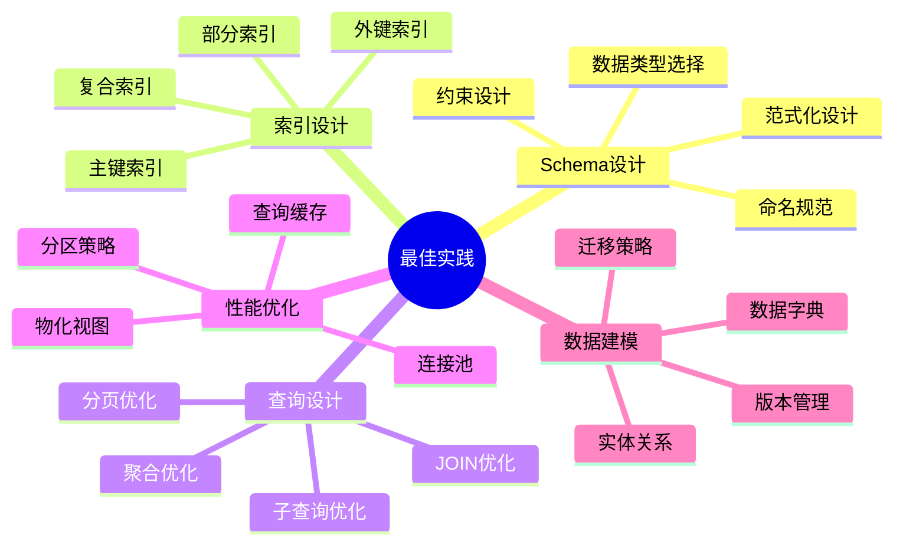
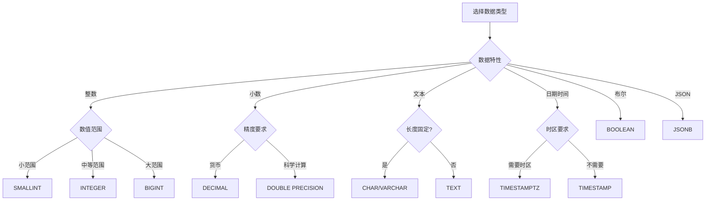
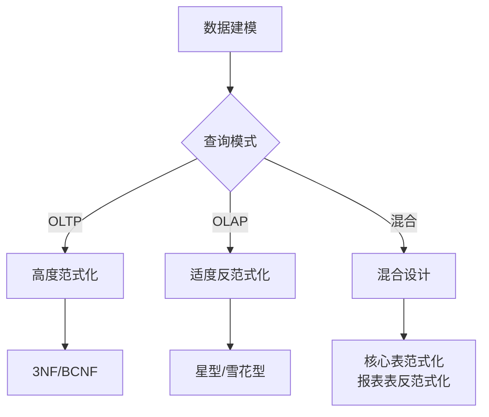
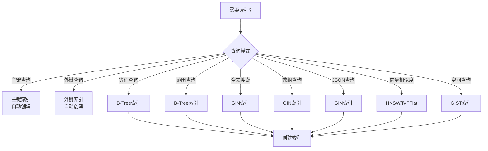
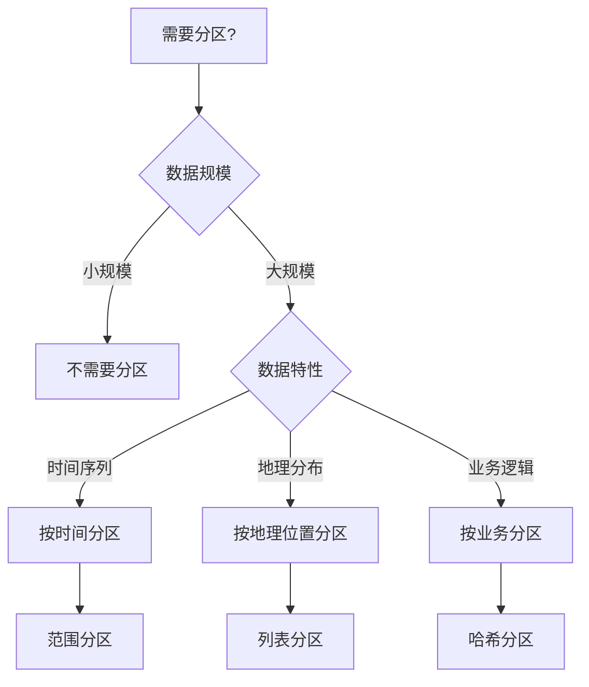
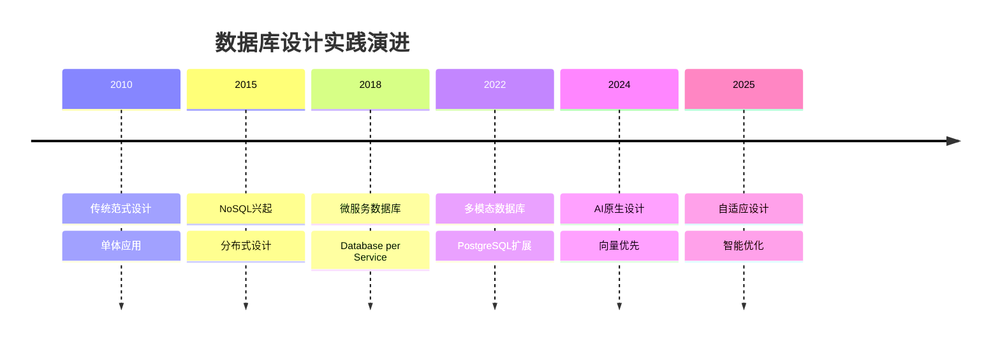
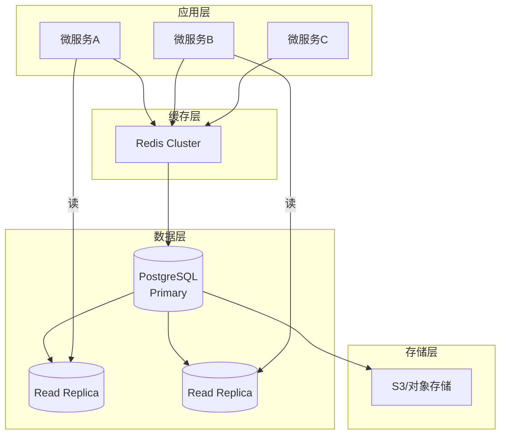

# 数据库设计最佳实践库：从理论到实践

> **创建日期**：2025-01-15
> **最后更新**：2025-12-01
> **版本**：v2.0 (增强版)
> **状态**：已完成 ✅

---

## 📋 目录

- [数据库设计最佳实践库：从理论到实践](#数据库设计最佳实践库从理论到实践)
  - [📋 目录](#-目录)
  - [1. 概述](#1-概述)
    - [1.1. 最佳实践分类](#11-最佳实践分类)
  - [2. Schema设计最佳实践](#2-schema设计最佳实践)
    - [2.1. 命名规范](#21-命名规范)
    - [2.2. 数据类型选择](#22-数据类型选择)
    - [2.3. 约束设计](#23-约束设计)
    - [2.4. 范式化设计](#24-范式化设计)
  - [3. 索引设计最佳实践](#3-索引设计最佳实践)
    - [3.1. 索引选择决策树](#31-索引选择决策树)
    - [3.2. 索引设计最佳实践](#32-索引设计最佳实践)
  - [4. 查询设计最佳实践](#4-查询设计最佳实践)
    - [4.1. JOIN优化](#41-join优化)
    - [4.2. 子查询优化](#42-子查询优化)
    - [4.3. 聚合优化](#43-聚合优化)
    - [4.4. 分页优化](#44-分页优化)
  - [5. 性能优化最佳实践](#5-性能优化最佳实践)
    - [5.1. 分区策略](#51-分区策略)
    - [5.2. 物化视图](#52-物化视图)
  - [6. 数据建模最佳实践](#6-数据建模最佳实践)
    - [6.1. 实体关系设计](#61-实体关系设计)
    - [6.2. 数据字典](#62-数据字典)
  - [7. 安全与合规最佳实践](#7-安全与合规最佳实践)
    - [7.1. 访问控制](#71-访问控制)
    - [7.2. 数据加密](#72-数据加密)
  - [8. 2024-2025最佳实践趋势](#8-2024-2025最佳实践趋势)
    - [8.1. 数据库设计实践演进](#81-数据库设计实践演进)
    - [8.2. 最佳实践优先级矩阵](#82-最佳实践优先级矩阵)
    - [8.3. 现代PostgreSQL最佳实践](#83-现代postgresql最佳实践)
    - [8.4. 云原生数据库最佳实践](#84-云原生数据库最佳实践)
  - [9. 参考资料](#9-参考资料)
    - [9.1. 权威文献](#91-权威文献)
    - [9.2. 在线资源](#92-在线资源)
    - [9.3. 相关文档](#93-相关文档)

---

## 1. 概述

本文档汇集了数据库设计的核心最佳实践，涵盖从Schema设计到性能优化的各个方面。

### 1.1. 最佳实践分类



---

## 2. Schema设计最佳实践

### 2.1. 命名规范

**表命名规范**：

```sql
-- ✅ 好的命名
CREATE TABLE users (
    user_id BIGSERIAL PRIMARY KEY,
    username VARCHAR(50) NOT NULL,
    email VARCHAR(100) NOT NULL
);

CREATE TABLE user_profiles (
    profile_id BIGSERIAL PRIMARY KEY,
    user_id BIGINT NOT NULL REFERENCES users(user_id),
    first_name VARCHAR(100),
    last_name VARCHAR(100)
);

-- ❌ 不好的命名
CREATE TABLE tbl_user ();  -- 不要使用tbl前缀
CREATE TABLE User ();  -- 不要使用大写
CREATE TABLE user_data_table ();  -- 不要使用data_table后缀
```

**列命名规范**：

```sql
-- ✅ 好的命名
CREATE TABLE orders (
    order_id BIGSERIAL PRIMARY KEY,
    customer_id BIGINT NOT NULL,
    order_date TIMESTAMP NOT NULL,
    total_amount DECIMAL(10,2) NOT NULL,
    is_paid BOOLEAN DEFAULT FALSE,
    created_at TIMESTAMP DEFAULT CURRENT_TIMESTAMP,
    updated_at TIMESTAMP DEFAULT CURRENT_TIMESTAMP
);

-- ❌ 不好的命名
CREATE TABLE orders (
    id BIGSERIAL PRIMARY KEY,  -- 不够明确
    cust_id BIGINT,  -- 缩写不清晰
    date TIMESTAMP,  -- 太通用
    amt DECIMAL(10,2),  -- 缩写
    paid BOOLEAN  -- 缺少is_前缀
);
```

### 2.2. 数据类型选择

**数据类型选择决策树**：



**数据类型最佳实践**：

```sql
-- ✅ 好的数据类型选择
CREATE TABLE products (
    product_id BIGSERIAL PRIMARY KEY,  -- 使用BIGSERIAL支持大ID
    sku VARCHAR(50) NOT NULL UNIQUE,  -- 固定长度使用VARCHAR
    name VARCHAR(200) NOT NULL,
    description TEXT,  -- 可变长度使用TEXT
    price DECIMAL(10,2) NOT NULL,  -- 货币使用DECIMAL
    stock_quantity INTEGER NOT NULL DEFAULT 0,
    is_active BOOLEAN DEFAULT TRUE,
    metadata JSONB,  -- 结构化数据使用JSONB
    created_at TIMESTAMPTZ DEFAULT CURRENT_TIMESTAMP,  -- 使用TIMESTAMPTZ
    updated_at TIMESTAMPTZ DEFAULT CURRENT_TIMESTAMP
);

-- ❌ 不好的数据类型选择
CREATE TABLE products (
    id INT PRIMARY KEY,  -- 可能溢出
    sku CHAR(50),  -- 固定长度浪费空间
    description VARCHAR(10000),  -- 应该用TEXT
    price FLOAT,  -- 精度问题
    stock SMALLINT,  -- 可能不够
    active CHAR(1),  -- 应该用BOOLEAN
    metadata TEXT,  -- 应该用JSONB
    created_at TIMESTAMP  -- 缺少时区
);
```

### 2.3. 约束设计

**约束设计最佳实践**：

```sql
-- ✅ 完整的约束设计
CREATE TABLE orders (
    order_id BIGSERIAL PRIMARY KEY,
    customer_id BIGINT NOT NULL REFERENCES customers(customer_id) ON DELETE RESTRICT,
    order_number VARCHAR(50) NOT NULL UNIQUE,
    order_date TIMESTAMP NOT NULL DEFAULT CURRENT_TIMESTAMP,
    total_amount DECIMAL(10,2) NOT NULL CHECK (total_amount >= 0),
    status VARCHAR(20) NOT NULL CHECK (status IN ('pending', 'processing', 'shipped', 'delivered', 'cancelled')),
    created_at TIMESTAMP NOT NULL DEFAULT CURRENT_TIMESTAMP,
    updated_at TIMESTAMP NOT NULL DEFAULT CURRENT_TIMESTAMP,

    -- 表级约束
    CONSTRAINT orders_customer_date_unique UNIQUE (customer_id, order_date)
);

-- 创建更新时间触发器
CREATE OR REPLACE FUNCTION update_updated_at_column()
RETURNS TRIGGER AS $$
BEGIN
    NEW.updated_at = CURRENT_TIMESTAMP;
    RETURN NEW;
END;
$$ LANGUAGE plpgsql;

CREATE TRIGGER update_orders_updated_at
BEFORE UPDATE ON orders
FOR EACH ROW
EXECUTE FUNCTION update_updated_at_column();
```

### 2.4. 范式化设计

**范式化决策树**：



**范式化最佳实践**：

```sql
-- ✅ 范式化设计（3NF）
CREATE TABLE customers (
    customer_id BIGSERIAL PRIMARY KEY,
    email VARCHAR(100) NOT NULL UNIQUE,
    name VARCHAR(200) NOT NULL
);

CREATE TABLE addresses (
    address_id BIGSERIAL PRIMARY KEY,
    customer_id BIGINT NOT NULL REFERENCES customers(customer_id),
    address_type VARCHAR(20) NOT NULL CHECK (address_type IN ('billing', 'shipping')),
    street VARCHAR(200) NOT NULL,
    city VARCHAR(100) NOT NULL,
    state VARCHAR(50) NOT NULL,
    zip_code VARCHAR(20) NOT NULL,
    country VARCHAR(50) NOT NULL DEFAULT 'USA',
    is_default BOOLEAN DEFAULT FALSE,
    UNIQUE(customer_id, address_type)
);

CREATE TABLE orders (
    order_id BIGSERIAL PRIMARY KEY,
    customer_id BIGINT NOT NULL REFERENCES customers(customer_id),
    shipping_address_id BIGINT NOT NULL REFERENCES addresses(address_id),
    billing_address_id BIGINT NOT NULL REFERENCES addresses(address_id),
    order_date TIMESTAMP NOT NULL DEFAULT CURRENT_TIMESTAMP,
    total_amount DECIMAL(10,2) NOT NULL
);
```

---

## 3. 索引设计最佳实践

### 3.1. 索引选择决策树



### 3.2. 索引设计最佳实践

**主键索引**：

```sql
-- ✅ 好的主键设计
CREATE TABLE users (
    user_id BIGSERIAL PRIMARY KEY,  -- 使用BIGSERIAL支持大ID
    email VARCHAR(100) NOT NULL UNIQUE,
    username VARCHAR(50) NOT NULL UNIQUE
);

-- 复合主键（如果需要）
CREATE TABLE order_items (
    order_id BIGINT NOT NULL REFERENCES orders(order_id),
    product_id BIGINT NOT NULL REFERENCES products(product_id),
    quantity INTEGER NOT NULL CHECK (quantity > 0),
    unit_price DECIMAL(10,2) NOT NULL,
    PRIMARY KEY (order_id, product_id)  -- 复合主键
);
```

**外键索引**：

```sql
-- ✅ 外键自动创建索引
CREATE TABLE orders (
    order_id BIGSERIAL PRIMARY KEY,
    customer_id BIGINT NOT NULL REFERENCES customers(customer_id),  -- 自动创建索引
    status VARCHAR(20) NOT NULL
);

-- 如果需要额外的外键索引（多列外键）
CREATE TABLE order_items (
    order_id BIGINT NOT NULL REFERENCES orders(order_id),
    product_id BIGINT NOT NULL REFERENCES products(product_id),
    PRIMARY KEY (order_id, product_id)
);

-- 为外键列创建复合索引（如果需要）
CREATE INDEX idx_orders_customer_status
ON orders(customer_id, status);
```

**复合索引**：

```sql
-- ✅ 好的复合索引设计
CREATE TABLE orders (
    order_id BIGSERIAL PRIMARY KEY,
    customer_id BIGINT NOT NULL,
    order_date TIMESTAMP NOT NULL,
    status VARCHAR(20) NOT NULL,
    total_amount DECIMAL(10,2) NOT NULL
);

-- 复合索引：支持多列查询
CREATE INDEX idx_orders_customer_date
ON orders(customer_id, order_date DESC);

-- 覆盖索引：包含查询所需的所有列
CREATE INDEX idx_orders_customer_status_covering
ON orders(customer_id, status)
INCLUDE (order_date, total_amount);

-- ❌ 不好的索引设计
CREATE INDEX idx_orders_all ON orders(customer_id, order_date, status, total_amount);  -- 索引太大
```

**部分索引**：

```sql
-- ✅ 部分索引：只索引活跃数据
CREATE INDEX idx_orders_active
ON orders(customer_id, order_date)
WHERE status = 'active';

-- 部分索引：排除NULL值
CREATE INDEX idx_orders_with_discount
ON orders(customer_id, total_amount)
WHERE discount_amount IS NOT NULL;

-- 部分索引：只索引最近数据
CREATE INDEX idx_orders_recent
ON orders(customer_id, order_date)
WHERE order_date >= CURRENT_DATE - INTERVAL '1 year';
```

**表达式索引**：

```sql
-- ✅ 表达式索引：支持函数查询
CREATE INDEX idx_users_email_lower
ON users(LOWER(email));

-- 使用索引的查询
SELECT * FROM users WHERE LOWER(email) = LOWER('user@example.com');

-- 表达式索引：支持JSON查询
CREATE INDEX idx_products_metadata_category
ON products((metadata->>'category'));

-- 使用索引的查询
SELECT * FROM products WHERE metadata->>'category' = 'electronics';
```

---

## 4. 查询设计最佳实践

### 4.1. JOIN优化

**JOIN优化最佳实践**：

```sql
-- ✅ 好的JOIN设计
-- 1. 使用INNER JOIN而不是WHERE子句
SELECT
    o.order_id,
    o.order_date,
    c.customer_name,
    c.email
FROM orders o
INNER JOIN customers c ON o.customer_id = c.customer_id
WHERE o.order_date >= CURRENT_DATE - INTERVAL '30 days';

-- 2. 确保JOIN列有索引
CREATE INDEX idx_orders_customer ON orders(customer_id);
CREATE INDEX idx_customers_id ON customers(customer_id);  -- 主键自动有索引

-- 3. 使用EXPLAIN ANALYZE分析查询计划
EXPLAIN ANALYZE
SELECT o.*, c.customer_name
FROM orders o
INNER JOIN customers c ON o.customer_id = c.customer_id
WHERE o.status = 'pending';

-- ❌ 不好的JOIN设计
-- 1. 使用WHERE子句代替JOIN
SELECT o.*, c.customer_name
FROM orders o, customers c
WHERE o.customer_id = c.customer_id;  -- 旧式语法

-- 2. 缺少索引
SELECT o.*, c.customer_name
FROM orders o
INNER JOIN customers c ON o.customer_id = c.customer_id;  -- customer_id没有索引
```

### 4.2. 子查询优化

**子查询优化最佳实践**：

```sql
-- ✅ 使用EXISTS代替IN（当只需要检查存在性时）
SELECT customer_id, customer_name
FROM customers c
WHERE EXISTS (
    SELECT 1 FROM orders o
    WHERE o.customer_id = c.customer_id
      AND o.order_date >= CURRENT_DATE - INTERVAL '30 days'
);

-- ❌ 使用IN（性能较差）
SELECT customer_id, customer_name
FROM customers
WHERE customer_id IN (
    SELECT customer_id FROM orders
    WHERE order_date >= CURRENT_DATE - INTERVAL '30 days'
);

-- ✅ 使用JOIN代替子查询（当需要关联数据时）
SELECT DISTINCT c.customer_id, c.customer_name
FROM customers c
INNER JOIN orders o ON c.customer_id = o.customer_id
WHERE o.order_date >= CURRENT_DATE - INTERVAL '30 days';

-- ✅ 使用LATERAL JOIN（当子查询依赖外层查询时）
SELECT
    c.customer_id,
    c.customer_name,
    recent_orders.order_id,
    recent_orders.order_date
FROM customers c
CROSS JOIN LATERAL (
    SELECT order_id, order_date
    FROM orders
    WHERE customer_id = c.customer_id
    ORDER BY order_date DESC
    LIMIT 5
) AS recent_orders;
```

### 4.3. 聚合优化

**聚合优化最佳实践**：

```sql
-- ✅ 使用GROUP BY优化
-- 1. 确保GROUP BY列有索引
CREATE INDEX idx_orders_customer_date
ON orders(customer_id, order_date);

SELECT
    customer_id,
    COUNT(*) AS order_count,
    SUM(total_amount) AS total_spent,
    AVG(total_amount) AS avg_order_value
FROM orders
WHERE order_date >= CURRENT_DATE - INTERVAL '1 year'
GROUP BY customer_id;

-- 2. 使用HAVING过滤聚合结果（而不是子查询）
SELECT
    customer_id,
    COUNT(*) AS order_count,
    SUM(total_amount) AS total_spent
FROM orders
GROUP BY customer_id
HAVING COUNT(*) >= 5 AND SUM(total_amount) >= 1000;

-- ❌ 不好的聚合设计
-- 使用子查询过滤聚合结果
SELECT customer_id, order_count, total_spent
FROM (
    SELECT
        customer_id,
        COUNT(*) AS order_count,
        SUM(total_amount) AS total_spent
    FROM orders
    GROUP BY customer_id
) subq
WHERE order_count >= 5 AND total_spent >= 1000;
```

### 4.4. 分页优化

**分页优化最佳实践**：

```sql
-- ✅ 使用OFFSET/LIMIT（小数据集）
SELECT order_id, order_date, total_amount
FROM orders
WHERE customer_id = 123
ORDER BY order_date DESC
LIMIT 20 OFFSET 0;

-- ✅ 使用游标分页（大数据集）
-- 第一页
SELECT order_id, order_date, total_amount
FROM orders
WHERE customer_id = 123
ORDER BY order_date DESC, order_id DESC
LIMIT 20;

-- 后续页（使用上一页的最后一条记录的order_date和order_id）
SELECT order_id, order_date, total_amount
FROM orders
WHERE customer_id = 123
  AND (order_date < '2024-01-15' OR (order_date = '2024-01-15' AND order_id < 456))
ORDER BY order_date DESC, order_id DESC
LIMIT 20;

-- ❌ 不好的分页设计（大数据集使用OFFSET）
SELECT order_id, order_date, total_amount
FROM orders
WHERE customer_id = 123
ORDER BY order_date DESC
LIMIT 20 OFFSET 10000;  -- 性能很差
```

---

## 5. 性能优化最佳实践

### 5.1. 分区策略

**分区选择决策树**：



**分区最佳实践**：

```sql
-- ✅ 时间序列数据分区
CREATE TABLE orders (
    order_id BIGSERIAL,
    customer_id BIGINT NOT NULL,
    order_date TIMESTAMP NOT NULL,
    total_amount DECIMAL(10,2) NOT NULL,
    PRIMARY KEY (order_id, order_date)
) PARTITION BY RANGE (order_date);

-- 创建分区
CREATE TABLE orders_2024_q1
PARTITION OF orders
FOR VALUES FROM ('2024-01-01') TO ('2024-04-01');

CREATE TABLE orders_2024_q2
PARTITION OF orders
FOR VALUES FROM ('2024-04-01') TO ('2024-07-01');

-- 自动创建未来分区的函数
CREATE OR REPLACE FUNCTION create_monthly_partitions(
    p_table_name TEXT,
    p_start_date DATE,
    p_months_ahead INTEGER DEFAULT 12
)
RETURNS VOID AS $$
DECLARE
    v_date DATE;
    v_partition_name TEXT;
    v_start_date DATE;
    v_end_date DATE;
BEGIN
    v_date := p_start_date;

    FOR i IN 1..p_months_ahead LOOP
        v_start_date := date_trunc('month', v_date);
        v_end_date := v_start_date + INTERVAL '1 month';
        v_partition_name := p_table_name || '_' || to_char(v_start_date, 'YYYY_MM');

        EXECUTE format(
            'CREATE TABLE IF NOT EXISTS %I PARTITION OF %I FOR VALUES FROM (%L) TO (%L)',
            v_partition_name,
            p_table_name,
            v_start_date,
            v_end_date
        );

        v_date := v_end_date;
    END LOOP;
END;
$$ LANGUAGE plpgsql;
```

### 5.2. 物化视图

**物化视图最佳实践**：

```sql
-- ✅ 创建物化视图
CREATE MATERIALIZED VIEW mv_customer_order_summary AS
SELECT
    c.customer_id,
    c.customer_name,
    COUNT(o.order_id) AS total_orders,
    SUM(o.total_amount) AS total_spent,
    AVG(o.total_amount) AS avg_order_value,
    MAX(o.order_date) AS last_order_date
FROM customers c
LEFT JOIN orders o ON c.customer_id = o.customer_id
GROUP BY c.customer_id, c.customer_name;

-- 创建索引
CREATE INDEX idx_mv_customer_order_summary_customer
ON mv_customer_order_summary(customer_id);

-- 刷新物化视图
REFRESH MATERIALIZED VIEW CONCURRENTLY mv_customer_order_summary;

-- 自动刷新物化视图的函数
CREATE OR REPLACE FUNCTION refresh_materialized_views()
RETURNS VOID AS $$
BEGIN
    REFRESH MATERIALIZED VIEW CONCURRENTLY mv_customer_order_summary;
    -- 可以添加更多物化视图
END;
$$ LANGUAGE plpgsql;

-- 使用pg_cron定期刷新（需要安装扩展）
-- SELECT cron.schedule('refresh-mv', '0 * * * *', 'SELECT refresh_materialized_views()');
```

---

## 6. 数据建模最佳实践

### 6.1. 实体关系设计

**ER设计最佳实践**：

```sql
-- ✅ 清晰的实体关系设计
-- 1. 明确的实体
CREATE TABLE customers (
    customer_id BIGSERIAL PRIMARY KEY,
    email VARCHAR(100) NOT NULL UNIQUE,
    name VARCHAR(200) NOT NULL
);

CREATE TABLE products (
    product_id BIGSERIAL PRIMARY KEY,
    sku VARCHAR(50) NOT NULL UNIQUE,
    name VARCHAR(200) NOT NULL,
    price DECIMAL(10,2) NOT NULL
);

-- 2. 明确的关联表
CREATE TABLE order_items (
    order_id BIGINT NOT NULL REFERENCES orders(order_id) ON DELETE CASCADE,
    product_id BIGINT NOT NULL REFERENCES products(product_id) ON DELETE RESTRICT,
    quantity INTEGER NOT NULL CHECK (quantity > 0),
    unit_price DECIMAL(10,2) NOT NULL,
    PRIMARY KEY (order_id, product_id)
);

-- 3. 软删除设计
CREATE TABLE customers (
    customer_id BIGSERIAL PRIMARY KEY,
    email VARCHAR(100) NOT NULL UNIQUE,
    name VARCHAR(200) NOT NULL,
    deleted_at TIMESTAMP NULL,
    CONSTRAINT customers_email_unique_when_active
        UNIQUE NULLS NOT DISTINCT (email, deleted_at)
);

-- 查询时排除已删除记录
CREATE INDEX idx_customers_active
ON customers(customer_id)
WHERE deleted_at IS NULL;
```

### 6.2. 数据字典

**数据字典最佳实践**：

```sql
-- ✅ 使用COMMENT创建数据字典
COMMENT ON TABLE customers IS '客户信息表，存储所有注册客户的基本信息';
COMMENT ON COLUMN customers.customer_id IS '客户唯一标识符，自增主键';
COMMENT ON COLUMN customers.email IS '客户邮箱地址，用于登录和通知，唯一约束';
COMMENT ON COLUMN customers.name IS '客户姓名，显示名称';

COMMENT ON TABLE orders IS '订单表，存储所有订单信息';
COMMENT ON COLUMN orders.order_id IS '订单唯一标识符，自增主键';
COMMENT ON COLUMN orders.customer_id IS '客户ID，外键关联customers表';
COMMENT ON COLUMN orders.total_amount IS '订单总金额，单位：元，精度：2位小数';

-- 查询数据字典
SELECT
    t.table_name,
    c.column_name,
    c.data_type,
    c.column_default,
    c.is_nullable,
    obj_description(c.oid, 'pg_class') AS table_comment,
    col_description(c.oid, c.ordinal_position) AS column_comment
FROM information_schema.tables t
JOIN information_schema.columns c ON t.table_name = c.table_name
WHERE t.table_schema = 'public'
ORDER BY t.table_name, c.ordinal_position;
```

---

## 7. 安全与合规最佳实践

### 7.1. 访问控制

**访问控制最佳实践**：

```sql
-- ✅ 创建角色和权限
-- 1. 创建只读角色
CREATE ROLE read_only_user;
GRANT CONNECT ON DATABASE mydb TO read_only_user;
GRANT USAGE ON SCHEMA public TO read_only_user;
GRANT SELECT ON ALL TABLES IN SCHEMA public TO read_only_user;
ALTER DEFAULT PRIVILEGES IN SCHEMA public GRANT SELECT ON TABLES TO read_only_user;

-- 2. 创建应用角色
CREATE ROLE app_user;
GRANT CONNECT ON DATABASE mydb TO app_user;
GRANT USAGE ON SCHEMA public TO app_user;
GRANT SELECT, INSERT, UPDATE ON ALL TABLES IN SCHEMA public TO app_user;
ALTER DEFAULT PRIVILEGES IN SCHEMA public
    GRANT SELECT, INSERT, UPDATE ON TABLES TO app_user;

-- 3. 创建用户并分配角色
CREATE USER app_user_1 WITH PASSWORD 'secure_password';
GRANT app_user TO app_user_1;
```

### 7.2. 数据加密

**数据加密最佳实践**：

```sql
-- ✅ 使用pgcrypto扩展加密敏感数据
CREATE EXTENSION IF NOT EXISTS pgcrypto;

-- 加密存储
CREATE TABLE users (
    user_id BIGSERIAL PRIMARY KEY,
    username VARCHAR(50) NOT NULL UNIQUE,
    email VARCHAR(100) NOT NULL,
    password_hash TEXT NOT NULL,  -- 使用bcrypt哈希
    credit_card_encrypted BYTEA,  -- 加密存储信用卡号
    ssn_encrypted BYTEA  -- 加密存储SSN
);

-- 加密函数
CREATE OR REPLACE FUNCTION encrypt_sensitive_data(data TEXT, key TEXT)
RETURNS BYTEA AS $$
BEGIN
    RETURN pgp_sym_encrypt(data, key);
END;
$$ LANGUAGE plpgsql;

-- 解密函数
CREATE OR REPLACE FUNCTION decrypt_sensitive_data(encrypted_data BYTEA, key TEXT)
RETURNS TEXT AS $$
BEGIN
    RETURN pgp_sym_decrypt(encrypted_data, key);
END;
$$ LANGUAGE plpgsql;
```

---

## 8. 2024-2025最佳实践趋势

### 8.1. 数据库设计实践演进



### 8.2. 最佳实践优先级矩阵

| 实践领域 | 重要性 | 紧迫性 | 投资回报 | 2025优先级 |
|---------|--------|--------|---------|-----------|
| **向量索引** | 高 | 高 | 高 | P0 |
| **多租户RLS** | 高 | 中 | 高 | P0 |
| **JSONB优化** | 中 | 中 | 中 | P1 |
| **分区策略** | 高 | 中 | 高 | P1 |
| **CDC实现** | 中 | 低 | 中 | P2 |

### 8.3. 现代PostgreSQL最佳实践

```sql
-- 2025 PostgreSQL最佳实践示例

-- 1. 向量+全文混合索引
CREATE TABLE modern_docs (
    id UUID PRIMARY KEY DEFAULT gen_random_uuid(),
    content TEXT NOT NULL,
    content_tsv tsvector GENERATED ALWAYS AS (to_tsvector('english', content)) STORED,
    embedding vector(1536),
    metadata JSONB DEFAULT '{}',
    created_at TIMESTAMPTZ DEFAULT CURRENT_TIMESTAMP
);

CREATE INDEX idx_docs_fts ON modern_docs USING gin (content_tsv);
CREATE INDEX idx_docs_vec ON modern_docs USING ivfflat (embedding vector_cosine_ops);
CREATE INDEX idx_docs_meta ON modern_docs USING gin (metadata jsonb_path_ops);

-- 2. 声明式分区+自动管理
CREATE TABLE events (
    id BIGSERIAL,
    event_type VARCHAR(50),
    payload JSONB,
    created_at TIMESTAMPTZ NOT NULL
) PARTITION BY RANGE (created_at);

-- 自动分区管理扩展
SELECT create_parent('public.events', 'created_at', 'native', 'monthly');

-- 3. 行级安全+审计
ALTER TABLE modern_docs ENABLE ROW LEVEL SECURITY;

CREATE POLICY tenant_isolation ON modern_docs
    USING (metadata->>'tenant_id' = current_setting('app.tenant_id'));

-- 4. 高级约束
ALTER TABLE modern_docs ADD CONSTRAINT check_embedding_dim
    CHECK (array_length(embedding::real[], 1) = 1536);
```

### 8.4. 云原生数据库最佳实践



---

## 9. 参考资料

### 9.1. 权威文献

**数据库设计**：

- Kleppmann, M. "Designing Data-Intensive Applications"
- PostgreSQL Global Development Group "PostgreSQL Documentation"

### 9.2. 在线资源

| 资源 | URL | 描述 |
|------|-----|------|
| **PostgreSQL Wiki** | <https://wiki.postgresql.org/> | 社区知识 |
| **Use The Index, Luke** | <https://use-the-index-luke.com/> | 索引指南 |
| **pganalyze** | <https://pganalyze.com/docs> | 性能分析 |

### 9.3. 相关文档

- [07.01-Schema设计方法论](./07.01-Schema设计方法论.md)
- [07.06-数据库设计反模式与解决方案](./07.06-数据库设计反模式与解决方案.md)
- [07.08-数据库性能调优实战](./07.08-数据库性能调优实战.md)

---

**最后更新**：2025-12-01
**维护者**：Data-Science Team
**状态**：已完成 ✅
**版本**：v2.0 (增强版)
