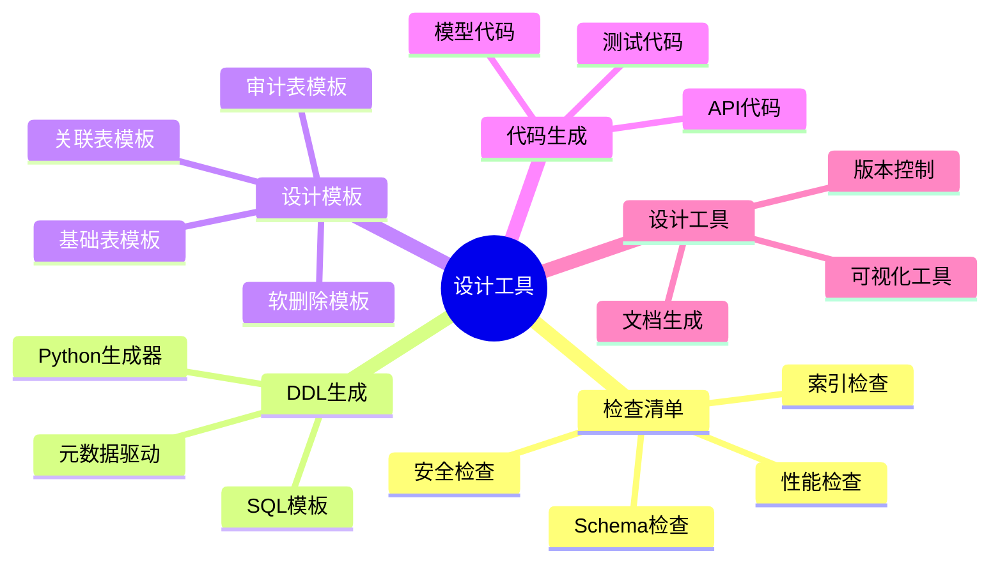
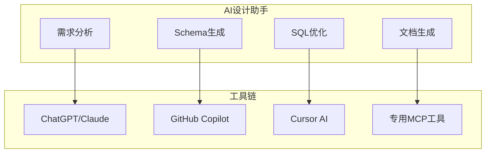

# 数据库设计工具与模板库：实用工具集合

> **创建日期**：2025-01-15
> **最后更新**：2025-12-01
> **版本**：v2.0 (增强版)
> **状态**：已完成 ✅

---

## 📋 目录

- [数据库设计工具与模板库：实用工具集合](#数据库设计工具与模板库实用工具集合)
  - [📋 目录](#-目录)
  - [1. 概述](#1-概述)
    - [1.1. 工具分类](#11-工具分类)
  - [2. Schema设计检查清单](#2-schema设计检查清单)
    - [2.1. Schema设计检查清单](#21-schema设计检查清单)
  - [Schema设计检查清单](#schema设计检查清单)
    - [命名规范](#命名规范)
    - [数据类型](#数据类型)
    - [约束设计](#约束设计)
    - [索引设计](#索引设计)
    - [性能优化](#性能优化)
    - [安全设计](#安全设计)
    - [文档](#文档)
    - [2.2. 索引设计检查清单](#22-索引设计检查清单)
  - [索引设计检查清单](#索引设计检查清单)
    - [索引创建原则](#索引创建原则)
    - [索引类型选择](#索引类型选择)
    - [索引维护](#索引维护)
    - [2.3. 性能检查清单](#23-性能检查清单)
  - [3. DDL生成工具](#3-ddl生成工具)
    - [3.1. Python DDL生成器](#31-python-ddl生成器)
    - [3.2. SQL模板库](#32-sql模板库)
  - [4. 数据库设计模板](#4-数据库设计模板)
    - [4.1. 用户认证系统模板](#41-用户认证系统模板)
    - [4.2. 多租户系统模板](#42-多租户系统模板)
  - [5. 代码生成工具](#5-代码生成工具)
    - [5.1. Python模型生成器](#51-python模型生成器)
  - [6. 数据库设计工具](#6-数据库设计工具)
    - [6.1. Schema验证工具](#61-schema验证工具)
    - [6.2. 数据库文档生成工具](#62-数据库文档生成工具)
  - [7. 2024-2025新增工具](#7-2024-2025新增工具)
    - [7.1. AI辅助设计工具](#71-ai辅助设计工具)
    - [7.2. 现代设计工具对比](#72-现代设计工具对比)
    - [7.3. MCP数据库工具](#73-mcp数据库工具)
  - [8. 参考资料](#8-参考资料)
    - [8.1. 在线资源](#81-在线资源)
    - [8.2. 相关文档](#82-相关文档)

---

## 1. 概述

本文档提供数据库设计的实用工具、模板和检查清单，帮助快速、规范地进行数据库设计。

### 1.1. 工具分类



---

## 2. Schema设计检查清单

### 2.1. Schema设计检查清单

**完整检查清单**：

## Schema设计检查清单

### 命名规范

**表命名规范**：

- **表名使用复数形式**：使用复数形式命名表，如 `users`、`orders`、`products`，表示表的集合性质
- **表名使用小写字母和下划线**：使用小写字母和下划线分隔单词，如 `user_profiles`、`order_items`
- **列名清晰明确**：列名应该清晰明确，不使用缩写，如使用 `user_name` 而不是 `uname`
- **主键命名规范**：主键命名为 `{table}_id`，如 `user_id`、`order_id`
- **外键命名规范**：外键命名为 `{referenced_table}_id`，如 `user_id`、`product_id`
- **布尔字段命名**：布尔字段使用 `is_` 或 `has_` 前缀，如 `is_active`、`has_permission`
- **时间字段命名**：时间字段使用 `_at` 后缀，如 `created_at`、`updated_at`、`deleted_at`

**示例**：

```sql
-- 好的命名示例
CREATE TABLE users (
    user_id BIGSERIAL PRIMARY KEY,
    user_name VARCHAR(100) NOT NULL,
    email VARCHAR(255) NOT NULL,
    is_active BOOLEAN DEFAULT TRUE,
    created_at TIMESTAMPTZ DEFAULT NOW(),
    updated_at TIMESTAMPTZ DEFAULT NOW()
);

-- 不好的命名示例
CREATE TABLE user (  -- 应该使用复数
    id SERIAL,  -- 应该使用 user_id
    name VARCHAR(100),  -- 应该使用 user_name
    active BOOLEAN,  -- 应该使用 is_active
    create_time TIMESTAMP  -- 应该使用 created_at
);
```

### 数据类型

**数据类型选择规范**：

- **主键类型**：主键使用 `BIGSERIAL`（PostgreSQL）或 `BIGINT AUTO_INCREMENT`（MySQL），支持大ID，避免溢出
- **货币类型**：货币使用 `DECIMAL(10,2)` 或 `NUMERIC(10,2)`，确保精度，避免浮点数误差
- **文本类型**：文本使用 `VARCHAR(n)`（固定长度）或 `TEXT`（可变长度），根据实际需求选择
- **时间戳类型**：时间戳使用 `TIMESTAMPTZ`（PostgreSQL）或 `TIMESTAMP`（MySQL），需要时区时使用带时区的类型
- **布尔类型**：布尔值使用 `BOOLEAN`，而不是 `INTEGER` 或 `CHAR(1)`
- **JSON数据**：JSON数据使用 `JSONB`（PostgreSQL）或 `JSON`（MySQL），支持高效查询和索引

**示例**：

```sql
-- 好的数据类型选择
CREATE TABLE products (
    product_id BIGSERIAL PRIMARY KEY,
    product_name VARCHAR(255) NOT NULL,
    description TEXT,
    price DECIMAL(10,2) NOT NULL,
    is_available BOOLEAN DEFAULT TRUE,
    metadata JSONB,
    created_at TIMESTAMPTZ DEFAULT NOW()
);

-- 不好的数据类型选择
CREATE TABLE products (
    id INTEGER,  -- 应该使用 BIGSERIAL
    name CHAR(100),  -- 应该使用 VARCHAR(255)
    price FLOAT,  -- 应该使用 DECIMAL(10,2)
    available INTEGER,  -- 应该使用 BOOLEAN
    created_at TIMESTAMP  -- 应该使用 TIMESTAMPTZ
);
```

### 约束设计

**约束设计规范**：

- **主键约束**：所有表都应该有主键，确保每行数据的唯一标识
- **外键约束**：外键都应该有 `REFERENCES` 约束，确保参照完整性
- **外键删除策略**：外键应该有 `ON DELETE` 策略（`RESTRICT`、`CASCADE`、`SET NULL`），根据业务需求选择
- **唯一约束**：唯一约束使用 `UNIQUE`，确保列值的唯一性
- **检查约束**：检查约束使用 `CHECK`，确保列值满足特定条件
- **非空约束**：`NOT NULL` 约束应该明确指定，确保列值不为空

**示例**：

```sql
-- 好的约束设计
CREATE TABLE orders (
    order_id BIGSERIAL PRIMARY KEY,
    user_id BIGINT NOT NULL REFERENCES users(user_id) ON DELETE RESTRICT,
    order_number VARCHAR(50) UNIQUE NOT NULL,
    total_amount DECIMAL(10,2) NOT NULL CHECK (total_amount >= 0),
    status VARCHAR(20) NOT NULL CHECK (status IN ('pending', 'processing', 'completed', 'cancelled')),
    created_at TIMESTAMPTZ NOT NULL DEFAULT NOW()
);

-- 不好的约束设计
CREATE TABLE orders (
    id SERIAL,  -- 缺少 PRIMARY KEY
    user_id INTEGER,  -- 缺少 REFERENCES 约束
    order_number VARCHAR(50),  -- 缺少 UNIQUE 约束
    total_amount DECIMAL(10,2),  -- 缺少 CHECK 约束
    status VARCHAR(20)  -- 缺少 CHECK 约束
);
```

### 索引设计

**索引设计规范**：

- **主键索引**：主键自动创建索引，无需手动创建
- **外键索引**：外键应该自动创建索引，提高JOIN查询性能
- **常用查询列索引**：常用查询列应该有索引，特别是WHERE子句中的列
- **复合索引列顺序**：复合索引列顺序应该合理，高选择性列在前
- **部分索引**：部分索引用于过滤条件，减少索引大小
- **覆盖索引**：覆盖索引包含查询所需列，避免回表查询

**示例**：

```sql
-- 好的索引设计
CREATE TABLE orders (
    order_id BIGSERIAL PRIMARY KEY,  -- 主键自动创建索引
    user_id BIGINT NOT NULL REFERENCES users(user_id),
    order_date DATE NOT NULL,
    status VARCHAR(20) NOT NULL,
    total_amount DECIMAL(10,2) NOT NULL
);

-- 为常用查询列创建索引
CREATE INDEX idx_orders_user_id ON orders(user_id);  -- 外键索引
CREATE INDEX idx_orders_order_date ON orders(order_date);  -- 日期查询索引
CREATE INDEX idx_orders_status ON orders(status);  -- 状态查询索引

-- 复合索引（高选择性列在前）
CREATE INDEX idx_orders_user_date ON orders(user_id, order_date);

-- 部分索引（只索引活跃订单）
CREATE INDEX idx_orders_active ON orders(order_id) WHERE status = 'pending';

-- 覆盖索引（包含查询所需列）
CREATE INDEX idx_orders_user_status_amount ON orders(user_id, status) INCLUDE (total_amount);
```

### 性能优化

**性能优化规范**：

- **大表分区**：大表使用分区（时间序列数据），提高查询性能和管理效率
- **物化视图**：常用查询使用物化视图，预计算查询结果
- **统计信息更新**：统计信息定期更新（`ANALYZE`），确保查询优化器使用准确的统计信息
- **索引维护**：索引定期维护（`REINDEX`），重建碎片化的索引

**示例**：

```sql
-- 大表分区（按月分区）
CREATE TABLE orders (
    order_id BIGSERIAL,
    user_id BIGINT NOT NULL,
    order_date DATE NOT NULL,
    total_amount DECIMAL(10,2) NOT NULL,
    PRIMARY KEY (order_id, order_date)
) PARTITION BY RANGE (order_date);

CREATE TABLE orders_2024_01 PARTITION OF orders
    FOR VALUES FROM ('2024-01-01') TO ('2024-02-01');

CREATE TABLE orders_2024_02 PARTITION OF orders
    FOR VALUES FROM ('2024-02-01') TO ('2024-03-01');

-- 物化视图（预计算查询结果）
CREATE MATERIALIZED VIEW monthly_sales AS
SELECT
    DATE_TRUNC('month', order_date) AS month,
    COUNT(*) AS order_count,
    SUM(total_amount) AS total_sales
FROM orders
GROUP BY DATE_TRUNC('month', order_date);

-- 定期刷新物化视图
REFRESH MATERIALIZED VIEW CONCURRENTLY monthly_sales;

-- 定期更新统计信息
ANALYZE orders;

-- 定期重建索引
REINDEX TABLE orders;
```

### 安全设计

**安全设计规范**：

- **敏感数据加密**：敏感数据加密存储，使用 `pgcrypto` 扩展或应用层加密
- **密码哈希**：密码使用哈希存储，使用 `bcrypt` 或 `argon2` 等安全哈希算法
- **访问控制**：访问控制使用角色和权限，实现细粒度的权限管理
- **审计字段**：审计字段记录操作（`created_at`、`updated_at`、`created_by`、`updated_by`）
- **软删除**：软删除使用 `deleted_at` 字段，而不是物理删除

**示例**：

```sql
-- 敏感数据加密
CREATE EXTENSION IF NOT EXISTS pgcrypto;

CREATE TABLE users (
    user_id BIGSERIAL PRIMARY KEY,
    user_name VARCHAR(100) NOT NULL,
    email VARCHAR(255) NOT NULL,
    password_hash TEXT NOT NULL,  -- 使用 bcrypt 哈希
    phone_number TEXT,  -- 加密存储
    created_at TIMESTAMPTZ NOT NULL DEFAULT NOW(),
    updated_at TIMESTAMPTZ NOT NULL DEFAULT NOW(),
    deleted_at TIMESTAMPTZ  -- 软删除
);

-- 密码哈希函数（应用层实现）
-- password_hash = bcrypt.hash(password, salt_rounds=12)

-- 敏感数据加密函数
CREATE OR REPLACE FUNCTION encrypt_phone(phone TEXT)
RETURNS TEXT AS $$
BEGIN
    RETURN pgp_sym_encrypt(phone, current_setting('app.encryption_key'));
END;
$$ LANGUAGE plpgsql;

-- 访问控制（RLS策略）
ALTER TABLE users ENABLE ROW LEVEL SECURITY;

CREATE POLICY user_access_policy ON users
    FOR ALL
    TO authenticated_users
    USING (user_id = current_user_id());
```

### 文档

**文档规范**：

- **表注释**：表应该有 `COMMENT` 说明，描述表的用途和业务含义
- **列注释**：列应该有 `COMMENT` 说明，描述列的用途和数据类型
- **约束注释**：复杂约束应该有注释说明，解释约束的业务含义
- **数据字典**：数据字典应该完整，包含所有表和列的说明

**示例**：

```sql
-- 表注释
COMMENT ON TABLE users IS '用户表，存储系统用户的基本信息';

-- 列注释
COMMENT ON COLUMN users.user_id IS '用户ID，主键，自增';
COMMENT ON COLUMN users.user_name IS '用户名，唯一，用于登录';
COMMENT ON COLUMN users.email IS '用户邮箱，唯一，用于登录和通知';
COMMENT ON COLUMN users.password_hash IS '密码哈希值，使用bcrypt算法';
COMMENT ON COLUMN users.created_at IS '创建时间，自动设置';
COMMENT ON COLUMN users.updated_at IS '更新时间，自动更新';
COMMENT ON COLUMN users.deleted_at IS '删除时间，软删除标记';

-- 约束注释
COMMENT ON CONSTRAINT users_email_key ON users IS '邮箱唯一约束，确保每个邮箱只能注册一个账户';
COMMENT ON CONSTRAINT users_user_name_check ON users IS '用户名长度检查，确保用户名长度在3-50字符之间';
```

### 2.2. 索引设计检查清单

**索引检查清单**：

## 索引设计检查清单

### 索引创建原则

**索引创建原则**：

- **WHERE子句索引**：为WHERE子句中的列创建索引，特别是频繁查询的列
- **JOIN条件索引**：为JOIN条件创建索引，提高JOIN查询性能
- **ORDER BY索引**：为ORDER BY列创建索引，避免排序操作
- **索引选择性**：索引选择性应该 > 0.1（高选择性），选择性 = 不同值数量 / 总行数
- **查询频率**：查询频率应该 > 写入频率 × 10，确保索引带来的查询性能提升大于写入性能损失

**示例**：

```sql
-- 为WHERE子句创建索引
CREATE INDEX idx_users_email ON users(email);  -- WHERE email = ?
CREATE INDEX idx_orders_status ON orders(status);  -- WHERE status = ?

-- 为JOIN条件创建索引
CREATE INDEX idx_orders_user_id ON orders(user_id);  -- JOIN users ON orders.user_id = users.user_id

-- 为ORDER BY创建索引
CREATE INDEX idx_orders_order_date ON orders(order_date);  -- ORDER BY order_date

-- 检查索引选择性
SELECT
    COUNT(DISTINCT status)::FLOAT / COUNT(*) AS selectivity
FROM orders;
-- 选择性 > 0.1 表示索引有效

-- 检查查询频率 vs 写入频率
SELECT
    schemaname,
    tablename,
    idx_scan AS index_scans,  -- 索引扫描次数
    idx_tup_read AS tuples_read,  -- 读取的元组数
    idx_tup_fetch AS tuples_fetched  -- 获取的元组数
FROM pg_stat_user_indexes
WHERE schemaname = 'public'
ORDER BY idx_scan DESC;
```

### 索引类型选择

**索引类型选择规范**：

- **B-Tree索引**：B-Tree索引用于等值和范围查询，是默认索引类型
- **GIN索引**：GIN索引用于全文搜索、数组、JSON，支持多值查询
- **GiST索引**：GiST索引用于空间数据，支持空间查询
- **HNSW索引**：HNSW索引用于向量相似度搜索，支持高维向量检索
- **部分索引**：部分索引用于过滤条件，只索引满足条件的行

**示例**：

```sql
-- B-Tree索引（默认，等值和范围查询）
CREATE INDEX idx_users_email ON users(email);
CREATE INDEX idx_orders_order_date ON orders(order_date);

-- GIN索引（全文搜索、数组、JSON）
CREATE INDEX idx_products_tags_gin ON products USING GIN(tags);
CREATE INDEX idx_products_metadata_gin ON products USING GIN(metadata);

-- GiST索引（空间数据）
CREATE INDEX idx_locations_geom_gist ON locations USING GIST(geom);

-- HNSW索引（向量相似度搜索）
CREATE INDEX idx_products_embedding_hnsw ON products USING hnsw(embedding vector_cosine_ops);

-- 部分索引（只索引活跃订单）
CREATE INDEX idx_orders_active ON orders(order_id) WHERE status = 'pending';
```

### 索引维护

**索引维护规范**：

- **定期检查索引使用情况**：定期检查索引使用情况，识别未使用的索引
- **删除未使用的索引**：删除未使用的索引，减少存储空间和维护开销
- **重建碎片化的索引**：重建碎片化的索引，提高查询性能
- **更新统计信息**：更新统计信息（`ANALYZE`），确保查询优化器使用准确的统计信息

**示例**：

```sql
-- 检查索引使用情况
SELECT
    schemaname,
    tablename,
    indexname,
    idx_scan AS index_scans,
    idx_tup_read AS tuples_read,
    idx_tup_fetch AS tuples_fetched
FROM pg_stat_user_indexes
WHERE schemaname = 'public'
ORDER BY idx_scan ASC;  -- 扫描次数少的索引可能是未使用的

-- 检查未使用的索引（扫描次数为0）
SELECT
    schemaname,
    tablename,
    indexname,
    idx_scan
FROM pg_stat_user_indexes
WHERE schemaname = 'public'
  AND idx_scan = 0
  AND indexname NOT LIKE '%_pkey';  -- 排除主键索引

-- 删除未使用的索引
DROP INDEX IF EXISTS idx_unused_index;

-- 重建碎片化的索引
REINDEX INDEX CONCURRENTLY idx_orders_order_date;

-- 更新统计信息
ANALYZE orders;
```

### 2.3. 性能检查清单

**性能检查清单**：

```markdown
## 性能检查清单

### 查询性能
- [ ] 慢查询已优化（< 100ms）
- [ ] 使用 EXPLAIN ANALYZE 分析查询计划
- [ ] 避免全表扫描
- [ ] JOIN 操作使用索引
- [ ] 子查询已优化（使用 JOIN 或 EXISTS）
- [ ] 分页查询使用游标分页（大数据集）

### 索引性能
- [ ] 索引大小合理（< 表大小的 50%）
- [ ] 索引使用率高（> 80%）
- [ ] 复合索引列顺序合理
- [ ] 部分索引减少索引大小

### 表设计性能
- [ ] 表大小合理（考虑分区）
- [ ] 列顺序优化（常用列在前）
- [ ] 数据类型选择合理（减少存储空间）
- [ ] 范式化程度合理（平衡查询和更新性能）
```

---

## 3. DDL生成工具

### 3.1. Python DDL生成器

**基础DDL生成器**：

```python
"""
数据库DDL生成器
支持从Python对象生成PostgreSQL DDL语句
"""

from typing import List, Optional, Dict
from enum import Enum

class DataType(Enum):
    """数据类型枚举"""
    BIGSERIAL = "BIGSERIAL"
    BIGINT = "BIGINT"
    INTEGER = "INTEGER"
    VARCHAR = "VARCHAR"
    TEXT = "TEXT"
    DECIMAL = "DECIMAL"
    BOOLEAN = "BOOLEAN"
    TIMESTAMP = "TIMESTAMP"
    TIMESTAMPTZ = "TIMESTAMPTZ"
    JSONB = "JSONB"
    UUID = "UUID"

class Column:
    """列定义"""
    def __init__(
        self,
        name: str,
        data_type: DataType,
        nullable: bool = True,
        default: Optional[str] = None,
        unique: bool = False,
        check: Optional[str] = None,
        comment: Optional[str] = None
    ):
        self.name = name
        self.data_type = data_type
        self.nullable = nullable
        self.default = default
        self.unique = unique
        self.check = check
        self.comment = comment

    def to_ddl(self) -> str:
        """生成列DDL"""
        ddl = f"{self.name} {self.data_type.value}"

        if not self.nullable:
            ddl += " NOT NULL"

        if self.default:
            ddl += f" DEFAULT {self.default}"

        if self.unique:
            ddl += " UNIQUE"

        if self.check:
            ddl += f" CHECK ({self.check})"

        return ddl

class ForeignKey:
    """外键定义"""
    def __init__(
        self,
        columns: List[str],
        references_table: str,
        referenced_columns: List[str],
        on_delete: str = "RESTRICT",
        on_update: str = "RESTRICT"
    ):
        self.columns = columns
        self.references_table = references_table
        self.referenced_columns = referenced_columns
        self.on_delete = on_delete
        self.on_update = on_update

    def to_ddl(self) -> str:
        """生成外键DDL"""
        cols = ", ".join(self.columns)
        ref_cols = ", ".join(self.referenced_columns)
        return (
            f"FOREIGN KEY ({cols}) "
            f"REFERENCES {self.references_table}({ref_cols}) "
            f"ON DELETE {self.on_delete} "
            f"ON UPDATE {self.on_update}"
        )

class Table:
    """表定义"""
    def __init__(
        self,
        name: str,
        columns: List[Column],
        primary_key: Optional[List[str]] = None,
        foreign_keys: Optional[List[ForeignKey]] = None,
        indexes: Optional[List[Dict]] = None,
        comment: Optional[str] = None
    ):
        self.name = name
        self.columns = columns
        self.primary_key = primary_key
        self.foreign_keys = foreign_keys or []
        self.indexes = indexes or []
        self.comment = comment

    def to_ddl(self) -> str:
        """生成表DDL"""
        ddl_parts = []

        # CREATE TABLE
        ddl_parts.append(f"CREATE TABLE {self.name} (")

        # Columns
        column_ddls = [f"    {col.to_ddl()}" for col in self.columns]
        ddl_parts.append(",\n".join(column_ddls))

        # Primary Key
        if self.primary_key:
            pk_cols = ", ".join(self.primary_key)
            ddl_parts.append(f",\n    PRIMARY KEY ({pk_cols})")

        # Foreign Keys
        for fk in self.foreign_keys:
            ddl_parts.append(f",\n    {fk.to_ddl()}")

        ddl_parts.append("\n);")

        # Comment
        if self.comment:
            ddl_parts.append(f"\nCOMMENT ON TABLE {self.name} IS '{self.comment}';")

        # Column Comments
        for col in self.columns:
            if col.comment:
                ddl_parts.append(
                    f"\nCOMMENT ON COLUMN {self.name}.{col.name} IS '{col.comment}';"
                )

        # Indexes
        for idx in self.indexes:
            idx_name = idx.get('name', f"idx_{self.name}_{'_'.join(idx['columns'])}")
            idx_cols = ", ".join(idx['columns'])
            idx_type = idx.get('type', 'BTREE')
            idx_where = idx.get('where')

            idx_ddl = f"CREATE INDEX {idx_name} ON {self.name} USING {idx_type} ({idx_cols})"
            if idx_where:
                idx_ddl += f" WHERE {idx_where}"
            idx_ddl += ";"
            ddl_parts.append(f"\n{idx_ddl}")

        return "\n".join(ddl_parts)

# 使用示例
def generate_users_table():
    """生成用户表DDL"""
    table = Table(
        name="users",
        columns=[
            Column("user_id", DataType.BIGSERIAL, nullable=False, comment="用户ID"),
            Column("username", DataType.VARCHAR, nullable=False, unique=True, comment="用户名"),
            Column("email", DataType.VARCHAR, nullable=False, unique=True, comment="邮箱"),
            Column("password_hash", DataType.TEXT, nullable=False, comment="密码哈希"),
            Column("is_active", DataType.BOOLEAN, default="TRUE", comment="是否激活"),
            Column("created_at", DataType.TIMESTAMPTZ, default="CURRENT_TIMESTAMP", comment="创建时间"),
            Column("updated_at", DataType.TIMESTAMPTZ, default="CURRENT_TIMESTAMP", comment="更新时间")
        ],
        primary_key=["user_id"],
        indexes=[
            {"columns": ["username"], "type": "BTREE"},
            {"columns": ["email"], "type": "BTREE"},
            {"columns": ["is_active"], "type": "BTREE", "where": "is_active = TRUE"}
        ],
        comment="用户表，存储所有注册用户信息"
    )
    return table.to_ddl()

if __name__ == "__main__":
    print(generate_users_table())
```

### 3.2. SQL模板库

**常用表模板**：

```sql
-- ============================================
-- 基础表模板（带审计字段）
-- ============================================
CREATE TABLE {table_name} (
    {table_name}_id BIGSERIAL PRIMARY KEY,
    -- 业务字段
    {business_columns}
    -- 审计字段
    created_at TIMESTAMPTZ NOT NULL DEFAULT CURRENT_TIMESTAMP,
    created_by BIGINT REFERENCES users(user_id),
    updated_at TIMESTAMPTZ NOT NULL DEFAULT CURRENT_TIMESTAMP,
    updated_by BIGINT REFERENCES users(user_id),
    deleted_at TIMESTAMPTZ NULL,
    version INTEGER NOT NULL DEFAULT 1
);

-- 创建更新时间触发器
CREATE TRIGGER update_{table_name}_updated_at
BEFORE UPDATE ON {table_name}
FOR EACH ROW
EXECUTE FUNCTION update_updated_at_column();

-- 创建软删除索引
CREATE INDEX idx_{table_name}_deleted_at
ON {table_name}(deleted_at)
WHERE deleted_at IS NULL;

-- ============================================
-- 关联表模板
-- ============================================
CREATE TABLE {table1}_{table2} (
    {table1}_id BIGINT NOT NULL REFERENCES {table1}({table1}_id) ON DELETE CASCADE,
    {table2}_id BIGINT NOT NULL REFERENCES {table2}({table2}_id) ON DELETE CASCADE,
    created_at TIMESTAMPTZ NOT NULL DEFAULT CURRENT_TIMESTAMP,
    PRIMARY KEY ({table1}_id, {table2}_id)
);

CREATE INDEX idx_{table1}_{table2}_{table1} ON {table1}_{table2}({table1}_id);
CREATE INDEX idx_{table1}_{table2}_{table2} ON {table1}_{table2}({table2}_id);

-- ============================================
-- 日志表模板
-- ============================================
CREATE TABLE {table_name}_logs (
    log_id BIGSERIAL PRIMARY KEY,
    {table_name}_id BIGINT NOT NULL REFERENCES {table_name}({table_name}_id),
    action VARCHAR(20) NOT NULL CHECK (action IN ('INSERT', 'UPDATE', 'DELETE')),
    old_data JSONB,
    new_data JSONB,
    changed_fields TEXT[],
    changed_by BIGINT REFERENCES users(user_id),
    changed_at TIMESTAMPTZ NOT NULL DEFAULT CURRENT_TIMESTAMP
) PARTITION BY RANGE (changed_at);

CREATE INDEX idx_{table_name}_logs_{table_name}_id
ON {table_name}_logs({table_name}_id, changed_at DESC);
```

---

## 4. 数据库设计模板

### 4.1. 用户认证系统模板

**完整的用户认证系统Schema**：

```sql
-- ============================================
-- 用户认证系统模板
-- ============================================

-- 用户表
CREATE TABLE users (
    user_id BIGSERIAL PRIMARY KEY,
    username VARCHAR(50) NOT NULL UNIQUE,
    email VARCHAR(100) NOT NULL UNIQUE,
    password_hash TEXT NOT NULL,
    email_verified BOOLEAN DEFAULT FALSE,
    is_active BOOLEAN DEFAULT TRUE,
    last_login_at TIMESTAMPTZ,
    created_at TIMESTAMPTZ NOT NULL DEFAULT CURRENT_TIMESTAMP,
    updated_at TIMESTAMPTZ NOT NULL DEFAULT CURRENT_TIMESTAMP
);

CREATE INDEX idx_users_email ON users(email);
CREATE INDEX idx_users_username ON users(username);
CREATE INDEX idx_users_active ON users(user_id) WHERE is_active = TRUE;

-- 角色表
CREATE TABLE roles (
    role_id SERIAL PRIMARY KEY,
    role_name VARCHAR(50) NOT NULL UNIQUE,
    description TEXT,
    created_at TIMESTAMPTZ NOT NULL DEFAULT CURRENT_TIMESTAMP
);

-- 用户角色关联表
CREATE TABLE user_roles (
    user_id BIGINT NOT NULL REFERENCES users(user_id) ON DELETE CASCADE,
    role_id INTEGER NOT NULL REFERENCES roles(role_id) ON DELETE CASCADE,
    assigned_at TIMESTAMPTZ NOT NULL DEFAULT CURRENT_TIMESTAMP,
    assigned_by BIGINT REFERENCES users(user_id),
    PRIMARY KEY (user_id, role_id)
);

CREATE INDEX idx_user_roles_user ON user_roles(user_id);
CREATE INDEX idx_user_roles_role ON user_roles(role_id);

-- 权限表
CREATE TABLE permissions (
    permission_id SERIAL PRIMARY KEY,
    permission_name VARCHAR(100) NOT NULL UNIQUE,
    resource VARCHAR(100) NOT NULL,
    action VARCHAR(50) NOT NULL,
    description TEXT,
    created_at TIMESTAMPTZ NOT NULL DEFAULT CURRENT_TIMESTAMP
);

-- 角色权限关联表
CREATE TABLE role_permissions (
    role_id INTEGER NOT NULL REFERENCES roles(role_id) ON DELETE CASCADE,
    permission_id INTEGER NOT NULL REFERENCES permissions(permission_id) ON DELETE CASCADE,
    PRIMARY KEY (role_id, permission_id)
);

-- 会话表
CREATE TABLE sessions (
    session_id UUID PRIMARY KEY DEFAULT gen_random_uuid(),
    user_id BIGINT NOT NULL REFERENCES users(user_id) ON DELETE CASCADE,
    token_hash TEXT NOT NULL,
    expires_at TIMESTAMPTZ NOT NULL,
    ip_address INET,
    user_agent TEXT,
    created_at TIMESTAMPTZ NOT NULL DEFAULT CURRENT_TIMESTAMP,
    last_accessed_at TIMESTAMPTZ NOT NULL DEFAULT CURRENT_TIMESTAMP
);

CREATE INDEX idx_sessions_user ON sessions(user_id);
CREATE INDEX idx_sessions_expires ON sessions(expires_at);
CREATE INDEX idx_sessions_token ON sessions(token_hash);

-- 密码重置令牌表
CREATE TABLE password_reset_tokens (
    token_id BIGSERIAL PRIMARY KEY,
    user_id BIGINT NOT NULL REFERENCES users(user_id) ON DELETE CASCADE,
    token_hash TEXT NOT NULL UNIQUE,
    expires_at TIMESTAMPTZ NOT NULL,
    used_at TIMESTAMPTZ,
    created_at TIMESTAMPTZ NOT NULL DEFAULT CURRENT_TIMESTAMP
);

CREATE INDEX idx_password_reset_tokens_user ON password_reset_tokens(user_id);
CREATE INDEX idx_password_reset_tokens_token ON password_reset_tokens(token_hash);
CREATE INDEX idx_password_reset_tokens_expires ON password_reset_tokens(expires_at);
```

### 4.2. 多租户系统模板

**多租户系统Schema模板**：

```sql
-- ============================================
-- 多租户系统模板
-- ============================================

-- 租户表
CREATE TABLE tenants (
    tenant_id BIGSERIAL PRIMARY KEY,
    tenant_name VARCHAR(200) NOT NULL,
    tenant_slug VARCHAR(100) NOT NULL UNIQUE,
    domain VARCHAR(200),
    plan VARCHAR(50) NOT NULL CHECK (plan IN ('free', 'basic', 'premium', 'enterprise')),
    is_active BOOLEAN DEFAULT TRUE,
    subscription_expires_at TIMESTAMPTZ,
    created_at TIMESTAMPTZ NOT NULL DEFAULT CURRENT_TIMESTAMP,
    updated_at TIMESTAMPTZ NOT NULL DEFAULT CURRENT_TIMESTAMP
);

CREATE INDEX idx_tenants_slug ON tenants(tenant_slug);
CREATE INDEX idx_tenants_domain ON tenants(domain);
CREATE INDEX idx_tenants_active ON tenants(tenant_id) WHERE is_active = TRUE;

-- 租户用户关联表
CREATE TABLE tenant_users (
    tenant_id BIGINT NOT NULL REFERENCES tenants(tenant_id) ON DELETE CASCADE,
    user_id BIGINT NOT NULL REFERENCES users(user_id) ON DELETE CASCADE,
    role VARCHAR(50) NOT NULL CHECK (role IN ('owner', 'admin', 'member', 'viewer')),
    joined_at TIMESTAMPTZ NOT NULL DEFAULT CURRENT_TIMESTAMP,
    PRIMARY KEY (tenant_id, user_id)
);

CREATE INDEX idx_tenant_users_tenant ON tenant_users(tenant_id);
CREATE INDEX idx_tenant_users_user ON tenant_users(user_id);

-- 多租户数据表模板（添加tenant_id）
CREATE TABLE {table_name} (
    {table_name}_id BIGSERIAL PRIMARY KEY,
    tenant_id BIGINT NOT NULL REFERENCES tenants(tenant_id) ON DELETE CASCADE,
    -- 业务字段
    {business_columns}
    created_at TIMESTAMPTZ NOT NULL DEFAULT CURRENT_TIMESTAMP,
    updated_at TIMESTAMPTZ NOT NULL DEFAULT CURRENT_TIMESTAMP
);

-- 创建租户隔离索引
CREATE INDEX idx_{table_name}_tenant ON {table_name}(tenant_id);
CREATE INDEX idx_{table_name}_tenant_created ON {table_name}(tenant_id, created_at DESC);

-- 行级安全策略（PostgreSQL）
ALTER TABLE {table_name} ENABLE ROW LEVEL SECURITY;

CREATE POLICY {table_name}_tenant_isolation ON {table_name}
    FOR ALL
    TO application_user
    USING (tenant_id = current_setting('app.current_tenant_id')::BIGINT);
```

---

## 5. 代码生成工具

### 5.1. Python模型生成器

**从数据库Schema生成Python模型**：

```python
"""
从PostgreSQL Schema生成Python SQLAlchemy模型
"""

import re
from typing import List, Dict

def generate_sqlalchemy_model(table_name: str, columns: List[Dict]) -> str:
    """生成SQLAlchemy模型代码"""

    model_class_name = ''.join(word.capitalize() for word in table_name.split('_'))

    lines = [
        f"from sqlalchemy import Column, Integer, String, Boolean, DateTime, ForeignKey, Text, Numeric",
        f"from sqlalchemy.ext.declarative import declarative_base",
        f"from sqlalchemy.orm import relationship",
        f"from datetime import datetime",
        "",
        "Base = declarative_base()",
        "",
        f"class {model_class_name}(Base):",
        f'    __tablename__ = "{table_name}"',
        ""
    ]

    # 生成列定义
    for col in columns:
        col_name = col['name']
        col_type = col['type']
        nullable = col.get('nullable', True)
        default = col.get('default')
        primary_key = col.get('primary_key', False)
        foreign_key = col.get('foreign_key')

        # 类型映射
        type_mapping = {
            'BIGSERIAL': 'Integer',
            'BIGINT': 'Integer',
            'INTEGER': 'Integer',
            'VARCHAR': 'String',
            'TEXT': 'Text',
            'DECIMAL': 'Numeric',
            'BOOLEAN': 'Boolean',
            'TIMESTAMP': 'DateTime',
            'TIMESTAMPTZ': 'DateTime',
            'JSONB': 'JSON'
        }

        sqlalchemy_type = type_mapping.get(col_type, 'String')

        # 构建列定义
        col_def = f"    {col_name} = Column("
        col_def += f"{sqlalchemy_type}"

        if not nullable:
            col_def += ", nullable=False"

        if primary_key:
            col_def += ", primary_key=True"

        if default:
            if default == 'CURRENT_TIMESTAMP':
                col_def += ", default=datetime.utcnow"
            else:
                col_def += f", default={default}"

        if foreign_key:
            col_def += f", ForeignKey('{foreign_key}')"

        col_def += ")"
        lines.append(col_def)

    lines.append("")
    lines.append("    def __repr__(self):")
    lines.append(f'        return f"<{model_class_name}(id={{self.{table_name}_id}})>"')

    return "\n".join(lines)

# 使用示例
columns = [
    {"name": "user_id", "type": "BIGSERIAL", "nullable": False, "primary_key": True},
    {"name": "username", "type": "VARCHAR", "nullable": False, "default": None},
    {"name": "email", "type": "VARCHAR", "nullable": False, "default": None},
    {"name": "created_at", "type": "TIMESTAMPTZ", "nullable": False, "default": "CURRENT_TIMESTAMP"}
]

print(generate_sqlalchemy_model("users", columns))
```

---

## 6. 数据库设计工具

### 6.1. Schema验证工具

**Schema验证函数**：

```sql
-- ============================================
-- Schema验证工具
-- ============================================

-- 检查表是否有主键
CREATE OR REPLACE FUNCTION check_table_has_primary_key(p_table_name TEXT)
RETURNS BOOLEAN AS $$
DECLARE
    v_has_pk BOOLEAN;
BEGIN
    SELECT EXISTS(
        SELECT 1
        FROM information_schema.table_constraints
        WHERE table_schema = 'public'
          AND table_name = p_table_name
          AND constraint_type = 'PRIMARY KEY'
    ) INTO v_has_pk;

    RETURN v_has_pk;
END;
$$ LANGUAGE plpgsql;

-- 检查外键是否有索引
CREATE OR REPLACE FUNCTION check_foreign_keys_have_indexes()
RETURNS TABLE (
    table_name TEXT,
    constraint_name TEXT,
    columns TEXT,
    has_index BOOLEAN
) AS $$
BEGIN
    RETURN QUERY
    SELECT
        tc.table_name::TEXT,
        tc.constraint_name::TEXT,
        string_agg(kcu.column_name, ', ' ORDER BY kcu.ordinal_position)::TEXT AS columns,
        EXISTS(
            SELECT 1
            FROM pg_indexes pi
            WHERE pi.tablename = tc.table_name
              AND pi.indexdef LIKE '%' || kcu.column_name || '%'
        ) AS has_index
    FROM information_schema.table_constraints tc
    JOIN information_schema.key_column_usage kcu
        ON tc.constraint_name = kcu.constraint_name
    WHERE tc.constraint_type = 'FOREIGN KEY'
      AND tc.table_schema = 'public'
    GROUP BY tc.table_name, tc.constraint_name
    ORDER BY tc.table_name;
END;
$$ LANGUAGE plpgsql;

-- 检查表是否有注释
CREATE OR REPLACE FUNCTION check_tables_have_comments()
RETURNS TABLE (
    table_name TEXT,
    has_comment BOOLEAN,
    comment TEXT
) AS $$
BEGIN
    RETURN QUERY
    SELECT
        t.table_name::TEXT,
        (obj_description(c.oid, 'pg_class') IS NOT NULL) AS has_comment,
        COALESCE(obj_description(c.oid, 'pg_class'), '')::TEXT AS comment
    FROM information_schema.tables t
    JOIN pg_class c ON c.relname = t.table_name
    WHERE t.table_schema = 'public'
      AND t.table_type = 'BASE TABLE'
    ORDER BY t.table_name;
END;
$$ LANGUAGE plpgsql;
```

### 6.2. 数据库文档生成工具

**自动生成数据库文档**：

```sql
-- ============================================
-- 数据库文档生成工具
-- ============================================

-- 生成表文档
CREATE OR REPLACE FUNCTION generate_table_documentation(p_table_name TEXT)
RETURNS TEXT AS $$
DECLARE
    v_doc TEXT;
    v_table_comment TEXT;
BEGIN
    -- 获取表注释
    SELECT obj_description(c.oid, 'pg_class')
    INTO v_table_comment
    FROM pg_class c
    WHERE c.relname = p_table_name;

    v_doc := format('## %s\n\n', p_table_name);

    IF v_table_comment IS NOT NULL THEN
        v_doc := v_doc || format('%s\n\n', v_table_comment);
    END IF;

    -- 添加列信息
    v_doc := v_doc || '### 列信息\n\n';
    v_doc := v_doc || '| 列名 | 类型 | 可空 | 默认值 | 说明 |\n';
    v_doc := v_doc || '|------|------|------|--------|------|\n';

    FOR rec IN
        SELECT
            c.column_name,
            c.data_type,
            c.is_nullable,
            c.column_default,
            col_description(a.attrelid, a.attnum) AS column_comment
        FROM information_schema.columns c
        JOIN pg_attribute a ON a.attname = c.column_name
        JOIN pg_class pc ON pc.oid = a.attrelid
        WHERE c.table_name = p_table_name
          AND c.table_schema = 'public'
        ORDER BY c.ordinal_position
    LOOP
        v_doc := v_doc || format(
            '| %s | %s | %s | %s | %s |\n',
            rec.column_name,
            rec.data_type,
            rec.is_nullable,
            COALESCE(rec.column_default, '-'),
            COALESCE(rec.column_comment, '-')
        );
    END LOOP;

    RETURN v_doc;
END;
$$ LANGUAGE plpgsql;
```

---

## 7. 2024-2025新增工具

### 7.1. AI辅助设计工具



### 7.2. 现代设计工具对比

| 工具类别 | 工具名称 | 特点 | 适用场景 |
|---------|---------|------|---------|
| **可视化建模** | dbdiagram.io | 在线、代码驱动 | 快速建模 |
| **可视化建模** | pgModeler | 开源、功能全面 | PostgreSQL |
| **迁移管理** | Flyway | Java生态、版本控制 | 企业级 |
| **迁移管理** | Alembic | Python生态、SQLAlchemy | Python项目 |
| **文档生成** | SchemaSpy | 自动生成ER图 | 文档化 |
| **AI辅助** | AI2sql | 自然语言转SQL | 快速开发 |

### 7.3. MCP数据库工具

```python
# MCP数据库设计工具示例
from mcp.server import Server
from mcp.types import Tool, TextContent

server = Server("db-design-tools")

@server.tool("analyze_schema")
async def analyze_schema(schema_sql: str) -> TextContent:
    """分析Schema设计质量"""
    issues = []

    # 检查命名规范
    if not all(name.islower() for name in extract_table_names(schema_sql)):
        issues.append("表名应使用小写")

    # 检查主键
    if "PRIMARY KEY" not in schema_sql.upper():
        issues.append("缺少主键定义")

    # 检查索引
    if "CREATE INDEX" not in schema_sql.upper():
        issues.append("建议添加索引")

    return TextContent(
        type="text",
        text=f"分析结果：\n" + "\n".join(issues) if issues else "Schema设计符合规范"
    )

@server.tool("generate_ddl")
async def generate_ddl(table_spec: dict) -> TextContent:
    """根据规格生成DDL"""
    ddl = f"CREATE TABLE {table_spec['name']} (\n"
    columns = []
    for col in table_spec['columns']:
        col_def = f"    {col['name']} {col['type']}"
        if col.get('not_null'):
            col_def += " NOT NULL"
        if col.get('default'):
            col_def += f" DEFAULT {col['default']}"
        columns.append(col_def)
    ddl += ",\n".join(columns)
    ddl += "\n);"
    return TextContent(type="text", text=ddl)
```

---

## 8. 参考资料

### 8.1. 在线资源

| 资源 | URL | 描述 |
|------|-----|------|
| **dbdiagram.io** | <https://dbdiagram.io> | 在线ER建模 |
| **pgModeler** | <https://pgmodeler.io> | PostgreSQL建模 |
| **Flyway** | <https://flywaydb.org> | 数据库迁移 |
| **SchemaSpy** | <https://schemaspy.org> | 文档生成 |

### 8.2. 相关文档

- [07.01-Schema设计方法论](./07.01-Schema设计方法论.md)
- [07.14-数据库设计最佳实践库](./07.14-数据库设计最佳实践库.md)
- [07.06-数据库设计反模式与解决方案](./07.06-数据库设计反模式与解决方案.md)

---

**最后更新**：2025-12-01
**维护者**：Data-Science Team
**状态**：已完成 ✅
**版本**：v2.0 (增强版)
