# 数据库设计工具与模板库：实用工具集合

> **创建日期**：2025-01-15
> **最后更新**：2025-01-15
> **版本**：v1.0
> **状态**：实施中

---

## 📋 目录

- [数据库设计工具与模板库：实用工具集合](#数据库设计工具与模板库实用工具集合)
  - [📋 目录](#-目录)
  - [1. 概述](#1-概述)
    - [1.1. 工具分类](#11-工具分类)
  - [2. Schema设计检查清单](#2-schema设计检查清单)
    - [2.1. Schema设计检查清单](#21-schema设计检查清单)
    - [2.2. 索引设计检查清单](#22-索引设计检查清单)
    - [2.3. 性能检查清单](#23-性能检查清单)
  - [3. DDL生成工具](#3-ddl生成工具)
    - [3.1. Python DDL生成器](#31-python-ddl生成器)
    - [3.2. SQL模板库](#32-sql模板库)
  - [4. 数据库设计模板](#4-数据库设计模板)
    - [4.1. 用户认证系统模板](#41-用户认证系统模板)
    - [4.2. 多租户系统模板](#42-多租户系统模板)
  - [5. 代码生成工具](#5-代码生成工具)
    - [5.1. Python模型生成器](#51-python模型生成器)
  - [6. 数据库设计工具](#6-数据库设计工具)
    - [6.1. Schema验证工具](#61-schema验证工具)
    - [6.2. 数据库文档生成工具](#62-数据库文档生成工具)
  - [7. 参考资料](#7-参考资料)

---

## 1. 概述

本文档提供数据库设计的实用工具、模板和检查清单，帮助快速、规范地进行数据库设计。

### 1.1. 工具分类

```mermaid
mindmap
  root((设计工具))
    检查清单
      Schema检查
      索引检查
      性能检查
      安全检查
    DDL生成
      Python生成器
      SQL模板
      元数据驱动
    设计模板
      基础表模板
      关联表模板
      审计表模板
      软删除模板
    代码生成
      模型代码
      API代码
      测试代码
    设计工具
      可视化工具
      版本控制
      文档生成
```



---

## 2. Schema设计检查清单

### 2.1. Schema设计检查清单

**完整检查清单**：

```markdown
## Schema设计检查清单

### 命名规范
- [ ] 表名使用复数形式（users, orders）
- [ ] 表名使用小写字母和下划线
- [ ] 列名清晰明确，不使用缩写
- [ ] 主键命名为 `{table}_id`（如 `user_id`）
- [ ] 外键命名为 `{referenced_table}_id`
- [ ] 布尔字段使用 `is_` 或 `has_` 前缀
- [ ] 时间字段使用 `_at` 后缀（created_at, updated_at）

### 数据类型
- [ ] 主键使用 BIGSERIAL（支持大ID）
- [ ] 货币使用 DECIMAL(10,2)
- [ ] 文本使用 VARCHAR（固定长度）或 TEXT（可变长度）
- [ ] 时间戳使用 TIMESTAMPTZ（需要时区）
- [ ] 布尔值使用 BOOLEAN
- [ ] JSON数据使用 JSONB

### 约束设计
- [ ] 所有表都有主键
- [ ] 外键都有 REFERENCES 约束
- [ ] 外键有 ON DELETE 策略（RESTRICT/CASCADE/SET NULL）
- [ ] 唯一约束使用 UNIQUE
- [ ] 检查约束使用 CHECK
- [ ] NOT NULL 约束明确指定

### 索引设计
- [ ] 主键自动创建索引
- [ ] 外键自动创建索引
- [ ] 常用查询列有索引
- [ ] 复合索引列顺序合理（高选择性在前）
- [ ] 部分索引用于过滤条件
- [ ] 覆盖索引包含查询所需列

### 性能优化
- [ ] 大表使用分区（时间序列数据）
- [ ] 常用查询使用物化视图
- [ ] 统计信息定期更新（ANALYZE）
- [ ] 索引定期维护（REINDEX）

### 安全设计
- [ ] 敏感数据加密存储
- [ ] 密码使用哈希存储
- [ ] 访问控制使用角色和权限
- [ ] 审计字段记录操作（created_at, updated_at）
- [ ] 软删除使用 deleted_at 字段

### 文档
- [ ] 表有 COMMENT 说明
- [ ] 列有 COMMENT 说明
- [ ] 复杂约束有注释说明
- [ ] 数据字典完整
```

### 2.2. 索引设计检查清单

**索引检查清单**：

```markdown
## 索引设计检查清单

### 索引创建原则
- [ ] 为 WHERE 子句中的列创建索引
- [ ] 为 JOIN 条件创建索引
- [ ] 为 ORDER BY 列创建索引
- [ ] 索引选择性 > 0.1（高选择性）
- [ ] 查询频率 > 写入频率 × 10

### 索引类型选择
- [ ] B-Tree 索引用于等值和范围查询
- [ ] GIN 索引用于全文搜索、数组、JSON
- [ ] GIST 索引用于空间数据
- [ ] HNSW 索引用于向量相似度搜索
- [ ] 部分索引用于过滤条件

### 索引维护
- [ ] 定期检查索引使用情况
- [ ] 删除未使用的索引
- [ ] 重建碎片化的索引
- [ ] 更新统计信息（ANALYZE）
```

### 2.3. 性能检查清单

**性能检查清单**：

```markdown
## 性能检查清单

### 查询性能
- [ ] 慢查询已优化（< 100ms）
- [ ] 使用 EXPLAIN ANALYZE 分析查询计划
- [ ] 避免全表扫描
- [ ] JOIN 操作使用索引
- [ ] 子查询已优化（使用 JOIN 或 EXISTS）
- [ ] 分页查询使用游标分页（大数据集）

### 索引性能
- [ ] 索引大小合理（< 表大小的 50%）
- [ ] 索引使用率高（> 80%）
- [ ] 复合索引列顺序合理
- [ ] 部分索引减少索引大小

### 表设计性能
- [ ] 表大小合理（考虑分区）
- [ ] 列顺序优化（常用列在前）
- [ ] 数据类型选择合理（减少存储空间）
- [ ] 范式化程度合理（平衡查询和更新性能）
```

---

## 3. DDL生成工具

### 3.1. Python DDL生成器

**基础DDL生成器**：

```python
"""
数据库DDL生成器
支持从Python对象生成PostgreSQL DDL语句
"""

from typing import List, Optional, Dict
from enum import Enum

class DataType(Enum):
    """数据类型枚举"""
    BIGSERIAL = "BIGSERIAL"
    BIGINT = "BIGINT"
    INTEGER = "INTEGER"
    VARCHAR = "VARCHAR"
    TEXT = "TEXT"
    DECIMAL = "DECIMAL"
    BOOLEAN = "BOOLEAN"
    TIMESTAMP = "TIMESTAMP"
    TIMESTAMPTZ = "TIMESTAMPTZ"
    JSONB = "JSONB"
    UUID = "UUID"

class Column:
    """列定义"""
    def __init__(
        self,
        name: str,
        data_type: DataType,
        nullable: bool = True,
        default: Optional[str] = None,
        unique: bool = False,
        check: Optional[str] = None,
        comment: Optional[str] = None
    ):
        self.name = name
        self.data_type = data_type
        self.nullable = nullable
        self.default = default
        self.unique = unique
        self.check = check
        self.comment = comment

    def to_ddl(self) -> str:
        """生成列DDL"""
        ddl = f"{self.name} {self.data_type.value}"

        if not self.nullable:
            ddl += " NOT NULL"

        if self.default:
            ddl += f" DEFAULT {self.default}"

        if self.unique:
            ddl += " UNIQUE"

        if self.check:
            ddl += f" CHECK ({self.check})"

        return ddl

class ForeignKey:
    """外键定义"""
    def __init__(
        self,
        columns: List[str],
        references_table: str,
        referenced_columns: List[str],
        on_delete: str = "RESTRICT",
        on_update: str = "RESTRICT"
    ):
        self.columns = columns
        self.references_table = references_table
        self.referenced_columns = referenced_columns
        self.on_delete = on_delete
        self.on_update = on_update

    def to_ddl(self) -> str:
        """生成外键DDL"""
        cols = ", ".join(self.columns)
        ref_cols = ", ".join(self.referenced_columns)
        return (
            f"FOREIGN KEY ({cols}) "
            f"REFERENCES {self.references_table}({ref_cols}) "
            f"ON DELETE {self.on_delete} "
            f"ON UPDATE {self.on_update}"
        )

class Table:
    """表定义"""
    def __init__(
        self,
        name: str,
        columns: List[Column],
        primary_key: Optional[List[str]] = None,
        foreign_keys: Optional[List[ForeignKey]] = None,
        indexes: Optional[List[Dict]] = None,
        comment: Optional[str] = None
    ):
        self.name = name
        self.columns = columns
        self.primary_key = primary_key
        self.foreign_keys = foreign_keys or []
        self.indexes = indexes or []
        self.comment = comment

    def to_ddl(self) -> str:
        """生成表DDL"""
        ddl_parts = []

        # CREATE TABLE
        ddl_parts.append(f"CREATE TABLE {self.name} (")

        # Columns
        column_ddls = [f"    {col.to_ddl()}" for col in self.columns]
        ddl_parts.append(",\n".join(column_ddls))

        # Primary Key
        if self.primary_key:
            pk_cols = ", ".join(self.primary_key)
            ddl_parts.append(f",\n    PRIMARY KEY ({pk_cols})")

        # Foreign Keys
        for fk in self.foreign_keys:
            ddl_parts.append(f",\n    {fk.to_ddl()}")

        ddl_parts.append("\n);")

        # Comment
        if self.comment:
            ddl_parts.append(f"\nCOMMENT ON TABLE {self.name} IS '{self.comment}';")

        # Column Comments
        for col in self.columns:
            if col.comment:
                ddl_parts.append(
                    f"\nCOMMENT ON COLUMN {self.name}.{col.name} IS '{col.comment}';"
                )

        # Indexes
        for idx in self.indexes:
            idx_name = idx.get('name', f"idx_{self.name}_{'_'.join(idx['columns'])}")
            idx_cols = ", ".join(idx['columns'])
            idx_type = idx.get('type', 'BTREE')
            idx_where = idx.get('where')

            idx_ddl = f"CREATE INDEX {idx_name} ON {self.name} USING {idx_type} ({idx_cols})"
            if idx_where:
                idx_ddl += f" WHERE {idx_where}"
            idx_ddl += ";"
            ddl_parts.append(f"\n{idx_ddl}")

        return "\n".join(ddl_parts)

# 使用示例
def generate_users_table():
    """生成用户表DDL"""
    table = Table(
        name="users",
        columns=[
            Column("user_id", DataType.BIGSERIAL, nullable=False, comment="用户ID"),
            Column("username", DataType.VARCHAR, nullable=False, unique=True, comment="用户名"),
            Column("email", DataType.VARCHAR, nullable=False, unique=True, comment="邮箱"),
            Column("password_hash", DataType.TEXT, nullable=False, comment="密码哈希"),
            Column("is_active", DataType.BOOLEAN, default="TRUE", comment="是否激活"),
            Column("created_at", DataType.TIMESTAMPTZ, default="CURRENT_TIMESTAMP", comment="创建时间"),
            Column("updated_at", DataType.TIMESTAMPTZ, default="CURRENT_TIMESTAMP", comment="更新时间")
        ],
        primary_key=["user_id"],
        indexes=[
            {"columns": ["username"], "type": "BTREE"},
            {"columns": ["email"], "type": "BTREE"},
            {"columns": ["is_active"], "type": "BTREE", "where": "is_active = TRUE"}
        ],
        comment="用户表，存储所有注册用户信息"
    )
    return table.to_ddl()

if __name__ == "__main__":
    print(generate_users_table())
```

### 3.2. SQL模板库

**常用表模板**：

```sql
-- ============================================
-- 基础表模板（带审计字段）
-- ============================================
CREATE TABLE {table_name} (
    {table_name}_id BIGSERIAL PRIMARY KEY,
    -- 业务字段
    {business_columns}
    -- 审计字段
    created_at TIMESTAMPTZ NOT NULL DEFAULT CURRENT_TIMESTAMP,
    created_by BIGINT REFERENCES users(user_id),
    updated_at TIMESTAMPTZ NOT NULL DEFAULT CURRENT_TIMESTAMP,
    updated_by BIGINT REFERENCES users(user_id),
    deleted_at TIMESTAMPTZ NULL,
    version INTEGER NOT NULL DEFAULT 1
);

-- 创建更新时间触发器
CREATE TRIGGER update_{table_name}_updated_at
BEFORE UPDATE ON {table_name}
FOR EACH ROW
EXECUTE FUNCTION update_updated_at_column();

-- 创建软删除索引
CREATE INDEX idx_{table_name}_deleted_at
ON {table_name}(deleted_at)
WHERE deleted_at IS NULL;

-- ============================================
-- 关联表模板
-- ============================================
CREATE TABLE {table1}_{table2} (
    {table1}_id BIGINT NOT NULL REFERENCES {table1}({table1}_id) ON DELETE CASCADE,
    {table2}_id BIGINT NOT NULL REFERENCES {table2}({table2}_id) ON DELETE CASCADE,
    created_at TIMESTAMPTZ NOT NULL DEFAULT CURRENT_TIMESTAMP,
    PRIMARY KEY ({table1}_id, {table2}_id)
);

CREATE INDEX idx_{table1}_{table2}_{table1} ON {table1}_{table2}({table1}_id);
CREATE INDEX idx_{table1}_{table2}_{table2} ON {table1}_{table2}({table2}_id);

-- ============================================
-- 日志表模板
-- ============================================
CREATE TABLE {table_name}_logs (
    log_id BIGSERIAL PRIMARY KEY,
    {table_name}_id BIGINT NOT NULL REFERENCES {table_name}({table_name}_id),
    action VARCHAR(20) NOT NULL CHECK (action IN ('INSERT', 'UPDATE', 'DELETE')),
    old_data JSONB,
    new_data JSONB,
    changed_fields TEXT[],
    changed_by BIGINT REFERENCES users(user_id),
    changed_at TIMESTAMPTZ NOT NULL DEFAULT CURRENT_TIMESTAMP
) PARTITION BY RANGE (changed_at);

CREATE INDEX idx_{table_name}_logs_{table_name}_id
ON {table_name}_logs({table_name}_id, changed_at DESC);
```

---

## 4. 数据库设计模板

### 4.1. 用户认证系统模板

**完整的用户认证系统Schema**：

```sql
-- ============================================
-- 用户认证系统模板
-- ============================================

-- 用户表
CREATE TABLE users (
    user_id BIGSERIAL PRIMARY KEY,
    username VARCHAR(50) NOT NULL UNIQUE,
    email VARCHAR(100) NOT NULL UNIQUE,
    password_hash TEXT NOT NULL,
    email_verified BOOLEAN DEFAULT FALSE,
    is_active BOOLEAN DEFAULT TRUE,
    last_login_at TIMESTAMPTZ,
    created_at TIMESTAMPTZ NOT NULL DEFAULT CURRENT_TIMESTAMP,
    updated_at TIMESTAMPTZ NOT NULL DEFAULT CURRENT_TIMESTAMP
);

CREATE INDEX idx_users_email ON users(email);
CREATE INDEX idx_users_username ON users(username);
CREATE INDEX idx_users_active ON users(user_id) WHERE is_active = TRUE;

-- 角色表
CREATE TABLE roles (
    role_id SERIAL PRIMARY KEY,
    role_name VARCHAR(50) NOT NULL UNIQUE,
    description TEXT,
    created_at TIMESTAMPTZ NOT NULL DEFAULT CURRENT_TIMESTAMP
);

-- 用户角色关联表
CREATE TABLE user_roles (
    user_id BIGINT NOT NULL REFERENCES users(user_id) ON DELETE CASCADE,
    role_id INTEGER NOT NULL REFERENCES roles(role_id) ON DELETE CASCADE,
    assigned_at TIMESTAMPTZ NOT NULL DEFAULT CURRENT_TIMESTAMP,
    assigned_by BIGINT REFERENCES users(user_id),
    PRIMARY KEY (user_id, role_id)
);

CREATE INDEX idx_user_roles_user ON user_roles(user_id);
CREATE INDEX idx_user_roles_role ON user_roles(role_id);

-- 权限表
CREATE TABLE permissions (
    permission_id SERIAL PRIMARY KEY,
    permission_name VARCHAR(100) NOT NULL UNIQUE,
    resource VARCHAR(100) NOT NULL,
    action VARCHAR(50) NOT NULL,
    description TEXT,
    created_at TIMESTAMPTZ NOT NULL DEFAULT CURRENT_TIMESTAMP
);

-- 角色权限关联表
CREATE TABLE role_permissions (
    role_id INTEGER NOT NULL REFERENCES roles(role_id) ON DELETE CASCADE,
    permission_id INTEGER NOT NULL REFERENCES permissions(permission_id) ON DELETE CASCADE,
    PRIMARY KEY (role_id, permission_id)
);

-- 会话表
CREATE TABLE sessions (
    session_id UUID PRIMARY KEY DEFAULT gen_random_uuid(),
    user_id BIGINT NOT NULL REFERENCES users(user_id) ON DELETE CASCADE,
    token_hash TEXT NOT NULL,
    expires_at TIMESTAMPTZ NOT NULL,
    ip_address INET,
    user_agent TEXT,
    created_at TIMESTAMPTZ NOT NULL DEFAULT CURRENT_TIMESTAMP,
    last_accessed_at TIMESTAMPTZ NOT NULL DEFAULT CURRENT_TIMESTAMP
);

CREATE INDEX idx_sessions_user ON sessions(user_id);
CREATE INDEX idx_sessions_expires ON sessions(expires_at);
CREATE INDEX idx_sessions_token ON sessions(token_hash);

-- 密码重置令牌表
CREATE TABLE password_reset_tokens (
    token_id BIGSERIAL PRIMARY KEY,
    user_id BIGINT NOT NULL REFERENCES users(user_id) ON DELETE CASCADE,
    token_hash TEXT NOT NULL UNIQUE,
    expires_at TIMESTAMPTZ NOT NULL,
    used_at TIMESTAMPTZ,
    created_at TIMESTAMPTZ NOT NULL DEFAULT CURRENT_TIMESTAMP
);

CREATE INDEX idx_password_reset_tokens_user ON password_reset_tokens(user_id);
CREATE INDEX idx_password_reset_tokens_token ON password_reset_tokens(token_hash);
CREATE INDEX idx_password_reset_tokens_expires ON password_reset_tokens(expires_at);
```

### 4.2. 多租户系统模板

**多租户系统Schema模板**：

```sql
-- ============================================
-- 多租户系统模板
-- ============================================

-- 租户表
CREATE TABLE tenants (
    tenant_id BIGSERIAL PRIMARY KEY,
    tenant_name VARCHAR(200) NOT NULL,
    tenant_slug VARCHAR(100) NOT NULL UNIQUE,
    domain VARCHAR(200),
    plan VARCHAR(50) NOT NULL CHECK (plan IN ('free', 'basic', 'premium', 'enterprise')),
    is_active BOOLEAN DEFAULT TRUE,
    subscription_expires_at TIMESTAMPTZ,
    created_at TIMESTAMPTZ NOT NULL DEFAULT CURRENT_TIMESTAMP,
    updated_at TIMESTAMPTZ NOT NULL DEFAULT CURRENT_TIMESTAMP
);

CREATE INDEX idx_tenants_slug ON tenants(tenant_slug);
CREATE INDEX idx_tenants_domain ON tenants(domain);
CREATE INDEX idx_tenants_active ON tenants(tenant_id) WHERE is_active = TRUE;

-- 租户用户关联表
CREATE TABLE tenant_users (
    tenant_id BIGINT NOT NULL REFERENCES tenants(tenant_id) ON DELETE CASCADE,
    user_id BIGINT NOT NULL REFERENCES users(user_id) ON DELETE CASCADE,
    role VARCHAR(50) NOT NULL CHECK (role IN ('owner', 'admin', 'member', 'viewer')),
    joined_at TIMESTAMPTZ NOT NULL DEFAULT CURRENT_TIMESTAMP,
    PRIMARY KEY (tenant_id, user_id)
);

CREATE INDEX idx_tenant_users_tenant ON tenant_users(tenant_id);
CREATE INDEX idx_tenant_users_user ON tenant_users(user_id);

-- 多租户数据表模板（添加tenant_id）
CREATE TABLE {table_name} (
    {table_name}_id BIGSERIAL PRIMARY KEY,
    tenant_id BIGINT NOT NULL REFERENCES tenants(tenant_id) ON DELETE CASCADE,
    -- 业务字段
    {business_columns}
    created_at TIMESTAMPTZ NOT NULL DEFAULT CURRENT_TIMESTAMP,
    updated_at TIMESTAMPTZ NOT NULL DEFAULT CURRENT_TIMESTAMP
);

-- 创建租户隔离索引
CREATE INDEX idx_{table_name}_tenant ON {table_name}(tenant_id);
CREATE INDEX idx_{table_name}_tenant_created ON {table_name}(tenant_id, created_at DESC);

-- 行级安全策略（PostgreSQL）
ALTER TABLE {table_name} ENABLE ROW LEVEL SECURITY;

CREATE POLICY {table_name}_tenant_isolation ON {table_name}
    FOR ALL
    TO application_user
    USING (tenant_id = current_setting('app.current_tenant_id')::BIGINT);
```

---

## 5. 代码生成工具

### 5.1. Python模型生成器

**从数据库Schema生成Python模型**：

```python
"""
从PostgreSQL Schema生成Python SQLAlchemy模型
"""

import re
from typing import List, Dict

def generate_sqlalchemy_model(table_name: str, columns: List[Dict]) -> str:
    """生成SQLAlchemy模型代码"""

    model_class_name = ''.join(word.capitalize() for word in table_name.split('_'))

    lines = [
        f"from sqlalchemy import Column, Integer, String, Boolean, DateTime, ForeignKey, Text, Numeric",
        f"from sqlalchemy.ext.declarative import declarative_base",
        f"from sqlalchemy.orm import relationship",
        f"from datetime import datetime",
        "",
        "Base = declarative_base()",
        "",
        f"class {model_class_name}(Base):",
        f'    __tablename__ = "{table_name}"',
        ""
    ]

    # 生成列定义
    for col in columns:
        col_name = col['name']
        col_type = col['type']
        nullable = col.get('nullable', True)
        default = col.get('default')
        primary_key = col.get('primary_key', False)
        foreign_key = col.get('foreign_key')

        # 类型映射
        type_mapping = {
            'BIGSERIAL': 'Integer',
            'BIGINT': 'Integer',
            'INTEGER': 'Integer',
            'VARCHAR': 'String',
            'TEXT': 'Text',
            'DECIMAL': 'Numeric',
            'BOOLEAN': 'Boolean',
            'TIMESTAMP': 'DateTime',
            'TIMESTAMPTZ': 'DateTime',
            'JSONB': 'JSON'
        }

        sqlalchemy_type = type_mapping.get(col_type, 'String')

        # 构建列定义
        col_def = f"    {col_name} = Column("
        col_def += f"{sqlalchemy_type}"

        if not nullable:
            col_def += ", nullable=False"

        if primary_key:
            col_def += ", primary_key=True"

        if default:
            if default == 'CURRENT_TIMESTAMP':
                col_def += ", default=datetime.utcnow"
            else:
                col_def += f", default={default}"

        if foreign_key:
            col_def += f", ForeignKey('{foreign_key}')"

        col_def += ")"
        lines.append(col_def)

    lines.append("")
    lines.append("    def __repr__(self):")
    lines.append(f'        return f"<{model_class_name}(id={{self.{table_name}_id}})>"')

    return "\n".join(lines)

# 使用示例
columns = [
    {"name": "user_id", "type": "BIGSERIAL", "nullable": False, "primary_key": True},
    {"name": "username", "type": "VARCHAR", "nullable": False, "default": None},
    {"name": "email", "type": "VARCHAR", "nullable": False, "default": None},
    {"name": "created_at", "type": "TIMESTAMPTZ", "nullable": False, "default": "CURRENT_TIMESTAMP"}
]

print(generate_sqlalchemy_model("users", columns))
```

---

## 6. 数据库设计工具

### 6.1. Schema验证工具

**Schema验证函数**：

```sql
-- ============================================
-- Schema验证工具
-- ============================================

-- 检查表是否有主键
CREATE OR REPLACE FUNCTION check_table_has_primary_key(p_table_name TEXT)
RETURNS BOOLEAN AS $$
DECLARE
    v_has_pk BOOLEAN;
BEGIN
    SELECT EXISTS(
        SELECT 1
        FROM information_schema.table_constraints
        WHERE table_schema = 'public'
          AND table_name = p_table_name
          AND constraint_type = 'PRIMARY KEY'
    ) INTO v_has_pk;

    RETURN v_has_pk;
END;
$$ LANGUAGE plpgsql;

-- 检查外键是否有索引
CREATE OR REPLACE FUNCTION check_foreign_keys_have_indexes()
RETURNS TABLE (
    table_name TEXT,
    constraint_name TEXT,
    columns TEXT,
    has_index BOOLEAN
) AS $$
BEGIN
    RETURN QUERY
    SELECT
        tc.table_name::TEXT,
        tc.constraint_name::TEXT,
        string_agg(kcu.column_name, ', ' ORDER BY kcu.ordinal_position)::TEXT AS columns,
        EXISTS(
            SELECT 1
            FROM pg_indexes pi
            WHERE pi.tablename = tc.table_name
              AND pi.indexdef LIKE '%' || kcu.column_name || '%'
        ) AS has_index
    FROM information_schema.table_constraints tc
    JOIN information_schema.key_column_usage kcu
        ON tc.constraint_name = kcu.constraint_name
    WHERE tc.constraint_type = 'FOREIGN KEY'
      AND tc.table_schema = 'public'
    GROUP BY tc.table_name, tc.constraint_name
    ORDER BY tc.table_name;
END;
$$ LANGUAGE plpgsql;

-- 检查表是否有注释
CREATE OR REPLACE FUNCTION check_tables_have_comments()
RETURNS TABLE (
    table_name TEXT,
    has_comment BOOLEAN,
    comment TEXT
) AS $$
BEGIN
    RETURN QUERY
    SELECT
        t.table_name::TEXT,
        (obj_description(c.oid, 'pg_class') IS NOT NULL) AS has_comment,
        COALESCE(obj_description(c.oid, 'pg_class'), '')::TEXT AS comment
    FROM information_schema.tables t
    JOIN pg_class c ON c.relname = t.table_name
    WHERE t.table_schema = 'public'
      AND t.table_type = 'BASE TABLE'
    ORDER BY t.table_name;
END;
$$ LANGUAGE plpgsql;
```

### 6.2. 数据库文档生成工具

**自动生成数据库文档**：

```sql
-- ============================================
-- 数据库文档生成工具
-- ============================================

-- 生成表文档
CREATE OR REPLACE FUNCTION generate_table_documentation(p_table_name TEXT)
RETURNS TEXT AS $$
DECLARE
    v_doc TEXT;
    v_table_comment TEXT;
BEGIN
    -- 获取表注释
    SELECT obj_description(c.oid, 'pg_class')
    INTO v_table_comment
    FROM pg_class c
    WHERE c.relname = p_table_name;

    v_doc := format('## %s\n\n', p_table_name);

    IF v_table_comment IS NOT NULL THEN
        v_doc := v_doc || format('%s\n\n', v_table_comment);
    END IF;

    -- 添加列信息
    v_doc := v_doc || '### 列信息\n\n';
    v_doc := v_doc || '| 列名 | 类型 | 可空 | 默认值 | 说明 |\n';
    v_doc := v_doc || '|------|------|------|--------|------|\n';

    FOR rec IN
        SELECT
            c.column_name,
            c.data_type,
            c.is_nullable,
            c.column_default,
            col_description(a.attrelid, a.attnum) AS column_comment
        FROM information_schema.columns c
        JOIN pg_attribute a ON a.attname = c.column_name
        JOIN pg_class pc ON pc.oid = a.attrelid
        WHERE c.table_name = p_table_name
          AND c.table_schema = 'public'
        ORDER BY c.ordinal_position
    LOOP
        v_doc := v_doc || format(
            '| %s | %s | %s | %s | %s |\n',
            rec.column_name,
            rec.data_type,
            rec.is_nullable,
            COALESCE(rec.column_default, '-'),
            COALESCE(rec.column_comment, '-')
        );
    END LOOP;

    RETURN v_doc;
END;
$$ LANGUAGE plpgsql;
```

---

## 7. 参考资料

- [Schema设计方法论](./07.01-Schema设计方法论.md)
- [数据库设计最佳实践库](./07.14-数据库设计最佳实践库.md)
- [数据库设计反模式与解决方案](./07.06-数据库设计反模式与解决方案.md)

---

**最后更新**：2025-01-15
**维护者**：Data-Science Team
**状态**：实施中
