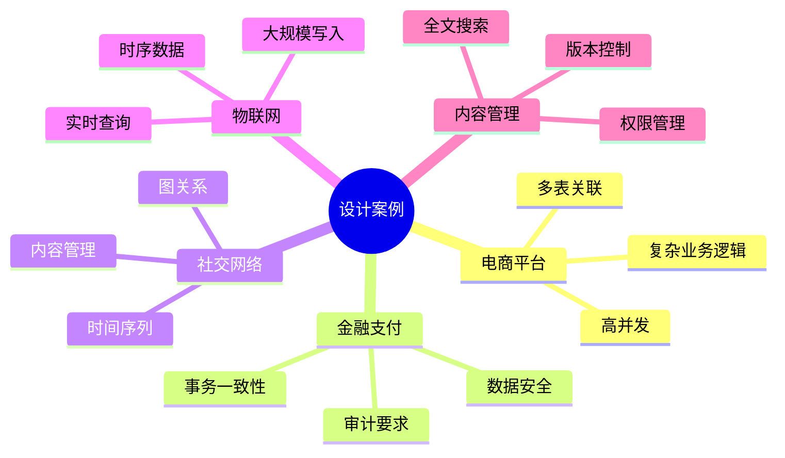
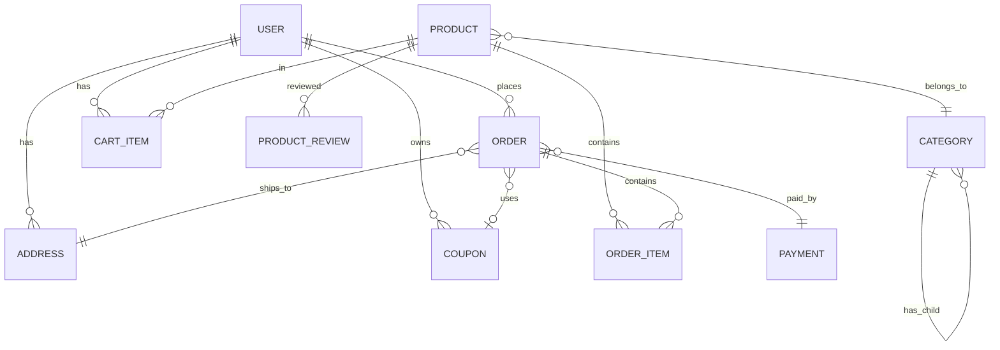
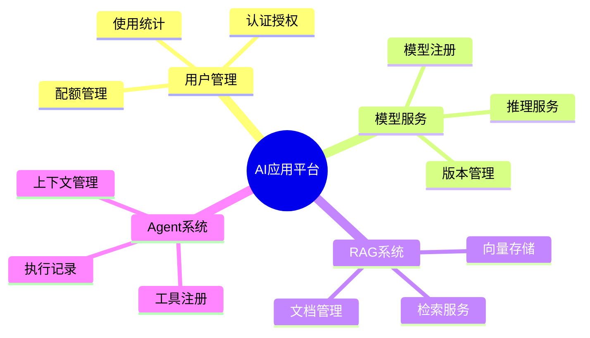
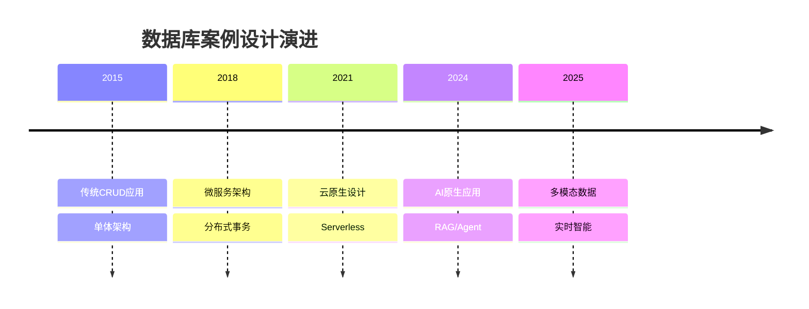

# 数据库设计案例深度解析：从需求到实现的完整过程

> **创建日期**：2025-01-15
> **最后更新**：2025-12-01
> **版本**：v2.0 (增强版)
> **状态**：实施中

---

## 📋 目录

- [数据库设计案例深度解析：从需求到实现的完整过程](#数据库设计案例深度解析从需求到实现的完整过程)
  - [📋 目录](#-目录)
  - [1. 概述](#1-概述)
    - [1.1. 案例选择](#11-案例选择)
  - [2. 案例1：电商平台完整设计](#2-案例1电商平台完整设计)
    - [2.1. 需求分析](#21-需求分析)
    - [2.2. 概念模型设计](#22-概念模型设计)
    - [2.3. 逻辑模型设计](#23-逻辑模型设计)
    - [2.4. 设计决策记录](#24-设计决策记录)
  - [3. 案例2：金融支付系统设计](#3-案例2金融支付系统设计)
    - [3.1. 需求分析](#31-需求分析)
    - [3.2. 完整Schema设计](#32-完整schema设计)
  - [4. 案例3：社交网络平台设计](#4-案例3社交网络平台设计)
    - [4.1. 需求分析](#41-需求分析)
    - [4.2. 完整Schema设计](#42-完整schema设计)
  - [5. 案例4：物联网数据平台设计](#5-案例4物联网数据平台设计)
    - [5.1. 需求分析](#51-需求分析)
    - [5.2. 完整Schema设计](#52-完整schema设计)
  - [6. 案例5：内容管理系统设计](#6-案例5内容管理系统设计)
    - [6.1. 需求分析](#61-需求分析)
    - [6.2. 完整Schema设计](#62-完整schema设计)
  - [7. 设计决策记录](#7-设计决策记录)
    - [7.1. 设计决策矩阵](#71-设计决策矩阵)
  - [8. 案例6：AI应用平台设计（2025新增）](#8-案例6ai应用平台设计2025新增)
    - [8.1. 需求分析](#81-需求分析)
    - [8.2. AI平台Schema设计](#82-ai平台schema设计)
  - [9. 2024-2025案例设计趋势](#9-2024-2025案例设计趋势)
    - [9.1. 案例设计演进](#91-案例设计演进)
    - [9.2. 行业案例对比矩阵](#92-行业案例对比矩阵)
  - [10. 参考资料](#10-参考资料)
    - [10.1. 权威文献](#101-权威文献)
    - [10.2. 在线资源](#102-在线资源)
    - [10.3. 相关文档](#103-相关文档)

---

## 1. 概述

本文档通过5个完整的行业案例，深入解析数据库设计的完整过程，从需求分析到Schema实现。

### 1.1. 案例选择



---

## 2. 案例1：电商平台完整设计

### 2.1. 需求分析

**业务需求**：

1. **用户管理**：注册、登录、个人信息管理
2. **商品管理**：商品信息、分类、库存、价格
3. **订单管理**：下单、支付、发货、收货、退款
4. **购物车**：添加商品、修改数量、结算
5. **评价系统**：商品评价、商家评价
6. **优惠系统**：优惠券、促销活动

**性能需求**：

- 支持10万+并发用户
- 订单查询响应时间 < 100ms
- 商品搜索响应时间 < 200ms
- 支持日订单量100万+

**数据规模**：

- 用户数：1000万+
- 商品数：100万+
- 日订单量：100万+
- 历史订单：1亿+

### 2.2. 概念模型设计

**实体识别**：



### 2.3. 逻辑模型设计

**完整Schema设计**：

```sql
CREATE SCHEMA ecommerce;

-- ============================================
-- 用户模块
-- ============================================

-- 用户表
CREATE TABLE ecommerce.users (
    user_id BIGSERIAL PRIMARY KEY,
    username VARCHAR(50) NOT NULL UNIQUE,
    email VARCHAR(100) NOT NULL UNIQUE,
    password_hash TEXT NOT NULL,
    phone VARCHAR(20),
    avatar_url TEXT,
    gender VARCHAR(10) CHECK (gender IN ('male', 'female', 'other')),
    birth_date DATE,
    is_active BOOLEAN DEFAULT TRUE,
    is_email_verified BOOLEAN DEFAULT FALSE,
    last_login_at TIMESTAMPTZ,
    created_at TIMESTAMPTZ NOT NULL DEFAULT CURRENT_TIMESTAMP,
    updated_at TIMESTAMPTZ NOT NULL DEFAULT CURRENT_TIMESTAMP
);

CREATE INDEX idx_users_email ON ecommerce.users(email);
CREATE INDEX idx_users_username ON ecommerce.users(username);
CREATE INDEX idx_users_active ON ecommerce.users(user_id) WHERE is_active = TRUE;

-- 用户地址表
CREATE TABLE ecommerce.user_addresses (
    address_id BIGSERIAL PRIMARY KEY,
    user_id BIGINT NOT NULL REFERENCES ecommerce.users(user_id) ON DELETE CASCADE,
    recipient_name VARCHAR(100) NOT NULL,
    phone VARCHAR(20) NOT NULL,
    province VARCHAR(50) NOT NULL,
    city VARCHAR(50) NOT NULL,
    district VARCHAR(50) NOT NULL,
    street VARCHAR(200) NOT NULL,
    zip_code VARCHAR(20),
    is_default BOOLEAN DEFAULT FALSE,
    created_at TIMESTAMPTZ NOT NULL DEFAULT CURRENT_TIMESTAMP,
    updated_at TIMESTAMPTZ NOT NULL DEFAULT CURRENT_TIMESTAMP
);

CREATE INDEX idx_user_addresses_user ON ecommerce.user_addresses(user_id);
CREATE INDEX idx_user_addresses_default ON ecommerce.user_addresses(user_id, is_default) WHERE is_default = TRUE;

-- ============================================
-- 商品模块
-- ============================================

-- 商品分类表（树形结构）
CREATE TABLE ecommerce.categories (
    category_id SERIAL PRIMARY KEY,
    category_name VARCHAR(100) NOT NULL,
    parent_id INTEGER REFERENCES ecommerce.categories(category_id),
    level INTEGER NOT NULL CHECK (level BETWEEN 1 AND 5),
    sort_order INTEGER DEFAULT 0,
    is_active BOOLEAN DEFAULT TRUE,
    created_at TIMESTAMPTZ NOT NULL DEFAULT CURRENT_TIMESTAMP
);

CREATE INDEX idx_categories_parent ON ecommerce.categories(parent_id);
CREATE INDEX idx_categories_level ON ecommerce.categories(level, is_active) WHERE is_active = TRUE;

-- 商品表
CREATE TABLE ecommerce.products (
    product_id BIGSERIAL PRIMARY KEY,
    sku VARCHAR(50) NOT NULL UNIQUE,
    product_name VARCHAR(200) NOT NULL,
    category_id INTEGER NOT NULL REFERENCES ecommerce.categories(category_id),
    brand VARCHAR(100),
    description TEXT,
    specifications JSONB,  -- 商品规格
    images TEXT[],  -- 商品图片URL数组
    base_price DECIMAL(10,2) NOT NULL CHECK (base_price >= 0),
    sale_price DECIMAL(10,2) NOT NULL CHECK (sale_price >= 0),
    stock_quantity INTEGER NOT NULL DEFAULT 0 CHECK (stock_quantity >= 0),
    sales_count INTEGER DEFAULT 0 CHECK (sales_count >= 0),
    view_count INTEGER DEFAULT 0 CHECK (view_count >= 0),
    rating_average DECIMAL(3,2) DEFAULT 0.0 CHECK (rating_average BETWEEN 0 AND 5),
    rating_count INTEGER DEFAULT 0,
    is_active BOOLEAN DEFAULT TRUE,
    is_deleted BOOLEAN DEFAULT FALSE,
    created_at TIMESTAMPTZ NOT NULL DEFAULT CURRENT_TIMESTAMP,
    updated_at TIMESTAMPTZ NOT NULL DEFAULT CURRENT_TIMESTAMP
);

CREATE INDEX idx_products_sku ON ecommerce.products(sku);
CREATE INDEX idx_products_category ON ecommerce.products(category_id, is_active, is_deleted) WHERE is_active = TRUE AND is_deleted = FALSE;
CREATE INDEX idx_products_price ON ecommerce.products(sale_price) WHERE is_active = TRUE AND is_deleted = FALSE;
CREATE INDEX idx_products_search ON ecommerce.products USING GIN(to_tsvector('english', product_name || ' ' || COALESCE(description, '')));
CREATE INDEX idx_products_rating ON ecommerce.products(rating_average DESC, rating_count DESC) WHERE is_active = TRUE AND is_deleted = FALSE;

-- 商品SKU表（多规格商品）
CREATE TABLE ecommerce.product_skus (
    sku_id BIGSERIAL PRIMARY KEY,
    product_id BIGINT NOT NULL REFERENCES ecommerce.products(product_id) ON DELETE CASCADE,
    sku_code VARCHAR(50) NOT NULL UNIQUE,
    attributes JSONB NOT NULL,  -- 规格属性，如 {"color": "red", "size": "L"}
    price DECIMAL(10,2) NOT NULL CHECK (price >= 0),
    stock_quantity INTEGER NOT NULL DEFAULT 0 CHECK (stock_quantity >= 0),
    image_url TEXT,
    is_active BOOLEAN DEFAULT TRUE,
    created_at TIMESTAMPTZ NOT NULL DEFAULT CURRENT_TIMESTAMP
);

CREATE INDEX idx_product_skus_product ON ecommerce.product_skus(product_id, is_active) WHERE is_active = TRUE;
CREATE INDEX idx_product_skus_code ON ecommerce.product_skus(sku_code);

-- ============================================
-- 购物车模块
-- ============================================

CREATE TABLE ecommerce.cart_items (
    cart_item_id BIGSERIAL PRIMARY KEY,
    user_id BIGINT NOT NULL REFERENCES ecommerce.users(user_id) ON DELETE CASCADE,
    product_id BIGINT NOT NULL REFERENCES ecommerce.products(product_id) ON DELETE CASCADE,
    sku_id BIGINT REFERENCES ecommerce.product_skus(sku_id) ON DELETE CASCADE,
    quantity INTEGER NOT NULL CHECK (quantity > 0),
    added_at TIMESTAMPTZ NOT NULL DEFAULT CURRENT_TIMESTAMP,
    updated_at TIMESTAMPTZ NOT NULL DEFAULT CURRENT_TIMESTAMP,
    UNIQUE(user_id, product_id, sku_id)
);

CREATE INDEX idx_cart_items_user ON ecommerce.cart_items(user_id);
CREATE INDEX idx_cart_items_product ON ecommerce.cart_items(product_id);

-- ============================================
-- 订单模块
-- ============================================

-- 订单表（分区表：按创建时间分区）
CREATE TABLE ecommerce.orders (
    order_id BIGSERIAL,
    order_number VARCHAR(50) NOT NULL UNIQUE,
    user_id BIGINT NOT NULL REFERENCES ecommerce.users(user_id),
    shipping_address_id BIGINT NOT NULL REFERENCES ecommerce.user_addresses(address_id),
    billing_address_id BIGINT NOT NULL REFERENCES ecommerce.user_addresses(address_id),
    order_status VARCHAR(20) NOT NULL CHECK (order_status IN (
        'pending', 'paid', 'shipped', 'delivered', 'completed',
        'cancelled', 'refunding', 'refunded'
    )),
    payment_status VARCHAR(20) NOT NULL CHECK (payment_status IN (
        'unpaid', 'paid', 'refunding', 'refunded'
    )),
    payment_method VARCHAR(50),
    payment_time TIMESTAMPTZ,
    subtotal DECIMAL(10,2) NOT NULL CHECK (subtotal >= 0),
    shipping_fee DECIMAL(10,2) NOT NULL DEFAULT 0 CHECK (shipping_fee >= 0),
    discount_amount DECIMAL(10,2) NOT NULL DEFAULT 0 CHECK (discount_amount >= 0),
    total_amount DECIMAL(10,2) NOT NULL CHECK (total_amount >= 0),
    coupon_id BIGINT REFERENCES ecommerce.coupons(coupon_id),
    coupon_discount DECIMAL(10,2) DEFAULT 0,
    shipping_time TIMESTAMPTZ,
    delivered_time TIMESTAMPTZ,
    completed_time TIMESTAMPTZ,
    cancelled_time TIMESTAMPTZ,
    cancel_reason TEXT,
    notes TEXT,
    created_at TIMESTAMPTZ NOT NULL DEFAULT CURRENT_TIMESTAMP,
    updated_at TIMESTAMPTZ NOT NULL DEFAULT CURRENT_TIMESTAMP,
    PRIMARY KEY (order_id, created_at)
) PARTITION BY RANGE (created_at);

-- 按月分区（自动创建未来12个月的分区）
CREATE TABLE ecommerce.orders_2024_01 PARTITION OF ecommerce.orders
FOR VALUES FROM ('2024-01-01') TO ('2024-02-01');

CREATE TABLE ecommerce.orders_2024_02 PARTITION OF ecommerce.orders
FOR VALUES FROM ('2024-02-01') TO ('2024-03-01');

-- 订单索引
CREATE INDEX idx_orders_user ON ecommerce.orders(user_id, created_at DESC);
CREATE INDEX idx_orders_status ON ecommerce.orders(order_status, created_at DESC);
CREATE INDEX idx_orders_number ON ecommerce.orders(order_number);
CREATE INDEX idx_orders_payment_status ON ecommerce.orders(payment_status, created_at DESC);

-- 订单项表
CREATE TABLE ecommerce.order_items (
    order_item_id BIGSERIAL PRIMARY KEY,
    order_id BIGINT NOT NULL,
    order_created_at TIMESTAMPTZ NOT NULL,
    product_id BIGINT NOT NULL REFERENCES ecommerce.products(product_id),
    sku_id BIGINT REFERENCES ecommerce.product_skus(sku_id),
    product_name VARCHAR(200) NOT NULL,  -- 冗余：商品快照
    product_image TEXT,  -- 冗余：商品图片快照
    sku_attributes JSONB,  -- 冗余：SKU属性快照
    unit_price DECIMAL(10,2) NOT NULL CHECK (unit_price >= 0),  -- 冗余：下单时价格
    quantity INTEGER NOT NULL CHECK (quantity > 0),
    subtotal DECIMAL(10,2) NOT NULL CHECK (subtotal >= 0),
    FOREIGN KEY (order_id, order_created_at) REFERENCES ecommerce.orders(order_id, created_at) ON DELETE CASCADE
);

CREATE INDEX idx_order_items_order ON ecommerce.order_items(order_id, order_created_at);
CREATE INDEX idx_order_items_product ON ecommerce.order_items(product_id);

-- ============================================
-- 支付模块
-- ============================================

CREATE TABLE ecommerce.payments (
    payment_id BIGSERIAL PRIMARY KEY,
    order_id BIGINT NOT NULL,
    order_created_at TIMESTAMPTZ NOT NULL,
    payment_number VARCHAR(50) NOT NULL UNIQUE,
    payment_method VARCHAR(50) NOT NULL,  -- alipay, wechat, credit_card
    payment_amount DECIMAL(10,2) NOT NULL CHECK (payment_amount > 0),
    payment_status VARCHAR(20) NOT NULL CHECK (payment_status IN (
        'pending', 'processing', 'success', 'failed', 'cancelled', 'refunded'
    )),
    third_party_transaction_id VARCHAR(200),
    payment_time TIMESTAMPTZ,
    failure_reason TEXT,
    refund_amount DECIMAL(10,2) DEFAULT 0 CHECK (refund_amount >= 0),
    refund_time TIMESTAMPTZ,
    created_at TIMESTAMPTZ NOT NULL DEFAULT CURRENT_TIMESTAMP,
    updated_at TIMESTAMPTZ NOT NULL DEFAULT CURRENT_TIMESTAMP,
    FOREIGN KEY (order_id, order_created_at) REFERENCES ecommerce.orders(order_id, created_at)
);

CREATE INDEX idx_payments_order ON ecommerce.payments(order_id, order_created_at);
CREATE INDEX idx_payments_number ON ecommerce.payments(payment_number);
CREATE INDEX idx_payments_status ON ecommerce.payments(payment_status, created_at DESC);
CREATE INDEX idx_payments_third_party ON ecommerce.payments(third_party_transaction_id) WHERE third_party_transaction_id IS NOT NULL;

-- ============================================
-- 优惠券模块
-- ============================================

CREATE TABLE ecommerce.coupons (
    coupon_id BIGSERIAL PRIMARY KEY,
    coupon_code VARCHAR(50) NOT NULL UNIQUE,
    coupon_name VARCHAR(200) NOT NULL,
    coupon_type VARCHAR(20) NOT NULL CHECK (coupon_type IN ('fixed', 'percentage', 'shipping')),
    discount_value DECIMAL(10,2) NOT NULL CHECK (discount_value >= 0),
    min_purchase_amount DECIMAL(10,2) DEFAULT 0 CHECK (min_purchase_amount >= 0),
    max_discount_amount DECIMAL(10,2),
    valid_from TIMESTAMPTZ NOT NULL,
    valid_until TIMESTAMPTZ NOT NULL,
    total_quantity INTEGER,  -- NULL表示无限制
    used_quantity INTEGER DEFAULT 0 CHECK (used_quantity >= 0),
    per_user_limit INTEGER DEFAULT 1 CHECK (per_user_limit >= 1),
    applicable_categories INTEGER[],  -- NULL表示所有分类
    applicable_products BIGINT[],  -- NULL表示所有商品
    is_active BOOLEAN DEFAULT TRUE,
    created_at TIMESTAMPTZ NOT NULL DEFAULT CURRENT_TIMESTAMP
);

CREATE INDEX idx_coupons_code ON ecommerce.coupons(coupon_code);
CREATE INDEX idx_coupons_valid ON ecommerce.coupons(valid_from, valid_until, is_active) WHERE is_active = TRUE;

-- 用户优惠券表
CREATE TABLE ecommerce.user_coupons (
    user_coupon_id BIGSERIAL PRIMARY KEY,
    user_id BIGINT NOT NULL REFERENCES ecommerce.users(user_id) ON DELETE CASCADE,
    coupon_id BIGINT NOT NULL REFERENCES ecommerce.coupons(coupon_id) ON DELETE CASCADE,
    status VARCHAR(20) NOT NULL CHECK (status IN ('unused', 'used', 'expired')),
    used_at TIMESTAMPTZ,
    used_order_id BIGINT REFERENCES ecommerce.orders(order_id),
    obtained_at TIMESTAMPTZ NOT NULL DEFAULT CURRENT_TIMESTAMP,
    expires_at TIMESTAMPTZ NOT NULL,
    UNIQUE(user_id, coupon_id, obtained_at)
);

CREATE INDEX idx_user_coupons_user ON ecommerce.user_coupons(user_id, status, expires_at) WHERE status = 'unused';
CREATE INDEX idx_user_coupons_coupon ON ecommerce.user_coupons(coupon_id);

-- ============================================
-- 评价模块
-- ============================================

CREATE TABLE ecommerce.product_reviews (
    review_id BIGSERIAL PRIMARY KEY,
    order_id BIGINT NOT NULL,
    order_created_at TIMESTAMPTZ NOT NULL,
    user_id BIGINT NOT NULL REFERENCES ecommerce.users(user_id),
    product_id BIGINT NOT NULL REFERENCES ecommerce.products(product_id),
    rating INTEGER NOT NULL CHECK (rating BETWEEN 1 AND 5),
    review_title VARCHAR(200),
    review_content TEXT,
    images TEXT[],
    is_anonymous BOOLEAN DEFAULT FALSE,
    helpful_count INTEGER DEFAULT 0,
    reply_count INTEGER DEFAULT 0,
    is_verified_purchase BOOLEAN DEFAULT TRUE,
    is_visible BOOLEAN DEFAULT TRUE,
    created_at TIMESTAMPTZ NOT NULL DEFAULT CURRENT_TIMESTAMP,
    updated_at TIMESTAMPTZ NOT NULL DEFAULT CURRENT_TIMESTAMP,
    FOREIGN KEY (order_id, order_created_at) REFERENCES ecommerce.orders(order_id, created_at),
    UNIQUE(order_id, product_id)
);

CREATE INDEX idx_product_reviews_product ON ecommerce.product_reviews(product_id, rating, created_at DESC) WHERE is_visible = TRUE;
CREATE INDEX idx_product_reviews_user ON ecommerce.product_reviews(user_id, created_at DESC);
CREATE INDEX idx_product_reviews_rating ON ecommerce.product_reviews(product_id, rating);

-- 评价回复表
CREATE TABLE ecommerce.review_replies (
    reply_id BIGSERIAL PRIMARY KEY,
    review_id BIGINT NOT NULL REFERENCES ecommerce.product_reviews(review_id) ON DELETE CASCADE,
    user_id BIGINT NOT NULL REFERENCES ecommerce.users(user_id),
    reply_content TEXT NOT NULL,
    is_seller_reply BOOLEAN DEFAULT FALSE,
    created_at TIMESTAMPTZ NOT NULL DEFAULT CURRENT_TIMESTAMP
);

CREATE INDEX idx_review_replies_review ON ecommerce.review_replies(review_id, created_at);

-- ============================================
-- 触发器：更新商品评分和销量
-- ============================================

CREATE OR REPLACE FUNCTION update_product_stats()
RETURNS TRIGGER AS $$
BEGIN
    -- 更新商品评分和评价数
    UPDATE ecommerce.products
    SET
        rating_average = (
            SELECT AVG(rating)::DECIMAL(3,2)
            FROM ecommerce.product_reviews
            WHERE product_id = NEW.product_id
              AND is_visible = TRUE
        ),
        rating_count = (
            SELECT COUNT(*)
            FROM ecommerce.product_reviews
            WHERE product_id = NEW.product_id
              AND is_visible = TRUE
        )
    WHERE product_id = NEW.product_id;

    RETURN NEW;
END;
$$ LANGUAGE plpgsql;

CREATE TRIGGER update_product_stats_trigger
AFTER INSERT OR UPDATE ON ecommerce.product_reviews
FOR EACH ROW
WHEN (NEW.is_visible = TRUE)
EXECUTE FUNCTION update_product_stats();

-- 更新订单状态时更新商品销量
CREATE OR REPLACE FUNCTION update_product_sales()
RETURNS TRIGGER AS $$
BEGIN
    IF NEW.order_status = 'completed' AND (OLD.order_status IS NULL OR OLD.order_status != 'completed') THEN
        -- 增加商品销量
        UPDATE ecommerce.products p
        SET sales_count = sales_count + oi.quantity
        FROM ecommerce.order_items oi
        WHERE p.product_id = oi.product_id
          AND oi.order_id = NEW.order_id;
    END IF;

    RETURN NEW;
END;
$$ LANGUAGE plpgsql;

CREATE TRIGGER update_product_sales_trigger
AFTER UPDATE ON ecommerce.orders
FOR EACH ROW
EXECUTE FUNCTION update_product_sales();
```

### 2.4. 设计决策记录

**关键设计决策**：

| 决策点 | 选择 | 理由 |
|--------|------|------|
| **订单表分区** | 按创建时间范围分区 | 支持大规模历史数据，查询性能好 |
| **订单项冗余字段** | 保存商品快照 | 保证历史数据准确性，即使商品信息变更 |
| **商品评分更新** | 使用触发器自动更新 | 保证数据一致性，减少应用层复杂度 |
| **购物车设计** | 独立表，不合并到订单 | 支持购物车持久化，用户体验好 |
| **优惠券设计** | 用户优惠券表独立 | 支持优惠券发放和使用追踪 |

---

## 3. 案例2：金融支付系统设计

### 3.1. 需求分析

**业务需求**：

1. **账户管理**：账户开户、销户、余额管理
2. **交易管理**：充值、提现、转账、支付
3. **风控系统**：交易限额、异常检测、黑名单
4. **对账系统**：与第三方支付对账
5. **审计要求**：完整的操作日志、数据不可篡改

**性能需求**：

- 支持每秒10万+交易
- 交易响应时间 < 50ms
- 强一致性要求
- 7×24小时可用性

**安全需求**：

- 数据加密存储
- 操作审计日志
- 防重放攻击
- 防并发冲突

### 3.2. 完整Schema设计

```sql
CREATE SCHEMA payment_system;

-- ============================================
-- 账户模块
-- ============================================

-- 账户表
CREATE TABLE payment_system.accounts (
    account_id BIGSERIAL PRIMARY KEY,
    user_id BIGINT NOT NULL,
    account_type VARCHAR(20) NOT NULL CHECK (account_type IN ('savings', 'checking', 'credit')),
    account_number VARCHAR(50) NOT NULL UNIQUE,
    balance DECIMAL(15,2) NOT NULL DEFAULT 0 CHECK (balance >= 0),
    frozen_balance DECIMAL(15,2) NOT NULL DEFAULT 0 CHECK (frozen_balance >= 0),
    available_balance DECIMAL(15,2) GENERATED ALWAYS AS (balance - frozen_balance) STORED,
    currency VARCHAR(3) NOT NULL DEFAULT 'CNY',
    status VARCHAR(20) NOT NULL DEFAULT 'active' CHECK (status IN ('active', 'frozen', 'closed')),
    opened_at TIMESTAMPTZ NOT NULL DEFAULT CURRENT_TIMESTAMP,
    closed_at TIMESTAMPTZ,
    version INTEGER NOT NULL DEFAULT 1,  -- 乐观锁版本号
    created_at TIMESTAMPTZ NOT NULL DEFAULT CURRENT_TIMESTAMP,
    updated_at TIMESTAMPTZ NOT NULL DEFAULT CURRENT_TIMESTAMP
);

CREATE INDEX idx_accounts_user ON payment_system.accounts(user_id, account_type);
CREATE INDEX idx_accounts_number ON payment_system.accounts(account_number);
CREATE INDEX idx_accounts_status ON payment_system.accounts(status) WHERE status = 'active';

-- 账户变更日志表（审计）
CREATE TABLE payment_system.account_changes (
    change_id BIGSERIAL PRIMARY KEY,
    account_id BIGINT NOT NULL REFERENCES payment_system.accounts(account_id),
    change_type VARCHAR(20) NOT NULL CHECK (change_type IN ('balance', 'status', 'frozen')),
    old_value TEXT,
    new_value TEXT,
    change_amount DECIMAL(15,2),
    transaction_id BIGINT REFERENCES payment_system.transactions(transaction_id),
    changed_by VARCHAR(100),
    change_reason TEXT,
    changed_at TIMESTAMPTZ NOT NULL DEFAULT CURRENT_TIMESTAMP
) PARTITION BY RANGE (changed_at);

CREATE INDEX idx_account_changes_account ON payment_system.account_changes(account_id, changed_at DESC);

-- ============================================
-- 交易模块
-- ============================================

-- 交易表（分区表）
CREATE TABLE payment_system.transactions (
    transaction_id BIGSERIAL,
    transaction_number VARCHAR(50) NOT NULL UNIQUE,
    transaction_type VARCHAR(20) NOT NULL CHECK (transaction_type IN (
        'deposit', 'withdraw', 'transfer', 'payment', 'refund', 'recharge'
    )),
    from_account_id BIGINT REFERENCES payment_system.accounts(account_id),
    to_account_id BIGINT REFERENCES payment_system.accounts(account_id),
    amount DECIMAL(15,2) NOT NULL CHECK (amount > 0),
    currency VARCHAR(3) NOT NULL DEFAULT 'CNY',
    fee DECIMAL(15,2) DEFAULT 0 CHECK (fee >= 0),
    transaction_status VARCHAR(20) NOT NULL CHECK (transaction_status IN (
        'pending', 'processing', 'success', 'failed', 'cancelled', 'refunded'
    )),
    failure_reason TEXT,
    third_party_transaction_id VARCHAR(200),
    merchant_order_id VARCHAR(100),
    description TEXT,
    metadata JSONB,
    created_at TIMESTAMPTZ NOT NULL DEFAULT CURRENT_TIMESTAMP,
    completed_at TIMESTAMPTZ,
    PRIMARY KEY (transaction_id, created_at)
) PARTITION BY RANGE (created_at);

-- 交易索引
CREATE INDEX idx_transactions_number ON payment_system.transactions(transaction_number);
CREATE INDEX idx_transactions_from_account ON payment_system.transactions(from_account_id, created_at DESC);
CREATE INDEX idx_transactions_to_account ON payment_system.transactions(to_account_id, created_at DESC);
CREATE INDEX idx_transactions_status ON payment_system.transactions(transaction_status, created_at DESC);
CREATE INDEX idx_transactions_third_party ON payment_system.transactions(third_party_transaction_id) WHERE third_party_transaction_id IS NOT NULL;

-- 交易明细表（记录每笔交易的账户变更）
CREATE TABLE payment_system.transaction_details (
    detail_id BIGSERIAL PRIMARY KEY,
    transaction_id BIGINT NOT NULL,
    transaction_created_at TIMESTAMPTZ NOT NULL,
    account_id BIGINT NOT NULL REFERENCES payment_system.accounts(account_id),
    detail_type VARCHAR(20) NOT NULL CHECK (detail_type IN ('debit', 'credit')),
    amount DECIMAL(15,2) NOT NULL CHECK (amount > 0),
    balance_before DECIMAL(15,2) NOT NULL,
    balance_after DECIMAL(15,2) NOT NULL,
    created_at TIMESTAMPTZ NOT NULL DEFAULT CURRENT_TIMESTAMP,
    FOREIGN KEY (transaction_id, transaction_created_at)
        REFERENCES payment_system.transactions(transaction_id, created_at)
);

CREATE INDEX idx_transaction_details_transaction ON payment_system.transaction_details(transaction_id, transaction_created_at);
CREATE INDEX idx_transaction_details_account ON payment_system.transaction_details(account_id, created_at DESC);

-- ============================================
-- 风控模块
-- ============================================

-- 交易限额表
CREATE TABLE payment_system.transaction_limits (
    limit_id BIGSERIAL PRIMARY KEY,
    account_id BIGINT NOT NULL REFERENCES payment_system.accounts(account_id),
    limit_type VARCHAR(50) NOT NULL,  -- daily_amount, single_amount, monthly_count
    limit_value DECIMAL(15,2) NOT NULL CHECK (limit_value >= 0),
    current_usage DECIMAL(15,2) DEFAULT 0 CHECK (current_usage >= 0),
    period_start TIMESTAMPTZ NOT NULL,
    period_end TIMESTAMPTZ NOT NULL,
    created_at TIMESTAMPTZ NOT NULL DEFAULT CURRENT_TIMESTAMP,
    updated_at TIMESTAMPTZ NOT NULL DEFAULT CURRENT_TIMESTAMP,
    UNIQUE(account_id, limit_type, period_start)
);

CREATE INDEX idx_transaction_limits_account ON payment_system.transaction_limits(account_id, period_start, period_end);

-- 黑名单表
CREATE TABLE payment_system.blacklist (
    blacklist_id BIGSERIAL PRIMARY KEY,
    entity_type VARCHAR(20) NOT NULL CHECK (entity_type IN ('user', 'account', 'ip', 'device')),
    entity_value VARCHAR(200) NOT NULL,
    blacklist_type VARCHAR(50) NOT NULL,  -- fraud, risk, compliance
    reason TEXT,
    is_active BOOLEAN DEFAULT TRUE,
    added_at TIMESTAMPTZ NOT NULL DEFAULT CURRENT_TIMESTAMP,
    expires_at TIMESTAMPTZ,
    added_by VARCHAR(100),
    UNIQUE(entity_type, entity_value, blacklist_type)
);

CREATE INDEX idx_blacklist_entity ON payment_system.blacklist(entity_type, entity_value, is_active) WHERE is_active = TRUE;
CREATE INDEX idx_blacklist_expires ON payment_system.blacklist(expires_at) WHERE expires_at IS NOT NULL;

-- ============================================
-- 对账模块
-- ============================================

CREATE TABLE payment_system.reconciliation_records (
    reconciliation_id BIGSERIAL PRIMARY KEY,
    reconciliation_date DATE NOT NULL,
    third_party VARCHAR(50) NOT NULL,  -- alipay, wechat, bank
    total_transactions INTEGER NOT NULL DEFAULT 0,
    total_amount DECIMAL(15,2) NOT NULL DEFAULT 0,
    matched_count INTEGER DEFAULT 0,
    unmatched_count INTEGER DEFAULT 0,
    reconciliation_status VARCHAR(20) NOT NULL CHECK (reconciliation_status IN (
        'pending', 'processing', 'completed', 'failed'
    )),
    reconciliation_file_path TEXT,
    notes TEXT,
    created_at TIMESTAMPTZ NOT NULL DEFAULT CURRENT_TIMESTAMP,
    completed_at TIMESTAMPTZ,
    UNIQUE(reconciliation_date, third_party)
);

CREATE INDEX idx_reconciliation_date ON payment_system.reconciliation_records(reconciliation_date DESC, third_party);

-- ============================================
-- 事务处理函数（保证一致性）
-- ============================================

CREATE OR REPLACE FUNCTION process_transfer(
    p_from_account_id BIGINT,
    p_to_account_id BIGINT,
    p_amount DECIMAL,
    p_transaction_number VARCHAR,
    p_description TEXT DEFAULT NULL
)
RETURNS TABLE (
    transaction_id BIGINT,
    success BOOLEAN,
    error_message TEXT
) AS $$
DECLARE
    v_transaction_id BIGINT;
    v_from_balance DECIMAL(15,2);
    v_to_balance DECIMAL(15,2);
    v_from_version INTEGER;
    v_to_version INTEGER;
BEGIN
    -- 检查账户状态和余额
    SELECT balance, version INTO v_from_balance, v_from_version
    FROM payment_system.accounts
    WHERE account_id = p_from_account_id
      AND status = 'active'
    FOR UPDATE;

    IF NOT FOUND THEN
        RETURN QUERY SELECT NULL::BIGINT, FALSE, 'From account not found or inactive';
        RETURN;
    END IF;

    IF v_from_balance < p_amount THEN
        RETURN QUERY SELECT NULL::BIGINT, FALSE, 'Insufficient balance';
        RETURN;
    END IF;

    SELECT balance, version INTO v_to_balance, v_to_version
    FROM payment_system.accounts
    WHERE account_id = p_to_account_id
      AND status = 'active'
    FOR UPDATE;

    IF NOT FOUND THEN
        RETURN QUERY SELECT NULL::BIGINT, FALSE, 'To account not found or inactive';
        RETURN;
    END IF;

    -- 创建交易记录
    INSERT INTO payment_system.transactions (
        transaction_number, transaction_type, from_account_id,
        to_account_id, amount, transaction_status
    )
    VALUES (
        p_transaction_number, 'transfer', p_from_account_id,
        p_to_account_id, p_amount, 'processing'
    )
    RETURNING transaction_id INTO v_transaction_id;

    -- 更新账户余额（使用乐观锁）
    UPDATE payment_system.accounts
    SET balance = balance - p_amount,
        version = version + 1,
        updated_at = CURRENT_TIMESTAMP
    WHERE account_id = p_from_account_id
      AND version = v_from_version;

    IF NOT FOUND THEN
        -- 版本冲突，回滚
        UPDATE payment_system.transactions
        SET transaction_status = 'failed', failure_reason = 'Version conflict'
        WHERE transaction_id = v_transaction_id;
        RETURN QUERY SELECT v_transaction_id, FALSE, 'Version conflict';
        RETURN;
    END IF;

    UPDATE payment_system.accounts
    SET balance = balance + p_amount,
        version = version + 1,
        updated_at = CURRENT_TIMESTAMP
    WHERE account_id = p_to_account_id
      AND version = v_to_version;

    IF NOT FOUND THEN
        -- 版本冲突，回滚
        UPDATE payment_system.accounts
        SET balance = balance + p_amount, version = version - 1
        WHERE account_id = p_from_account_id;

        UPDATE payment_system.transactions
        SET transaction_status = 'failed', failure_reason = 'Version conflict'
        WHERE transaction_id = v_transaction_id;
        RETURN QUERY SELECT v_transaction_id, FALSE, 'Version conflict';
        RETURN;
    END IF;

    -- 记录交易明细
    INSERT INTO payment_system.transaction_details (
        transaction_id, transaction_created_at, account_id,
        detail_type, amount, balance_before, balance_after
    )
    VALUES
        (v_transaction_id, CURRENT_TIMESTAMP, p_from_account_id,
         'debit', p_amount, v_from_balance, v_from_balance - p_amount),
        (v_transaction_id, CURRENT_TIMESTAMP, p_to_account_id,
         'credit', p_amount, v_to_balance, v_to_balance + p_amount);

    -- 更新交易状态
    UPDATE payment_system.transactions
    SET transaction_status = 'success', completed_at = CURRENT_TIMESTAMP
    WHERE transaction_id = v_transaction_id;

    RETURN QUERY SELECT v_transaction_id, TRUE, NULL::TEXT;
END;
$$ LANGUAGE plpgsql;
```

---

## 4. 案例3：社交网络平台设计

### 4.1. 需求分析

**业务需求**：

1. **用户管理**：注册、个人资料、关注关系
2. **内容发布**：文本、图片、视频动态
3. **互动功能**：点赞、评论、转发、收藏
4. **消息系统**：私信、通知
5. **推荐系统**：内容推荐、用户推荐

**性能需求**：

- 支持千万级用户
- 时间线查询 < 200ms
- 支持实时推送
- 高并发写入

### 4.2. 完整Schema设计

```sql
CREATE SCHEMA social_network;

-- ============================================
-- 用户模块
-- ============================================

CREATE TABLE social_network.users (
    user_id BIGSERIAL PRIMARY KEY,
    username VARCHAR(50) NOT NULL UNIQUE,
    email VARCHAR(100) UNIQUE,
    phone VARCHAR(20) UNIQUE,
    password_hash TEXT NOT NULL,
    nickname VARCHAR(100),
    avatar_url TEXT,
    bio TEXT,
    location VARCHAR(100),
    website VARCHAR(200),
    birth_date DATE,
    gender VARCHAR(10) CHECK (gender IN ('male', 'female', 'other')),
    is_verified BOOLEAN DEFAULT FALSE,
    is_private BOOLEAN DEFAULT FALSE,
    follower_count INTEGER DEFAULT 0 CHECK (follower_count >= 0),
    following_count INTEGER DEFAULT 0 CHECK (following_count >= 0),
    post_count INTEGER DEFAULT 0 CHECK (post_count >= 0),
    is_active BOOLEAN DEFAULT TRUE,
    created_at TIMESTAMPTZ NOT NULL DEFAULT CURRENT_TIMESTAMP,
    updated_at TIMESTAMPTZ NOT NULL DEFAULT CURRENT_TIMESTAMP
);

CREATE INDEX idx_users_username ON social_network.users(username);
CREATE INDEX idx_users_email ON social_network.users(email) WHERE email IS NOT NULL;

-- 关注关系表
CREATE TABLE social_network.follows (
    follower_id BIGINT NOT NULL REFERENCES social_network.users(user_id) ON DELETE CASCADE,
    followee_id BIGINT NOT NULL REFERENCES social_network.users(user_id) ON DELETE CASCADE,
    status VARCHAR(20) NOT NULL CHECK (status IN ('active', 'blocked')),
    created_at TIMESTAMPTZ NOT NULL DEFAULT CURRENT_TIMESTAMP,
    PRIMARY KEY (follower_id, followee_id),
    CHECK (follower_id != followee_id)
);

CREATE INDEX idx_follows_follower ON social_network.follows(follower_id, created_at DESC);
CREATE INDEX idx_follows_followee ON social_network.follows(followee_id, created_at DESC);

-- ============================================
-- 内容模块
-- ============================================

-- 动态表（分区表：按时间分区）
CREATE TABLE social_network.posts (
    post_id BIGSERIAL,
    user_id BIGINT NOT NULL REFERENCES social_network.users(user_id) ON DELETE CASCADE,
    content TEXT NOT NULL,
    content_type VARCHAR(20) NOT NULL CHECK (content_type IN ('text', 'image', 'video', 'mixed')),
    media_urls TEXT[],
    location_name VARCHAR(200),
    location_coordinates POINT,  -- PostGIS point
    is_public BOOLEAN DEFAULT TRUE,
    comment_count INTEGER DEFAULT 0 CHECK (comment_count >= 0),
    like_count INTEGER DEFAULT 0 CHECK (like_count >= 0),
    share_count INTEGER DEFAULT 0 CHECK (share_count >= 0),
    view_count INTEGER DEFAULT 0 CHECK (view_count >= 0),
    original_post_id BIGINT,  -- 转发原动态ID
    created_at TIMESTAMPTZ NOT NULL DEFAULT CURRENT_TIMESTAMP,
    updated_at TIMESTAMPTZ NOT NULL DEFAULT CURRENT_TIMESTAMP,
    PRIMARY KEY (post_id, created_at)
) PARTITION BY RANGE (created_at);

CREATE INDEX idx_posts_user ON social_network.posts(user_id, created_at DESC);
CREATE INDEX idx_posts_public ON social_network.posts(created_at DESC) WHERE is_public = TRUE;
CREATE INDEX idx_posts_content_search ON social_network.posts USING GIN(to_tsvector('english', content));

-- 点赞表
CREATE TABLE social_network.post_likes (
    like_id BIGSERIAL PRIMARY KEY,
    post_id BIGINT NOT NULL,
    post_created_at TIMESTAMPTZ NOT NULL,
    user_id BIGINT NOT NULL REFERENCES social_network.users(user_id) ON DELETE CASCADE,
    created_at TIMESTAMPTZ NOT NULL DEFAULT CURRENT_TIMESTAMP,
    FOREIGN KEY (post_id, post_created_at) REFERENCES social_network.posts(post_id, created_at) ON DELETE CASCADE,
    UNIQUE(post_id, post_created_at, user_id)
);

CREATE INDEX idx_post_likes_post ON social_network.post_likes(post_id, post_created_at);
CREATE INDEX idx_post_likes_user ON social_network.post_likes(user_id, created_at DESC);

-- 评论表
CREATE TABLE social_network.comments (
    comment_id BIGSERIAL PRIMARY KEY,
    post_id BIGINT NOT NULL,
    post_created_at TIMESTAMPTZ NOT NULL,
    user_id BIGINT NOT NULL REFERENCES social_network.users(user_id) ON DELETE CASCADE,
    parent_comment_id BIGINT REFERENCES social_network.comments(comment_id) ON DELETE CASCADE,
    content TEXT NOT NULL,
    like_count INTEGER DEFAULT 0 CHECK (like_count >= 0),
    reply_count INTEGER DEFAULT 0 CHECK (reply_count >= 0),
    is_deleted BOOLEAN DEFAULT FALSE,
    created_at TIMESTAMPTZ NOT NULL DEFAULT CURRENT_TIMESTAMP,
    updated_at TIMESTAMPTZ NOT NULL DEFAULT CURRENT_TIMESTAMP,
    FOREIGN KEY (post_id, post_created_at) REFERENCES social_network.posts(post_id, created_at) ON DELETE CASCADE
);

CREATE INDEX idx_comments_post ON social_network.comments(post_id, post_created_at, created_at);
CREATE INDEX idx_comments_user ON social_network.comments(user_id, created_at DESC);
CREATE INDEX idx_comments_parent ON social_network.comments(parent_comment_id) WHERE parent_comment_id IS NOT NULL;

-- ============================================
-- 消息模块
-- ============================================

-- 私信表
CREATE TABLE social_network.direct_messages (
    message_id BIGSERIAL PRIMARY KEY,
    conversation_id BIGINT NOT NULL,
    sender_id BIGINT NOT NULL REFERENCES social_network.users(user_id) ON DELETE CASCADE,
    recipient_id BIGINT NOT NULL REFERENCES social_network.users(user_id) ON DELETE CASCADE,
    content TEXT NOT NULL,
    message_type VARCHAR(20) DEFAULT 'text' CHECK (message_type IN ('text', 'image', 'video', 'file')),
    media_url TEXT,
    is_read BOOLEAN DEFAULT FALSE,
    read_at TIMESTAMPTZ,
    created_at TIMESTAMPTZ NOT NULL DEFAULT CURRENT_TIMESTAMP
);

CREATE INDEX idx_direct_messages_conversation ON social_network.direct_messages(conversation_id, created_at DESC);
CREATE INDEX idx_direct_messages_sender ON social_network.direct_messages(sender_id, created_at DESC);
CREATE INDEX idx_direct_messages_recipient ON social_network.direct_messages(recipient_id, is_read, created_at DESC) WHERE is_read = FALSE;

-- 通知表
CREATE TABLE social_network.notifications (
    notification_id BIGSERIAL PRIMARY KEY,
    user_id BIGINT NOT NULL REFERENCES social_network.users(user_id) ON DELETE CASCADE,
    notification_type VARCHAR(50) NOT NULL,  -- like, comment, follow, mention
    actor_id BIGINT REFERENCES social_network.users(user_id),
    target_type VARCHAR(50),  -- post, comment
    target_id BIGINT,
    content TEXT,
    is_read BOOLEAN DEFAULT FALSE,
    created_at TIMESTAMPTZ NOT NULL DEFAULT CURRENT_TIMESTAMP
) PARTITION BY RANGE (created_at);

CREATE INDEX idx_notifications_user ON social_network.notifications(user_id, is_read, created_at DESC);
CREATE INDEX idx_notifications_unread ON social_network.notifications(user_id, created_at DESC) WHERE is_read = FALSE;
```

---

## 5. 案例4：物联网数据平台设计

### 5.1. 需求分析

**业务需求**：

1. **设备管理**：设备注册、状态管理、分组
2. **数据采集**：传感器数据、设备状态、事件日志
3. **数据处理**：实时计算、聚合统计、告警
4. **数据查询**：时间序列查询、聚合查询、历史数据

**性能需求**：

- 支持百万级设备
- 每秒百万级数据写入
- 实时查询响应 < 100ms
- 历史数据查询 < 1s

### 5.2. 完整Schema设计

```sql
CREATE SCHEMA iot_platform;

-- ============================================
-- 设备模块
-- ============================================

CREATE TABLE iot_platform.devices (
    device_id BIGSERIAL PRIMARY KEY,
    device_code VARCHAR(100) NOT NULL UNIQUE,
    device_name VARCHAR(200) NOT NULL,
    device_type VARCHAR(50) NOT NULL,
    manufacturer VARCHAR(100),
    model VARCHAR(100),
    firmware_version VARCHAR(50),
    group_id BIGINT REFERENCES iot_platform.device_groups(group_id),
    location_name VARCHAR(200),
    location_coordinates POINT,  -- PostGIS
    status VARCHAR(20) NOT NULL DEFAULT 'offline' CHECK (status IN ('online', 'offline', 'error')),
    last_seen_at TIMESTAMPTZ,
    metadata JSONB,
    created_at TIMESTAMPTZ NOT NULL DEFAULT CURRENT_TIMESTAMP,
    updated_at TIMESTAMPTZ NOT NULL DEFAULT CURRENT_TIMESTAMP
);

CREATE INDEX idx_devices_code ON iot_platform.devices(device_code);
CREATE INDEX idx_devices_type ON iot_platform.devices(device_type, status);
CREATE INDEX idx_devices_group ON iot_platform.devices(group_id);
CREATE INDEX idx_devices_status ON iot_platform.devices(status, last_seen_at);

-- 设备组表
CREATE TABLE iot_platform.device_groups (
    group_id BIGSERIAL PRIMARY KEY,
    group_name VARCHAR(200) NOT NULL,
    parent_group_id BIGINT REFERENCES iot_platform.device_groups(group_id),
    description TEXT,
    created_at TIMESTAMPTZ NOT NULL DEFAULT CURRENT_TIMESTAMP
);

-- ============================================
-- 数据采集模块（时序数据）
-- ============================================

-- 传感器数据表（按时间分区）
CREATE TABLE iot_platform.sensor_data (
    data_id BIGSERIAL,
    device_id BIGINT NOT NULL REFERENCES iot_platform.devices(device_id) ON DELETE CASCADE,
    sensor_name VARCHAR(100) NOT NULL,
    sensor_value DECIMAL(15,4) NOT NULL,
    sensor_unit VARCHAR(20),
    data_quality INTEGER CHECK (data_quality BETWEEN 0 AND 100),
    collected_at TIMESTAMPTZ NOT NULL DEFAULT CURRENT_TIMESTAMP,
    PRIMARY KEY (data_id, collected_at)
) PARTITION BY RANGE (collected_at);

-- 创建月度分区
CREATE TABLE iot_platform.sensor_data_2024_01 PARTITION OF iot_platform.sensor_data
FOR VALUES FROM ('2024-01-01') TO ('2024-02-01');

-- 索引（每个分区）
CREATE INDEX idx_sensor_data_device_time ON iot_platform.sensor_data(device_id, collected_at DESC);
CREATE INDEX idx_sensor_data_sensor_time ON iot_platform.sensor_data(device_id, sensor_name, collected_at DESC);

-- 设备状态表（状态变更记录）
CREATE TABLE iot_platform.device_status_history (
    status_id BIGSERIAL PRIMARY KEY,
    device_id BIGINT NOT NULL REFERENCES iot_platform.devices(device_id) ON DELETE CASCADE,
    old_status VARCHAR(20),
    new_status VARCHAR(20) NOT NULL,
    change_reason TEXT,
    changed_at TIMESTAMPTZ NOT NULL DEFAULT CURRENT_TIMESTAMP
) PARTITION BY RANGE (changed_at);

CREATE INDEX idx_device_status_device ON iot_platform.device_status_history(device_id, changed_at DESC);

-- ============================================
-- 聚合统计表（物化视图）
-- ============================================

-- 设备数据小时聚合表
CREATE MATERIALIZED VIEW iot_platform.device_hourly_stats AS
SELECT
    device_id,
    sensor_name,
    DATE_TRUNC('hour', collected_at) AS hour,
    COUNT(*) AS data_count,
    AVG(sensor_value) AS avg_value,
    MIN(sensor_value) AS min_value,
    MAX(sensor_value) AS max_value,
    STDDEV(sensor_value) AS stddev_value
FROM iot_platform.sensor_data
GROUP BY device_id, sensor_name, DATE_TRUNC('hour', collected_at);

CREATE UNIQUE INDEX idx_device_hourly_stats_unique
ON iot_platform.device_hourly_stats(device_id, sensor_name, hour);

-- 刷新函数
CREATE OR REPLACE FUNCTION refresh_device_hourly_stats()
RETURNS VOID AS $$
BEGIN
    REFRESH MATERIALIZED VIEW CONCURRENTLY iot_platform.device_hourly_stats;
END;
$$ LANGUAGE plpgsql;
```

---

## 6. 案例5：内容管理系统设计

### 6.1. 需求分析

**业务需求**：

1. **内容管理**：文章、页面、媒体文件
2. **分类标签**：分类体系、标签系统
3. **用户权限**：角色管理、权限控制
4. **版本控制**：内容版本历史
5. **评论系统**：评论、审核

### 6.2. 完整Schema设计

```sql
CREATE SCHEMA cms;

-- ============================================
-- 内容模块
-- ============================================

-- 内容表
CREATE TABLE cms.contents (
    content_id BIGSERIAL PRIMARY KEY,
    content_type VARCHAR(50) NOT NULL CHECK (content_type IN ('post', 'page', 'media')),
    title VARCHAR(500) NOT NULL,
    slug VARCHAR(500) NOT NULL UNIQUE,
    content TEXT NOT NULL,
    excerpt TEXT,
    author_id BIGINT NOT NULL REFERENCES cms.users(user_id),
    status VARCHAR(20) NOT NULL DEFAULT 'draft' CHECK (status IN ('draft', 'published', 'archived', 'trashed')),
    visibility VARCHAR(20) NOT NULL DEFAULT 'public' CHECK (visibility IN ('public', 'private', 'password')),
    password_hash TEXT,
    published_at TIMESTAMPTZ,
    view_count INTEGER DEFAULT 0,
    comment_count INTEGER DEFAULT 0,
    like_count INTEGER DEFAULT 0,
    featured_image_url TEXT,
    metadata JSONB,
    created_at TIMESTAMPTZ NOT NULL DEFAULT CURRENT_TIMESTAMP,
    updated_at TIMESTAMPTZ NOT NULL DEFAULT CURRENT_TIMESTAMP
);

CREATE INDEX idx_contents_type_status ON cms.contents(content_type, status, published_at DESC);
CREATE INDEX idx_contents_author ON cms.contents(author_id, created_at DESC);
CREATE INDEX idx_contents_slug ON cms.contents(slug);
CREATE INDEX idx_contents_search ON cms.contents USING GIN(to_tsvector('english', title || ' ' || content));

-- 内容版本表（版本控制）
CREATE TABLE cms.content_versions (
    version_id BIGSERIAL PRIMARY KEY,
    content_id BIGINT NOT NULL REFERENCES cms.contents(content_id) ON DELETE CASCADE,
    version_number INTEGER NOT NULL,
    title VARCHAR(500) NOT NULL,
    content TEXT NOT NULL,
    author_id BIGINT NOT NULL REFERENCES cms.users(user_id),
    change_summary TEXT,
    created_at TIMESTAMPTZ NOT NULL DEFAULT CURRENT_TIMESTAMP,
    UNIQUE(content_id, version_number)
);

CREATE INDEX idx_content_versions_content ON cms.content_versions(content_id, version_number DESC);

-- 分类表
CREATE TABLE cms.categories (
    category_id SERIAL PRIMARY KEY,
    category_name VARCHAR(100) NOT NULL,
    slug VARCHAR(100) NOT NULL UNIQUE,
    parent_id INTEGER REFERENCES cms.categories(category_id),
    description TEXT,
    post_count INTEGER DEFAULT 0,
    created_at TIMESTAMPTZ NOT NULL DEFAULT CURRENT_TIMESTAMP
);

CREATE INDEX idx_categories_parent ON cms.categories(parent_id);
CREATE INDEX idx_categories_slug ON cms.categories(slug);

-- 内容分类关联表
CREATE TABLE cms.content_categories (
    content_id BIGINT NOT NULL REFERENCES cms.contents(content_id) ON DELETE CASCADE,
    category_id INTEGER NOT NULL REFERENCES cms.categories(category_id) ON DELETE CASCADE,
    PRIMARY KEY (content_id, category_id)
);

CREATE INDEX idx_content_categories_content ON cms.content_categories(content_id);
CREATE INDEX idx_content_categories_category ON cms.content_categories(category_id);

-- 标签表
CREATE TABLE cms.tags (
    tag_id SERIAL PRIMARY KEY,
    tag_name VARCHAR(50) NOT NULL UNIQUE,
    slug VARCHAR(50) NOT NULL UNIQUE,
    description TEXT,
    post_count INTEGER DEFAULT 0,
    created_at TIMESTAMPTZ NOT NULL DEFAULT CURRENT_TIMESTAMP
);

CREATE INDEX idx_tags_slug ON cms.tags(slug);

-- 内容标签关联表
CREATE TABLE cms.content_tags (
    content_id BIGINT NOT NULL REFERENCES cms.contents(content_id) ON DELETE CASCADE,
    tag_id INTEGER NOT NULL REFERENCES cms.tags(tag_id) ON DELETE CASCADE,
    PRIMARY KEY (content_id, tag_id)
);

CREATE INDEX idx_content_tags_content ON cms.content_tags(content_id);
CREATE INDEX idx_content_tags_tag ON cms.content_tags(tag_id);
```

---

## 7. 设计决策记录

### 7.1. 设计决策矩阵

| 案例 | 关键决策 | 选择方案 | 理由 |
|------|---------|---------|------|
| **电商** | 订单表设计 | 分区表 + 冗余字段 | 支持大规模数据，保证历史准确性 |
| **电商** | 商品评分 | 触发器自动更新 | 保证一致性，减少应用复杂度 |
| **金融** | 账户余额 | 乐观锁 + 版本号 | 防止并发冲突，保证一致性 |
| **金融** | 交易记录 | 分区表 + 明细表 | 支持大规模交易，完整审计 |
| **社交** | 动态表 | 分区表 + 全文搜索 | 支持大规模内容，快速搜索 |
| **社交** | 关注关系 | 独立表 + 计数器 | 支持复杂查询，性能优化 |
| **物联网** | 传感器数据 | 时间分区 + 物化视图 | 支持高频写入，快速聚合查询 |
| **CMS** | 内容版本 | 独立版本表 | 支持版本控制，历史追溯 |

---

## 8. 案例6：AI应用平台设计（2025新增）

### 8.1. 需求分析



### 8.2. AI平台Schema设计

```sql
CREATE SCHEMA ai_platform;

-- 模型注册表
CREATE TABLE ai_platform.models (
    model_id UUID PRIMARY KEY DEFAULT gen_random_uuid(),
    model_name VARCHAR(200) NOT NULL,
    provider VARCHAR(100) NOT NULL,  -- openai, anthropic, local
    model_type VARCHAR(50) NOT NULL,  -- llm, embedding, vision
    version VARCHAR(50),
    config JSONB,  -- 模型配置
    pricing JSONB,  -- 定价信息
    is_active BOOLEAN DEFAULT TRUE,
    created_at TIMESTAMPTZ DEFAULT CURRENT_TIMESTAMP
);

-- RAG知识库
CREATE TABLE ai_platform.knowledge_bases (
    kb_id UUID PRIMARY KEY DEFAULT gen_random_uuid(),
    kb_name VARCHAR(200) NOT NULL,
    owner_id UUID NOT NULL,
    embedding_model_id UUID REFERENCES ai_platform.models(model_id),
    chunk_size INTEGER DEFAULT 500,
    chunk_overlap INTEGER DEFAULT 50,
    metadata JSONB,
    created_at TIMESTAMPTZ DEFAULT CURRENT_TIMESTAMP
);

-- 文档块与向量
CREATE TABLE ai_platform.documents (
    doc_id UUID PRIMARY KEY DEFAULT gen_random_uuid(),
    kb_id UUID REFERENCES ai_platform.knowledge_bases(kb_id),
    source_url TEXT,
    content TEXT NOT NULL,
    embedding vector(1536),
    metadata JSONB,
    created_at TIMESTAMPTZ DEFAULT CURRENT_TIMESTAMP
);

CREATE INDEX idx_docs_embedding ON ai_platform.documents
    USING ivfflat (embedding vector_cosine_ops) WITH (lists = 100);

-- Agent工具注册
CREATE TABLE ai_platform.tools (
    tool_id UUID PRIMARY KEY DEFAULT gen_random_uuid(),
    tool_name VARCHAR(200) NOT NULL UNIQUE,
    description TEXT,
    parameters_schema JSONB,  -- JSON Schema
    implementation_type VARCHAR(50),  -- api, function, mcp
    endpoint TEXT,
    is_active BOOLEAN DEFAULT TRUE
);

-- 对话会话
CREATE TABLE ai_platform.conversations (
    conversation_id UUID PRIMARY KEY DEFAULT gen_random_uuid(),
    user_id UUID NOT NULL,
    model_id UUID REFERENCES ai_platform.models(model_id),
    title VARCHAR(500),
    system_prompt TEXT,
    context_window INTEGER DEFAULT 4096,
    created_at TIMESTAMPTZ DEFAULT CURRENT_TIMESTAMP,
    updated_at TIMESTAMPTZ DEFAULT CURRENT_TIMESTAMP
);

-- 消息记录
CREATE TABLE ai_platform.messages (
    message_id UUID PRIMARY KEY DEFAULT gen_random_uuid(),
    conversation_id UUID REFERENCES ai_platform.conversations(conversation_id),
    role VARCHAR(20) NOT NULL CHECK (role IN ('system', 'user', 'assistant', 'tool')),
    content TEXT,
    tool_calls JSONB,
    token_count INTEGER,
    latency_ms INTEGER,
    created_at TIMESTAMPTZ DEFAULT CURRENT_TIMESTAMP
);

-- 使用量统计
CREATE TABLE ai_platform.usage_stats (
    stat_id BIGSERIAL,
    user_id UUID NOT NULL,
    model_id UUID REFERENCES ai_platform.models(model_id),
    date DATE NOT NULL,
    input_tokens BIGINT DEFAULT 0,
    output_tokens BIGINT DEFAULT 0,
    request_count INTEGER DEFAULT 0,
    total_cost DECIMAL(10,4) DEFAULT 0,
    PRIMARY KEY (user_id, model_id, date)
);

-- RAG检索函数
CREATE OR REPLACE FUNCTION ai_platform.rag_search(
    p_kb_id UUID,
    p_query_embedding vector(1536),
    p_top_k INTEGER DEFAULT 5
)
RETURNS TABLE (
    doc_id UUID,
    content TEXT,
    similarity FLOAT,
    metadata JSONB
) AS $$
BEGIN
    RETURN QUERY
    SELECT
        d.doc_id,
        d.content,
        (1 - (d.embedding <=> p_query_embedding))::FLOAT AS similarity,
        d.metadata
    FROM ai_platform.documents d
    WHERE d.kb_id = p_kb_id
    ORDER BY d.embedding <=> p_query_embedding
    LIMIT p_top_k;
END;
$$ LANGUAGE plpgsql;
```

---

## 9. 2024-2025案例设计趋势

### 9.1. 案例设计演进



### 9.2. 行业案例对比矩阵

| 行业 | 核心挑战 | 关键模式 | 数据库选型 | 2025趋势 |
|------|---------|---------|-----------|---------|
| **电商** | 高并发、复杂业务 | 分库分表、CQRS | PG+Redis+ES | AI推荐 |
| **金融** | 一致性、安全 | 2PC、审计日志 | Oracle/PG | 实时风控 |
| **社交** | 图关系、内容 | 图数据库、全文 | Neo4j+PG | 知识图谱 |
| **IoT** | 高频写入、聚合 | 时序分区、降采样 | TimescaleDB | 边缘计算 |
| **AI平台** | 向量检索、会话 | RAG、Agent | pgvector+PG | 多模态 |

---

## 10. 参考资料

### 10.1. 权威文献

**架构设计**：

- Fowler, M. "Patterns of Enterprise Application Architecture"
- Richardson, C. "Microservices Patterns"

### 10.2. 在线资源

| 资源 | URL | 描述 |
|------|-----|------|
| **AWS架构中心** | <https://aws.amazon.com/architecture/> | 云原生案例 |
| **Google Cloud案例** | <https://cloud.google.com/customers> | 行业案例 |

### 10.3. 相关文档

- [07.01-Schema设计方法论](./07.01-Schema设计方法论.md)
- [07.09-行业案例库](./07.09-行业案例库.md)
- [07.10-向量数据库设计](./07.10-向量数据库设计.md)

---

**最后更新**：2025-12-01
**维护者**：Data-Science Team
**状态**：实施中
**版本**：v2.0 (增强版)
