# 分布式数据库设计模式：微服务与数据一致性

> **创建日期**：2025-01-15
> **最后更新**：2025-01-15
> **版本**：v1.0
> **状态**：实施中

---

## 📋 目录

- [分布式数据库设计模式：微服务与数据一致性](#分布式数据库设计模式微服务与数据一致性)
  - [📋 目录](#-目录)
  - [1. 概述](#1-概述)
    - [1.1. 分布式设计挑战](#11-分布式设计挑战)
    - [1.2. 分布式模式选择决策树](#12-分布式模式选择决策树)
  - [2. 微服务数据库设计](#2-微服务数据库设计)
    - [2.1. Database per Service模式](#21-database-per-service模式)
    - [2.2. 共享数据库反模式](#22-共享数据库反模式)
  - [3. 分布式事务模式](#3-分布式事务模式)
    - [3.1. Saga模式](#31-saga模式)
    - [3.2. 两阶段提交（2PC）](#32-两阶段提交2pc)
  - [4. 数据一致性模式](#4-数据一致性模式)
    - [4.1. 最终一致性模式](#41-最终一致性模式)
    - [4.2. CQRS模式](#42-cqrs模式)
  - [5. 数据同步模式](#5-数据同步模式)
    - [5.1. 事件驱动同步](#51-事件驱动同步)
    - [5.2. CDC变更捕获](#52-cdc变更捕获)
  - [6. 实际应用案例](#6-实际应用案例)
    - [6.1. 电商微服务架构案例](#61-电商微服务架构案例)
  - [7. 参考资料](#7-参考资料)

---

## 1. 概述

分布式数据库设计需要考虑服务解耦、数据一致性、事务管理等复杂问题。

### 1.1. 分布式设计挑战

```mermaid
mindmap
  root((分布式设计挑战))
    服务解耦
      数据库隔离
      服务独立部署
      数据所有权
    数据一致性
      强一致性
      最终一致性
      因果一致性
    事务管理
      本地事务
      分布式事务
      Saga模式
    数据同步
      事件驱动
      消息队列
      CDC变更捕获
```



### 1.2. 分布式模式选择决策树

```mermaid
flowchart TD
    A[选择分布式模式] --> B{一致性要求}

    B -->|强一致性| C[分布式事务]
    B -->|最终一致性| D{同步方式}

    C --> E[两阶段提交]
    C --> F[Saga模式]

    D -->|实时| G[事件驱动]
    D -->|批量| H[CDC同步]

    E --> I[实现完成]
    F --> I
    G --> I
    H --> I
```



---

## 2. 微服务数据库设计

### 2.1. Database per Service模式

**模式定义**：

```text
每个微服务拥有独立的数据库，服务间通过API通信，不直接访问其他服务的数据库。
```

**Schema设计**：

```sql
-- ============================================
-- 用户服务数据库
-- ============================================

CREATE SCHEMA user_service;

CREATE TABLE user_service.users (
    user_id BIGSERIAL PRIMARY KEY,
    username VARCHAR(50) NOT NULL UNIQUE,
    email VARCHAR(100) NOT NULL UNIQUE,
    password_hash TEXT NOT NULL,
    profile_data JSONB,
    created_at TIMESTAMPTZ NOT NULL DEFAULT CURRENT_TIMESTAMP,
    updated_at TIMESTAMPTZ NOT NULL DEFAULT CURRENT_TIMESTAMP
);

-- ============================================
-- 订单服务数据库
-- ============================================

CREATE SCHEMA order_service;

CREATE TABLE order_service.orders (
    order_id BIGSERIAL PRIMARY KEY,
    user_id BIGINT NOT NULL,  -- 引用用户服务，但不使用外键
    order_number VARCHAR(50) NOT NULL UNIQUE,
    order_status VARCHAR(20) NOT NULL,
    total_amount DECIMAL(10,2) NOT NULL,
    created_at TIMESTAMPTZ NOT NULL DEFAULT CURRENT_TIMESTAMP
);

-- 注意：不使用外键约束，因为user_id引用的是另一个数据库
-- 通过应用层或事件保证数据一致性
```

### 2.2. 共享数据库反模式

**反模式示例**：

```sql
-- ❌ 反模式：多个服务共享数据库
CREATE SCHEMA shared_db;

-- 用户服务表
CREATE TABLE shared_db.users (...);
-- 订单服务表
CREATE TABLE shared_db.orders (...);
-- 商品服务表
CREATE TABLE shared_db.products (...);

-- 问题：
-- 1. 服务耦合度高
-- 2. 无法独立部署
-- 3. Schema变更影响所有服务
-- 4. 难以扩展
```

**解决方案**：

```sql
-- ✅ 正确：每个服务独立数据库
-- 用户服务数据库
CREATE DATABASE user_service_db;
-- 订单服务数据库
CREATE DATABASE order_service_db;
-- 商品服务数据库
CREATE DATABASE product_service_db;
```

---

## 3. 分布式事务模式

### 3.1. Saga模式

**Saga模式定义**：

```text
将长事务分解为多个本地事务，每个本地事务有对应的补偿操作。
如果某个步骤失败，执行已完成的步骤的补偿操作。
```

**Saga实现Schema**：

```sql
CREATE SCHEMA saga_pattern;

-- Saga实例表
CREATE TABLE saga_pattern.saga_instances (
    saga_id UUID PRIMARY KEY DEFAULT gen_random_uuid(),
    saga_type VARCHAR(100) NOT NULL,
    status VARCHAR(20) NOT NULL CHECK (status IN ('pending', 'executing', 'completed', 'compensating', 'failed')),
    current_step INTEGER DEFAULT 0,
    total_steps INTEGER NOT NULL,
    payload JSONB NOT NULL,
    result JSONB,
    error_message TEXT,
    created_at TIMESTAMPTZ NOT NULL DEFAULT CURRENT_TIMESTAMP,
    updated_at TIMESTAMPTZ NOT NULL DEFAULT CURRENT_TIMESTAMP
);

CREATE INDEX idx_saga_instances_status ON saga_pattern.saga_instances(status, created_at DESC);

-- Saga步骤表
CREATE TABLE saga_pattern.saga_steps (
    step_id BIGSERIAL PRIMARY KEY,
    saga_id UUID NOT NULL REFERENCES saga_pattern.saga_instances(saga_id) ON DELETE CASCADE,
    step_order INTEGER NOT NULL,
    step_name VARCHAR(100) NOT NULL,
    service_name VARCHAR(100) NOT NULL,
    action_type VARCHAR(20) NOT NULL CHECK (action_type IN ('action', 'compensation')),
    status VARCHAR(20) NOT NULL CHECK (status IN ('pending', 'executing', 'completed', 'failed', 'compensated')),
    request_payload JSONB,
    response_payload JSONB,
    error_message TEXT,
    executed_at TIMESTAMPTZ,
    completed_at TIMESTAMPTZ,
    UNIQUE(saga_id, step_order, action_type)
);

CREATE INDEX idx_saga_steps_saga ON saga_pattern.saga_steps(saga_id, step_order);

-- Saga执行函数
CREATE OR REPLACE FUNCTION execute_saga_step(
    p_saga_id UUID,
    p_step_order INTEGER,
    p_service_name VARCHAR,
    p_action_payload JSONB
)
RETURNS JSONB AS $$
DECLARE
    v_step_id BIGINT;
    v_result JSONB;
BEGIN
    -- 记录步骤开始
    INSERT INTO saga_pattern.saga_steps (
        saga_id, step_order, step_name, service_name,
        action_type, status, request_payload, executed_at
    )
    VALUES (
        p_saga_id, p_step_order, 'step_' || p_step_order, p_service_name,
        'action', 'executing', p_action_payload, CURRENT_TIMESTAMP
    )
    RETURNING step_id INTO v_step_id;

    -- 这里应该调用实际的服务API
    -- 简化示例：假设调用成功
    v_result := '{"success": true}'::JSONB;

    -- 更新步骤状态
    UPDATE saga_pattern.saga_steps
    SET status = 'completed',
        response_payload = v_result,
        completed_at = CURRENT_TIMESTAMP
    WHERE step_id = v_step_id;

    -- 更新Saga状态
    UPDATE saga_pattern.saga_instances
    SET current_step = p_step_order,
        status = CASE
            WHEN p_step_order >= total_steps THEN 'completed'
            ELSE 'executing'
        END,
        updated_at = CURRENT_TIMESTAMP
    WHERE saga_id = p_saga_id;

    RETURN v_result;
EXCEPTION
    WHEN OTHERS THEN
        -- 步骤失败，标记为失败
        UPDATE saga_pattern.saga_steps
        SET status = 'failed',
            error_message = SQLERRM,
            completed_at = CURRENT_TIMESTAMP
        WHERE step_id = v_step_id;

        -- 触发补偿
        PERFORM compensate_saga(p_saga_id);

        RAISE;
END;
$$ LANGUAGE plpgsql;

-- Saga补偿函数
CREATE OR REPLACE FUNCTION compensate_saga(p_saga_id UUID)
RETURNS VOID AS $$
DECLARE
    v_step RECORD;
BEGIN
    -- 更新Saga状态为补偿中
    UPDATE saga_pattern.saga_instances
    SET status = 'compensating'
    WHERE saga_id = p_saga_id;

    -- 逆序执行补偿操作
    FOR v_step IN
        SELECT * FROM saga_pattern.saga_steps
        WHERE saga_id = p_saga_id
          AND action_type = 'action'
          AND status = 'completed'
        ORDER BY step_order DESC
    LOOP
        -- 执行补偿操作
        INSERT INTO saga_pattern.saga_steps (
            saga_id, step_order, step_name, service_name,
            action_type, status, request_payload, executed_at
        )
        VALUES (
            p_saga_id, v_step.step_order, 'compensate_' || v_step.step_order,
            v_step.service_name, 'compensation', 'executing',
            v_step.request_payload, CURRENT_TIMESTAMP
        );

        -- 这里应该调用服务的补偿API
        -- 简化示例：假设补偿成功

        -- 更新补偿步骤状态
        UPDATE saga_pattern.saga_steps
        SET status = 'compensated',
            completed_at = CURRENT_TIMESTAMP
        WHERE saga_id = p_saga_id
          AND step_order = v_step.step_order
          AND action_type = 'compensation';

        -- 更新原步骤状态
        UPDATE saga_pattern.saga_steps
        SET status = 'compensated'
        WHERE step_id = v_step.step_id;
    END LOOP;

    -- 更新Saga状态为失败
    UPDATE saga_pattern.saga_instances
    SET status = 'failed',
        updated_at = CURRENT_TIMESTAMP
    WHERE saga_id = p_saga_id;
END;
$$ LANGUAGE plpgsql;
```

### 3.2. 两阶段提交（2PC）

**2PC实现Schema**：

```sql
CREATE SCHEMA two_phase_commit;

-- 事务协调器表
CREATE TABLE two_phase_commit.transactions (
    transaction_id UUID PRIMARY KEY DEFAULT gen_random_uuid(),
    status VARCHAR(20) NOT NULL CHECK (status IN ('preparing', 'prepared', 'committing', 'committed', 'aborting', 'aborted')),
    participants JSONB NOT NULL,  -- 参与的服务列表
    created_at TIMESTAMPTZ NOT NULL DEFAULT CURRENT_TIMESTAMP,
    updated_at TIMESTAMPTZ NOT NULL DEFAULT CURRENT_TIMESTAMP
);

-- 参与者状态表
CREATE TABLE two_phase_commit.participants (
    participant_id BIGSERIAL PRIMARY KEY,
    transaction_id UUID NOT NULL REFERENCES two_phase_commit.transactions(transaction_id) ON DELETE CASCADE,
    service_name VARCHAR(100) NOT NULL,
    prepare_status VARCHAR(20) CHECK (prepare_status IN ('pending', 'prepared', 'failed')),
    commit_status VARCHAR(20) CHECK (commit_status IN ('pending', 'committed', 'failed')),
    prepare_response JSONB,
    commit_response JSONB,
    UNIQUE(transaction_id, service_name)
);

CREATE INDEX idx_participants_transaction ON two_phase_commit.participants(transaction_id);
```

---

## 4. 数据一致性模式

### 4.1. 最终一致性模式

**最终一致性实现**：

```sql
CREATE SCHEMA eventual_consistency;

-- 事件表（事件溯源）
CREATE TABLE eventual_consistency.events (
    event_id BIGSERIAL PRIMARY KEY,
    event_type VARCHAR(100) NOT NULL,
    aggregate_id VARCHAR(200) NOT NULL,
    aggregate_type VARCHAR(100) NOT NULL,
    event_data JSONB NOT NULL,
    event_version INTEGER NOT NULL,
    occurred_at TIMESTAMPTZ NOT NULL DEFAULT CURRENT_TIMESTAMP,
    UNIQUE(aggregate_id, aggregate_type, event_version)
);

CREATE INDEX idx_events_aggregate ON eventual_consistency.events(aggregate_id, aggregate_type, event_version);
CREATE INDEX idx_events_type ON eventual_consistency.events(event_type, occurred_at DESC);

-- 读模型表（物化视图）
CREATE TABLE eventual_consistency.read_models (
    model_id BIGSERIAL PRIMARY KEY,
    aggregate_id VARCHAR(200) NOT NULL,
    aggregate_type VARCHAR(100) NOT NULL,
    model_data JSONB NOT NULL,
    last_event_version INTEGER NOT NULL,
    updated_at TIMESTAMPTZ NOT NULL DEFAULT CURRENT_TIMESTAMP,
    UNIQUE(aggregate_id, aggregate_type)
);

CREATE INDEX idx_read_models_aggregate ON eventual_consistency.read_models(aggregate_id, aggregate_type);

-- 事件处理函数（更新读模型）
CREATE OR REPLACE FUNCTION process_event(
    p_event_type VARCHAR,
    p_aggregate_id VARCHAR,
    p_aggregate_type VARCHAR,
    p_event_data JSONB
)
RETURNS VOID AS $$
DECLARE
    v_next_version INTEGER;
BEGIN
    -- 获取下一个版本号
    SELECT COALESCE(MAX(event_version), 0) + 1
    INTO v_next_version
    FROM eventual_consistency.events
    WHERE aggregate_id = p_aggregate_id
      AND aggregate_type = p_aggregate_type;

    -- 插入事件
    INSERT INTO eventual_consistency.events (
        event_type, aggregate_id, aggregate_type,
        event_data, event_version
    )
    VALUES (
        p_event_type, p_aggregate_id, p_aggregate_type,
        p_event_data, v_next_version
    );

    -- 更新读模型（简化示例）
    INSERT INTO eventual_consistency.read_models (
        aggregate_id, aggregate_type, model_data, last_event_version
    )
    VALUES (
        p_aggregate_id, p_aggregate_type, p_event_data, v_next_version
    )
    ON CONFLICT (aggregate_id, aggregate_type)
    DO UPDATE SET
        model_data = EXCLUDED.model_data,
        last_event_version = EXCLUDED.last_event_version,
        updated_at = CURRENT_TIMESTAMP;
END;
$$ LANGUAGE plpgsql;
```

### 4.2. CQRS模式

**CQRS Schema设计**：

```sql
CREATE SCHEMA cqrs_pattern;

-- 命令表（写模型）
CREATE TABLE cqrs_pattern.commands (
    command_id BIGSERIAL PRIMARY KEY,
    command_type VARCHAR(100) NOT NULL,
    aggregate_id VARCHAR(200) NOT NULL,
    command_data JSONB NOT NULL,
    status VARCHAR(20) NOT NULL CHECK (status IN ('pending', 'processing', 'completed', 'failed')),
    error_message TEXT,
    created_at TIMESTAMPTZ NOT NULL DEFAULT CURRENT_TIMESTAMP,
    processed_at TIMESTAMPTZ
);

CREATE INDEX idx_commands_aggregate ON cqrs_pattern.commands(aggregate_id, created_at DESC);
CREATE INDEX idx_commands_status ON cqrs_pattern.commands(status, created_at DESC) WHERE status IN ('pending', 'processing');

-- 查询表（读模型）
CREATE TABLE cqrs_pattern.query_models (
    model_id BIGSERIAL PRIMARY KEY,
    aggregate_id VARCHAR(200) NOT NULL UNIQUE,
    model_type VARCHAR(100) NOT NULL,
    model_data JSONB NOT NULL,
    last_command_id BIGINT REFERENCES cqrs_pattern.commands(command_id),
    updated_at TIMESTAMPTZ NOT NULL DEFAULT CURRENT_TIMESTAMP
);

CREATE INDEX idx_query_models_type ON cqrs_pattern.query_models(model_type, updated_at DESC);
```

---

## 5. 数据同步模式

### 5.1. 事件驱动同步

**事件驱动Schema**：

```sql
CREATE SCHEMA event_driven;

-- 事件发布表
CREATE TABLE event_driven.event_outbox (
    event_id BIGSERIAL PRIMARY KEY,
    event_type VARCHAR(100) NOT NULL,
    aggregate_id VARCHAR(200) NOT NULL,
    event_data JSONB NOT NULL,
    status VARCHAR(20) NOT NULL DEFAULT 'pending' CHECK (status IN ('pending', 'published', 'failed')),
    retry_count INTEGER DEFAULT 0,
    published_at TIMESTAMPTZ,
    created_at TIMESTAMPTZ NOT NULL DEFAULT CURRENT_TIMESTAMP
);

CREATE INDEX idx_event_outbox_status ON event_driven.event_outbox(status, created_at) WHERE status = 'pending';

-- 事件订阅表
CREATE TABLE event_driven.event_inbox (
    event_id BIGSERIAL PRIMARY KEY,
    event_type VARCHAR(100) NOT NULL,
    aggregate_id VARCHAR(200) NOT NULL,
    event_data JSONB NOT NULL,
    source_service VARCHAR(100) NOT NULL,
    status VARCHAR(20) NOT NULL DEFAULT 'pending' CHECK (status IN ('pending', 'processed', 'failed')),
    processed_at TIMESTAMPTZ,
    created_at TIMESTAMPTZ NOT NULL DEFAULT CURRENT_TIMESTAMP
);

CREATE INDEX idx_event_inbox_status ON event_driven.event_inbox(status, created_at) WHERE status = 'pending';

-- 事件发布函数（事务性发件箱模式）
CREATE OR REPLACE FUNCTION publish_event(
    p_event_type VARCHAR,
    p_aggregate_id VARCHAR,
    p_event_data JSONB
)
RETURNS BIGINT AS $$
DECLARE
    v_event_id BIGINT;
BEGIN
    -- 在同一个事务中插入业务数据和事件
    INSERT INTO event_driven.event_outbox (
        event_type, aggregate_id, event_data
    )
    VALUES (
        p_event_type, p_aggregate_id, p_event_data
    )
    RETURNING event_id INTO v_event_id;

    -- 这里应该同时插入业务数据
    -- 保证业务数据和事件在同一事务中

    RETURN v_event_id;
END;
$$ LANGUAGE plpgsql;

-- 事件处理函数
CREATE OR REPLACE FUNCTION process_pending_events()
RETURNS TABLE (
    event_id BIGINT,
    event_type VARCHAR,
    event_data JSONB
) AS $$
BEGIN
    RETURN QUERY
    SELECT
        e.event_id,
        e.event_type,
        e.event_data
    FROM event_driven.event_outbox e
    WHERE e.status = 'pending'
    ORDER BY e.created_at
    LIMIT 100;

    -- 标记为已发布
    UPDATE event_driven.event_outbox
    SET status = 'published',
        published_at = CURRENT_TIMESTAMP
    WHERE event_id IN (
        SELECT event_id FROM event_driven.event_outbox
        WHERE status = 'pending'
        ORDER BY created_at
        LIMIT 100
    );
END;
$$ LANGUAGE plpgsql;
```

### 5.2. CDC变更捕获

**CDC Schema设计**：

```sql
CREATE SCHEMA cdc_pattern;

-- 变更日志表
CREATE TABLE cdc_pattern.change_logs (
    change_id BIGSERIAL PRIMARY KEY,
    table_name VARCHAR(200) NOT NULL,
    record_id VARCHAR(200) NOT NULL,
    change_type VARCHAR(20) NOT NULL CHECK (change_type IN ('INSERT', 'UPDATE', 'DELETE')),
    old_data JSONB,
    new_data JSONB,
    changed_fields TEXT[],
    changed_at TIMESTAMPTZ NOT NULL DEFAULT CURRENT_TIMESTAMP,
    processed BOOLEAN DEFAULT FALSE,
    processed_at TIMESTAMPTZ
) PARTITION BY RANGE (changed_at);

CREATE INDEX idx_change_logs_table ON cdc_pattern.change_logs(table_name, changed_at DESC);
CREATE INDEX idx_change_logs_unprocessed ON cdc_pattern.change_logs(changed_at) WHERE processed = FALSE;

-- 通用变更捕获触发器
CREATE OR REPLACE FUNCTION capture_table_changes()
RETURNS TRIGGER AS $$
DECLARE
    v_change_type VARCHAR(20);
    v_old_data JSONB;
    v_new_data JSONB;
    v_changed_fields TEXT[];
BEGIN
    -- 确定变更类型
    IF TG_OP = 'DELETE' THEN
        v_change_type := 'DELETE';
        v_old_data := row_to_json(OLD);
        v_new_data := NULL;
    ELSIF TG_OP = 'UPDATE' THEN
        v_change_type := 'UPDATE';
        v_old_data := row_to_json(OLD);
        v_new_data := row_to_json(NEW);

        -- 计算变更字段
        SELECT array_agg(key)
        INTO v_changed_fields
        FROM jsonb_each(row_to_json(OLD)::JSONB) old_kv
        JOIN jsonb_each(row_to_json(NEW)::JSONB) new_kv ON old_kv.key = new_kv.key
        WHERE old_kv.value IS DISTINCT FROM new_kv.value;
    ELSE
        v_change_type := 'INSERT';
        v_old_data := NULL;
        v_new_data := row_to_json(NEW);
    END IF;

    -- 插入变更日志
    INSERT INTO cdc_pattern.change_logs (
        table_name, record_id, change_type,
        old_data, new_data, changed_fields
    )
    VALUES (
        TG_TABLE_NAME,
        COALESCE((NEW.id)::TEXT, (OLD.id)::TEXT),
        v_change_type,
        v_old_data,
        v_new_data,
        v_changed_fields
    );

    RETURN COALESCE(NEW, OLD);
END;
$$ LANGUAGE plpgsql;

-- 为表创建变更捕获触发器
CREATE TRIGGER users_change_capture
AFTER INSERT OR UPDATE OR DELETE ON user_service.users
FOR EACH ROW
EXECUTE FUNCTION capture_table_changes();
```

---

## 6. 实际应用案例

### 6.1. 电商微服务架构案例

**完整微服务Schema设计**：

```sql
-- ============================================
-- 用户服务数据库
-- ============================================

CREATE SCHEMA user_service;

CREATE TABLE user_service.users (
    user_id BIGSERIAL PRIMARY KEY,
    username VARCHAR(50) NOT NULL UNIQUE,
    email VARCHAR(100) NOT NULL UNIQUE,
    password_hash TEXT NOT NULL,
    created_at TIMESTAMPTZ NOT NULL DEFAULT CURRENT_TIMESTAMP
);

-- 用户事件表（事件溯源）
CREATE TABLE user_service.user_events (
    event_id BIGSERIAL PRIMARY KEY,
    user_id BIGINT NOT NULL,
    event_type VARCHAR(50) NOT NULL,
    event_data JSONB NOT NULL,
    occurred_at TIMESTAMPTZ NOT NULL DEFAULT CURRENT_TIMESTAMP
);

CREATE INDEX idx_user_events_user ON user_service.user_events(user_id, occurred_at);

-- ============================================
-- 订单服务数据库
-- ============================================

CREATE SCHEMA order_service;

CREATE TABLE order_service.orders (
    order_id BIGSERIAL PRIMARY KEY,
    user_id BIGINT NOT NULL,  -- 引用用户服务，无外键
    order_number VARCHAR(50) NOT NULL UNIQUE,
    order_status VARCHAR(20) NOT NULL,
    total_amount DECIMAL(10,2) NOT NULL,
    created_at TIMESTAMPTZ NOT NULL DEFAULT CURRENT_TIMESTAMP
);

-- 订单事件表
CREATE TABLE order_service.order_events (
    event_id BIGSERIAL PRIMARY KEY,
    order_id BIGINT NOT NULL,
    event_type VARCHAR(50) NOT NULL,
    event_data JSONB NOT NULL,
    occurred_at TIMESTAMPTZ NOT NULL DEFAULT CURRENT_TIMESTAMP
);

-- ============================================
-- 事件同步表（跨服务数据同步）
-- ============================================

CREATE SCHEMA event_sync;

-- 用户数据同步表（订单服务中的用户数据副本）
CREATE TABLE event_sync.user_snapshots (
    user_id BIGINT PRIMARY KEY,
    username VARCHAR(50) NOT NULL,
    email VARCHAR(100) NOT NULL,
    last_synced_at TIMESTAMPTZ NOT NULL DEFAULT CURRENT_TIMESTAMP,
    version INTEGER NOT NULL DEFAULT 1
);

-- 同步用户数据函数（由用户服务事件触发）
CREATE OR REPLACE FUNCTION sync_user_to_order_service(
    p_user_id BIGINT,
    p_username VARCHAR,
    p_email VARCHAR
)
RETURNS VOID AS $$
BEGIN
    INSERT INTO event_sync.user_snapshots (user_id, username, email)
    VALUES (p_user_id, p_username, p_email)
    ON CONFLICT (user_id)
    DO UPDATE SET
        username = EXCLUDED.username,
        email = EXCLUDED.email,
        last_synced_at = CURRENT_TIMESTAMP,
        version = user_snapshots.version + 1;
END;
$$ LANGUAGE plpgsql;
```

---

## 7. 参考资料

- [现代数据库设计模式](./07.05-现代数据库设计模式.md)
- [数据库设计最佳实践库](./07.14-数据库设计最佳实践库.md)
- [数据库迁移与版本管理](./07.07-数据库迁移与版本管理.md)

---

**最后更新**：2025-01-15
**维护者**：Data-Science Team
**状态**：实施中
