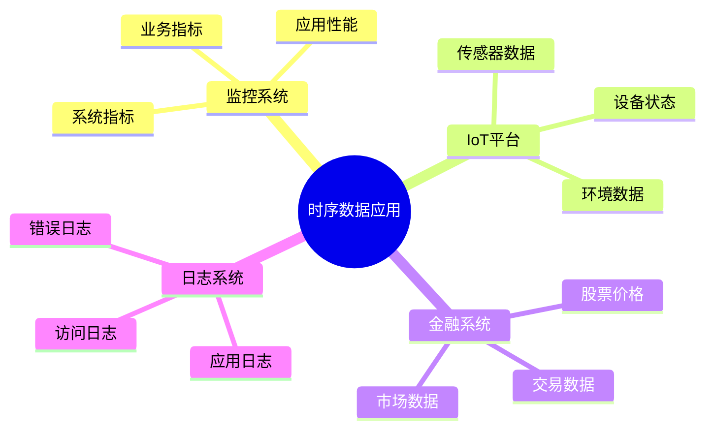
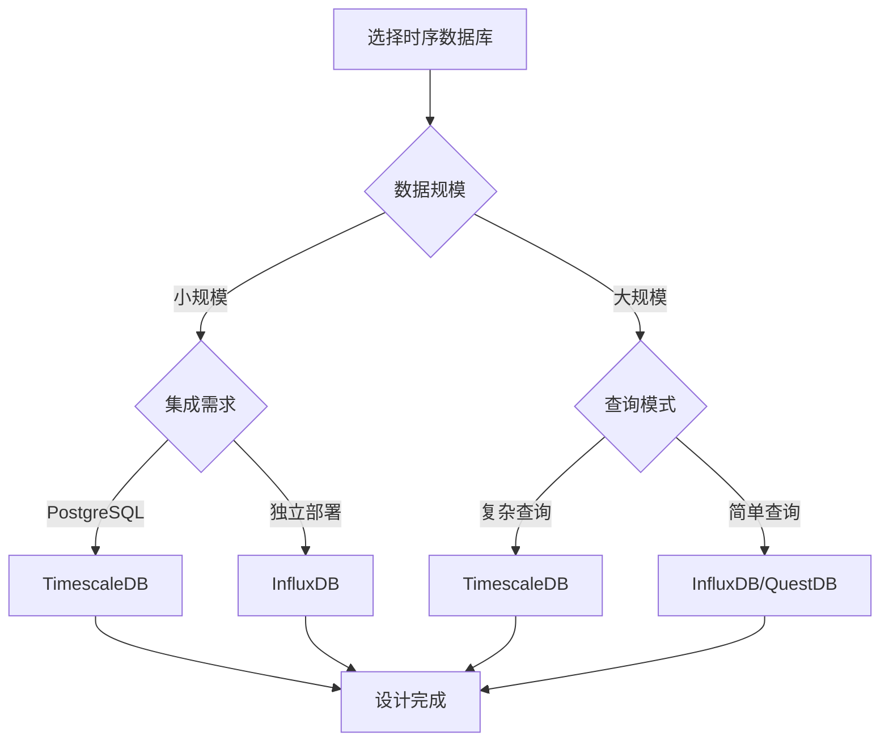
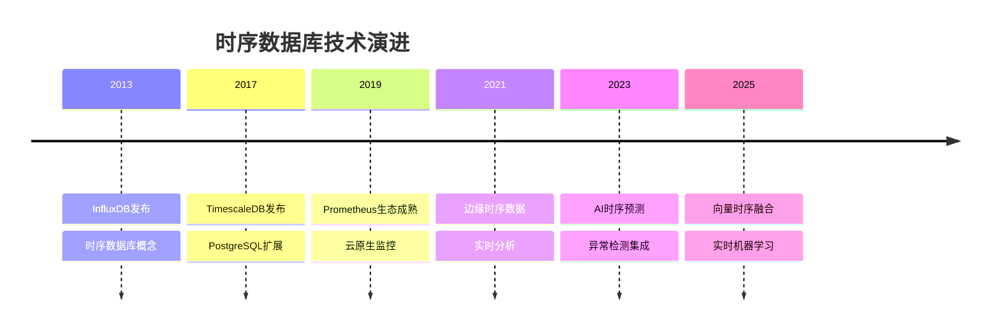

# 时序数据库设计模式：时间序列数据的高效存储与查询

> **创建日期**：2025-01-15
> **最后更新**：2025-12-01
> **版本**：v2.0 (增强版)
> **状态**：实施中

---

## 📋 目录

- [时序数据库设计模式：时间序列数据的高效存储与查询](#时序数据库设计模式时间序列数据的高效存储与查询)
  - [📋 目录](#-目录)
  - [1. 概述](#1-概述)
    - [1.1. 时序数据应用场景](#11-时序数据应用场景)
    - [1.2. 时序数据库选择决策树](#12-时序数据库选择决策树)
  - [2. 时序数据特性](#2-时序数据特性)
    - [2.1. 时序数据特征](#21-时序数据特征)
    - [2.2. 时序数据模型](#22-时序数据模型)
  - [3. 时序数据库Schema设计](#3-时序数据库schema设计)
    - [3.1. TimescaleDB设计（PostgreSQL扩展）](#31-timescaledb设计postgresql扩展)
    - [3.2. 标签模型设计](#32-标签模型设计)
  - [4. 时序数据分区策略](#4-时序数据分区策略)
    - [4.1. TimescaleDB自动分区](#41-timescaledb自动分区)
    - [4.2. 自定义分区策略](#42-自定义分区策略)
  - [5. 时序数据压缩与归档](#5-时序数据压缩与归档)
    - [5.1. TimescaleDB压缩](#51-timescaledb压缩)
    - [5.2. 数据归档策略](#52-数据归档策略)
    - [5.3. 数据聚合与降采样](#53-数据聚合与降采样)
  - [6. 时序数据查询优化](#6-时序数据查询优化)
    - [6.1. 时间范围查询优化](#61-时间范围查询优化)
    - [6.2. 降采样查询](#62-降采样查询)
    - [6.3. 窗口函数查询](#63-窗口函数查询)
  - [7. 实际应用案例](#7-实际应用案例)
    - [7.1. 监控系统设计](#71-监控系统设计)
    - [7.2. IoT时序数据平台设计](#72-iot时序数据平台设计)
  - [8. 2024-2025最新趋势](#8-2024-2025最新趋势)
    - [8.1. 时序数据库技术演进](#81-时序数据库技术演进)
    - [8.2. 时序数据库选型矩阵](#82-时序数据库选型矩阵)
    - [8.3. 时序+向量融合模式](#83-时序向量融合模式)
  - [9. 参考资料](#9-参考资料)
    - [9.1. 权威文献](#91-权威文献)
    - [9.2. 在线资源](#92-在线资源)
    - [9.3. 相关文档](#93-相关文档)

---

## 1. 概述

时序数据库专门用于存储和查询时间序列数据，广泛应用于监控、IoT、金融等领域。

### 1.1. 时序数据应用场景



### 1.2. 时序数据库选择决策树



---

## 2. 时序数据特性

### 2.1. 时序数据特征

**时序数据定义**：

```text
时序数据 = (timestamp, metric_name, tags, value)

特征：
1. 时间有序：数据按时间顺序产生
2. 高频写入：每秒可能产生百万级数据点
3. 低频更新：数据一旦写入很少更新
4. 时间范围查询：主要查询模式是按时间范围查询
5. 数据压缩：历史数据可以压缩存储
```

### 2.2. 时序数据模型

**数据模型对比**：

| 模型 | 特点 | 适用场景 |
|------|------|---------|
| **窄表模型** | 每个指标一行 | 指标数量少，查询简单 |
| **宽表模型** | 每个时间点一行，多列指标 | 指标数量多，需要关联查询 |
| **标签模型** | 标签+值 | 灵活，支持多维度查询 |

---

## 3. 时序数据库Schema设计

### 3.1. TimescaleDB设计（PostgreSQL扩展）

**基础时序表设计**：

```sql
-- 启用TimescaleDB扩展
CREATE EXTENSION IF NOT EXISTS timescaledb;

-- 创建时序表（窄表模型）
CREATE TABLE metrics (
    time TIMESTAMPTZ NOT NULL,
    device_id BIGINT NOT NULL,
    metric_name VARCHAR(100) NOT NULL,
    value DOUBLE PRECISION NOT NULL,
    tags JSONB,
    PRIMARY KEY (time, device_id, metric_name)
);

-- 转换为超表（Hypertable）
SELECT create_hypertable('metrics', 'time',
    chunk_time_interval => INTERVAL '1 day',
    if_not_exists => TRUE
);

-- 创建索引
CREATE INDEX idx_metrics_device_time ON metrics(device_id, time DESC);
CREATE INDEX idx_metrics_metric_time ON metrics(metric_name, time DESC);
CREATE INDEX idx_metrics_tags ON metrics USING GIN(tags);
```

**宽表模型设计**：

```sql
-- 宽表模型：每个设备每个时间点一行
CREATE TABLE device_metrics (
    time TIMESTAMPTZ NOT NULL,
    device_id BIGINT NOT NULL,
    temperature DOUBLE PRECISION,
    humidity DOUBLE PRECISION,
    pressure DOUBLE PRECISION,
    voltage DOUBLE PRECISION,
    current DOUBLE PRECISION,
    PRIMARY KEY (time, device_id)
);

-- 转换为超表
SELECT create_hypertable('device_metrics', 'time',
    chunk_time_interval => INTERVAL '1 day'
);

-- 创建索引
CREATE INDEX idx_device_metrics_device ON device_metrics(device_id, time DESC);
```

### 3.2. 标签模型设计

**标签模型Schema**：

```sql
CREATE SCHEMA time_series;

-- 指标定义表
CREATE TABLE time_series.metric_definitions (
    metric_id SERIAL PRIMARY KEY,
    metric_name VARCHAR(100) NOT NULL UNIQUE,
    metric_type VARCHAR(50) NOT NULL,  -- gauge, counter, histogram
    unit VARCHAR(20),
    description TEXT,
    created_at TIMESTAMPTZ NOT NULL DEFAULT CURRENT_TIMESTAMP
);

-- 标签键定义表
CREATE TABLE time_series.tag_keys (
    tag_key_id SERIAL PRIMARY KEY,
    tag_key VARCHAR(100) NOT NULL UNIQUE,
    description TEXT,
    created_at TIMESTAMPTZ NOT NULL DEFAULT CURRENT_TIMESTAMP
);

-- 标签值定义表
CREATE TABLE time_series.tag_values (
    tag_value_id SERIAL PRIMARY KEY,
    tag_key_id INTEGER NOT NULL REFERENCES time_series.tag_keys(tag_key_id),
    tag_value VARCHAR(200) NOT NULL,
    created_at TIMESTAMPTZ NOT NULL DEFAULT CURRENT_TIMESTAMP,
    UNIQUE(tag_key_id, tag_value)
);

-- 时序数据表（标签模型）
CREATE TABLE time_series.time_series_data (
    time TIMESTAMPTZ NOT NULL,
    metric_id INTEGER NOT NULL REFERENCES time_series.metric_definitions(metric_id),
    value DOUBLE PRECISION NOT NULL,
    tags JSONB NOT NULL,  -- {tag_key: tag_value, ...}
    PRIMARY KEY (time, metric_id, tags)
);

-- 转换为超表
SELECT create_hypertable('time_series.time_series_data', 'time',
    chunk_time_interval => INTERVAL '1 day'
);

-- 创建索引
CREATE INDEX idx_ts_data_metric_time ON time_series.time_series_data(metric_id, time DESC);
CREATE INDEX idx_ts_data_tags ON time_series.time_series_data USING GIN(tags);
CREATE INDEX idx_ts_data_time ON time_series.time_series_data(time DESC);
```

---

## 4. 时序数据分区策略

### 4.1. TimescaleDB自动分区

**分区配置**：

```sql
-- 创建超表时指定分区间隔
SELECT create_hypertable('metrics', 'time',
    chunk_time_interval => INTERVAL '1 day',  -- 每天一个分区
    if_not_exists => TRUE
);

-- 查看分区信息
SELECT * FROM timescaledb_information.chunks
WHERE hypertable_name = 'metrics'
ORDER BY range_start DESC;

-- 手动创建分区（如果需要）
SELECT add_retention_policy('metrics', INTERVAL '90 days');
```

### 4.2. 自定义分区策略

**按设备+时间分区**：

```sql
-- 创建分区表
CREATE TABLE metrics_partitioned (
    time TIMESTAMPTZ NOT NULL,
    device_id BIGINT NOT NULL,
    metric_name VARCHAR(100) NOT NULL,
    value DOUBLE PRECISION NOT NULL,
    PRIMARY KEY (time, device_id, metric_name)
) PARTITION BY RANGE (time);

-- 创建设备分区（如果需要）
-- 注意：PostgreSQL不支持多级分区，需要应用层处理

-- 创建时间分区
CREATE TABLE metrics_2024_01 PARTITION OF metrics_partitioned
FOR VALUES FROM ('2024-01-01') TO ('2024-02-01');

-- 自动创建未来分区的函数
CREATE OR REPLACE FUNCTION create_monthly_partitions(
    p_table_name TEXT,
    p_start_date DATE,
    p_months_ahead INTEGER DEFAULT 12
)
RETURNS VOID AS $$
DECLARE
    v_date DATE;
    v_partition_name TEXT;
    v_start_date DATE;
    v_end_date DATE;
BEGIN
    v_date := p_start_date;

    FOR i IN 1..p_months_ahead LOOP
        v_start_date := date_trunc('month', v_date);
        v_end_date := v_start_date + INTERVAL '1 month';
        v_partition_name := p_table_name || '_' || to_char(v_start_date, 'YYYY_MM');

        EXECUTE format(
            'CREATE TABLE IF NOT EXISTS %I PARTITION OF %I FOR VALUES FROM (%L) TO (%L)',
            v_partition_name,
            p_table_name,
            v_start_date,
            v_end_date
        );

        v_date := v_end_date;
    END LOOP;
END;
$$ LANGUAGE plpgsql;
```

---

## 5. 时序数据压缩与归档

### 5.1. TimescaleDB压缩

**压缩策略**：

```sql
-- 启用压缩
ALTER TABLE metrics SET (
    timescaledb.compress,
    timescaledb.compress_segmentby = 'device_id, metric_name',
    timescaledb.compress_orderby = 'time DESC'
);

-- 添加压缩策略（7天前的数据压缩）
SELECT add_compression_policy('metrics', INTERVAL '7 days');

-- 查看压缩状态
SELECT * FROM timescaledb_information.compressed_chunk_stats
WHERE hypertable_name = 'metrics';
```

### 5.2. 数据归档策略

**归档Schema设计**：

```sql
CREATE SCHEMA archive;

-- 归档表（压缩存储）
CREATE TABLE archive.metrics_archive (
    LIKE metrics INCLUDING ALL
) PARTITION BY RANGE (time);

-- 归档函数
CREATE OR REPLACE FUNCTION archive_old_metrics(
    p_table_name TEXT,
    p_archive_before_date TIMESTAMPTZ
)
RETURNS INTEGER AS $$
DECLARE
    v_archived_count INTEGER;
BEGIN
    -- 将旧数据移动到归档表
    EXECUTE format(
        'INSERT INTO archive.%I_archive SELECT * FROM %I WHERE time < %L',
        p_table_name,
        p_table_name,
        p_archive_before_date
    );

    GET DIAGNOSTICS v_archived_count = ROW_COUNT;

    -- 删除原表中的数据
    EXECUTE format(
        'DELETE FROM %I WHERE time < %L',
        p_table_name,
        p_archive_before_date
    );

    RETURN v_archived_count;
END;
$$ LANGUAGE plpgsql;

-- 自动归档策略（使用pg_cron）
-- SELECT cron.schedule('archive-metrics', '0 2 * * *',
--     'SELECT archive_old_metrics(''metrics'', CURRENT_TIMESTAMP - INTERVAL ''90 days'')');
```

### 5.3. 数据聚合与降采样

**聚合表设计**：

```sql
-- 原始数据表
CREATE TABLE metrics_raw (
    time TIMESTAMPTZ NOT NULL,
    device_id BIGINT NOT NULL,
    metric_name VARCHAR(100) NOT NULL,
    value DOUBLE PRECISION NOT NULL,
    PRIMARY KEY (time, device_id, metric_name)
);

-- 1分钟聚合表
CREATE TABLE metrics_1min (
    time TIMESTAMPTZ NOT NULL,
    device_id BIGINT NOT NULL,
    metric_name VARCHAR(100) NOT NULL,
    value_avg DOUBLE PRECISION,
    value_min DOUBLE PRECISION,
    value_max DOUBLE PRECISION,
    value_count INTEGER,
    PRIMARY KEY (time, device_id, metric_name)
);

-- 1小时聚合表
CREATE TABLE metrics_1hour (
    time TIMESTAMPTZ NOT NULL,
    device_id BIGINT NOT NULL,
    metric_name VARCHAR(100) NOT NULL,
    value_avg DOUBLE PRECISION,
    value_min DOUBLE PRECISION,
    value_max DOUBLE PRECISION,
    value_count INTEGER,
    PRIMARY KEY (time, device_id, metric_name)
);

-- 聚合函数
CREATE OR REPLACE FUNCTION aggregate_metrics(
    p_source_table TEXT,
    p_target_table TEXT,
    p_interval INTERVAL
)
RETURNS VOID AS $$
BEGIN
    EXECUTE format('
        INSERT INTO %I (time, device_id, metric_name, value_avg, value_min, value_max, value_count)
        SELECT
            date_trunc(''minute'', time) AS time,
            device_id,
            metric_name,
            AVG(value) AS value_avg,
            MIN(value) AS value_min,
            MAX(value) AS value_max,
            COUNT(*) AS value_count
        FROM %I
        WHERE time >= CURRENT_TIMESTAMP - %L
          AND time < date_trunc(''minute'', CURRENT_TIMESTAMP)
        GROUP BY date_trunc(''minute'', time), device_id, metric_name
        ON CONFLICT (time, device_id, metric_name) DO UPDATE SET
            value_avg = EXCLUDED.value_avg,
            value_min = EXCLUDED.value_min,
            value_max = EXCLUDED.value_max,
            value_count = EXCLUDED.value_count
    ', p_target_table, p_source_table, p_interval);
END;
$$ LANGUAGE plpgsql;
```

---

## 6. 时序数据查询优化

### 6.1. 时间范围查询优化

**查询优化技巧**：

```sql
-- ✅ 好的查询：使用时间范围索引
SELECT time, device_id, metric_name, value
FROM metrics
WHERE device_id = 123
  AND time >= '2024-01-01'::TIMESTAMPTZ
  AND time < '2024-01-02'::TIMESTAMPTZ
ORDER BY time DESC;

-- ✅ 使用连续聚合（Continuous Aggregates）
CREATE MATERIALIZED VIEW metrics_hourly
WITH (timescaledb.continuous) AS
SELECT
    time_bucket('1 hour', time) AS bucket,
    device_id,
    metric_name,
    AVG(value) AS avg_value,
    MIN(value) AS min_value,
    MAX(value) AS max_value,
    COUNT(*) AS count
FROM metrics
GROUP BY bucket, device_id, metric_name;

-- 自动刷新连续聚合
SELECT add_continuous_aggregate_policy('metrics_hourly',
    start_offset => INTERVAL '3 hours',
    end_offset => INTERVAL '1 hour',
    schedule_interval => INTERVAL '1 hour'
);

-- 查询连续聚合（性能更好）
SELECT bucket, device_id, metric_name, avg_value
FROM metrics_hourly
WHERE device_id = 123
  AND bucket >= '2024-01-01'::TIMESTAMPTZ
  AND bucket < '2024-01-02'::TIMESTAMPTZ
ORDER BY bucket DESC;
```

### 6.2. 降采样查询

**降采样函数**：

```sql
-- 降采样查询函数
CREATE OR REPLACE FUNCTION downsample_metrics(
    p_device_id BIGINT,
    p_metric_name VARCHAR,
    p_start_time TIMESTAMPTZ,
    p_end_time TIMESTAMPTZ,
    p_interval INTERVAL
)
RETURNS TABLE (
    time TIMESTAMPTZ,
    value_avg DOUBLE PRECISION,
    value_min DOUBLE PRECISION,
    value_max DOUBLE PRECISION
) AS $$
BEGIN
    RETURN QUERY
    SELECT
        date_trunc('minute', m.time) AS time,
        AVG(m.value) AS value_avg,
        MIN(m.value) AS value_min,
        MAX(m.value) AS value_max
    FROM metrics m
    WHERE m.device_id = p_device_id
      AND m.metric_name = p_metric_name
      AND m.time >= p_start_time
      AND m.time < p_end_time
    GROUP BY date_trunc('minute', m.time)
    ORDER BY time;
END;
$$ LANGUAGE plpgsql;
```

### 6.3. 窗口函数查询

**窗口函数应用**：

```sql
-- 计算移动平均
SELECT
    time,
    device_id,
    metric_name,
    value,
    AVG(value) OVER (
        PARTITION BY device_id, metric_name
        ORDER BY time
        ROWS BETWEEN 9 PRECEDING AND CURRENT ROW
    ) AS moving_avg_10
FROM metrics
WHERE device_id = 123
  AND time >= CURRENT_TIMESTAMP - INTERVAL '1 day'
ORDER BY time;

-- 计算变化率
SELECT
    time,
    device_id,
    metric_name,
    value,
    value - LAG(value) OVER (
        PARTITION BY device_id, metric_name
        ORDER BY time
    ) AS value_change,
    (value - LAG(value) OVER (
        PARTITION BY device_id, metric_name
        ORDER BY time
    )) / NULLIF(LAG(value) OVER (
        PARTITION BY device_id, metric_name
        ORDER BY time
    ), 0) * 100 AS value_change_percent
FROM metrics
WHERE device_id = 123
  AND time >= CURRENT_TIMESTAMP - INTERVAL '1 day'
ORDER BY time;
```

---

## 7. 实际应用案例

### 7.1. 监控系统设计

**完整监控系统Schema**：

```sql
CREATE SCHEMA monitoring;

-- 主机表
CREATE TABLE monitoring.hosts (
    host_id BIGSERIAL PRIMARY KEY,
    hostname VARCHAR(200) NOT NULL UNIQUE,
    ip_address INET,
    host_type VARCHAR(50),
    location VARCHAR(200),
    tags JSONB,
    created_at TIMESTAMPTZ NOT NULL DEFAULT CURRENT_TIMESTAMP
);

-- 指标定义表
CREATE TABLE monitoring.metrics (
    metric_id SERIAL PRIMARY KEY,
    metric_name VARCHAR(200) NOT NULL UNIQUE,
    metric_type VARCHAR(50) NOT NULL,  -- counter, gauge, histogram
    unit VARCHAR(20),
    description TEXT,
    created_at TIMESTAMPTZ NOT NULL DEFAULT CURRENT_TIMESTAMP
);

-- 监控数据表（时序数据）
CREATE TABLE monitoring.metric_data (
    time TIMESTAMPTZ NOT NULL,
    host_id BIGINT NOT NULL REFERENCES monitoring.hosts(host_id),
    metric_id INTEGER NOT NULL REFERENCES monitoring.metrics(metric_id),
    value DOUBLE PRECISION NOT NULL,
    labels JSONB,  -- 额外的标签
    PRIMARY KEY (time, host_id, metric_id)
);

-- 转换为超表
SELECT create_hypertable('monitoring.metric_data', 'time',
    chunk_time_interval => INTERVAL '1 day'
);

-- 创建索引
CREATE INDEX idx_metric_data_host ON monitoring.metric_data(host_id, time DESC);
CREATE INDEX idx_metric_data_metric ON monitoring.metric_data(metric_id, time DESC);
CREATE INDEX idx_metric_data_labels ON monitoring.metric_data USING GIN(labels);

-- 告警规则表
CREATE TABLE monitoring.alert_rules (
    rule_id SERIAL PRIMARY KEY,
    rule_name VARCHAR(200) NOT NULL,
    metric_id INTEGER NOT NULL REFERENCES monitoring.metrics(metric_id),
    condition_type VARCHAR(20) NOT NULL CHECK (condition_type IN ('gt', 'lt', 'eq', 'ne')),
    threshold_value DOUBLE PRECISION NOT NULL,
    duration INTERVAL NOT NULL,
    severity VARCHAR(20) NOT NULL CHECK (severity IN ('critical', 'warning', 'info')),
    is_active BOOLEAN DEFAULT TRUE,
    created_at TIMESTAMPTZ NOT NULL DEFAULT CURRENT_TIMESTAMP
);

-- 告警记录表
CREATE TABLE monitoring.alerts (
    alert_id BIGSERIAL PRIMARY KEY,
    rule_id INTEGER NOT NULL REFERENCES monitoring.alert_rules(rule_id),
    host_id BIGINT NOT NULL REFERENCES monitoring.hosts(host_id),
    metric_id INTEGER NOT NULL REFERENCES monitoring.metrics(metric_id),
    alert_value DOUBLE PRECISION NOT NULL,
    threshold_value DOUBLE PRECISION NOT NULL,
    severity VARCHAR(20) NOT NULL,
    status VARCHAR(20) NOT NULL CHECK (status IN ('firing', 'resolved', 'acknowledged')),
    started_at TIMESTAMPTZ NOT NULL,
    resolved_at TIMESTAMPTZ,
    acknowledged_at TIMESTAMPTZ,
    acknowledged_by VARCHAR(100),
    created_at TIMESTAMPTZ NOT NULL DEFAULT CURRENT_TIMESTAMP
);

CREATE INDEX idx_alerts_status ON monitoring.alerts(status, started_at DESC) WHERE status = 'firing';
CREATE INDEX idx_alerts_host ON monitoring.alerts(host_id, started_at DESC);

-- 告警检测函数
CREATE OR REPLACE FUNCTION check_alert_rules()
RETURNS TABLE (
    rule_id INTEGER,
    host_id BIGINT,
    metric_id INTEGER,
    current_value DOUBLE PRECISION,
    threshold_value DOUBLE PRECISION
) AS $$
BEGIN
    RETURN QUERY
    WITH recent_metrics AS (
        SELECT
            host_id,
            metric_id,
            AVG(value) AS avg_value
        FROM monitoring.metric_data
        WHERE time >= CURRENT_TIMESTAMP - INTERVAL '5 minutes'
        GROUP BY host_id, metric_id
    )
    SELECT
        ar.rule_id,
        rm.host_id,
        rm.metric_id,
        rm.avg_value AS current_value,
        ar.threshold_value
    FROM monitoring.alert_rules ar
    JOIN recent_metrics rm ON ar.metric_id = rm.metric_id
    WHERE ar.is_active = TRUE
      AND (
          (ar.condition_type = 'gt' AND rm.avg_value > ar.threshold_value) OR
          (ar.condition_type = 'lt' AND rm.avg_value < ar.threshold_value) OR
          (ar.condition_type = 'eq' AND rm.avg_value = ar.threshold_value)
      )
      AND NOT EXISTS (
          SELECT 1 FROM monitoring.alerts a
          WHERE a.rule_id = ar.rule_id
            AND a.host_id = rm.host_id
            AND a.status = 'firing'
      );
END;
$$ LANGUAGE plpgsql;
```

### 7.2. IoT时序数据平台设计

**IoT时序数据Schema**：

```sql
CREATE SCHEMA iot_ts;

-- 设备表
CREATE TABLE iot_ts.devices (
    device_id BIGSERIAL PRIMARY KEY,
    device_code VARCHAR(100) NOT NULL UNIQUE,
    device_type VARCHAR(50) NOT NULL,
    location POINT,  -- PostGIS
    metadata JSONB,
    created_at TIMESTAMPTZ NOT NULL DEFAULT CURRENT_TIMESTAMP
);

-- 传感器数据表（高频时序数据）
CREATE TABLE iot_ts.sensor_readings (
    time TIMESTAMPTZ NOT NULL,
    device_id BIGINT NOT NULL REFERENCES iot_ts.devices(device_id),
    sensor_name VARCHAR(100) NOT NULL,
    value DOUBLE PRECISION NOT NULL,
    quality INTEGER CHECK (quality BETWEEN 0 AND 100),
    PRIMARY KEY (time, device_id, sensor_name)
);

-- 转换为超表
SELECT create_hypertable('iot_ts.sensor_readings', 'time',
    chunk_time_interval => INTERVAL '1 hour',  -- 高频数据，按小时分区
    if_not_exists => TRUE
);

-- 创建索引
CREATE INDEX idx_sensor_readings_device ON iot_ts.sensor_readings(device_id, time DESC);
CREATE INDEX idx_sensor_readings_sensor ON iot_ts.sensor_readings(device_id, sensor_name, time DESC);

-- 设备状态表（状态变更记录）
CREATE TABLE iot_ts.device_status_changes (
    time TIMESTAMPTZ NOT NULL,
    device_id BIGINT NOT NULL REFERENCES iot_ts.devices(device_id),
    old_status VARCHAR(50),
    new_status VARCHAR(50) NOT NULL,
    change_reason TEXT,
    PRIMARY KEY (time, device_id)
);

SELECT create_hypertable('iot_ts.device_status_changes', 'time',
    chunk_time_interval => INTERVAL '1 day'
);

-- 实时数据视图（最近1小时的数据）
CREATE MATERIALIZED VIEW iot_ts.realtime_sensor_data
WITH (timescaledb.continuous) AS
SELECT
    time_bucket('1 minute', time) AS bucket,
    device_id,
    sensor_name,
    AVG(value) AS avg_value,
    MIN(value) AS min_value,
    MAX(value) AS max_value,
    COUNT(*) AS sample_count
FROM iot_ts.sensor_readings
WHERE time >= CURRENT_TIMESTAMP - INTERVAL '1 hour'
GROUP BY bucket, device_id, sensor_name;

-- 自动刷新策略
SELECT add_continuous_aggregate_policy('iot_ts.realtime_sensor_data',
    start_offset => INTERVAL '2 hours',
    end_offset => INTERVAL '1 minute',
    schedule_interval => INTERVAL '1 minute'
);
```

---

## 8. 2024-2025最新趋势

### 8.1. 时序数据库技术演进



### 8.2. 时序数据库选型矩阵

| 数据库 | 类型 | 压缩率 | 查询性能 | 生态集成 | 适用场景 |
|-------|------|--------|---------|---------|---------|
| **TimescaleDB** | PG扩展 | 90%+ | 高 | PostgreSQL | 通用时序 |
| **InfluxDB** | 原生 | 85%+ | 高 | Telegraf/Grafana | 监控 |
| **QuestDB** | 原生 | 90%+ | 极高 | 轻量 | 金融/IoT |
| **ClickHouse** | 列存 | 95%+ | 极高 | 分析生态 | OLAP分析 |
| **Prometheus** | 内存 | 中 | 高 | Kubernetes | 云原生监控 |
| **TDengine** | 原生 | 90%+ | 高 | 国产生态 | 工业IoT |

### 8.3. 时序+向量融合模式

```sql
-- 时序数据与向量Embedding融合
CREATE TABLE ts_vector.sensor_readings_with_embedding (
    time TIMESTAMPTZ NOT NULL,
    device_id BIGINT NOT NULL,
    sensor_values DOUBLE PRECISION[] NOT NULL,
    embedding vector(128),  -- 传感器特征向量
    anomaly_score FLOAT,
    PRIMARY KEY (time, device_id)
);

-- 异常检测：基于向量相似度
CREATE OR REPLACE FUNCTION detect_anomaly_by_embedding(
    p_device_id BIGINT,
    p_current_embedding vector(128),
    p_threshold FLOAT DEFAULT 0.3
)
RETURNS BOOLEAN AS $$
DECLARE
    v_avg_distance FLOAT;
BEGIN
    SELECT AVG(1 - (embedding <=> p_current_embedding))
    INTO v_avg_distance
    FROM ts_vector.sensor_readings_with_embedding
    WHERE device_id = p_device_id
      AND time >= NOW() - INTERVAL '1 hour';

    RETURN v_avg_distance < p_threshold;
END;
$$ LANGUAGE plpgsql;
```

---

## 9. 参考资料

### 9.1. 权威文献

**时序数据理论**：

- Pelkonen, T. et al. (2015). "Gorilla: A Fast, Scalable, In-Memory Time Series Database" (Facebook)
- Adams, B. et al. (2020). "Time Series Made Easy" (TimescaleDB)

### 9.2. 在线资源

| 资源 | URL | 描述 |
|------|-----|------|
| **TimescaleDB文档** | <https://docs.timescale.com/> | 时序扩展 |
| **InfluxDB文档** | <https://docs.influxdata.com/> | 原生时序 |
| **Prometheus文档** | <https://prometheus.io/docs/> | 云原生监控 |

### 9.3. 相关文档

- [07.11-地理空间数据库设计](./07.11-地理空间数据库设计.md)
- [07.08-数据库性能调优实战](./07.08-数据库性能调优实战.md)
- [07.10-向量数据库设计](./07.10-向量数据库设计.md)

---

**最后更新**：2025-12-01
**维护者**：Data-Science Team
**状态**：实施中
**版本**：v2.0 (增强版)
