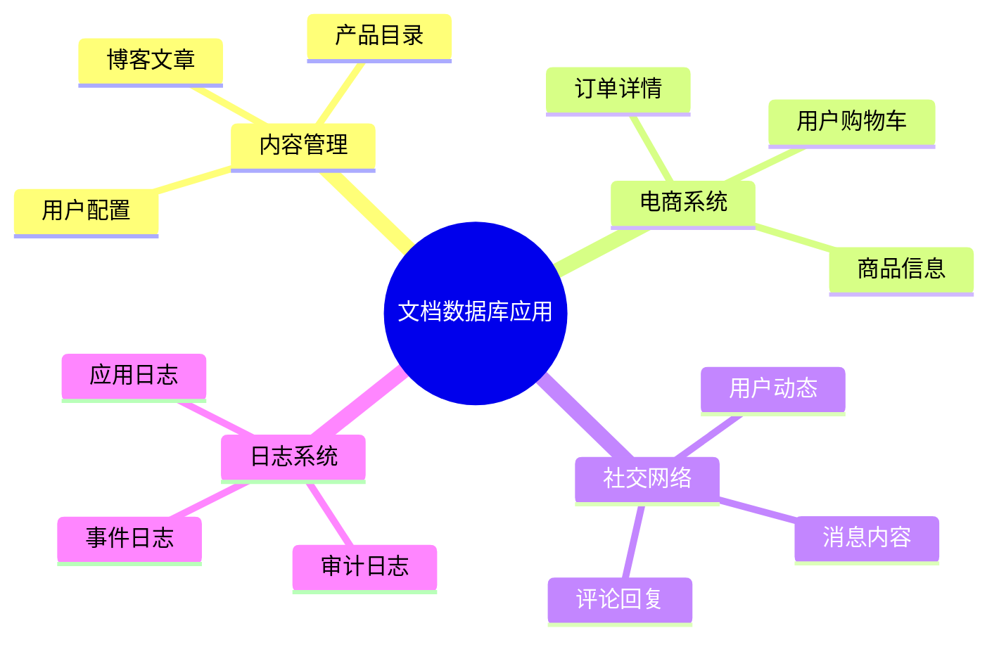
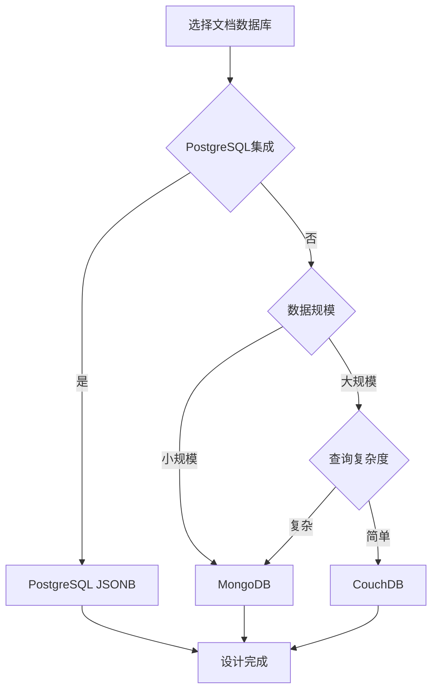
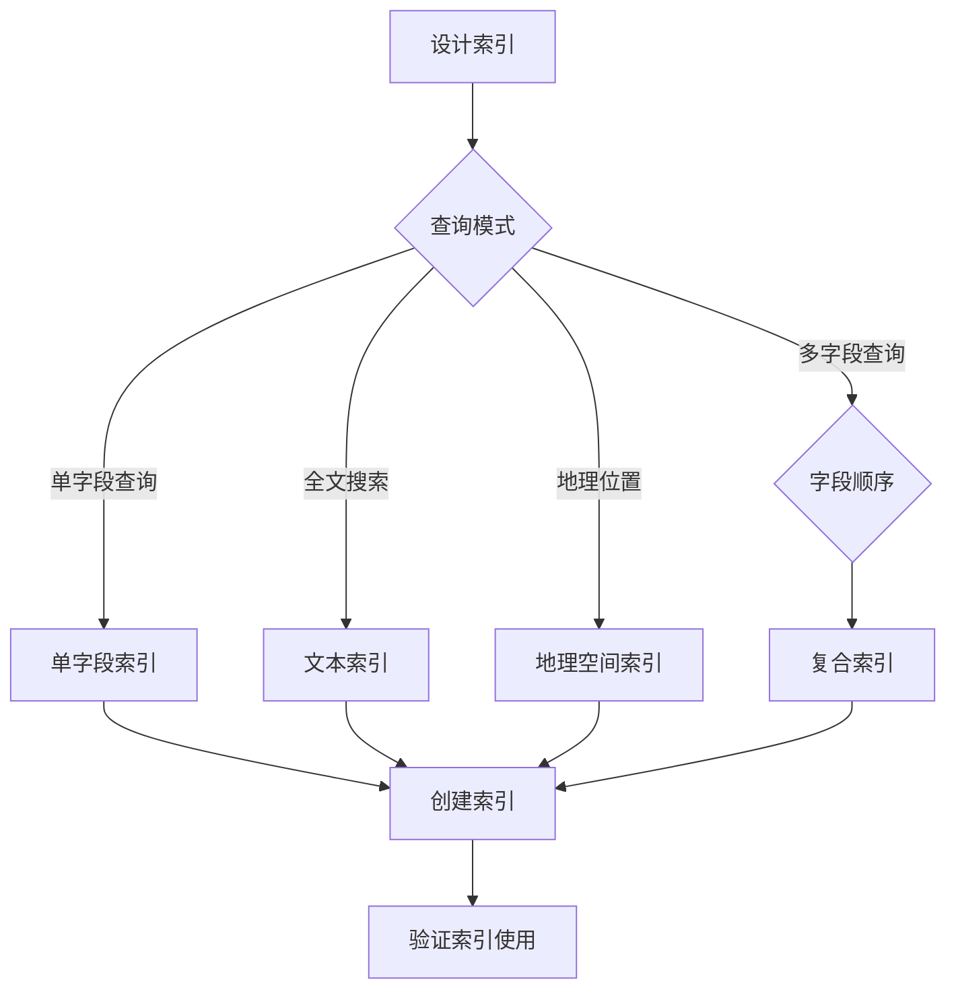

# 文档数据库设计模式：NoSQL文档模型的高效设计

> **创建日期**：2025-01-15
> **最后更新**：2025-01-15
> **版本**：v1.0
> **状态**：实施中

---

## 📋 目录

- [文档数据库设计模式：NoSQL文档模型的高效设计](#文档数据库设计模式nosql文档模型的高效设计)
  - [📋 目录](#-目录)
  - [1. 概述](#1-概述)
    - [1.1. 文档数据库应用场景](#11-文档数据库应用场景)
    - [1.2. 文档数据库选择决策树](#12-文档数据库选择决策树)
  - [2. 文档数据模型](#2-文档数据模型)
    - [2.1. 文档模型特征](#21-文档模型特征)
    - [2.2. 文档模型设计原则](#22-文档模型设计原则)
  - [3. MongoDB Schema设计](#3-mongodb-schema设计)
    - [3.1. 嵌入模式设计](#31-嵌入模式设计)
    - [3.2. 引用模式设计](#32-引用模式设计)
  - [4. PostgreSQL JSONB设计](#4-postgresql-jsonb设计)
    - [4.1. JSONB Schema设计](#41-jsonb-schema设计)
    - [4.2. JSONB查询优化](#42-jsonb查询优化)
    - [4.3. JSONB Schema验证](#43-jsonb-schema验证)
  - [5. 文档数据库查询优化](#5-文档数据库查询优化)
    - [5.1. MongoDB查询优化](#51-mongodb查询优化)
    - [5.2. PostgreSQL JSONB查询优化](#52-postgresql-jsonb查询优化)
  - [6. 文档数据库索引策略](#6-文档数据库索引策略)
    - [6.1. MongoDB索引策略](#61-mongodb索引策略)
    - [6.2. PostgreSQL JSONB索引策略](#62-postgresql-jsonb索引策略)
  - [7. 实际应用案例](#7-实际应用案例)
    - [7.1. 内容管理系统设计](#71-内容管理系统设计)
    - [7.2. 电商产品目录设计](#72-电商产品目录设计)
  - [8. 参考资料](#8-参考资料)

---

## 1. 概述

文档数据库以文档（通常是JSON/BSON）为基本存储单位，适合存储半结构化数据。

### 1.1. 文档数据库应用场景



### 1.2. 文档数据库选择决策树



---

## 2. 文档数据模型

### 2.1. 文档模型特征

**文档数据定义**：

```text
文档 = {
    _id: 唯一标识符,
    field1: value1,
    field2: {
        nested_field: value
    },
    array_field: [item1, item2, ...],
    metadata: {...}
}

特征：
1. 自包含：文档包含所有相关数据
2. 灵活Schema：不同文档可以有不同结构
3. 嵌套支持：支持嵌套对象和数组
4. 无连接：避免JOIN操作
```

### 2.2. 文档模型设计原则

**设计原则对比**：

| 原则 | 说明 | 示例 |
|------|------|------|
| **嵌入优先** | 相关数据嵌入同一文档 | 用户信息+地址嵌入 |
| **引用适度** | 避免过度嵌套，适度引用 | 订单引用用户ID |
| **反范式化** | 为查询性能反范式化 | 订单中冗余商品名称 |
| **版本控制** | 文档结构变更的版本管理 | 使用version字段 |

---

## 3. MongoDB Schema设计

### 3.1. 嵌入模式设计

**用户文档设计（嵌入地址）**：

```javascript
// MongoDB用户文档
{
    _id: ObjectId("..."),
    username: "alice",
    email: "alice@example.com",
    profile: {
        firstName: "Alice",
        lastName: "Smith",
        age: 30,
        avatar: "https://..."
    },
    addresses: [
        {
            type: "home",
            street: "123 Main St",
            city: "New York",
            zipCode: "10001",
            isDefault: true
        },
        {
            type: "work",
            street: "456 Park Ave",
            city: "New York",
            zipCode: "10002",
            isDefault: false
        }
    ],
    preferences: {
        theme: "dark",
        language: "en",
        notifications: {
            email: true,
            sms: false
        }
    },
    createdAt: ISODate("2024-01-15T10:00:00Z"),
    updatedAt: ISODate("2024-01-15T10:00:00Z")
}
```

**MongoDB Schema验证**：

```javascript
// MongoDB Schema验证（Mongoose示例）
const userSchema = new mongoose.Schema({
    username: {
        type: String,
        required: true,
        unique: true,
        index: true
    },
    email: {
        type: String,
        required: true,
        unique: true,
        index: true
    },
    profile: {
        firstName: String,
        lastName: String,
        age: {
            type: Number,
            min: 0,
            max: 150
        },
        avatar: String
    },
    addresses: [{
        type: {
            type: String,
            enum: ['home', 'work', 'other'],
            required: true
        },
        street: String,
        city: String,
        zipCode: String,
        isDefault: Boolean
    }],
    preferences: {
        theme: {
            type: String,
            enum: ['light', 'dark'],
            default: 'light'
        },
        language: {
            type: String,
            default: 'en'
        },
        notifications: {
            email: Boolean,
            sms: Boolean
        }
    },
    createdAt: {
        type: Date,
        default: Date.now
    },
    updatedAt: {
        type: Date,
        default: Date.now
    }
});

// 索引
userSchema.index({ username: 1 });
userSchema.index({ email: 1 });
userSchema.index({ 'addresses.city': 1 });
userSchema.index({ createdAt: -1 });
```

### 3.2. 引用模式设计

**订单文档设计（引用用户和商品）**：

```javascript
// MongoDB订单文档
{
    _id: ObjectId("..."),
    orderNumber: "ORD-2024-001",
    userId: ObjectId("..."),  // 引用用户
    status: "pending",
    items: [
        {
            productId: ObjectId("..."),  // 引用商品
            productName: "Laptop",  // 反范式化：冗余商品名称
            productSku: "LAP-001",
            quantity: 2,
            price: 999.99,
            subtotal: 1999.98
        }
    ],
    shippingAddress: {
        street: "123 Main St",
        city: "New York",
        zipCode: "10001"
    },
    totalAmount: 1999.98,
    createdAt: ISODate("2024-01-15T10:00:00Z"),
    updatedAt: ISODate("2024-01-15T10:00:00Z")
}
```

**订单Schema验证**：

```javascript
const orderSchema = new mongoose.Schema({
    orderNumber: {
        type: String,
        required: true,
        unique: true,
        index: true
    },
    userId: {
        type: mongoose.Schema.Types.ObjectId,
        ref: 'User',
        required: true,
        index: true
    },
    status: {
        type: String,
        enum: ['pending', 'processing', 'shipped', 'completed', 'cancelled'],
        default: 'pending',
        index: true
    },
    items: [{
        productId: {
            type: mongoose.Schema.Types.ObjectId,
            ref: 'Product',
            required: true
        },
        productName: String,  // 反范式化
        productSku: String,
        quantity: {
            type: Number,
            min: 1,
            required: true
        },
        price: {
            type: Number,
            min: 0,
            required: true
        },
        subtotal: {
            type: Number,
            min: 0,
            required: true
        }
    }],
    shippingAddress: {
        street: String,
        city: String,
        zipCode: String
    },
    totalAmount: {
        type: Number,
        min: 0,
        required: true
    },
    createdAt: {
        type: Date,
        default: Date.now,
        index: true
    },
    updatedAt: {
        type: Date,
        default: Date.now
    }
});

// 索引
orderSchema.index({ userId: 1, createdAt: -1 });
orderSchema.index({ status: 1, createdAt: -1 });
orderSchema.index({ 'items.productId': 1 });
```

---

## 4. PostgreSQL JSONB设计

### 4.1. JSONB Schema设计

**用户表设计（JSONB存储文档）**：

```sql
CREATE SCHEMA document_db;

-- 用户表（JSONB文档存储）
CREATE TABLE document_db.users (
    id BIGSERIAL PRIMARY KEY,
    username VARCHAR(100) NOT NULL UNIQUE,
    email VARCHAR(200) NOT NULL UNIQUE,
    document JSONB NOT NULL,  -- 完整用户文档
    created_at TIMESTAMPTZ NOT NULL DEFAULT CURRENT_TIMESTAMP,
    updated_at TIMESTAMPTZ NOT NULL DEFAULT CURRENT_TIMESTAMP
);

-- 创建GIN索引（支持JSONB查询）
CREATE INDEX idx_users_document_gin ON document_db.users USING GIN(document);
CREATE INDEX idx_users_document_username ON document_db.users((document->>'username'));
CREATE INDEX idx_users_document_email ON document_db.users((document->>'email'));

-- 创建函数索引（支持嵌套查询）
CREATE INDEX idx_users_addresses_city ON document_db.users
    USING GIN((document->'addresses'));

-- 示例文档结构
-- {
--     "username": "alice",
--     "email": "alice@example.com",
--     "profile": {
--         "firstName": "Alice",
--         "lastName": "Smith",
--         "age": 30
--     },
--     "addresses": [
--         {
--             "type": "home",
--             "street": "123 Main St",
--             "city": "New York",
--             "zipCode": "10001"
--         }
--     ],
--     "preferences": {
--         "theme": "dark",
--         "language": "en"
--     }
-- }
```

### 4.2. JSONB查询优化

**JSONB查询函数**：

```sql
-- 查询用户（按用户名）
SELECT id, document
FROM document_db.users
WHERE document->>'username' = 'alice';

-- 查询用户（按嵌套字段）
SELECT id, document
FROM document_db.users
WHERE document->'profile'->>'firstName' = 'Alice';

-- 查询用户（数组包含）
SELECT id, document
FROM document_db.users
WHERE document->'addresses' @> '[{"city": "New York"}]'::jsonb;

-- 查询用户（JSONB路径查询）
SELECT id, document->'profile'->>'firstName' AS first_name
FROM document_db.users
WHERE document @> '{"preferences": {"theme": "dark"}}'::jsonb;

-- 更新文档字段
UPDATE document_db.users
SET document = jsonb_set(
    document,
    '{preferences,theme}',
    '"light"'::jsonb
),
updated_at = CURRENT_TIMESTAMP
WHERE id = 1;

-- 添加数组元素
UPDATE document_db.users
SET document = jsonb_set(
    document,
    '{addresses}',
    (document->'addresses') || '[{"type": "work", "street": "456 Park Ave"}]'::jsonb
),
updated_at = CURRENT_TIMESTAMP
WHERE id = 1;
```

### 4.3. JSONB Schema验证

**JSONB Schema验证函数**：

```sql
-- 创建JSONB Schema验证函数
CREATE OR REPLACE FUNCTION validate_user_document(p_document JSONB)
RETURNS BOOLEAN AS $$
BEGIN
    -- 检查必需字段
    IF NOT (p_document ? 'username' AND p_document ? 'email') THEN
        RETURN FALSE;
    END IF;

    -- 检查字段类型
    IF jsonb_typeof(p_document->'username') != 'string' OR
       jsonb_typeof(p_document->'email') != 'string' THEN
        RETURN FALSE;
    END IF;

    -- 检查嵌套对象
    IF p_document ? 'profile' THEN
        IF jsonb_typeof(p_document->'profile') != 'object' THEN
            RETURN FALSE;
        END IF;

        -- 检查age字段范围
        IF (p_document->'profile'->>'age')::INTEGER NOT BETWEEN 0 AND 150 THEN
            RETURN FALSE;
        END IF;
    END IF;

    -- 检查数组
    IF p_document ? 'addresses' THEN
        IF jsonb_typeof(p_document->'addresses') != 'array' THEN
            RETURN FALSE;
        END IF;
    END IF;

    RETURN TRUE;
END;
$$ LANGUAGE plpgsql;

-- 创建触发器验证文档
CREATE OR REPLACE FUNCTION validate_user_document_trigger()
RETURNS TRIGGER AS $$
BEGIN
    IF NOT validate_user_document(NEW.document) THEN
        RAISE EXCEPTION 'Invalid user document structure';
    END IF;
    RETURN NEW;
END;
$$ LANGUAGE plpgsql;

CREATE TRIGGER trg_validate_user_document
BEFORE INSERT OR UPDATE ON document_db.users
FOR EACH ROW
EXECUTE FUNCTION validate_user_document_trigger();
```

---

## 5. 文档数据库查询优化

### 5.1. MongoDB查询优化

**MongoDB查询优化技巧**：

```javascript
// ✅ 好的查询：使用索引字段
db.users.find({ username: "alice" });

// ✅ 使用投影减少数据传输
db.users.find(
    { username: "alice" },
    { username: 1, email: 1, profile: 1 }
);

// ✅ 使用聚合管道优化复杂查询
db.orders.aggregate([
    { $match: { status: "completed" } },
    { $unwind: "$items" },
    { $group: {
        _id: "$items.productId",
        totalQuantity: { $sum: "$items.quantity" },
        totalRevenue: { $sum: "$items.subtotal" }
    }},
    { $sort: { totalRevenue: -1 } },
    { $limit: 10 }
]);

// ✅ 使用文本索引支持全文搜索
db.products.createIndex({
    title: "text",
    description: "text"
});

db.products.find({
    $text: { $search: "laptop computer" }
});
```

### 5.2. PostgreSQL JSONB查询优化

**JSONB查询优化技巧**：

```sql
-- ✅ 使用GIN索引加速JSONB查询
CREATE INDEX idx_users_document_gin ON document_db.users USING GIN(document);

-- ✅ 使用表达式索引加速特定查询
CREATE INDEX idx_users_city ON document_db.users
    ((document->'addresses'->0->>'city'));

-- ✅ 使用物化视图预聚合JSONB数据
CREATE MATERIALIZED VIEW document_db.user_stats AS
SELECT
    id,
    document->>'username' AS username,
    jsonb_array_length(document->'addresses') AS address_count,
    (document->'profile'->>'age')::INTEGER AS age
FROM document_db.users;

CREATE UNIQUE INDEX ON document_db.user_stats(id);

-- ✅ 使用JSONB路径索引（PostgreSQL 12+）
CREATE INDEX idx_users_preferences_theme ON document_db.users
    ((document->'preferences'->>'theme'));
```

---

## 6. 文档数据库索引策略

### 6.1. MongoDB索引策略

**索引设计决策树**：



**MongoDB索引示例**：

```javascript
// 单字段索引
db.users.createIndex({ username: 1 });
db.users.createIndex({ email: 1 });

// 复合索引（注意字段顺序）
db.orders.createIndex({ userId: 1, createdAt: -1 });
db.orders.createIndex({ status: 1, createdAt: -1 });

// 多键索引（数组字段）
db.users.createIndex({ "addresses.city": 1 });

// 文本索引
db.products.createIndex({
    title: "text",
    description: "text"
});

// 地理空间索引
db.locations.createIndex({ location: "2dsphere" });

// 部分索引（条件索引）
db.orders.createIndex(
    { status: 1, createdAt: -1 },
    { partialFilterExpression: { status: "pending" } }
);

// TTL索引（自动删除过期文档）
db.sessions.createIndex(
    { createdAt: 1 },
    { expireAfterSeconds: 3600 }
);
```

### 6.2. PostgreSQL JSONB索引策略

**JSONB索引设计**：

```sql
-- GIN索引（支持所有JSONB操作符）
CREATE INDEX idx_users_document_gin ON document_db.users USING GIN(document);

-- 表达式索引（特定路径）
CREATE INDEX idx_users_email ON document_db.users
    ((document->>'email'));

-- 多级路径索引
CREATE INDEX idx_users_profile_age ON document_db.users
    ((document->'profile'->>'age'));

-- 数组元素索引
CREATE INDEX idx_users_addresses_city ON document_db.users
    USING GIN((document->'addresses'));

-- 部分索引（条件索引）
CREATE INDEX idx_users_active ON document_db.users
    ((document->>'status'))
WHERE (document->>'status') = 'active';
```

---

## 7. 实际应用案例

### 7.1. 内容管理系统设计

**CMS文档Schema设计**：

```sql
CREATE SCHEMA cms_docs;

-- 文章表（JSONB文档存储）
CREATE TABLE cms_docs.articles (
    id BIGSERIAL PRIMARY KEY,
    slug VARCHAR(200) NOT NULL UNIQUE,
    title VARCHAR(500) NOT NULL,
    content JSONB NOT NULL,  -- 富文本内容、媒体、元数据
    author_id BIGINT NOT NULL,
    category_id INTEGER,
    tags TEXT[],
    status VARCHAR(20) DEFAULT 'draft',
    published_at TIMESTAMPTZ,
    created_at TIMESTAMPTZ NOT NULL DEFAULT CURRENT_TIMESTAMP,
    updated_at TIMESTAMPTZ NOT NULL DEFAULT CURRENT_TIMESTAMP
);

-- content JSONB结构示例
-- {
--     "body": "<p>Article content...</p>",
--     "excerpt": "Article excerpt...",
--     "media": [
--         {
--             "type": "image",
--             "url": "https://...",
--             "alt": "Image description"
--         }
--     ],
--     "metadata": {
--         "wordCount": 1000,
--         "readingTime": 5,
--         "seo": {
--             "metaTitle": "...",
--             "metaDescription": "..."
--         }
--     }
-- }

-- 创建索引
CREATE INDEX idx_articles_slug ON cms_docs.articles(slug);
CREATE INDEX idx_articles_status ON cms_docs.articles(status, published_at DESC);
CREATE INDEX idx_articles_content_gin ON cms_docs.articles USING GIN(content);
CREATE INDEX idx_articles_tags ON cms_docs.articles USING GIN(tags);
CREATE INDEX idx_articles_author ON cms_docs.articles(author_id, published_at DESC);

-- 全文搜索索引（PostgreSQL全文搜索）
CREATE INDEX idx_articles_content_fts ON cms_docs.articles
    USING GIN(to_tsvector('english', title || ' ' || (content->>'body')));

-- 查询函数
CREATE OR REPLACE FUNCTION search_articles(
    p_query TEXT,
    p_status VARCHAR DEFAULT 'published',
    p_limit INTEGER DEFAULT 20
)
RETURNS TABLE (
    id BIGINT,
    slug VARCHAR,
    title VARCHAR,
    excerpt TEXT,
    published_at TIMESTAMPTZ
) AS $$
BEGIN
    RETURN QUERY
    SELECT
        a.id,
        a.slug,
        a.title,
        a.content->>'excerpt' AS excerpt,
        a.published_at
    FROM cms_docs.articles a
    WHERE a.status = p_status
      AND (
          a.title ILIKE '%' || p_query || '%' OR
          a.content->>'body' ILIKE '%' || p_query || '%' OR
          to_tsvector('english', a.title || ' ' || (a.content->>'body')) @@ plainto_tsquery('english', p_query)
      )
    ORDER BY a.published_at DESC
    LIMIT p_limit;
END;
$$ LANGUAGE plpgsql;
```

### 7.2. 电商产品目录设计

**产品目录Schema设计**：

```sql
CREATE SCHEMA ecommerce_docs;

-- 产品表（JSONB文档存储）
CREATE TABLE ecommerce_docs.products (
    id BIGSERIAL PRIMARY KEY,
    sku VARCHAR(100) NOT NULL UNIQUE,
    name VARCHAR(500) NOT NULL,
    document JSONB NOT NULL,  -- 完整产品文档
    category_id INTEGER,
    brand_id INTEGER,
    price DECIMAL(10,2) NOT NULL,
    stock_quantity INTEGER DEFAULT 0,
    status VARCHAR(20) DEFAULT 'active',
    created_at TIMESTAMPTZ NOT NULL DEFAULT CURRENT_TIMESTAMP,
    updated_at TIMESTAMPTZ NOT NULL DEFAULT CURRENT_TIMESTAMP
);

-- document JSONB结构示例
-- {
--     "name": "Laptop Computer",
--     "description": "High-performance laptop...",
--     "specifications": {
--         "cpu": "Intel i7",
--         "ram": "16GB",
--         "storage": "512GB SSD",
--         "screen": "15.6 inch"
--     },
--     "images": [
--         {
--             "url": "https://...",
--             "alt": "Front view",
--             "isPrimary": true
--         }
--     ],
--     "variants": [
--         {
--             "name": "Color",
--             "options": ["Black", "Silver", "Gold"]
--         }
--     ],
--     "reviews": {
--         "averageRating": 4.5,
--         "totalReviews": 120
--     },
--     "seo": {
--         "metaTitle": "...",
--         "metaDescription": "..."
--     }
-- }

-- 创建索引
CREATE INDEX idx_products_sku ON ecommerce_docs.products(sku);
CREATE INDEX idx_products_category ON ecommerce_docs.products(category_id, status);
CREATE INDEX idx_products_price ON ecommerce_docs.products(price);
CREATE INDEX idx_products_document_gin ON ecommerce_docs.products USING GIN(document);
CREATE INDEX idx_products_specs_cpu ON ecommerce_docs.products
    ((document->'specifications'->>'cpu'));
CREATE INDEX idx_products_reviews_rating ON ecommerce_docs.products
    ((document->'reviews'->>'averageRating')::NUMERIC);

-- 产品搜索函数
CREATE OR REPLACE FUNCTION search_products(
    p_query TEXT,
    p_category_id INTEGER DEFAULT NULL,
    p_min_price DECIMAL DEFAULT NULL,
    p_max_price DECIMAL DEFAULT NULL,
    p_limit INTEGER DEFAULT 20
)
RETURNS TABLE (
    id BIGINT,
    sku VARCHAR,
    name VARCHAR,
    price DECIMAL,
    image_url TEXT,
    average_rating NUMERIC
) AS $$
BEGIN
    RETURN QUERY
    SELECT
        p.id,
        p.sku,
        p.name,
        p.price,
        (p.document->'images'->0->>'url')::TEXT AS image_url,
        (p.document->'reviews'->>'averageRating')::NUMERIC AS average_rating
    FROM ecommerce_docs.products p
    WHERE p.status = 'active'
      AND (p_category_id IS NULL OR p.category_id = p_category_id)
      AND (p_min_price IS NULL OR p.price >= p_min_price)
      AND (p_max_price IS NULL OR p.price <= p_max_price)
      AND (
          p.name ILIKE '%' || p_query || '%' OR
          p.document->>'description' ILIKE '%' || p_query || '%' OR
          to_tsvector('english', p.name || ' ' || (p.document->>'description')) @@ plainto_tsquery('english', p_query)
      )
    ORDER BY
        (p.document->'reviews'->>'averageRating')::NUMERIC DESC NULLS LAST,
        p.price ASC
    LIMIT p_limit;
END;
$$ LANGUAGE plpgsql;
```

---

## 8. 参考资料

- [多模型数据库理论](../01-理论模型/01.03-多模型数据库理论.md)
- [数据库设计最佳实践库](./07.14-数据库设计最佳实践库.md)
- [MongoDB官方文档](https://docs.mongodb.com/)
- [PostgreSQL JSONB文档](https://www.postgresql.org/docs/current/datatype-json.html)

---

**最后更新**：2025-01-15
**维护者**：Data-Science Team
**状态**：实施中
