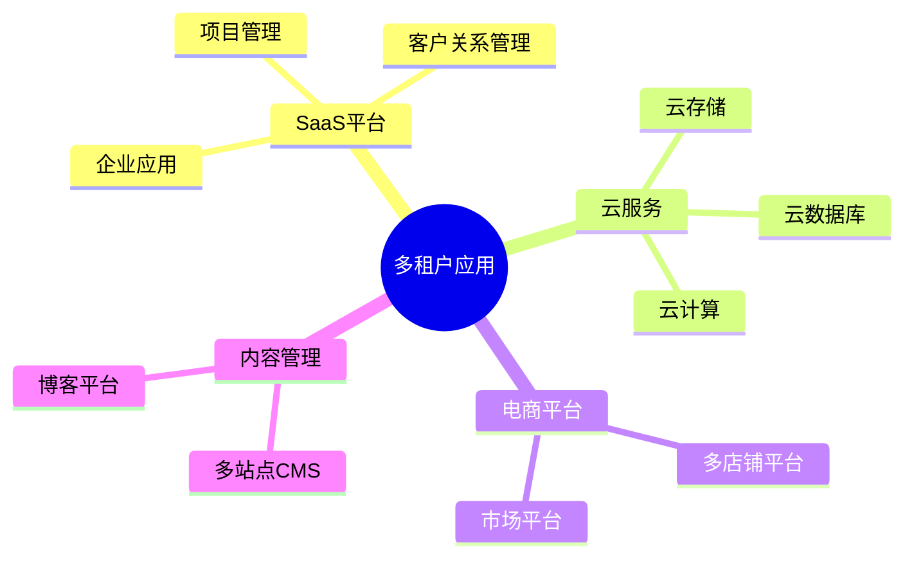
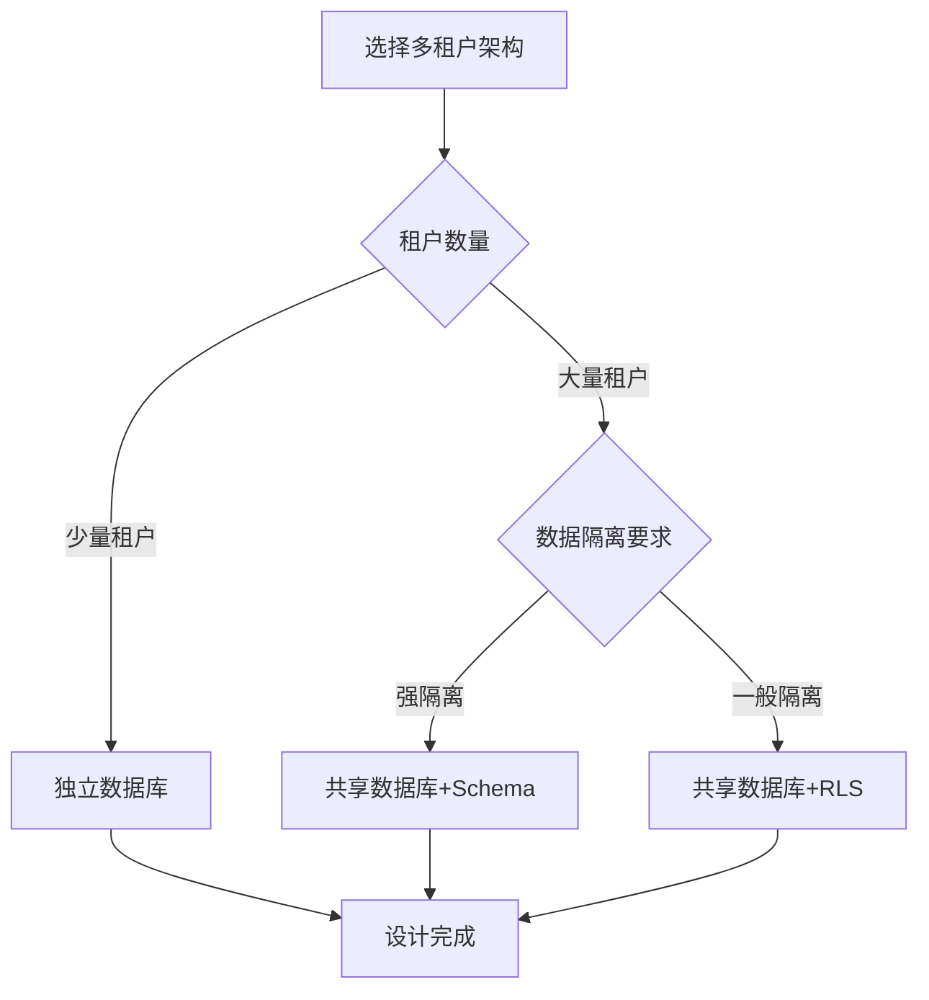
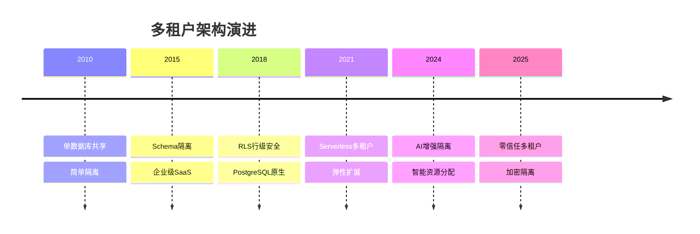

# 多租户数据库设计模式：SaaS系统的数据隔离与扩展

> **创建日期**：2025-01-15
> **最后更新**：2025-12-01
> **版本**：v2.0 (增强版)
> **状态**：实施中

---

## 📋 目录

- [多租户数据库设计模式：SaaS系统的数据隔离与扩展](#多租户数据库设计模式saas系统的数据隔离与扩展)
  - [📋 目录](#-目录)
  - [1. 概述](#1-概述)
    - [1.1. 多租户应用场景](#11-多租户应用场景)
    - [1.2. 多租户架构选择决策树](#12-多租户架构选择决策树)
  - [2. 多租户架构模式](#2-多租户架构模式)
    - [2.1. 架构模式对比](#21-架构模式对比)
    - [2.2. 架构模式选择决策矩阵](#22-架构模式选择决策矩阵)
  - [3. 共享数据库+行级安全（RLS）设计](#3-共享数据库行级安全rls设计)
    - [3.1. RLS基础Schema设计](#31-rls基础schema设计)
    - [3.2. RLS策略实现](#32-rls策略实现)
    - [3.3. 业务表RLS设计](#33-业务表rls设计)
    - [3.4. RLS性能优化](#34-rls性能优化)
  - [4. 共享数据库+Schema隔离设计](#4-共享数据库schema隔离设计)
    - [4.1. Schema隔离Schema设计](#41-schema隔离schema设计)
    - [4.2. Schema切换函数](#42-schema切换函数)
  - [5. 独立数据库设计](#5-独立数据库设计)
    - [5.1. 独立数据库Schema设计](#51-独立数据库schema设计)
  - [6. 多租户数据迁移与扩展](#6-多租户数据迁移与扩展)
    - [6.1. 租户数据迁移](#61-租户数据迁移)
    - [6.2. 租户数据扩展](#62-租户数据扩展)
  - [7. 实际应用案例](#7-实际应用案例)
    - [7.1. SaaS项目管理平台设计](#71-saas项目管理平台设计)
  - [8. 2024-2025最新趋势](#8-2024-2025最新趋势)
    - [8.1. 多租户架构演进](#81-多租户架构演进)
    - [8.2. 多租户模式选择矩阵](#82-多租户模式选择矩阵)
    - [8.3. 云原生多租户实践](#83-云原生多租户实践)
  - [9. 参考资料](#9-参考资料)
    - [9.1. 权威文献](#91-权威文献)
    - [9.2. 在线资源](#92-在线资源)
    - [9.3. 相关文档](#93-相关文档)

---

## 1. 概述

多租户数据库设计是SaaS系统的核心，需要在数据隔离、成本效益和扩展性之间取得平衡。

### 1.1. 多租户应用场景



### 1.2. 多租户架构选择决策树



---

## 2. 多租户架构模式

### 2.1. 架构模式对比

**多租户架构模式对比矩阵**：

| 模式 | 数据隔离 | 成本 | 管理复杂度 | 扩展性 | 性能 | 适用场景 |
|------|---------|------|-----------|--------|------|---------|
| **独立数据库** | ⭐⭐⭐⭐⭐ | ⭐⭐ | ⭐⭐⭐⭐ | ⭐⭐ | ⭐⭐⭐⭐⭐ | 少量租户、强隔离需求 |
| **共享数据库+Schema** | ⭐⭐⭐⭐ | ⭐⭐⭐⭐ | ⭐⭐⭐ | ⭐⭐⭐ | ⭐⭐⭐⭐ | 中等租户数、需要隔离 |
| **共享数据库+RLS** | ⭐⭐⭐⭐ | ⭐⭐⭐⭐⭐ | ⭐⭐⭐⭐⭐ | ⭐⭐⭐⭐⭐ | ⭐⭐⭐⭐ | 大量租户、成本敏感 |

### 2.2. 架构模式选择决策矩阵

**决策因素权重**：

| 因素 | 权重 | 独立数据库 | Schema隔离 | RLS隔离 |
|------|------|-----------|-----------|---------|
| **数据隔离** | 30% | 100 | 80 | 80 |
| **成本效益** | 25% | 20 | 80 | 100 |
| **管理复杂度** | 20% | 40 | 60 | 100 |
| **扩展性** | 15% | 40 | 70 | 100 |
| **性能** | 10% | 100 | 90 | 80 |
| **综合得分** | - | 52 | 75 | **92** |

---

## 3. 共享数据库+行级安全（RLS）设计

### 3.1. RLS基础Schema设计

**租户表设计**：

```sql
CREATE SCHEMA multi_tenant;

-- 租户表
CREATE TABLE multi_tenant.tenants (
    tenant_id BIGSERIAL PRIMARY KEY,
    tenant_name VARCHAR(200) NOT NULL,
    tenant_slug VARCHAR(100) NOT NULL UNIQUE,
    domain VARCHAR(200),
    plan VARCHAR(50) NOT NULL CHECK (plan IN ('free', 'basic', 'premium', 'enterprise')),
    is_active BOOLEAN DEFAULT TRUE,
    subscription_expires_at TIMESTAMPTZ,
    settings JSONB DEFAULT '{}'::jsonb,
    created_at TIMESTAMPTZ NOT NULL DEFAULT CURRENT_TIMESTAMP,
    updated_at TIMESTAMPTZ NOT NULL DEFAULT CURRENT_TIMESTAMP
);

CREATE INDEX idx_tenants_slug ON multi_tenant.tenants(tenant_slug);
CREATE INDEX idx_tenants_domain ON multi_tenant.tenants(domain);
CREATE INDEX idx_tenants_active ON multi_tenant.tenants(tenant_id) WHERE is_active = TRUE;

-- 租户用户关联表
CREATE TABLE multi_tenant.tenant_users (
    tenant_id BIGINT NOT NULL REFERENCES multi_tenant.tenants(tenant_id) ON DELETE CASCADE,
    user_id BIGINT NOT NULL,  -- 引用全局用户表
    role VARCHAR(50) NOT NULL CHECK (role IN ('owner', 'admin', 'member', 'viewer')),
    joined_at TIMESTAMPTZ NOT NULL DEFAULT CURRENT_TIMESTAMP,
    PRIMARY KEY (tenant_id, user_id)
);

CREATE INDEX idx_tenant_users_tenant ON multi_tenant.tenant_users(tenant_id);
CREATE INDEX idx_tenant_users_user ON multi_tenant.tenant_users(user_id);
```

### 3.2. RLS策略实现

**RLS策略函数**：

```sql
-- 设置当前租户ID的函数
CREATE OR REPLACE FUNCTION set_current_tenant(p_tenant_id BIGINT)
RETURNS VOID AS $$
BEGIN
    PERFORM set_config('app.current_tenant_id', p_tenant_id::TEXT, FALSE);
END;
$$ LANGUAGE plpgsql;

-- 获取当前租户ID的函数
CREATE OR REPLACE FUNCTION current_tenant_id()
RETURNS BIGINT AS $$
BEGIN
    RETURN COALESCE(
        NULLIF(current_setting('app.current_tenant_id', TRUE), '')::BIGINT,
        0
    );
END;
$$ LANGUAGE plpgsql STABLE;

-- 用户表（多租户）
CREATE TABLE multi_tenant.users (
    user_id BIGSERIAL PRIMARY KEY,
    tenant_id BIGINT NOT NULL REFERENCES multi_tenant.tenants(tenant_id) ON DELETE CASCADE,
    username VARCHAR(100) NOT NULL,
    email VARCHAR(200) NOT NULL,
    password_hash TEXT NOT NULL,
    is_active BOOLEAN DEFAULT TRUE,
    created_at TIMESTAMPTZ NOT NULL DEFAULT CURRENT_TIMESTAMP,
    updated_at TIMESTAMPTZ NOT NULL DEFAULT CURRENT_TIMESTAMP,
    UNIQUE(tenant_id, username),
    UNIQUE(tenant_id, email)
);

-- 启用RLS
ALTER TABLE multi_tenant.users ENABLE ROW LEVEL SECURITY;

-- RLS策略：只能访问当前租户的数据
CREATE POLICY users_tenant_isolation ON multi_tenant.users
    FOR ALL
    USING (tenant_id = current_tenant_id())
    WITH CHECK (tenant_id = current_tenant_id());

-- 创建索引（tenant_id必须在最前面）
CREATE INDEX idx_users_tenant ON multi_tenant.users(tenant_id, username);
CREATE INDEX idx_users_tenant_email ON multi_tenant.users(tenant_id, email);
```

### 3.3. 业务表RLS设计

**订单表RLS设计**：

```sql
-- 订单表（多租户）
CREATE TABLE multi_tenant.orders (
    order_id BIGSERIAL PRIMARY KEY,
    tenant_id BIGINT NOT NULL REFERENCES multi_tenant.tenants(tenant_id) ON DELETE CASCADE,
    user_id BIGINT NOT NULL REFERENCES multi_tenant.users(user_id) ON DELETE CASCADE,
    order_number VARCHAR(100) NOT NULL,
    total_amount DECIMAL(10,2) NOT NULL,
    status VARCHAR(20) NOT NULL DEFAULT 'pending',
    created_at TIMESTAMPTZ NOT NULL DEFAULT CURRENT_TIMESTAMP,
    updated_at TIMESTAMPTZ NOT NULL DEFAULT CURRENT_TIMESTAMP,
    UNIQUE(tenant_id, order_number)
);

-- 启用RLS
ALTER TABLE multi_tenant.orders ENABLE ROW LEVEL SECURITY;

-- RLS策略
CREATE POLICY orders_tenant_isolation ON multi_tenant.orders
    FOR ALL
    USING (tenant_id = current_tenant_id())
    WITH CHECK (tenant_id = current_tenant_id());

-- 创建索引
CREATE INDEX idx_orders_tenant ON multi_tenant.orders(tenant_id, created_at DESC);
CREATE INDEX idx_orders_tenant_user ON multi_tenant.orders(tenant_id, user_id, created_at DESC);
CREATE INDEX idx_orders_tenant_status ON multi_tenant.orders(tenant_id, status, created_at DESC);

-- 订单项表（多租户）
CREATE TABLE multi_tenant.order_items (
    item_id BIGSERIAL PRIMARY KEY,
    tenant_id BIGINT NOT NULL REFERENCES multi_tenant.tenants(tenant_id) ON DELETE CASCADE,
    order_id BIGINT NOT NULL REFERENCES multi_tenant.orders(order_id) ON DELETE CASCADE,
    product_id BIGINT NOT NULL,  -- 引用产品表
    quantity INTEGER NOT NULL CHECK (quantity > 0),
    price DECIMAL(10,2) NOT NULL,
    subtotal DECIMAL(10,2) NOT NULL,
    created_at TIMESTAMPTZ NOT NULL DEFAULT CURRENT_TIMESTAMP
);

-- 启用RLS
ALTER TABLE multi_tenant.order_items ENABLE ROW LEVEL SECURITY;

-- RLS策略
CREATE POLICY order_items_tenant_isolation ON multi_tenant.order_items
    FOR ALL
    USING (tenant_id = current_tenant_id())
    WITH CHECK (tenant_id = current_tenant_id());

-- 创建索引
CREATE INDEX idx_order_items_tenant_order ON multi_tenant.order_items(tenant_id, order_id);
CREATE INDEX idx_order_items_tenant_product ON multi_tenant.order_items(tenant_id, product_id);
```

### 3.4. RLS性能优化

**RLS性能优化技巧**：

```sql
-- ✅ 好的设计：tenant_id作为主键或唯一约束的第一列
CREATE TABLE multi_tenant.products (
    product_id BIGSERIAL,
    tenant_id BIGINT NOT NULL REFERENCES multi_tenant.tenants(tenant_id) ON DELETE CASCADE,
    sku VARCHAR(100) NOT NULL,
    name VARCHAR(500) NOT NULL,
    price DECIMAL(10,2) NOT NULL,
    PRIMARY KEY (tenant_id, product_id),  -- 复合主键，tenant_id在前
    UNIQUE(tenant_id, sku)
);

-- ✅ 索引设计：tenant_id必须在最前面
CREATE INDEX idx_products_tenant_sku ON multi_tenant.products(tenant_id, sku);
CREATE INDEX idx_products_tenant_name ON multi_tenant.products(tenant_id, name);

-- ❌ 避免：tenant_id不在索引最前面
-- CREATE INDEX idx_products_name_tenant ON multi_tenant.products(name, tenant_id);  -- 性能差

-- ✅ 使用部分索引优化特定租户查询
CREATE INDEX idx_products_active ON multi_tenant.products(tenant_id, name)
WHERE is_active = TRUE;

-- ✅ 使用覆盖索引减少回表
CREATE INDEX idx_orders_covering ON multi_tenant.orders(tenant_id, status, created_at DESC)
INCLUDE (order_number, total_amount);
```

---

## 4. 共享数据库+Schema隔离设计

### 4.1. Schema隔离Schema设计

**Schema隔离实现**：

```sql
-- 为每个租户创建独立的Schema
CREATE SCHEMA tenant_001;
CREATE SCHEMA tenant_002;
CREATE SCHEMA tenant_003;

-- 在租户Schema中创建表
CREATE TABLE tenant_001.users (
    user_id SERIAL PRIMARY KEY,
    username VARCHAR(100) NOT NULL UNIQUE,
    email VARCHAR(200) NOT NULL UNIQUE,
    password_hash TEXT NOT NULL,
    created_at TIMESTAMPTZ NOT NULL DEFAULT CURRENT_TIMESTAMP
);

CREATE TABLE tenant_001.orders (
    order_id SERIAL PRIMARY KEY,
    user_id INTEGER NOT NULL REFERENCES tenant_001.users(user_id),
    order_number VARCHAR(100) NOT NULL UNIQUE,
    total_amount DECIMAL(10,2) NOT NULL,
    created_at TIMESTAMPTZ NOT NULL DEFAULT CURRENT_TIMESTAMP
);

-- 租户Schema映射表
CREATE TABLE multi_tenant.tenant_schemas (
    tenant_id BIGINT NOT NULL REFERENCES multi_tenant.tenants(tenant_id) ON DELETE CASCADE,
    schema_name VARCHAR(100) NOT NULL UNIQUE,
    created_at TIMESTAMPTZ NOT NULL DEFAULT CURRENT_TIMESTAMP,
    PRIMARY KEY (tenant_id)
);

CREATE INDEX idx_tenant_schemas_name ON multi_tenant.tenant_schemas(schema_name);
```

### 4.2. Schema切换函数

**Schema切换实现**：

```sql
-- Schema切换函数
CREATE OR REPLACE FUNCTION switch_to_tenant_schema(p_tenant_id BIGINT)
RETURNS VOID AS $$
DECLARE
    v_schema_name VARCHAR(100);
BEGIN
    -- 获取租户Schema名称
    SELECT schema_name INTO v_schema_name
    FROM multi_tenant.tenant_schemas
    WHERE tenant_id = p_tenant_id;

    IF v_schema_name IS NULL THEN
        RAISE EXCEPTION 'Schema not found for tenant %', p_tenant_id;
    END IF;

    -- 切换Schema
    EXECUTE format('SET search_path TO %I, public', v_schema_name);
END;
$$ LANGUAGE plpgsql;

-- 使用示例
SELECT switch_to_tenant_schema(1);
SELECT * FROM users;  -- 查询tenant_001.users
SELECT * FROM orders;  -- 查询tenant_001.orders
```

---

## 5. 独立数据库设计

### 5.1. 独立数据库Schema设计

**独立数据库实现**：

```sql
-- 为每个租户创建独立数据库
CREATE DATABASE tenant_001;
CREATE DATABASE tenant_002;
CREATE DATABASE tenant_003;

-- 连接到租户数据库
\c tenant_001

-- 在租户数据库中创建表
CREATE TABLE users (
    user_id SERIAL PRIMARY KEY,
    username VARCHAR(100) NOT NULL UNIQUE,
    email VARCHAR(200) NOT NULL UNIQUE,
    password_hash TEXT NOT NULL,
    created_at TIMESTAMPTZ NOT NULL DEFAULT CURRENT_TIMESTAMP
);

CREATE TABLE orders (
    order_id SERIAL PRIMARY KEY,
    user_id INTEGER NOT NULL REFERENCES users(user_id),
    order_number VARCHAR(100) NOT NULL UNIQUE,
    total_amount DECIMAL(10,2) NOT NULL,
    created_at TIMESTAMPTZ NOT NULL DEFAULT CURRENT_TIMESTAMP
);

-- 租户数据库映射表（在主数据库中）
CREATE TABLE multi_tenant.tenant_databases (
    tenant_id BIGINT NOT NULL REFERENCES multi_tenant.tenants(tenant_id) ON DELETE CASCADE,
    database_name VARCHAR(100) NOT NULL UNIQUE,
    connection_string TEXT,
    created_at TIMESTAMPTZ NOT NULL DEFAULT CURRENT_TIMESTAMP,
    PRIMARY KEY (tenant_id)
);
```

---

## 6. 多租户数据迁移与扩展

### 6.1. 租户数据迁移

**租户数据迁移函数**：

```sql
-- 租户数据迁移函数（从RLS迁移到独立Schema）
CREATE OR REPLACE FUNCTION migrate_tenant_to_schema(
    p_tenant_id BIGINT,
    p_schema_name VARCHAR
)
RETURNS VOID AS $$
DECLARE
    v_table_name TEXT;
    v_table_record RECORD;
BEGIN
    -- 创建Schema
    EXECUTE format('CREATE SCHEMA IF NOT EXISTS %I', p_schema_name);

    -- 获取所有租户表
    FOR v_table_record IN
        SELECT table_name
        FROM information_schema.tables
        WHERE table_schema = 'multi_tenant'
          AND table_name NOT IN ('tenants', 'tenant_users', 'tenant_schemas')
    LOOP
        v_table_name := v_table_record.table_name;

        -- 创建表结构（复制结构）
        EXECUTE format('
            CREATE TABLE %I.%I (LIKE multi_tenant.%I INCLUDING ALL)
        ', p_schema_name, v_table_name, v_table_name);

        -- 迁移数据
        EXECUTE format('
            INSERT INTO %I.%I
            SELECT * FROM multi_tenant.%I
            WHERE tenant_id = %L
        ', p_schema_name, v_table_name, v_table_name, p_tenant_id);

        -- 更新序列
        EXECUTE format('
            SELECT setval(
                pg_get_serial_sequence(''%I.%I'', ''%I_id''),
                COALESCE((SELECT MAX(%I_id) FROM %I.%I), 1),
                true
            )
        ', p_schema_name, v_table_name, v_table_name, v_table_name, p_schema_name, v_table_name);
    END LOOP;

    -- 记录Schema映射
    INSERT INTO multi_tenant.tenant_schemas (tenant_id, schema_name)
    VALUES (p_tenant_id, p_schema_name)
    ON CONFLICT (tenant_id) DO UPDATE SET schema_name = EXCLUDED.schema_name;
END;
$$ LANGUAGE plpgsql;
```

### 6.2. 租户数据扩展

**租户数据扩展函数**：

```sql
-- 租户数据扩展函数（添加租户特定字段）
CREATE OR REPLACE FUNCTION extend_tenant_table(
    p_tenant_id BIGINT,
    p_table_name VARCHAR,
    p_column_name VARCHAR,
    p_column_type VARCHAR
)
RETURNS VOID AS $$
DECLARE
    v_schema_name VARCHAR(100);
BEGIN
    -- 获取租户Schema名称
    SELECT schema_name INTO v_schema_name
    FROM multi_tenant.tenant_schemas
    WHERE tenant_id = p_tenant_id;

    IF v_schema_name IS NULL THEN
        RAISE EXCEPTION 'Schema not found for tenant %', p_tenant_id;
    END IF;

    -- 添加列
    EXECUTE format('
        ALTER TABLE %I.%I
        ADD COLUMN IF NOT EXISTS %I %s
    ', v_schema_name, p_table_name, p_column_name, p_column_type);
END;
$$ LANGUAGE plpgsql;
```

---

## 7. 实际应用案例

### 7.1. SaaS项目管理平台设计

**完整SaaS平台Schema设计**：

```sql
CREATE SCHEMA saas_platform;

-- 租户表
CREATE TABLE saas_platform.tenants (
    tenant_id BIGSERIAL PRIMARY KEY,
    tenant_name VARCHAR(200) NOT NULL,
    tenant_slug VARCHAR(100) NOT NULL UNIQUE,
    domain VARCHAR(200),
    plan VARCHAR(50) NOT NULL CHECK (plan IN ('free', 'basic', 'premium', 'enterprise')),
    max_users INTEGER DEFAULT 10,
    max_projects INTEGER DEFAULT 5,
    is_active BOOLEAN DEFAULT TRUE,
    subscription_expires_at TIMESTAMPTZ,
    settings JSONB DEFAULT '{}'::jsonb,
    created_at TIMESTAMPTZ NOT NULL DEFAULT CURRENT_TIMESTAMP,
    updated_at TIMESTAMPTZ NOT NULL DEFAULT CURRENT_TIMESTAMP
);

-- 项目表（多租户）
CREATE TABLE saas_platform.projects (
    project_id BIGSERIAL PRIMARY KEY,
    tenant_id BIGINT NOT NULL REFERENCES saas_platform.tenants(tenant_id) ON DELETE CASCADE,
    project_name VARCHAR(200) NOT NULL,
    description TEXT,
    status VARCHAR(20) NOT NULL DEFAULT 'active',
    created_at TIMESTAMPTZ NOT NULL DEFAULT CURRENT_TIMESTAMP,
    updated_at TIMESTAMPTZ NOT NULL DEFAULT CURRENT_TIMESTAMP,
    UNIQUE(tenant_id, project_name)
);

-- 启用RLS
ALTER TABLE saas_platform.projects ENABLE ROW LEVEL SECURITY;

-- RLS策略
CREATE POLICY projects_tenant_isolation ON saas_platform.projects
    FOR ALL
    USING (tenant_id = current_tenant_id())
    WITH CHECK (tenant_id = current_tenant_id());

-- 创建索引
CREATE INDEX idx_projects_tenant ON saas_platform.projects(tenant_id, created_at DESC);
CREATE INDEX idx_projects_tenant_status ON saas_platform.projects(tenant_id, status);

-- 任务表（多租户）
CREATE TABLE saas_platform.tasks (
    task_id BIGSERIAL PRIMARY KEY,
    tenant_id BIGINT NOT NULL REFERENCES saas_platform.tenants(tenant_id) ON DELETE CASCADE,
    project_id BIGINT NOT NULL REFERENCES saas_platform.projects(project_id) ON DELETE CASCADE,
    task_name VARCHAR(500) NOT NULL,
    description TEXT,
    assignee_id BIGINT,
    status VARCHAR(20) NOT NULL DEFAULT 'todo',
    priority VARCHAR(20) NOT NULL DEFAULT 'medium',
    due_date TIMESTAMPTZ,
    created_at TIMESTAMPTZ NOT NULL DEFAULT CURRENT_TIMESTAMP,
    updated_at TIMESTAMPTZ NOT NULL DEFAULT CURRENT_TIMESTAMP
);

-- 启用RLS
ALTER TABLE saas_platform.tasks ENABLE ROW LEVEL SECURITY;

-- RLS策略
CREATE POLICY tasks_tenant_isolation ON saas_platform.tasks
    FOR ALL
    USING (tenant_id = current_tenant_id())
    WITH CHECK (tenant_id = current_tenant_id());

-- 创建索引
CREATE INDEX idx_tasks_tenant_project ON saas_platform.tasks(tenant_id, project_id, created_at DESC);
CREATE INDEX idx_tasks_tenant_status ON saas_platform.tasks(tenant_id, status);
CREATE INDEX idx_tasks_tenant_assignee ON saas_platform.tasks(tenant_id, assignee_id);

-- 租户限制检查函数
CREATE OR REPLACE FUNCTION check_tenant_limits(
    p_tenant_id BIGINT,
    p_resource_type VARCHAR
)
RETURNS BOOLEAN AS $$
DECLARE
    v_tenant RECORD;
    v_current_count INTEGER;
BEGIN
    -- 获取租户信息
    SELECT * INTO v_tenant
    FROM saas_platform.tenants
    WHERE tenant_id = p_tenant_id;

    IF NOT FOUND THEN
        RETURN FALSE;
    END IF;

    -- 检查资源限制
    IF p_resource_type = 'users' THEN
        SELECT COUNT(*) INTO v_current_count
        FROM multi_tenant.users
        WHERE tenant_id = p_tenant_id;

        RETURN v_current_count < v_tenant.max_users;
    ELSIF p_resource_type = 'projects' THEN
        SELECT COUNT(*) INTO v_current_count
        FROM saas_platform.projects
        WHERE tenant_id = p_tenant_id;

        RETURN v_current_count < v_tenant.max_projects;
    END IF;

    RETURN TRUE;
END;
$$ LANGUAGE plpgsql;

-- 项目创建触发器（检查限制）
CREATE OR REPLACE FUNCTION check_project_limit_trigger()
RETURNS TRIGGER AS $$
BEGIN
    IF NOT check_tenant_limits(NEW.tenant_id, 'projects') THEN
        RAISE EXCEPTION 'Project limit exceeded for tenant %', NEW.tenant_id;
    END IF;
    RETURN NEW;
END;
$$ LANGUAGE plpgsql;

CREATE TRIGGER trg_check_project_limit
BEFORE INSERT ON saas_platform.projects
FOR EACH ROW
EXECUTE FUNCTION check_project_limit_trigger();
```

---

## 8. 2024-2025最新趋势

### 8.1. 多租户架构演进



### 8.2. 多租户模式选择矩阵

| 模式 | 隔离级别 | 成本 | 定制化 | 运维复杂度 | 适用规模 |
|------|---------|------|--------|-----------|---------|
| **共享表+RLS** | 低 | 最低 | 低 | 低 | 小规模SaaS |
| **共享库+Schema** | 中 | 低 | 中 | 中 | 中规模SaaS |
| **独立数据库** | 高 | 高 | 高 | 高 | 企业级 |
| **混合模式** | 可调 | 中 | 高 | 高 | 多层级SaaS |

### 8.3. 云原生多租户实践

```sql
-- Citus分布式多租户配置
-- 1. 创建分布式表
SELECT create_distributed_table('tenants', 'tenant_id');
SELECT create_distributed_table('users', 'tenant_id');
SELECT create_distributed_table('projects', 'tenant_id');

-- 2. 设置租户共置（Co-location）
SELECT citus_set_coordinator_host('coordinator-host');

-- 3. 租户级别资源限制
CREATE TABLE tenant_quotas (
    tenant_id UUID PRIMARY KEY,
    cpu_limit INTEGER,
    memory_limit_mb INTEGER,
    storage_limit_gb INTEGER,
    concurrent_connections INTEGER
);

-- 4. 租户隔离审计
CREATE TABLE tenant_access_log (
    log_id BIGSERIAL,
    tenant_id UUID NOT NULL,
    user_id UUID,
    action VARCHAR(100),
    resource_type VARCHAR(100),
    resource_id TEXT,
    ip_address INET,
    timestamp TIMESTAMPTZ DEFAULT CURRENT_TIMESTAMP,
    PRIMARY KEY (tenant_id, log_id)
);

SELECT create_distributed_table('tenant_access_log', 'tenant_id');
```

---

## 9. 参考资料

### 9.1. 权威文献

**多租户架构**：

- Chong, F. & Carraro, G. (2006). "Architecture Strategies for Catching the Long Tail" (Microsoft)
- Aulbach, S. et al. (2008). "Multi-tenant Databases for Software as a Service"

### 9.2. 在线资源

| 资源 | URL | 描述 |
|------|-----|------|
| **PostgreSQL RLS** | <https://www.postgresql.org/docs/current/ddl-rowsecurity.html> | 行级安全 |
| **Citus多租户** | <https://docs.citusdata.com/en/stable/use_cases/multi_tenant.html> | 分布式多租户 |
| **AWS多租户** | <https://aws.amazon.com/solutions/multi-tenant/> | 云原生实践 |

### 9.3. 相关文档

- [07.17-分布式数据库设计模式](./07.17-分布式数据库设计模式.md)
- [07.14-数据库设计最佳实践库](./07.14-数据库设计最佳实践库.md)
- [07.23-数据库安全设计模式](./07.23-数据库安全设计模式.md)

---

**最后更新**：2025-12-01
**维护者**：Data-Science Team
**状态**：实施中
**版本**：v2.0 (增强版)
