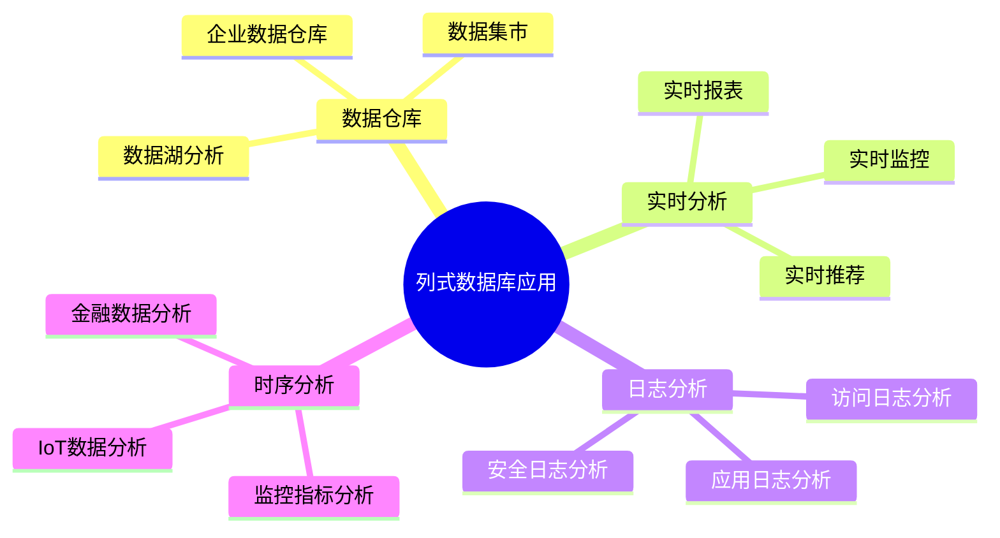
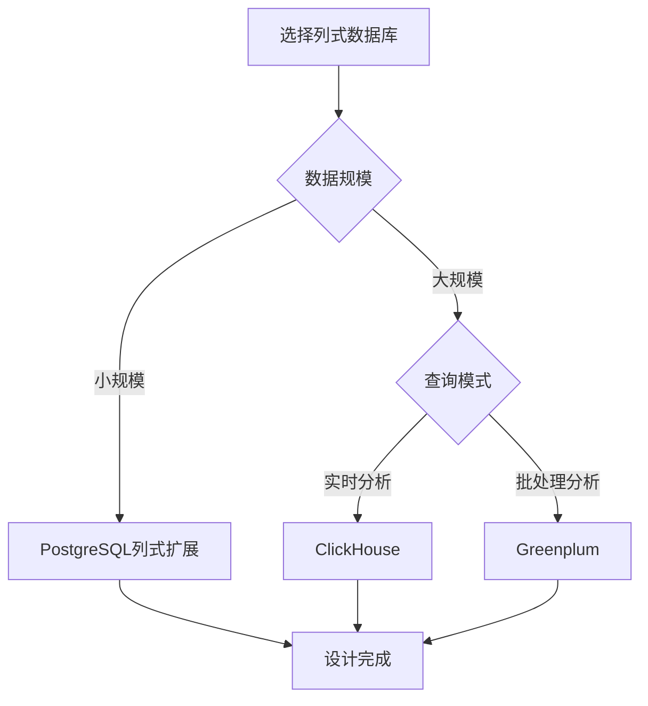
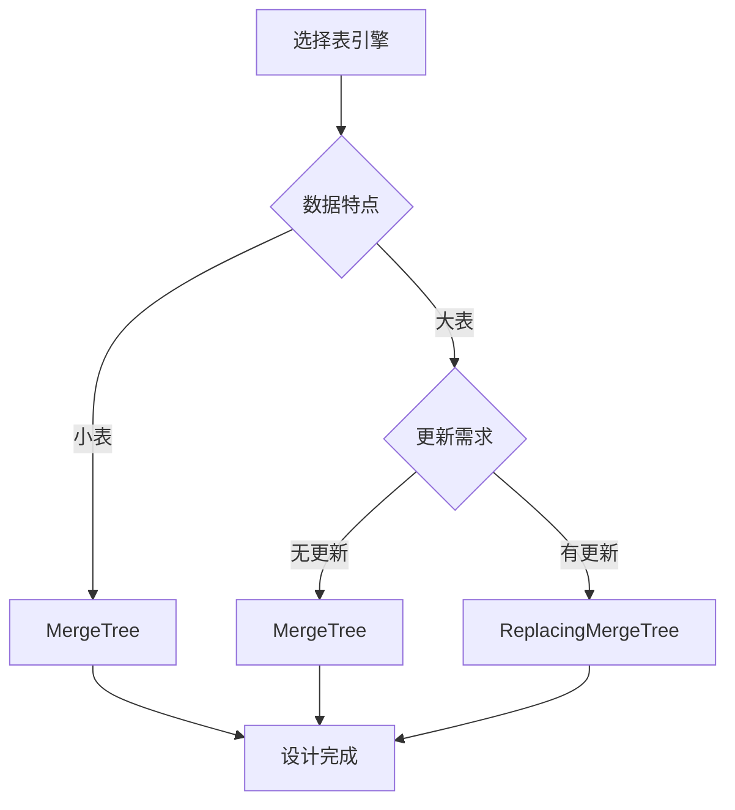
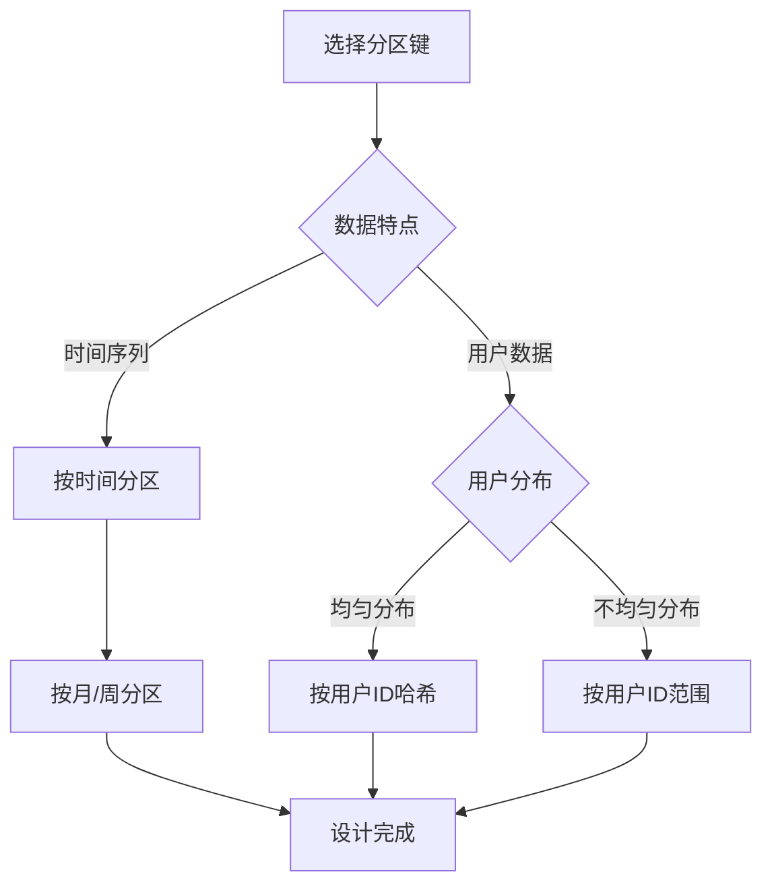
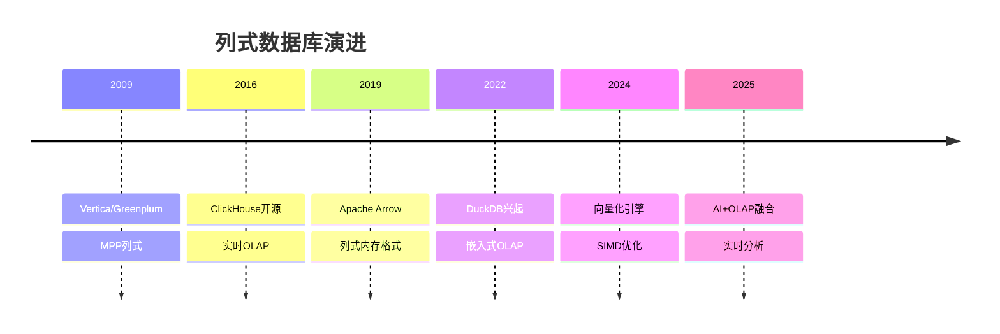

# 列式数据库设计模式：OLAP分析型数据库的高效设计

> **创建日期**：2025-01-15
> **最后更新**：2025-12-01
> **版本**：v2.0 (增强版)
> **状态**：已完成 ✅

---

## 📋 目录

- [列式数据库设计模式：OLAP分析型数据库的高效设计](#列式数据库设计模式olap分析型数据库的高效设计)
  - [📋 目录](#-目录)
  - [1. 概述](#1-概述)
    - [1.1. 列式数据库应用场景](#11-列式数据库应用场景)
    - [1.2. 列式数据库选择决策树](#12-列式数据库选择决策树)
  - [2. 列式数据库特性](#2-列式数据库特性)
    - [2.1. 列式存储特征](#21-列式存储特征)
    - [2.2. 列式vs行式对比](#22-列式vs行式对比)
  - [3. ClickHouse Schema设计](#3-clickhouse-schema设计)
    - [3.1. ClickHouse表引擎选择](#31-clickhouse表引擎选择)
    - [3.2. MergeTree引擎设计](#32-mergetree引擎设计)
    - [3.3. ReplacingMergeTree引擎设计](#33-replacingmergetree引擎设计)
    - [3.4. 物化视图设计](#34-物化视图设计)
  - [4. PostgreSQL列式存储设计](#4-postgresql列式存储设计)
    - [4.1. cstore\_fdw扩展设计](#41-cstore_fdw扩展设计)
    - [4.2. 列式分区设计](#42-列式分区设计)
  - [5. 列式数据库查询优化](#5-列式数据库查询优化)
    - [5.1. ClickHouse查询优化](#51-clickhouse查询优化)
    - [5.2. 聚合函数优化](#52-聚合函数优化)
  - [6. 列式数据库分区与排序键设计](#6-列式数据库分区与排序键设计)
    - [6.1. 分区键设计](#61-分区键设计)
    - [6.2. 排序键设计](#62-排序键设计)
  - [7. 实际应用案例](#7-实际应用案例)
    - [7.1. 数据仓库设计](#71-数据仓库设计)
    - [7.2. 实时日志分析系统设计](#72-实时日志分析系统设计)
  - [8. 2024-2025最新趋势](#8-2024-2025最新趋势)
    - [8.1. 列式数据库技术演进](#81-列式数据库技术演进)
    - [8.2. 列式数据库选型矩阵](#82-列式数据库选型矩阵)
    - [8.3. ClickHouse向量搜索](#83-clickhouse向量搜索)
  - [9. 参考资料](#9-参考资料)
    - [9.1. 权威文献](#91-权威文献)
    - [9.2. 在线资源](#92-在线资源)
    - [9.3. 相关文档](#93-相关文档)

---

## 1. 概述

列式数据库专门用于OLAP（在线分析处理），适合大规模数据分析、数据仓库等场景。

### 1.1. 列式数据库应用场景



### 1.2. 列式数据库选择决策树



---

## 2. 列式数据库特性

### 2.1. 列式存储特征

**列式存储定义**：

```text
列式存储 = {
    数据按列存储而非按行存储,
    相同类型数据连续存储,
    高压缩率,
    列式扫描优化
}

特征：
1. 列式存储：数据按列存储，相同类型数据连续
2. 高压缩率：相同类型数据压缩率高
3. 列式扫描：只扫描需要的列，减少I/O
4. 向量化执行：支持SIMD向量化计算
5. 适合聚合：适合SUM、AVG、COUNT等聚合操作
```

### 2.2. 列式vs行式对比

**存储模式对比矩阵**：

| 特性 | 行式存储 | 列式存储 |
|------|---------|---------|
| **存储方式** | 按行存储 | 按列存储 |
| **压缩率** | 低 | 高（5-10倍） |
| **查询性能** | 适合点查询 | 适合分析查询 |
| **写入性能** | 高 | 中等（批量写入） |
| **更新性能** | 高 | 低（不适合频繁更新） |
| **适用场景** | OLTP | OLAP |

---

## 3. ClickHouse Schema设计

### 3.1. ClickHouse表引擎选择

**表引擎选择决策树**：



### 3.2. MergeTree引擎设计

**基础MergeTree表设计**：

```sql
-- ClickHouse表设计
CREATE TABLE analytics.events
(
    event_id UInt64,
    user_id UInt64,
    event_type String,
    event_time DateTime,
    properties String,  -- JSON字符串
    session_id String
)
ENGINE = MergeTree()
PARTITION BY toYYYYMM(event_time)  -- 按月分区
ORDER BY (user_id, event_time)     -- 排序键
SETTINGS index_granularity = 8192;

-- 创建索引
ALTER TABLE analytics.events ADD INDEX idx_event_type event_type TYPE bloom_filter GRANULARITY 4;
ALTER TABLE analytics.events ADD INDEX idx_session_id session_id TYPE bloom_filter GRANULARITY 4;
```

### 3.3. ReplacingMergeTree引擎设计

**去重表设计**：

```sql
-- ReplacingMergeTree：自动去重
CREATE TABLE analytics.user_sessions
(
    user_id UInt64,
    session_id String,
    start_time DateTime,
    end_time DateTime,
    page_views UInt32,
    duration UInt32
)
ENGINE = ReplacingMergeTree(end_time)  -- 按end_time去重
PARTITION BY toYYYYMM(start_time)
ORDER BY (user_id, session_id);

-- 查询时去重
SELECT *
FROM analytics.user_sessions
FINAL;  -- FINAL关键字强制去重
```

### 3.4. 物化视图设计

**物化视图聚合**：

```sql
-- 创建物化视图（实时聚合）
CREATE MATERIALIZED VIEW analytics.event_stats_mv
ENGINE = SummingMergeTree()
PARTITION BY toYYYYMM(event_time)
ORDER BY (event_type, toStartOfHour(event_time))
AS SELECT
    event_type,
    toStartOfHour(event_time) AS hour,
    count() AS event_count,
    uniq(user_id) AS unique_users
FROM analytics.events
GROUP BY event_type, hour;

-- 查询物化视图
SELECT
    event_type,
    hour,
    sum(event_count) AS total_events,
    sum(unique_users) AS total_users
FROM analytics.event_stats_mv
GROUP BY event_type, hour
ORDER BY hour DESC;
```

---

## 4. PostgreSQL列式存储设计

### 4.1. cstore_fdw扩展设计

**cstore_fdw列式存储**：

```sql
-- 安装cstore_fdw扩展
CREATE EXTENSION IF NOT EXISTS cstore_fdw;

-- 创建外部服务器
CREATE SERVER cstore_server
FOREIGN DATA WRAPPER cstore_fdw;

-- 创建列式表
CREATE FOREIGN TABLE analytics.events_cstore
(
    event_id BIGINT,
    user_id BIGINT,
    event_type VARCHAR(50),
    event_time TIMESTAMPTZ,
    properties JSONB,
    session_id VARCHAR(100)
)
SERVER cstore_server
OPTIONS (
    compression 'pglz',
    stripe_row_count '150000'
);

-- 插入数据（批量插入性能好）
INSERT INTO analytics.events_cstore
SELECT * FROM analytics.events;

-- 查询（列式扫描）
SELECT event_type, COUNT(*)
FROM analytics.events_cstore
WHERE event_time >= '2024-01-01'
GROUP BY event_type;
```

### 4.2. 列式分区设计

**列式分区表设计**：

```sql
-- 创建分区表（按时间分区）
CREATE TABLE analytics.events_partitioned
(
    event_id BIGINT,
    user_id BIGINT,
    event_type VARCHAR(50),
    event_time TIMESTAMPTZ,
    properties JSONB,
    session_id VARCHAR(100)
) PARTITION BY RANGE (event_time);

-- 创建分区（按月）
CREATE TABLE analytics.events_2024_01 PARTITION OF analytics.events_partitioned
FOR VALUES FROM ('2024-01-01') TO ('2024-02-01');

CREATE TABLE analytics.events_2024_02 PARTITION OF analytics.events_partitioned
FOR VALUES FROM ('2024-02-01') TO ('2024-03-01');

-- 为每个分区创建列式存储
-- 注意：PostgreSQL不支持直接在分区上使用FDW，需要应用层处理
```

---

## 5. 列式数据库查询优化

### 5.1. ClickHouse查询优化

**查询优化技巧**：

```sql
-- ✅ 好的查询：使用排序键过滤
SELECT user_id, COUNT(*) AS event_count
FROM analytics.events
WHERE user_id = 12345
  AND event_time >= '2024-01-01'
GROUP BY user_id;

-- ✅ 使用PREWHERE优化（先过滤，再读取列）
SELECT event_type, COUNT(*)
FROM analytics.events
PREWHERE event_time >= '2024-01-01'  -- PREWHERE先过滤
WHERE event_type = 'click'
GROUP BY event_type;

-- ✅ 使用SAMPLE采样（大数据集）
SELECT event_type, COUNT(*) AS event_count
FROM analytics.events
SAMPLE 0.1  -- 采样10%
WHERE event_time >= '2024-01-01'
GROUP BY event_type;

-- ✅ 使用LIMIT BY（每组Top-K）
SELECT user_id, event_type, COUNT(*) AS event_count
FROM analytics.events
WHERE event_time >= '2024-01-01'
GROUP BY user_id, event_type
ORDER BY event_count DESC
LIMIT 10 BY user_id;  -- 每个用户Top 10事件类型
```

### 5.2. 聚合函数优化

**聚合函数使用**：

```sql
-- ✅ 使用uniqExact精确去重（小数据集）
SELECT uniqExact(user_id) AS unique_users
FROM analytics.events
WHERE event_time >= '2024-01-01';

-- ✅ 使用uniq近似去重（大数据集，性能更好）
SELECT uniq(user_id) AS unique_users_approx
FROM analytics.events
WHERE event_time >= '2024-01-01';

-- ✅ 使用quantile分位数
SELECT
    quantile(0.5)(duration) AS median_duration,
    quantile(0.95)(duration) AS p95_duration,
    quantile(0.99)(duration) AS p99_duration
FROM analytics.user_sessions
WHERE start_time >= '2024-01-01';

-- ✅ 使用window函数
SELECT
    user_id,
    event_time,
    event_type,
    count() OVER (PARTITION BY user_id ORDER BY event_time ROWS BETWEEN 6 PRECEDING AND CURRENT ROW) AS events_7d
FROM analytics.events
WHERE event_time >= '2024-01-01'
ORDER BY user_id, event_time;
```

---

## 6. 列式数据库分区与排序键设计

### 6.1. 分区键设计

**分区键选择决策树**：



**分区键设计示例**：

```sql
-- ✅ 好的分区：按时间分区（时间序列数据）
CREATE TABLE analytics.events
(
    event_id UInt64,
    user_id UInt64,
    event_time DateTime,
    ...
)
ENGINE = MergeTree()
PARTITION BY toYYYYMM(event_time)  -- 按月分区
ORDER BY (user_id, event_time);

-- ✅ 好的分区：按用户ID范围分区（用户数据）
CREATE TABLE analytics.user_events
(
    user_id UInt64,
    event_time DateTime,
    ...
)
ENGINE = MergeTree()
PARTITION BY intDiv(user_id, 1000000)  -- 每100万用户一个分区
ORDER BY (user_id, event_time);

-- ❌ 避免：分区过细（分区数过多）
-- PARTITION BY toYYYYMMDD(event_time)  -- 每天一个分区，分区数过多

-- ❌ 避免：分区键不在WHERE条件中
-- PARTITION BY user_id  -- 但查询时很少按user_id过滤
```

### 6.2. 排序键设计

**排序键设计原则**：

```sql
-- ✅ 好的排序键：高基数列在前，低基数列在后
CREATE TABLE analytics.events
(
    event_id UInt64,
    user_id UInt64,        -- 高基数
    event_time DateTime,   -- 高基数
    event_type String,     -- 低基数
    ...
)
ENGINE = MergeTree()
PARTITION BY toYYYYMM(event_time)
ORDER BY (user_id, event_time, event_type);  -- 高基数在前

-- ✅ 排序键包含常用过滤条件
-- 如果经常按(user_id, event_time)过滤，则ORDER BY (user_id, event_time)

-- ✅ 使用跳数索引优化低基数列查询
ALTER TABLE analytics.events ADD INDEX idx_event_type event_type TYPE set(100) GRANULARITY 4;
ALTER TABLE analytics.events ADD INDEX idx_session_id session_id TYPE bloom_filter(0.01) GRANULARITY 4;
```

---

## 7. 实际应用案例

### 7.1. 数据仓库设计

**完整数据仓库Schema设计**：

```sql
-- ClickHouse数据仓库设计

-- 事实表：订单事实表
CREATE TABLE dw.fact_orders
(
    order_id UInt64,
    user_id UInt64,
    product_id UInt64,
    order_date Date,
    order_time DateTime,
    quantity UInt32,
    amount Decimal(10,2),
    discount Decimal(10,2),
    final_amount Decimal(10,2),
    payment_method String,
    shipping_method String
)
ENGINE = MergeTree()
PARTITION BY toYYYYMM(order_date)
ORDER BY (user_id, order_date, product_id)
SETTINGS index_granularity = 8192;

-- 维度表：用户维度表
CREATE TABLE dw.dim_users
(
    user_id UInt64,
    username String,
    email String,
    age UInt8,
    gender String,
    city String,
    country String,
    registration_date Date,
    is_vip UInt8
)
ENGINE = ReplacingMergeTree(registration_date)
ORDER BY user_id;

-- 维度表：产品维度表
CREATE TABLE dw.dim_products
(
    product_id UInt64,
    product_name String,
    category String,
    brand String,
    price Decimal(10,2),
    created_date Date
)
ENGINE = ReplacingMergeTree(created_date)
ORDER BY product_id;

-- 物化视图：每日订单统计
CREATE MATERIALIZED VIEW dw.mv_daily_order_stats
ENGINE = SummingMergeTree()
PARTITION BY toYYYYMM(order_date)
ORDER BY (order_date, product_id)
AS SELECT
    order_date,
    product_id,
    count() AS order_count,
    sum(quantity) AS total_quantity,
    sum(final_amount) AS total_amount,
    uniq(user_id) AS unique_users
FROM dw.fact_orders
GROUP BY order_date, product_id;

-- 查询每日统计
SELECT
    order_date,
    sum(order_count) AS total_orders,
    sum(total_quantity) AS total_items,
    sum(total_amount) AS total_revenue,
    sum(unique_users) AS total_customers
FROM dw.mv_daily_order_stats
WHERE order_date >= '2024-01-01'
GROUP BY order_date
ORDER BY order_date DESC;
```

### 7.2. 实时日志分析系统设计

**日志分析系统Schema设计**：

```sql
-- ClickHouse日志分析系统

-- 原始日志表
CREATE TABLE logs.raw_logs
(
    log_id UInt64,
    timestamp DateTime,
    level String,
    service String,
    host String,
    message String,
    trace_id String,
    user_id UInt64,
    request_id String,
    duration_ms UInt32,
    status_code UInt16,
    metadata String  -- JSON字符串
)
ENGINE = MergeTree()
PARTITION BY toYYYYMMDD(timestamp)
ORDER BY (service, timestamp, level)
TTL timestamp + INTERVAL 30 DAY  -- 30天后自动删除
SETTINGS index_granularity = 8192;

-- 创建索引
ALTER TABLE logs.raw_logs ADD INDEX idx_trace_id trace_id TYPE bloom_filter GRANULARITY 4;
ALTER TABLE logs.raw_logs ADD INDEX idx_user_id user_id TYPE bloom_filter GRANULARITY 4;

-- 错误日志物化视图
CREATE MATERIALIZED VIEW logs.mv_error_logs
ENGINE = MergeTree()
PARTITION BY toYYYYMMDD(timestamp)
ORDER BY (service, timestamp)
AS SELECT
    timestamp,
    service,
    host,
    message,
    trace_id,
    user_id,
    status_code,
    metadata
FROM logs.raw_logs
WHERE level = 'ERROR';

-- 服务统计物化视图
CREATE MATERIALIZED VIEW logs.mv_service_stats
ENGINE = SummingMergeTree()
PARTITION BY toYYYYMMDD(timestamp)
ORDER BY (service, toStartOfHour(timestamp))
AS SELECT
    service,
    toStartOfHour(timestamp) AS hour,
    count() AS log_count,
    countIf(level = 'ERROR') AS error_count,
    countIf(level = 'WARN') AS warn_count,
    avg(duration_ms) AS avg_duration,
    quantile(0.95)(duration_ms) AS p95_duration,
    uniq(user_id) AS unique_users
FROM logs.raw_logs
GROUP BY service, hour;

-- 查询服务统计
SELECT
    service,
    hour,
    sum(log_count) AS total_logs,
    sum(error_count) AS total_errors,
    sum(warn_count) AS total_warnings,
    avg(avg_duration) AS avg_duration,
    max(p95_duration) AS max_p95_duration
FROM logs.mv_service_stats
WHERE hour >= now() - INTERVAL 24 HOUR
GROUP BY service, hour
ORDER BY service, hour DESC;
```

---

## 8. 2024-2025最新趋势

### 8.1. 列式数据库技术演进



### 8.2. 列式数据库选型矩阵

| 数据库 | 部署模式 | 实时性 | 向量支持 | 适用场景 |
|-------|---------|--------|---------|---------|
| **ClickHouse** | 分布式 | 极高 | ✅ | 实时分析 |
| **DuckDB** | 嵌入式 | 高 | ✅ | 本地分析 |
| **Apache Druid** | 分布式 | 高 | ❌ | 时序分析 |
| **StarRocks** | 分布式 | 极高 | ❌ | MPP分析 |
| **Apache Doris** | 分布式 | 高 | ❌ | 实时数仓 |

### 8.3. ClickHouse向量搜索

```sql
-- ClickHouse向量扩展（2024+）
CREATE TABLE vectors.embeddings (
    id UInt64,
    content String,
    embedding Array(Float32),  -- 向量字段
    created_at DateTime DEFAULT now()
) ENGINE = MergeTree()
ORDER BY id;

-- 向量相似度搜索
SELECT
    id,
    content,
    L2Distance(embedding, [0.1, 0.2, ...]) AS distance
FROM vectors.embeddings
ORDER BY distance ASC
LIMIT 10;

-- 使用ANN索引加速
ALTER TABLE vectors.embeddings
ADD INDEX embedding_idx embedding TYPE annoy(100);
```

---

## 9. 参考资料

### 9.1. 权威文献

**列式存储理论**：

- Abadi, D. et al. (2006). "Integrating Compression and Execution in Column-Oriented Database Systems"
- Stonebraker, M. et al. (2005). "C-Store: A Column-oriented DBMS"

### 9.2. 在线资源

| 资源 | URL | 描述 |
|------|-----|------|
| **ClickHouse文档** | <https://clickhouse.com/docs/> | 官方文档 |
| **DuckDB文档** | <https://duckdb.org/docs/> | 嵌入式OLAP |
| **Apache Arrow** | <https://arrow.apache.org/> | 列式格式 |

### 9.3. 相关文档

- [07.18-时序数据库设计模式](./07.18-时序数据库设计模式.md)
- [07.08-数据库性能调优实战](./07.08-数据库性能调优实战.md)

---

**最后更新**：2025-12-01
**维护者**：Data-Science Team
**状态**：已完成 ✅
**版本**：v2.0 (增强版)
