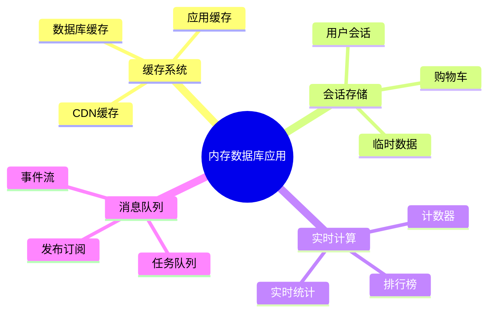
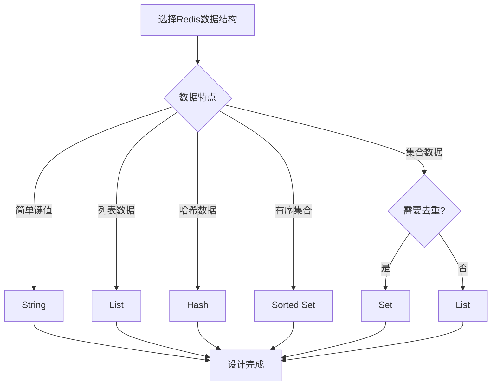
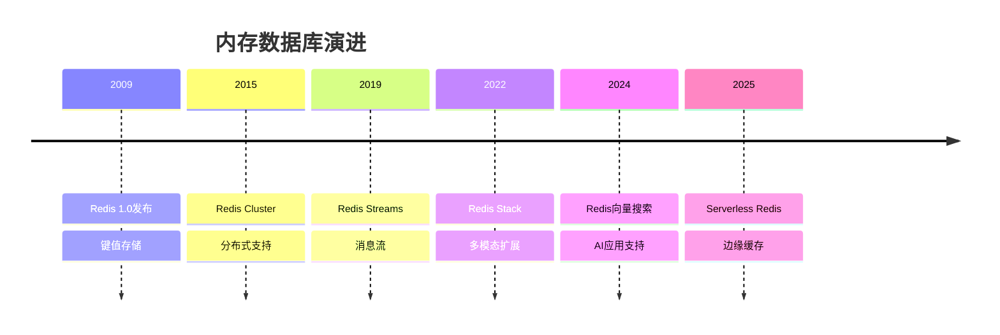
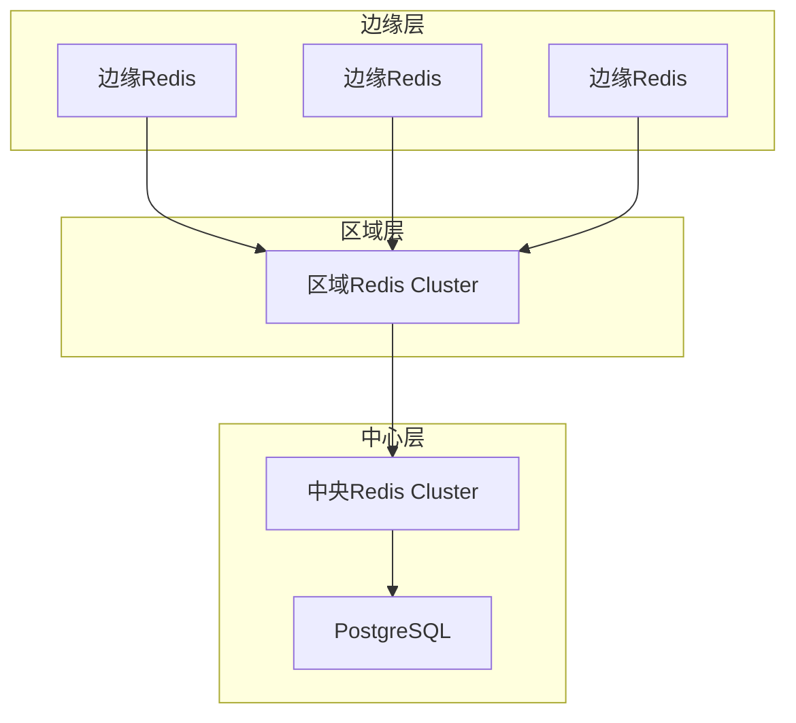

# 内存数据库设计模式：Redis缓存与数据结构设计

> **创建日期**：2025-01-15
> **最后更新**：2025-12-01
> **版本**：v2.0 (增强版)
> **状态**：已完成 ✅

---

## 📋 目录

- [内存数据库设计模式：Redis缓存与数据结构设计](#内存数据库设计模式redis缓存与数据结构设计)
  - [📋 目录](#-目录)
  - [1. 概述](#1-概述)
    - [1.1. 内存数据库应用场景](#11-内存数据库应用场景)
    - [1.2. Redis数据结构选择决策树](#12-redis数据结构选择决策树)
  - [2. Redis数据结构选择](#2-redis数据结构选择)
    - [2.1. 数据结构对比矩阵](#21-数据结构对比矩阵)
    - [2.2. 数据结构选择原则](#22-数据结构选择原则)
  - [3. 缓存设计模式](#3-缓存设计模式)
    - [3.1. 缓存模式对比](#31-缓存模式对比)
    - [3.2. Cache-Aside模式实现](#32-cache-aside模式实现)
    - [3.3. Write-Through模式实现](#33-write-through模式实现)
  - [4. Redis Schema设计](#4-redis-schema设计)
    - [4.1. 用户信息存储设计](#41-用户信息存储设计)
    - [4.2. 排行榜设计](#42-排行榜设计)
    - [4.3. 购物车设计](#43-购物车设计)
    - [4.4. 计数器设计](#44-计数器设计)
  - [5. Redis持久化与高可用](#5-redis持久化与高可用)
    - [5.1. 持久化策略](#51-持久化策略)
    - [5.2. Redis配置示例](#52-redis配置示例)
    - [5.3. Redis高可用设计](#53-redis高可用设计)
  - [6. Redis性能优化](#6-redis性能优化)
    - [6.1. 键命名规范](#61-键命名规范)
    - [6.2. 批量操作优化](#62-批量操作优化)
    - [6.3. 内存优化](#63-内存优化)
  - [7. 实际应用案例](#7-实际应用案例)
    - [7.1. 分布式锁设计](#71-分布式锁设计)
    - [7.2. 限流设计](#72-限流设计)
    - [7.3. 消息队列设计](#73-消息队列设计)
  - [8. 2024-2025最新趋势](#8-2024-2025最新趋势)
    - [8.1. 内存数据库技术演进](#81-内存数据库技术演进)
    - [8.2. 内存数据库选型矩阵](#82-内存数据库选型矩阵)
    - [8.3. Redis向量搜索](#83-redis向量搜索)
    - [8.4. 边缘缓存架构](#84-边缘缓存架构)
  - [9. 参考资料](#9-参考资料)
    - [9.1. 权威文献](#91-权威文献)
    - [9.2. 在线资源](#92-在线资源)
    - [9.3. 相关文档](#93-相关文档)

---

## 1. 概述

内存数据库以内存为主要存储介质，提供极高的读写性能，广泛应用于缓存、会话存储、实时计算等场景。

### 1.1. 内存数据库应用场景



### 1.2. Redis数据结构选择决策树



---

## 2. Redis数据结构选择

### 2.1. 数据结构对比矩阵

**Redis数据结构对比**：

| 数据结构 | 特点 | 适用场景 | 时间复杂度 |
|---------|------|---------|-----------|
| **String** | 简单键值对 | 缓存、计数器 | O(1) |
| **Hash** | 字段-值映射 | 对象存储、用户信息 | O(1) |
| **List** | 有序列表 | 队列、时间线 | O(1) |
| **Set** | 无序集合 | 标签、关注关系 | O(1) |
| **Sorted Set** | 有序集合 | 排行榜、范围查询 | O(log N) |
| **Stream** | 消息流 | 消息队列、事件流 | O(1) |
| **Bitmap** | 位图 | 布隆过滤器、签到 | O(1) |
| **HyperLogLog** | 基数估算 | 去重统计 | O(1) |

### 2.2. 数据结构选择原则

**选择原则**：

```text
1. 简单数据 → String
2. 对象数据 → Hash
3. 列表数据 → List
4. 集合数据 → Set
5. 有序集合 → Sorted Set
6. 消息流 → Stream
7. 位操作 → Bitmap
8. 基数统计 → HyperLogLog
```

---

## 3. 缓存设计模式

### 3.1. 缓存模式对比

**缓存模式对比矩阵**：

| 模式 | 特点 | 适用场景 | 优缺点 |
|------|------|---------|--------|
| **Cache-Aside** | 应用层管理缓存 | 读多写少 | ✅ 灵活 ❌ 代码复杂 |
| **Write-Through** | 写时同时更新缓存和数据库 | 写多读少 | ✅ 一致性 ❌ 写入慢 |
| **Write-Back** | 先写缓存，异步写数据库 | 高写入 | ✅ 性能高 ❌ 可能丢数据 |
| **Read-Through** | 缓存自动加载数据 | 读多写少 | ✅ 透明 ❌ 缓存失效复杂 |

### 3.2. Cache-Aside模式实现

**Cache-Aside模式Schema**：

```python
# Python示例：Cache-Aside模式
import redis
import json
from typing import Optional, Dict

class CacheAside:
    def __init__(self, redis_client: redis.Redis):
        self.redis = redis_client
        self.cache_ttl = 3600  # 1小时

    def get_user(self, user_id: int) -> Optional[Dict]:
        # 1. 先查缓存
        cache_key = f"user:{user_id}"
        cached_data = self.redis.get(cache_key)

        if cached_data:
            return json.loads(cached_data)

        # 2. 缓存未命中，查数据库
        user_data = self._get_user_from_db(user_id)

        if user_data:
            # 3. 写入缓存
            self.redis.setex(
                cache_key,
                self.cache_ttl,
                json.dumps(user_data)
            )

        return user_data

    def update_user(self, user_id: int, user_data: Dict):
        # 1. 更新数据库
        self._update_user_in_db(user_id, user_data)

        # 2. 删除缓存（或更新缓存）
        cache_key = f"user:{user_id}"
        self.redis.delete(cache_key)
        # 或者更新缓存
        # self.redis.setex(cache_key, self.cache_ttl, json.dumps(user_data))

    def _get_user_from_db(self, user_id: int) -> Optional[Dict]:
        # 数据库查询逻辑
        pass

    def _update_user_in_db(self, user_id: int, user_data: Dict):
        # 数据库更新逻辑
        pass
```

### 3.3. Write-Through模式实现

**Write-Through模式Schema**：

```python
class WriteThrough:
    def __init__(self, redis_client: redis.Redis):
        self.redis = redis_client
        self.cache_ttl = 3600

    def set_user(self, user_id: int, user_data: Dict):
        cache_key = f"user:{user_id}"

        # 1. 同时更新缓存和数据库
        self.redis.setex(
            cache_key,
            self.cache_ttl,
            json.dumps(user_data)
        )
        self._update_user_in_db(user_id, user_data)

    def get_user(self, user_id: int) -> Optional[Dict]:
        cache_key = f"user:{user_id}"
        cached_data = self.redis.get(cache_key)

        if cached_data:
            return json.loads(cached_data)

        # 缓存未命中，从数据库加载
        user_data = self._get_user_from_db(user_id)

        if user_data:
            self.redis.setex(
                cache_key,
                self.cache_ttl,
                json.dumps(user_data)
            )

        return user_data
```

---

## 4. Redis Schema设计

### 4.1. 用户信息存储设计

**Hash结构存储用户信息**：

```redis
# 用户信息存储（Hash）
HSET user:123 username "alice"
HSET user:123 email "alice@example.com"
HSET user:123 age 30
HSET user:123 city "New York"

# 批量设置
HMSET user:123 username "alice" email "alice@example.com" age 30 city "New York"

# 获取所有字段
HGETALL user:123

# 获取单个字段
HGET user:123 email

# 设置过期时间
EXPIRE user:123 3600
```

**Python实现**：

```python
class UserCache:
    def __init__(self, redis_client: redis.Redis):
        self.redis = redis_client

    def set_user(self, user_id: int, user_data: Dict):
        cache_key = f"user:{user_id}"
        self.redis.hset(cache_key, mapping=user_data)
        self.redis.expire(cache_key, 3600)

    def get_user(self, user_id: int) -> Optional[Dict]:
        cache_key = f"user:{user_id}"
        return self.redis.hgetall(cache_key)

    def get_user_field(self, user_id: int, field: str) -> Optional[str]:
        cache_key = f"user:{user_id}"
        return self.redis.hget(cache_key, field)
```

### 4.2. 排行榜设计

**Sorted Set结构存储排行榜**：

```redis
# 排行榜（Sorted Set）
ZADD leaderboard:2024-01 1000 "user:123"
ZADD leaderboard:2024-01 2000 "user:456"
ZADD leaderboard:2024-01 1500 "user:789"

# 获取Top 10
ZREVRANGE leaderboard:2024-01 0 9 WITHSCORES

# 获取用户排名
ZREVRANK leaderboard:2024-01 "user:123"

# 获取用户分数
ZSCORE leaderboard:2024-01 "user:123"

# 范围查询（1000-2000分）
ZRANGEBYSCORE leaderboard:2024-01 1000 2000 WITHSCORES

# 增加分数
ZINCRBY leaderboard:2024-01 100 "user:123"
```

**Python实现**：

```python
class Leaderboard:
    def __init__(self, redis_client: redis.Redis):
        self.redis = redis_client

    def add_score(self, leaderboard_key: str, user_id: str, score: float):
        self.redis.zadd(leaderboard_key, {user_id: score})

    def increment_score(self, leaderboard_key: str, user_id: str, increment: float):
        self.redis.zincrby(leaderboard_key, increment, user_id)

    def get_top_n(self, leaderboard_key: str, n: int = 10) -> List[Tuple[str, float]]:
        return self.redis.zrevrange(leaderboard_key, 0, n-1, withscores=True)

    def get_rank(self, leaderboard_key: str, user_id: str) -> Optional[int]:
        rank = self.redis.zrevrank(leaderboard_key, user_id)
        return rank + 1 if rank is not None else None

    def get_score(self, leaderboard_key: str, user_id: str) -> Optional[float]:
        return self.redis.zscore(leaderboard_key, user_id)
```

### 4.3. 购物车设计

**Hash结构存储购物车**：

```redis
# 购物车（Hash）
HSET cart:user:123 product:456 quantity 2
HSET cart:user:123 product:789 quantity 1

# 增加商品数量
HINCRBY cart:user:123 product:456 quantity 1

# 删除商品
HDEL cart:user:123 product:789

# 获取购物车所有商品
HGETALL cart:user:123

# 设置购物车过期时间（7天）
EXPIRE cart:user:123 604800
```

**Python实现**：

```python
class ShoppingCart:
    def __init__(self, redis_client: redis.Redis):
        self.redis = redis_client
        self.cart_ttl = 604800  # 7天

    def add_item(self, user_id: int, product_id: int, quantity: int = 1):
        cart_key = f"cart:user:{user_id}"
        self.redis.hincrby(cart_key, f"product:{product_id}", quantity)
        self.redis.expire(cart_key, self.cart_ttl)

    def remove_item(self, user_id: int, product_id: int):
        cart_key = f"cart:user:{user_id}"
        self.redis.hdel(cart_key, f"product:{product_id}")

    def get_cart(self, user_id: int) -> Dict[str, int]:
        cart_key = f"cart:user:{user_id}"
        cart_data = self.redis.hgetall(cart_key)
        return {k.decode(): int(v) for k, v in cart_data.items()}

    def clear_cart(self, user_id: int):
        cart_key = f"cart:user:{user_id}"
        self.redis.delete(cart_key)
```

### 4.4. 计数器设计

**String结构存储计数器**：

```redis
# 计数器（String）
SET counter:page:views:123 0
INCR counter:page:views:123
INCRBY counter:page:views:123 10

# 获取计数器值
GET counter:page:views:123

# 设置过期时间
EXPIRE counter:page:views:123 86400
```

**Python实现**：

```python
class Counter:
    def __init__(self, redis_client: redis.Redis):
        self.redis = redis_client

    def increment(self, counter_key: str, amount: int = 1) -> int:
        return self.redis.incrby(counter_key, amount)

    def decrement(self, counter_key: str, amount: int = 1) -> int:
        return self.redis.decrby(counter_key, amount)

    def get_value(self, counter_key: str) -> int:
        value = self.redis.get(counter_key)
        return int(value) if value else 0

    def reset(self, counter_key: str):
        self.redis.delete(counter_key)
```

---

## 5. Redis持久化与高可用

### 5.1. 持久化策略

**持久化策略对比**：

| 策略 | 特点 | 适用场景 | 优缺点 |
|------|------|---------|--------|
| **RDB** | 快照备份 | 数据备份 | ✅ 文件小 ❌ 可能丢数据 |
| **AOF** | 追加日志 | 数据安全 | ✅ 不丢数据 ❌ 文件大 |
| **RDB+AOF** | 混合模式 | 生产环境 | ✅ 兼顾性能和安全 |

### 5.2. Redis配置示例

**Redis配置文件（redis.conf）**：

```conf
# RDB持久化配置
save 900 1      # 900秒内至少1个key变化
save 300 10     # 300秒内至少10个key变化
save 60 10000   # 60秒内至少10000个key变化

# AOF持久化配置
appendonly yes
appendfsync everysec  # 每秒同步一次

# 混合持久化（Redis 4.0+）
aof-use-rdb-preamble yes

# 内存限制
maxmemory 2gb
maxmemory-policy allkeys-lru  # LRU淘汰策略
```

### 5.3. Redis高可用设计

**Redis Sentinel配置**：

```conf
# sentinel.conf
sentinel monitor mymaster 127.0.0.1 6379 2
sentinel down-after-milliseconds mymaster 5000
sentinel failover-timeout mymaster 10000
sentinel parallel-syncs mymaster 1
```

**Redis Cluster配置**：

```conf
# cluster.conf
cluster-enabled yes
cluster-config-file nodes.conf
cluster-node-timeout 15000
```

---

## 6. Redis性能优化

### 6.1. 键命名规范

**键命名规范**：

```text
规范：
1. 使用冒号分隔层级：user:123:profile
2. 使用有意义的命名：避免随机字符串
3. 控制键长度：避免过长的键名
4. 使用命名空间：app:module:key

示例：
✅ user:123:profile
✅ session:abc123
✅ cart:user:123
❌ u:123:p
❌ key1234567890abcdef
```

### 6.2. 批量操作优化

**批量操作示例**：

```python
# ❌ 不好的做法：循环单个操作
for user_id in user_ids:
    redis.get(f"user:{user_id}")

# ✅ 好的做法：使用Pipeline批量操作
pipe = redis.pipeline()
for user_id in user_ids:
    pipe.get(f"user:{user_id}")
results = pipe.execute()

# ✅ 使用MGET批量获取
keys = [f"user:{user_id}" for user_id in user_ids]
results = redis.mget(keys)
```

### 6.3. 内存优化

**内存优化技巧**：

```python
# ✅ 使用Hash存储多个字段（节省内存）
redis.hset("user:123", mapping={
    "username": "alice",
    "email": "alice@example.com",
    "age": "30"
})

# ❌ 避免：使用多个String键
redis.set("user:123:username", "alice")
redis.set("user:123:email", "alice@example.com")
redis.set("user:123:age", "30")

# ✅ 设置合理的过期时间
redis.setex("session:abc123", 3600, session_data)

# ✅ 使用压缩（如果Redis支持）
# 对于大value，考虑压缩后存储
```

---

## 7. 实际应用案例

### 7.1. 分布式锁设计

**分布式锁实现**：

```python
import time
import uuid

class DistributedLock:
    def __init__(self, redis_client: redis.Redis):
        self.redis = redis_client

    def acquire_lock(self, lock_key: str, timeout: int = 10) -> Optional[str]:
        """
        获取分布式锁
        返回：锁的标识符（用于释放锁）
        """
        lock_id = str(uuid.uuid4())
        end_time = time.time() + timeout

        while time.time() < end_time:
            # 尝试获取锁
            if self.redis.set(
                lock_key,
                lock_id,
                nx=True,  # 只在key不存在时设置
                ex=timeout  # 设置过期时间
            ):
                return lock_id

            # 等待一小段时间后重试
            time.sleep(0.001)

        return None

    def release_lock(self, lock_key: str, lock_id: str) -> bool:
        """
        释放分布式锁（使用Lua脚本保证原子性）
        """
        lua_script = """
        if redis.call("get", KEYS[1]) == ARGV[1] then
            return redis.call("del", KEYS[1])
        else
            return 0
        end
        """

        result = self.redis.eval(lua_script, 1, lock_key, lock_id)
        return result == 1

    def __enter__(self):
        lock_id = self.acquire_lock(self.lock_key, self.timeout)
        if not lock_id:
            raise Exception("Failed to acquire lock")
        self.lock_id = lock_id
        return self

    def __exit__(self, exc_type, exc_val, exc_tb):
        self.release_lock(self.lock_key, self.lock_id)
```

### 7.2. 限流设计

**限流实现（滑动窗口）**：

```python
class RateLimiter:
    def __init__(self, redis_client: redis.Redis):
        self.redis = redis_client

    def is_allowed(self, key: str, limit: int, window: int) -> bool:
        """
        滑动窗口限流
        limit: 限制次数
        window: 时间窗口（秒）
        """
        current_time = int(time.time())
        window_start = current_time - window + 1

        # 使用Sorted Set存储请求时间戳
        pipe = self.redis.pipeline()
        pipe.zremrangebyscore(key, 0, window_start - 1)  # 删除过期记录
        pipe.zcard(key)  # 获取当前窗口内的请求数
        pipe.zadd(key, {str(current_time): current_time})  # 添加当前请求
        pipe.expire(key, window)  # 设置过期时间

        results = pipe.execute()
        current_count = results[1]

        return current_count < limit
```

### 7.3. 消息队列设计

**简单消息队列实现**：

```python
class MessageQueue:
    def __init__(self, redis_client: redis.Redis):
        self.redis = redis_client

    def push(self, queue_name: str, message: str):
        """推送消息到队列"""
        self.redis.lpush(queue_name, message)

    def pop(self, queue_name: str, timeout: int = 0) -> Optional[str]:
        """从队列弹出消息"""
        if timeout > 0:
            result = self.redis.brpop(queue_name, timeout=timeout)
            return result[1].decode() if result else None
        else:
            result = self.redis.rpop(queue_name)
            return result.decode() if result else None

    def get_length(self, queue_name: str) -> int:
        """获取队列长度"""
        return self.redis.llen(queue_name)
```

---

## 8. 2024-2025最新趋势

### 8.1. 内存数据库技术演进



### 8.2. 内存数据库选型矩阵

| 数据库 | 类型 | 持久化 | 向量支持 | 适用场景 |
|-------|------|--------|---------|---------|
| **Redis** | 键值+多结构 | ✅ | Redis Stack | 通用缓存 |
| **Memcached** | 纯键值 | ❌ | ❌ | 简单缓存 |
| **Dragonfly** | Redis兼容 | ✅ | ✅ | 高性能替代 |
| **KeyDB** | Redis分支 | ✅ | ❌ | 多线程 |
| **Valkey** | Redis分支 | ✅ | ✅ | 开源替代 |

### 8.3. Redis向量搜索

```python
# Redis Stack向量搜索示例
import redis
from redis.commands.search.field import VectorField, TextField
from redis.commands.search.indexDefinition import IndexDefinition, IndexType

# 创建向量索引
schema = [
    TextField("content"),
    VectorField("embedding",
        "HNSW", {
            "TYPE": "FLOAT32",
            "DIM": 1536,
            "DISTANCE_METRIC": "COSINE"
        }
    )
]

r = redis.Redis()
r.ft("doc_idx").create_index(
    schema,
    definition=IndexDefinition(prefix=["doc:"], index_type=IndexType.HASH)
)

# 向量搜索
query_vector = [0.1, 0.2, ...]  # 1536维
query = f"*=>[KNN 10 @embedding $vec AS score]"
results = r.ft("doc_idx").search(
    query,
    query_params={"vec": np.array(query_vector).tobytes()}
)
```

### 8.4. 边缘缓存架构



---

## 9. 参考资料

### 9.1. 权威文献

**内存数据库**：

- Carlson, J. "Redis in Action"
- Redis Labs "Redis University"

### 9.2. 在线资源

| 资源 | URL | 描述 |
|------|-----|------|
| **Redis文档** | <https://redis.io/docs/> | 官方文档 |
| **Redis Stack** | <https://redis.io/docs/stack/> | 多模态扩展 |
| **Dragonfly** | <https://www.dragonflydb.io/> | 高性能替代 |

### 9.3. 相关文档

- [07.08-数据库性能调优实战](./07.08-数据库性能调优实战.md)
- [07.17-分布式数据库设计模式](./07.17-分布式数据库设计模式.md)
- [07.10-向量数据库设计](./07.10-向量数据库设计.md)

---

**最后更新**：2025-12-01
**维护者**：Data-Science Team
**状态**：已完成 ✅
**版本**：v2.0 (增强版)
